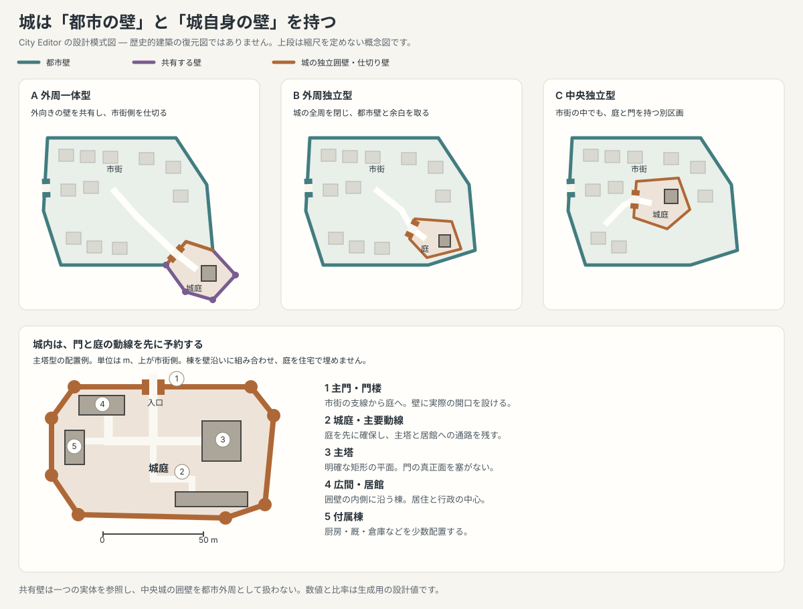

# City Editor — 城郭生成と都市城壁の設計

調査日: 2026-09-29。状態: **設計案。生成・描画・保存形式の実装は未変更**。

城を「castle 地区に大きな建物を散布するもの」から、**囲壁・門・中庭・主塔/居館・付属棟を持つ一つの城郭**へ置き換える。配置は都市外周を優先し、中央配置も明示的に扱う。都市城壁と城郭囲壁は別の防御境界であり、共有する部分だけ同じ実体を参照する。

既存の [design.md](design.md)、[generation-process.md](generation-process.md) に対する追加設計。本書の型・関数名は提案であり、現行 API ではない。City Generator の [wall-patterns.md](../city-generator/wall-patterns.md) は背景資料とし、実装先は `src/city-editor/` に限定する。

## 1. Highvale から読み取れること

`temp/samples/highvale.svg` をブラウザで描画して確認した。SVG には城を示す意味属性が無いため、以下は図形の観察である。史実の都市図ではなく、生成結果の視覚的な参考として扱う。

- 城と解釈できる区画は**画面右下**。都市外周から張り出した多角形の囲壁、大きな複合平面の建物、建物を囲む空地がある。
- 城の市街側にも斜めの壁があり、その途中に双塔状の門がある。城は市街に開放された普通の街区とは異なる。
- 張り出した外向きの壁が都市防御の外周を兼ね、市街側の仕切り壁が城だけを閉じる。都市の外周と城の全周を同じループにすると、この関係が失われる。
- 都市門は上部左右、城門は右下の区画入口に見える。城門を都市門の予算に数えない。
- 図の中央にも大きな建物があるが、独立した囲壁は見えない。これを城と断定しない。

採用するのは「外周への張り出し」「市街に対する独立した入口」「読み取れる中庭」であり、建物の凹凸をそのまま模写することではない。

## 2. 歴史調査と設計への反映

主対象は11〜15世紀の城郭。中世ヨーロッパ全体の配置頻度を示す統計は今回の資料から得ていない。英国・ウェールズの資料に加え、フランス・ドイツの史例を確認したが、地域別の網羅的分類ではない。近世の星形要塞は別の生成系にする。

### 2.1 配置は地形・都市との関係・形成順序で決まる

| 確認した史例 | 資料にある特徴 | CE で表現する判断 |
| --- | --- | --- |
| ロンドン塔 | テムズ北岸、ローマ都市壁の南東隅に立地 | 外周・河岸・旧防御線の組合せを候補にする。[Historic Royal Palaces の管理計画](https://www.hrp.org.uk/media/1490/2016-03-31_tol_whsmanagementplan_v1.pdf) |
| Conwy / Caernarfon | 城と付属する城壁都市、水際との関係が重要な防御・行政・経済の複合体 | 城と都市を一緒に計画し、水側と市街側の出入口を分ける。[UNESCO](https://whc.unesco.org/en/list/374/) |
| Carcassonne の Château Comtal | 矩形の城郭が深い堀で市街と分離され、市街側と Aude 側に堡塁を持つ | 都市に属していても、城は市街側への防御と独立したアクセスを持つ。[市の城郭解説](https://www.carcassonne.fr/article-page/chateau-comtal) |
| Old Sarum | 既存の丘砦を利用し、その中央にモットを築く。外側には町と宗教施設 | 中央型にも固有の囲壁・空地・門を持たせる。先行する城の周囲へ町が成長する型を許す。[Historic England](https://historicengland.org.uk/listing/the-list/list-entry/1015675) |
| Richmond | Swale 川の崖上。囲壁の内側に主要な居住建物が並ぶ | 河岸の高所を評価し、建物を壁沿いに配置して庭を残す。[English Heritage](https://www.english-heritage.org.uk/visit/places/richmond-castle/history-and-stories/description/) |
| Burghausen | 川と湖の間の岩の尾根上。主城と五つの外庭がそれぞれ防御区画を形成 | 地形で細長くなる城と、門を通って連続する複数の庭を拡張型として扱う。[Bavarian Palace Administration](https://www.schloesser.bayern.de/englisch/palace/objects/burghaus.htm) |

これらから、外周配置の生成理由として「地形の防御性」「水路・交通の支配」「市街から独立した城域」を評価する。一方、中央配置の理由には「先行する城の周囲への都市成長」「中央の高所や旧防御施設」を用意する。これは史例を生成規則に翻訳した**設計上の推論**であり、すべての城の成立理由を説明するものではない。

「現在の都市の中心」と「築城時の都市の中心」を同一視しない。生成時点の中央城は、後から市街に囲まれた城としても表現できる。中央型でも城を市場広場の中心に重ねない。

### 2.2 形状は防御だけでなく居住・行政を表す

城は領主の居住・行政の拠点でもある。主塔の有無や形、庭の数、付属棟は時期によって変化し、常に中央に巨大な主塔があるわけではない。主塔型・シェルキープ型・主塔を強調しない囲郭型・二重囲壁型を区別する。[Historic England, Stone Castles, pp.1, 4–6](https://historicengland.org.uk/images-books/publications/iha-stone-castles/heag235-stone-castles/)

Middleham では矩形の囲壁が主塔を囲み、囲壁内側に居室や付属施設を設けた。城門も時代とともに変わっている。CE では「主塔と庭」「壁沿いの居館」「入口の動線」を組み合わせ、任意の凹凸を一個の建物に足す方式を避ける。[English Heritage, Middleham](https://www.english-heritage.org.uk/visit/places/middleham-castle/history/description/)

Carcassonne には都市の二重城壁と、城固有の囲壁がある。城の二重囲壁と都市の二重城壁は別の設定とする。現存の外観には19世紀の復元も含まれるため、現代の外観だけを中世の唯一の標準にしない。[市の都市城壁解説](https://www.carcassonne.fr/article-page/la-cite-medievale)

Conwy の都市壁は約3/4マイルに21塔・当初の3門を持つ。塔・門の数はセル数と一致するものではない。CE では角部・区間長・主要道を基準とし、値は調整可能な生成設定にする。[Cadw, Conwy Town Walls](https://cadw.gov.wales/visit/places-to-visit/conwy-town-walls)

## 3. 現行実装の問題と置換範囲

| 箇所 | 現在の処理 | 置換・変更 |
| --- | --- | --- |
| `core/gen/interior.ts: placePrecincts / citadelScore` | 外周隣接セルを一つ選び、その隣接セルも城にする。中心付近には強い減点。高低差は未評価 | 面積と形状を制約した連続区画の探索。外周/中央の候補を分け、heightfield を接続 |
| `core/gen/wards.ts: assignWards` | 城区画を `castle` にする | 城域を住居散布から除く予約領域にする |
| `core/gen/buildingLots.ts`、`localInfill.ts`、`housing.ts` | `castle` も一般の敷地・建物生成に通し、面積や landmark を変える | 城内は専用の建物配置と動線生成に置換。すべてのレイアウト分岐で一般 infill を除外 |
| `render/svg.ts: cityElementMarker / renderFaceWardLandmark` | citadel 記号、castle セルごとの記号 | 城郭一つを一つの図として描く。編集時は城域と部品を選択できる |
| `core/generate.ts: runPlan / applyPlan` | 城の計画と要素追加が都市壁の工程に含まれる。`applyPlan` の城要素追加は Walls の分岐内 | 城の存在を都市壁から独立させる。`citadel=true, walls=false` でも城郭を生成 |
| `core/concealStreets.ts: outerWallRing` | 全 wall group から外周を推測 | 明示した都市防御区画から外周を導出。中央城の壁を都市外周と誤認しない |
| `core/passages.ts`、`gateApproaches.ts` | 都市門と道路の十字交差を検査 | 都市門・城門・裏門を区別し、城門の城内動線への接続を検査 |
| `core/features.ts`、`mesh.ts`、`history.ts`、`document.ts` | 壁の敷設・変形・保存・取消 | 防御区画と部品への参照移管、共有壁の所有、v2 保存形式を追加 |

城の現在の形状、記号、候補スコア、一般 infill による castle 建物は置換対象とする。道路・河川・都市壁の辺 ID を用いる原則は維持し、城の都合で別の見かけの壁線を重ねない。

`FaceProperties.elevation` は現行生成で陸=1、水=0として使われる箇所があり、局所的な城の高所評価には不足する。`BurgSiteDescriptor.terrain.heightfield` を立地評価へ渡す。水域判定は既存の海・川の分類を優先し、地形サンプルで上書きしない。

## 4. 生成する城の種類

### 4.1 都市との関係



配置位置と壁の接続は別の軸とする。

| 配置 | 壁との関係 | 形と成立条件 |
| --- | --- | --- |
| `edge` 外周 | `integrated` 一体型 | Highvale 型。外向きの弧を都市防御と共有し、市街側の仕切り壁で城を閉じる |
| `edge` 外周 | `detached` 独立型 | 外周の内側、または市街に隣接する城。都市壁とは空地/堀で隔てる。接続するなら別の連絡壁を生成 |
| `central` 中央 | `detached` 独立型 | 市街内の城域。城自身の囲壁を閉じ、城門に至る支線を持つ |

中央×一体型は通常の自動生成対象にしない。中央城が旧市壁と接続する歴史的拡張は、旧城壁を導入する段階で扱う。城外の丘上城・連絡壁・複数の城は後続段階とする。

既定案は、実行可能な配置群のうち外周85%、中央15%を選ぶ。これは利用者の「端が多く、時々中央」という要望に対する**調整用の仮値**であり、歴史的頻度ではない。指定が `edge` / `central` の場合は自動で別の型へ変えない。

### 4.2 城郭の平面型

| 型 | 必須構成 | 初期対応 |
| --- | --- | --- |
| `keep-bailey` 主塔と城庭 | 独立した主塔、囲壁、門、城庭、居館または広間、付属棟 | 最初に実装 |
| `courtyard` 中庭・囲郭型 | 囲壁に沿う居館、開いた中庭、門、塔。独立した主塔は任意 | 最初に実装 |
| `motte-shell` モット/シェル型 | 円/楕円に近い高所の内郭と外庭、接続門、地形表現 | 拡張 |
| `ridge` 尾根型 | 細長い主城、前後に連続する庭と門、側面の地形防御 | 拡張 |
| `concentric` 二重囲壁型 | 内外の城郭囲壁、それぞれの門、間の空地 | 拡張。都市壁の二重化とは独立 |

初期の自動形状は主塔型と中庭型から選ぶ。年代・地域の詳細プリセットはまだ作らず、特定の平面型を全中世の標準と呼ばない。

## 5. 城域の候補探索と寸法

### 5.1 面積で決め、セルリング数では決めない

次の値は史実の標準寸法ではなく、CE で初期案を作るための設計値。マップ窓の大きさに比例して主塔を巨大化させない。

| 項目 | 初期値の範囲 |
| --- | --- |
| 小城 / 標準城 / 大城の城域 | 2,500–6,000 / 6,000–15,000 / 15,000–30,000 m² |
| 独立主塔の一辺 | 12–25 m（矩形なら長辺12–30 m） |
| 居館・広間の幅×長さ | 8–14 × 18–40 m |
| 付属棟の幅×長さ | 5–9 × 10–22 m |
| 城内主要動線の幅 | 3–5 m |
| 囲壁厚 / 塔の直径 | 2–4 / 6–12 m |
| 明確に開けて残す城庭 | 有効城内面積の35–60%を目標 |
| 独立型の外側余白 | 5–12 m。堀がある場合は別途その帯を予約 |

城域面積は建物・道・壁・空地を収める面積であり、建物床面積ではない。市街の大きさには収容可能性の上限だけを連動させる。小さい都市で城が相対的に大きくなることは許すが、庭とアクセスが収まらない領域は採用しない。

`walledAreaShare` は住居を収容する市街地コアを選ぶ設定として維持し、一体型の城の張り出しはその後に加える。城庭・主塔・堀を一般住居の必要面積や戸数へ算入しない。城による住居面積の消費と、実際に壁が囲む総面積は診断で別々に表示する。

### 5.2 候補の作り方

1. 市街地コア・郊外・水域・市場/寺院/港の予約領域を取得する。城用の空地を一般住居の生成前に予約する。
2. 外周型は**城壁内コアの境界**とその隣接陸地から候補を作る。最も遠い郊外端に城を押し出さない。都市壁が無い場合は市街地境界を使う。
3. 中央型はコア内部から候補を作り、城域全体がコアに収まること、外周から余白が取れることを検査する。市場・寺院と重ねない。厳密な図心への配置は要求しない。
4. 各候補を隣接陸セルへ面積まで成長させる。城郭を丸くするためだけに、選んだセルの全隣接リングを予約しない。
5. 単一連結・穴なし・極端な細首なしの区画を選ぶ。必要なら境界セルを局所分割して面積と輪郭を調整する。
6. 門と接続路を仮置きし、庭・必須棟の収容を検査してから採点する。

候補不採用の条件: 水域/河川帯と重なる、ロックを侵す、門への道が作れない、必須部品が収まらない、中央型なのに外周へ接してしまう、一体型なのに共有できる弧が無い。

### 5.3 採点と決定論

実行可能性を先に判定し、残る候補へ `高所・背面防御・街路接続・交通の近さ・形状の収まり − 建設勾配・主要動線の遮断・市街の過大な消費` を採点する。

- 高さは高さ場を補間して候補と周囲の相対高を比較する。最も高い一点が急斜面なら、その脇の建設可能な場所を評価する。
- 背面の河川/崖は加点できるが、川幅と建設余白を引いた城域で判定する。川が近いだけで水堀や崖を自動生成しない。
- 街路接続は市場などへの支線を確保できるかで評価する。城内を通過しないと都市門同士を結べない候補は減点または棄却する。
- 高さ場が無い文書では高所スコアを無効にし、代替の架空の丘を加点しない。
- 全点数を正規化し、候補順は恒久 face ID で固定。専用 seed stream `castle:placement` / `castle:shape` / `castle:buildings` / `fortification:towers` を使い、城の形を変えて道路や塔の乱数をずらさない。

自動配置で選んだ群が失敗した場合は、別群へのフォールバックを診断付きで許す。明示した位置/型は、同群の別候補→小さい規模→失敗理由の表示の順。黙って城を省略して成功扱いにしない。再試行は有界とし、城を要求した全案が失敗した場合は生成失敗にする。

## 6. 囲壁の設置と都市壁との接続

### 6.1 一体型は二つの閉領域と一つの共有壁

城域を `K`、城を除く都市防御域を `T` とする。

```text
都市防御の外周 = boundary(T ∪ K)
城の防御の全周 = boundary(K)
共有壁         = 両方の境界に属する弧
市街側の仕切壁 = boundary(K) のうち T と接する弧
```

都市壁を先に完成させてから城を上に貼らない。城の張り出しを含めた都市防御域を作り直し、共有弧の両端を実メッシュ頂点として接続する。共有弧は一つの wall group にし、都市と城の両 circuit から参照する。塔も共有弧では一度だけ生成する。

市街側の仕切り壁を省略しない。一体型でも城門を通らずに市街から城庭へ入れない形にする。逆に、都市の幹線が城を強制的に通過する構造は既定にしない。

### 6.2 独立型

中央型は `boundary(K)` を閉じ、都市壁には変更を加えない。外周近接型も城固有の全周を閉じる。都市に壁が無くても城の囲壁は生成する。一体型の指定で都市壁が無い場合は無効な組合せとして表示し、`auto` は独立型を選ぶ。

### 6.3 メッシュと描画の整合

- 石壁の真実源は既存と同じ `EdgeRef[]`。壁の自由な SVG 曲線でセル内部を横断しない。
- 大きなセルは辺/面を局所分割し、目標の多角形へ境界を近づける。分割後は face、road、river、gate、circuit、城部品の参照を一括で移管する。
- 分割がロック等でできなければ、その輪郭に収まる型を選ぶか候補を棄却する。見た目だけ角を落として実障壁とずらさない。
- 自由平滑化は城の壁には適用せず、直線区間と折れ点を制約する。一体型の接続点・門の開口幅・必要な庭面積を固定して周辺を仕上げる。
- 建物はメッシュ内の局所形状でよい。囲壁に沿う棟だけ壁へ接することを許し、塔・門・居館の意図的な接続を役割で区別する。

### 6.4 門・塔・堀

門は主要道の必要性から置く。都市門、城の主門、任意の裏門/水側の出入口に役割を付ける。城の主門は市街側で、城門前の道→門楼通路→城庭→居館を連続させる。壁に近い位置へ門の記号を置くだけでは接続成功としない。

塔は重要な折れ点・主門を先に置き、その後長い無防備区間を埋める。初期の目標間隔は都市壁40–80 m、城壁20–40 mとし、セル寸法から独立させる。近すぎる塔、門前の動線を塞ぐ塔、河川内の塔を落とす。円・半円・方形は平面型の設定に従い、角数ぶん機械的に増殖させない。描画線を太くする処理と、実際の壁厚/塔寸法は分ける。

門の内向き法線は所属 circuit の領域から決める。現在の `gateCrossingFrame` が用いる都市中心への向きは、城門では城庭に対して逆向きになる場合がある。共有壁の三叉接続点に主門を置くのは初期版で避け、門の二本の壁腕を明示する。壁を追加した時点で、閉じるだけでなく主門までの支線も一緒に確保する。

堀は初期版では `none / dry` を選択可能とし、乾いた堀の帯・渡橋・門前の通路を一緒に予約する。水堀は水供給・水位の文脈を導入した後の拡張。地図上の近い川を城の周囲へコピーしない。地形防御による無壁区間は、実データにある水際/崖との対応がある場合だけ許す。

## 7. 城内の建物と動線

囲壁が決まったあとに、城内をランダムな住宅で埋めない。次の順序で専用生成する。

1. 主門、門楼の通路、城庭までの動線、開けた庭を予約する。
2. 主塔型では矩形または方形の主塔を置く。門の直後を塞がず、庭から到達できる位置にする。主塔は必ずしも図心に置かない。
3. 主塔型では別棟の広間/居館、中庭型では囲壁内側の一〜三辺に居館を置く。
4. 門近くに厩/倉庫/厨房などの付属棟を少数置く。大城では礼拝堂や第二の庭を追加する。
5. 各棟の出入口と庭を幅付きの歩行/運搬経路で結び、衝突と庭面積を再検査する。

矩形の棟を基本とし、L字は「広間＋居室」等の意味のある連結で作る。シルエットのための切欠きをランダムに増やさない。必須棟が入らなければ候補を棄却し、任意の付属棟だけを減らす。

すべての一般 infill 分岐へ共通の `reservedCastleArea(document)` を渡す。`classic / organic / evolution / circulade / bram` のどの経路でも城域に住居・一般路地を作らない。中央型と circulade / bram の核が競合する場合は、核を移す/構成し直すか、城候補を棄却する。最後に覆い隠して解決しない。

城内通路は初期版では専用の局所ポリラインとし、一般道路のセル辺へ無理に落とさない。外側の街路は従来のメッシュ辺に置き、城門頂点で内側の通路とつなぐ。検証では幅を持つ障害物と通路の連結を扱う。城門は「外側 road + 内側 castle access」で成立し、内外二本とも一般 road であることや、常に四本のメッシュ腕を持つことは要求しない。

## 8. 永続データ案

保存形式を v2 に上げる。単なる任意プロパティの追加で旧版に読ませると、城壁が都市壁と誤解されるため。以下は主要部分のみの概念型であり、既存の全フィールドを列挙したものではない。

```ts
interface DefenseCircuit {
  id: Id;
  scope: "town" | "castle";
  ownerCastleId?: Id;
  areaFaceIds: Id[];             // 閉領域の真実源。境界はメッシュから導出
  wallGroupIds: Id[];            // 物理 wall は featureGroups 内に一つだけ
  naturalBarriers: Array<{
    kind: "waterfront" | "cliff";
    segments: EdgeRef[];         // 境界のうち石壁を省く区間。根拠を検証
  }>;
  locked: boolean;
}

interface CastlePart {
  id: Id;
  role: "keep" | "hall" | "range" | "service" | "chapel";
  footprint: Point[];           // local metres、通常の建物と同じ座標系
  entrances: Point[];
  locked: boolean;
}

interface CastlePlan {
  id: Id;
  version: 1;                  // 城の形状生成器の版
  seed: string;
  position: "edge" | "central";
  relationship: "integrated" | "detached";
  form: "keep-bailey" | "courtyard"; // 初期版。拡張時に追加
  circuitId: Id;                // 城域の faceIds は circuit 側だけで保持
  courtyards: Point[][];
  parts: CastlePart[];
  accesses: Array<{ gateId: Id; points: Point[]; widthMeters: number }>;
  provenance: "generated" | "manual" | "legacy";
  locked: boolean;
}

interface FortifiedGate {
  id: Id;
  vertexId: Id;
  wallEdgeIds: [Id, Id];        // 開口を挟む壁の二辺。三叉接続を誤解しない
  circuitIds: Id[];
  role: "town" | "castle-main" | "postern" | "water";
  ownerCastleId?: Id;
  passageWidthMeters: number;
  locked: boolean;
}

// CityDocument v2 に defenseCircuits / castles を追加し、gates を拡張。
// featureGroups の kind: "wall"、segments: EdgeRef[] は維持する。
```

囲壁の輪郭座標を CastlePlan に二重保存しない。壁、城域、部品、通路、庭の ID と生成 seed を保存し、SVG を真実源にしない。建物部品の footprint は確定した編集結果として保存するため、render のたびに形を変えない。塔・門楼は壁/門の参照から導出し、手動調整する段階で恒久 ID と上書き設定を持たせる。

一体型では都市 circuit の領域が城域を含む。城 circuit の boundary には市街側の仕切り壁も含むが、都市 circuit の boundary には含めない。同じ wall group を二 circuit が参照しても実体は一つ。自然境界と石壁の被覆は重複させず、境界の未被覆箇所をエラーにする。

メッシュ変形時は壁を追随させ、未固定の部品と庭・通路を同じ seed で再配置する。固定部品は勝手に変形しない。新しい城域からはみ出す変形や門との接続が失われる変形は、プレビューで理由を表示し確定を拒否する。face split/merge は circuit membership を移管する。別 circuit の境界を消す merge は拒否する。

既存の `elements.kind === "citadel"` と `ward === "castle"` は v2 では城の描画の真実源にしない。既存 UI の城地区塗りは、連続区画の指定→城の作成に接続する。

## 9. 都市生成への組込み

④を壁・門・城域の計画、⑦の仕上げ後を城内構成の確定とする。工程数は増やさず、④の内訳を診断に出す。

```text
① 水域 → ② 河川 → ③ 市街地コア・郊外
  → ④a 市場などの予約・城候補/主門/アクセス帯の選択
  → ④b 都市防御域と城域の境界・共有壁の確定
  → ④c 都市門と城門、塔の位置を計画
  → ⑤ 都市の幹線と城門への支線（城域を通過禁止）
  → ⑥ 地区割り当て（城域は住宅生成から除外）
  → ⑦ メッシュ仕上げ → 門/橋の仕上げ → 城内の棟・庭・通路の確定
  → ⑧ 小道 → ⑨ 住居 → ⑩ 表示切替
```

④a で必須棟の収容可能性を仮検査する。⑦で不成立になったら城だけをこっそり縮めず、その候補/生成案を棄却する。街路計画に城門を渡し、外部道路の最小本数・都市門予算の集計から城門を除く。

`program.citadel` は城の有無、`program.walls` は都市壁の有無として独立させる。広場・寺院・港の要素追加も Walls の分岐から分離し、同じ欠落条件を解消する。

`finishCityGeometry` は城郭境界・共有接続点を制約したうえで動く。城の部品はその後に確定する。診断工程④〜⑥は城域・壁・主門・予約帯を表示し、⑦以降で実際の城の平面図を表示する。一括生成と診断生成で別の城候補を選ばない。

## 10. 編集操作と描画

- Castle パネル: 有無、位置（自動/外周/中央）、接続（自動/一体/独立）、型、規模、堀、固定。既存の Citadel フラグを入口にする。
- 城地区の塗り: 塗った連続区画で「城を作成」。一セル一城にはしない。住居から城へ置換する部分と門の候補をプレビューする。
- Select: 城全体→囲壁/門/主塔/居館/庭を選択。Inspector に部品の意味と寸法を表示する。
- 「城内を再生成」は城域・壁・門を保って未固定の部品を更新。「城の配置を再生成」は接続壁・支線を含めて一つのトランザクションで作り直す。
- 一体型の移動/削除は、共有弧を含む都市の閉領域が崩れないよう都市壁も同時に再計画する。ロックされた共有壁に変更が必要なら確定を拒否する。城を削除して都市壁に穴を残さない。
- 手作業の壁は役割を明示して circuit に登録する。円形壁ツールは引き続き使用できるが、円を描いたことだけでは城を作成した扱いにしない。
- すべての確定操作は1回の undo/redo にする。壁分割・部品更新・城門・支線の片側だけを取り消さない。

町表示では上から見た建物の外形、開いた庭、囲壁、門楼、塔を同じ縮尺で描く。城の紫色セルと立面風の citadel 記号は完成図から外す。壁線は住宅より強く、主塔/居館は一般住居よりわずかに強い輪郭にする。編集時だけ城域・部品の役割色を表示する。

描画順は地形/堀→庭/空地→道路/城内通路→一般建物/城部品→囲壁/塔/門楼→選択。門の開口は壁線をクリップして描き、背景色で塗り潰すだけにしない。

⑩の道路非表示は都市 circuit の外周を基準にする。中央城しかない無壁都市では、都市道路を「城内道路」と誤認して消さない。城門の開口・庭・棟に至る空地はどの表示でも読み取れる形を保つ。

## 11. 旧文書と固定編集の扱い

v1 は新しい parser で読めるようにするが、読み込みだけで城の形を再生成しない。旧 citadel 要素と castle 地区は legacy 予約区画として表示し、利用者が「新しい城郭へ変換」した時点で既存形状の置換を確定する。

旧 wall group には都市・城・手描きの区別がないため、名前や面積だけで全件を都市壁へ分類しない。旧図は互換表示を保ち、閉じた領域/参照をプレビューして役割を確定する。未分類の壁は v2 でも独立した物理壁として保持できるが、自動の都市外周推定には混入させない。

保存時は v2。旧版 parser は v2 を拒否する。`fabric.generation.input`、worker の入出力、incomingCity、import/export、history の複製にも新構造を含める。生成アルゴリズムを `castle-city-v1` 等の新識別子にし、旧 `evolution-city-v3` の再生結果が静かに変わらないようにする。既存レシピの旧経路は互換として保持し、新規生成/明示変換では新経路を使う。

自動生成の所有 ID は `gc:castle-*` / `gc:defense-*` とし、手描き・固定した城や壁を候補の障害物として扱う。城域が固定なら再生成で予約を解かない。

診断には `castle-no-site`（候補なし）、`castle-no-access`（門への接続なし）、`castle-layout-too-small`（必須構成が入らない）、`castle-locked-conflict`（固定編集との競合）、`defense-open-boundary`（防御境界の欠落）を追加する。位置・面積・フォールバックの理由を④の表示と worker のエラーに含める。

## 12. 実装順序と受入条件

| 段階 | 実装するもの | 到達点 |
| --- | --- | --- |
| F1 | v2 型/検証/保存/互換表示、DefenseCircuit、城門の役割、共通予約領域 | 城の壁を都市壁と混同せず、固定編集を往復保存できる |
| F2 | 城候補探索、面積制約、外周/中央、都市壁と独立した城生成 | 城あり×都市壁なし、中央城を成立させる |
| F3 | 一体型の共有弧と仕切り壁、門と支線、局所メッシュ修正 | Highvale のような張出し城郭が、実際の閉領域として成立する |
| F4 | 主塔型・中庭型の専用部品、庭・アクセス、平面描画、編集 | 意味のある城の形へ全面置換する |
| F5 | 地形評価の調整、堀、複数庭、尾根/シェル/二重囲壁 | 形と立地の多様性を広げる |

主な新規モジュール案: `core/gen/castlePlacement.ts`（候補）、`castleLayout.ts`（棟/庭/動線）、`core/fortifications.ts`（境界・共有壁・検証）、`render/castles.ts`（描画）。`generate.ts` に探索・形状・描画の全処理を詰め込まない。

最低限、次を自動検証する。

1. **閉領域**: 城域は連結・穴なし。境界が壁または根拠付き自然障壁で完全に被覆される。門は明示的な開口として検査できる。
2. **共有**: 一体型の共有壁は一つの実体、塔も一つ。都市境界に仕切り壁を混入させない。城の削除/取消で都市境界を壊さない。
3. **アクセス**: 城門まで市街から到達し、門から庭・主要棟へ幅付き通路がつながる。城域を封鎖しても都市の必要な幹線接続が残る。
4. **衝突**: 水域/川帯、必須の空地、門前、一般住宅と重ならない。許可した壁付棟/門楼の接続以外に部品同士の重複が無い。
5. **独立性**: `citadel × walls` の四組合せ。城門が都市門予算・外部道路数に混入しない。無壁都市の中央城を⑩で表示しても一般道路が消えない。
6. **尺度とレイアウト**: Micro〜Large、Hex/Voronoi/evolution、organic/classic/circulade/bram、河岸/海岸/内陸で確認する。セル密度変更で城の実寸がリング数に比例して変わらない。
7. **保存/編集**: v1 読込は自動改変なし。v2 の保存往復、固定部品、共有境界の split/merge、undo/redo、worker、生成レシピの再生が成立する。
8. **決定論**: 同入力/seed の城郭データ・ID・描画は一致する。住宅の密度設定だけを変えて城の位置が変わらない。

視覚確認は Highvale 型の外周一体城、外周独立城、中央城の三図を同縮尺で比較し、記号を読まなくても「囲壁・入口・庭・主棟」が判別できることを条件とする。Highvale とのピクセル一致は要求しない。

最初の実装目標は F1〜F4。調整が必要な残件は、城の面積帯、外周/中央の仮確率、塔間隔、城壁の視覚線幅。水堀・年代別/地域別プリセット・旧市壁・複数城は F5 以降で扱う。
