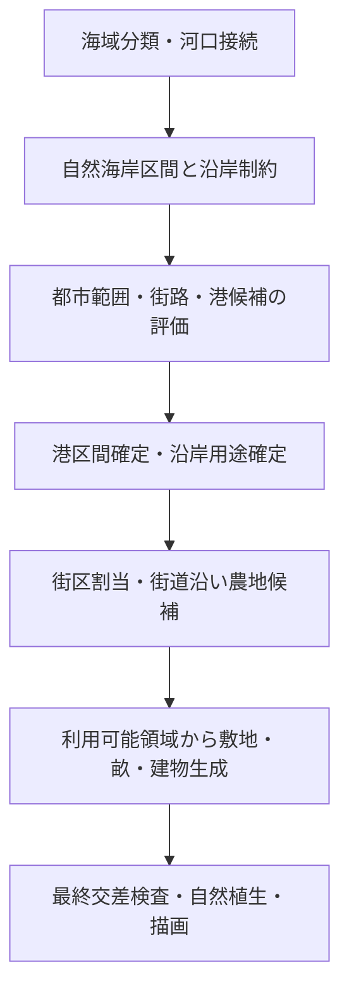

# City Editor：中世ヨーロッパの沿岸景観生成設計

作成日：2026-09-30。状態：Phase 1の主要な制約と簡易砂浜描画を実装。地形分類と編集UIは未実装。

実装メモ（2026-09-30）：生成結果に`coastalOceanFaceIds`を保存し、海と湖を区別する。`coastalSuitability.ts`の60m耕作帯と20m通常建築帯を、街区割当・街道沿い農地・農地ポリゴン・通常建築の最終結果に適用した。粗いfaceは畑の水際側だけを切り取り、畝をクリップする。通常建築は現時点では沿岸帯に重なる建物を除去し、内陸への再配置は次段階。港とlocked要素は保持する。描画は砂地の簡易帯で、砂丘・湿地・岩岸の分類はまだ行わない。

## 1. 目的と決定方針

海岸近くまで穀物畑や通常の住宅が連続する問題を、海岸の地形・露出・土地利用の関係から解消する。対象は CE（`src/city-editor`）。CG（`src/city-generator`）の同名処理とは区別する。

**海岸を一律に緑化するのではなく、自然海岸の種類と港湾利用を別々に決め、連続した沿岸帯を敷地生成の制約として共有する。**

- 砂浜・礫浜・岩岸・崖・河口湿地を区別する。
- 農地・住宅・港湾施設は、それぞれ異なる配置可能領域を使う。
- 海岸に接する粗いセルでも、内陸側の利用可能な土地は残す。
- 港には荷揚げ・通行・作業の空間を確保し、その背後に倉庫・商住街を接続する。
- まず現行海岸線の上で土地利用を改善し、次に地形と海岸形状の整合を進める。

入力資料：[Geminiとの相談](../temp/ocean-view.md)、[郊外土地利用の設計](suburban-landuse-redesign.md)。相談中のセル数・距離は未検証の観測として扱い、本設計の確定値にはしない。

## 2. 相談内容の採用点と修正点

### 採用する点

露出した浜の直後に穀物畑を敷き詰めない。港以外の水際には自然地や作業空間を残す。農地・建物の配置前に沿岸条件を評価する。

### 一律の規則にはしない点

| 相談中の案 | 本設計での扱い |
| --- | --- |
| 海岸直近の一般住宅は絶対禁止 | 自然海岸の危険帯では制約する。整備された港の商住街まで禁止しない |
| 海→防風林→牧草地→畑の固定順序 | 砂丘草地、礫浜、低木、湿地、崖などを選ぶ。高木林は必須にしない |
| 海から200〜300m以内を全面禁耕 | 普遍的距離ではない。地形別の暫定値と適地判定を使う |
| `elevation >= 2`なら安全 | 現状のデータでは不可。標高の生成根拠・海面基準・斜面を確認する |
| 城壁があれば浸水を防ぐ | 防衛施設と水防施設は別。城壁の有無で制約を解除しない |
| 河川沿いなら農地に適する | 河口は汽水・浸水の可能性がある。淡水域や排水条件の根拠が必要 |
| 海沿いの緑地は`park` | 自然植生と都市公園を分ける。整形式庭園や園路を自動生成しない |

UNESCOの[Bryggenの説明](https://whc.unesco.org/en/list/59/)は中世以来の港湾交易地区を扱っている。港と密な建築が共存する景観を残す根拠になるが、あらゆる水際の安全性を示すものではない。

自然海岸の参考として、National Trustの[East Head](https://www.nationaltrust.org.uk/visit/sussex/east-head/things-to-do-at-east-head)には砂丘と塩性湿地、[Orford Ness](https://www.nationaltrust.org.uk/visit/suffolk/orford-ness-national-nature-reserve/explore-the-habitats-of-orford-ness)には植生のある礫地・汽水域などが記載される。これらは地形・生態の参考であり、中世の土地利用をそのまま復元する資料ではない。

[Historic Englandの製塩遺構資料](https://historicengland.org.uk/images-books/publications/iha-preindustrial-salterns/)を踏まえ、製塩は将来の地域・産業条件付き用途とする。沿岸の空地すべてを塩田にする規則は設けない。

## 3. 現行実装で確認した問題

| 箇所 | 確認内容・設計への影響 |
| --- | --- |
| `core/mesh.ts` / `core/types.ts` | `elevation`の型コメントは海抜mだが、新規陸地は一律1で初期化される。意味の宣言と生成データの実態を分ける必要がある |
| `core/generate.ts` | 陸地の非正標高を1、水域を0にする処理がある。値1を測定済み低地として扱えない |
| `core/gen/site/synthSite.ts::synthTerrain` | 別のheightfieldは基準40mに丘・傾斜を加え、waterMaskは0。海岸の潮位基準と整合した地形モデルではない |
| `core/gen/wards.ts` | 郊外農地は確率とcompactnessで選択。海岸距離・塩分の判定なし。一般街区の選定にも沿岸適地制約なし |
| `core/gen/roadsideFarms.ts::cultivateRoadside` | 外部街道付近のempty/farmを農地化する別経路がある。wardsだけの修正では再発する |
| `core/gen/blockInfill.ts` / `openField.ts` | 敷地から畝を生成。海岸用途に応じた面的な控除が必要 |
| `core/gen/suburbanLanduse.ts` | 街道・城壁に基づく郊外調整。沿岸適地より優先させない |
| `core/gen/harborFabric.ts::planHarbor` | 港の岸壁・荷揚げ場・桟橋等を計画済み。自然海岸の帯をここへ重ねない |
| `core/gen/blockInfill.ts::buildBlockFabric` | legacy生成後にmedieval生成を重ねる経路がある。legacy末尾だけの検査では後段建築を防げない |

最初に解消すべき原因は「海岸への隣接情報がない」ことではなく、**海岸情報が土地利用・敷地生成の共通制約になっていない**こと。

## 4. 景観の構成

地形（substrate）と利用（use）を直交させる。例えば湾内の砂礫岸の一部だけを港に転用できる。`straight / bay / cape`は海岸線の平面形状であり、砂浜・崖の区分とは別設定とする。

| 地形・条件 | 水際 | 陸側への遷移 | 農地・住宅 |
| --- | --- | --- | --- |
| 外海に露出した砂浜 | 裸砂・漂着線 | 砂丘草→草地・点在する低木 | 活動的な砂地を避け、安定した後背地へ |
| 礫浜・低い岩岸 | 礫・露岩 | まばらな草・低木 | 使用可能な土壌と道路がある場所に限定 |
| 崖岸 | 岩の露頭・崖線 | 崖肩の余白→台地 | 崖上でも直風は残る。高さだけで耕作適地にしない |
| 遮蔽された河口低地 | 干潟・潮汐水路 | 塩性湿地→湿草地 | 通常の畑・密な住宅を避ける。乾いた上縁には放牧の候補 |
| 入江の港湾区間 | 岸壁または船揚げ浜 | 荷揚げ・通行帯→倉庫・作業場 | 作業帯の後ろに商住街。市街全体を後退させない |

初期の地域表現は樹種を断定せず、砂丘草・塩生草本・低木・疎林という機能群にする。地中海の果樹園や植林防風帯は地域情報がある場合の拡張とする。

## 5. 共通データモデル案

以下は追加予定の概念であり、既存型ではない。

```ts
type CoastSubstrate = "sand" | "shingle" | "rock" | "cliff" | "tidal-flat";
type CoastUse = "natural" | "working-strand" | "quay";

interface CoastalReach {
  id: string;
  waterbodyId: string;
  edgeIds: string[];
  substrate: CoastSubstrate;
  use: CoastUse;
  exposure: number; // 0..1、景観生成用の相対指標
  evidence: "synthetic" | "imported" | "manual";
}

interface CoastalZone {
  id: string;
  reachId: string;
  faceId: string; // 編集・選択の所有者
  polygon: Point[];
  cover: "beach" | "dune" | "rock" | "saltmarsh" | "grass" | "scrub";
  excludes: ("arable" | "ordinary-building" | "tree")[];
}
```

`CoastalPlan`に区間、領域、生成モデルのversion、入力のfingerprintをまとめる。候補敷地には`allowedArea`と理由（砂地・湿地・崖肩・港湾作業帯等）を返す共通クエリを提供する。

- `ward`は街区用途のまま維持。自然海岸は独立の地表レイヤーにする。
- 部分的に利用可能なfaceの`buildable`を丸ごとfalseにしない。
- 湖と海を区別する。`openWater`など由来が不明な水面は海と断定しない。
- `generate.ts`の複数waterbodyを統合した`sea`集合だけでは由来が失われるため、水域IDとocean/lakeの対応を保持する。
- 複数水域に面する岬では、複数区間の制約領域をunionする。最近傍の一岸だけで判断しない。
- 精度のない標高から塩分濃度や浸水深を捏造しない。初期版は明示的な景観モデルとする。

## 6. 区間生成と適地評価

### 6.1 海岸を連続区間へ分ける

1. 海に由来する水域と陸の共有edgeを抽出し、島・本土を含めて連結順に並べる。マップ外枠を海岸と誤認しない。
2. 全海岸について弧長を計算し、地形・露出の低周波な変化を与える。faceごとの独立抽選はしない。
3. 初期版の露出は海側方向と設定値による近似。湾形状だけで完全遮蔽と決めない。後続段階で海側へのrayと陸の遮蔽からfetchの相対値を計算する。
4. 河口接続部は湿地候補とするが、河口だから必ず干潟にはしない。潮差・勾配が不明なら限定的な遷移帯とする。
5. 港候補を評価し、採用された区間だけ`quay / working-strand`を上書きする。港から遠い岸まで作業帯を延長しない。

地形の切り替わりは数edgeを使って幅・密度を徐々に変える。固定したノイズを区間の弧長でサンプルし、隣り合うfaceの境界で途切れないようにする。

### 6.2 距離と領域

距離はworld座標のmで評価し、画面px・ズーム・セル何個分という定義を避ける。基準は描画の波線ではなく海陸境界。

区間ごとの幅から陸側corridorを作り、land polygonと交差させる。凹形の海岸・入り江・島ではunion/differenceが必要で、単一の凸クリップに全形状を渡さない。既存の凸分解処理を利用する場合は分解後に処理し、小片・重複・面積保存を確認する。

重心や全頂点が安全でも辺が危険帯を横切る場合がある。候補ポリゴンの**面積交差**と辺交差を最終条件に使う。畝も残った各ポリゴン内で再生成する。

### 6.3 初期チューニング値

以下は史実上の安全距離ではなく、都市スケールで評価するための暫定パラメータ。実装時に再現seedと複数サイズで調整する。

| プロファイル | 普通建築を控除する幅 | 通常耕地を控除する幅 | 補足 |
| --- | --- | --- | --- |
| 露出した砂浜 | 20〜40m | 50〜100m | 幅に滑らかな揺らぎを与える |
| 礫浜・低い岩岸 | 10〜25m | 25〜60m | 露岩部分は距離に関係なく除外 |
| 河口低地 | まず30〜70m | まず50〜120m | 後に距離帯から湿地地形マスクへ置換 |
| 崖岸 | 崖肩から5〜15m | 崖肩から10〜30m＋露出補正 | 初期版では明示設定された崖だけに適用 |
| 整備された港 | 港計画の作業・通行領域 | 港用途とその作業領域 | `planHarbor`を幾何の唯一の供給元とする |

農地は危険帯の外でも土壌・湿潤・道路アクセスのスコアを使う。初期版で不明な属性は中立として扱う。小都市だから物理距離をゼロに縮めず、残る内陸側へ配置し、不足は不足として診断に出す。

### 6.4 標高・防護

初期版はfaceの`elevation`で崖や高潮安全性を推定しない。将来の海岸整合heightfieldは、海面基準、地形の由来、座標軸、解像度を明示する。`synthTerrain`と既存サンプラーのY方向も統一を検証する。

岸壁は作業面として扱い、背後一帯の洪水安全を保証しない。将来堤防を扱うなら連続性・開口部・天端高・排水条件を別途持たせる。現行の`wall`や`seaWall`という名前だけでは水防効果を与えない。

## 7. 生成パイプラインへの組み込み



前段の自然地形計画と、港決定後の用途計画を二段階に分け、港の位置と沿岸制約の循環依存を防ぐ。

| 変更予定箇所 | 責務 |
| --- | --- |
| 新規`core/gen/coastalLandscape.ts` | 区間抽出、自然地形計画、港用途反映 |
| 新規`core/gen/coastalSuitability.ts` | 農地・建築の共通判定、利用可能polygon生成 |
| `generate.ts` | 段階実行・通常生成の両経路で計画を受け渡す |
| `wards.ts` | 農地・住居の候補面積を評価。危険な候補をfallbackで復活させない |
| `roadsideFarms.ts` | 同じ農地適地条件を使う。街道の需要は不適地条件を上書きしない |
| `blockInfill.ts` / `localInfill.ts` | 耕作可能polygonだけに畝を生成。legacy経路も対象 |
| `medievalFabric.ts`等の建築生成 | 許可領域をパッキング前に使用。生成後の大量削除を主処理にしない |
| `harborFabric.ts` | 港計画と沿岸区間を接続。自然帯と荷揚げ場の二重確保を防ぐ |
| `suburbanLanduse.ts` | 生垣菜園への変換後も耕作制約を維持 |
| `render/svg.ts` | 自然地表・植生・崖の表示。水際線を共有する |
| `generationDiagnostics.ts` | 制約違反、配置不足、港への接続を説明可能にする |

最終検査は`buildBlockFabric`から返す直前の全経路に必要。菜園、parcel内の庭、後段infillも対象を明示し、園芸用途を通じた再流入を防ぐ。住宅を減らした場合は街路につながる内陸候補で補完するが、要求密度のために危険帯へ押し戻さない。

港の道路は荷揚げ場まで接続させる。自然帯では必要な横断路や船揚げ浜への小道を許し、帯を障壁として都市を分断しない。崖の横断には斜路等の根拠が必要。

## 8. 描画と編集

- 砂浜：淡い砂色、疎な粒状表現。規則的な畝を使わない。
- 砂丘：短い草群と控えめな稜線。全域を高木で埋めない。
- 湿地：草群と水路。通常耕地の縞・都市公園の園路と区別する。
- 岩岸・崖：露岩と短い崖記号。海陸境界や通路との二重線を避ける。
- 牧草地・低木帯：不均一な植生密度。放牧地に柵を必須としない。
- 港：岸壁、荷揚げ場、倉庫の連続を優先し、クレーン・桟橋を自然海岸へ散布しない。

同じ沿岸区間をfaceに切り分けて所有させても、描画では内部境界を出さない。広域表示では地表の色差を残し、接近時に草・礫などの細部を増やす。LOD切替で配置乱数は変えない。

編集UIの初期公開項目は「海岸環境：自動／砂浜／礫・岩岸／崖／河口湿地」「露出：自動／弱／強」を想定。区間単位の上書きは後続段階。診断表示では農地・建物の配置不可領域を重ね、その理由を表示する。

## 9. 再生成・保存・互換性

- 専用乱数系列（例：`seed:coastal:v1:reachId`）を使い、既存系列を途中で消費しない。形状や面積が変わることによる下流結果の変化は許容する。
- 区間IDは安定したedge順序から決める。同じ入力・モデルversionで同じ結果にする。
- 計画入力に海陸境界、waterbody由来、港区間、環境設定、モデルversionを含める。編集後は関連キャッシュを無効化する。
- `farm-v5`を含むfabric cacheにも沿岸fingerprintを追加する。別の海岸条件で以前の畑を再利用しない。
- 手動設定と派生polygonを分離して保存する。派生形状を保存する場合も、入力とfingerprintが不一致なら再計算する。
- 旧ファイルは読み込むだけで地形・用途を書き換えない。旧共有URLの設定欠落は従来モードとして解釈し、新規生成には新モードを記録する。
- 現行のdocument/fabric versionと別に沿岸モデルversionを明示する。新フィールドを加える際はimport/export、worker、共有URLのvalidatorを揃える。
- locked/manual要素は自動削除しない。危険帯との競合は診断として残す。生成物の不変条件と手動例外を分けて数える。

## 10. 実装の段階

### Phase 1：農地問題を確実に解消

海岸の由来保持、連続した自然帯、共通耕作適地判定、wardsとroadsideの両経路、畝生成前のpolygon控除、砂・草・低木の最低限の描画を実装する。初期の地形は砂礫の自然海岸と港区間を基本にし、崖や干潟を標高から自動推定しない。非沿岸都市は従来経路を維持する。

完了条件：対象seedと回帰ケースで、自動生成農地のpolygon・畝が耕作除外領域へ侵入しない。内陸に十分な適地があるケースでは農地が残る。

### Phase 2：住宅・港湾との接続

建築候補領域、街区適性、内陸への配置補完、港作業帯、街路接続、診断UIを追加する。自然帯を最後に描いて住宅を隠す方式は採用しない。

完了条件：自然海岸の建築制約と港の荷役動線が守られ、住宅・倉庫が道路へ接続し、水際全体が無人の帯にならない。

### Phase 3：地形と地域差を表現

海岸と整合する標高、崖肩、砂丘、潮汐低地、露出の近似、地域別植生を導入する。海岸形状の調整はここで行い、既存メッシュの海陸境界と描画線の整合を維持する。土地利用制約を変えずに見た目の線だけを蛇行させない。

塩田、干拓、堤防の効果、特定地域の果樹栽培は追加設計とし、初期版の必須条件には含めない。

## 11. 検証と受け入れ条件

### 再現ケース

相談の共有URLをfixtureに保存する。seed=`rb8rxv`、gridSeed=`5bb66l`、evolution、small、nPatches=15、relaxCount=4、relaxPasses=3。海岸straight、河川toCoast/greatBend、reliefあり、城壁なし・港あり、buildingPattern=medieval、layout=organic。その他の設定もURLから復元し、現在の生成結果をbaselineとして採取する。

再現設定に近い`rb8rxv`の実生成テストで、海岸線が生成され、農地と通常建築が控え幅に侵入せず、内陸の農地・建築が残ることを確認した。共有URLそのものの表示比較と、相談にある`f205`等の個別測定は未実施。face IDを合否条件に固定せず、plotと海岸帯の面積交差で検証する。

### 自動検証

1. 農地・畝と耕作除外領域の面積／線交差が許容数値誤差以下。
2. 通常建物と建築除外領域が交差しない。港作業帯は通常住宅で埋まらない。
3. 粗いセルが帯をまたぐ場合、海側だけ控除し、適地と最小面積を満たす内陸片を利用する。
4. 凹湾、岬、島、複数水域、海岸端点、細い陸地、河口で欠損・重複・海上配置がない。
5. 海なし／湖のみでは塩性海岸制約を適用しない。不明水域のfallbackは診断可能。
6. 港あり／なし、城壁あり／なし、全グリッド・全建築経路で同じ制約を守る。
7. 同一入力の再生成、worker、段階実行の完了結果が一致する。
8. 海岸編集・港移動でキャッシュが更新され、保存再読込・共有URLで設定が保たれる。
9. locked要素は維持し、違反だけを記録する。

境界演算用の小さな決定的fixtureを中心にし、seed群では面積比・接続性・診断件数を確認する。許容誤差は既存幾何の精度に合わせて実装時に定義し、描画の見た目だけで合否を決めない。

### 目視検証

同一seed・同一ズームで変更前後を並べる。海→浜／湿地／岩→後背地の連続、港だけの作業帯、内陸に残る農地、住宅密度と港への接続を確認する。失敗例は、全面が等幅の緑帯、face形の巨大空地、人工的な高木列、港を遮る砂丘、海岸線に沿って機械的に並ぶ畝。

### 診断指標

`farmOverlapArea`、`buildingOverlapArea`、`rejectedFarmArea`、`remainingCultivableArea`、`unplacedBuildingCount`、`harborAccessFailures`、`manualConflicts`を記録する。面積指標はm²とし、住宅不足を沿岸制約の無効化で隠さない。

## 12. 次の着手点

Phase 1の最初の変更は、`coastalSuitability`の幾何fixtureと海域由来の保持から始める。その後、相談seedのbaselineを採取し、`wards`・`cultivateRoadside`・農地polygon生成を同じ適地クエリへ接続する。標高の数値だけを条件に加える修正では完了としない。
