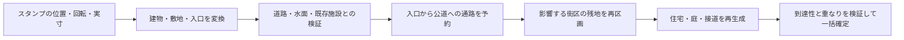

# City Editor：歴史的ランドマークの配置設計とSVG収集計画

調査日：2026-10-01。状態：段階1・2の基盤を実装中。対象：古代ローマから中世末までのヨーロッパ（東ローマ／ビザンツ圏を含む）。初期の年代上限は1500年を目安とし、個別の建築段階で判断する。

素材ページと現行コードの調査に基づく計画。歴史素材のダウンロード・加工・配布審査は未実施。

実装済み：version 3 の配置・アセット保存、Undo／Redo、敷地・入口通路の住宅除外、道路接続候補の探索、スタンプ配置 UI とプレビュー、静的 SVG の限定描画・単独 SVG 出力。アセットは審査済み JSON を手動で読み込む。未実装：歴史素材3点の審査・同梱、生成小路への接続、道路網の到達性検査、残地の再区画、敷地編集、特殊施設連携。現時点では段階0〜2の完了条件を満たさない。

## 1. 採用方針

**ランドマークは一件ずつスタンプ配置し、敷地はセル境界を越えられる独立したオブジェクトとする。ブラシは敷地・前庭の指定を補助する。**

建物のSVGだけを住宅の上へ重ねる方式にはしない。「建物群・占有敷地・入口・接続通路・前庭」を一組として配置し、その外側の住宅街区を調整する。

| 方式 | 長所 | 問題 | 採否 |
| --- | --- | --- | --- |
| 1セル＝1ランドマーク | 既存のward操作に近い | セル寸法で建築の大きさが変わる。大聖堂・修道院・闘技場に不向き | 小建築の位置スナップだけに利用 |
| ブラシで建築を連続配置 | 植生などの大量配置に向く | 有名建築が連打される。方向・入口を指定しにくい | 本体には不採用 |
| 自由位置のスタンプ | 実寸・回転・複数セル占有を表現できる | 敷地予約・衝突判定が必要 | 主操作として採用 |
| 複数セルを選んで敷地指定 | 城・修道院などに向く | セル形状をそのまま境界にすると不自然 | 補助操作として採用 |

推奨操作は「カタログから選ぶ → 地図で位置・向きを決める → 前庭と接続を確認 → 配置」。初期版は既存道路を維持し、道路に収まる場所を選ぶ。大規模な道路付け替えは後続段階とする。

## 2. 現行CEとの対応

過去の設計文書だけでなく、調査日時点のコードを基準とする。`patriciate`、`ParcelPlan`、屋外空間は既に存在する。

| 現行箇所 | 確認できた構造 | 拡張方針 |
| --- | --- | --- |
| `core/types.ts` | 座標はメートル。`CityElement`はfaceIds／point／sizeMeters／rotationを持つ | 有名建築は専用の`LandmarkInstance`へ分離。既存templeを自動置換しない |
| 同上 | `CastlePlan`は複数のparts、courtyards、accessesを持ち、DefenseCircuitと接続 | 複合敷地の参考にする。機能を持つ城の城壁・門は既存モデルと連携 |
| `core/gen/parcelTypes.ts` | `ParcelPlan`は複数faceIds、建物、庭、アクセスを持つ | 住宅側の再区画と接道の受け皿として利用 |
| `core/gen/localInfill.ts` | 小路・敷地はmesh edgeではない。`CityFabric.entrances`にセル間の出入口がある | メッシュ境界を跨ぐ通路の連続性を維持 |
| `core/gen/fabricDistricts.ts` | 既存elementsのfaceIdsを予約領域として扱う | 新ランドマークに同じ方式を使うと部分占有でもセル全体が空くため、正確なポリゴン予約を追加 |
| `core/gen/blockInfill.ts`、`medievalFabric.ts` | 街路と住宅生成を分け、城・墓地等を障害物として扱う経路がある | 街区生成前と住宅構成前の両段階で敷地予約を渡す |
| `render/svg.ts` | 条件によって`buildBlockFabric`または`buildCityBuildings`を使う。単独SVG出力もある | 新旧両経路に予約を適用。編集画面とSVG出力で同じ描画を使用 |
| `core/history.ts` | 差分履歴はトップレベルの各フィールドを明示列挙 | landmarkと敷地・接続の変更を一回のUndoに含める |
| `core/document.ts`、`io/cityEditorFile.ts` | 現在はdocument version 1／2を読む | 新形式の検証・旧形式移行・持ち運びを追加 |

CEを対象とし、別実装の`src/city-generator`への同時導入は初期範囲に含めない。

## 3. 配置UIと編集の挙動

### 3.1 カタログとスタンプ

- カタログは建築名、地域、建築段階、種類、基準幅×奥行、敷地目安、素材出典を表示。年代・地域で絞り込める。
- 地図上では建物、最低必要敷地、追加可能な前庭、入口方向、道路への接続案をプレビューする。
- スナップは「自由」「選択セルの中心」「道路に正面を合わせる」。セル中心スナップでもセルに合わせて建築を変形しない。
- 既定は資料に基づく実寸・縦横比固定。縮尺変更は明示操作とし、変更倍率を保存・表示する。寸法未確認の素材は実寸プリセットとして公開しない。
- 回転は自由角＋任意の角度スナップ。反転は史実形状を変えるため既定では無効。SVGのY軸とCEの回転規約はインポート時に統一する。
- 成功可能なら緑、住宅置換が発生するなら黄、道路・水面・ロック対象との不正な衝突は赤。色に加えて理由と影響件数を表示する。
- 一クリックで一件を確定。連続配置は専用モードでのみ行い、ドラッグ中の連打はしない。

### 3.2 敷地の調整

ブラシ／複数セル選択は「この範囲で敷地を確保してよい」という許容領域を入力する。選択セルをすべて更地にする命令にはしない。そこから実際の敷地境界を道路・既存敷地へ合わせる。詳細編集はポリゴンの頂点操作とする。

入口前の前庭、修道院の囲い、城の内庭は独立した意味を持つ。建物の周囲を均等な空地にするのではなく、正面は広場、側面は狭い通路、背面は庭などを素材のプリセットで区別する。

敷地境界や接続路を編集すると再プレビューする。配置後の移動・回転・縮尺変更にも同じ検証を使い、成立しない場合は元の確定状態を保つ。

## 4. 周辺街区との接合

### 4.1 三種類の形状を分ける

1. **建物形状**：柱廊、翼棟、塔を含む占有形状。中庭の穴を保持する。
2. **敷地予約形状**：庭・囲い・前庭を含む領域。通常の住宅・菜園・樹木の生成を抑制する。
3. **接続通路形状**：入口から公道までの幅を持つ領域。見える線だけでなく、住宅を置けない通行帯として扱う。

占有セル一覧は検索・選択・再計算のための索引にすぎず、敷地の真実はポリゴンに置く。セルの中心点ではなく、セルと敷地の交差で求める。細長い敷地がセルの端だけに重なる場合も検出する。



### 4.2 初期版の確定手順

1. 建物・最低敷地を変換し、空間索引で交差候補を求め、正確なポリゴン交差を計算する。
2. 地図外、水面、河川、城壁、既存の城・墓地、他のランドマーク、ロックされた面・施設との衝突を判定する。初期版の地上建築はこれらと重なる配置を拒否する。
3. 道路は中心線でなく幅員を含む通行帯として扱う。既存の主要道路と生成済みの通り抜け小路は保持し、敷地が遮る場合は配置不可とする。道路付け替えを暗黙に実行しない。
4. 主入口から、地図の道路網へ繋がった道路または小路を探索する。初期版は直線／単純な折れ線で繋がる候補を優先。壁・河川を貫通する最近傍直線は不可。繋げられなければ向きや場所の変更を促す。
5. 敷地＋接続通路を宅地生成の除外領域にする。交差する住宅は棟全体を置換対象とし、描画時のクリップで半分だけ残さない。敷地境界で残地を再区画し、住宅寸法・接道条件を満たす場所に建て直す。
6. 建築できない細片は接続可能な庭や植栽帯へ統合する。接道しない残地を住宅にしない。中庭はランドマークが所有し、一般住宅で埋めない。
7. 入口から既存公道への到達性、周辺住宅の接道、通路幅、ポリゴンの非交差を検証し、建築・敷地・通路を一つの編集として確定する。

「影響セル＋隣の1セル」固定では、複数セルにまたがる街区が途中で切れる。再計算単位は**道路に囲まれた街区と、その接続境界**を基本にする。旧位置と新位置の両方を無効化し、さらに接道依存先が変わった範囲へ必要なだけ広げる。プレビューで更新範囲を示す。

局所再生成のseedにランドマーク全体の配列順を使わない。安定した街区ID・敷地IDと、その領域に関係する予約形状のハッシュを使う。無関係な地区の住宅まで変えない。

### 4.3 建築タイプ別の接合

| タイプ | 推奨する接合 | 初期対応 |
| --- | --- | --- |
| パンテオン型の単体神殿 | 正面の前庭を公道に接続。側背面は小路または住宅の裏庭 | 対応 |
| 大聖堂 | 主入口前の広場＋側面通路。教会敷地と周辺住宅の境界を保つ | 対応 |
| 円形・楕円形闘技場 | 複数入口と周囲のアクセス。巨大な矩形空地にしない | 複数入口段階で対応 |
| 修道院 | 境界壁・門・中庭を一体で扱い、公道から門まで接続 | 複合敷地段階で対応 |
| 城 | 城壁・城門・堀を既存DefenseCircuit／CastlePlanと連携 | 専用アダプター完成後 |
| 城門・橋・水道橋 | 道路・城壁・河川を跨ぐ接続が主機能 | 初期対象外。専用アンカーを後続開発 |

道路付け替えを導入する段階では、局所路線だけを対象に代替経路を作り、既存の両端・セル間出入口を繋ぎ直す。接続が成立しない変更は確定しない。主要道路・城壁の自動移設は別機能とする。

### 4.4 他の編集との整合

- 配置だけでは元のwardを変えず、敷地予約を重ねる。削除時は予約を除いて住宅を再生成する。元の住宅を完全に戻す操作はUndoが担う。
- 海塗り、道路編集、頂点移動でランドマークを壊す場合も共通の検証を適用し、移動・削除を伴う明示操作がなければ拒否する。
- メッシュの面分割・統合でfaceIdsが変わっても、座標形状から索引を再構築する。全都市の再生成は局所編集と区別し、既存配置を予約条件として取り込むモードを後続で実装する。
- 既存のtemple／plazaと置き換える場合は専用の「施設を置換」を使う。二重予約や寺院の二重描画を起こさない。

## 5. データと描画の設計

### 5.1 アセットと配置インスタンス

次は追加する型の概念案。名前・格納先は実装時に整理する。

```ts
type PolygonWithHoles = { outer: Point[]; holes: Point[][] };
type MultiPolygon = PolygonWithHoles[];

interface LandmarkAsset {
  id: string;
  revision: string;                 // 内容の固定版
  name: string;
  kind: string;
  historicalPhase: string;           // 建設年と、再現する姿の年代を分ける
  referenceSizeMeters: [number, number];
  dimensionSource: string;
  footprint: MultiPolygon;           // ローカル座標、単位m
  minimumSite: MultiPolygon;
  entrances: Array<{
    id: string; point: Point; outward: Point;
    widthMeters: number; required: boolean;
  }>;
  renderAsset: string;               // 審査・正規化済みSVGの参照
  provenanceId: string;
}

interface LandmarkInstance {
  id: Id;
  assetId: string;
  assetRevision: string;
  position: Point;
  rotation: number;
  scale: number;
  site: MultiPolygon;               // 確定した世界座標の敷地
  accesses: Array<{
    entranceId: string; points: Point[]; widthMeters: number;
    target: { kind: "road" | "lane"; id: string; point: Point };
  }>;
  locked: boolean;
}
```

`CityDocument.landmarks`と、必要なアセットを格納する`landmarkAssets`を新設する案とする。faceIdsと影響街区IDは派生索引。変換時に敷地とアクセスも更新し、インスタンスの位置だけを動かして古い敷地が残ることを防ぐ。

生成小路のIDは現状からの拡張が必要。安定IDと座標の双方を保持し、再生成後に接続を再解決する。失われたIDを無条件に信用しない。

複合城郭を扱う場合は、防御機能の真実をDefenseCircuit／CastlePlan側に置く。アセット側と双方で城壁・門を生成しない。ランドマークは同モデルへの参照と意匠を担当する。

### 5.2 保存、Undo、キャッシュ

- ランドマークを含む保存はdocument version 3を提案。旧エディターが予約領域を無視して再保存する事故を避ける。新エディターはversion 1／2を引き続き読める。
- `parseDocument`、mesh検証、generation recipe入力、履歴のdiff／apply、workerへの受け渡しを一緒に更新する。
- JSONには使用した正規化済みアセットを一版につき一度だけ埋め込み、外部サイトや後日のカタログ更新に依存しない。読込時も同じSVG制限を適用する。
- アセットが欠損しても予約敷地と入口は保持し、代替輪郭を表示する。見た目の欠損を住宅の再侵入に繋げない。
- キャッシュキーには関係するasset revision、予約形状、入口通路を含める。生成パイプライン各段階に同じ予約条件を渡す。

### 5.3 SVGの用途

CEは平面の街路・建物図なので、素材は**上面図／平面図**を優先する。正面図や観光用の透視アイコンを実寸建築として置かない。カタログのサムネイルだけなら別途利用可能。

平面図の室内壁を全部表示すると街全体が読みにくい。表示用SVGは外形・主要な屋根・塔・中庭を中心に整理する。ただし平面図から推測した屋根は復元要素として記録する。正確さの確度が低い場合は平面輪郭表示に留める。

衝突形状をSVGのbounding boxや描画パスから実行時に推測しない。別の構造化ポリゴンを持たせ、凹形状・穴・離れた棟を保持する。現在の凸多角形処理だけでは不足するため、差分演算は穴を扱える方法を検証する。凸分割後の結果を単純に連結して穴を消さない。

詳細／通常／遠景の3段階を用意し、遠景では外形と名称を優先する。線幅・塗りはCEのスタイルに合わせる。単独SVGには`defs`／`symbol`と使用形状を内包し、外部参照なしで表示できるようにする。

## 6. 収集対象と現在の調査結果

**「ページにPD／CC0の表示がある」ことと「ゲーム用アセットとして採用済み」は別状態にする。** 以下は2026-10-01の調査候補。原ファイルの構文・形状・寸法・権利連鎖の検査はまだ行っていない。

| 優先 | 建築・素材 | 確認した権利表示／形式 | 次の作業 |
| --- | --- | --- | --- |
| A | [パンテオン：Dehioの平面図](https://commons.wikimedia.org/wiki/File:Dehio_1_Pantheon_Floor_plan.jpg) | PD-Art／PD-old系、米国のPD根拠も記載。JPG | 原図からSVG化。柱廊・円堂・主入口を整理。古図のため現状や最新研究とは区別 |
| A | [サン・ヴィターレ聖堂](https://commons.wikimedia.org/wiki/File:Bazilika_San_Vitale.svg) | CC0、SVG | 既存SVG再利用候補。複数の原図・外部参考が記載されているため由来を追跡。方位・反転履歴も照合 |
| A | [シャルトル大聖堂：Viollet-le-Ducの平面図](https://commons.wikimedia.org/wiki/File:Plan.cathedrale.Chartres.png) | PD、PNG | SVG化。十字形・後陣・入口と前庭の検証例にする |
| B | [クリュニー修道院](https://commons.wikimedia.org/wiki/File:Plan.abbaye.Cluny.png) | PD系表示、PNG | 対象年代と図の復元部分を確認。教会単体から着手し、複合敷地へ拡張 |
| B | [ウィンザー城](https://commons.wikimedia.org/wiki/File:Windsorcastleplan.svg) | 作者によるPD提供、SVG | 図が中世の姿であるとは未確認。後世の増改築を判別できるまで歴史プリセットに採用しない |
| B | [ハギア・ソフィア](https://commons.wikimedia.org/wiki/File:Hagia-Sophia-Grundriss.jpg) | PD-old系、JPG。米国PDタグ追加を求める注記あり | 権利根拠補完が必要。上半分が上階、下半分が地上階の図なので、そのまま建築輪郭としてトレースしない |
| B | [同建築の別資料：University of Michigan、1879年刊の図版](https://quod.lib.umich.edu/h/hiaaic/x-prang43-und-2/prang43_2) | JPG。収集者が持つ権利はCC0との説明 | 代替資料候補。収集者のCC0だけで元の図版全体を審査済みにせず、原著・図版の来歴も確認 |
| B | [コロッセオ：British Library由来の平面・立面図](https://commons.wikimedia.org/wiki/File:Colosseum_(Rome)_-_Plan_and_elevation_(11000010636).jpg) | JPG。「No known copyright restrictions」が中心 | PD確定扱いせず保留。原著1805年の著者・図版作者・刊行情報を補完し、または明確なPD資料を探す |

初期試作はパンテオン、サン・ヴィターレ、シャルトルの3点。円形・八角形・十字形を試せ、単体配置の仕組みを検証しやすい。権利連鎖や形状が不明な候補は数合わせで採用しない。

第2陣の調査候補は、ニームのメゾン・カレ、ヴェローナのアレーナ、アーヘンの宮廷礼拝堂、ピサ大聖堂と斜塔、カステル・デル・モンテ、コンウィ城、パラッツォ・ヴェッキオ、サン・ジミニャーノの塔群。これらは**建築名の候補であり、今回PDの適合素材を確認した一覧ではない**。建築段階・年代・地域の根拠も次段階で収集する。

中世建築の現代の図には後世の増築が含まれうる。`constructionPeriod`、`depictedPhase`、`sourcePublicationDate`、`reconstructionConfidence`を別々に記録する。現代の広場の広さを中世の史実として移植しない。周辺街区はCE向けの創作であることをアセット説明に記す。

## 7. 権利確認と入手先

### 7.1 採用ルール

採用候補はCC0、作者による明示的PD提供、または権利消滅の根拠を確認できたPD素材。CC BY／CC BY-SA／GFDLは今回のPD限定カタログには含めない。

CC0は権利放棄等のための手段であり、PDの状態表示とは区別する。建築自体が古くても、現代の写真・測量図・SVG化に別の権利があり得るため、原図とベクター化担当者の双方を確認する。[Creative Commons CC0](https://creativecommons.org/publicdomain/zero/1.0/)、[Commonsのライセンス方針](https://commons.wikimedia.org/wiki/Commons:Licensing)。

確認項目は、個別ファイルページ、原著の作者・没年・刊行年、デジタル化／改変の作者、出典連鎖、原産国・米国・配布対象地域での根拠。PDMやPD-oldのラベルだけで全地域の利用を断定しない。「No known copyright restrictions」のみのものは根拠補完まで保留する。

たとえば[Cathedral schematic plan en vectorial.svg](https://commons.wikimedia.org/wiki/File:Cathedral_schematic_plan_en_vectorial.svg)は利用可能な無料素材でもCC BY-SA等の条件を持つため、この収集枠では除外する。近代のSVGをトレースし直すだけでPD扱いに変更しない。

新たに作成した正規化SVGと幾何データは、提供権限を確認した上でCC0を採用する方針を推奨する。既存コードのライセンスとは分け、出典と変更記録を同梱する。

### 7.2 探索の順序

1. **Wikimedia Commons**：個別建築のplans／floor plansカテゴリでSVGを探す。見つからなければPDのPNG／JPG原図へ進む。
2. **大学図書館のデジタルコレクション**：University of Michigan等の図版レコードを確認し、原著と権利表示が明確なものを選ぶ。
3. **Europeana経由の所蔵機関**：PDM／CC0で候補を探し、所蔵元の個別レコードまで確認する。メタデータのCC0と画像自体の権利を混同しない。[Europeana利用条件](https://www.europeana.eu/cs/rights/terms-of-use)、[PD素材の利用指針](https://www.europeana.eu/en/rights/public-domain-usage-guidelines)。
4. **古い建築書の図版**：Dehio／Bezold、Viollet-le-Duc等を優先。Internet ArchiveやGallica等は探索先とし、公開サイト全体をPDと見なさない。

SVGが見つからないために不適合なライセンスへ条件を緩めず、PD原図から必要な形だけをベクター化する。既存SVGの整理と古図からの作図のうち、品質と作業量の良い方を選ぶ。

## 8. 収集・加工パイプライン

状態は`discovered → rights-reviewed → geometry-reviewed → integrated`。不採用は理由付き`rejected`、情報不足は`on-hold`とし、画面には`integrated`だけを出す。

1. **候補台帳**：建築ID、名称、地域、再現年代、図の種類、ファイルページURL、原図URL、作者、権利表示、未確認事項を登録する。
2. **版を固定して入手**：CommonsのImageinfo APIで元ファイルURL、MIME、サイズ、SHA-1、timestamp、extmetadataを収集。説明ページのrevision IDも別途記録する。取得日時とローカルSHA-256を保存し、以後の編集を原本から分離する。[MediaWiki API: Imageinfo](https://www.mediawiki.org/wiki/API:Imageinfo)。
3. **権利根拠を保存**：個別ページの権利欄・原著情報・出典へのリンクと確認記録を保存。自動メタデータ抽出だけで採用判定しない。
4. **幾何抽出**：凡例・文字・寸法線・他階の図を分離。外形、穴、付属棟、入口、敷地、基準寸法を人が確定する。自動トレースは下書きに留める。
5. **正規化**：1ローカル単位＝1m、viewBox、原点、入口方向、線幅・塗りを統一。建物を敷地に合わせて非等方に引き延ばさない。
6. **SVG制限**：script、イベント属性、foreignObject、外部href、外部CSS・フォント、埋込ラスター、アニメーションを除外。許可した静的要素だけで再構成し、IDを名前空間化する。パス数・ノード数・ファイル容量の上限も設ける。
7. **形状検査**：閉曲線、自己交差、穴、重複、有限数値、寸法、入口が外周にあることを検査。元画像と重ね合わせて確認する。
8. **都市内検証**：密集街、疎な郊外、セル境界、道路沿いで配置。通常・遠景の見え方、住宅重複、入口到達性、保存後の再現を確認する。

推奨格納先（将来追加）：

```text
docs/data/city-landmarks/catalog.json      # 候補・根拠・審査状態
docs/data/city-landmarks/sources/          # 出典記録と加工手順
public/city-editor/landmarks/<id>/
  asset.json                             # 実寸・入口・衝突形状・版
  plan.svg                               # 正規化済みの表示用
  preview.svg                            # カタログ用
  provenance.json                        # 原著・URL・ハッシュ・加工記録
  LICENSE.txt
```

大容量の原図はアプリ配信物に含めず、取得manifestで追跡できる保管先に置く。公開するアセット一式はネット接続なしで利用できるものにする。

## 9. 段階的な実装と完了条件

| 段階 | 成果物 | 完了条件 |
| --- | --- | --- |
| 0：資料試作 | 3点の候補を審査し、SVG＋幾何＋入口＋実寸を作成 | 根拠と形状を確認できた素材のみ採用。未確認のものは保留 |
| 1：配置基盤 | `landmark`ツール、スタンプ、回転、プレビュー、検証、保存・Undo・SVG出力 | 複数セルに配置でき、外部画像なしで再表示できる |
| 2：街区接合 | 共通の敷地予約、影響街区の住宅再区画、入口通路、旧経路の対応 | 住宅が欠けず、入口が公道へ繋がり、無関係な街区は変わらない |
| 3：敷地編集 | 敷地ブラシ、頂点編集、複数入口、修道院・闘技場 | 囲い・中庭・複数棟の所有関係と接道が保たれる |
| 4：特殊施設 | 城の既存モデル連携、道路付け替え、橋・門の専用アンカー | 防御・道路・水系の既存機能と矛盾しない |

一般公開する最小版は**段階0〜2を通したもの**。段階1だけの、住宅と重なる「絵のスタンプ」を完成版としない。初期版のカタログは3点でよく、追加点数より接合品質を優先する。

実装単位の候補は`core/landmarks.ts`（配置・検証）、`core/gen/landmarkIntegration.ts`（予約・接続・再区画）、`render/landmarks.ts`（描画）、`io/landmarkAssets.ts`（形式・アセット検証）。UIには計算ロジックを埋め込まない。

試験では次を必須とする。

- セルの端だけに触れる配置、複数セル、凹形状、中庭の穴、90度以外の回転を正しく扱える。
- 通路・建物・庭の重なり、通行不能な細い隙間、壁越しの誤接続を検出する。
- 主入口と公道が繋がり、残った住宅も接道できる。既存の通り抜け路が消えない。
- 配置・移動・削除と周辺再生成が一回のUndo／Redoで往復する。
- 新旧建物生成、保存読込、worker処理、単独SVGで同じ敷地予約になる。
- 同じ入力・アセット版で同じ結果になり、無関係な地区の建物形状が変わらない。
- 旧形式を読める。不正SVGや未知の必須アセットを静かに通常建物へ置き換えない。
- 実測でドラッグ中の簡易プレビューと確定時の街区再生成を分離する。性能目標は最初の3素材・標準都市で計測してから決める。

最大の不確実性はSVGの総数ではなく、対象年代の形状と寸法を確定する作業、穴を持つ敷地の差分演算、各生成経路で一貫した予約を守る作業量にある。まず3素材でこれらを検証した後に、カタログ拡充の点数と日程を見積もる。
