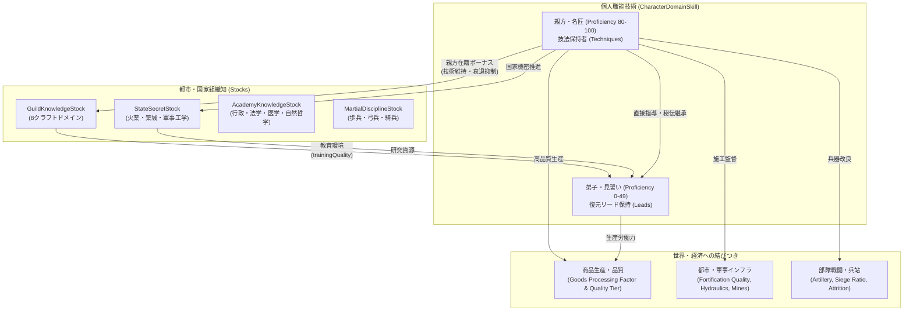

# 職能技術（Craft Skills）体系拡充・連携設計書

更新: 2026-09-11  
状態: **設計完了・実装準備（RFC / 仕様策定）**

---

## 1. 概要と目的

### 1.1 背景
現在の Characters 拡張における人物詳細ダイアログの「職能技術（Craft Skills）」タブには、Economy 拡張の `CharacterDomainSkill` に基づき以下の5種のみが表示されている。
- `blacksmithing`（鍛冶）
- `smelting`（製錬）
- `weaving`（織布）
- `tailoring`（仕立て）
- `fortification`（築城）

一方、ゲーム世界には多様な一次資源・加工品（Goods）、都市ギルドの技術蓄積（`GuildKnowledgeStock`）、国家機密（`StateSecretStock`）、アカデミーの学術蓄積（`AcademyKnowledgeStock`）、そして港湾・要塞・鉱山・灌漑水路などのインフラが存在する。
人物が持つ実践的な職能技術（Craft Skills）のバラエティを拡充し、**商品生産・品質、都市技術ストック、インフラ建設、軍事運用**と有機的に結びつけることで、職人・技師・軍事工兵・宮廷技術者の個性と歴史的価値を豊かに描写する。

### 1.2 設計原則
1. **9大能力（Skills）および専門分野（Specializations）との明確な役割分担**:
   - **9大能力**: 社会的資質・大まかな役職適性（概況値 0〜100）。
   - **専門分野（Specializations）**: 理論知識（`knowledge`）、実地（`practice`）、対象習熟（`familiarity`）。
   - **職能技術（Craft Skills）**: 手指・身体を使って具体的に製品・構造物・加工物を生み出し、維持・改良する実践熟練（`CharacterDomainSkill`、0〜100）。
2. **経済・組織知・軍事との直接的接続**:
   - 各職能技術は、単なるラベルではなく、**「商品（Goods）の生産性・品質」「都市ギルド／国家機密ストック」「インフラ能力」「軍事性能」**のいずれか（または複数）に波及する。
3. **技法（Techniques）と復元リード（Reconstruction Leads）**:
   - 熟練者だけが扱える「技法」が存在し、親方の死後も弟子が「復元リード（未完成の技術ノート・試行錯誤）」を通じて再興できるドラマ性を持つ。
4. **非インフレと段階的成長**:
   - 数値上限は100（人間としての到達極限）。80以上は達人・親方、95以上は歴史的名人。

---

## 2. 職能技術（Craft Skills）全22ドメインカタログ

全22種の職能技術を8つの大分類に体系化する。

| 分類 | ドメインID | 日本語名 | 英語名 | 接続する技術蓄積 | 結びつく商品・インフラ・軍事要素 |
| :--- | :--- | :--- | :--- | :--- | :--- |
| **冶金・金属** | `blacksmithing` | 鍛冶 | Blacksmithing | Guild: `metallurgy` | Goods: `Tools`, `Arms`, `Harnesses`。武器・農具の品質 |
| | `smelting` | 製錬 | Smelting | Guild: `metallurgy` | Goods: `Iron Ingot`, `Copper Ingot`, `Bronze`, `Lead Ingot`。鉱石歩留まり |
| | `foundry` | 鋳造 | Metal Casting | Guild: `metallurgy`<br>Secret: `militaryEngineering` | Goods: `Bullets`, `Artillery`, 鐘・大釜。大砲製造の品質・暴発防止 |
| | `goldsmithing` | 金銀宝飾 | Goldsmithing & Jewelry | Guild: `metallurgy`<br>Artistry: `decorativeArts` | Goods: `Gold/Silver Ingot`, `Gemstones`。通貨鋳造品位、王侯装飾品 |
| **石工・土木** | `fortification` | 築城 | Fortification | Guild: `masonry`<br>Secret: `fortificationScience` | Infra: `fortificationQuality`（城壁/砦）。攻城必要兵力比の強化（2.4〜4.2倍） |
| | `masonry` | 石工 | Stonemasonry | Guild: `masonry` | Goods: `Stone`, `Marble`, `Lime`, `Roman Concrete`。石造建築・橋梁耐久度 |
| | `hydraulics` | 水利土木 | Hydraulic Engineering | Guild: `masonry`<br>Engineering: `hydraulics` | Infra: 堤防、灌漑用水路、水道橋、鉱山排水ポンプ、水車動力効率 |
| | `mining` | 採鉱工学 | Mining Engineering | Guild: `metallurgy/masonry`<br>Engineering: `mining` | Infra: `MineOperation` 産出倍率、深部鉱脈開発、落盤・浸水事故率抑制 |
| **木工・造船** | `carpentry` | 木工・大工 | Carpentry & Joinery | Guild: `woodworking` | Goods: `Wood`, `Barrels`, 荷車・水車輪・建築骨組。樽の密閉性・輸送損耗低減 |
| | `shipwrighting` | 造船・船匠 | Shipwrighting | Guild: `woodworking`<br>Shipbuilding拡張 | 艦船建造（Sloop, Caravel, Galleon）、船体耐久度（Hull HP）、航行速度・耐航性 |
| | `fletching` | 弓矢製作 | Bowmaking & Fletching | Guild: `woodworking`<br>Discipline: `archery` | Goods: `Arrows`。複合弓・弩の射程・貫通力、矢の集弾性 |
| **繊維・皮革** | `weaving` | 織布 | Weaving | Guild: `textiles` | Goods: `Cloth`, `Sails`。反物生産性、帆布の耐風強度 |
| | `tailoring` | 仕立て | Tailoring | Guild: `textiles` | Goods: `Garments`。高級防寒具、キルティング鎧（Gambeson）、宮廷衣装 |
| | `leatherworking` | 革細工 | Leatherworking & Tanning | Guild: `leather` | Goods: `Leather`, `Boots`, `Harnesses`。防具耐久、行軍用軍靴・乗馬鞍 |
| **窯業・硝子** | `ceramics` | 陶芸・窯業 | Pottery & Ceramics | Guild: `glassware` | Goods: `Clay`, `Ceramics`。耐火坩堝（冶金炉の耐用年数向上）、高級白磁 |
| | `glassmaking` | 硝子工 | Glassmaking | Guild: `glassware` | Goods: `Glass`, `Lab Glassware`。理化学器具、窓ガラス、光学レンズ |
| **精密・印刷** | `instrumentMaking` | 精密計器 | Instrument Making | Guild: `instruments`<br>Academy: `naturalPhilosophy` | Goods: `Precision Instruments`。アストロラーベ、振り子時計、航海用羅針盤 |
| | `printing` | 製紙印刷 | Papermaking & Printing | Guild: `printing`<br>Academy: `administration` | Goods: `Paper`, `Ink`, `Books`。印刷効率、公文書保管・布告流通度 |
| **火工・化学** | `pyrotechnics` | 火工・火薬 | Pyrotechnics & Gunpowder | StateSecret: `pyrotechnics` | Goods: `Gunpowder`, `Bullets`。火薬配合比（原料消費-30%）、信管・爆薬 |
| | `apothecary` | 薬学・調剤 | Apothecary & Pharmacy | Academy: `medicine` | 傷病兵・負傷者の回復速度、疫病死亡率抑制、解毒薬・生薬調合 |
| | `brewing` | 発酵醸造 | Brewing & Fermentation | Guild: `food` / 農業 | Goods: `Wine`, `Beer`, `Cider`。糧秣保存期間、軍団士気維持、清涼水代替 |
| **畜産・牧畜** | `animalBreeding` | 家畜育種 | Animal Husbandry & Breeding | Discipline: `horsemanship`<br>農業・畜産 | Goods: `Horses`, `Cattle`。軍馬品質（Destrier/Courser）、役畜牽引力、装蹄 |

---

## 3. 各職能技術の詳細設計・技法・接続要素

### 3.1 冶金・金属加工系（Metallurgy）

#### (1) `blacksmithing`（鍛冶）
- **概要**: 鉄・鋼を熱し、叩いて成形する鍛造技術。農具、刃物、甲冑、日常金物を生み出す。
- **接続組織知**: `GuildKnowledgeStock(metallurgy)`
- **主要生産物**: `Tools`（作業効率向上）、`Arms`（近接武器）、`Harnesses`（馬具）
- **代表的技法（Techniques）**:
  - `heatTreatment`（熱処理・焼入れ焼戻し）: 刃物の硬度と粘りの両立
  - `patternWelding`（模様鍛接・積層鍛造）: 不純物を取り除き靭性を極限まで高める
  - `caseHardening`（浸炭焼入れ）: 低炭素鉄の表面に炭素を浸透させ耐摩耗性付与
- **適性軸**: 腕力、持久力、熱感応、素材勘

#### (2) `smelting`（製錬・精錬）
- **概要**: 鉱石を高温で還元・融解し、純度の高い金属塊（インゴット）を抽出する技術。
- **接続組織知**: `GuildKnowledgeStock(metallurgy)`
- **主要生産物**: `Iron Ingot`, `Copper Ingot`, `Bronze`, `Tin Ingot`, `Lead Ingot`
- **代表的技法（Techniques）**:
  - `blastBlowing`（水車高炉送風法）: 安定した大風量で炉温を保ち融解を促進
  - `cupellation`（灰吹法）: 鉛を利用して銀・金を高純度で分離精錬
  - `puddling`（パドル攪拌脱炭法）: 銑鉄を攪拌して炭素を抜き高品質な錬鉄を大量生産
- **影響**: 製錬所（`SmelterOperation`）の鉱石消費効率向上・燃料節減

#### (3) `foundry`（鋳造・鋳掛工）
- **概要**: 溶融金属を型に流し込み、複雑な形状の一体構造物を造る技術。大砲・鐘・大鍋・弾丸を担う。
- **接続組織知**: `GuildKnowledgeStock(metallurgy)` / `StateSecretStock(militaryEngineering)`
- **主要生産物**: `Bullets`（鉛・鉄弾丸）、`Artillery`（青銅砲・鋳鉄砲）、梵鐘、調理鍋
- **代表的技法（Techniques）**:
  - `sandCasting`（砂型鋳造法）: 再利用可能な型砂を用いた高精度な反復成形
  - `hollowCoreCasting`（中子中空鋳造法）: 大口径砲身や鐘の肉厚を均一に制御
  - `monolithicGunCasting`（砲身一体鋳造・中ぐり法）: 巣（気泡）の発生を防ぎ破裂事故を根絶
- **影響**: 攻城砲・野砲の故障率・自爆率の大幅低減、大砲製造コスト圧縮

#### (4) `goldsmithing`（金銀細工・宝飾工）
- **概要**: 金・銀・プラチナなどの貴金属や宝石を精密に細工し、装身具・典礼具・貨幣を制作する技術。
- **接続組織知**: `GuildKnowledgeStock(metallurgy)` / `artistry.decorativeArts`
- **主要生産物**: `Gold Ingot`, `Silver Ingot`, `Gemstones`、宝冠、聖遺物箱、造幣刻印
- **代表的技法（Techniques）**:
  - `granulation`（粒金細工）: 微小な金球を無ハンダで幾何学的に接合
  - `filigree`（銀線細工）: 髪の毛のように細い貴金属線を撚り合わせた透かし彫り
  - `coinDieCutting`（造幣極印彫刻）: 偽造を防ぐ極微細な硬貨母型彫刻
- **影響**: 都市の奢侈品価値向上、国家の造幣品位安定、君主・貴族への贈答品品質

---

### 3.2 石工・土木・建築・鉱山系（Masonry & Civil Engineering）

#### (5) `fortification`（築城）
- **概要**: 地形を活かした城塞・防壁・塹壕・稜堡の設計および現場施工監督を行う軍事土木技術。
- **接続組織知**: `GuildKnowledgeStock(masonry)` / `StateSecretStock(fortificationScience)`
- **主要インフラ**: BurgおよびFrontierFortの `fortificationQuality`（0〜100）
- **代表的技法（Techniques）**:
  - `batteredWalls`（傾斜石垣・裾広がり構造）: 攻城槌や投石への耐衝撃性と登攀防止
  - `bastionTrace`（稜堡式縄張設計）: 死角を完全に排除し相互射撃支援を可能にする幾何学配置
  - `concentricGateways`（多重枡形虎口）: 侵入敵兵を袋小路に追い込み頭上・側面から殲滅
- **影響**: 攻城戦における必要兵力比の増大（基準3.0倍に対し、品質により2.4〜4.2倍に変動）

#### (6) `masonry`（石工・組積工）
- **概要**: 天然石を切り出し、成形し、モルタルを用いて堅牢な構造物を組み上げる技術。
- **接続組織知**: `GuildKnowledgeStock(masonry)`
- **主要生産物**: `Stone`, `Marble`, `Lime`, `Roman Concrete`、大聖堂、石橋、城門
- **代表的技法（Techniques）**:
  - `ashlarJointing`（切石精密空積工法）: モルタルに頼らず接合面を研磨密着させる耐震構造
  - `voussoirArch`（楔形迫持アーチ）: 重力を水平推力に変換し大空間・長大橋を架橋
  - `hydraulicPozzolana`（水中硬化火山灰モルタル）: 水中でも硬化する古代コンクリート配合
- **影響**: 公共建築・石橋の建設工期短縮、洪水・震災に対する建造物耐久力

#### (7) `hydraulics`（水利・治水工）
- **概要**: 水流を制御し、導水・排水・利水・動力化を行う土木工学技術。
- **接続組織知**: `GuildKnowledgeStock(masonry)` / `engineering.hydraulics`
- **主要インフラ**: 堤防、灌漑水路網、水道橋、鉱山排水設備、水車動力
- **代表的技法（Techniques）**:
  - `invertedSiphon`（逆サイフォン導水管）: 谷や窪地を越えて水を安定圧送する連通管技術
  - `spurDike`（水制水刎突堤）: 河岸の侵食を防ぎ流路を本流中央へ誘導する治水技術
  - `screwPumping`（アルキメデス式多段揚水）: 鉱山坑道や低湿地から連続して排水する機械機構
- **影響**: 洪水被害の防止、農地の灌漑可能面積拡大（食糧増産）、深部鉱山開発の可能化

#### (8) `mining`（採鉱工学）
- **概要**: 地中深くに坑道を掘り進め、崩落を防ぎながら鉱脈を効率的に掘り出す技術。
- **接続組織知**: `GuildKnowledgeStock(metallurgy/masonry)` / `engineering.mining`
- **主要インフラ**: 鉱山操業（`MineOperation`）
- **代表的技法（Techniques）**:
  - `squareSetTimbering`（方形枠組支保工）: 脆い地層でも三次元立方体木枠で落盤を防止
  - `aditVentilation`（通気立坑・風廻し坑）: 有毒ガスと湿気を排出し深部作業環境を維持
  - `fireSetting`（火入れ破砕法）: 硬い岩盤を火で熱し水をかけて急冷・破砕する採掘法
- **影響**: `MineOperation` の鉱石産出倍率+10〜30%、鉱山枯渇速度の緩和、事故発生率低下

---

### 3.3 木工・造船・射出具系（Woodworking & Shipbuilding）

#### (9) `carpentry`（木工・大工・桶工）
- **概要**: 建築骨組、屋根トラス、荷車、樽、家具などの木材加工・接合を行う技術。
- **接続組織知**: `GuildKnowledgeStock(woodworking)`
- **主要生産物**: `Wood`, `Barrels`（密閉樽）、荷車、水車輪、足場
- **代表的技法（Techniques）**:
  - `mortiseTenonJoint`（ほぞ組み・仕口継手）: 釘を使わず木材同士を堅牢に結合する耐震木構
  - `steamBending`（蒸煮曲げ木技術）: 蒸気で軟化させて曲線部材を成形（車輪・肋骨）
  - `tightCooperage`（密閉樽締め工法）: 液体が漏れず外気を遮断する高品質貯蔵樽
- **影響**: 物資輸送・兵站における液体（ワイン・油）および粉体（火薬）の運搬損耗を大幅削減

#### (10) `shipwrighting`（造船・船匠）
- **概要**: 竜骨の据え付けから船体外板の張り合わせ、防水、艤装までを統括する海洋工学技術。
- **接続組織知**: `GuildKnowledgeStock(woodworking)` / Shipbuilding拡張
- **主要生産物**: 艦船建造（Sloop, Caravel, Galleon）、商船、軍艦
- **代表的技法（Techniques）**:
  - `carvelPlanking`（平張式船体構造）: 外板の端面同士を滑らかに突合せ、船体大型化と強度を両立
  - `caulkingPitch`（槙肌充填・ピッチ封止法）: 船板の継ぎ目に麻屑を打ち込み松脂で完全水密化
  - `tumblehomeDesign`（タンブルホーム傾斜船側）: 舷側を内側に傾け、大砲積載時の重心を下げ安定化
- **影響**: 艦船の耐久力（Hull HP）、荒天時の航行速度、遠洋航海時の沈没率低減

#### (11) `fletching`（弓矢製作・射出具工）
- **概要**: 弓幹の積層、弦の調合、矢羽根・鏃の組み立て、弩（クロスボウ）の機械加工を行う技術。
- **接続組織知**: `GuildKnowledgeStock(woodworking)` / `MartialDiscipline(archery)`
- **主要生産物**: `Arrows`, 弓, 弩（Crossbows）
- **代表的技法（Techniques）**:
  - `compositeHornLamination`（角・腱複合積層）: 骨・角・木・動物腱を膠で貼り合わせた強力な短弓
  - `aerodynamicFletching`（空力スパイラル矢羽根）: 矢を回転飛翔させて直進性と風圧耐性を最大化
  - `steelProdSpanning`（鍛鋼弓幹・歯車巻上げ弩）: 桁外れの装填張力を誇る重装甲貫通弩
- **影響**: 弓兵・弩兵連隊の射程+15%、射撃攻撃力倍率向上、矢の補給消費効率

---

### 3.4 繊維・皮革・装身系（Textiles & Leather）

#### (12) `weaving`（織布・製織）
- **概要**: 紡いだ糸を機織り機で交差させ、均一な布地を織り上げる技術。
- **接続組織知**: `GuildKnowledgeStock(textiles)`
- **主要生産物**: `Cloth`（羊毛・麻・綿布）、`Sails`（船帆）
- **代表的技法（Techniques）**:
  - `flyingShuttle`（飛び杼機構）: 広幅の布を一人で高速に織り上げる往復杼技術
  - `twillDoubleWeave`（綾織二重織構造）: 斜め交差で密度を高めた防風・防水強靭帆布
  - `drawloomPatterning`（紋織・提花機技術）: 複雑な文様や紋章を織り出す高級織物技法
- **影響**: `Cloth`/`Sails` の生産効率倍率向上、艦船の帆走効率（追い風・向かい風航行性能）

#### (13) `tailoring`（仕立て・裁縫）
- **概要**: 布や毛皮を型紙に合わせて裁断・縫製し、衣服や防護服を作る技術。
- **接続組織知**: `GuildKnowledgeStock(textiles)`
- **主要生産物**: `Garments`（一般衣料・高級服）、防寒外套、ギャンベゾン（キルティング防刃着）
- **代表的技法（Techniques）**:
  - `anatomicalDraping`（立体裁断・運動追従仕立て）: 人体の可動域を妨げない軍用・作業用裁断
  - `quiltedGambeson`（多層充填防刃キルティング）: 麻布数十層を刺し子で固めた打撃・刃物緩衝鎧
  - `goldworkEmbroidery`（金糸立体刺繍）: 金箔糸や真珠を縫い留めた威信財・典礼衣装
- **影響**: 民衆の衣料満足度、歩兵の軽防具性能、貴族の威信・宮廷格式への加点

#### (14) `leatherworking`（製革・革細工）
- **概要**: 動物の皮を腐敗しない「革」へと鞣（なめ）し、成形・縫製して頑丈な製品を造る技術。
- **接続組織知**: `GuildKnowledgeStock(leather)`
- **主要生産物**: `Leather`, `Boots`（長靴・軍靴）, `Harnesses`（馬具・帯革）, 硬化革鎧
- **代表的技法（Techniques）**:
  - `vegetableTanning`（樹皮タンニンピット鞣し）: 樫の樹皮液に数ヶ月浸して革に強靭さと耐水性を与える
  - `cuirBouilli`（煮沸硬化革成形）: 獣油や蝋で煮沸して成形し、金属に匹敵する硬度を持たせる
  - `saddleTreeFitting`（木骨革張鞍フィッティング）: 騎手と馬背の負荷を分散し疲労を半減させる軍鞍
- **影響**: 軍隊の行軍速度（靴擦れ・落伍防止）、騎兵の機動戦闘安定性、革製品の耐久寿命

---

### 3.5 窯業・硝子・精密機器系（Glassware, Ceramics & Instruments）

#### (15) `ceramics`（陶芸・窯業・煉瓦）
- **概要**: 粘土を成形し、高温の窯で焼き締めて耐水・耐火性容器や建材を造る技術。
- **接続組織知**: `GuildKnowledgeStock(glassware)`
- **主要生産物**: `Clay`, `Ceramics`、耐火煉瓦、耐火坩堝、瓦、高級磁器
- **代表的技法（Techniques）**:
  - `climbingKiln`（連房式登り窯）: 斜面を利用して余熱を次室へ回し、超高温（1300℃）を均一維持
  - `refractoryCrucible`（耐火グラファイト坩堝配合）: 超高熱に耐え、高品質鋼（ウーツ鋼等）の融解を可能にする
  - `kaolinPorcelain`（カオリン磁器素地精製）: 透光性と硬度を兼ね備えた最高級白磁の焼成
- **影響**: 金属製錬炉の耐用年数延伸、都市の火災延焼防止（瓦屋根）、高級磁器による輸出利得

#### (16) `glassmaking`（硝子工・光学工）
- **概要**: 珪砂、ソーダ灰、石灰を融解し、透明で耐薬品性に優れた硝子器や板硝子を成形する技術。
- **接続組織知**: `GuildKnowledgeStock(glassware)`
- **主要生産物**: `Glass`, `Lab Glassware`（蒸留フラスコ・レトルト）、窓ガラス、眼鏡・レンズ
- **代表的技法（Techniques）**:
  - `cristalloFining`（クリスタッロ消色清澄法）: 二酸化マンガンを添加し完全な無色透明を実現
  - `cylinderSheetGlass`（円筒吹き板硝子工法）: 大きな硝子円筒を吹いて切り開き平滑な窓板を量産
  - `convexLensGrinding`（凸レンズ精密曲面研磨）: 歪みのない光学曲面を削り出し視力補正や望遠鏡を実現
- **影響**: 化学・錬金術工房の実験効率、航海用望遠鏡の視程拡大、採光改善による室内作業効率

#### (17) `instrumentMaking`（精密機器・時計工）
- **概要**: 歯車、目盛盤、指針、天秤などを高精度で加工し、物理量を計測・調速する機械器具を造る技術。
- **接続組織知**: `GuildKnowledgeStock(instruments)` / `AcademyKnowledge(naturalPhilosophy)`
- **主要生産物**: `Precision Instruments`, 天文観測儀、振り子時計、航海用羅針盤、精密天秤
- **代表的技法（Techniques）**:
  - `graduatedDividing`（精密等分刻線盤）: 角度や長さを微小単位で狂いなく刻む機械式割出盤
  - `anchorEscapement`（アンカー脱進機機構）: 振り子の微小振動で歯車を進める高精度調速機
  - `gimbalMounting`（ジンバル自在継手架台）: 揺れる船上でも羅針盤や火皿を常に水平に保持
- **影響**: 航海時の現在地測位精度（遭難率低下）、大砲の照準精度、市場取引の計量不正防止

---

### 3.6 製紙・印刷・化学・薬学・醸造系

#### (18) `printing`（製紙・印刷・製本）
- **概要**: 植物繊維から紙を漉き、活字を組んでインクを転写し、書物に綴じる知識複製技術。
- **接続組織知**: `GuildKnowledgeStock(printing)` / `AcademyKnowledge(administration)`
- **主要生産物**: `Paper`, `Ink`, `Books`、公文書台帳、聖典、海図、学術書
- **代表的技法（Techniques）**:
  - `punchcuttingMatrix`（母型彫刻・可動活字鋳造）: 耐摩耗性合金を用いた精密活字の大量鋳造
  - `linseedInkFormula`（油性印刷インク調合）: 金属活字によく付着し紙に滲まない速乾性インク
  - `intaglioEngraving`（銅版凹版印刷）: 極細線による精密な地図・解剖図・挿絵の複製
- **影響**: 国家行政の布告伝達速度、学識・識字率の普及加速、海図・軍用教範の均質配布

#### (19) `pyrotechnics`（火工術・火薬調合）
- **概要**: 硝石、硫黄、木炭の粉砕配合、精製、粒状化、信管製造などを行う危険火工技術。
- **接続組織知**: `StateSecretStock(pyrotechnics)`
- **主要生産物**: `Gunpowder`, `Bullets`、導火線、発煙弾、焙烙玉、臼砲用爆薬
- **代表的技法（Techniques）**:
  - `cornedPowder`（湿式圧搾粒状化火薬）: 運搬中の成分分離を防ぎ、均一で爆発的な燃焼速度を確保
  - `saltpeterCrystallization`（硝石分別再結晶法）: 潮解性の不純物（塩分）を除去し吸湿失火を根絶
  - `timedFuseBraiding`（定時燃焼導火線編組）: 一定秒数で確実に起爆する綿糸・火薬編み導火線
- **影響**: 火薬製造における原料消費-30%、雨天・湿気環境での射撃不発率低減、破片手榴弾の殺傷力

#### (20) `apothecary`（薬学・調剤工）
- **概要**: 薬草、鉱物、動物生薬から有効成分を抽出し、軟膏、丸薬、浸剤、解毒薬を調製する技術。
- **接続組織知**: `AcademyKnowledgeStock(medicine)`
- **主要生産物**: 医薬品、消毒アルコール、止血帯、野戦救急包帯、鎮痛薬
- **代表的技法（Techniques）**:
  - `tinctureMaceration`（アルコール生薬浸出法）: 水に溶けない有効成分を高濃度で抽出保存
  - `salveEmulsification`（蜜蝋軟膏乳化工法）: 傷口を保護し乾燥を防ぐ滑らかな軟膏基剤の調合
  - `antidoteTheriac`（複方万能解毒剤調合）: 毒草や蛇毒、毒矢の毒素を中和・排出する複合調剤
- **影響**: 軍団の野戦病院における戦傷死の激減、都市の疫病（ペスト・コレラ等）蔓延時の致死率抑制

#### (21) `brewing`（発酵・醸造工）
- **概要**: 穀物や果実の糖分を酵母により発酵させ、長期保存可能な清涼飲料や酒類を造る技術。
- **接続組織知**: `GuildKnowledgeStock(food)` / 農業
- **主要生産物**: `Wine`, `Beer`, `Cider`、ビネガー（酢）、酵母
- **代表的技法（Techniques）**:
  - `hopBoilingPreservation`（ホップ煮沸保存法）: 雑菌の繁殖を抑え、エールを数ヶ月間腐敗させずに維持
  - `yeastBottomFermentation`（下面発酵低温熟成）: 洞窟や氷室で雑菌を抑え清澄で雑味のない酒を醸造
  - `wineSulfuring`（硫黄燻煙樽殺菌法）: 樽内の有害微生物を燻殺しワインの酸化・変質を防止
- **影響**: 遠征軍の安全な水分補給（生水による赤痢の防止）、兵士の士気維持、飢饉時のカロリー備蓄

#### (22) `animalBreeding`（家畜育種・調教・装蹄工）
- **概要**: 馬・牛・犬などの形質を選抜交配し、装蹄や調教を通じて軍用・使役用途に最適化する技術。
- **接続組織知**: `MartialDisciplineStock(horsemanship)` / 農業
- **主要生産物**: `Horses`（軍馬・役馬）、`Cattle`（役牛）、猟犬
- **代表的技法（Techniques）**:
  - `destrierPedigree`（重装軍馬血統選抜）: 甲冑騎兵の重量に耐え、突撃の恐怖に動じない大型馬の固定
  - `farrieryShoeing`（解剖学的装蹄技術）: 蹄の形状に合わせて鉄蹄を冷間・熱間鍛造し蹄病を予防
  - `draftHarnessing`（肩輪輓具装着法）: 首を絞めず胸と肩で引かせることで馬の牽引力を3倍に引き出す
- **影響**: 騎兵連隊の突撃衝撃力、輜重隊の運搬速度向上、過酷な長距離行軍における落馬・斃死率低下

---

## 4. システム統合モデル

### 4.1 データモデル拡張（Economy / Individual Skill）

```ts
// src/extensions/economy/generators/individualSkillTypes.ts

export const INDIVIDUAL_SKILL_DOMAINS = [
  // 金属・冶金
  "blacksmithing",
  "smelting",
  "foundry",
  "goldsmithing",
  // 石工・建築・土木・鉱山
  "fortification",
  "masonry",
  "hydraulics",
  "mining",
  // 木工・造船・射出具
  "carpentry",
  "shipwrighting",
  "fletching",
  // 繊維・皮革
  "weaving",
  "tailoring",
  "leatherworking",
  // 窯業・硝子・精密
  "ceramics",
  "glassmaking",
  "instrumentMaking",
  // 印刷・火工・薬学・醸造・畜産
  "printing",
  "pyrotechnics",
  "apothecary",
  "brewing",
  "animalBreeding",
  // 武勇実技（武術タブまたは共用）
  "swordsmanship",
  "archery",
  "horsemanship"
] as const;

export type IndividualSkillDomain = (typeof INDIVIDUAL_SKILL_DOMAINS)[number];
```

### 4.2 職能技術（Craft Skills）タブの表示対象フィルタ

人物詳細の「職能技術（Craft Skills）」タブでは、武勇実技（`swordsmanship`, `archery`, `horsemanship`）を除いた **22の工芸・技術・実務ドメイン** を対象とする。

```ts
// src/extensions/characters/ui/dialogs/CharacterDetailsDialog.tsx

export const CRAFT_SKILL_DOMAINS = [
  "blacksmithing",
  "smelting",
  "foundry",
  "goldsmithing",
  "fortification",
  "masonry",
  "hydraulics",
  "mining",
  "carpentry",
  "shipwrighting",
  "fletching",
  "weaving",
  "tailoring",
  "leatherworking",
  "ceramics",
  "glassmaking",
  "instrumentMaking",
  "printing",
  "pyrotechnics",
  "apothecary",
  "brewing",
  "animalBreeding"
] as const;
```

### 4.3 組織知・技術蓄積との双方向連携メカニズム



1. **都市ストックから個人への恩恵**:
   - 都市の `stock` が高いほど、その都市の工房に所属する弟子の年次成長率（`trainingQuality`）が高まり、高度な熟練（50以上）に早期到達できる。
2. **個人から都市ストックへの還元**:
   - 熟練度80以上のマスターが健在な工房では、都市ギルドの自然減衰（decay）が抑えられ、都市全体の技術水準を底上げする。
   - 独自の「技法（Technique）」を持つ親方がいる都市は、同業の他都市に対して生産ボーナスで優位に立つ。
3. **親方の死と秘伝の復元（Succession & Reconstruction）**:
   - 親方が急死した場合、都市の技術ストックに一時的な混乱ペナルティ（-20〜30%）が発生する。
   - 弟子が「復元リード（例: `reconstructionLeads: [{ technique: "bastionTrace", progress: 0.35 }]`）」を持っていれば、毎年の研究・試行錯誤によって進捗が1.0に達し、新世代の親方として技法を完全復活させることができる。

---

## 5. 人物詳細UI（職能技術タブ）の表示・操作仕様

### 5.1 テーブル表示レイアウト

| 列名 | 表示内容 | 例 |
| :--- | :--- | :--- |
| **職種** | ドメイン日本語名（アイコン付き） | 🛠️ 築城 / ⚒️ 鋳造 / ⛵ 造船 |
| **熟練度** | 数値（0〜100）＋ プログレスバー ＋ 到達段階 | `84` [========--] 達人 |
| **適性** | 5段階評価（成長速度・技法上限に関与） | 有望 / 卓越 |
| **習得技法・研究** | 習得済み技法名、復元リード（進捗％） | `稜堡式縄張設計`, `多重枡形虎口（復元 62%）` |
| **最終実践** | 最後に実務・訓練に従事した年 | `1248年`（今年従事 / 3年前） |

### 5.2 到達段階ラベル
- `0〜19`: **見習い（Apprentice）** - 単純作業のみ。親方の指導下で成長中。
- `20〜49`: **一人前（Journeyman）** - 標準的な製品・工事を独力で遂行可能。
- `50〜79`: **熟練者（Craftsman）** - 高品質品の製造、弟子の初等教育が可能。
- `80〜94`: **親方・達人（Master）** - ギルド中核。高度技法の実践・伝承が可能。
- `95〜100`: **歴史的名匠（Grandmaster）** - 世界的な名声を誇り、新技法を創出できる極致。

### 5.3 フィルタリング機能
UI上部に対象分野のクイックフィルタを配置する：
- `すべて`
- `金属・冶金`（鍛冶、製錬、鋳造、金細工）
- `建築・土木`（築城、石工、水利、採鉱）
- `木工・造船`（木工、造船、弓矢製作）
- `繊維・皮革`（織布、仕立て、革細工）
- `学術・火工・他`（陶芸、硝子、計器、印刷、火薬、薬学、醸造、育種）

---

## 6. 実装ステップ・ロードマップ

1. **フェーズ 1: ドメイン定数・多言語キー・UIフィルタの整備**
   - `individualSkillTypes.ts` に22ドメインを定義。
   - `ja.json` / `en.json` に各ドメイン名、技法名、解説文を追加。
   - `CharacterDetailsDialog.tsx` の `CRAFT_SKILL_DOMAINS` を更新し、新ドメインの表示・適性・技法タグ描画に対応。
2. **フェーズ 2: 既存の商品（Goods）・レシピ・インフラへの接続**
   - 鋳造（`foundry`）を大砲・弾丸レシピおよび破損率計算に接続。
   - 造船（`shipwrighting`）をShipbuilding拡張の艦船耐久度・建造日数に接続。
   - 水利（`hydraulics`）および採鉱（`mining`）を鉱山産出・灌漑インフラに接続。
3. **フェーズ 3: 技法カタログの拡充と復元シミュレーションの一般化**
   - 鍛冶限定だった `reconstructionLeads` を全22ドメインへ汎用化。
   - 年次シミュレーション（`individualSkillMastery.ts`）において、弟子が各ドメインの技法を研究・復元するロジックを一般化。
4. **フェーズ 4: 人物生成（PersonFactory / GuildSuccession）の職種紐付け**
   - 都市の主要産業（鉱山都市、港湾都市、大聖堂都市、要塞都市など）に応じて、初期生成される親方・技師の職能技術をインテリジェントに割り振る。

---

## 7. まとめ

本設計により、「職能技術」タブは単なる鍛冶・裁縫のステータス確認欄から、**「その人物が世界に対してどのような技術的足跡を残し、都市や軍隊をどう支えているか」を一目で把握できる魅力的な技術台帳**へと進化する。
城塞を強固にする築城家、大砲を安全に鋳造する鋳造師、海原を制する船匠、兵士の命を救う調剤師など、多彩な職人・技術者のドラマがマップ上で自然に紡がれるようになる。
