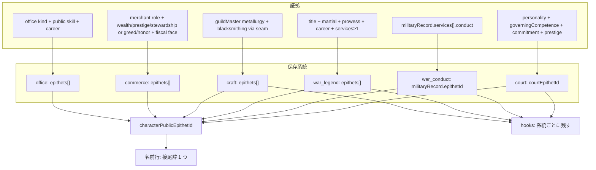
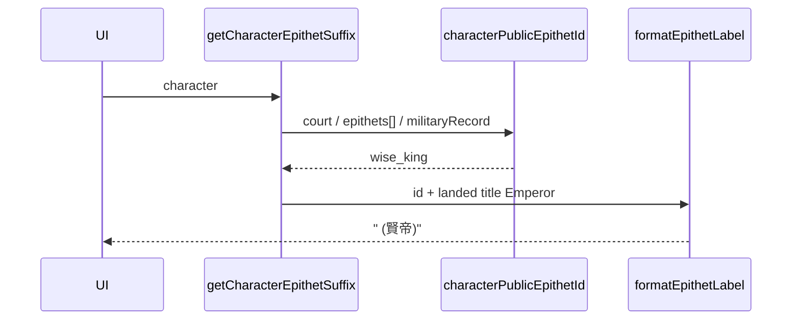

# 公開二つ名の適格職業カタログ

**Author**: Characters extension  
**Date**: 2026-09-07  
**Status**: 実装済み（2026-09-07）  
**Code (現行)**: `src/extensions/characters/courtFavorite.ts`, `src/extensions/characters/militaryWarRecord.ts`, `src/extensions/characters/utils/characterLabels.ts`  
**Related**: [court-favorite.md](docs/plan/characters/court-favorite.md), [military-war-record.md](docs/plan/characters/military-war-record.md), [prestige.md](docs/plan/characters/prestige.md), [character-expression-revision.md](docs/plan/characters/character-expression-revision.md), [flavor-text.md](docs/plan/characters/flavor-text.md), [individual-skill-mastery-system.md](docs/plan/individual-skill-mastery-system.md)

---

## Overview

公開二つ名は「民衆または同業が、本名の代わりに呼ぶ渾名」であり、全人物には付けない。現状は戦歴系統（`militaryRecord.epithetId`）と宮廷系統（`courtEpithetId`）の二本だけで、宮廷側は日本語が「賢王／愚王」に固定され、称号屈折も仁君・名君も、鍛冶の名工も、将の軍神もない。

本設計の成果物は全二つ名の文言完成表ではなく、**どの職業・役職が公開渾名を持ちうるか**の原則とカタログである。適格判定は Prestige の公開度・外部観察可能性・物語上の自然さ・既存（または近い将来の）証拠フィールドの四条件に置き、**職業 × 系統**ごとに yes / rare / no を決める。保存は系統（court / war_conduct / war_legend / craft / commerce / office）を残し、系統あたり最大 1 id、名前行は現行どおり一本だけを `characterPublicEpithetId` で選ぶ。フレーバーは保存した id から出し、架空事件は捏造しない。

---

## Background & Motivation

二つ名はすでに二系統ある。どちらも「閾値を超えた証拠がある者だけ」に付く。

| 系統 | 保存先 | id | 対象 |
| :--- | :--- | :--- | :--- |
| 戦歴 | `militaryRecord.epithetId` | `guardian` 守護神, `last_guard` 殿軍, `wall` 鉄壁, `vanguard` 先鋒, `idle_banner` 控えの将 | Marshal / Commander / Admiral / Warlord / 辺境領主。従軍の `WarConductKind` から付く。[military-war-record.md](docs/plan/characters/military-war-record.md), `militaryWarRecord.ts` |
| 宮廷 | `courtEpithetId` | `foolish_king` 愚王, `wise_king` 賢王, `sycophant` 佞臣 | 君主と、だまされやすい宮廷の佞臣一人。[court-favorite.md](docs/plan/characters/court-favorite.md), `courtFavorite.ts` |

名前行は `getCharacterEpithetSuffix` → `characterPublicEpithetId` で **宮廷が戦歴より優先**（`courtFavorite.ts` 93–98 行、`characterLabels.ts` 160–164 行）。フレーバーは両方残す（`flavorHooks.ts` 125–132 行）。英語は王号に依存しない（`the Wise` / `the Fool`）。court-favorite.md は「日本語はユーザー指定の愚王・賢王を使う」と書いてあり、本設計はそれを **称号屈折に改訂する**（PR1 で同文書を改正する。§4）。

痛みは次のとおり。

1. **称号屈折がない。** ユーザーは同一の「賢」を、King なら賢王、Emperor なら賢帝、President / Khan / High Priest なら賢君と出したい。現行 `characters.epithetNames.wise_king` は日本語「賢王」固定（`src/i18n/locales/ja.json`）。
2. **支配者の軸が一本。** 賢は合理性＋文治、愚はその逆。仁（Compassion）と名（公開 Prestige）は別の民衆渾名なのに、フィールドも id もない。
3. **職業カタログがない。** 軍神・名工は歴史上おかしくないが、適格職業が無いため足すたびに場当たりになる。諜報官（visibility 0）や見習い・大多数の農夫に付けると、Prestige の定義（民衆が想起する公開ブランド）と矛盾する。
4. **君主判定が称号を取りこぼす。** `isSovereignRuler` は `inferRoleClass === "ruler"`（`courtFavorite.ts` 42–44 行）。`inferRoleClass` は landed state より先に `isMartialCommandTitle` / `RELIGIOUS_TITLE_RE` を見る（`backstoryProfile.ts` 157–173 行）。そのため **Warlord・Caliph・High Priest は commander / religious になり、賢王判定の対象外**。一方 Prestige の `resolveOfficeKind` は landed state を ruler として扱う（`prestige.ts` 176–177 行）。Anarchy の Warlord と Theocracy の High Priest は `titleTable.ts` の国家元首そのものなので、二つ名側を Prestige に合わせる必要がある。
5. **軍神と守護神が未整理。** 守護神は救援・防衛の戦い方、軍神は個人武勇＋指揮の伝説であり、同じ `MilitaryEpithetId` に混ぜると証拠の意味が壊れる。
6. **Shogun は戦歴適格でない。** `MILITARY_TITLE_RE`（`advanceAge.ts` 84 行）は `Commander|Admiral|Marshal|General|Warlord|Minister of War` で Shogun を含まない。軍神を「従軍 ≥1」にすると、現状の Shogun には付かない。

Skills は遂行、Personality は傾向、Commitment は忠誠の所在、二つ名は保存した証拠から出す（[character-expression-revision.md](docs/plan/characters/character-expression-revision.md)）。数値ダンプで「名医と呼ばれた」と書かない。

---

## Goals & Non-Goals

### Goals

- 公開渾名の **適格原則** を四条件で固定し、コードで参照できる職業カタログにする。判定は **系統ごと**（King は court yes、Marshal は war_legend yes + war_conduct yes）。
- ユーザー例（賢君／賢王／賢帝、仁君、名君、軍神、名工）を必ず含め、支配者・中央官・武官・辺境・ギルド・市井・将来職を **yes / rare / no** で判定する。v1 で yes にする工芸は **実在する冶金親方だけ**。
- 賢／愚は **同一 id の表示屈折**。仁君・名君は別 id・別軸。`titleTable.ts` の元首称号への日本語マッピングを決める。court-favorite.md をその仕様に改正する。
- 戦歴・宮廷・職業（工芸／商／軍伝説）が共存しうるときの **名前行優先順位** と、軍神と守護神・先鋒の関係を決める。軍神の述語は **実際に Marshal / Commander / Warlord / Shogun に発火する** こと。
- 適格でも全員には付けない。名君を含む新規 court id も、賢王と同程度に稀な帯にする。
- セーブ互換: `courtEpithetId` と `militaryRecord.epithetId` を残し、新系統の載せ方を決める。
- Characters は Economy を静的 import しない。工芸の熟練は既存 seam 経由。
- 実装可能な型・関数名・パイプライン挿入点まで落とす。

### Non-Goals

- 全二つ名の i18n 完成表（本カタログの例 1〜3 件以外の entries）。
- 医師・船大工・独立宗教者・非冶金ギルド親方など、**まだ生成されない職業の新規スポーン**。
- 架空の戦役・診療・造船事件の捏造。
- 名前行に二つ名を並べること。
- Prestige visibility の再定義、9 Skills の追加。
- 諜報成功を民衆渾名に換算すること。
- `epithets[]` への一括移行（旧フィールド削除）を最初の PR で行うこと。
- v1 の `OccupationEpithetId` に将来 id（碩学・名優・名船匠・名医）を先回りして載せること。

---

## Proposed Design

### 1. 適格原則

二つ名は「民衆または同業が名前の代わりに呼ぶ **公開** 渾名」である。次を **すべて** 満たす職業だけを、その系統について適格（yes または rare）にする。

| # | 条件 | 判定に使う既存物 | 落とす例 |
| :--- | :--- | :--- | :--- |
| 1 | **公開されている** | `SPHERE_VISIBILITY` の public（`prestige.ts` 60–73 行）。spy-only は `resolveOfficeKind` が `spymaster` を返す（195–196 行）。[prestige.md](docs/plan/characters/prestige.md) §2.2 / §3 | Spymaster, Director of Intelligence |
| 2 | **腕前・治績・戦い方が外部から観察できる** | 公開技能（君主 Diplomacy、武官 Martial、宰相 Diplomacy、財務 Stewardship、宗教 Learning、職人は Economy 経由の `blacksmithing` proficiency）、戦歴 `services[]`、ギルド製品 | 室内で成果が事件化していない下級官僚、工作の成功 |
| 3 | **歴史・物語で渾名が自然** | 王・将・名工・名医・豪商は自然。無名の農夫全員、見習い全員は不自然 | Farmer の大多数、guildApprentice の大多数 |
| 4 | **証拠フィールドが既にある、または近い将来ある** | 現行: skills / personality / prestige / titles / roles / militaryRecord / courtEpithetId / commitment、および Characters の Economy seam。将来: 診療ログ、造船実績、非冶金ギルド人物 | 冒険者の「英雄譚」（クエストログなし）、石工ギルド親方（未生成） |

yes と rare の差は、原則を満たすかどうかではなく **発生頻度と証拠の厚さ**。rare は「職業としてはおかしくないが、現行データだけでは薄く、閾値を高くするか将来行にする」。**人物が生成されない職業は yes にしない**（名医と同じクラスの誤り）。

適格職業でも付与は任意ではない。**閾値を超えた者だけ**（現行 `chooseRulerEpithet` / `epithetFromServices` と同じ）。カタログの「例」は候補 id であり、自動で全員に配らない。

兼職: 職業二つ名は `resolveOfficeKind` を使う（王冠・Marshal が諜報称号より勝つ）。君主＋Spymaster は ruler として court 適格。Chancellor＋Spymaster は chancellor として `able_minister` を **許可**する。**Intrigue はどの系統の証拠にも使わない。** 諜報称号を一つでも持てば能吏を禁じる、という追加ゲートは置かない。

### 2. 系統とレイヤー

渾名を一袋にせず、証拠の種類で系統を分ける。軍神を `militaryRecord.epithetId` に入れない（そのフィールドは `WarConductKind` の集計専用、`epithetFromServices`）。**系統あたり保存は最大 1 id**（`allCharacterEpithets` + `find` が決定的）。



| 系統 | 意味 | 既存 | 新規例（v1） |
| :--- | :--- | :--- | :--- |
| `court` | 治世・宮廷での呼ばれ方 | foolish_king, wise_king, sycophant | benevolent_king 仁君, renowned_king 名君 |
| `war_conduct` | 従軍の戦い方 | guardian, last_guard, wall, vanguard, idle_banner | なし（軍神は入れない） |
| `war_legend` | 個人武勇＋指揮の伝説 | なし | war_god 軍神 |
| `craft` | 同業と市井が呼ぶ職人渾名 | なし | master_artisan 名工, prodigy 神童 |
| `commerce` | 市井が呼ぶ商人渾名 | なし | magnate 豪商, unscrupulous_merchant 悪徳商人 |
| `office` | 公開官職の能吏・政務渾名 | なし（佞臣は court） | able_minister 能吏 |

碩学・名優・名匠（非冶金）・名船匠・名医はカタログの将来行であり、v1 の union に載せない。

### 3. 君主判定の修正（屈折・仁君・名君の前提）

`isSovereignRuler` を Prestige と同じ「landed state 称号」に合わせる。

```ts
// 現行: inferRoleClass === "ruler"  → Warlord / Caliph / High Priest を落とす
// 改:
export function isSovereignRuler(character: Character): boolean {
  return character.titles.some(t => t.landed && t.entityType === "state");
}
```

`inferRoleClass` 自体は技能バイアス・estate 用に残す。二つ名と Prestige の「民衆が誰を君主と思うか」は王冠（landed state）を正とする。君主が Spymaster を兼ねる場合は現行どおり王冠が公開なので ruler 側を取る。

`pairCourtFavorites` は `court.find(isSovereignRuler)` を使うため、この修正のあと Warlord 宮廷にも愚王がいれば佞臣が付きうる（望ましい）。Marshal / Count は landed state ではないので court 元首にはならない。

ギルド親方は `inferRoleClass === "merchant"` になりうる（`backstoryProfile.ts` 159 行）。**二つ名カタログは `roles.kind` を先に見る。** 親方が stray の state office を持っていても craft 判定は `guildMaster` が勝つ。

### 4. 称号屈折（賢／愚）

**同一 id を残し、表示だけ屈折する。** `wise_king` / `foolish_king` を King / Emperor 用に分裂させない。英語は現行どおり `the Wise` / `the Fool`（王号非依存）。日本語だけ、**landed state の `TitleHolding.title` 文字列**から stem を選ぶ。`gender` では決めない（Queen は `"Queen"` として保存されている）。

これは court-favorite.md「日本語はユーザー指定の愚王・賢王を使う」の **意図した改訂** である。PR1 が同文書を次のように改正する: 日本語は stem 屈折する。共和・Caliph・High Priest・Warlord・Shogun・President は賢君／愚君。英語は変えない。Queen／Empress の女性形はスコープ内。Martial は `governingCompetence` に入れない。

Stem は `titleTable.ts` の `FORMNAME_TITLES` と `FORM_FALLBACK_TITLES` が出す英語称号の完全表。複数称号があるときは **landed state を使う**。

| 保存称号 | stem キー | 賢 | 愚 | 根拠 |
| :--- | :--- | :--- | :--- | :--- |
| King | `king` | 賢王 | 愚王 | ユーザー例 |
| Queen | `queen` | 賢女王 | 愚女王 | 女王を「賢王」に潰さない。Consort の「賢后」は使わない |
| Emperor | `emperor` | 賢帝 | 愚帝 | ユーザー例 |
| Empress | `empress` | 賢女帝 | 愚女帝 | 既存称号ラベル「女帝」 |
| Tsar | `emperor` | 賢帝 | 愚帝 | 皇帝相当 |
| Tsarina | `lord` | 賢君 | 愚君 | 称号ラベルは「ツァリーツァ」であり「女帝」ではない |
| その他の元首 | `lord` | 賢君 | 愚君 | 下記の完全リスト |

`lord` になる称号（`FORMNAME_TITLES` / `FORM_FALLBACK_TITLES` の残り全部）:

Khan, Khatun, Khagan, Bey, Begum, Caliph, Emir, Emira, Shogun, Despot, Despotissa, Satrap, Grand Duke, Grand Duchess, Duke, Duchess, Prince, Princess, Margrave, Margravine, Lord Protector, Lady Protector, President, Chairman, Chairwoman, High Priest, High Priestess, Warlord.

Khagan は `titleTable.ts` にあるが `TITLE_KEY_BY_ENGLISH` には無い。stem はそれでも `lord`。Caliph の女性形も `"Caliph"` なので賢君のまま（性による分岐なし）。Shogun は称号が既に「将軍」なので「賢将」にしない。

**仁君・名君は屈折しない。** 仁王は仁王像と衝突し、仁帝・名帝は日本語として不自然。共和の元首にも「仁君」「名君」（英語 `the Benevolent` / `the Renowned`）。

未成年君主は `"King (Under Regency)"` のように保存される（`characterLifecycle.ts`、`characterLabels.ts` の `UNDER_REGENCY_SUFFIX = " (Under Regency)"`）。`getCharacterTitleLabel` は既にこの接尾辞を剥がす。stem 照合も **同じ定数で剥がしてから** `SOVEREIGN_STEM_BY_TITLE` を引く。剥がさないと `"King (Under Regency)"` が表に無く `?? "lord"` → 賢君になる。賢／愚にキャリア下限は無いので、帯を満たす幼王が誤屈折する。

PR1 で `UNDER_REGENCY_SUFFIX` を `characterLabels.ts` から export し、epithetCatalog がそれを import する（文字列を複製しない）。

```ts
export type SovereignEpithetStem = "king" | "queen" | "emperor" | "empress" | "lord";

const SOVEREIGN_STEM_BY_TITLE: Readonly<Record<string, SovereignEpithetStem>> = {
  King: "king",
  Queen: "queen",
  Emperor: "emperor",
  Empress: "empress",
  Tsar: "emperor",
  Tsarina: "lord"
  // その他の FORMNAME / FORM_FALLBACK 元首称号はすべて "lord"
};

export function stripUnderRegencySuffix(title: string): string {
  return title.endsWith(UNDER_REGENCY_SUFFIX) ? title.slice(0, -UNDER_REGENCY_SUFFIX.length) : title;
}

export function landedSovereignTitle(character: Pick<Character, "titles">): string | undefined {
  return character.titles.find(t => t.landed && t.entityType === "state")?.title;
}

export function sovereignEpithetStem(title: string): SovereignEpithetStem {
  return SOVEREIGN_STEM_BY_TITLE[stripUnderRegencySuffix(title)] ?? "lord";
}

export function formatEpithetLabel(id: string, character: Pick<Character, "titles" | "roles">): string {
  // ja かつ wise_king / foolish_king のときだけ
  // t(`characters.epithetStems.${id}.${sovereignEpithetStem(landedTitle)}`)
  // それ以外・en は t(`characters.epithetNames.${id}`)
}
```

PR1 テスト: `"King (Under Regency)"` → stem `king` → 賢王（賢君ではない）。Queen / Emperor の同接尾辞も同様。

i18n は **入れ子の stem 表** にする。裸の `epithetNames.wise_king` を日本語「賢王」のまま残すと、`formatEpithetLabel` が外れたとき Emperor が再び賢王になる。日本語の `epithetNames.wise_king` は使わない（または英語専用の `the Wise` のみ）。フレーバーも同じ `formatEpithetLabel` を `{{epithet}}` に渡す。

`getCharacterEpithetSuffix` の Pick 型は `titles` / `roles` / `epithets` を含む形に広げる。

### 5. 支配者の三軸（賢 / 仁 / 名）と愚・佞臣

既存 `foolish_king` / `wise_king` と矛盾させない。Martial / Prowess は統治能力に入れない（現行 `governingCompetence` = Diplomacy / Stewardship / Learning / Geography の平均、`courtFavorite.ts` 29–32 行）。

| id | 日本語 | 英語 | 軸 | 付与帯 | 同時に付かないもの |
| :--- | :--- | :--- | :--- | :--- | :--- |
| `foolish_king` | 愚王／愚帝／愚君／愚女王／愚女帝 | the Fool | 低判断 | 現行: 合理性 ≤35、かつ統治 ≤42 または Intrigue ≤35 | wise / 仁 / 名 / 暴 |
| `tyrant_king` | 暴君 | the Tyrant | 性格の悪さ（仁の反対） | Compassion ≤30、かつ Vengefulness ≥70 または（Honor ≤35 かつ Greed ≥65）。Guile / Sociability は使わない。統治能力は問わない | foolish（愚が先）。仁 |
| `wise_king` | 賢王／賢帝／賢君／賢女王／賢女帝 | the Wise | 合理性＋文治＋看破 | 現行: 合理性 ≥70、統治 ≥65、Intrigue ≥50 | foolish / 暴 |
| `benevolent_king` | 仁君 | the Benevolent | Compassion（＋最低限の統治） | Compassion ≥70、統治 ≥50、foolish / tyrant でない | foolish / 暴。佞臣とも組まない |
| `renowned_king` | 名君 | the Renowned | 公開の確立した治世 | 下記。賢より稀か同程度 | foolish / 暴。佞臣とも組まない |
| `sycophant` | 佞臣 | the Sycophant | 技能＋忠誠の所在 | 現行の技能条件。**候補から元首を除外** | 元首 |

**名君の帯（実際に稀にする）:**

- 人間換算キャリア ≥25（戦歴の熟年と同じ。若年王の官職バンプだけでは不可。20 歳王の中央値 63、[prestige.md](docs/plan/characters/prestige.md) §5）
- `prestige` ≥95（50 歳王の p10 は 88、中央値 96。≥85 だとほぼ全員なので使わない）
- `governingCompetence` ≥70（賢の机上 65 より厳しい）
- 公開技能 Diplomacy ≥75
- foolish でない

賢は三重 AND（合理性・統治 65・Intrigue）。名は机上がより高く、知名度が上側で、sage 判定を要求しない。ウォーターフォールで賢・仁のあとだけ付くので、「有名な凡庸」にはならない。

**宮廷系統は一人一条。** 付与ウォーターフォール:

1. `foolish_king`
2. `tyrant_king`（有能な残忍は賢王より暴君。無能な残忍は愚王のまま）
3. `wise_king`
4. `benevolent_king`
5. `renowned_king`
6. なし

**仁君・暴君は屈折しない。** 暴王は使えるが、仁君に合わせて「君」で固定する。英語 `the Tyrant`。

**佞臣ペア（`selectCourtFavorite` を明示する）:**

```ts
export function selectCourtFavorite(ruler: Character, court: readonly Character[]): Character | undefined {
  if (!isSovereignRuler(ruler)) return undefined;
  // 仁君・名君・賢王には新しい佞臣を付けない。未設定のだまされやすい君主と愚王・だまされやすい暴君だけ。
  if (ruler.courtEpithetId && ruler.courtEpithetId !== "foolish_king" && ruler.courtEpithetId !== "tyrant_king") return undefined;
  if (ruler.courtEpithetId !== "foolish_king" && !isGullibleSovereign(ruler)) return undefined;
  if (isWiseSovereign(ruler) || ruler.courtEpithetId === "wise_king") return undefined;

  const peers = court.filter(c => c.i !== ruler.i && !c.dead && c.state === ruler.state);
  const existing = peers.find(c => c.courtEpithetId === "sycophant");
  if (existing) return existing;

  const candidates = peers.filter(c => isCourtierDeceiver(c) && !isSovereignRuler(c));
  // …
}
```

`isCourtierDeceiver` にも `!isSovereignRuler(character)` を入れる。Warlord / Caliph / High Priest は `inferRoleClass` が commander / religious のままなので、このガードが無いと元首が佞臣候補になる。

テスト必須: 仁君は佞臣を結ばない。名君も結ばない。Warlord / Caliph / High Priest 元首は `sycophant` 候補にならない。

### 6. 軍神と戦歴二つ名

| | 守護神・先鋒・鉄壁・殿軍・控えの将 | 軍神 |
| :--- | :--- | :--- |
| 系統 | `war_conduct` | `war_legend` |
| 証拠 | 戦争ごとの `conduct` 件数 | **称号 + Martial + Prowess + キャリア + 従軍 ≥1**。`militaryStanding` は使わない |
| 意味 | どう戦ったか | 武勇と指揮が伝説になった |
| 保存 | `militaryRecord.epithetId` | `epithets[]` の `war_god` |

**軍神の適格職:** Marshal / General / Minister of War / Commander / Admiral / 元首 Warlord / 元首 Shogun。辺境領主は戦歴二つ名のみ。連隊ロールは現行ほぼ未生成 → rare。

`resolveOfficeKind` は landed Warlord / Shogun を `ruler` にする（軍 vis 0.50、bump 8）。軍神の述語は **称号文字列** を見し、OfficeKind を見ない。

**Shogun の戦歴適格（PR4 が実装する。`isMilitaryCareerCharacter` 追随だけでは足りない）:**

- `advanceAge.ts` の `MILITARY_TITLE_RE` に `Shogun` を足す。これで `isWarRecordEligible` は true になる。
- **`militaryWarRecord.ts` の `MARTIAL_COURT_TITLE_RE` にも `Shogun` を足す**（現行 `/^(Marshal|General|Warlord|Minister of War)$/i`、`serviceChance` 0.88）。足さないと適格だけが立ち、従軍ロールは `isMilitaryCareerCharacter` の **0.5** に落ちる。Warlord は既に 0.88。Shogun は同じ武家元首なので **0.88 が意図**。§6 の「2 戦で軍神」例は、この密度を前提にする。0.5 のままにしない。
- `isMartialCommandTitle` には足さない（`inferRoleClass` を ruler のままにする）。
- Warlord は既に `MILITARY_TITLE_RE` と `MARTIAL_COURT_TITLE_RE` の両方にある。
- [military-war-record.md](docs/plan/characters/military-war-record.md) の対象リストに Shogun を追記する。
- 全ruler を戦歴適格にしない。

**付与帯（standing を使わない。Alternative G）:**

```ts
function isWarGodEligible(character: Character): boolean {
  if (!hasWarGodTitle(character)) return false; // Marshal|General|Minister of War|Commander|Admiral|Warlord|Shogun
  if (humanCareerYears(character) < SEASONED_CAREER_YEARS) return false; // 25
  if (character.skills.martial < 80 || character.skills.prowess < 75) return false;
  const record = character.militaryRecord;
  if (!record || record.services.length < 1) return false;
  if (record.epithetId === "idle_banner") return false;
  return true;
}
```

希少性は「Martial と Prowess の両方の上側」＋熟年＋実在の従軍。机上の軍神は作らない。Admiral に海神は作らない（`Campaign` に海戦フラグなし、`src/types/models.ts`）。

**旧案 `militaryStanding ≥70` が発火しないことの計算**（`prestige.ts`: `0.35 × inheritedMid + MILITARY_OFFICE_BUMP + record(軍 vis, martial)`、record 上限 55）。

| 人物 | OfficeKind（standing 用） | standing 概算 | martial / prowess | 従軍 | 新述語 |
| :--- | :--- | ---: | :--- | :--- | :--- |
| Marshal、minor_noble、キャリア 30、martial 85、prowess 80、3 戦 | marshal vis 1.00 bump 18 | **≈57** | 85 / 80 | 3 | **付く**（旧 ≥70 は失敗） |
| Commander、minor_noble、キャリア 28、martial 82、prowess 78、2 戦 | field_commander vis 0.90 bump 14 | **≈49** | 82 / 78 | 2 | **付く**（旧 ≥70 は失敗） |
| Warlord、royal、landed、キャリア 30、martial 88、prowess 82、2 戦 | **ruler** vis 0.50 bump 8 | **≈40** | 88 / 82 | 2 | **付く**（旧 ≥70 は失敗） |
| Shogun、同上（PR4 で戦歴適格にしたあと） | ruler vis 0.50 bump 8 | **≈40** | 88 / 82 | 2 | **付く** |
| Marshal、martial 70、prowess 90、3 戦 | marshal | ≈53 | 70 / 90 | 3 | 付かない（指揮技能不足） |
| Marshal、martial 90、prowess 80、`idle_banner` | marshal | ≈60 | 90 / 80 | 2+ 後退 | 付かない |

Marshal 55 歳・martial 90 でも standing は ≈60。royal Warlord が martial 100 でも ruler 短絡のため 70 に届かない。よって standing ゲートは捨てる。

**重複表示:**

- 名前行: court > war_legend > craft > commerce > office > war_conduct（§8）
- `idle_banner` と `war_god` は排他
- **`war_god` があるとき `epithet.guardian` は出さない**（どちらも「神」で、二重の神号に読める）。軍神フレーバーは「武勇と指揮の伝説」であり、もう一つの祀りではない
- 先鋒・鉄壁・殿軍は軍神とフレーバー共存してよい（戦い方と伝説は別レイヤー）

### 7. 職業カタログ

判定キーは `resolveOfficeKind` / `titles[].title` / `roles[].kind` + `roles[].domain`。**適格列は系統付き**（Warlord は court yes かつ war_legend yes）。

#### 7.1 支配者・宮廷

| 職業／役職 | 対応 | 適格 | 理由 | 例 | 根拠フィールド | 屈折 |
| :--- | :--- | :--- | :--- | :--- | :--- | :--- |
| 君主（King/Queen） | landed state | **court: yes** | visibility 1.00 | `wise_king` 賢王／賢女王, `foolish_king`, `tyrant_king` 暴君, `benevolent_king` 仁君, `renowned_king` 名君 | rationality, governingCompetence, intrigue, compassion, vengefulness, honor, greed, prestige, career, diplomacy | 賢／愚のみ。暴／仁／名は屈折しない |
| 皇帝（Emperor/Empress） | landed state | **court: yes** | 同上 | 表示 賢帝／賢女帝 | 同上 | emperor / empress |
| Tsar / Tsarina | landed state | **court: yes** | Tsar は帝、Tsarina はツァリーツァ | Tsar 賢帝、Tsarina 賢君 | 同上 | Tsar=emperor, Tsarina=lord |
| Khan / Khatun / Khagan / Bey / Emir | landed state | **court: yes** | 元首は民衆に見える | 賢君 / 愚君 / 仁君 / 名君 | 同上 | lord |
| Caliph | landed state。inferRoleClass は religious | **court: yes** | 主権。`isSovereignRuler` 修正必須 | 賢君 / 愚君 / 仁君 / 名君 | 同上 | lord。女性称号も Caliph |
| Shogun | landed state | **court: yes。war_legend: yes。war_conduct: yes**（PR4 で戦歴適格化） | 武家元首 | 賢君, `war_god` | court 軸 + 軍神述語 | 賢／愚は lord |
| President / Chairman / Chairwoman | landed state | **court: yes** | 日本語は賢君 | 賢君 / 愚君 / 仁君 / 名君 | 同上 | lord |
| High Priest / High Priestess | landed state。inferRoleClass は religious | **court: yes** | 神権の元首。「聖主」は奇跡証拠なし | 賢君 / 愚君 / 仁君 / 名君 | Piety だけでは付けない | lord |
| Warlord | landed state。inferRoleClass は commander。`MILITARY_TITLE_RE` 済み | **court: yes。war_legend: yes。war_conduct: yes** | 将軍国家の元首 | 賢君 / 愚君 / 軍神 | court + 軍神述語 | lord |
| 公爵・大公・太守など主権者 | landed state（Grand Duchy, Duchy, Principality, Satrapy, Despotate, Dominion） | **court: yes** | 地図上の元首 | 賢君 / 愚君 / 仁君 / 名君 | 同上 | lord。賢公は作らない |
| 佞臣 | 中央官・武官・宗教官、かつ非元首 | **court: yes** | 既存 | `sycophant` 佞臣 | 現行 + `!isSovereignRuler` | なし |
| 宰相 Chancellor | `OfficeKind` chancellor, vis 0.70 | **office: rare** | 職は見える。実績イベントは薄い | `able_minister` 能吏 | diplomacy ≥80, prestige ≥50, career ≥15, 非 sycophant | なし |
| 外務 Minister of Foreign Affairs | chancellor, vis 0.70 | **office: rare** | 宰相に同じ | `able_minister` | 同上 | なし |
| Prime Minister | **`OfficeKind` steward, vis 0.50**（`STEWARD_TITLE_RE`） | **office: rare** | Chancellor の vis を流用しない | `able_minister` | 財務行と同じ高い帯 | なし |
| 財務 Steward / Minister of Finance | steward, vis 0.50 | **office: rare** | 室内官 | `able_minister` | stewardship ≥85, prestige ≥55, career ≥20 | なし |
| 宮廷司祭 Court Chaplain | chaplain, vis 0.60 | **office: rare / 将来** | 碩学は観察できるが v1 union に入れない | （将来 `learned_divine`） | learning ≥85 | なし |
| 諜報 Spymaster / Director of Intelligence | spy-only なら spymaster vis **0** | **全系統: no** | 民衆の名誉にならない | — | Intrigue を公開根拠に使わない | — |
| その他の中央官（vis 0.35） | central_officer | **no** | 室内官僚 | — | — | — |
| 摂政 Regent | 本人は central_officer vis 0.35。`"(Under Regency)"` は君主側の接尾辞 | **no**（摂政本人）。君主側の court は yes | 摂政に二つ名を新設しない | — | — | 君主の屈折は接尾辞を剥がしてから（`"King (Under Regency)"` → 賢王） |
| Patrician | 称号のみ。 vis は中央官相当 | **no** | 名誉称号 | — | — | — |

#### 7.2 軍事・辺境

| 職業／役職 | 対応 | 適格 | 理由 | 例 | 根拠フィールド | 屈折 |
| :--- | :--- | :--- | :--- | :--- | :--- | :--- |
| 軍務卿 Marshal / General / Minister of War | marshal | **war_conduct: yes。war_legend: yes** | ユーザー例 | `war_god`、既存戦歴 id | §6 の軍神述語、militaryRecord | なし |
| 野戦指揮官 Commander | field_commander | **war_conduct: yes。war_legend: yes**（技能帯で稀） | 戦い方は観察できる | 戦歴 id、条件を満たせば軍神 | 同上。standing では落とさない | なし |
| 提督 Admiral | FIELD_TITLE_RE | **war_conduct: yes。war_legend: yes** | 海神は証拠なし | 戦歴 id、条件を満たせば軍神 | 同上 | なし |
| 連隊指揮官・守備兵 | roles ~ regiment/garrison/soldier | **rare** | 生成が薄い | 戦歴のみ（将来） | 役職が実在してから | — |
| 商会護衛 bodyguard | merchantOrganizationBodyguard | **no** | 私兵 | — | — | — |
| 商会書記 / 幹部 / 代理人 | merchantOrganizationSecretary / Executive / Agent | **no** | 室内。公開渾名にならない | — | — | — |
| 辺境領主 Count / Margrave / Baron / Governor 等 | province lord。戦歴適格 | **war_conduct: yes。court: no。war_legend: no** | 名君は国家元首の語。軍神は国家規模の指揮 | 守護神・鉄壁等。名伯は将来 | militaryRecord | なし |
| playerCharacter | roles.kind playerCharacter | **職業としては no** | 肩書があればその系統で判定 | — | 称号・role に従う | — |

#### 7.3 ギルド・市井・将来職

`guildSuccession.ts` の `SUCCESSION_DOMAINS` は `["metallurgy"]` のみ。親方・見習い・`ensureBlacksmithingSkill` も冶金だけ。非冶金ギルド人物は生成されない。`weaving` / `tailoring` は `INDIVIDUAL_SKILL_DOMAINS` にあるが人物に付かない。

| 職業／役職 | 対応 | 適格 | 理由 | 例 | 根拠フィールド | 屈折 |
| :--- | :--- | :--- | :--- | :--- | :--- | :--- |
| ギルド親方・冶金 | `guildMaster` + `domain === "metallurgy"` | **craft: yes** | ユーザー例の第一候補。人物も実技も実在 | `master_artisan` 名工 | `readEconomyCraftSkill` の blacksmithing | v1 は名工固定 |
| ギルド親方・その他ドメイン | 未生成 | **rare / 将来** | 名医と同じ。人物がいない | 名匠マップは将来用（§7.4） | `SUCCESSION_DOMAINS` が伸びてから yes に反転 | — |
| ギルド見習い（冶金） | guildApprentice | **no**（神童のみ例外） | Prestige 1–5（[guilds/relations.md](docs/plan/guilds/relations.md)） | `prodigy` 神童 | `skills.engineering` ≥90。実践 proficiency は使わない | なし |
| 一般工匠 craftsperson | characterPopulation | **no** | ギルド外の無名職人 | — | — | — |
| 商人 merchant / marketManager / rival | merchant vis 0.45 | **commerce: rare** | 豪商は自然。露店はおかしい。請負・高利の顔は悪徳商人 | `magnate` 豪商, `unscrupulous_merchant` 悪徳商人 | 豪商: stewardship ≥70, prestige ≥55, 同市の上側 wealth。悪徳商人: greed ≥75, honor ≤35（系統は 1 id。悪徳が先） | なし |
| 商会代表 merchantOrganizationHead | 同上 | **commerce: rare** | 豪商の第一候補。悪徳商人にもなりうる | `magnate`, `unscrupulous_merchant` | 同上 | なし |
| 宗教者（非元首の Vicar/Dean 等） | religious | **rare / 将来** | 列聖は no | — | Piety 単独では付けない | — |
| 冒険者 adventurer | kind adventurer | **no**（将来 rare） | 英雄譚ログなし | — | — | — |
| 狩人 hunter | kind hunter | **no** | 狩猟ログなし | — | — | — |
| 芸能 performer | kind performer | **rare / 将来** | 公演イベントなし。v1 union に入れない | （将来 `virtuoso`） | — | — |
| 書記 scribe | kind scribe | **no** | 室内 | — | — | — |
| 農夫 farmer | kind farmer | **no** | 大多数に渾名はおかしい | — | — | — |
| 船大工 | 未接続（`guildKnowledgeTypes.ts` 56–58 行） | **rare / 将来** | 職業生成なし | — | — | — |
| 医師 | 独立職業なし | **rare / 将来** | `characterHealth.ts` の physician は富の比喩 | — | — | — |

#### 7.4 工芸の表示屈折（名工 / 名匠）

v1 で付くのは冶金親方の **名工** だけ。名匠は `SUCCESSION_DOMAINS` が masonry / textiles / printing を含むようになったあとのラベルマップであり、現行適格ではない。

| `CraftKnowledgeDomain` | 日本語 | 英語 | v1 |
| :--- | :--- | :--- | :--- |
| metallurgy | 名工 | the Master | **yes** |
| woodworking, leather, glassware, instruments | 名工 | the Master | 将来。instruments は artistry ≥70 を追加ゲートにする |
| masonry, textiles, printing | 名匠 | the Master | 将来 |

付与帯（冶金親方のみ）: 人間換算キャリア ≥15、かつ `readEconomyCraftSkill(id, "blacksmithing")` が:

- `proficiency` ≥85、または
- `proficiency` ≥80 かつ `aptitude` が `gifted` / `exceptional`

Economy 無効・seam が `undefined` のときは **付けない**（engineering へのフォールバックなし。名工は鍛冶の証拠）。初期 proficiency は `clamp(max(40, min(90, engineering)))` なので ≥85 は到達可能。

神童 `prodigy`: 冶金見習いのみ、`skills.engineering` ≥90（Characters 上の値。Economy import 不要）。親方に神童は付けない。

### 8. 一人物複数と名前行

共存は許可する。系統あたり 1 id。名前行は 1 つ。フレーバーは §6 の guardian 抑制を除き系統ごとに出す。

**優先順位（高い順）:** court > war_legend > craft > commerce > office > war_conduct。



### 9. 希少性

| 系統 | 方針 | 既存アンカー |
| :--- | :--- | :--- |
| court 賢／愚 | 現行閾値を維持。中庸の君主は無名 | rationality 70/35, 統治 65/42 |
| court 仁 | Compassion 上側 | Compassion ≥70 |
| court 名 | 確立キャリア＋机上 70＋Diplomacy 75＋prestige ≥95。ウォーターフォールの余りではない「高い帯の余り」 | 50 歳王 p10=88 を下回る ≥85 は使わない |
| 佞臣 | 宮廷最大 1。愚王／未設定の gullible のみ。元首は候補外 | `selectCourtFavorite` |
| war_conduct | 従軍が溜まってから | `epithetFromServices` |
| 軍神 | 熟年＋両技能上側＋従軍。standing なし。控えの将は除外 | SEASONED 25 年, martial 80, prowess 75 |
| 名工 | 冶金親方の上側だけ | proficiency 85 帯 |
| 神童 | 見習いの例外線だけ | engineering ≥90 |
| 豪商・能吏 | rare。 vis 0.45–0.70 なので技能と prestige を両方 | 商家 Dynasty prestige ≥55 を商の床 |

帯を下げる方向の緩和はカタログ変更として扱う。

### 10. パイプライン

現行:

```
applyCharacterBackstory（prestige）
seedMilitaryWarRecords（戦歴・epithetId）
finalizeCharacterSociety
  seedCharacterBonds
  seedCourtFavorites（courtEpithetId）
  applyCharacterHooks
```

ギルド親方・見習いは Economy `guildSuccession.ts` が `createPerson` + `applyCharacterBackstory` + `getInitialApprenticePrestige` のあと `finalizeCharacterSocietyForPeer`。

追加:

```
seedMilitaryWarRecords          // PR4: Shogun も適格
seedCourtFavorites              // 仁君・名君 waterfall、isSovereignRuler、佞臣ガード
seedOccupationEpithets          // PR3 で no-op stub。PR4–6 が中身
applyCharacterHooks             // 屈折ラベル。guardian は war_god 時に抑制
```

`seedOccupationEpithets` は Characters 所有（`src/extensions/characters/occupationEpithets.ts`）。**`src/extensions/economy/*` を静的 import しない。** 工芸は `specializationRuntime.ts` の seam:

```ts
// 現行は proficiency だけ。PR5 で拡張する（Economy 型は import しない）。
export type AptitudeTierName = "poor" | "ordinary" | "promising" | "gifted" | "exceptional";
export interface EconomyCraftSkillRead {
  proficiency: number;
  aptitude?: AptitudeTierName;
}
export function readEconomyCraftSkill(characterId: number, domain: string): EconomyCraftSkillRead | undefined;
```

既存 `readEconomyPractice` は残してよい。Economy 無効・配列なしなら `undefined` → 名工をスキップ。実装は `getApi().simulationContext?.extensions?.economy.individualSkills` を構造的に読む（現行 `readEconomyPractice` と同じ）。

**シードは生成時と peer add だけ。ロードは呼ばない。** 旧セーブの欠落 `epithets` は欠落のまま（軍神・名工は再生成するまで付かない）。現行の court シードと同じ。`finalizeCharacterSociety` をロードで回さない、という既存慣行を文書化する。付与は系統ごとに fill-if-empty。

### 11. 表示とフレーバー

- 名前行: `getCharacterEpithetSuffix` → `formatEpithetLabel`（PR1 から。Emperor の名前行とフレーバーが食い違わないこと）
- フレーバー: `formatFlavorHook` の `epithet.*` は `characters.epithetNames.${id}` 直読みをやめ、屈折後ラベルを `{{epithet}}` に渡す。現行 ja `epithet.wise_king` の「賢王と呼ばれる…」ハードコードは、default テンプレ `{{epithet}}と呼ばれる。` 側へ寄せる
- `war_god` 時は `epithet.guardian` を出さない
- 架空の諫言事件・一戦の勝敗は書かない

---

## API / Interface Changes

```ts
export type EpithetLineage =
  | "court"
  | "war_conduct"
  | "war_legend"
  | "craft"
  | "commerce"
  | "office";

export type CourtEpithetId =
  | "foolish_king"
  | "wise_king"
  | "sycophant"
  | "benevolent_king"
  | "renowned_king";

export type MilitaryEpithetId =
  | "guardian"
  | "last_guard"
  | "wall"
  | "vanguard"
  | "idle_banner"; // war_god を足さない

/** v1。将来 id（learned_divine, virtuoso, master_shipwright, famed_physician）は載せない。 */
export type OccupationEpithetId =
  | "war_god"
  | "master_artisan"
  | "prodigy"
  | "magnate"
  | "unscrupulous_merchant"
  | "able_minister";

export interface CharacterEpithet {
  lineage: Exclude<EpithetLineage, "court" | "war_conduct">;
  id: OccupationEpithetId;
}

export type EpithetEligibility = "yes" | "rare" | "no";
```

`Character.epithets?: CharacterEpithet[]`。書き込み時に同一 `lineage` を二度入れない。

```ts
export function allCharacterEpithets(character: Character): { lineage: EpithetLineage; id: string }[] { /* 旧フィールド + epithets */ }

const NAME_LINE_PRIORITY: EpithetLineage[] = [
  "court", "war_legend", "craft", "commerce", "office", "war_conduct"
];

export function characterPublicEpithetId(character: Character): string | undefined {
  const all = allCharacterEpithets(character);
  for (const lineage of NAME_LINE_PRIORITY) {
    const hit = all.find(e => e.lineage === lineage);
    if (hit) return hit.id;
  }
  return undefined;
}
```

カタログ API は **系統キー**（一人の Warlord が court yes かつ war_legend yes で表せる）:

```ts
// src/extensions/characters/epithetCatalog.ts
export function eligibilityFor(character: Character, lineage: EpithetLineage): EpithetEligibility;
export function eligibilityByLineage(character: Character): Partial<Record<EpithetLineage, EpithetEligibility>>;
export function stripUnderRegencySuffix(title: string): string; // UNDER_REGENCY_SUFFIX を characterLabels から import
export function sovereignEpithetStem(title: string): SovereignEpithetStem; // 接尾辞を剥がしてから SOVEREIGN_STEM_BY_TITLE
export function formatEpithetLabel(id: string, character: Character): string;
```

`isPublicEpithetOccupation` 一本のスカラーはテストの正本にしない。

i18n（ja）:

```json
"epithetNames": {
  "wise_king": "the Wise",
  "foolish_king": "the Fool",
  "benevolent_king": "仁君",
  "renowned_king": "名君",
  "war_god": "軍神",
  "master_artisan": "名工",
  "prodigy": "神童",
  "magnate": "豪商",
  "unscrupulous_merchant": "悪徳商人",
  "able_minister": "能吏"
},
"epithetStems": {
  "wise_king": {
    "king": "賢王",
    "queen": "賢女王",
    "emperor": "賢帝",
    "empress": "賢女帝",
    "lord": "賢君"
  },
  "foolish_king": {
    "king": "愚王",
    "queen": "愚女王",
    "emperor": "愚帝",
    "empress": "愚女帝",
    "lord": "愚君"
  }
}
```

英語は常に `epithetNames`（`the Wise` 等）。stem 表は ja 専用。`epithetNames.wise_king` を日本語「賢王」にしない。

---

## Data Model Changes

| フィールド | 変更 |
| :--- | :--- |
| `courtEpithetId` | 型に `benevolent_king` / `renowned_king` を追加。既存 3 id はそのまま |
| `militaryRecord.epithetId` | **変更しない**。軍神を入れない |
| `epithets?: CharacterEpithet[]` | 新系統。系統あたり 1。欠落は未使用 |
| セーブ | 任意フィールド。**シードは生成時と peer add のみ。ロードは呼ばない。** 旧地図の欠落 `epithets` は欠落のまま |
| 移行 | court/war を配列へ移さない。アダプタが合成する |

リスク（中）: `characterPublicEpithetId` のシグネチャ拡張。フィクスチャに `titles: []` を足す。

リスク（低）: Emperor の旧セーブが「賢王」から「賢帝」に見える。意図した屈折。フレーバーも PR1 で同じラベルにする。

リスク（中）: `MILITARY_TITLE_RE` に Shogun を足すと prowess 減衰が warrior になる。武家元首として妥当。`isMartialCommandTitle` は触らない。`MARTIAL_COURT_TITLE_RE` に足すと従軍 0.88 になり、Warlord と同じ密度の戦歴が付く（意図どおり）。

---

## Alternatives Considered

### A. 二つ名を `publicEpithetId` 一本に畳む

名前行と同じ値だけを保存する。実装は短い。

却下: フレーバーが戦歴と宮廷を両方出せなくなる。佞臣ペアと `epithetFromServices` の証拠が消える。軍神を付けると先鋒が上書きされる。現行セーブの二フィールドを捨てる破壊的変更。

### B. 最初から汎用 `epithets[]` だけにし、旧フィールドを削除・移行する

系統を配列で統一できる。

却下（v1）: court-favorite / military-war-record / UI / テスト / フレーバーが全部同時に動く。セーブ移行が設計の主目的を食う。**新系統だけ配列に載せ、旧二フィールドはアダプタで読む。**

### C. 賢王・賢帝・賢君を別 id にする（`wise_emperor` 等）

表示分岐が不要。

却下: 付与条件は同一。id 分裂はウォーターフォール・佞臣除外・i18n・テストを倍増させる。称号変更のたびに id を張り替える。**id は概念、ラベルは称号。**

### D. 軍神を `MilitaryEpithetId` に足し、`epithetFromServices` の最上位にする

戦歴モジュールに閉じる。

却下: 守護神は救援 2 回の証拠、軍神は技能＋従軍の伝説。混ぜると「従軍の戦い方から付く」という military-war-record.md の契約が壊れる。

### E. ギルド全ドメインを「名工」で統一する／非冶金も v1 yes にする

i18n が 1 キー、カタログが短い。

却下: 石工人物が存在しないのに yes とするのは名医 yes と同じ誤り。v1 は冶金名工のみ。名匠は将来のラベルマップ。

### F. `warLegendEpithetId` 専用フィールド vs `epithets[]`

専用フィールドは court と同じ形で分かりやすい。

却下（v1）: すぐ craft / commerce / office が続く。専用フィールドを増やすより lineage 付き配列。court と war_conduct は既存テストのため残す。

### G. 軍神証拠 = `militaryStanding ≥70` vs 技能＋従軍

standing は軍部評価の既存導出で、「伝説」に見える。

**却下。採用するのは技能＋キャリア＋従軍。** standing ≥70 は Marshal 熟年でも ≈57–60、landed Warlord/Shogun は ruler 短絡で ≈40。ユーザー例の将軍国家・軍務卿に発火しない。計算は §6。

### H. 仁君・名君も称号屈折する

賢と揃う。

却下: 仁王は仁王像、仁帝・名帝は不自然。共和元首にも仁君・名君で通す。

---

## Key Decisions

1. **適格は四条件の連言、判定は系統ごと。** visibility 0 の諜報は全系統 no。人物が生成されない職業は yes にしない。
2. **yes / rare / no を職業 × 系統の行に固定する。** rare は閾値を高くするか将来行。
3. **系統を残す。系統あたり 1 id。** court と war_conduct は現行フィールド。新系統は `epithets[]`。
4. **名前行は 1 つ。** court > war_legend > craft > commerce > office > war_conduct。`war_god` 時は guardian フレーバーを抑制。先鋒・鉄壁は共存可。
5. **賢／愚は同一 id の表示屈折。** stem は landed 称号文字列（King/Queen/Emperor/Empress/Tsar/それ以外）。照合前に `UNDER_REGENCY_SUFFIX` を剥がす（`"King (Under Regency)"` → 賢王）。Tsarina は lord（ツァリーツァ ≠ 女帝）。英語は屈折しない。court-favorite.md を改正する。
6. **仁君・暴君・名君は屈折しない別 id。** 宮廷は一人一条、愚 → 暴 → 賢 → 仁 → 名。暴君は Compassion/Honor 対 Greed/Vengefulness。Guile は使わない。有能でも残忍なら賢王より暴君。
7. **佞臣は愚王、だまされやすい暴君、または未設定の gullible に付ける。** 仁君・名君・賢王は結ばない。`isCourtierDeceiver` は元首を除外する。
8. **`isSovereignRuler` は landed state。** `inferRoleClass` は変えない。
9. **軍神は war_legend。証拠は称号＋martial≥80＋prowess≥75＋キャリア≥25＋従軍≥1。`militaryStanding` は使わない。** Shogun を `MILITARY_TITLE_RE` と `MARTIAL_COURT_TITLE_RE`（従軍 0.88、Warlord と同じ）に足す。`isMartialCommandTitle` には足さない。控えの将と排他。Admiral に海神は作らない。
10. **名工 v1 は冶金親方のみ。** Characters は Economy を import せず `readEconomyCraftSkill` を使う。Economy 無効ならスキップ。見習いは神童以外 no。
11. **Prime Minister は steward vis 0.50。** Chancellor / 外務は chancellor 0.70。
12. **兼職は `resolveOfficeKind`。** Chancellor＋Spymaster の能吏は可。Intrigue は証拠にしない。
13. **シードは生成と peer add のみ。ロードでは呼ばない。**
14. **PR 計画がロールアウトの正本。** 直列: 1→2→3→4→5→6。将来 id は v1 union に入れない。

---

## Security & Privacy Considerations

ネットワークサービスではない。渾名はワールド内の公開フレーバーで、諜報成功・Intrigue・Commitment 全文を名前行に出さない。Spymaster-only を適格にしないことが秘匿職の漏洩防止。Chancellor 兼務の能吏は公開職の vis に乗るが、Intrigue は根拠にしない。

---

## Observability

本番メトリクスは不要。テスト:

1. `eligibilityFor` が系統ごとに yes/rare/no（Warlord は court と war_legend の両方 yes）
2. 元首 stem（King/Queen/Emperor/Empress/Tsar/Tsarina/Khagan/President/Warlord）。**`"King (Under Regency)"` → `king` → 賢王**（賢君ではない）
3. 名前行優先
4. idle_banner と war_god の排他。guardian フック抑制
5. 見習いに名工が付かない。非冶金親方がいないこと（生成ゼロ）
6. **PR1:** Warlord / Caliph / High Priest / High Priestess / Shogun / President が court 適格。Marshal / Count は court 元首ではない。guildMaster は stray state office より role.kind 優先。`"King (Under Regency)"` の stem は king
7. **PR2:** 仁君は佞臣を結ばない。Warlord 元首は sycophant 候補にならない。Martial は governingCompetence に入らない
8. **PR4:** §6 の Marshal / Commander / Warlord / Shogun 例が `isWarGodEligible === true`。standing 50 台でも付く。Shogun の `serviceChance` は 0.88（0.5 ではない）
9. **PR5:** Economy 無効で名工が付かない。`occupationEpithets.ts` が `economy/` を import しない

デバッグ CSV / Details は既存の二つ名接尾辞を使う。

---

## Rollout Plan

フィーチャーフラグは不要。**段階の正本は PR Plan（1→2→3→4→5→6）** であり、本節の要約ではない。

1. PR1: 表示屈折・君主判定・court-favorite.md・フレーバー屈折。
2. PR2: 仁君・名君と佞臣ガード。
3. PR3: `epithets[]` と `seedOccupationEpithets` no-op。
4. PR4: 軍神（Shogun 戦歴適格を含む）。
5. PR5: 冶金名工・神童。
6. PR6: 豪商・能吏。

ロールバック: 新フィールドを無視すれば旧表示に戻る。屈折キーだけ戻すと Emperor が再び「賢王」になる。

---

## Open Questions

1. **Queen を「賢女王」ではなく「賢王」に揃えるか。** 本設計は女王を潰さない。「賢后」は Consort 誤解があるので使わない。
2. **Theocracy 元首に Piety 軸の「聖主」を将来足すか。** v1 は賢君のまま（奇跡証拠がない）。
3. **芸能・碩学を将来 union に入れるタイミング。** 公演／説教の証拠イベントが先。v1 では入れない。
4. **辺境の「名伯」** を国家元首の名君と別 id にするか。v1 は戦歴のみ。

（旧 Q3「名君をウォーターフォールの余りにするか」は §5 の高い帯で閉じた。独立系統にはしない。）

---

## PR Plan

各 PR は独立にレビュー・マージできるが、**依存は直列**（並列で同じファイルを触らない）。本設計を `docs/plan/characters/` に置くのは PR1。

### PR1 — 適格カタログ・君主判定・賢／愚の称号屈折

- **Title**: Characters: public epithet occupation catalog and sovereign stem inflection
- **Files**: `docs/plan/characters/`（本設計）, `docs/plan/characters/court-favorite.md`（日本語は stem 屈折する、と改正）, `docs/plan/characters/flavor-text.md`（屈折ラベル）, `src/extensions/characters/epithetCatalog.ts`（新）, `courtFavorite.ts`（`isSovereignRuler`）, `utils/characterLabels.ts`（`UNDER_REGENCY_SUFFIX` を export。`getCharacterTitleLabel` と同じ剥がしを stem が再利用）, `flavorHooks.ts`（`formatEpithetLabel` を `{{epithet}}` に渡す。ja の「賢王と呼ばれる」ハードコードをやめる）, `src/i18n/locales/ja.json` / `en.json`, `courtFavorite.test.ts`, `characterLabels.test.ts`, `epithetCatalog.test.ts`
- **Depends on**: none
- **Description**: 職業 × 系統テーブルをコードの正本にする（`eligibilityFor`）。付与はまだ court の賢／愚／佞臣のみ。landed state で元首判定。Warlord/Caliph/High Priest/High Priestess/Shogun/President が court 適格、Marshal/Count は否。`wise_king` / `foolish_king` の日本語を landed 称号で屈折。照合前に `UNDER_REGENCY_SUFFIX` を剥がす。テスト: `"King (Under Regency)"` → 賢王。英語は `the Wise` / `the Fool`。フレーバーも同じラベル。Martial 非混入は回帰。

### PR2 — 仁君・名君と佞臣ガード

- **Title**: Characters: benevolent and renowned sovereign epithets
- **Files**: `characterTypes.ts`（CourtEpithetId）, `courtFavorite.ts`（waterfall と `selectCourtFavorite` / `isCourtierDeceiver`）, `flavorHooks.ts`, i18n, `courtFavorite.test.ts`, `docs/plan/characters/court-favorite.md`
- **Depends on**: PR1
- **Description**: `benevolent_king` / `renowned_king`。愚→賢→仁→名。名君は §5 の高い帯。`selectCourtFavorite` は foolish_king または（未設定かつ gullible）。仁君・名君・賢王は佞臣を結ばない。元首は sycophant 候補外。

### PR3 — 系統配列と名前行優先の一般化

- **Title**: Characters: multi-lineage epithets with a single name-line picker
- **Files**: `characterTypes.ts`（`epithets?: CharacterEpithet[]`, v1 `OccupationEpithetId`）, `courtFavorite.ts`（`characterPublicEpithetId` / `allCharacterEpithets`）, `flavorHooks.ts`, `characterLabels.ts`, `occupationEpithets.ts`（**no-op** `seedOccupationEpithets`）, `finalizeCharacterSociety.ts`（stub を bonds/court のあと、hooks の前に挿す）, 既存テスト
- **Depends on**: PR2（`courtFavorite.ts` / `flavorHooks.ts` の衝突を避ける）
- **Description**: 優先順位 court > war_legend > craft > commerce > office > war_conduct。系統あたり 1。旧フィールドは移行しない。付与ロジックはまだ空。

### PR4 — 軍神

- **Title**: Characters: war-god legend epithet distinct from war-conduct nicknames
- **Files**: `occupationEpithets.ts`（`war_god`）, `advanceAge.ts`（`MILITARY_TITLE_RE` に Shogun）, `militaryWarRecord.ts`（`MARTIAL_COURT_TITLE_RE` に Shogun を足し従軍 0.88。`MilitaryEpithetId` / `epithetFromServices` は変えない）, `finalizeCharacterSociety.ts`, `flavorHooks.ts`（guardian 抑制）, i18n, tests, `docs/plan/characters/military-war-record.md`, `docs/plan/characters/flavor-text.md`
- **Depends on**: PR3（stub ファイルが存在する）
- **Description**: §6 の述語。Marshal / Commander / Warlord / Shogun の計算例がテストになる。standing は見ない。Shogun の `serviceChance` は Warlord と同じ 0.88（generic 0.5 に落とさない）。`idle_banner` 排他。名前行は軍神が先鋒より上、賢君より下。

### PR5 — 名工／神童

- **Title**: Characters: craft epithets for metallurgy guild masters and prodigy apprentices
- **Files**: `occupationEpithets.ts`, `specializationRuntime.ts`（`readEconomyCraftSkill`）, `epithetCatalog.ts`, `finalizeCharacterSociety.ts` / peer, i18n, tests, `docs/plan/guilds/relations.md`（神童が二つ名になることの一行）
- **Depends on**: PR4（同じ `occupationEpithets.ts`）
- **Description**: 冶金親方に `master_artisan`（名工）。seam が undefined ならスキップ。`economy/` を import しない。見習いは engineering ≥90 のみ `prodigy`。非冶金・名匠は実装しない。

### PR6 — 豪商・能吏（rare）

- **Title**: Characters: rare magnate and able-minister epithets
- **Files**: `occupationEpithets.ts`, `epithetCatalog.ts`, i18n, tests
- **Depends on**: PR5
- **Description**: 商会代表・高 prestige 商人に `magnate`。Chancellor / 外務は chancellor 帯、Prime Minister / Steward / 財務は steward 帯。sycophant には能吏を付けない。Chancellor＋Spymaster は可、Intrigue は証拠にしない。室内下級官・露店・商会書記は no。

### 悪徳商人（commerce の負極）

- **実装済み**: `unscrupulous_merchant`。系統は magnate と同じ `commerce` なので 1 人 1 id。`greed ≥ 75` かつ `honor ≤ 35` の財政商人（`merchantOrganizationHead` / `marketManager` / `marketRivalMerchant`）は悪徳が勝ち、豪商は付かない。
- **経済**: 二つ名は生成時の人格＋役職。実害は Advance Time の請負漏出。`fiscalEvents.getTaxFarmPersonalityFactor` が首都市場管理者の greed/honor で漏出を動かす（中立 50/50 は係数 1）。高利は既存の `moneylenders` シンジケート greed。Characters は Economy を import しない。
- **非対象**: 物の市場での暴利・売り惜しみ・品質偽装。調査メモは [unscrupulous-merchant-goods-market.md](../unscrupulous-merchant-goods-market.md)。

医師・船大工・名優・名伯・聖主・非冶金名匠は、職業生成または証拠イベントのあと。そのときカタログ行を rare→yes に更新し、union に id を足す。

---

## References

- [愚王・賢王と佞臣](docs/plan/characters/court-favorite.md) — `courtEpithetId`, 統治能力。PR1 で日本語屈折を改正
- [生成時の戦歴再構成](docs/plan/characters/military-war-record.md) — `militaryRecord.epithetId`。PR4 で Shogun を対象に追加
- [Prestige](docs/plan/characters/prestige.md) — visibility, Spymaster=0, 公開技能, 実測帯 §5
- [人物表現の改訂](docs/plan/characters/character-expression-revision.md)
- [Flavor Text](docs/plan/characters/flavor-text.md) — PR1 で屈折ラベル
- [職人の人間関係](docs/plan/guilds/relations.md) — 見習い Prestige と神童
- [個人熟練](docs/plan/individual-skill-mastery-system.md) — proficiency 帯 80–94
- `src/extensions/nobility/data/titleTable.ts` — `FORMNAME_TITLES` / `FORM_FALLBACK_TITLES`（Khagan を含む）
- `src/extensions/economy/generators/guildKnowledgeTypes.ts` — `CraftKnowledgeDomain`
- `src/extensions/economy/generators/guildSuccession.ts` — `SUCCESSION_DOMAINS = ["metallurgy"]`
- `src/extensions/economy/generators/individualSkillTypes.ts` — `blacksmithing`
- `src/extensions/characters/specializationRuntime.ts` — `readEconomyPractice`（Economy 非依存 seam）
- `src/extensions/characters/characterPopulation.ts` — 市井 occupation kind
- `src/extensions/characters/prestige.ts` — `SPHERE_VISIBILITY` 60–73, spy-only 195–196, `STEWARD_TITLE_RE`（Prime Minister）, `militaryStanding`
- `src/extensions/characters/backstoryProfile.ts` — `inferRoleClass`
- `src/extensions/characters/advanceAge.ts` — `MILITARY_TITLE_RE`
- `src/extensions/characters/militaryWarRecord.ts` — `MARTIAL_COURT_TITLE_RE` / `serviceChance`（PR4 で Shogun を 0.88 に）
- `src/extensions/characters/utils/characterLabels.ts` — `UNDER_REGENCY_SUFFIX`
- `src/extensions/characters/utils/characterLabels.ts` — 称号 i18n と二つ名接尾辞
