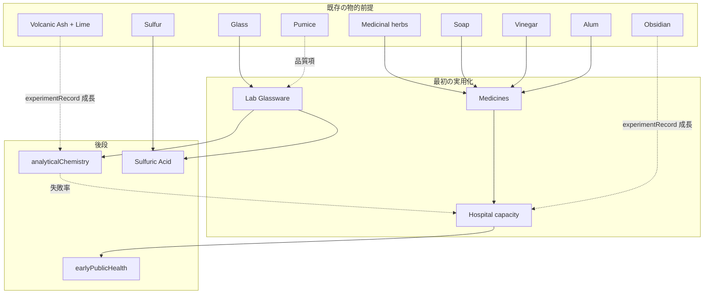
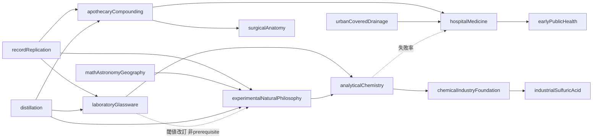
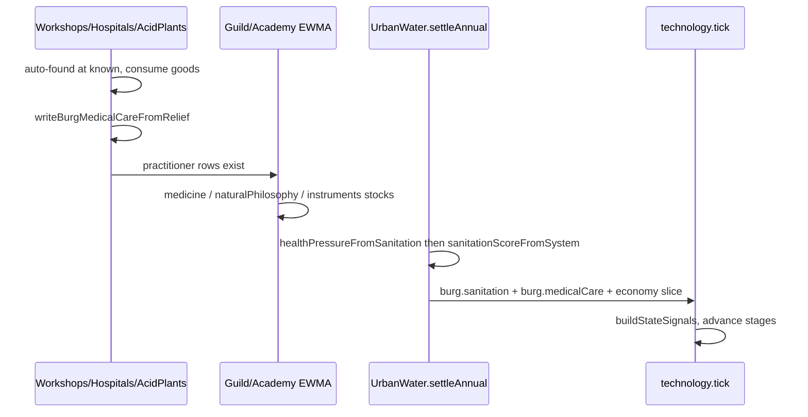

# 化学・医学の知識・技術蓄積プロセス設計

## 状態

**実装済み（2026-08-18）**。対象は、中世の蒸留・薬種・ガラス吹きから実験自然哲学・分析化学・初期公衆衛生まで。工業硫酸の**入口**までを実装スコープとする。Haber–Bosch と電化は前提として触れるだけである。

この設計は、化学と医学を年数で自動解禁しない。需要シグナル、実務ギルド、学術、試作・失敗・採算、最短年数を通じて蓄積する。工業 Good 連鎖が `Coke → Coal Tar → Sulfuric Acid` から急に始まるギャップを埋め、実装済みの火山 Good と `glassware` ギルドを化学・医学の本線に接続する。火山は有利な経路であり必須条件ではない。

関連設計:

- [蒸気機関の知識・技術蓄積プロセス設計](./steam-engine-knowledge-accumulation.md) — 踏襲する型（需要圧力、四種類の知識、試作証拠、最短年数）
- [蒸気機関後の工業 Good・市場・後続技術設計](./steam-industrial-goods-and-technology-chain.md) §3.5 / Phase D — Coal Tar → Sulfuric Acid の市場契約。本設計はその手前の蓄積過程を独立させる
- [蒸気機関後の実装計画](./steam-industrial-implementation.md) — Phase 4 が化学と電化を束ねている。本設計は蓄積をそこから切り離す
- [技術発展・発見ロードマップ](./technology-development-roadmap.md) §5, §9, §12–13
- [知識・技術蓄積システム](./knowledge-guild-system.md) §3-B Phase 3 — `medicine` / `naturalPhilosophy` は頭数源もボーナス消費者も未発明のまま保留
- [火山性商品設計](./volcanic-biome-goods.md) — `Pumice` / `Obsidian` / `Sulfur`（噴気孔）/ `Volcanic Ash` は実装済み。加工チェーンは未接続
- [都市水利・衛生インフラ設計](./urban-water-and-sanitation-system.md)
- [キャラクター健康・疾病システム設計](./characters/character-health-and-disease.md) — `Character.health` は Phase 1 実装済み。衛生入力は `burg.sanitation` → `state.sanitation` → 50。本設計は第二入力 `burg.medicalCare` を足す
- [大図書館](./great-library.md) PR4 — `naturalPhilosophy` を Academy に足すが税金ボーナスは作らない

### コード上の現状（`src/` を正とする）

| 層 | 今あるもの | 無いもの |
| :--- | :--- | :--- |
| 技術グラフ | `TechnologyEraBand = 0\|1\|2\|3\|4\|5`。[`technologyDefinitions.ts`](../../src/generators/technologyDefinitions.ts) は era 6+ を意図的に省略。`distillation`（era 1）、`experimentalNaturalPhilosophy`（era 4）は閾値ノードとして存在する | 薬種、実験ガラス、分析化学、工業硫酸、公衆衛生のノード |
| シグナル集計 | [`buildStateSignals()`](../../src/generators/technologyProgress.ts) は guild の metallurgy/woodworking/printing/masonry/instruments、academy の **administration のみ**、`militaryResourceLedgers.annualDemand.gunpowder`、`urbanWaterMaxTier` を読む | `glassware` guild、`medicine` / `naturalPhilosophy`、硫黄アクセス、衛生・戦傷圧力 |
| ギルド | `glassware` は実装済み。`Ceramics` / `Glass` が [`CRAFT_DOMAIN_BY_GOOD_NAME`](../../src/extensions/economy/generators/guildKnowledgeTypes.ts) に載る。ボーナスはレシピ収率 | 実験容器の**品質**前提。`instruments` は `Liquor` の暫定マップだけで、計測器 Good は未実装 |
| アカデミー | [`SCHOLARLY_KNOWLEDGE_DOMAINS = ["administration"]`](../../src/extensions/economy/generators/academyKnowledgeTypes.ts) | `medicine` / `naturalPhilosophy`。頭数モデルとボーナス消費者を本設計が発明する |
| 火山 Good | `Pumice` は `biomeOutputByTag: { volcanic: 0.05 }` で建設需要のみ。`Obsidian` は lavaField 限定、luxury 0.4。`Sulfur` は evaporite + 噴気孔、需要はほぼ Gunpowder。`Volcanic Ash` は Roman Concrete `{ "Volcanic Ash": 1, Lime: 1 }` | 化学・医学レシピ。`Obsidian` 加工チェーンは火山文書 Phase 4 送り |
| プロト化学 Good | `Glass` `{ "White sand": 1, Potash: 0.5 }`。`Soap` / `Vinegar` / `Alum` / `Potash` / `Dyes`。**`Medicinal herbs` はカタログに既にある**（forest 採取、luxury 0.6） | `Lab Glassware`、`Medicines`、`Sulfuric Acid`、`Coal Tar`。新 `Herbs` は作らない |
| 工業ゲート | `Good.requiredTechnology` と `isGoodEnabled` / `isGoodManufacturableInState` は実装済み | 化学・医薬 Good の登録 |
| 衛生 | `Burg.sanitation` は host が 50 でシード。[`sanitationScoreFromSystem()`](../../src/extensions/economy/generators/urbanWaterSystem.ts) は `(1 - healthPressure) * 12` を既に civic スコアへ折り込む。[`rollupProvinceAndStateSanitation()`](../../src/extensions/economy/generators/urbanWaterSystem.ts) が州・属州平均を書く | 病院は下水ではない。`burg.medicalCare` は未存在。Steam Waterworks 後書きは civic sanitation を更新しない（触らない） |
| 個人健康 | [`characterHealth.ts`](../../src/extensions/characters/characterHealth.ts) Phase 1。`resolveCharacterSanitation` は burg → state → 50 | `resolveCharacterMedicalCare`。Medicines / 病院オブジェクトの直接参照は禁止。`DeathCause` に `disease` は無い（触らない） |
| 蒸気工房 | [`steamTypes.ts`](../../src/extensions/economy/generators/steamTypes.ts) に `SteamPumpTrial` / `SteamInstallation` | `ExperimentalWorkshop` は蒸気設計の型として未実装。本設計が共有する |

`technology.tick` は [`timeEngine.ts`](../../src/generators/timeEngine.ts) で `phase: "economy"`、shipbuilding.tick の後。host は Economy を import せず、`simulation.extensions.economy` の plain data を読む。

現行年次ブロック（[`economy/index.tsx`](../../src/extensions/economy/index.tsx) 2707–2731）は `UrbanWater.settleAnnual()` → `SteamIndustry.settleAnnual()` → `GuildKnowledge` → `AcademyKnowledge` である。本設計は工房・病院を Water / Academy の**前**へ挿入する（§9）。

---

## 1. 結論

化学・医学の最初の実用化は工業硫酸ではない。次の**並行する入口**を持つ。

```text
[薬種]
  Medicinal herbs + Honey/Vinegar/Salt/Alum/Soap
    + 自動開設された薬種工房の反復調製
    → Medicines（中間 Good。世帯需要なし）
    → 病院容量（サービス） / 初期公衆衛生

[実験ガラス]
  White sand + Potash → Glass
    + glassware ギルド
    → Lab Glassware（中間 Good。Pumice は品質項のみ）
    → ExperimentalWorkshop / 分析化学 / 蒸気設計の計測器

[耐酸・工業化学]（後段・era 6）
  Lab Glassware + Lead Ingot + Sulfur（蒸発岩または噴気孔または市場在庫）
    + 記録された実験 + 後段需要
    → AcidPlant（資本設置）
    → Sulfuric Acid（中間 Good）

[火山の実装可能な効果]（必須ではない）
  噴気孔 Sulfur     → sulfurAccess を上げる（市場在庫）
  Pumice            → labVesselQuality の品質項（0 でも demonstrated 可能）
  Obsidian 消費年   → experimentRecord の EWMA 速度
  Roman Concrete 年 → experimentRecord の EWMA 速度（pozzolanPractice）
```

医学を化学の別名にしない。`analyticalChemistry` は病院の失敗率を下げるが、`hospitalMedicine` の `prerequisites` には入れない。医学だけ進めても `industrialSulfuricAcid` は解禁しない。



`experimentalNaturalPhilosophy` は既存ノードである。`laboratoryGlassware` を `prerequisites` に足さない。閾値改訂だけを行う（§5.3）。

---

## 2. 設計目標と非目標

### 2.1 目標

- 化学と医学を、年数や単発乱数や発明者一人で解禁しない。
- `locked → known → demonstrated → adopted` を同一年に飛ばさない。`minimumYearsAtPreviousStage` は **target 段階**だけをキーにする（`demonstrated` / `adopted`）。`locked → known` は同年でよい（現行 `advanceStage()` と同じ）。
- 火山性材料とガラス細工を本線に接続する。火山は有利な経路であり必須条件ではない。
- 中間 Good / 資本 Good / 容量サービスを分け、固定 ID で先登録する。
- 汎用の化学倍率・医学倍率を State 全体へ掛けない。
- 既存 `Glass` / `Sulfur` / `Pumice` / `Obsidian` / `Volcanic Ash` / `Soap` / `Vinegar` / `Alum` / `Potash` / `Dyes` / `Medicinal herbs` の ID と旧セーブ在庫を壊さない。
- Characters 非依存の効果経路を残す。Economy 無効でも衛生は `burg.sanitation` → `state.sanitation` → 50、医療は欠落時 50（シード／未シミュレーション）で動く。病院の効果は `burg.medicalCare` に書き、下水スコアを偽らない。
- 4層アーキテクチャを守る。Renderer は Readonly。動的 ZIP は host を直接 import しない。

### 2.2 非目標

- Haber–Bosch、電化、実用電池、水銀、石油化学、`Phosphate Rock` 鉱床を同じ変更で実装しない。
- Physician / Herbalist を Characters の必須職業にしない。
- `Character.health` を Economy が直接書き換えない。Characters は Medicines 在庫や病院オブジェクトを読まない。
- 病院稼働で `burg.sanitation` を書き換えて下水と医療を混ぜない。
- 建設 Good を化学万能倍率にしない。
- 新 Good `Herbs` / `Obsidian Blades` / `Acid-resistant vessels` を作らない。
- `DeathCause` に `disease` を足さない。
- `Dyes` に世帯 `demandCoverage` を後付けしない（PR 1 の unmet 入力に使わない）。

---

## 3. 発明を生む圧力

年次技術評価は State ごとに 0..1 の**派生**シグナルを計算する。新たな所有データではない。host の `buildStateSignals()` が pack と `simulation.extensions.economy` の plain data、および `simulationContext.populationLoss` から読む。

**Economy 無効規則（蒸気の `emptySignals()` と同じ）:** `if (!isRecord(economy))` なら、本設計が追加する化学・医学シグナルはすべて 0 のままにする。host の `burg.sanitation = 50` や戦闘死が存在しても、化学・医学シグナルには載せない。Characters は従来どおりシード衛生 50 で動く。

**Economy 有効・UrbanWaterSystem 行が無い Burg:** `urbanSanitationPressure` のその Burg 項だけ、`sanitation` 欠落時に 50 を使い `(1 - 50/100) = 0.5` とする。

### 3.1 PR 1 で出すシグナル（現行 slice から数行）

名前解決:

```ts
function goodIdByName(economy: Record<string, unknown>, name: string): number | null {
  for (const g of asStockArray(economy.goods)) {
    if (String(g.name ?? "") === name) return asNumber(g.i, -1);
  }
  return null;
}

function marketBelongsToState(
  market: Record<string, unknown>,
  pack: Pack,
  stateId: number
): boolean {
  // Market.i is the market id, not a burg index. Ownership is Market.centerBurgId
  // (`marketTypes.ts`). Also count the market if any live burg in this state
  // points at it via burg.market — a split-border catchment still feeds the state.
  const center = pack.burgs?.[asNumber(market.centerBurgId)];
  if (center && !center.removed && center.state === stateId) return true;
  const marketId = asNumber(market.i);
  for (const burg of pack.burgs ?? []) {
    if (!burg?.i || burg.removed || burg.state !== stateId) continue;
    if (burg.market === marketId) return true;
  }
  return false;
}

function stateMarketStock(economy: Record<string, unknown>, pack: Pack, stateId: number, goodId: number): number {
  let stock = 0;
  for (const market of asStockArray(economy.markets)) {
    if (!marketBelongsToState(market, pack, stateId)) continue;
    const goods = isRecord(market.goods) ? market.goods : {};
    const row = goods[String(goodId)];
    stock += asNumber(isRecord(row) ? row.stock : row);
  }
  return stock;
}
```

| キー | 計算 | PR 1 UI |
| :--- | :--- | :--- |
| `glassware` | 既存 instruments ループと同じ。`domain === "glassware"` の州内最大 stock | 出す |
| `medicine` / `naturalPhilosophy` | academy 行の domain 最大。domain が無ければ 0 | 出す |
| `urbanSanitationPressure` | 下記。Economy オン時のみ | 出す |
| `epidemicPressure` | `max` 州内 `urbanWaterSystems[].healthPressure`（Characters 罹患率は載せない） | 出す |
| `battleWoundPressure` | `populationLoss.history` の **combat 合計（保持窓 ≤40 日）** / `max(urbanPop × 0.02, 1)` を `clamp01`。年次累積は作らない | 出す（40 日分である旨を表示） |
| `sulfurAccess` | 下記。供給源内訳（蒸発岩 / 噴気孔 / 輸入）は出さない | 出す（単一 0..1） |
| `gunpowderSulfurPressure` | `unmetDemand.sulfur / max(annualDemand.sulfur, ε)`。需要 0 なら 0 | 出す |
| `soapGlassPressure` | `0.5 × stockShortage("Soap") + 0.5 × stockShortage("Glass")`。`Dyes` は入れない。`stockShortage = clamp01(1 - stock / max(urbanPop × 0.02, 1))` | 出す |
| `pumiceCoverage` | `clamp01(stateMarketStock("Pumice") / 1)`。参照 1 sack。生産活動が無くても在庫があれば非ゼロ | 出す |
| `labVesselQuality` | §3.3。PR 1 では guild `glassware` と `pumiceCoverage` だけ（工房消費年はまだ無い） | 出す |
| `pozzolanPractice` / `obsidianPractice` | PR 1 は 0。生産年カウンタは PR 4 / 5 | 0 と出す |

`foodFertilizerPressure` と `lateChemistryDemandPressure` は PR 1 では **キー自体を Data Model に予約するが、値は 0 のまま**。計算は PR 6。

`chemistryDemandPressure` という合成は作らない。era 1 ノードは上表の個別キーを読む。

### 3.2 衛生・硫黄の式

```text
urbanSanitationPressure  （Economy オン）
  各 Burg:
    if UrbanWaterSystem がある:
      term = max(1 - sanitation/100, healthPressure)
    else:
      sanitation' = burg.sanitation ?? 50
      term = 1 - sanitation'/100          // 欠落時 0.5
  州 = Σ (term × burgPop) / urbanPop

sulfurAccess
  militaryCoverage =
    demand.sulfur > 0
      ? clamp01(1 - unmetDemand.sulfur / demand.sulfur)
      : 0
  marketCoverage = clamp01(stateMarketStock("Sulfur") / 2)   // 参照 2 barrel
  sulfurAccess = max(militaryCoverage, marketCoverage)

medicineDemandPressure   （派生。個別キーから。新所有データではない）
  = clamp01(
      0.40 × urbanSanitationPressure
    + 0.30 × epidemicPressure
    + 0.20 × battleWoundPressure
    + 0.10 × soapGlassPressure
    )
```

`medicineDemandPressure` は host が `TechnologySignals` に載せる（ノード `min` が読むため）。肥料項は含めない。

### 3.3 品質と火山加速（実装可能なプリミティブ）

加速器は新しい `thresholdScale` フィールドを **TechnologyThresholds に足さない**。既存の `min` が読める派生シグナルと、工房 EWMA の速度だけを動かす。

```text
LAB_VESSEL_QUALITY_DEMONSTRATED = 0.45

labVesselQuality = clamp01(
  glasswareStock × (0.7 + 0.3 × pumiceCoverage)
)

// pumiceCoverage = 0 かつ glasswareStock = 0.65 のとき
//   0.65 × 0.7 = 0.455 ≥ 0.45  → demonstrated 可能
// Obsidian はこの式に掛けない（非火山マップを 0.45 未満に落とさない）
```

| 加速器 | 飽和 | 効果（一文） |
| :--- | :--- | :--- |
| `pumiceCoverage` | 市場 Pumice 在庫 / 1 sack | `labVesselQuality` の 0.3 項だけ。0 でも 0.45 に届く |
| `sulfurAccess` | §3.2 | 噴気孔も蒸発岩も同じ市場 `Sulfur` 在庫。火山は在庫が溜まりやすい |
| `pozzolanPractice` | 州内 Roman Concrete 生産量 > 0 の**連続年** / 8。途切れた年は 0.15 減衰 | `ExperimentalWorkshop` の `experimentRecord` EWMA 採用率 × `(1 + 0.15 × pozzolanPractice)` |
| `obsidianPractice` | 工房が Obsidian を消費した連続年 / 8。同様に 0.15 減衰 | `experimentRecord` EWMA 採用率 × `(1 + 0.05 × obsidianPractice)`。`surgicalAnatomy` の `min` には載せない |
| `coalCarbonization` | 既存技術段階 | `industrialSulfuricAcid` の前提にしない。燃料は Charcoal でもよい。Coke があると Coal Tar 分離が生きる |
| `analyticalChemistry` | 既存段階 | 病院 `invalidFormula` / `contamination` 失敗率を `experimentRecord` に応じて下げる。グラフ辺は足さない |

`pozzolanPractice` / `obsidianPractice` は `TechnologySignals` に載せる（UI と EWMA 用）。ノード `min` は `experimentRecord` と `labVesselQuality` と `sulfurAccess` を読む。

### 3.4 後段だけが読むシグナル（PR 6）

```text
foodFertilizerPressure
  州内 market.foodLedger について
    gap  = max(0, (importNeed ?? 0) - (satisfiedImport ?? 0))
    need = max(0, urbanNeed ?? 0)
    ratio = need > 0 ? gap / need : 0
  州 = clamp01(平均 ratio)

lateChemistryDemandPressure = clamp01(
  0.40 × gunpowderSulfurPressure
+ 0.30 × soapGlassPressure
+ 0.30 × foodFertilizerPressure
)
```

`chemicalIndustryFoundation` / `industrialSulfuricAcid` だけが `lateChemistryDemandPressure` と `foodFertilizerPressure` を読む。era 1 ノードは読まない。

---

## 4. 蓄積する知識の種類

既存 `GuildKnowledgeStock` / `AcademyKnowledgeStock` EWMA は置換しない。

| 知識 | 所有者 | 土台 | 役割 |
| :--- | :--- | :--- | :--- |
| ガラス細工の品質 | Burg ギルド `glassware` | 実装済み収率ボーナス | `labVesselQuality` の主項。収率ボーナスは残す |
| 薬種・臨床 | Burg Academy `medicine` | 未実装 | 処方再現、病院失敗率。**税金に接続しない** |
| 実験自然哲学 | Burg Academy `naturalPhilosophy` | 蒸気設計と大図書館が予約 | `experimentRecord` 成長。**税金に接続しない** |
| 薬種工房記録 | `ApothecaryWorkshop` | 新規 | 頭数と `apothecaryTrialYears` |
| 実験工房記録 | `ExperimentalWorkshop` | 蒸気設計 §4.2 と**同一型** | 頭数と `experimentRecord` |
| 衛生・薬種投資 | State Treasury + `administration` | 既存 | 工房・病院の継続費用。新 StateSecret domain は作らない |

### 4.1 頭数源

人口や Treasury から 0..1 を直接作らない。

```ts
interface ExperimentalWorkshop {
  burgId: number;
  sponsorStateId: number;
  active: boolean;
  researchers: number;
  annualBudget: number;
  experimentRecord: number; // 0..1
  lastFundedYear: number;
}

interface ApothecaryWorkshop {
  burgId: number;
  sponsorStateId: number;
  active: boolean;
  practitioners: number;
  annualBudget: number;
  compoundingRecord: number; // 0..1
  lastFundedYear: number;
}
```

| domain | 頭数源 | ボーナス消費者 |
| :--- | :--- | :--- |
| `naturalPhilosophy` | `ExperimentalWorkshop.researchers` + （あれば）Great Library `libraryScholarEmployment` | `experimentRecord` 成長速度、分析化学 trial 成功率 |
| `medicine` | `ApothecaryWorkshop.practitioners` + `HospitalInstallation.practitioners` | 病院失敗率、`healthPressure` 減の上限 |
| `glassware` | 既存 CraftDomainEmployment（Glass / Ceramics / Lab Glassware） | 既存収率 + `labVesselQuality` |
| `instruments` | ExperimentalWorkshop が Lab Glassware または Glass と Tools（あれば Copper Ingot）を消費した年に、その Burg へ `CraftDomainEmploymentRecord { domain: "instruments" }` を upsert | 蒸気 4A が読む休眠 domain の最初の消費者 |

`CRAFT_DOMAIN_BY_GOOD_NAME.Liquor = "instruments"` は触らない。

### 4.2 工房・病院・酸プラントの開設と消費（v1 は `known` で自動）

UI が無いと技術が止まることを避ける。蒸気の `SteamPumpTrial` と同じく、**`demonstrated` が読む証拠は `known` で作り始める**。`demonstrated` を開設条件にしてはならない。

共通規則:

- 開設は Economy **generator**。首都、それが無効なら当該需要圧力が最大の Burg。`StateSecretKnowledge.settleAnnual()` と同じく `state.treasury` を減算する。
- 以後毎年、年予算が払えなければ `active = false`（record は減衰、即ゼロにしない）。
- Controller / UI は移設と pause だけ。初回開設の必須操作にはしない。

| 資産 | 自動開設の入口 | 年予算 | 州内上限（その段階） |
| :--- | :--- | ---: | :--- |
| `ApothecaryWorkshop` | `apothecaryCompounding ≥ known` | 12 | active 1 |
| `ExperimentalWorkshop` | `laboratoryGlassware ≥ known` または ENP ≥ known | 16 | active 1 |
| 試作 `HospitalInstallation`（`role: "trial"`） | `hospitalMedicine ≥ known` | 20 | trial 1。`demonstrated` を待たない |
| 通常病院（`role: "service"`） | `hospitalMedicine ≥ adopted` のあと追加 1 / 年 | 20 | 適格 Burg。`earlyPublicHealth ≥ known` なら 2 基目を優先 |
| 試作 `AcidPlant`（`role: "trial"`） | `industrialSulfuricAcid ≥ known` | 24 | trial 1。`demonstrated` を待たない |
| 通常酸プラント（`role: "service"`） | `industrialSulfuricAcid ≥ adopted` のあと追加可 | 24 | 適格市場 |

シグナルの数え方（デッドロック禁止）:

```text
hospitalTrialYears      = 稼働中 HospitalInstallation の documentedRuns 最大
hospitalInstallations   = 稼働中 HospitalInstallation の件数（trial も含む）
acidPlantTrialYears     = ChemistryTrial kind=acidPlant かつ running の documentedRuns 最大
acidPlantInstallations  = 稼働中 AcidPlant の件数（trial も含む）
```

したがって `hospitalMedicine.adopted.min.hospitalInstallations: 1` は、`known` で立てた試作が走っていれば既に満たせる。`demonstrated` は `hospitalTrialYears: 2` と待ち年だけを見る。host が `adopted` になった翌 settle で `role` を `"service"` に上げる（数え方は変わらない。2 基目の解禁フラグ）。

`earlyPublicHealth` の `prerequisites` は `hospitalMedicine` の **adopted**（現行 `prerequisitesMet`）。その時点で既に病院 1 がある。`earlyPublicHealth ≥ known` かつ病院が 1 だけなら、generator が 2 基目を開設して `hospitalInstallations: 2` の adopted 条件を満たせる。

消費:

- 実験工房: Books / Paper / Ink / Lab Glassware（未解禁なら Glass）/ Tools。任意で Copper Ingot。
- 薬種工房: Medicinal herbs と Honey または Vinegar / Salt / Alum / Soap のサブセット。任意で Sulfur、Obsidian。
- 病院: Medicines、Soap、Vinegar。試作でも同じ品目を食う（量が少ない）。食った年だけ `documentedRuns++`。
- 酸プラント: `Sulfur`、Coal または Charcoal、`"Lead Ingot"`、Lab Glassware。試作でも食う。食った年に `ChemistryTrial`（`kind: "acidPlant"`）の `documentedRuns++`。世界で `chemicalIndustryFoundation ≥ demonstrated` なら小ロットの Sulfuric Acid を市場へ出してよい。州の通常製造（`isGoodManufacturableInState`）は `industrialSulfuricAcid ≥ adopted` のまま。
- 材料不足の年は成長停止 + 減衰。record は消さない。`documentedRuns` は増やさない。

---

## 5. 技術グラフと段階遷移

### 5.1 全体像

新ノードは `scope: "state"`。工業硫酸だけ era 6。それ以外は era 1 / 4。`laboratoryGlassware` を既存 `experimentalNaturalPhilosophy` の `prerequisites` に足さない。

```text
recordReplication ─┐
distillation ──────┼─ apothecaryCompounding ─┬─ hospitalMedicine ─ earlyPublicHealth
                   │                         └─ surgicalAnatomy
                   └─ laboratoryGlassware ─── analyticalChemistry ─ chemicalIndustryFoundation
                                                                      └─ industrialSulfuricAcid

experimentalNaturalPhilosophy の prerequisites は現行どおり
  recordReplication, mathAstronomyGeography, distillation
  （閾値に glassware / experimentRecord を足すだけ）

urbanCoveredDrainage は hospitalMedicine / earlyPublicHealth の前提。
```



### 5.2 ノード定義（`thresholdsMet()` に渡せる数値）

`minimumYearsAtPreviousStage` は target 段階のみ。`advanceStage()` は `waits?.demonstrated` と `waits?.adopted` だけを読む。

試作年は蒸気の `steamTrialYears` と同じくシグナルへ写す。

#### `laboratoryGlassware` — era 1

```ts
{
  id: "laboratoryGlassware",
  label: "Laboratory glassware",
  era: 1,
  scope: "state",
  prerequisites: ["distillation", "recordReplication"],
  known: { min: { glassware: 0.15, treasury: 20 } },
  demonstrated: { min: { glassware: 0.35, labVesselQuality: 0.45, labGlassPracticeYears: 2, treasury: 30 } },
  adopted: { min: { glassware: 0.45, labVesselQuality: 0.45, treasury: 40 } },
  minimumYearsAtPreviousStage: { demonstrated: 2, adopted: 3 }
}
```

`labGlassPracticeYears`: 州内で Glass と Tools を同じ年に市場消費した連続年の最大。**Pumice 消費は数えない**。Pumice は `labVesselQuality` だけを上げる。

#### `apothecaryCompounding` — era 1

```ts
{
  id: "apothecaryCompounding",
  era: 1,
  prerequisites: ["distillation", "recordReplication"],
  known: { min: { medicineDemandPressure: 0.2, treasury: 20 } },
  demonstrated: { min: { medicineDemandPressure: 0.3, apothecaryTrialYears: 2, treasury: 30 } },
  adopted: { min: { medicineDemandPressure: 0.35, apothecaryTrialYears: 2, treasury: 40 } },
  minimumYearsAtPreviousStage: { demonstrated: 2, adopted: 3 }
}
```

`apothecaryTrialYears` = 州内 `ChemistryTrial`（`kind: "compounding"`, `status: "running"`）の `documentedRuns` 最大。

#### `surgicalAnatomy` — era 1

```ts
{
  id: "surgicalAnatomy",
  era: 1,
  prerequisites: ["apothecaryCompounding"],
  known: { min: { medicine: 0.1, treasury: 20 } },
  demonstrated: { min: { medicine: 0.25, apothecaryTrialYears: 2, treasury: 30 } },
  adopted: { min: { medicine: 0.35, treasury: 40 } },
  minimumYearsAtPreviousStage: { demonstrated: 3, adopted: 3 }
}
```

Obsidian は `min` に入れない。Tools / Arms で足りる。`obsidianPractice` は `experimentRecord`（ひいては後続の失敗率）だけを動かす。

#### `hospitalMedicine` — era 1

```ts
{
  id: "hospitalMedicine",
  era: 1,
  prerequisites: ["apothecaryCompounding", "urbanCoveredDrainage"],
  known: { min: { medicineDemandPressure: 0.3, urbanWaterMaxTier: 2, treasury: 40 } },
  demonstrated: { min: { hospitalTrialYears: 2, urbanWaterMaxTier: 2, treasury: 60 } },
  adopted: { min: { hospitalInstallations: 1, treasury: 80 } },
  minimumYearsAtPreviousStage: { demonstrated: 3, adopted: 4 }
}
```

`hospitalTrialYears` / `hospitalInstallations` は §4.2。試作病院は **`hospitalMedicine ≥ known` で自動開設**する。`demonstrated` を開設条件にしない（蒸気の `SteamPumpTrial` と同じ）。`municipalSanitation` は **prerequisite id にしない**。

#### `earlyPublicHealth` — era 4

```ts
{
  id: "earlyPublicHealth",
  era: 4,
  prerequisites: ["hospitalMedicine", "urbanCoveredDrainage"],
  known: { min: { administration: 0.3, urbanWaterMaxMunicipalSanitation: 0.2, treasury: 50 } },
  demonstrated: { min: { hospitalInstallations: 1, urbanWaterMaxTier: 3, administration: 0.4, treasury: 80 } },
  adopted: { min: { hospitalInstallations: 2, urbanWaterMaxTier: 3, administration: 0.5, treasury: 120 } },
  minimumYearsAtPreviousStage: { demonstrated: 3, adopted: 5 }
}
```

`urbanWaterMaxMunicipalSanitation` = 州内 `UrbanWaterSystem.municipalSanitation` の最大（0..1 ストック）。技術グラフのノード id ではない。

#### `analyticalChemistry` — era 4

```ts
{
  id: "analyticalChemistry",
  era: 4,
  prerequisites: ["laboratoryGlassware", "experimentalNaturalPhilosophy"],
  known: { min: { experimentRecord: 0.2, labVesselQuality: 0.45, treasury: 50 } },
  demonstrated: { min: { experimentRecord: 0.4, labVesselQuality: 0.45, treasury: 70 } },
  adopted: { min: { experimentRecord: 0.55, naturalPhilosophy: 0.4, treasury: 110 } },
  minimumYearsAtPreviousStage: { demonstrated: 3, adopted: 4 }
}
```

#### `chemicalIndustryFoundation` — era 6

```ts
{
  id: "chemicalIndustryFoundation",
  era: 6,
  prerequisites: ["analyticalChemistry"],
  known: { min: { experimentRecord: 0.4, sulfurAccess: 0.2, lateChemistryDemandPressure: 0.2, treasury: 80 } },
  demonstrated: { min: { experimentRecord: 0.5, sulfurAccess: 0.3, treasury: 110 } },
  adopted: { min: { experimentRecord: 0.55, sulfurAccess: 0.35, treasury: 140 } },
  minimumYearsAtPreviousStage: { demonstrated: 3, adopted: 4 }
}
```

#### `industrialSulfuricAcid` — era 6

```ts
{
  id: "industrialSulfuricAcid",
  era: 6,
  prerequisites: ["chemicalIndustryFoundation"],
  known: { min: { sulfurAccess: 0.3, labVesselQuality: 0.45, treasury: 100 } },
  demonstrated: { min: { acidPlantTrialYears: 2, sulfurAccess: 0.35, treasury: 140 } },
  adopted: { min: { acidPlantInstallations: 1, sulfurAccess: 0.4, treasury: 180 } },
  minimumYearsAtPreviousStage: { demonstrated: 3, adopted: 5 }
}
```

燃料は Coal または Charcoal。`coalCarbonization` は前提にしない。試作 `AcidPlant` は **`industrialSulfuricAcid ≥ known` で自動開設**する。`demonstrated` が読む `acidPlantTrialYears` は、その試作が走った年数である。`demonstrated` を開設条件にしない。

### 5.3 既存 `experimentalNaturalPhilosophy` の閾値改訂

`prerequisites` は現行のまま `recordReplication`, `mathAstronomyGeography`, `distillation`。ChemMed D で `min` だけを足す。

```ts
{
  id: "experimentalNaturalPhilosophy",
  era: 4,
  prerequisites: ["recordReplication", "mathAstronomyGeography", "distillation"],
  known: { min: { administration: 0.25, printing: 0.25, treasury: 40, glassware: 0.1 } },
  demonstrated: { min: { administration: 0.4, printing: 0.4, treasury: 70, experimentRecord: 0.25 } },
  adopted: { min: { administration: 0.55, printing: 0.5, treasury: 110, experimentRecord: 0.4 } },
  minimumYearsAtPreviousStage: { demonstrated: 2, adopted: 3 }
}
```

`glassware: 0.1` は Glass ギルドがあれば足りる（Lab Glassware 解禁前のフォールバック）。`experimentRecord` は ExperimentalWorkshop が活動してから伸びる。D 以前は現行閾値のまま。

### 5.4 段階の意味

| 段階 | 意味 | 待ち |
| :--- | :--- | :--- |
| `locked` | 前提または需要が無い | — |
| `known` | 工房・試作病院・試作酸プラントを自動開設できる入口 | 待ち無し（同年可） |
| `demonstrated` | 試験拠点で再現。失敗を記録済み | `minimumYearsAtPreviousStage.demonstrated` |
| `adopted` | 通常生産・複数設置 | `minimumYearsAtPreviousStage.adopted` |
| `diffused` | 適格 Burg へ年 1 または 10% | 年次設置率 |

---

## 6. Good・資本財・サービス

三分法と四段階ゲートは工業連鎖文書と同じ。新 Good は `GOODS_DATA` 末尾へ **予約順** で append する: `Lab Glassware` → `Medicines` → `Sulfuric Acid` → `Coal Tar`。PR 1 が 4 件を `requiredTechnology` 付きスタブとして登録し、レシピは各縦切り PR が埋める。未達なら `isGoodEnabled` が隠す。

レシピキーはカタログ名そのもの。鉛は必ず `"Lead Ingot"`。

### 6.1 既存 Good（新設しない）

| Good | 追加消費先 | 禁止 |
| :--- | :--- | :--- |
| `Glass` | Lab Glassware 主原料。実験工房フォールバック | ID 変更 |
| `Pumice` | Lab Glassware **任意**脚。品質項 | demonstrated の必須消費。construction 削除 |
| `Obsidian` | 工房の任意入力 | 必須前提。v1 加工 Good |
| `Sulfur` | Sulfuric Acid 主原料。Medicines 任意脚 | 需要倍率で硫酸を擬似実装 |
| `Volcanic Ash` | `pozzolanPractice` の観測源（Roman Concrete 生産年） | 化学倍率 |
| `Medicinal herbs` | Medicines 主原料 | 新 `Herbs`。第二世帯需要 |
| `Soap` / `Vinegar` | 病院年次消費。Medicines レシピ | 世帯 utilities を医学ノードで二重加算 |
| `Alum` / `Honey` / `Salt` / `Incense` | Medicines 任意脚 | 既存レシピ破壊 |
| `Lead Ingot` | AcidPlant 鉛室損耗 | `"Lead"` という別名キー |
| `Lime` / `Roman Concrete` | `pozzolanPractice` | 建設効率を化学で倍にする |
| `Dyes` | `soapGlassPressure` に入れない | 今すぐ化学染料化 |

黄鉄鉱はカタログに無い。v1 の硫酸入力は `Sulfur` のみ。

### 6.2 新設 Good

| Good | 種別 | `requiredTechnology` | 主入力 | 世帯需要 |
| :--- | :--- | :--- | :--- | :--- |
| `Lab Glassware` | 中間 | `laboratoryGlassware` | 下記 | なし `{}` |
| `Medicines` | 中間 | `apothecaryCompounding` | 下記 | **なし `{}`**。病院と軍だけが `consumeNamed` |
| `Sulfuric Acid` | 中間 | `industrialSulfuricAcid` | `Sulfur` 1、`Coal` または `Charcoal` 0.4、`"Lead Ingot"` 0.15、`Lab Glassware` 0.1 | なし |
| `Coal Tar` | 中間 | `chemicalIndustryFoundation` が世界で demonstrated | Coke 副産物（工業連鎖 §3.1） | なし |

`Lab Glassware` レシピ:

```ts
recipes: [
  { Glass: 1, Pumice: 0.2, Tools: 0.1 }, // 品質が高い
  { Glass: 1, Tools: 0.2 }               // 非火山経路。必須
]
CRAFT_DOMAIN_BY_GOOD_NAME["Lab Glassware"] = "glassware"
```

第二レシピは **製造**用である。技術の `demonstrated` は Glass + Tools 年（`labGlassPracticeYears`）であり、Pumice 年ではない。

`Medicines` レシピ:

```ts
recipes: [
  { "Medicinal herbs": 1, Honey: 0.3, Salt: 0.1 },
  { "Medicinal herbs": 1, Vinegar: 0.3, Alum: 0.2 },
  { "Medicinal herbs": 1, Soap: 0.2, Vinegar: 0.2 },
  { "Medicinal herbs": 1, Sulfur: 0.15, Incense: 0.1 }
]
demandCoverage: {}
```

**世帯付け替えは v1 でやらない。** `demandCoverage` はカタロググローバルであり、市場単位で 0.6 → 0.3 に書き換えられない。`Medicines` に `utilities: 0.35` を付けると `collectConsumerDemand()` のカテゴリ正規化で Soap / Candles / Ceramics の utilities シェアを奪う。病院・軍需だけが引き当てる（蒸気の Coal と同じ）。`Medicinal herbs` luxury 0.6 は民間生薬のまま残す。

もし将来世帯薬を足すなら、`buildDemandCoverageByGood` / `collectConsumerDemand` に名前付き overlay `applyMedicineHouseholdSubstitution(market, coverage)` を置く。新需要系は増やさない。v1 ではこの overlay を実装しない。

### 6.3 資本財と容量サービス

| 名前 | 種別 | 解禁 | 毎年消費 | 効果 |
| :--- | :--- | :--- | :--- | :--- |
| `ApothecaryWorkshop` | 年次プロジェクト | `apothecaryCompounding ≥ known` で自動 1 | 薬草・試薬・予算 12 | `compoundingRecord`、`apothecaryTrialYears` |
| `ExperimentalWorkshop` | 同上（蒸気と共有） | `laboratoryGlassware ≥ known` または ENP ≥ known で自動 1 | 書籍・器・Tools・予算 16 | `experimentRecord` |
| `HospitalInstallation` | 都市資産 | **`hospitalMedicine ≥ known` で試作 1**。adopted のあと追加 | Medicines、Soap、Vinegar | `medicalCareRelief`、`hospitalTrialYears` |
| `medicalCareCapacity` | 容量サービス | 稼働病院（試作を含む） | 上記 | 在庫化しない |
| `AcidPlant` | 資本設置 | **`industrialSulfuricAcid ≥ known` で試作 1**。adopted のあと追加 | Sulfur、燃料、Lead Ingot、Lab Glassware | 小ロット硫酸、`acidPlantTrialYears` |

病院と酸プラントは世帯が買わない。

---

## 7. 試作、失敗、採算

失敗はランダムな研究点消失ではない。型名は **一つ**だけ使う。

```ts
type ChemistryTrialKind = "compounding" | "laboratory" | "acidPlant";
type ChemistryFailureReason =
  | "materialShortage"
  | "contamination"
  | "invalidFormula"
  | "glassBreakage"
  | "fundingCut"
  | "pollutionLimit";

interface ChemistryTrial {
  kind: ChemistryTrialKind;
  burgId: number;
  stateId: number;
  status: "building" | "running" | "failed" | "retired";
  operatingYears: number;
  documentedRuns: number;
  failureCount: number;
  lastFailureReason?: ChemistryFailureReason;
  inputsConsumed: number;
  outputsDelivered: number;
}
```

`acidPlantTrialYears` = `kind === "acidPlant" && status === "running"` の `documentedRuns` 最大。`AcidPlantTrial` という別名型は作らない。

| 失敗 | 条件 | 残るもの |
| :--- | :--- | :--- |
| `materialShortage` | 薬草・硫黄・器・燃料が市場に無い | 前年までの record |
| `contamination` | `waterContamination` が高い、または Soap/Vinegar 不足 | 一部 record |
| `invalidFormula` | `medicine` / `experimentRecord` が低い | 失敗記録 |
| `glassBreakage` | `labVesselQuality < 0.45` で酸を扱った、または第二レシピのみで実験した年 | 器の消費記録 |
| `fundingCut` | 年予算を払えない | 設備は残る。稼働停止 |
| `pollutionLimit` | AcidPlant が既存 `pollutionDiplomaticStrain` 補償を払えない | プラントは残る。硫酸は出ない |

採算:

```text
trialViable =
  outputsDelivered ≥ 下限
  and benefit ≥ cost × 0.8
  and 重大な contamination / glassBreakage が連続していない

demonstrated: trialViable 連続 2 年（対応 *TrialYears >= 2）
adopted: 設置数シグナル（hospitalInstallations / acidPlantInstallations）
```

---

## 8. 実用化後の物的効果

State `adopted` は万能倍率ではない。

### 8.1 病院 → `burg.medicalCare`（下水スコアを偽らない）

衛生と医療介入を分ける。`burg.sanitation` は水利・汚水の civic スコアのまま。病院は下水道ではないので、`healthPressureFromSanitation` にも `sanitationScoreFromSystem` にも **病院項を足さない**。Steam Waterworks 後書きも使わない。

#### host フィールド

[`src/types/models.ts`](../../src/types/models.ts) の `Burg` / `Province` / `State` に、`sanitation` と同じ 0–100 civic 規約で optional を足す。

```ts
/**
 * Local medical-care civic score from 0 (no usable care) to 100 (fueled hospital).
 * Seeded at 50 ("folk / household care, never simulated as a hospital town").
 * Missing on old saves means never simulated — treat as 50, same as the host seed.
 * When Economy is on, HospitalInstallations.settleAnnual writes this from
 * medicalCareRelief (docs/plan/chemistry-medicine-knowledge-accumulation.md §8.1).
 */
medicalCare?: number;
```

**欠落とシードを 50 にする理由:** `security` / `sanitation` と同じ「civic シミュレーション未開始は中立 50」である。0 は「医療が無い」というシミュレート済みの悪状態であり、旧セーブと Economy オフの全キャラを今日より病気にする。50 は民間・生薬のベースライン。燃料付き病院だけが 50 超へ上げる。

シード箇所は `sanitation: 50` と同じ 3 点:

- [`burgs-generator.ts`](../../src/generators/burgs-generator.ts) 355（`createBurg` 相当）
- 830（生成後ループ）
- 1456（生成後の新規 Burg）

#### 書き手（Economy generator、同年）

```ts
/** 0..1. Published then consumed in the same HospitalInstallations.settleAnnual(). */
medicalCareRelief(burgId) = clamp01(
  Σ hospitalsInBurg (condition × utilization × ratedCare)
)

export function medicalCareScoreFromRelief(relief: number): number {
  return rn(50 + clamp01(relief) * 50, 1); // 50 = no fueled care, 100 = full
}

export function writeBurgMedicalCareFromRelief(
  reliefByBurg: ReadonlyArray<{ burgId: number; relief: number }>
): void
```

`writeBurgMedicalCareFromRelief` は `hospitalInstallations.ts`（または隣接する `medicalCare.ts`）に置く。`HospitalInstallations.settleAnnual()` の末尾で、同じ年に:

1. 当該 Burg の稼働病院から `medicalCareRelief` を出す。
2. 病院行がある Burg へ `burg.medicalCare = medicalCareScoreFromRelief(relief)` を書く。材料切れなら relief 0 → **50**（ベースラインへ戻す。sanitation を触らない）。
3. [`rollupProvinceAndStateSanitation`](../../src/extensions/economy/generators/urbanWaterSystem.ts) と **同じ平均**で `province.medicalCare` / `state.medicalCare` を書く（`sum / n`、`rn(..., 1)`、病院の無い Burg はシード 50 を平均に含める）。新しい集計スタイルは発明しない。

`medicalCare` は燃料付き病院がある Burg の局所スコアである。State 平均は Characters の burg 無しフォールバック用であり、州全体の医学倍率ではない。

#### Characters（Economy を import しない）

`resolveCharacterSanitation` は変更しない。第二 resolver を足す。

```ts
export const MEDICAL_CARE_DEFAULT = 50; // same seed as burg.medicalCare

export function resolveCharacterMedicalCare(
  character: Pick<Character, "location" | "state" | "nationalityStateId">
): number {
  // burg.medicalCare → state.medicalCare → 50. Pack fields only.
}
```

`advanceCharacterHealth` での使い方（sanitation の置換ではない）:

```text
care = resolveCharacterMedicalCare(character) / 100     // 0.50 at seed
recoveryScale  = 0.70 + 0.60 * care   // 50 → 1.00, 100 → 1.30, 0 → 0.70
infectionScale = 1.25 - 0.50 * care   // 50 → 1.00, 100 → 0.75, 0 → 1.25

recoveryChance     *= recoveryScale
infection chance   *= infectionScale
escalation chance  *= infectionScale
```

Medicines 在庫・病院オブジェクト・Economy slice を Characters の第三入力にしない。

`earlyPublicHealth ≥ adopted` は病院がある Burg の `municipalSanitation` EWMA 目標を +0.1 してよい（水利ドクトリン）。水利 tier や `sanitaryEngineering` は自動で上げない。`burg.sanitation` を病院で直接は上げない。

Economy 無効: `burg.medicalCare` はシード 50 のまま。Characters の医療補正は 1.00。衛生経路は現状どおり。

### 8.2 実験室と工業硫酸

- `analyticalChemistry ≥ demonstrated` の試験市場だけで、試薬ロットの `invalidFormula` 率を下げる。州全工房の一律ボーナスにはしない。
- `industrialSulfuricAcid ≥ known` で試作 `AcidPlant` が立つ。小ロット出力は foundation が世界で demonstrated したあと。州の通常製造は `adopted`。`demonstrated` を開設条件にしない。
- 後続肥料・染料・金属処理は硫酸在庫を食うレシピとして工業連鎖側が実装する。本設計は在庫と消費フックまで。

### 8.3 拡散

適格 Burg を年ごとに候補化。上限は年 1 施設、または適格の 10% の小さい方。征服は既存 `applyConquestDisruption`。

### 8.4 火山経路と非火山経路

```text
火山あり: 噴気孔 Sulfur 在庫 → sulfurAccess、Pumice 在庫 → labVesselQuality、
          Obsidian 消費年 → experimentRecord 成長、Ash→Concrete 年 → 同

火山なし（volcanismChance = 0）:
  evaporite Sulfur + 市場 Sulfur
  + White sand Glass + Tools
  + 森林 Medicinal herbs
  → laboratoryGlassware demonstrated は labVesselQuality 0.45 と
    labGlassPracticeYears 2 で到達する（Pumice 在庫 0 でも可）
```

受け入れテスト: `volcanismChance = 0`、どの市場にも Pumice / Obsidian / Volcanic Ash が無い。蒸発岩 Sulfur と White sand Glass はある。`laboratoryGlassware ≥ demonstrated` に届く。

---

## 9. 年次 tick 順

現行 `UrbanWater → Steam → Guild → Academy` では、病院 relief が civic スコアに間に合わず、Academy が工房頭数を見ない。挿入点を固定する。

```text
economy.tick 年内ブロック（変更後）:

  1. ApothecaryWorkshops.settleAnnual()
       自動開設 / Treasury 減算 / 材料消費 / compoundingRecord
       ChemistryTrial kind=compounding を更新
  2. ExperimentalWorkshops.settleAnnual()
       同上。experimentRecord。
       Glass または Lab Glassware + Tools（+ Copper Ingot）消費年に
       CraftDomainEmploymentRecord(instruments) を upsert
  3. HospitalInstallations.settleAnnual()
       hospitalMedicine ≥ known なら試作 1 を自動開設（Treasury 20）
       材料消費、utilization、documentedRuns
       writeBurgMedicalCareFromRelief → burg.medicalCare
       rollupProvinceAndStateMedicalCare → province/state.medicalCare
       hospitalMedicine ≥ adopted なら role を service へ上げ、2 基目を解禁
  4. AcidPlants.settleAnnual()
       industrialSulfuricAcid ≥ known なら試作 1 を自動開設（Treasury 24）
       材料消費、ChemistryTrial kind=acidPlant の documentedRuns
       foundation が世界で demonstrated なら小ロット Sulfuric Acid 出力
  5. GuildKnowledge.settleAnnual()          // 既存。instruments 頭数を拾う
     GuildChapters / GuildSuccession / GuildTreasury  // 既存順
  6. AcademyKnowledge.settleAnnual()        // medicine / NP 頭数を工房・病院から読む
     GreatLibrary / StateSecret / Martial…  // 既存順
  7. UrbanWater.settleAnnual()
       現行どおり healthPressureFromSanitation（病院項なし）
       burg.sanitation = sanitationScoreFromSystem(system)
       rollupProvinceAndStateSanitation
  8. SteamIndustry.settleAnnual()           // 位置は Water の後のまま。medicalCare も sanitation も書かない

host technology.tick（economy phase、shipbuilding の後）
  buildStateSignals() → advanceStage()
  効果は翌年の生産・衛生から
```



---

## 10. 実装上の責務境界

| 項目 | 所有者 | ルール |
| :--- | :--- | :--- |
| 技術定義・年次段階 | host | Economy を import しない |
| Good・レシピ・ゲート | Economy | 固定 ID。技術は読み取り専用 |
| 工房・病院・酸プラント・Treasury 減算 | Economy **Generator** | v1 は `known` で試作を自動開設。市場在庫が正 |
| 移設・pause | Economy Controller | UI 任意 |
| Guild / Academy EWMA | Economy Generator | §9 の順 |
| `burg.sanitation` / `state.sanitation` | `UrbanWater.settleAnnual()` | 水利のみ。病院項を足さない |
| `burg.medicalCare` / `state.medicalCare` | `HospitalInstallations.settleAnnual()` → `writeBurgMedicalCareFromRelief` | 局所 civic 0–100。Steam 後書きをコピーしない |
| `Character.health` | Characters | 衛生は `resolveCharacterSanitation`（不変）。医療は `resolveCharacterMedicalCare`（burg → state → 50）。Economy / Medicines / 病院オブジェクトは読まない |
| 描画 | Renderer / React UI | Readonly。未在庫 Good を出さない |

host クエリ:

```ts
export function isLaboratoryGlasswareKnown(stateId: number): boolean;
export function isApothecaryCompoundingAdopted(stateId: number): boolean;
export function getHospitalCareEffect(stateId: number): number; // 設置稼働の 0..1。グローバル倍率ではない
export function getIndustrialSulfuricAcidEffect(stateId: number): number;
```

`getAcademyBonus(burgId, "medicine" | "naturalPhilosophy")` を `taxes-generator.ts` に接続しない。

---

## 11. データモデル

### 11.1 host `TechnologySignals` 追加（既存フィールドは削除しない）

```ts
export type TechnologyEraBand = 0 | 1 | 2 | 3 | 4 | 5 | 6; // 6 は PR 6

export interface TechnologySignals {
  glassware: number;
  naturalPhilosophy: number;
  medicine: number;
  sulfurAccess: number;
  urbanSanitationPressure: number;
  epidemicPressure: number;
  battleWoundPressure: number;
  soapGlassPressure: number;
  gunpowderSulfurPressure: number;
  medicineDemandPressure: number;
  foodFertilizerPressure: number;       // PR 1 は常に 0
  lateChemistryDemandPressure: number;  // PR 1 は常に 0
  labVesselQuality: number;
  pumiceCoverage: number;
  pozzolanPractice: number;
  obsidianPractice: number;
  labGlassPracticeYears: number;
  apothecaryTrialYears: number;
  hospitalTrialYears: number;
  acidPlantTrialYears: number;
  hospitalInstallations: number;
  acidPlantInstallations: number;
  experimentRecord: number;
  urbanWaterMaxMunicipalSanitation: number;
}
```

`chemistryDemandPressure` は置かない。

### 11.2 Economy slice

| フィールド | 内容 |
| :--- | :--- |
| `academyKnowledgeStocks` | domain に `medicine` / `naturalPhilosophy`（PR 3 で配列を拡張） |
| `experimentalWorkshops` | 蒸気と共有 |
| `apothecaryWorkshops` | 新規 |
| `chemistryTrials` | 新規。単一型 |
| `hospitalInstallations` | 新規 |
| `acidPlants` | 新規 |
| `medicalCareReliefByBurg` | `{ burgId, relief }[]`。当年の病院 settle が書き、同じ関数内で `burg.medicalCare` へ変換する。UrbanWater は読まない |

セーブ検証: 新配列を [`assertOptionalArrayField`](../../src/runtime/extensionStateSlices.ts) の既知リストへ追加する。値が存在するのに配列でなければ **throw**（現行どおり）。欠落は無視。実行時の空配列は `getSliceArray` のデフォルトであり、アーカイブ検証は `[]` に書き換えない。

### 11.3 セーブ互換

- 新 Good は PR 1 で末尾 4 スタブを予約。旧在庫添字はずれない。
- 新ノードは `locked`。`startStage` なし。
- 新配列欠落は実行時 `[]`。
- Characters の `health` / `affliction` は触らない。`burg.medicalCare` / `province.medicalCare` / `state.medicalCare` は optional。欠落は 50。
- `DeathCause` に `disease` を足さない。

---

## 12. 受け入れ条件

- 薬種だけ、または実験ガラスだけでは `industrialSulfuricAcid` を `demonstrated` にできない。
- 医学だけ進めても Sulfuric Acid / Coal Tar は解禁しない。
- `known → demonstrated` と `demonstrated → adopted` は `minimumYearsAtPreviousStage` と trial 年を跨ぐ。`locked → known` は同年可。
- `hospitalMedicine ≥ known` の年に試作病院が立ち、`hospitalTrialYears` が伸びる。`demonstrated` を開設条件にしない。同じ規則を `industrialSulfuricAcid` と試作 `AcidPlant` に適用する。
- `volcanismChance = 0` かつ市場に Pumice / Obsidian / Volcanic Ash がゼロでも、White sand Glass + Tools + 蒸発岩 Sulfur で `laboratoryGlassware ≥ demonstrated` に届く（`labVesselQuality ≥ 0.45` が `pumiceCoverage = 0` で成立する）。
- 火山ありマップは `sulfurAccess` / `labVesselQuality` / `pozzolanPractice` が早く上がり得るが、必須フラグではない。
- 病院が Medicines / Soap / Vinegar を消費した年、同じ `HospitalInstallations.settleAnnual()` で当該 Burg の `burg.medicalCare` が 50 を超える。`burg.sanitation` は病院だけでは変わらない。
- 材料切れの年、病院は relief 0 で `burg.medicalCare` を 50 に戻す。sanitation は触らない。
- Characters は Economy 無しで緑。`resolveCharacterMedicalCare` は欠落時 50。感染・回復の補正は sanitation を置換しない。
- `adopted` が State 全体の生産・死亡率にグローバル倍率を与えない。
- 既存 Good ID と旧セーブ在庫が変わらない。
- `Medicines` は世帯 utilities シェアを奪わない（`demandCoverage: {}`）。
- Economy 無効なら新化学・医学シグナルはすべて 0。host 技術 tick は停滞する。Characters の衛生は burg → state → 50。`medicalCare` 欠落も 50。
- 同じ seed / 経済状態 / 試作履歴で決定的に再現される。失敗ロールは `appServices.rng` のみ。
- 既存の火薬・大航海・蒸気ノードを壊さない。

---

## 13. 代替案

### A. 化学と医学を同一ノードにする

不採用。薬種国家が工業硫酸を自動入手する。

### B. 火山 Good を必須にする

不採用。`volcanismChance = 0` が合法。火山は `labVesselQuality` / `sulfurAccess` / EWMA 速度だけを動かす。

### C. 新 `Herbs` または `Incense` に薬効を寄せる

不採用。`Medicinal herbs` が既にある。`Incense` は desert/scrub の儀式 luxury。

### D. グローバル化学・医学倍率

不採用。材料と設置の意味が消える。

### E. v1 で `Obsidian Blades` を新設する

不採用。raw 任意消費で需要を先に作る。

### F. `Medicines` に世帯 `utilities: 0.35` を付ける

不採用（v1）。`collectConsumerDemand` が Soap 等の utilities シェアを奪う。病院・軍の `consumeNamed` だけにする。

### G. 病院効果を `burg.sanitation` に載せる（旧推奨）

不採用。ユーザー決定により衛生と医療介入を分離する。病院は `burg.medicalCare` を書く。`healthPressureFromSanitation` に病院項を足さない。

---

## 14. リスク

| リスク | 重大度 | 緩和 |
| :--- | :--- | :--- |
| 蒸気 4A と ChemMed D が別 `ExperimentalWorkshop` 型を生む | 高 | 型名と slice `experimentalWorkshops` を同一にする |
| 病院を Steam 後書きや sanitation に載せ下水と医療が混ざる | 高 | §8.1。`writeBurgMedicalCareFromRelief` が `burg.medicalCare` を同年に書く |
| Pumice 必須で非火山が詰まる | 高 | `labVesselQuality` 0.45 は `pumiceCoverage = 0` で到達。demonstrated は Glass+Tools 年 |
| 肥料項が era 1 需要に混ざる | 高 | 合成 `chemistryDemandPressure` を置かない。肥料は era 6 だけ |
| `Medicines` utilities が Soap を奪う | 高 | `demandCoverage: {}` |
| Good 並行 append で ID が分岐 | 高 | PR 1 で 4 スタブ予約。以降 A→F 線形 |
| `SCHOLARLY_KNOWLEDGE_DOMAINS` を二 PR が触る | 中 | PR 3 だけが配列を拡張 |
| ENP に prerequisite を足して既存マップを壊す | 高 | 閾値改訂のみ |
| Characters が Economy を読む | 高 | 禁止。pack の `sanitation` と `medicalCare` だけ読む |
| `instruments` 頭数が空のまま蒸気 4A が来る | 中 | PR 4 が消費年に upsert |
| 工房が UI 待ちで受け入れテストがハングする | 高 | v1 自動開設 |
| 病院・酸プラントを `demonstrated` で初めて立て、`demonstrated` が読む年数が 0 のまま詰まる | 高 | §4.2。`known` で試作を立て、設置数は稼働中 trial を含む |

---

## 15. 可観測性

- Tools → Technologies: 新ノード段階。PR 1 は §3.1 表のキーだけを内訳表示する。供給源（蒸発岩 / 噴気孔 / 輸入）は出さない。`battleWoundPressure` は「直近 40 日の戦闘死」と書く。
- Burg / Market tooltip: 工房・病院・酸プラントの稼働、`lastFailureReason`、`medicalCareRelief`、`burg.medicalCare`。
- Goods: `requiredTechnology` 未達は `isGoodEnabled` で隠す。
- Burg Editor: sanitation 行は水利のまま（既存英語 tip）。**別行**で `Medical care`（0–100 civic score from fueled hospitals, written to `burg.medicalCare`）。病院を sewers と書かない。
- 年次 trial の成功/失敗を決定論的に記録。

---

## 16. セキュリティとプライバシー

ブラウザ単体シミュレーション。個人の病歴を Economy slice に複製しない。`burg.medicalCare` は都市 civic スコアであり、個人の病名ではない。Characters 既存の `health` / `affliction` は増やさない。`DeathCause` に `disease` を足さない。失敗ロールは `appServices.rng`。動的 ZIP は host / Characters を直接 import しない。

---

## 17. 導入計画

Economy は既定 OFF。追加 feature flag は不要。導入は §20 の線形 A→F。途中で止めても既存ノードを壊さない。ロールバックは各 PR のノード + Good スタブ + slice 検証をセットで戻す。PR 1 スタブを残したまま後続だけ revert しても旧 Good ID は無事。

---

## 18. 未決事項

ユーザー回答済み。再議論しない。

1. **`experimentalNaturalPhilosophy` の閾値改訂を蒸気 4A より先に入れるか**  
   **Status: decided.** ChemMed D。`glassware: 0.1` フォールバック。

2. **`TechnologyEraBand` をいつ `| 6` にするか**  
   **Status: decided.** PR 6。A–E は era 1 / 4。PR 6 は `TechnologyOverviewDialog.tsx` の `ERA_OPTIONS` に 6 を足す。

3. **`burg.medicalCare` を新設するか**  
   **Status: decided.** **新設する。** 衛生と医療介入を分ける。§8.1。旧推奨（sanitation に載せる）は破棄。

4. **Pumice 無しの Lab Glassware 第二レシピを最初から置くか**  
   **Status: decided.** 置く。demonstrated 条件には使わない。

5. **工房・病院・酸プラント開設は自動か UI か**  
   **Status: decided.** v1 自動。いずれも `known` で立つ。`demonstrated` を開設条件にしない。

6. **戦傷窓は 40 日か 1 年か**  
   **Status: decided.** ≤40 日。年次累積は本設計の外。

7. **PR 2 / 3 のカタログ順**  
   **Status: decided.** PR 1 が 4 スタブを Lab Glassware → Medicines → Sulfuric Acid → Coal Tar の順で予約。

8. **`Medicines` に世帯 utilities を持たせるか**  
   **Status: decided.** 持たせない（`{}`）。病院・軍のみ。

9. **`labVesselQuality` の数値閾値**  
   **Status: decided.** `0.45`。`pumiceCoverage = 0` かつ `glasswareStock ≥ 0.65` で到達。

---

## 19. 決定事項

1. 最初の実用化は工業硫酸ではない。薬種・実験ガラス・病院を並行入口とし、硫酸は era 6。
2. 化学と医学は別系統。分析化学は病院の失敗率だけを下げる。医学は硫酸を解禁しない。
3. 火山は必須ではない。効果は `labVesselQuality` / `sulfurAccess` / `experimentRecord` EWMA 速度に折り込む。新 `TechnologyThresholds` フィールドは足さない。
4. `Medicinal herbs` を薬種の主原料にする。新 `Herbs` は作らない。
5. 4 Good を固定 ID で PR 1 スタブ予約。ゲートは `requiredTechnology`。
6. 耐酸容器は独立 Good にしない。
7. `Obsidian Blades` は v1 で作らない。
8. 衛生と医療を分ける。`burg.sanitation` は水利。`burg.medicalCare`（0–100、シード／欠落 50）は燃料付き病院がある Burg の局所 civic スコア。Characters は `resolveCharacterSanitation`（不変）に加え `resolveCharacterMedicalCare`（burg → state → 50）を回復・感染の補正に使う。病院は sanitation を書かない。State 平均は sanitation と同じ roll-up であり、州全体の医学倍率ではない。
9. 既存 EWMA を置換しない。`SCHOLARLY_KNOWLEDGE_DOMAINS` の配列変更は PR 3 だけが行う（`medicine` と `naturalPhilosophy` を同時追加。NP 頭数は D まで 0）。
10. `ExperimentalWorkshop` は蒸気設計と共有する。
11. host は段階だけを所有する。
12. `minimumYearsAtPreviousStage` は `demonstrated` / `adopted` のみ。
13. 効果は設置地点だけ。グローバル倍率禁止。
14. Phase D（化学+電化）から蓄積を独立させる。
15. v1 工房・試作病院・試作酸プラントは **`known` で自動開設**する。`demonstrated` が読む trial 年の証拠を `demonstrated` で作らせない。Treasury は Economy generator が減算する。
16. `Medicines` の `demandCoverage` は `{}`。
17. Economy 無効時、新化学・医学シグナルはすべて 0。
18. Pumice は `laboratoryGlassware` demonstrated のゲートに使わない。

---

## 20. PR 計画

線形 **A → B → C → D → E → F**。並行マージしない。B の前に C を入れない。電化と Haber–Bosch は入れない。

### PR 1 — ChemMed A: 前提を観測可能にする

- **タイトル**: `feat(technology): expose chemistry and medicine demand signals`
- **依存**: なし
- **対象**:
  - `src/generators/technologyTypes.ts` — §11.1 のシグナル（`TechnologyEraBand` はまだ 0–5）
  - `src/generators/technologyProgress.ts` — `buildStateSignals()`。Economy 無しなら新シグナル 0
  - `src/extensions/economy/generators/goods-generator.ts` — 末尾 4 スタブ（Lab Glassware, Medicines, Sulfuric Acid, Coal Tar。空 recipes、`requiredTechnology` 付き、`isGoodEnabled` で非表示）
  - 技術 UI: §3.1 キーの内訳。輸入源内訳なし
  - `src/generators/technologyProgress.test.ts`
- **内容**: 新ノードなし。火山なしでも `soapGlassPressure` / `sulfurAccess` が市場在庫から非ゼロになり得ること、Economy 無効で新シグナル全 0、40 日戦闘窓。衛生はまだ変えない。`stateMarketStock` は `Market.centerBurgId`（と `burg.market === market.i`）で join する。`market.burgId` も `market.i` の burg 誤用もしない。

### PR 2 — ChemMed B: 実験ガラス

- **タイトル**: `feat(economy): add Lab Glassware gated by laboratoryGlassware`
- **依存**: PR 1
- **対象**:
  - `technologyDefinitions.ts` — `laboratoryGlassware`（§5.2 の数値そのまま）
  - `goods-generator.ts` — スタブ `Lab Glassware` にレシピ 2 本を埋める
  - `guildKnowledgeTypes.ts` — `Lab Glassware → glassware`
  - `labGlassPracticeYears` 集計（Glass+Tools 年。Pumice 年は数えない）
  - テスト: `volcanismChance = 0` で demonstrated 到達、Pumice 無し第二レシピ
- **内容**: 病院も硫酸も無し。

### PR 3 — ChemMed C: 薬種

- **タイトル**: `feat(economy): add Medicines and apothecary workshops`
- **依存**: PR 2（カタログ順と `SCHOLARLY_KNOWLEDGE_DOMAINS` の単一所有者）
- **対象**:
  - `technologyDefinitions.ts` — `apothecaryCompounding`
  - `academyKnowledgeTypes.ts` — `["administration", "medicine", "naturalPhilosophy"]`。**この PR だけが配列を変える**
  - `academyKnowledge.ts` — medicine 頭数は工房。NP は頭数 0 のまま行を生まない
  - 新規 `apothecaryWorkshop.ts`、slice、Treasury 自動開設
  - `goods-generator.ts` — `Medicines` レシピ。`demandCoverage: {}`
  - `index.tsx` — §9 の 1 番に `ApothecaryWorkshops.settleAnnual()`
  - テスト: utilities シェアを奪わない、Sulfur 無し脚、自動開設が Treasury を減らす
- **内容**: 病院は置かない。`getAcademyBonus(..., "medicine")` を税金に接続しない。

### PR 4 — ChemMed D: 共有実験工房と分析化学

- **タイトル**: `feat(economy): shared ExperimentalWorkshop and analyticalChemistry`
- **依存**: PR 2（PR 3 のあとに置く。線形）
- **対象**:
  - 新規 `experimentalWorkshop.ts`（蒸気 §4.2 と同一型。蒸気 4A が既にあればそれを使う）
  - `index.tsx` — §9 の 2 番
  - `academyKnowledge.ts` — NP 頭数 = 研究者（配列は触らない）
  - `technologyDefinitions.ts` — `analyticalChemistry`。ENP の `min` / waits 改訂（`prerequisites` は変えない）
  - `chemistryTrials`、失敗理由
  - **instruments:** Lab Glassware または Glass + Tools（+ Copper Ingot）消費年に `CraftDomainEmploymentRecord` upsert
  - `pozzolanPractice` 連続年（Roman Concrete 生産 > 0）と EWMA 速度
  - テスト: 同一年に known→adopted しない、材料切れで record が消えない、instruments 行が立つ
- **内容**: 工業硫酸は出さない。税金ボーナス禁止。

### PR 5 — ChemMed E: 病院と初期公衆衛生

- **タイトル**: `feat(economy): hospital installations and early public health`
- **依存**: PR 3
- **対象**:
  - `technologyDefinitions.ts` — `hospitalMedicine`, `surgicalAnatomy`, `earlyPublicHealth`
  - `src/types/models.ts` — `Burg` / `Province` / `State` に `medicalCare?: number`
  - `src/generators/burgs-generator.ts` — 355 / 830 / 1456 で `medicalCare: 50` を sanitation と並べてシード
  - `technologyDefinitions.ts` — `hospitalMedicine`, `surgicalAnatomy`, `earlyPublicHealth`
  - 新規 `hospitalInstallations.ts`（`writeBurgMedicalCareFromRelief` + `rollupProvinceAndStateMedicalCare`、sanitation roll-up と同型）
  - `src/extensions/characters/characterHealth.ts` — `resolveCharacterMedicalCare` と recovery/infection 補正。`resolveCharacterSanitation` は不変
  - `src/extensions/characters/characterHealth.test.ts` — 欠落 50、Economy 無しで緑、sanitation と独立に補正が動く
  - `index.tsx` — 病院 settle を Guild / Academy / UrbanWater より前。Water に病院項を足さない
  - `BurgEditorDialog.tsx` / Water タブまたは Overview 列 — 英語 `Medical care` 行（sewers と混ぜない）
  - Obsidian 任意消費 → `obsidianPractice`
  - テスト: `known` で試作病院が立つ。燃料付き病院が **同じ年** `burg.medicalCare` を 50 超にする。`burg.sanitation` は病院だけでは変わらない。材料切れで medicalCare は 50。火山なしで `surgicalAnatomy` demonstrated
- **内容**: Steam Waterworks 後書きをコピーしない。`healthPressureFromSanitation` に病院項を足さない。`DeathCause` は増やさない。試作は `known` で立てる。

### PR 6 — ChemMed F: 工業硫酸

- **タイトル**: `feat(economy): industrial sulfuric acid and era-6 chemistry foundation`
- **依存**: PR 4
- **対象**:
  - `technologyTypes.ts` — `TechnologyEraBand` に `6`
  - `TechnologyOverviewDialog.tsx` — `ERA_OPTIONS` に 6
  - `chemicalIndustryFoundation`, `industrialSulfuricAcid`
  - スタブ `Sulfuric Acid` / `Coal Tar` にレシピを埋める。Coal Tar は foundation が世界で demonstrated するまで独立 Good 化しない
  - `acidPlants` + `ChemistryTrial` kind `acidPlant`。入力は `Sulfur` + 燃料 + `"Lead Ingot"` + Lab Glassware
  - `industrialSulfuricAcid ≥ known` で試作 1 を自動開設。`demonstrated` を開設条件にしない
  - `foodFertilizerPressure` / `lateChemistryDemandPressure` を `market.foodLedger` から計算
  - 汚染は既存 `pollutionDiplomaticStrain`
  - 肥料実装は含めない。在庫と消費フックのテストまで
  - テスト: `known` の年に試作が立ち `acidPlantTrialYears` が伸び、`demonstrated` に届く
- **内容**: 電化・リン酸鉱床・Haber–Bosch は入れない。

### 後続（本設計の外）

- 工業連鎖 Phase D 残り: Phosphate Rock、施肥が Sulfuric Acid を食う
- 蒸気 4A: 同じ `ExperimentalWorkshop`
- 大図書館 PR4: 同じ `naturalPhilosophy` に学者頭数
- 火山 Phase 4: `Obsidian Blades`（需要観測後）
- 任意: `applyMedicineHouseholdSubstitution`、戦傷の年次累積

---

## 21. 参照

- [`src/generators/technologyTypes.ts`](../../src/generators/technologyTypes.ts)
- [`src/generators/technologyDefinitions.ts`](../../src/generators/technologyDefinitions.ts)
- [`src/generators/technologyProgress.ts`](../../src/generators/technologyProgress.ts)
- [`src/generators/timeEngine.ts`](../../src/generators/timeEngine.ts)
- [`src/ui/dialogs/TechnologyOverviewDialog.tsx`](../../src/ui/dialogs/TechnologyOverviewDialog.tsx)
- [`src/extensions/economy/index.tsx`](../../src/extensions/economy/index.tsx)
- [`src/extensions/economy/generators/goods-generator.ts`](../../src/extensions/economy/generators/goods-generator.ts)
- [`src/extensions/economy/generators/production-generator.ts`](../../src/extensions/economy/generators/production-generator.ts) — `buildDemandCoverageByGood`
- [`src/extensions/economy/generators/markets-generator.ts`](../../src/extensions/economy/generators/markets-generator.ts) — `collectConsumerDemand`
- [`src/extensions/economy/generators/marketTypes.ts`](../../src/extensions/economy/generators/marketTypes.ts) — `Market.i`, `Market.centerBurgId`
- [`src/extensions/economy/generators/guildKnowledgeTypes.ts`](../../src/extensions/economy/generators/guildKnowledgeTypes.ts)
- [`src/extensions/economy/generators/academyKnowledgeTypes.ts`](../../src/extensions/economy/generators/academyKnowledgeTypes.ts)
- [`src/extensions/economy/generators/urbanWaterInstitutions.ts`](../../src/extensions/economy/generators/urbanWaterInstitutions.ts) — `healthPressureFromSanitation`
- [`src/extensions/economy/generators/urbanWaterSystem.ts`](../../src/extensions/economy/generators/urbanWaterSystem.ts)
- [`src/extensions/economy/generators/steamIndustry.ts`](../../src/extensions/economy/generators/steamIndustry.ts)
- [`src/extensions/economy/generators/militaryResourcesTypes.ts`](../../src/extensions/economy/generators/militaryResourcesTypes.ts)
- [`src/extensions/economy/generators/foodLedgerSummary.ts`](../../src/extensions/economy/generators/foodLedgerSummary.ts)
- [`src/runtime/extensionStateSlices.ts`](../../src/runtime/extensionStateSlices.ts) — `assertOptionalArrayField`
- [`src/extensions/characters/characterHealth.ts`](../../src/extensions/characters/characterHealth.ts)
- [`src/generators/populationLossTracker.ts`](../../src/generators/populationLossTracker.ts)
- [`src/types/models.ts`](../../src/types/models.ts) — `Burg.sanitation` / 本設計で足す `medicalCare`
- [`src/generators/burgs-generator.ts`](../../src/generators/burgs-generator.ts) — civic シード 50
