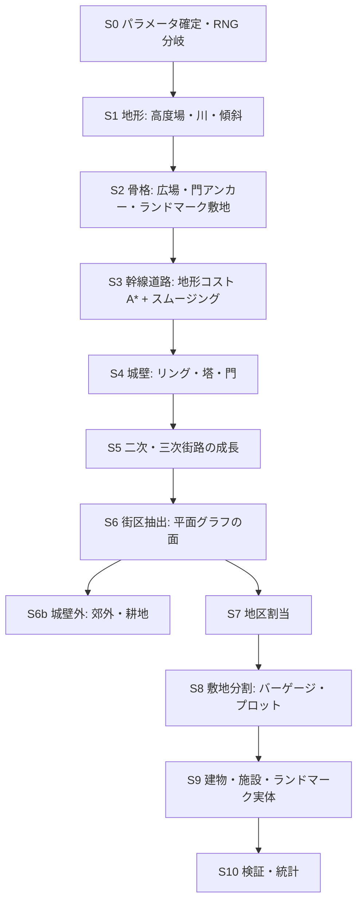

# 03. 生成パイプライン全体像

都市生成は以下のステージを固定順で実行する。各ステージは純関数で、**入力・出力・不変条件（invariant）** を契約として持つ。不変条件は [11-validation.md](11-validation.md) のメトリクスとして実装し、開発中は毎生成後に検証する。

## ステージ契約表

| ステージ | 入力 | 出力 | 主な不変条件 |
|---------|------|------|-------------|
| S0 パラメータ | `CityParams` | 正規化済み params、ステージ別 RNG | 同一 params → 同一出力（以降全ステージ） |
| S1 地形 | params, rng("terrain") | 高度場・傾斜場・川ポリライン・水域・橋候補点 | 川は単調に下る。高度場は連続 |
| S2 骨格 | S1 | 広場アンカー、門アンカー（方角）、ランドマーク敷地（プレシンクト多角形）、市外の街道端点 | プレシンクト同士は重ならない。城は高所または川の湾曲部、広場は緩傾斜地 |
| S3 幹線 | S1, S2 | `RoadGraph`（highway + artery のみ） | 全門アンカー⇔広場が連結。プレシンクト・水域を横断しない（橋を除く）。頂点あたり曲がり ≤ 40° |
| S4 城壁 | S2, S3 | `Wall`（リング・塔・門） | 門は幹線と壁の交点にのみ存在。門数 = numGates。壁は自己交差しない |
| S5 街路 | S3, S4 | `RoadGraph`（street + alley 追加） | グラフは常にノード化平面グラフ。壁内の街路密度 >> 壁外。単一連結成分 |
| S6 街区 | S5 | `Block[]` | 面分解が全域を被覆（外面と道路空間を除く）。スリバー街区（幅 < 6 m）は道路空間に併合 |
| S6b 城壁外 | S4, S5 | 郊外街区・`FieldStrip[]` | 耕地は街道に直交する短冊。壁から離れるほど疎 |
| S7 地区 | S2, S4, S6 | `District[]`、Block.districtId | 市場地区は広場に接する。全街区がいずれかの地区に属す |
| S8 敷地 | S6, S7 | `Lot[]` | **フロンテージ保証**: 建物可の敷地の ≥ 98% が接道。袋地は garden/yard のみ |
| S9 建物 | S7, S8, S2 | `Building[]`, `Landmark[]` | 建物は敷地内に収まる。主屋は接道辺に平行（±4°）。角は直角（±5°）。道路空間・プレシンクトに越境しない |
| S10 検証 | 全部 | `ValidationReport` | [11-validation.md](11-validation.md) の全メトリクス算出 |

## パイプラインの設計ルール

1. **後戻りしない**: ステージ N は N+1 以降の成果物を参照しない。前方参照が必要になったら「アンカー」（S2 の骨格）として先に確定させる。
   - 例: 城壁（S4）の位置は街路（S5）より先に決める。歴史的にも壁が先にあって内部が密集する。壁の位置決めに必要な「市街の広がり」は S3 の幹線骨格から推定する（[06-walls.md](06-walls.md)）。
2. **各ステージは単体で描画可能**: デバッグレイヤー（[10-rendering-ui.md](10-rendering-ui.md)）でステージ出力を個別に可視化できること。マイルストーンの受け入れ確認はこの表示で行う。
3. **失敗はフォールバックではなく修復**: あるステージが不変条件を満たせない出力を作った場合、黙って続行せず (a) そのステージ内でリトライ（別 rng 引き直し、最大 3 回）、(b) それでも失敗ならエラーとして表面化させる。「plaza が無ければ全部スキップ」のような黙殺分岐（v1 の問題 5）は禁止。
4. **道路空間の一元管理**: 道幅から作る「道路占有ポリゴン」は S6 で一度だけ算出し、街区・敷地・建物のクリップすべてに同じものを使う。v1 のように各所で別々に inset 量を決めない。

## 生成順序の歴史的根拠（実装者向けメモ)

実際の中世都市の成立順序: 交易路の交差・渡河点（= S1/S2）→ 市場と教会を核に集落（S2）→ 街道が幹線化（S3）→ 防衛のため城壁建設（S4）→ 壁内が埋まるにつれ路地が密集（S5–S8）→ 壁外に郊外がリボン状に成長（S6b）。パイプラインはこの因果をそのまま計算順序にしたものであり、順序を入れ替えると v1 と同じ「形だけの模倣」に戻る。
