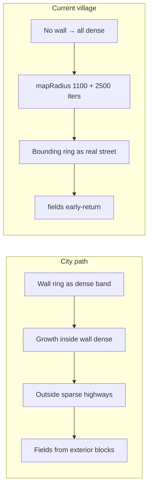
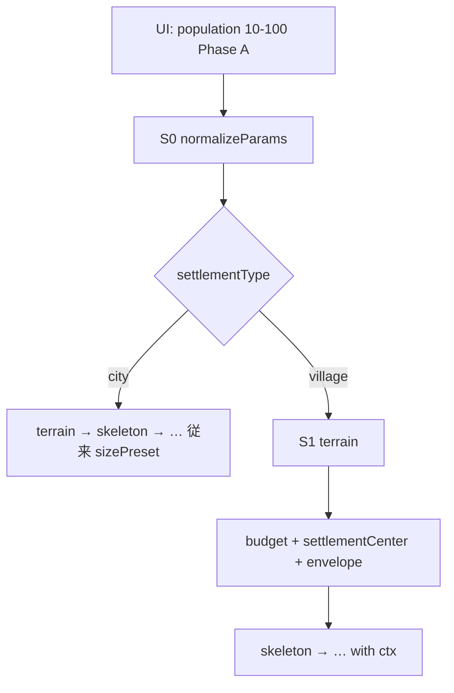
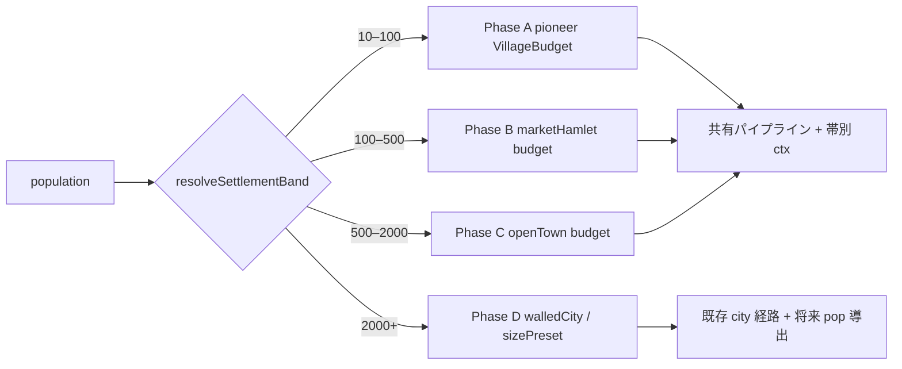
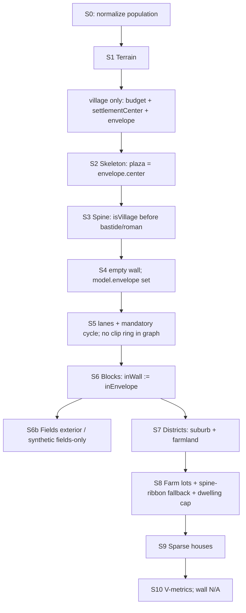

# 16. コンパクト先駆村落（人口 10–100）生成再設計

> **形態層の注意 (2026-07-13)**: 家→道の全面適用（K22）は [17-village-morphology-v2.md](17-village-morphology-v2.md) の **K30** で置換予定。  
> 説得力の検証は [18-village-lab.md](18-village-lab.md) の **SVG Lab**（`/lab.html`）を先行とする。予算・envelope は本 doc が正本。

| 項目 | 値 |
|------|-----|
| 文書 ID | 16-compact-village |
| 著者 | （設計ドラフト） |
| 日付 | 2026-07-13 |
| 改訂 | 2026-07-13 r5（homestead-first: 世帯→家→接続道。小村は道 first をやめる） |
| ステータス | **Draft** |
| 関連 | [01-goals.md](01-goals.md) §村落モード、[12-roadmap.md](12-roadmap.md) M10、[13-fmg-site-input.md](13-fmg-site-input.md)、[03-pipeline.md](03-pipeline.md)、[15-region-presets.md](15-region-presets.md) |
| 参照 prior art | [Watabou Village Generator](https://watabou.github.io/village-generator/?seed=3935571630607&tags=dead%20end,uncultivated,no%20square&width=600&height=293&name=Alsarah&pop=114) |

---

## Overview

現行の `settlementType: 'village'` は「城壁なし + 街路イテレーション上限の削減」に過ぎず、都市スケールの street-first 成長（`mapRadius = 1100`、highway 端点 `radius+400`、間口 4–12 m の町家密度）がそのまま走る。seed `alsarah` では **建物 1132 / 敷地 2262 / 道路 ~2291 / ノード bbox スパン ≈ 2200 m（= 2×mapRadius）/ 耕地 0** となり、先駆村落（population 10–100）とはほど遠い。M13 は門 0 対 `numGates`≥3 で **hard-fail**、全体 `pass: false`。

本設計は **population を一次サイズ入力** とし、世帯数・住居予算・集落エンベロープ半径・道路予算・耕地帯有無を導出する。パイプラインは city と共有しつつ、village 時は **真の縮退分岐**（S0 予算正規化、S2 核縮小、S3 1 spine または Y、S5 エンベロープ内 lane 成長・clip リングを RoadGraph に載せない、S6–S9 農家敷地・疎配置、S6b 耕地を envelope 外から生成、S10 村落メトリクス V1–Vn と壁メトリクス N/A）を入れる。実装は PR 分割で段階的に進め、本ドキュメントはその設計契約である。

**製品理想（長期）**: 開拓村（人口 ~10）から城壁大都市まで、**人数を増やすとそれに応じた集落が滑らかに大きくなる**こと。  
**本 doc の v1（Phase A）**: そのうち **人口 10–100 の先駆村**だけを正しく小さくする。10–100 は **最終上限ではなく第 1 段階のスコープ**である（詳細は [§1.5 連続人口スケール](#15-連続人口スケール長期目標と-phase-a)）。

### Homestead-first（r5）— 小村の第一原理

都市の **street-first**（道が空間を切り、残りが敷地）は、間口課税・町家列・高密度では妥当。  
開拓村では順序が逆である:

1. **population → households ≈ pop/5 → その件数の farmstead（家）**
2. 家・緑地・畑を人が行き来する  
3. 踏み固められた動線が **道・小径** になる  

よって Phase A の village は **homestead-first** を既定とする（`src/generation/homesteadVillage.ts`）:

| 段階 | 内容 |
|------|------|
| 世帯 | `targetDwellings = max(1, round(pop/5))` を **下限としても保証** |
| 配置 | envelope 内に N 戸を最小距離付きで配置（中心 green を空ける） |
| 道 | 各戸ゲート → hub（green）の星型 + 近傍 MST。道は家の後 |
| 畑 | 従来どおり envelope 外周の annulus fields |
| 都市 | city は従来 street-first のまま |

**M10 建物数 15–80 の扱い**: 先駆村（本 doc Phase A）の受け入れは **V1/V2** が拘束力を持つ。M10 の 15–80 は市場村・大きな hamlet 帯（Phase B 相当）として将来に残し、PR6 で [12-roadmap.md](12-roadmap.md) を本 doc へ参照置換する（§ Acceptance / K13）。
---

## Background & Motivation

### 現状（コード上の事実）

| 箇所 | 挙動 | 問題 |
|------|------|------|
| `src/generation/index.ts` L102–106 | village → `wall = { ring: [], … }` | 城壁スキップのみ。以降は city ロジック |
| `src/generation/streets.ts` L85–92 | `mapRadius = 1100` の **closed bounding ring を `"street"` として `RoadGraph` に追加** | ノード bbox スパン ≈ **2200 m** を強制; 周長 ~6.9 km が道路延長に混入 |
| `streets.ts` L107, L147 | `!hasWall` → 全域 `startInWall = true` | 密帯（step 30, seedSpacing 40）が半径 1.1 km 全域 |
| `streets.ts` L141 | village `maxIters = 2500`（city 6000） | まだ巨大な道路網を許容 |
| `src/generation/skeleton.ts` L69–84 | `radius = 300/500/800` + endpoints `radius+400`; ループは `params.numGates` | small でも端点 ~700 m; S0 が `numGates` を **≥3** に clamp |
| `src/generation/index.ts` L52 | `numGates: Math.max(3, Math.min(6, …))` | 村でも最低 3 本の highway 端点 |
| `src/generation/fields.ts` L27 | `wall.ring.length < 3` → 空配列 | **耕地ゼロ** |
| `src/generation/blocks.ts` L189–196 | wall 無し → 全 block `inWall = false` | 地区はすべて suburb（`districts.ts` L38–39）; `farmland` は未割当 |
| `src/generation/regionProfiles.ts` | NW frontage 4–12 m、suburb 8–15 m | 農家間口 15–40 m 未対応 |
| `src/model/types.ts` `CityParams` | `population` フィールドなし | サイズは `sizePreset`（15/40/100 ha）のみ |
| `src/ui/panel.ts` | settlement 切替 + size のみ | 人口スライダーなし |
| `src/validation/metrics.ts` M13 | 門数 = numGates | village で **gates=0 のため fail**（M11 は壁内面積 0 で vacuous pass） |
| `src/render/index.ts` L653 | `Math.max(span, 200)` | 小さな村でも過剰ズームアウト |

### M10 未完了と本 doc の関係

[12-roadmap.md](12-roadmap.md) M10 は「教会 + green、リボン or 広場村、農家敷地 15–40 m、耕地短冊、**建物 15–80**」を要求するが、実装は壁スキップ + maxIters 削減に留まる。roadmap の「M10 完了まで M11 に着手しない」は現状突破されている（regionPreset 実装済み）が、**村落形態パイプライン自体は未達**。

本 doc は M10 の **先駆・コンパクト村（pop 10–100）** を具体化する。建物帯 **15–80** は pop≈75–400 の市場村寄りであり、pop 10–25 の先駆村とは両立しない → **V1/V2 が拘束**（§ Acceptance）。

### なぜ street-first 都市成長が村で壊れるか



都市では **城壁が soft density boundary** として機能する。村ではその境界が消え、highway 端点が都市半径のまま、さらに **clip 用 bounding ring が実道路**としてグラフに入るため、Parish–Müller 的成長とメトリクスの両方が都市規模になる。

### Prior art（Watabou Village）

- **道が先**: 曲がりくねった道路グラフを生成し、家は道路に沿って**疎に**配置
- タグ例: `dead end`, `uncultivated`, `no square`（本プロジェクトは **互換 API は非ゴール**; 意味の内部マッピングは §2.1）
- population が enclosure / 集落広がりを駆動
- 中央広場 optional; 未耕作の荒野が背景
- 参考 seed: Alsarah pop≈114（本プロジェクトの empirically broken seed 名と対応）

本設計は Watabou の見た目クローンではなく、**既存 RoadGraph → blocks → lots → buildings** 契約を村スケール予算で駆動する。

---

## Goals & Non-Goals

### Goals

1. **Phase A（本 doc v1）**: 人口 **10–100** の先駆・フロンティア・ホームステッド村を compact に生成する
2. `population` を `CityParams` + UI の一次サイズ入力とする（経済シミュレーションではない）
3. Phase A の空間 footprint: 直径 **おおむね 80–250 m**（人口に比例）、都市 `sizePreset` small（~15 ha）とは別物
4. Phase A 建物数 **おおよそ pop/5**（世帯 4–6 人仮定）+ 教会 0–1 + 納屋等 → **V1/V2 拘束**（母屋 ≤30、全建物 ≤40）。M10 の 15–80 は本帯では **適用しない**
5. 耕地フィールドが wall 無しでも生成される（`hasFields` 時）
6. 道は 1 本の through-road（または Y）+ 短い dead-end lanes; 行き止まり可
7. 村メトリクス V1–Vn と受け入れ基準（数値・測定定義付き）を定義する
8. regionPreset / sizePreset との直交関係を明確化する
9. FMG site の hamlet/village burg と **手動 params で整合可能な契約**（descriptor 自動 village は v1 done の非ブロック; PR7）
10. **長期（Phase B–D）**: 人口入力を **10–100 に永久固定しない**。帯を拡張し、開拓村から城壁都市まで `population`（または pop→radius）で一本化できる設計余地を残す（§1.5）

### Non-Goals（Phase A / v1）

- 人口・経済・農業生産のシミュレーション（[01-goals.md](01-goals.md) 非ゴール維持）— **「人数をサイズのつまみにする」こと自体はゴール**
- **Phase A での** 市場町（pop 数百–数千）や無城壁都市の完全モデル（§1.5 Phase B–C で扱う; M10 の 15–80 はそちらの帯）
- **Phase A での** 連続スムーズ補間（帯境界のブレンド）— Phase B 以降の課題
- Watabou 互換シード/タグ API
- 地域プリセットごとの村形態差（v1 は NW 農家 + ribbon/optional green のみ; region は屋根・パレット等の薄い影響）
- 城・城壁・バスティード・ローマ格子を村で再現すること
- 既存 city golden seeds の意図的変更（city 回帰ゼロが必須）
- `legacyVillageSprawl` 等の半実装フラグを types に残すこと（ロールバックは git revert）
---

## Proposed Design

### 1. Population → structure size model

#### 1.1 入力

```ts
// CityParams 拡張（src/model/types.ts）
interface CityParams {
  // ...既存...
  /**
   * 集落の人口（絶対人数）。サイズの一次入力。
   * - Phase A (village): 実装上 10–100 に clamp（先駆村帯）
   * - Phase B 以降: 上限を外し settlementBand で形態を切替（§1.5）
   * - city 経路では v1 では無視（sizePreset 維持）。Phase D で pop→sizePreset/radius 可
   * - undefined 時: village なら既定 50、city なら未使用
   */
  population?: number;
}
```

- UI Phase A: slider **10–100**（step 1）。ラベルに「先駆村（Phase A）」と明示し、将来の拡張を妨げない
- スライダー操作で `settlementType = 'village'` を自動セット（city に戻すのは明示トグル）
- URL: `pop=42` など
- **型・API 上の `population` は「正の整数」を受け付ける設計にする**（Phase A の clamp は `resolvePopulation` / UI 側。フィールド型を 10–100 の union にしない）
- URL `green` / `fields` は **PR7** まで未配線。それまでの単体テストは `computeVillageBudget` + `applyVillageMorphology` を直接組み立て、`budget.hasFields` / `hasVillageGreen` を上書きしてよい（§1.1 の意味は内部フラグとして有効）
#### 1.2 導出量 `VillageBudget`

```ts
/** src/generation/villageBudget.ts — 数値フィールドは population の純関数 */
export interface VillageBudget {
  population: number;          // clamped 10–100
  householdSize: number;       // 5
  targetHouseholds: number;    // max(1, round(pop / 5))
  targetDwellings: number;     // = targetHouseholds
  targetBuildingsMax: number;  // dwellings + (church?1:0) + ceil(dwellings*0.4) barns
  envelopeRadiusM: number;
  mapRadiusM: number;          // envelope + fieldsBelt + padding（clip 幾何用。RoadGraph には載せない）
  roadBudget: {
    maxStreetIters: number;
    maxStreetLengthM: number;  // lane 1 本の最大長
    maxLanes: number;          // 側道本数上限（spine 除く）
    spineCount: 1 | 2;         // 1 = through-road（端点2）, 2 = Y（端点3）— 名前は「脚の分岐数」ではなく spine モード
    highwayStubM: number;
    seedSpacingM: number;
    stepM: [number, number];   // min–max step
    threshStraight: number;    // 直進継続: rng > thresh → continue（高いほど枝が短い）
    threshSide: number;        // 側枝: rng > thresh → spawn（高いほど枝が少ない）
  };
  lot: {
    frontageMin: number;
    frontageMax: number;
    frontageMedian: number;
    depthMin: number;
    depthMax: number;
  };
  morphology: 'ribbon' | 'green'; // v1: cluster は後回し（K11）
  hasVillageGreen: boolean;
  hasChurch: boolean;
  hasFields: boolean;
  fieldsBeltM: number;
  /** synthetic furlong 用 */
  fieldsSectorCount: number;   // 既定 6
  fieldsStripWidthM: number;   // 10–18
}
```

#### 1.3 換算式（完全定義 — 純関数、RNG 非依存）

歴史的ざっくり: 農村世帯 ≈ 4–6 人 → **houses ≈ pop / 5**。  
密度感: pop 50 → 10 世帯、envelope r≈80 m（コア ~2 ha）≈ **5 dwellings/ha（~25 ppl/ha）** — 都市 100–150 ppl/ha ではなく農村疎配置。

```ts
export function computeVillageBudget(params: CityParams): VillageBudget {
  const population = resolvePopulation(params); // clamp 10–100
  const householdSize = 5;
  const targetHouseholds = Math.max(1, Math.round(population / householdSize));
  const targetDwellings = targetHouseholds;

  const envelopeRadiusM = 40 + ((population - 10) / 90) * 85; // 40–125
  const fieldsBeltM = 40 + envelopeRadiusM * 0.35;
  const mapRadiusM = envelopeRadiusM + fieldsBeltM + 30;

  // 側道: 世帯に比例。多すぎると block/peel 爆発 → 上限 8
  const maxLanes = Math.max(2, Math.min(8, 1 + Math.ceil(targetHouseholds / 3)));
  const maxStreetIters = Math.max(40, Math.min(200, 20 + targetHouseholds * 12));
  const maxStreetLengthM = 40 + Math.min(50, envelopeRadiusM * 0.45);
  const highwayStubM = 30 + Math.min(50, envelopeRadiusM * 0.25); // ~30–61
  const seedSpacingM = 70 + Math.min(30, envelopeRadiusM * 0.15);

  // spine: pop≥70 で Y を許可する既定は morphology 分岐側（rng）; 数値 default は 1
  const spineCount = 1 as 1 | 2;

  const hasChurch = population >= 20; // morphology が上書きし得る
  // targetBuildingsMax は applyVillageMorphology 後に recomputeTargetBuildingsMax で確定（Issue 18）

  return {
    population,
    householdSize,
    targetHouseholds,
    targetDwellings,
    targetBuildingsMax: targetDwellings + (hasChurch ? 1 : 0) + Math.ceil(targetDwellings * 0.4),
    envelopeRadiusM,
    mapRadiusM,
    roadBudget: {
      maxStreetIters,
      maxStreetLengthM,
      maxLanes,
      spineCount, // 上書き: applyVillageMorphology(budget, rng)
      highwayStubM,
      seedSpacingM,
      stepM: [40, 70],
      // dead-end 優先（city 壁内: threshStraight 0.2 / threshSide 0.7）
      threshStraight: 0.45, // より早く直進停止
      threshSide: 0.88,     // 側枝少なめ
    },
    lot: {
      frontageMin: 15,
      frontageMax: 40,
      frontageMedian: 24,
      depthMin: 25,
      depthMax: 50,
    },
    morphology: 'ribbon',
    hasVillageGreen: false, // morphology で上書き
    hasChurch,
    hasFields: true,
    fieldsBeltM,
    fieldsSectorCount: 6,
    fieldsStripWidthM: 14,
  };
}

/** sizePreset フォールバック（population 未指定時のみ） */
export function resolvePopulation(p: CityParams): number {
  if (p.population != null && Number.isFinite(p.population)) {
    // Phase A: pioneer band clamp. Phase B+: resolveSettlementBand に委譲し上限を外す（§1.5）
    return Math.max(10, Math.min(100, Math.round(p.population)));
  }
  if (p.sizePreset === 'small') return 25;
  if (p.sizePreset === 'large') return 100;
  return 50; // village 既定（Phase A）
}
```

| population | households | envelopeR | 直径 | mapR | maxIters | maxLanes | stubM | frontage 必要(両側) |
|------------|------------|-----------|------|------|----------|----------|-------|---------------------|
| 10 | 2 | 40 | 80 | ~120 | 44 | 2 | ~40 | ~48 m |
| 25 | 5 | 55 | 110 | ~160 | 80 | 3 | ~44 | ~120 m |
| 50 | 10 | 80 | 160 | ~220 | 140 | 5 | ~50 | ~240 m |
| 75 | 15 | 100 | 200 | ~280 | 200 | 6 | ~55 | ~360 m |
| 100 | 20 | 125 | 250 | ~340 | 200 | 8 | ~61 | ~480 m（直径 250 に対し両側 peel でギリギリ; V1 は **lot cap** で保証） |

**重要**: 道路予算はスプロール防止用。建物数の最終保証は **S8/S9 の dwelling hard-cap（V1）** であり、「道が足りれば家が合う」に依存しない（K4 / Issue 8）。

#### 1.4 sizePreset / regionPreset / numGates

| パラメータ | village 時（Phase A） |
|------------|----------------------|
| `population` | **一次**サイズ（実装 clamp 10–100; 型は任意正整数） |
| `sizePreset` | pop 未指定時のフォールバックのみ。城壁半径 300/500/800 **不使用** |
| `regionPreset` | 直交維持。ただし **bastide / roman / eastCentral rynek 専用分岐は settlementType 判定の後段に入れない**（村では organic spine のみ）。屋根・パレットは薄い影響可 |
| `numGates` | **無視**。端点数は `budget.roadBudget.spineCount` のみ（1 → 端点 2、Y → 端点 3）。URL `gates=4` でも skeleton は 2 or 3 端点。S0 で `numGates` を 2 に **書き換えてもよい**が、骨格は必ず budget を読む |
| `wallShape` / `plannedQuarter` | no-op |



#### 1.5 連続人口スケール（長期目標と Phase A）

##### 問題意識

製品理想は **人口 ~10 の開拓村から城壁大都市まで、人数に応じた集落が生成される**ことである。  
一方 Phase A は sprawl 修正のため **`population` を実装上 10–100 に clamp** する。  
このとき次の誤解を避ける:

| 誤解 | 正しい解釈 |
|------|------------|
| 「10–100 が最終仕様で 101 人以降は作れない」 | **Phase A のスコープ境界**に過ぎない。API は拡張前提 |
| 「100 の次は city small（~15 ha）で連続」 | **形態も密度も階段状に飛ぶ**。中間帯（市場村など）が空く |
| 「population シミュレーションが必要」 | 不要。**pop → 形態予算**の写像だけでよい（01 非ゴール維持） |
| 「現行 village が small village 人数帯を代表している」 | 現行は都市成長のまま広がるだけ。人数モデルではない |

##### 人口帯（SettlementBand）— 目標マップ

数値は **設計ガイド**であり、Phase B 以降で受け入れテスト時に微調整する。密度は城壁都市の ~100–150 人/ha（[14](14-historical-morphology-review.md)）とは別枠の農村・準都市モデル。

| Phase | 帯 ID | 人口（目安） | 形態イメージ | 世帯≈pop/5 | 空間の目安 | 実装状態 |
|-------|-------|--------------|--------------|------------|------------|----------|
| **A** | `pioneer` | **10–100** | 開拓村・ホームステッド。1 spine / Y、疎農家、耕地 | 2–20 | 直径 **80–250 m** | **本 doc v1** |
| **B** | `marketHamlet` | **~100–500** | 大きな村・小さな市場村。やや密、短い街路網、教会核、任意 green | 20–100 | 直径 **~250–600 m** | 将来（旧 M10 建物 15–80 に近い） |
| **C** | `openTown` | **~500–2000** | 無城壁の市場町。複数街区、T 字街路、郊外リボン弱 | 100–400 | **数 ha–十数 ha** | 将来 |
| **D** | `walledCity` | **~2000+** | 城壁都市。現行 city + sizePreset（または pop→radius） | — | small/medium/large ≈ 15/40/100 ha | **現行 city 経路**（pop 連動は将来） |



##### Phase A が 100 人「以上」を壊さないために守ること

1. **`CityParams.population` の型を 10–100 に閉じない**（`number | undefined`）。clamp は `resolvePopulation` / UI の **Phase A 実装詳細**。
2. **予算計算を帯ごとに分離可能にする**  
   - 今: `computeVillageBudget(params)`（pioneer 専用式）  
   - 将来: `resolveSettlementBand(pop) → computeBudget(band, pop)`  
   - Phase A の式を `if (pop > 100) extrapolate` で無理伸ばししない（100 超は別式・別受け入れ）。
3. **city golden を pop 連動に巻き込まない** — Phase D まで city は `sizePreset` のまま（回帰ゼロ）。
4. **UI 文言**: 「人口 10–100（先駆村）」とし、将来スライダー上限を広げられる前提でレイアウトする。
5. **FMG** [13](13-fmg-site-input.md): `burg.population` と `cityRadiusMeters`（~150 人/ha）は Phase D / site モードで接続。hamlet の小 pop は Phase A/B の clamp/帯判定に載せる（PR7 以降）。

##### 帯境界の扱い（将来）

- **v1**: 硬境界。`pop > 100` は Phase A では **100 に clamp**（警告を console / HUD に出してよい）。
- **Phase B 導入時**:  
  - 案1 — 硬境界: `pop ≤ 100 → A`, `100 < pop ≤ 500 → B`  
  - 案2 — ブレンド: 境界付近で envelope/道路予算を線形補間（見た目の段差緩和。実装コスト高）  
  - **推奨は案1 で始め、段差が気になる帯だけ案2**。
- **settlementType との関係（将来）**:  
  - `pioneer` / `marketHamlet` → `settlementType: 'village'`（無城壁）  
  - `openTown` → village または新 `town`（壁なし・複数街区）— 要別 doc  
  - `walledCity` → `settlementType: 'city'`  
  - Phase A では従来どおり UI が village をセット; band 解決は内部。

##### Phase D: 人口 → 城壁都市サイズ（将来スケッチ）

都市内密度の粗い目安 **100–150 人/ha**（14）と [13](13-fmg-site-input.md) の `cityRadiusMeters` モデル:

```text
areaHa ≈ population / 125          # 中間密度
radiusM ≈ sqrt(areaHa * 10000 / π)
sizePreset ≈ radius 帯から small | medium | large を選ぶ
  または sizePreset を廃止し radius を直接 skeleton/walls に渡す
```

| 人口（例） | areaHa @125/ha | radius 目安 | 現行 sizePreset 対応 |
|------------|----------------|-------------|----------------------|
| 2,000 | 16 | ~230 m | small 付近 |
| 5,000 | 40 | ~360 m | medium 付近 |
| 12,500 | 100 | ~560 m | large 付近 |

これは **Phase A の農家疎密度（~25 人/ha コア）とは別モデル**。混同しないこと。

##### 実装ロードマップとの対応

| 時期 | 人口まわり |
|------|------------|
| **PR1–PR6（本 doc）** | Phase A のみ。UI 10–100。`resolvePopulation` clamp。V1–V7 |
| **PR7** | FMG pop を Phase A に載せる（>100 は clamp または将来 band へ） |
| **doc 16.1 / M10b（将来）** | Phase B `marketHamlet`（旧 M10 15–80 建物帯をここで再定義） |
| **将来 doc** | Phase C openTown; Phase D pop→city radius |

##### FAQ

**Q. 10–100 と決めたせいで 100 人超の「small village 相当」が作れなくなる？**  
A. **Phase A のままでは同じつまみでは作れない**。ただし設計上は意図的な段階分割であり、Phase B で 100–500 を足せば埋まる。現行の壊れた `village` モードが「small village」を代表しているわけではない。

**Q. 大都市は？**  
A. 今も `settlementType: city` + `sizePreset` で生成可能。人口連動は Phase D。

**Q. スライダーを最初から 10–10000 にすべき？**  
A. **推奨しない**。100 超の形態式が無い状態で上限だけ広げると、clamp か都市スプロール再発のどちらかになる。Phase A を緑にしてから帯を増やす。

### 2. なぜ現行 S5 が失敗するか — 変更点まとめ

| 失敗要因 | 変更 |
|----------|------|
| 城壁が density boundary | **`SettlementEnvelope`** を soft boundary に（描画城壁にしない） |
| `mapRadius=1100` + **bounding ring が実 street** | map 窓は budget; **village では closed ring を RoadGraph に追加しない**（K12） |
| highway 端点 `r+400` + numGates≥3 | stub 30–60 m; **spineCount 由来の 2–3 端点のみ** |
| 成長停止が maxIters のみ | road 予算 + envelope +（S8/S9）dwelling cap |
| 密 step 30 m 全域 | envelope 内疎成長; 外は lane 禁止 |
| 行き止まり弱い | dead-end 用 thresh / maxLen（§2.1） |
| fields が wall 依存 | envelope 外 + 人工 furlong（§3 S6b） |

#### 2.1 Intent マッピング（Watabou タグの意味のみ — API 非互換）

| Intent | Budget / 生成挙動 | テスト |
|--------|-------------------|--------|
| **dead end** | `maxStreetLengthM` 40–90; `threshStraight=0.45`; `threshSide=0.88`; envelope 縁到達 → **dead-end ノード確定**（最寄り道への強制 reconnect **なし**）; 側枝は T 字で親に突き当たるのみ | 目視 + 次数1 ノード ≥ 1（spine 端以外） |
| **no square** | `hasVillageGreen=false`; plaza `radius=0`（中心点アンカーのみ）; spine は中心を通る | green ポリゴン面積 ≈ 0 |
| **green village** | `morphology='green'`; `hasVillageGreen=true`; plaza radius 8–18 m; 教会は green 縁 | radius ∈ [8,18] |
| **uncultivated** | `hasFields=false`; S6b スキップ; **V5 = N/A（合格扱い）** | fields.length === 0 かつ V5 skipped |
| **cultivated（既定）** | `hasFields=true`; V5 ≥ 3 | fields ≥ 3 |

**v1 の既定乱択**（`rng.fork('village')` のみ — city パスでは呼ばない）:

```ts
function applyVillageMorphology(b: VillageBudget, rng: RNG): VillageBudget {
  const out = { ...b, roadBudget: { ...b.roadBudget } };
  // ribbon 70% / green 30%（pop<20 は green 抑制）
  const green = b.population >= 20 && rng.next() < 0.3;
  out.morphology = green ? 'green' : 'ribbon';
  out.hasVillageGreen = green;
  // Y-spine: pop≥70 かつ 25%
  if (b.population >= 70 && rng.next() < 0.25) out.roadBudget.spineCount = 2;
  // church: pop≥40 は 90%; pop 20–39 は 50%; pop<20 は 10%
  if (b.population < 20) out.hasChurch = rng.next() < 0.1;
  else if (b.population < 40) out.hasChurch = rng.next() < 0.5;
  else out.hasChurch = rng.next() < 0.9;
  // uncultivated: 既定 0%（PR7 URL で明示）。rng 自動は v1 ではしない
  out.targetBuildingsMax = recomputeTargetBuildingsMax(out);
  return out;
}

function recomputeTargetBuildingsMax(b: VillageBudget): number {
  return b.targetDwellings + (b.hasChurch ? 1 : 0) + Math.ceil(b.targetDwellings * 0.4);
}
```

### 3. Generation context（ステージ API 契約）— **必須**

#### 3.1 単一計算サイトと **正規順序**（K17 / Issue 15）

```ts
// src/generation/context.ts（または index.ts 内）
export interface VillageGenContext {
  budget: VillageBudget;
  envelope: SettlementEnvelope;
}

export interface StageContext {
  /** city パスでは undefined — 追加の rng.fork も一切しない */
  village?: VillageGenContext;
}
```

**`generateCity` の唯一の正規順序**（他の順序は禁止）:

```ts
const params = normalizeParams(raw); // population clamp; budget/envelope は載せない
const rng = new RNG(params.seed);

// 1) 地形 — city / village 共通。fork 名 'terrain' は既存どおり最初
const terrain = generateTerrain(params, rng.fork('terrain'));

// 2) village のみ: budget + center(terrain) + envelope — skeleton より前、terrain より後
let ctx: StageContext | undefined;
if (params.settlementType === 'village') {
  const budget0 = computeVillageBudget(params); // pure, no rng
  const budget = applyVillageMorphology(budget0, rng.fork('village')); // recompute targetBuildingsMax
  const center = settlementCenter(params, terrain); // bridge / harbor / hill 依存
  const envelope = buildEnvelope(budget, rng.fork('envelope'), center);
  ctx = { village: { budget, envelope } };
}
// city: ctx === undefined — fork('village'|'envelope') を一切踏まない
// ⇒ city の後続ストリームは従来どおり terrain → skeleton → …

const skeleton = generateSkeleton(params, terrain, rng.fork('skeleton'), ctx);
// skeleton は ctx.village.envelope.center を plaza に使用（再計算禁止）
const arteries = generateArteries(params, terrain, skeleton, rng.fork('arteries'), ctx);
// … streets / blocks / fields / districts / lots / buildings へ同じ ctx
```

| 規則 | 内容 |
|------|------|
| envelope 構築点 | **`buildEnvelope` は terrain 後・skeleton 前に 1 回だけ** |
| 中心 | 必ず `settlementCenter(params, terrain)` — **terrain 無しの `[0,0]` 固定は riverCrossing/harbor で禁止**（flat crossroads では結果的に原点可） |
| plaza 一致 | S2 は `envelope.center` を plaza 中心に使う（別ヘルパでずらさない） |
| city fork | `terrain → skeleton → arteries → …` の名前順を維持; village 分岐で挿入される fork は city が踏まない |

```ts
/** skeleton の plaza オフセット規則と同一実装を共有すること */
function settlementCenter(params: CityParams, terrain: TerrainModel): Point2 {
  if (params.siteArchetype === 'riverCrossing' && terrain.bridgeCandidates[0]) {
    const bc = terrain.bridgeCandidates[0];
    return [bc[0] + 40, bc[1]]; // skeleton.ts 現行 riverCrossing と一致させる
  }
  if (params.siteArchetype === 'harbor') return [0, 100];
  // hillTop: plazaBelowPeak は skeleton 内の rng 依存 — village v1 は
  // envelope を [0,0] または peak 近傍の決定的近似に置き、skeleton が envelope.center に従う
  return [0, 0];
}

function buildEnvelope(
  budget: VillageBudget,
  rng: RNG,
  center: Point2
): SettlementEnvelope {
  const r = budget.envelopeRadiusM;
  const ring: Ring = [];
  const n = 24;
  for (let i = 0; i <= n; i++) {
    const a = (i / n) * Math.PI * 2;
    const jitter = 1 + (rng.next() - 0.5) * 0.16; // ±8%
    ring.push([center[0] + Math.cos(a) * r * jitter, center[1] + Math.sin(a) * r * jitter]);
  }
  return { center, radius: r, ring };
}
```

**禁止**: S0 直後（terrain 前）に envelope を作ること; S2 と S4 で別 jitter ring を作ること。

#### 3.2 ステージ署名（変更後）

city パスは末尾 `ctx` 省略でバイナリ互換の挙動を維持する。

```ts
// 現行 → 追加はすべて optional 末尾
generateTerrain(params, rng): TerrainModel  // 変更なし（ctx 不要）

generateSkeleton(
  params, terrain, rng, ctx?: StageContext
): SkeletonModel

generateArteries(
  params, terrain, skeleton, rng, ctx?: StageContext
): RoadGraph

generateWalls(...)  // village では呼ばない（index が empty wall）

generateStreets(
  params, arteries, wall, rng, terrain?, skeleton?, ctx?: StageContext
): RoadGraph

extractBlocks(
  params, terrain, graph, wall, rng, ctx?: StageContext
): Block[]

generateFields(
  params, wall, graph, blocks, rng, terrain?, ctx?: StageContext
): FieldStrip[]

assignDistricts(
  params, skeleton, wall, blocks, rng, ctx?: StageContext
): District[]

divideLots(
  params, blocks, districts, rng, terrain?, profile?, ctx?: StageContext
): Lot[]

generateBuildings(
  params, skeleton, lots, rng, profile?, terrain?, ctx?: StageContext
): { buildings; landmarks }

// CityModel
envelope?: SettlementEnvelope | null  // village のみセット
```

**決定論ゲート**: city で `ctx` 省略時、**新規 `rng.fork` を共有経路に追加しない**。`fork('village')` / `fork('envelope')` は **terrain 後・skeleton 前**の village 分岐内のみ（city は `terrain→skeleton` のまま）。

### 4. Pipeline branch（ステージ別契約）

全体フローは [03-pipeline.md](03-pipeline.md) を維持。



#### S0 — 正規化

ファイル: `src/generation/index.ts`, `villageBudget.ts`

- village: `population` clamp; **`numGates` は骨格非拘束**（K14）
- site モード（PR7）: `site.burg.population` 小 + walls false → auto village（**v1 done 非必須**）
- city: `population` 無視
- **envelope はここでは作らない**（S1 後 — K17）

#### S1 — 地形

- heightfield 512×4 m 維持（必須変更なし）
- 完了直後に village なら budget + `settlementCenter` + `buildEnvelope`（§3.1）

#### S2 — 骨格

| 要素 | city | village |
|------|------|---------|
| plazas | 市場核 | center = **`envelope.center`**; green radius 8–18 or **0**（no square） |
| gateAnchors / endpoints | `numGates` 3–6 at r+400 | **`spineCount` のみ**: spine 1 → 対向 2 端点; Y → 120° 間隔 3 端点。`|endpoint − center| = envelopeRadius + highwayStubM`（±ε） |
| cathedral | 大 | 教会 ~18×12 m; `hasChurch` |
| castle | hillTop | **禁止** |

```ts
// skeleton.ts 冒頭
if (ctx?.village) {
  const { budget, envelope } = ctx.village;
  const center = envelope.center; // 必須 — 再計算しない
  const nEnds = budget.roadBudget.spineCount === 1 ? 2 : 3;
  // numGates は見ない
  const endR = budget.envelopeRadiusM + budget.roadBudget.highwayStubM;
  // endpoints: center + (cos θ, sin θ) * endR
}
```

#### S3 — 幹線

```ts
// arteries.ts / streets.ts 共通ルール
if (params.settlementType === 'village' /* or ctx?.village */) {
  // bastide / roman / rynek 分岐より **先に** organic village spine へ
}
```

- 幅 4–6 m
- 端点 → green/center の A* 維持

#### S4 — 城壁

- `wall = { ring: [], towers: [], gates: [] }`
- `model.envelope = ctx.village.envelope`
- **envelope を wall.ring に入れない**（城壁描画・pomerium 注入を避ける）

#### S5 — 街路（最重要）+ **閉面トポロジー契約**（K18 / Issue 16）

```
if village:
  mapRadius = budget.mapRadiusM
  // (a) 成長クリップ: nextP が mapRadius 外なら棄却 — 幾何テストのみ
  // (b) closed bounding ring を builder.addPath しない  ★ K12
  growth domain = envelope（点 in envelope; 外縁で dead-end 可）
  seedSpacing = budget.roadBudget.seedSpacingM
  step ∈ stepM
  maxIters / maxLanes / maxLen / thresh* = budget
  no pomerium / no wall path
  ★ 下記「必須サイクル」を成長後に保証
else:
  現行（mapRadius 1100 + bounding ring street + wall 密帯）
```

**Clip リング方針（K12）**: village の clip は **RoadGraph エッジにしない**。city は現行どおり bounding ring を street として追加。

**問題**: 単一 through-road + dead-end のみは **木**になり、`extractFaces` が閉面 0 → block 0 → lot 0 → **V1 不能**（`graph.test.ts` dead-ends と同型）。K12 と dead-end 優先を維持しつつ、次の **不変条件**を S5 終了時に満たす。

##### S5 終了不変条件（village）

1. **必須クロスレーン（ladder の最小形）**  
   spine 上に相異なる 2 点 A, B（間隔 35–70 m、envelope 内）を取り、それぞれから spine に対し **同側**へ短い側枝を出し、先端同士を平行路で結ぶ **1 閉サイクル以上**を強制生成する（失敗時は A–B を spine とオフセット線で四辺形に直接 `addPath`）。  
   - この 1 サイクルで envelope 内に **≥1 face**（settlement block の種）を保証。  
   - 追加長は V3 予算内（おおよそ +80–150 m）。

2. **追加 dead-end は自由**（intent dead-end と両立）。強制 reconnect は「サイクル確保用の最小 1 本」に限り、全面 reconnect はしない。

3. **フォールバックは S8**（下記）: 万一 faces=0 でも spine-ribbon lots で V1 を救済。S5 は可能な限り (1) で faces≥1 を狙う。

```ts
// 概念: ensureMinVillageCycle(builder, spinePath, budget, rng)
// after organic growth, if no face intersects envelope:
//   pick A,B on spine; offset polyline by depth ~22–30 m; connect A-A' , B-B' , A'-B'
```

**PR3 受け入れ（道路）**: V3/V4 + **`countFacesIntersecting(envelope) ≥ 1`**（または ensureMinVillageCycle が path を追加したことの単体テスト）。建物数は未保証でよい。

city は現行どおり bounding ring を street として追加してよい（回帰回避）。

#### S6 — 街区と `inWall` セマンティクス（K15）

**決定: 新フィールドは追加しない。village では `Block.inWall` を overload する。**

| モード | `Block.inWall === true` の意味 |
|--------|-------------------------------|
| city | 城壁内 |
| village | **envelope 内（in settlement）** |

```ts
// extractBlocks
const boundaryPoly = ctx?.village
  ? turf.polygon([ctx.village.envelope.ring])
  : wallPoly;
// centroid in boundaryPoly → inWall = true
```

根拠: `districts.ts` / `fields.ts` / 将来 M11 が既に `inWall` を読む。型変更を避け、village 時 M11 は **N/A**（壁密度勾配は無意味）。

**Synthetic annulus（S6b）は fields-only**: 人工扇形は `FieldStrip[]` のみを増やす。**Block / house lot を合成しない**（Issue 16）。家屋用の閉面は S5 サイクル or S8 spine-ribbon に限定。

#### S6b / fields — 完全アルゴリズム（PR4）

**順序契約**: `extractBlocks` → **`generateFields`** → **`assignDistricts`** → **`divideLots`**。

```ts
export function generateFields(..., ctx?: StageContext): FieldStrip[] {
  if (ctx?.village && !ctx.village.budget.hasFields) return []; // uncultivated; V5 N/A

  const boundary =
    wall.ring.length >= 3 ? wall.ring
    : ctx?.village?.envelope.ring;
  if (!boundary || boundary.length < 3) return [];

  // 1) 既存: !block.inWall かつ area≥1000 の block を strip 分割
  let fields = stripFromExteriorBlocks(blocks, ...);

  // 2) 不足時: synthetic annulus → FieldStrip のみ（Block にしない）
  const minStrips = 3;
  if (fields.length < minStrips && ctx?.village) {
    fields = fields.concat(
      synthesizeAnnulusFields(ctx.village.envelope, ctx.village.budget, rng, terrain)
    );
  }
  return fields;
}
```

**Synthetic furlong（人工 annulus）— fields 専用**:

1. 中心 `envelope.center`、内半径 `R = envelope.radius + 4`、外半径 `R + budget.fieldsBeltM`
2. `fieldsSectorCount`（既定 6）扇形に分割（各 60°）
3. 各扇形を `fieldsStripWidthM`（既定 14 m）でスライス → **`FieldStrip` のみ push**
4. 水域差集合; 面積 ≤ 50 m² は捨てる
5. 目標: **≥ 3 strips**（V5）

**districts（village）**:

| 条件 | type |
|------|------|
| `inWall`（= in envelope）かつ church precinct 交差 | `religious` |
| `inWall` | `suburb`（settlement 流用） |
| `!inWall` | **`farmland`** |

都市の market/noble/poor 同心円は **走らせない**。

#### S7 — 地区

上記表。`assignDistricts(..., ctx)` で village 分岐。

#### S8 — 敷地（+ farmland peel 修正 + spine-ribbon フォールバック）

##### S8.1 コード事実と必須修正（K19 / Issue 17）

現行 `lots.ts` L484–517 は `area > 50_000` の壁外ブロックで:

```ts
if (type === 'suburb' || type === 'farmland' || type === 'craft') {
  // peelEdge(..., 'suburb') し use = house | garden 55/45
}
```

**`farmland` でも家が建つ**。district を farmland にするだけでは畑帯の家密集を止められない。

**必須ロジック（PR4 でも PR5 でもよいが、PR5 マージ前に main へ）**:

```ts
// divideLots — village / 全 settlementType 共通の安全側
for (const block of ordered) {
  const type = getDistrictType(districts, block.districtId);

  // (A) farmland: 家 peel 禁止 — スキップ or garden-only 0 houses
  if (type === 'farmland') {
    // 短冊は FieldStrip 側。lot を作るなら use=garden のみ、buildings 対象外
    continue; // 推奨: 完全スキップ
  }

  // (B) village: 住居 peel は envelope 内のみ
  if (ctx?.village && !block.inWall) {
    continue; // 外は farmland 扱いと同等
  }

  // (C) 既存 large exterior peel: farmland を条件から削除
  if (!block.inWall && area > 50_000) {
    if (type === 'suburb' || type === 'craft') { // farmland 除外
      // city 郊外リボンのみ
    }
  }

  // (D) in-wall / in-envelope: farm frontage peel + dwelling cap
}
```

**district 割当は必要条件だが十分条件ではない** — peel ガードが本命。

##### S8.2 envelope 内 peel + dwelling cap

- frontage **15–40 m**（budget.lot）
- peel 1 列・疎（skip 確率 0.35）
- **hard-cap**: buildable house lots ≤ `targetDwellings`（spine 近傍優先）

##### S8.3 Spine-ribbon lot フォールバック（faces=0 または in-envelope lots 不足）

V1 をトポロジー事故から守る **S8 救済**（K18）:

```ts
if (ctx?.village) {
  const need = budget.targetDwellings - countHouseLots(lots);
  if (need > 0) {
    // spine = 最長 highway/artery path
    // 両側に frontageMedian 間隔で仮想間口を置き、
    // depth ∈ [depthMin, depthMax] の矩形 lot を envelope 内かつ非水域に配置
    // blockId: 既存 in-envelope block があればそれ、無ければ synthetic blockId=-1 可
    // frontage.span を spine 上に設定 → M1 / 建物配置が成立
    lots.push(...placeRibbonLotsAlongSpine(spine, need, budget, envelope, rng));
  }
}
```

- ribbon lots も **hard-cap** 対象  
- 合成 annulus は使わない（fields-only）

#### S9 — 建物

- rowhouse 禁止; detached house
- barn: v1 は `warehouse` 流用可; 正式 `barn` は PR7
- setback 1–4 m
- 総 Building ≤ `targetBuildingsMax` をソフト上限（超過したら副屋を落とす）
- `use === 'garden'|'yard'` には建てない（farmland スキップと整合）

#### S10 — 検証

- V1–V7 算出
- village: **M3 を V6 で置換（M3 は N/A pass）**, **M11 N/A**, **M13 N/A**
- `ValidationReport.pass` = 必須メトリクスのみ（M1, M8, M9, M10, M12 + V1–V4,V6 および hasFields 時 V5）。**N/A を failed に数えない**
- 追加（village）: **`blocks.filter(b => b.inWall).length ≥ 1` OR ribbon-fallback 使用フラグ**（PR5 で V1 と同時に検証可）

### 5. UI / カメラ

1. Population slider 10–100  
2. village 自動; city 明示復帰  
3. village 時 size/gates/wall/planned を disable  
4. URL `pop`（`green`/`fields` は PR7）  
5. **カメラ（PR2 必須）**:
   ```ts
   // fitToCity — village
   // cultivated: 表示半径 = envelope.radius + fieldsBeltM（budget または model から）
   // 点が無ければ center ± R_frame のコーナー4点を span に使う
   const R = model.envelope
     ? model.envelope.radius + (model.params.settlementType === 'village' ? estimateFieldsBelt(model) : 0)
     : 0;
   // estimateFieldsBelt: fields の bbox があればそれ、無ければ envelope.radius * 0.35 + 40
   const floor = model.params.settlementType === 'village' ? 80 : 200;
   const span = Math.max(maxX - minX, maxY - minY, 2 * R, floor);
   ```
6. HUD: pop, households, envelopeR, fields, V-pass

### 6. データモデル

```ts
export interface SettlementEnvelope {
  center: Point2;
  radius: number;
  ring: Ring;
}

export interface CityParams {
  // ...
  population?: number;
}

export interface CityModel {
  // ...
  envelope?: SettlementEnvelope | null;
}
```

`Block.inWall` 型は変更しない（village overload）。

### 7. 決定論

| 規則 | 内容 |
|------|------|
| city | **fork 順序不変**; `village`/`envelope` fork なし |
| village | `terrain` → `village` → `envelope` → `skeleton` → …（§3.1） |
| budget 数値 | population の純関数; `targetBuildingsMax` は morphology 後に再計算 |
| 禁止 | `legacyVillageSprawl` フラグ; 共有経路での無条件 fork 追加; terrain 前の envelope |

---

## API / Interface Changes

### Before

```ts
generateCity({ seed: 'alsarah', settlementType: 'village', sizePreset: 'small' });
// sprawl + M13 fail + fields 0 + span≈2200
```

### After

```ts
generateCity({
  seed: 'alsarah',
  settlementType: 'village',
  population: 50,
  sizePreset: 'small', // radii 無視
  numGates: 4,         // skeleton 無視; spine は budget
  regionPreset: 'northWestBurgage',
});
// compact; model.envelope set; V-metrics
```

### Helpers

```ts
export function isVillageParams(p: CityParams): boolean;
export function resolvePopulation(p: CityParams): number;
export function computeVillageBudget(p: CityParams): VillageBudget;
export function buildEnvelope(budget, rng, center): SettlementEnvelope;
export function settlementCenter(params, terrain): Point2;
export function recomputeTargetBuildingsMax(b: VillageBudget): number;
```

---

## Data Model Changes

| 変更 | 移行 |
|------|------|
| `CityParams.population?` | 無し → village default 40（または sizePreset マップ） |
| `CityModel.envelope?` | city omit |
| `Block.inWall` village 意味 | ドキュメント + metrics N/A; 型変更なし |
| V* metrics | city 非算出 |
| city golden | **不変** |

---

## Alternatives Considered

### A. maxIters / mapRadius 定数削減のみ  
不採用 — 形態・耕地・人口・clip リング問題が残る。

### B. 完全別 `generateVillage()`  
不採用 — RoadGraph/lots 二重保守。

### C. 共有パイプライン + VillageBudget + envelope（**採用**）  
M1 契約・FMG・PR 分割に適合。

### D. population シミュレーション消費  
不採用 — 非ゴール。

### E. clip リングを `"bounds"` ランクで残しメトリクス除外  
不採用（副案）。描画・polygonize・誤 peel の漏れリスク。**リング非追加（K12）の方が単純**。

---

## Security & Privacy Considerations

- クライアント完結; 新規ネットワークなし  
- URL に `pop` のみ  
- FMG JSON は既存バリデーション方針  

（レビュー: 本セクションの厚みはオフライン生成器として適切 — 変更なし）

---

## Observability

| 手段 | 内容 |
|------|------|
| HUD | pop, envelopeR, dwellings, fields, V-pass |
| console.warn | \|bldgs − target\| / target > 50% |
| metrics | V1–V7; wall N/A 明示 |
| 性能 | &lt; 300 ms |
| debug | `showEnvelope` または precinct 別色で envelope ring |

V3/V4 は **測定定義**（下記 Acceptance）に従い HUD にも同じ定義を使うこと。

---

## Rollout Plan

1. flag = `settlementType === 'village'` のみ（半実装 legacy フラグは置かない）  
2. PR 順; 各 PR で **city golden + regionProfiles tests**  
3. ロールバック = git revert  

### 各 PR チェックリスト（city 非回帰）

- [ ] `settlementType: 'city'` スナップショット / golden 差分なし  
- [ ] 新規 `rng.fork` が city 経路に挿入されていない  
- [ ] `isVillage` / `ctx?.village` 分岐が bastide/roman **より前**  
- [ ] village 専用変更が city の default 定数（maxIters 6000, mapRadius 1100, seedSpacing 40）を書き換えていない  

---

## Acceptance Criteria（数値）

seed 固定 × population {10, 25, 50, 100}。

### 測定定義（V3/V4 — Issue 1 解消）

```ts
/** 集落として数える道路: clip/bounds を含まない */
function settlementRoads(model: CityModel): Road[] {
  return model.graph.roads.filter((r) =>
    r.rank === 'highway' || r.rank === 'artery' || r.rank === 'street' || r.rank === 'alley'
  );
  // village では bounds エッジをそもそも追加しないため全 roads が対象
}

/** V3: 総延長 m */
function roadLengthM(model: CityModel): number {
  let L = 0;
  for (const r of settlementRoads(model)) {
    for (let i = 1; i < r.path.length; i++) {
      L += hypot(r.path[i], r.path[i - 1]);
    }
  }
  return L;
}

/** V4: spine+lanes のノード bbox。envelope 外の stub 端点は含めてよいが clip 円は無い */
function nodeSpanM(model: CityModel): number {
  // graph.nodes の bbox 長辺
}
```

V4 しきい値: `≤ 2 * (envelope.radius + highwayStubM) + 40`  
（pop50: envelope 80 + stub ~50 → ≤ 2×130+40 ≈ **300 m** ではなく、直径ベースで **≤ 2*(R+stub)+40**）。表ではわかりやすく **≤ 2×(R+stub)+40 m** と書く。

| ID | 指標 | 合格基準 |
|----|------|----------|
| V1 | 母屋数（kind house / rowhouse; church・barn・warehouse 副屋除く） | `round(pop/5) ± 40%` かつ **≤ 30** — **lot/building hard-cap で強制** |
| V2 | 全 Building 数 | **≤ 40**（pop≤100） |
| V3 | `roadLengthM`（clip リング無し） | **≤ 1.5 km**（pop≤50）、**≤ 2.5 km**（pop≤100） |
| V4 | `nodeSpanM` | **≤ 2×(envelopeRadius+highwayStubM)+40**（pop50: ≲ 300 m） |
| V5 | FieldStrip 数 | `hasFields` なら **≥ 3**; `!hasFields` なら **N/A pass** |
| V6 | 平均 lot 間口（buildable） | **∈ [12, 45] m**（village 時 M3 の代わり） |
| V7 | 生成時間 | **&lt; 300 ms** |
| M1 | フロンテージ率 | ≥ 0.98 |
| M8/M9/M12 | 直角・接道・越境 | 必須 |
| M3 | 都市間口分布 | village では **N/A**（V6 を使う） |
| M11/M13 | 壁密度・門 | village では **N/A**（failed にしない; 現行 M13 hard-fail を解消） |
| — | city 回帰 | golden **差分なし** |

### M10 建物帯との関係（拘束力）

| 帯 | 建物数 | 拘束ドキュメント |
|----|--------|------------------|
| 先駆村 pop 10–100（Phase A / 本 doc） | V1/V2（~2–28 母屋） | **16 が優先** |
| 旧 M10 文言 15–80 | 市場村 Phase B（pop ~100–500） | 12 は 16 参照済み; 帯の実装は将来 16.1 |
| 城壁都市 | sizePreset / 将来 pop→radius | 現行 city; Phase D（§1.5） |

### 目視

- [ ] 一本（または Y）の主道  
- [ ] 家が疎、町家列でない  
- [ ] 行き止まり lane  
- [ ] 耕地（cultivated 時）  
- [ ] 初期カメラで村が画面に収まる（PR2 の fit 下限 80 + envelope bounds）  
- [ ] 小さな集落印象  

---

## Risks

| リスク | 深刻度 | 緩和 |
|--------|--------|------|
| **木グラフで face 0 → lot 0 → V1 不能** | **致命** | **K18: 必須クロスレーン ≥1 cycle; S8 spine-ribbon fallback; synthetic annulus は fields-only（家 lot に使わない）** |
| clip 無しで外周 face が巨大 | 中 | exterior → farmland + **K19 peel スキップ** |
| **`farmland` でも large-block house peel（lots.ts L486）** | **高** | **K19: farmland / village`!inWall` を peel から除外** — district 割当だけでは不十分 |
| maxLanes 過多 → peel 爆発 | 高 | maxLanes≤8; V1 hard-cap |
| 間口合計 vs 道路長不足 | 中 | 両側 peel; ribbon fallback; cap |
| city 回帰（streets 共有） | 高 | isVillage 隔離; golden 毎 PR |
| M3 vs 農家間口 | 中 | M3 N/A → V6 |
| bastide+village | 中 | settlementType を region より前（PR2） |
| envelope を terrain 前に構築 | 高 | **K17 正規順序** |
| FMG pop&gt;100 | 低 | Phase A は clamp 100 + HUD 警告; Phase B で帯拡張（§1.5） |
| **Phase A の 10–100 を最終上限と誤解し中間帯を設計しない** | 中 | **§1.5 / K20**: 型は開く; 帯テーブルを正本に; 100 超は別 Phase |

---

## Open Questions

1. ~~morphology v1 範囲~~ → **決定 K11: ribbon + optional green のみ**（cluster 後回し）  
2. `BuildingKind: barn` vs warehouse 流用 → v1 は warehouse; 正式 barn は PR7  
3. ~~UI を pop 150 まで伸ばすか~~ → **Phase A は 10–100 固定**（§1.5）。上限拡張は Phase B と同時  
4. `DistrictType.settlement` → **v1 は suburb 流用**  
5. ~~M10 数値~~ → **決定 K13: V1/V2 が拘束; 12 を PR6 更新**  
6. FMG auto-village を M10 done に含めるか → **含めない（K16）; 手動 population で site 相当は可**  
7. ~~連続人口スケール~~ → **§1.5 / K20 で方針決定**（Phase A→D、硬境界推奨）  
8. Phase B の人口境界 100/500 の精密値 → **実装時に golden で調整**（表はガイド）
---

## Key Decisions

| # | 決定 | 根拠 |
|---|------|------|
| K1 | **population を村の一次サイズ入力**; sizePreset ha は村で不使用 | 経験的スプロール主因 |
| K2 | **SettlementEnvelope** を wall 代替 soft boundary（非描画城壁） | 空 wall = 全域密 |
| K3 | **共有パイプライン縮退**; 別 generateVillage なし | lots/M1/FMG 再利用 |
| K4 | **三重停止: road 予算 + envelope + dwelling hard-cap**（V1 は cap で保証） | maxIters 単独失敗; 道と家の予算は分離 |
| K5 | **農家間口 15–40 m・rowhouse 禁止・疎 peel** | M10 農家形態 |
| K6 | **fields は envelope 外 + synthetic annulus; wall 必須廃止** | fields.ts L27 |
| K7 | **幹線は spine 1（端点2）または Y（端点3）; `numGates` 無視** | S0 clamp≥3 が村を壊す |
| K8 | **V1–V7 新設; M3/M11/M13 は village で N/A**（pass 集計に入れない） | 現行 M13 hard-fail; 11 正式更新 |
| K9 | **regionPreset 直交; 計画グリッド分岐は村で手前ガード** | 形態矛盾回避 |
| K10 | **PR 分割; 毎 PR city golden ゼロ差分** | 共有 streets リスク |
| K11 | **v1 morphology = ribbon + optional green のみ**（cluster は後） | 実装範囲を絞る |
| K12 | **village は map clip を RoadGraph に載せない; V3/V4 は実集落道路のみ** | bounding ring が span/延長を壊す |
| K13 | **先駆村の建物受け入れは V1/V2; M10 の 15–80 は市場村将来帯として 12 を更新** | pop 10–25 と 15 下限が矛盾 |
| K14 | **骨格端点数は budget.spineCount のみ; URL gates は無効** | Issue 3 |
| K15 | **`Block.inWall` を village で in-envelope に overload; 型は増やさない** | 既存 districts/fields との整合 |
| K16 | **FMG auto-village は v1 done 非ブロック（PR7）** | 手動 pop で契約は先に固定 |
| K17 | **envelope は terrain 後・skeleton 前に 1 回; center = settlementCenter(params, terrain)** | Issue 15: terrain 無しでは bridge/harbor 中心不能 |
| K18 | **S5 で ≥1 閉サイクル必須 + S8 spine-ribbon lot フォールバック; annulus は fields-only** | Issue 16: 木グラフで V1 不能を防ぐ |
| K19 | **lots: farmland と village `!inWall` は house peel 禁止**（district だけでは不十分; 現行 L486 修正） | Issue 17: farmland が large-block house peel 対象 |
| K20 | **人口 10–100 は Phase A スコープ; 連続スケールは帯拡張で実現。`population` 型は閉じない** | 製品理想（10→大都市）と v1 実装範囲の両立（§1.5） |
| K21 | **100 超を pioneer 式の外挿で埋めない; 帯ごとに budget / 受け入れを分ける** | 形態ジャンプと density モデル混同を防ぐ |
| K22 | **Phase A village は homestead-first（世帯→家→接続道）。street-first は city / 将来の大きい hamlet** | 小村で道 first は家不足・路面上の家を招く |

---

## PR Plan

各 PR: city golden 差分なし + 上記チェックリスト。

### PR1 — VillageBudget + params/UI

| 項目 | 内容 |
|------|------|
| ファイル | `types.ts`, `villageBudget.ts`, `index.ts`（normalize のみ; 生成は未縮退で可）, `panel.ts`, HUD, `villageBudget.test.ts` |
| 内容 | `population?: number`（**型は clamp しない**）; `resolvePopulation` は Phase A で 10–100 clamp; `computeVillageBudget`; UI slider 10–100 + ラベル「先駆村」; URL `pop`; HUD に pop。コメント/JSDoc に §1.5 帯拡張を一言 |
| 受け入れ | city 不変; HUD に pop。**生成はまだ大きくてよい**と PR 説明に明記。単体: pop 200 → resolve は 100（Phase A）かつ型は number のまま |

### PR2 — Envelope after terrain + skeleton/arteries + カメラ + グリッドガード

| 項目 | 内容 |
|------|------|
| ファイル | `index.ts`（**順序: terrain → village/envelope forks → skeleton**）, `skeleton.ts`, `arteries.ts`, `types.ts`, **`render/index.ts`** |
| 内容 | §3.1 正規順序; `settlementCenter`; endpoints は center から `R+stub`; numGates 無視; bastide ガード; fitToCity（floor 80 + envelope±fieldsBelt） |
| 受け入れ | pop50: **各 endpoint について `hypot(endpoint − center) ≤ envelopeRadius+highwayStubM + 5`**（端点同士距離ではない）; city 不変; framing OK |

### PR3 — streets: envelope 成長 + no clip ring + **必須サイクル**

| 項目 | 内容 |
|------|------|
| ファイル | `streets.ts`, テスト |
| 内容 | mapRadius=budget; **no bounding ring in graph**; dead-end 成長; **`ensureMinVillageCycle`**; pomerium skip |
| 受け入れ | V3/V4; **envelope 交差 face ≥ 1**; 道路数 ≪ 2000; 建物数は未保証 |

### PR4 — blocks + fields + districts + **farmland peel ガードの一部**

| 項目 | 内容 |
|------|------|
| ファイル | `blocks.ts`, `fields.ts`, `districts.ts`, **`lots.ts` の farmland / large-exterior 枝**（K19 最小修正） |
| 内容 | inWall:=inEnvelope; fields + synthetic annulus（**FieldStrip のみ**）; exterior→farmland; **`farmland` を large peel 条件から除外 + farmland は continue**; uncultivated |
| 受け入れ | V5≥3; uncultivated N/A; farmland block に house lot が増えないことの単体テスト |

### PR5 — farm lots + spine-ribbon fallback + dwelling hard-cap + buildings

| 項目 | 内容 |
|------|------|
| ファイル | `lots.ts`, `buildings.ts` |
| 内容 | 15–40 m; village は **inWall のみ peel**; **ribbon fallback**; hard-cap; rowhouse off |
| 受け入れ | V1/V2/V6; M1; faces=0 シードでも V1 が ribbon で成立するテスト 1 本 |

### PR6 — metrics V1–V7 + docs + golden

| 項目 | 内容 |
|------|------|
| ファイル | `metrics.ts`, `11-validation.md`, **`12-roadmap.md` M10 を 16 参照・建物帯置換**, `03-pipeline.md` 注記, tests |
| 内容 | N/A 集計; property tests; M13 village fail 解消 |
| 受け入れ | 全 V + city 回帰 |

### PR7（任意・v1 done 非必須）— FMG auto, barn kind, 追加 URL フラグ

| 項目 | 内容 |
|------|------|
| ファイル | site 分岐, `BuildingKind`, URL `fields`/`green` |
| 内容 | descriptor→village; barn; タグ相当 URL; FMG `population` を Phase A clamp に載せる |
| 受け入れ | サンプル 1 件以上 |

### 将来 PR（本 doc v1 外 — §1.5）

| 仮 ID | 内容 |
|-------|------|
| **16.1 / M10b** | Phase B `marketHamlet`（pop ~100–500）: 別 budget 式、建物帯≈旧 M10 15–80、UI 上限拡張 |
| **16.2** | Phase C `openTown`（無城壁小都市） |
| **16.3** | Phase D `population` → city radius / sizePreset; FMG 150 人/ha と統合 |

```mermaid
gantt
  title Compact village implementation PRs
  dateFormat  X
  axisFormat  %s
  section Phase A
  PR1 Budget+UI              :p1, 0, 1
  PR2 Skeleton+Env+Camera    :p2, 1, 2
  PR3 Streets+min-cycle      :p3, 2, 3
  PR4 Fields+farmland-peel   :p4, 3, 4
  PR5 Lots+ribbon+cap        :p5, 4, 5
  PR6 Metrics+Docs           :p6, 5, 6
  PR7 Polish optional        :p7, 6, 7
  section Later
  Phase B marketHamlet       :pb, 7, 9
  Phase C-D scale-up         :pcd, 9, 11
```



---

## References

- コード: `src/generation/{index,streets,skeleton,arteries,walls,fields,blocks,districts,lots,buildings}.ts`
- 型: `src/model/types.ts`
- UI/カメラ: `src/ui/panel.ts`, `src/render/index.ts` `fitToCity`
- 計画: 01, 03, 05, 06 §3, 11, 12 M10, 13, 14, 15; **本 doc §1.5 連続人口スケール**
- Prior art: Watabou Village Generator  
- 経験的破綻: `alsarah` + village + small → bldgs **1132**, lots **2262**, roads **~2291**, **span ≈ 2200 m**（2×1100 clip ring）, fields **0**, **M13 fail**

---

## Appendix: 現行 vs 目標（pop=50）

| 量 | 現行 village/small | 目標 |
|----|-------------------|------|
| map / growth | 1100 m + ring in graph | mapR~220（非グラフ clip）/ envelope~80 |
| node span | **≈2200 m** | ≲ 300 m（V4 定義） |
| highway ends | ~700 m × ≥3 | ~130 m × 2 |
| street maxIters | 2500 | ~140 |
| maxLanes | （事実上無制限） | ≤5（世帯連動） |
| buildings | O(10³) | O(10); hard-cap |
| lot frontage | 4–15 m | 15–40 m |
| fields | 0 | ≥3 or uncultivated N/A |
| M13 | **fail** | N/A pass |
| size driver | sizePreset | population |
