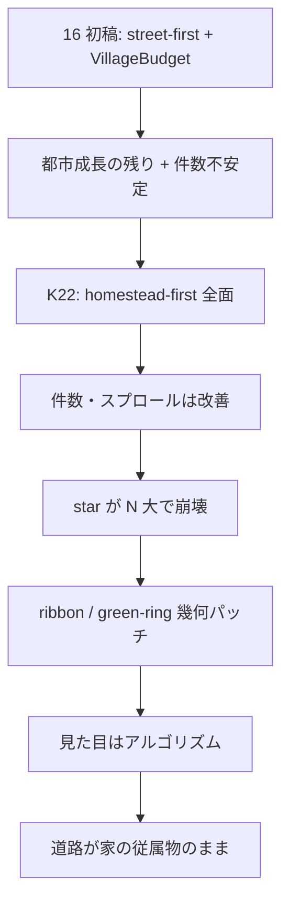
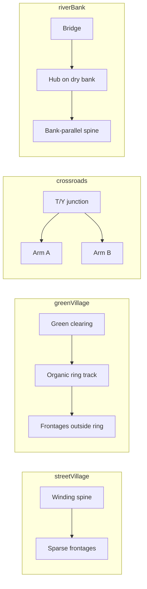
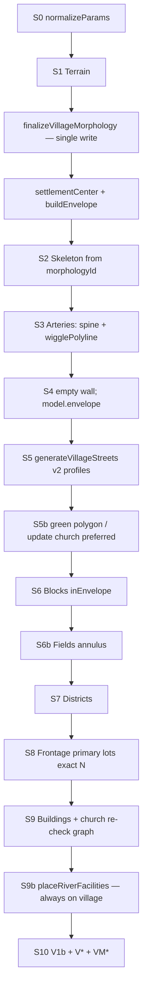

# 17. Village Morphology v2 — 説得力ある村落形態（道路 first）

| 項目 | 値 |
|------|-----|
| 文書 ID | 17-village-morphology-v2 |
| 著者 | （設計ドラフト） |
| 日付 | 2026-07-13 |
| 改訂 | 2026-07-13 r3（PR-V1 製品経路凍結の明示; pure frontage-primary; frontA/frontB on candidate） |
| ステータス | **Draft** |
| 関連 | [16-compact-village.md](16-compact-village.md)（予算・envelope・K1–K21 は継承。**K22 は本 doc K30 で置換**）、[01-goals.md](01-goals.md)、[03-pipeline.md](03-pipeline.md)、[05-roads.md](05-roads.md)、[14-historical-morphology-review.md](14-historical-morphology-review.md) |
| 改訂対象 | **16 K22（homestead-first 全面）** を帯別再定義。本 doc は **pop ≳ 30 / dwellings ≳ 6** の市場村スケールで道路 first に戻す |
| 参照 prior art | [Watabou Village Generator](https://watabou.github.io/village.html)、[itch notes (Parish–Müller)](https://watabou.itch.io/village-generator)、欧州村落形態（Straßendorf / green village / dispersed） |

> **実装者へ**: 16 本文の K22 / r5 homestead-first 全面は **本 doc を読むこと**。予算式・envelope・fields は 16 のまま。

---

## Overview

人口 ~50–100（母屋 ~10–20）の村が **「好き勝手に置いた家を線で結んだ」見た目**になっており、構造的説得力がほぼゼロである。16 の Phase A は予算・envelope・耕地を確立したが、K22 の **homestead-first（家→接続道）** とその後の star / ribbon / green-ring パッチは、件数保証とスプロール回避には効いた一方、**Watabou が示す「村は道でできている」**という一次原理を市場村スケールで放棄した。

本設計 **Village Morphology v2** は次を約束する:

1. **道路骨格が先**（Parish–Müller 的な global goals + local growth、村予算で疎に）
2. **家は道路間口（frontage）上に疎に載せる**（意図的ギャップあり）
3. **`targetDwellings = max(1, round(pop/5))` を golden で厳密保証**（星型レイを増やして N を埋めない）— 契約は [§5](#5-targetdwellings--v1-契約単一の製品不変条件)
4. 史実カタログ（`streetVillage` / `greenVillage` / `crossroadsHamlet` / `riverBank`）を site + rng で選ぶ
5. 極小開拓（pop ≲ 25, N ≤ 5）のみ star / dispersed を残す

16 の `VillageBudget`・`SettlementEnvelope`・fields annulus・city 非回帰契約は **そのまま継承**する。変えるのは **村の形態生成コア** と **K22 の適用範囲** である。

**注意（16 実装負債）**: 16 が設計した V1–V7 および village 時 M3/M11/M13 N/A は **コード未実装**（`src/validation/metrics.ts` に V\* キー無し、M13 は村でも gate 検査）。本 doc はそれを「既にある」とは扱わない — [§ Implementation debt](#implementation-debt-from-16)。

---

## Background & Motivation

### なぜ「説得力ゼロ」に見えるか（ユーザー問題）

| 観測 | 形態学的読解 |
|------|----------------|
| 家が点在し、道が後付けの接続線 | 歴史的村落は **道・耕地・共有地が先**、家は間口を占める |
| 中心に向かう多数の放射線 | 星型トポロジは開拓 2–5 戸の踏み分けにはあり得るが、**市場村では読めない** |
| 直線 spine + 左右交互スロット | アルゴリズムの痕跡が強い。実際の ribbon は **曲がり・死端・疎密のムラ** がある |
| 完全円の green-ring + 等角配置 | 計画都市でもない限り、green は **空地ノード** であり円周住宅団地ではない |
| 教会が道・水の上（別途修正済み） | ランドマーク問題は局所修正で直るが、**骨格の説得力は別問題** |

### Prior art — Watabou Village（意図のみ）

公開説明の核心（[village.html](https://watabou.github.io/village.html)）:

> Villages are **made of roads, not buildings**. Houses are placed **sparsely along winding roads**, complemented by fields and trees.

- 都市ジェネレータ: 建物マス駆動  
- 村落ジェネレータ: **道路網駆動 + 疎配置**  
- itch: Parish–Müller 系（または sequel）で二次道と家の分布を得る  
- Patreon 公開タイトル（本文 paywall）: improved fields/roads, lonely houses, non-square maps, highway/dead-end/isolated tags → **本プロジェクトの API 非ゴール**。意味の内部マッピングのみ（16 §2.1 を拡張）

**本 doc は UI/タグ/シード互換をしない。** 採用するのは因果順序と疎さの原則だけである。

### 史実村落形態（欧州中世〜近代農村の教科書型）

| 型 | 英語 ID（本 doc） | 特徴 | 人口帯の目安 |
|----|-------------------|------|--------------|
| 線形・リボン・Straßendorf | `streetVillage` | 1 本の主通り（または河岸）に沿って家。長地が奥へ。強い中心が無いことも多い | 10–100+ |
| 核集落・green village | `greenVillage` | green / 教会 / 交差点周りに密集。家は green やリング状トラックに面する。耕地は外側 | 25–100+ |
| 交差点 hamlet | `crossroadsHamlet` | 2–3 本の街道が T/Y で交わる。交差点に薄い核、腕に疎リボン | 20–80 |
| 河岸 | `riverBank` | **乾いた側**に核または線形。橋がある場合は bridge spine。**両岸等分の家は橋無しでは禁止** | 15–100 |
| 分散 homestead | `dispersed`（限定） | 少数 farmstead + 小径。**N ≤ 5 のみ** | 10–25 |

**禁止パターン（製品）**: 「円形に家を並べて中心から星状に道を引く」「川をまたいで両岸に同数の家を置き橋なし」。

### 現行コードの事実（2026-07-13）

```
generateCity (village)
  → terrain → budget + envelope
  → skeleton (village compact)
  → useHomesteadFirst(pop≤100) === true  常時
  → generateHomesteadVillage
       pickVillageLayout:
         N≤5 → star
         morphology green → green-ring
         else → ribbon
  → fields / buildings / riverFacilities   ← riverFacilities は homestead 枝のみ
```

| ファイル | 役割 | 形態上の問題 |
|----------|------|--------------|
| `src/generation/homesteadVillage.ts` | Phase A 全人口を担当 | 家配置が一次; 道は `connectStar` / `connectRibbon` / `connectGreenRing` |
| `pickVillageLayout` | N と morphology でモード選択 | star は小 N のみ妥当; ribbon/green-ring は幾何ハードコード |
| `buildSpine` | 直線 polyline through hub | **有機的 winding ではない** |
| `placeSitesAlongSpine` | 交互側スロット | 間隔が N に合わせて詰まる → 疎さが消える |
| `placeSitesAroundRing` | 等角 or dry sector | **正円 + 規則角度** |
| `connectStar` | gate→hub 全接続 | N=15–20 で可読性崩壊 |
| `streets.ts` `generateVillageStreets` | 16 の道路 first 実装（予算・dead-end・min cycle） | **homestead 経路では呼ばれない** |
| `lots.ts` `placeRibbonLotsAlongSpine` | street-first 経路の dwelling 救済 | **v2 frontage のベースに昇格**（Appendix B） |
| `churchPlacement.ts` | 道・水回避 | 形態全体は直さない |
| `villageBudget.ts` | pop→予算、ribbon/green 乱択 | morphology 語彙が 2 値のみ |
| `metrics.ts` | city M\* | **V1–V7 未実装**; village でも M13 が hard-fail し得る |

### ポストモーテム: なぜ 16 + homestead パッチは pop 100 で説得力を失うか



1. **問題の取り違え** — street-first の失敗は「村スケール予算無しの都市成長」。正しい修正は **予算付き roads-first**であり、因果反転ではなかった。K22 は極小 N では合理だが pop 50–100 に外挿した。
2. **件数保証の手段が形態を汚染** — 家 N を先に置き spiral で埋め hub に結ぶ → 「N 点を結ぶグラフ」。
3. **ribbon / green-ring は型の模倣のみ** — 道路曲線が先・間口が後、ではない。
4. **street-first 実装資産の放置** — `generateVillageStreets` + `ensureMinVillageCycle` + `placeRibbonLotsAlongSpine` が製品見た目に寄与していない。
5. **メトリクスが件数・延長止まり、かつ 16 の V\* が未配線** — パッチが「見た目不合格」を量産できる。

**結論**: 16 のインフラは成功。失敗は **K22 の適用範囲と homestead の幾何レイアウト**。v2 はインフラを保ち形態コアを差し替える。

---

## Goals & Non-Goals

### Goals

1. pop **~50–100** で説得力ある村落構造（pop **10–40** でも劣化しない）
2. Watabou **意図**に整合: roads-first、疎家、fields、optional green/square、dead ends
3. 既存契約維持: `CityModel`、`VillageBudget`、`SettlementEnvelope`、fields、river setback、region は薄いスタイルのみ
4. **`targetDwellings` の製品不変条件**（[§5](#5-targetdwellings--v1-契約単一の製品不変条件)）— 星レイ増殖なし
5. 教会は道・水の外（現行 `churchPlacement` 継続）
6. N≥6 の star / 正円 green-ring / 直線交互 ribbon **を廃止または demote**
7. 構造受け入れテスト（件数だけでなく形態）— 実装可能な定義付き
8. city golden path 非破壊の段階的 PR（**途中 main で件数/施設を壊さない**）

### Non-Goals

- Watabou タグ / シード / JSON 互換
- lonely houses・非方形マップの v1 完全実装（後続）
- 人口経済シミュレーション
- Phase B marketHamlet（pop 100–500）の完全式（帯のフックだけ）
- regionPreset ごとの村落形態差（v1 は NW 農家見た目 + 共通形態カタログ）
- city 経路・bastide/roman の変更
- v1 でのユーザー morph 手動選択（HUD 表示のみ。URL `morph=` は optional 後段）

---

## Implementation debt from 16

| 16 の設計項目 | コード現状（2026-07-13） | 17 での扱い |
|---------------|-------------------------|-------------|
| V1–V7 メトリクス | **未実装**（`metrics.ts` に V\* 無し） | **PR-V0** で導入。17 は「継承してある」とは書かない |
| village 時 M3/M11/M13 N/A | **未実装**（M13 は gates=0 vs numGates≥3 で fail し得る） | **PR-V0** で `settlementType==='village'` なら N/A pass |
| road length / span 検査 | テストが `settlementRoadLengthM` / `nodeSpanM` を **ad hoc** に呼ぶ | PR-V0 で V3/V4 として `validateCity` に統合 |
| dwelling exact count | homestead 経路 + `villageBudget.test.ts` が exact を要求 | 17 **V1b** が正式契約（§5）。16 の V1 ±40% は **Phase A では supersede** |
| `placeRiverFacilities` | **homestead 枝のみ**（`index.ts`） | roads-first 切替 PR で **必ず同呼び出し** |
| K22 homestead-first 全面 | `useHomesteadFirst` = pop≤100 | **K30**。16 本文にバナー（PR-V1 docs） |

---

## Proposed Design

### 名称と位置づけ

| 名前 | 意味 |
|------|------|
| **Village Morphology v2** | 本設計全体 |
| モジュール案 | `src/generation/villageMorphology.ts` + `villageFrontage.ts`（または `lots.ts` 拡張）+ 既存 `streets.ts` |
| 16 との関係 | **17 は 16 の形態層 supersede**。予算・envelope は 16 正本。**K22 → K30** |
| 旧 homestead | `dispersed` / star のみ（N≤5）。`generateHomesteadVillage` は縮小 |
| 間口実装のベース | 既存 **`placeRibbonLotsAlongSpine`**（`lots.ts` L700+）を primary lotter に昇格・一般化 |

### 1. 形態カタログ

```ts
export type VillageMorphologyId =
  | 'streetVillage'
  | 'greenVillage'
  | 'crossroadsHamlet'
  | 'riverBank'
  | 'dispersed';
```

#### 1.1 単一書き込み: morphology は terrain 後に一度だけ確定（K44）

**問題（旧稿）**: `applyVillageMorphology` が terrain 前に `ribbon|green` / `hasVillageGreen` / `spineCount` を書き、その後 `pickVillageMorphology` が別結果を出すと skeleton の plaza / endpoints と不一致になる。

**決定**: terrain 後の **単一関数** `finalizeVillageMorphology` が budget を mutate し、以降は **`morphologyId` のみが正本**。レガシー `morphology: 'ribbon'|'green'` は derived mirror（読み取り互換のみ。書き戻し禁止をドキュメント化）。

```ts
/**
 * Call once: after terrain, before envelope/skeleton.
 * Replaces the old split of applyVillageMorphology (pre-terrain RNG) + pickVillageMorphology.
 * Consumes rng.fork('village') only — no separate villageMorph fork required
 * (or fold villageMorph into this same stream as first draws).
 */
function finalizeVillageMorphology(
  budget0: VillageBudget, // pure computeVillageBudget(params)
  params: CityParams,
  terrain: TerrainModel,
  rng: RNG
): VillageBudget {
  const b = { ...budget0, roadBudget: { ...budget0.roadBudget }, lot: { ...budget0.lot } };
  const n = b.targetDwellings;

  // 1) morphologyId
  b.morphologyId = pickVillageMorphologyId(b, params, terrain, rng);

  // 2) derived flags — single source, no competing ribbon|green prior
  applyMorphologyDerivedFields(b, rng);

  b.targetBuildingsMax = recomputeTargetBuildingsMax(b);
  return b;
}

function applyMorphologyDerivedFields(b: VillageBudget, rng: RNG): void {
  const id = b.morphologyId!;
  // legacy mirror (UI / old tests)
  b.morphology = id === 'greenVillage' ? 'green' : 'ribbon';
  b.hasVillageGreen = id === 'greenVillage';

  // spine endpoints
  if (id === 'crossroadsHamlet') {
    b.roadBudget.spineCount = 2; // 3 endpoints
  } else if (id === 'streetVillage' || id === 'riverBank') {
    b.roadBudget.spineCount =
      b.population >= 70 && rng.next() < 0.25 ? 2 : 1;
  } else if (id === 'greenVillage') {
    b.roadBudget.spineCount = 1; // 2 approach ends; ring added in S5
  } else {
    b.roadBudget.spineCount = 1; // dispersed
  }

  // church odds (same bands as 16 applyVillageMorphology)
  if (b.population < 25) b.hasChurch = false;
  else if (b.population < 40) b.hasChurch = rng.next() < 0.45;
  else b.hasChurch = rng.next() < 0.85;

  // frontage sparsity defaults
  b.frontageSkipProb = defaultSkip(id);
  b.frontageOccupyMax = defaultOccupyMax(id);
  b.plazaRadiusTargetM = id === 'greenVillage' ? 8 + rng.next() * 10 : 0; // 8–18
}

function defaultSkip(id: VillageMorphologyId): number {
  switch (id) {
    case 'greenVillage': return 0.38;
    case 'crossroadsHamlet': return 0.32;
    case 'riverBank': return 0.30;
    case 'streetVillage': return 0.34;
    default: return 0.20;
  }
}
function defaultOccupyMax(id: VillageMorphologyId): number {
  switch (id) {
    case 'greenVillage': return 0.55;
    case 'streetVillage': return 0.65;
    case 'riverBank': return 0.70;
    case 'crossroadsHamlet': return 0.60;
    default: return 0.75;
  }
}
```

##### `morphologyId → skeleton / roads` 対応表（正本）

| morphologyId | `spineCount` | endpoints | `hasVillageGreen` | plazaR | 道路 seed 方針 |
|--------------|--------------|-----------|-------------------|--------|----------------|
| `streetVillage` | 1 or 2 | 2 or 3 | false | 0 | winding through-spine + side dead-ends |
| `greenVillage` | 1 | 2 (approaches) | true | 8–18 | approach + jittered open/closed ring track |
| `crossroadsHamlet` | 2 | 3 | false | 0–10 optional widen | 3 arms from hub |
| `riverBank` | 1 or 2 | 2 or 3 | false | 0 | bank-parallel spine; bridge edge if any |
| `dispersed` | 1 | 2 | false | 0 | homestead star paths（roads-first 外） |

##### `pickVillageMorphologyId`

```ts
function pickVillageMorphologyId(
  budget: VillageBudget,
  params: CityParams,
  terrain: TerrainModel,
  rng: RNG
): VillageMorphologyId {
  const n = budget.targetDwellings;
  if (n <= 5) return 'dispersed';

  const hasRiver =
    (terrain.rivers?.length ?? 0) > 0 ||
    (terrain.waterBodies?.length ?? 0) > 0;
  const hasBridge = (terrain.bridgeCandidates?.length ?? 0) > 0;

  if (params.siteArchetype === 'riverCrossing' || (hasRiver && hasBridge)) {
    return weighted(rng, [
      ['riverBank', 0.55],
      ['streetVillage', 0.25],
      ['greenVillage', 0.15],
      ['crossroadsHamlet', 0.05],
    ]);
  }
  if (params.siteArchetype === 'crossroads') {
    return weighted(rng, [
      ['crossroadsHamlet', 0.45],
      ['streetVillage', 0.30],
      ['greenVillage', 0.25],
    ]);
  }
  // No soft prior from pre-terrain ribbon|green — that field is not set yet
  return weighted(rng, [
    ['streetVillage', 0.55],
    ['greenVillage', 0.30],
    ['crossroadsHamlet', 0.15],
  ]);
}
```

**RNG 順序（city 不変）**:

```
terrain
→ village: computeVillageBudget + finalizeVillageMorphology   // single morphology write
→ envelope
→ skeleton   // reads morphologyId / hasVillageGreen / spineCount / plazaRadiusTargetM
→ arteries → streets → …
```

**配線タイミング（K46 / K48）**:

| 時期 | `generateCity` が呼ぶもの | 備考 |
|------|---------------------------|------|
| **〜 PR-V2 完了まで** | 現行どおり `applyVillageMorphology` + `useHomesteadFirst` | 製品シード見た目・green 率・教会 RNG **不変** |
| **PR-V1** | 上記のまま。`finalizeVillageMorphology` は **export + 単体テストのみ**（`index.ts` に差し込まない） | 下記 PR-V1 規則 |
| **PR-V3** | `finalizeVillageMorphology` に置換 + roads-first 切替 | この時点で ribbon\|green 乱択と morphologyId 重みが製品に効く |

旧 `applyVillageMorphology` は PR-V3 で `finalizeVillageMorphology` に統合し廃止。それまで両者を並存させてよい（finalize は新 API、本番未配線）。city は従来どおり `terrain→skeleton` で fork を踏まない。

#### 1.2 各形態の骨格契約

| ID | 道路骨格 | green/square | 家の位置 | 河 |
|----|----------|--------------|----------|-----|
| `streetVillage` | winding spine + 少数側枝 dead-end | 通常なし | spine 両側 frontage | 河があれば bank-parallel 可 |
| `greenVillage` | 不完全リング / 多角形トラック（正円禁止）+ 1–2 approach | 空地 8–18 m | リング外側 | 乾地側 |
| `crossroadsHamlet` | 2–3 arm T/Y | 交差点 widen optional | 腕に沿う | — |
| `riverBank` | 片岸 spine; 橋→hub | optional | 乾岸のみ | 対岸 dwelling 禁止 |
| `dispersed` | star + short links | small clearing | min-distance | dryAngles |



### 2. パイプライン全体（Village Morphology v2）



**分岐規則（K30）**:

```ts
function useRoadsFirstVillage(budget: VillageBudget): boolean {
  return budget.targetDwellings >= 6; // pop ≳ 30; intentional discontinuity
}
function useDispersedHomestead(budget: VillageBudget): boolean {
  return budget.targetDwellings <= 5;
}
```

| pop | N≈ | 枝 | 備考 |
|-----|-----|----|------|
| 10 | 2 | dispersed | 既存 star テスト維持 |
| 25 | 5 | dispersed | 境界 inclusive |
| 30 | 6 | roads-first | **意図的な形態ジャンプ** — テスト必須 |
| 50–100 | 10–20 | roads-first | 本 doc 主対象 |

**製品切替タイミング**: roads-first と `finalizeVillageMorphology` の **製品配線は PR-V3**（exact-N + riverFacilities 同梱）。PR-V1 は export + 単体テストのみ — [PR Plan](#pr-plan) / K48。

### 3. ステップ別アルゴリズム

#### Step 1 — Terrain / water / bridge

変更なし: `generateTerrain`。  
`settlementCenter` は riverCrossing で片岸オフセット（`hubOffsetFromCenterlineM` + pioneer）。  
**Dry-bank 幾何**は [§3.0](#30-dry-bank-geometry-共有) を全ステップで共有。

#### 3.0 Dry-bank geometry（共有）

既存ヘルパを再利用: `primaryRiverWidthM`, `dwellingSetbackFromWaterM`, `distanceToWater`, `ringRespectsWaterSetback`, `collectWaterRings`, `pointInAnyWater`（`riverSetback.ts` / `water.ts`）。homestead の `dryAngles` と同系。

```ts
interface DryBankContext {
  waters: Ring[];
  /** Unit normal from river toward dry settlement hub */
  bankNormal: Point2;
  /** Point on primary river centerline nearest hub (or bridge candidate) */
  riverAnchor: Point2;
  setbackM: number; // dwellingSetbackFromWaterM(primaryRiverWidthM(...), { pioneer: true })
  hub: Point2;
}

function buildDryBankContext(
  hub: Point2,
  terrain: TerrainModel,
  params: CityParams
): DryBankContext | null {
  const waters = collectWaterRings(terrain);
  if (waters.length === 0) return null;
  const w = primaryRiverWidthM(terrain, params.site);
  const setbackM = dwellingSetbackFromWaterM(w, { pioneer: true });

  // riverAnchor: prefer bridge candidate, else nearest point on primary river path
  const riverAnchor =
    terrain.bridgeCandidates[0] ??
    nearestPointOnPrimaryRiverCenterline(hub, terrain) ??
    hub;

  // bankNormal: from centerline toward hub (dry side by construction of settlementCenter)
  let bankNormal = normalize(sub(hub, riverAnchor));
  if (bankNormal[0] === 0 && bankNormal[1] === 0) {
    // Fallback: gradient of distanceToWater
    bankNormal = estimateOutwardFromWater(hub, waters);
  }
  return { waters, bankNormal, riverAnchor, setbackM, hub };
}

/** Dry half-plane: points on the hub side of the line through riverAnchor ⊥ bankNormal.
 *  Equivalently: dot(p - riverAnchor, bankNormal) >= -ε (ε = 2 m tolerance). */
function isOnDrySide(p: Point2, ctx: DryBankContext, eps = 2): boolean {
  return (
    (p[0] - ctx.riverAnchor[0]) * ctx.bankNormal[0] +
      (p[1] - ctx.riverAnchor[1]) * ctx.bankNormal[1] >=
    -eps
  );
}

function lotAcceptsWaterRules(
  lotRing: Ring,
  ctx: DryBankContext | null,
  morphologyId: VillageMorphologyId,
  requireDryHalfPlane: boolean
): boolean {
  if (!ctx) return true;
  if (!ringRespectsWaterSetback(lotRing, ctx.waters, ctx.setbackM)) return false;
  if (requireDryHalfPlane || morphologyId === 'riverBank') {
    const c = ringCentroid(lotRing);
    if (!isOnDrySide(c, ctx)) return false;
  }
  return true;
}
```

**Bridge edge タグ**:

- arteries が bridge candidate を通る path を `RoadGraph` に載せるとき、当該 edges に `meta.bridge = true` を付与する（既存に無ければ `Road` または edge userData を最小拡張。無ければ path 上の点が `pointInAnyWater` かつ bridge 近傍 ≤ 8 m なら bridge 扱い）。
- `generateVillageStreets` の nextP が water 内: **bridge エッジ延長のみ許可**。それ以外は現行どおり binary search で dry に止める。
- **riverBank または site riverCrossing**: さらに `dryBankOnly` — nextP が `!isOnDrySide` なら棄却（bridge セグメント除く）。

**`streetVillage` on `riverCrossing`**: 重み付きで riverBank 以外も選ばれ得る。その場合も **lot は `lotAcceptsWaterRules(..., requireDryHalfPlane: true)`** を適用（K34 強化: 形態 ID に関わらず riverCrossing では片岸 dwelling）。道路成長は `dryBankOnly` を riverCrossing でも有効化。

#### Step 2 — Road skeleton（roads first）

##### 2.1 Skeleton / arteries — winding の所有権（単一）

| 段階 | 責務 |
|------|------|
| **skeleton** | endpoints + plaza center/radius from budget（`plazaRadiusTargetM`）; church precinct preferred（graph null） |
| **arteries** | endpoint→plaza の piecewise-linear path（A* 既存）→ **`wigglePolyline(path, amp, rng)`** → GraphBuilder |
| **streets** | 成長のみ。spine を再 wiggle **しない**（二重歪み禁止） |

```ts
/** Midpoint displacement, 2–3 iterations, amplitude = envelopeR * ampFrac */
function wigglePolyline(path: Point2[], envelopeR: number, rng: RNG, ampFrac = 0.06): Point2[] {
  // skip if len < 40 m; clamp vertices inside mapRadius; reject if enters water (unless bridge)
}
```

##### 2.2 Organic street growth — `VillageRoadProfile` 数値表

```ts
interface VillageRoadProfile {
  seedSpacingM: number;
  stepM: [number, number];
  threshStraight: number;
  threshSide: number;
  maxLanes: number;
  maxStreetLengthM: number;
  maxStreetIters: number;
  /** 0 = free normal spawns; 1 = dir fully blended to spine tangent */
  biasAlongSpine: number;
  ringMode: boolean;
  dryBankOnly: boolean;
}
```

| morphologyId | seedSpacing | stepM | threshStraight | threshSide | maxLanes* | maxLen* | biasAlongSpine | ringMode | dryBankOnly |
|--------------|-------------|-------|----------------|------------|-----------|---------|----------------|----------|-------------|
| streetVillage | 70 | [40,65] | 0.48 | 0.90 | budget | budget | **0.65** | false | if river site |
| greenVillage | 55 | [35,55] | 0.42 | 0.86 | budget | budget | 0.25 | **true** | if river site |
| crossroadsHamlet | 60 | [40,60] | 0.45 | 0.88 | budget | budget | 0.40 | false | if river site |
| riverBank | 65 | [40,60] | 0.50 | 0.91 | budget | budget | **0.75** | false | **true** |

\* `maxLanes` / `maxStreetLengthM` / `maxStreetIters` のベースは `budget.roadBudget`（16 式）。プロファイルは上書き係数ではなく、表の thresh/bias/ring を budget に **merge**。

**`biasAlongSpine` アルゴリズム**（成長ステップごと）:

```ts
const freeDir = [cos(angle), sin(angle)]; // existing jittered step direction
const spineT = nearestSpineTangent(current.pA, spinePolyline);
const dir = normalize(lerp2(freeDir, spineT, profile.biasAlongSpine));
// side-branch spawn (len===0): use rotate90(spineT) with biasAlongSpine=0 for the first step
```

**ringMode**: green 半径 + 3–5 m に **jittered polygon**（n=12–18、半径 ±12%、角度不等間隔）を seed path として `addPath`。完全閉環 70% / C 字 30%。**等角 28 分割の正円は禁止**。

**必ず維持（16 K12/K18）**: clip ring 非グラフ; `ensureMinVillageCycle`; envelope 縁 dead-end。

##### 2.3 Green / square（S5b）

```ts
if (budget.morphologyId === 'greenVillage') {
  green = {
    center: envelope.center,
    radius: budget.plazaRadiusTargetM, // already 8–18
    ring: jitteredCircle(...),
  };
  // Update church preferred: point on green edge toward approach, outside green
  // skeleton precinct may be replaced or buildings re-place via findSafeChurchCenter
  model.debugGreen = green; // optional
}
```

家 lot の center ∈ green → reject（frontage filter）。

#### Step 3 — Frontage sampling → ちょうど N lots（S8）— **完全仕様**

**方針（K42 pure frontage-primary）**: roads-first 村の **住居 lot の唯一の供給源は `placeVillageLotsExactN`**。

| 段階 | 役割 |
|------|------|
| `extractBlocks` | faces / fields / districts 用。**house peel は走らせない**（または peel 結果を即 garden / 破棄） |
| `divideLots` village 枝 | **house を作らない**（farmland skip は維持）。住居は frontage 専用関数へ委譲 |
| `placeVillageLotsExactN` | **sole source** of `use: 'house'` lots + optional gardens + synthetic blocks |
| 旧 hybrid（peel → cap → ribbon 補充） | **非ゴール / legacy**。PR-V3 製品経路に載せない |

実装は `placeRibbonLotsAlongSpine` を一般化（エッジ走査・curb offset・water/road フィルタを共有）するが、**呼び出し方は「不足補充」ではなく「唯一の配置器」**。

詳細アルゴリズムは **[Appendix B](#appendix-b--exact-n-frontage-完全仕様)**。要約:

1. 候補生成: 各 edge を `frontageMedian` 間隔で歩き、両側 curb オフセット矩形（`frontA`/`frontB` を候補に保持）。**skipProb は候補間引き**。不足しそうなら skip を下げて再サンプル（最大 2 パス）。
2. フィルタ: envelope、setback、dry-bank、green 外、候補同士非重複、carriageway 非交差。
3. `scoreCandidate` → `pickBest` greedy + **minSep = frontageMin × 0.85**。同一セグメント両側は **許可**。
4. `candidates.length < N` → `extendRoadsForFrontage`（死端延長 → side lane → ladder → soft envelope +10%）最大 4 回。
5. golden: `|house| === N`。extreme: underfill + **一度だけ** warn（K41）。

#### Step 4 — Buildings（S9）

- house lot のみ detached; hard-cap `targetBuildingsMax`
- 教会: `findSafeChurchCenter` に **完成 graph** を渡す（skeleton 時 graph null の再チェック）
- green 縁 preferred は S5b で更新済みならそれを使用

#### Step 5 — Fields（S6b）

現行 `synthesizeAnnulusFields` 維持。

#### Step 6 — Landmarks / river facilities

**すべての village 枝**（dispersed も roads-first も）で `placeRiverFacilities` を呼ぶ。  
riverBank の対岸 dwelling 禁止と施設（landing/mill）は矛盾しない — 施設は dwelling カウント外、VM8 も施設除外。

### 4. 削除・凍結リスト（homestead 幾何）

| 対象 | 処置 | 条件 |
|------|------|------|
| `connectStar` | N≤5 のみ | dispersed |
| `buildSpine` / `placeSitesAlongSpine` | freeze → PR-V6 削除 | roads-first 未使用 |
| `placeSitesAroundRing` / `connectGreenRing` | freeze → 削除 | green は S5b |
| `placeSitesSpiral` で N 埋め | v2 **禁止** | dispersed 最終手段のみ |
| `useHomesteadFirst` | 削除 | `useDispersedHomestead` / `useRoadsFirstVillage` |
| `pickVillageLayout` | 削除 | `pickVillageMorphologyId` |
| `generateVillageStreets` | 製品復帰 | PR-V2+ |
| `placeRibbonLotsAlongSpine` | **昇格**して exact-N のコアに | PR-V3 |

### 5. `targetDwellings` / V1 契約（単一の製品不変条件）

**16 V1（±40% かつ ≤30）は Phase A 住居数について本 doc が supersede する（K41 / V1b）。**  
理由: 既存 homestead テストと製品ゴールは **exact N** を既に要求しており、±40% は street-first 不安定期の緩和だった。

| 文脈 | 要求 fill | 失敗時 |
|------|-----------|--------|
| **Golden seeds**（下表） | **`countDwellingLots === targetDwellings`（1.0）** | テスト fail |
| **Property suite**（≥20 seeds × archetypes） | 各 seed **≥ 0.9 N**、スイート平均 **≥ 0.98 N** | テスト fail |
| **Production runtime** | 目標 1.0; 未達なら `console.warn` **1 回/generate** | 生成は継続（underfill lots のまま） |
| **Hard cap** | house lots **≤ N** 常時（超過は garden 降格） | — |

Golden seeds（初期セット、PR で拡張可）:

```
seed ∈ { alsarah, village-a, village-b, village-c }
pop ∈ { 10, 25, 50, 100 }
siteArchetype ∈ { crossroads, riverCrossing }  // subset per seed
```

```
targetDwellings = max(1, round(pop / 5))
// V1b (17): golden exact; property ≥0.9
// 16 V1 ±40% — NOT used for Phase A dwelling acceptance after PR-V0/V3
// V2 max buildings, V3 road length, V4 span — still from 16 definitions once coded
```

**禁止手段**: hub 放射で N 達成、spiral orphan 家。  
**許可手段**: frontage 選定、道路延長、hard-cap（frontage 結果自身の ≤N のみ）。**peel 経由の house は使わない**（K42）。

### 6. `VillageBudget` 拡張

```ts
export interface VillageBudget {
  // ...existing 16 fields...
  morphologyId: VillageMorphologyId; // required after finalize
  /** @deprecated mirror of morphologyId; do not branch on this in new code */
  morphology: 'ribbon' | 'green';
  hasVillageGreen: boolean;
  plazaRadiusTargetM: number;
  frontageSkipProb: number;
  frontageOccupyMax: number;
}
```

---

## API / Interface Changes

### Before（現行）

```ts
if (village && useHomesteadFirst(budget)) { // always pop≤100
  generateHomesteadVillage(...);
  placeRiverFacilities(...);
}
// non-homestead village path exists but product never takes it for Phase A
```

### After PR-V1 only（製品経路 = 現行のまま）

```ts
// index.ts — MUST keep until PR-V3 (K48)
const budget0 = computeVillageBudget(params);
const budget = applyVillageMorphology(budget0, rng.fork('village')); // NOT finalize yet
// ...
if (village && useHomesteadFirst(budget)) {
  generateHomesteadVillage(...); // all pop≤100, star/ribbon/green-ring as today
  placeRiverFacilities(...);
}

// villageMorphology.ts — new exports, unit-tested only
export function finalizeVillageMorphology(...): VillageBudget { ... }
export function useRoadsFirstVillage(...): boolean { ... }
// generateCity does NOT call these in PR-V1
```

### After（最終・PR-V3+）

```ts
const budget = finalizeVillageMorphology(computeVillageBudget(params), params, terrain, rng.fork('village'));
// ...
if (village && useDispersedHomestead(budget)) {
  const h = generateHomesteadVillage(...); // star only
  // fields, buildings, placeRiverFacilities
} else if (village && useRoadsFirstVillage(budget)) {
  const arteries = generateArteries(..., ctx);
  const graph = generateStreets(..., ctx); // generateVillageStreets v2
  const blocks = extractBlocks(...); // faces/fields only — no house peel
  const fields = generateFields(...);
  const districts = assignDistricts(...);
  // sole house-lot source (K42) — do NOT divideLots peel + ribbon fill
  const { lots, graph: g2, blocks: lotBlocks } = placeVillageLotsExactN(...);
  const allBlocks = mergeFaceBlocksWithSynthetic(blocks, lotBlocks);
  const { buildings, landmarks } = generateBuildings(..., g2);
  placeRiverFacilities(...); // REQUIRED — parity with homestead branch
} else {
  // city
}
```

### 公開ヘルパ

```ts
export function finalizeVillageMorphology(...): VillageBudget;
export function pickVillageMorphologyId(...): VillageMorphologyId;
export function useRoadsFirstVillage(b: VillageBudget): boolean;
export function useDispersedHomestead(b: VillageBudget): boolean;
export function buildDryBankContext(...): DryBankContext | null;
export function sampleFrontages(...): FrontageCandidate[];
export function pickBestFrontages(...): FrontageCandidate[];
export function materializeFrontageLot(...): Lot;
export function placeVillageLotsExactN(...): { lots: Lot[]; graph: RoadGraph; underfill: boolean };
export function extendRoadsForFrontage(...): RoadGraph;
export function wigglePolyline(...): Point2[];
```

---

## Data Model Changes

| 変更 | 移行 |
|------|------|
| `VillageBudget.morphologyId` 等 | `finalizeVillageMorphology` が設定 |
| `Lot.frontage.roadId` | **実 graph road id**（K43）。homestead の `0` プレースホルダは roads-first で禁止 |
| green | plaza + optional debug ring; 新型必須ではない |
| edge/road `bridge` meta | 最小拡張 or 幾何ヒューリスティック |
| city golden | **不変** |

---

## Alternatives Considered

### A. homestead-first を磨き続ける  
不採用 — 因果が常に逆。

### B. 完全別 `generateVillage()`  
不採用 — 二重保守。

### C. 予算付き roads-first + frontage 選定（**採用 = v2**）  
採用。

### D. Parish–Müller フル再実装  
不採用 — 期間過大。現行 streets 成長で近似。

### E. 帯分岐しつつ ribbon 幾何を残す  
不採用 — アルゴリズム見た目の主因。

### F. 既存 `placeRibbonLotsAlongSpine` を **sole** primary lotter に昇格し、道路幾何だけ差し替える（**PR-V3 戦略として採用**）

- 利点: 既にエッジ走査・curb offset・water/road フィルタ・exact need ループがある。PR-V3 リスクが「第二の lotter」より低い。
- 欠点: 現状は peel cap 後の **不足埋め**用。v2 では **唯一の lot 供給**に役割変更し、peel 経路を製品から外し、sparse skip / scoring / green / dry-bank / real roadId / frontA·frontB を足す。
- **決定**: Alternative C の lot 層は **F = pure frontage-primary**（K42）。peel→fill hybrid は採用しない。道路層は arteries wiggle + streets profile。

---

## Security & Privacy Considerations

- クライアント完結。新規 I/O なし。  
- URL は既存 `pop` 等。morph 手動は v1 非ゴール。

---

## Observability

| 手段 | 内容 |
|------|------|
| HUD | pop, morphologyId, dwellings N/target, roadLength, V-pass, VM-pass（hard） |
| console.warn | underfill（**1 回/generate**）; star residual; fill rate |
| debug overlay | envelope, green, frontage candidates 採用/不採用 |
| 性能 | < 300 ms（V7） |

### ValidationReport 集約規則

| 種別 | metrics キー例 | `pass` への影響 |
|------|----------------|-----------------|
| Hard V / VM | `V1b_dwellingCount`, `VM1_hubStarScore`, `VM2_frontageRate`, `VM3_houseRoadDist`, `VM6_greenPurity`, `VM8_bankAsymmetry` | fail → `report.pass = false` |
| Soft VM | `VM4_deadEndCount`, `VM5_elongation`, `VM7_frontageOccupy` | fail でも **pass を落とさない**; HUD 警告色 |
| N/A | village の M3/M11/M13 | **failed に数えない** |
| City M\* | 既存 | city のみ従来どおり |

---

## 受け入れメトリクス

### V1b および 16 由来 V\*（PR-V0 でコード化）

| ID | 定義 | 合格 | 備考 |
|----|------|------|------|
| **V1b** | `countDwellingLots(house\|rowhouse)` | §5 表（golden 1.0 / property ≥0.9） | **17 が Phase A の住居拘束。16 V1 ±40% を置換** |
| V2 | 全 Building 数 | ≤ 40（pop≤100） | 16 |
| V3 | settlement road length m | ≤1.5 km (pop≤50), ≤2.5 km (pop≤100) | 16; clip ring 無し |
| V4 | node bbox span | ≤ 2×(envelopeR+stub)+40 | 16 |
| V5 | FieldStrip 数 | hasFields → ≥3; else N/A | 16 |
| V6 | 平均 lot 間口 | ∈ [12, 45] m | 16; M3 の代わり |
| V7 | 生成時間 | < 300 ms | 16 |

### Structural VM\* — 入力・式・hard/soft

#### VM1 — Anti-star（**hard** from PR-V2 smoke / PR-V5 full）

**意図**: homestead 的「1 hub → 多数 gate 放射」を検出。生のグラフ次数は Y+ladder で false-fail し得るため **使わない**。

```ts
// Inputs: graph, house lots with front midpoints (or gate points)
function vm1_starRayScore(model: CityModel): { value: number; passed: boolean } {
  // Candidate hubs: nodes within 20 m of envelope.center, OR degree ≥ 4
  // For each hub h:
  //   rays = house front-mids where
  //     (a) nearest graph path length to h ≤ 45 m, AND
  //     (b) the path is "almost radial": angle spread, and no other house mid within 8 m of that path
  //     simpler v1 proxy:
  //     segment h→frontMid does not pass within 3 m of another frontMid, length ≤ 40 m,
  //     and the edge chain is unique per house
  // value = max over hubs of ray count
  // N/A if morphologyId === 'dispersed' OR targetDwellings ≤ 5
  // pass: value ≤ 4 for N≥6  (allow a few approach spurs, not N rays)
}
```

- **N/A**: `dispersed`  
- **Hard** after PR-V5; PR-V2 は同式の **smoke helper**（テスト専用、report 未接続可）  
- 期待: 旧 star レイアウト seed を強制すると fail; streetVillage golden pass

#### VM2 — Real frontage（**hard** PR-V5）

```ts
// For each dwelling lot:
//   ok = lot.frontage != null
//     && graph.roads[lot.frontage.roadId] != null  // real id, not 0 placeholder unless road 0 exists
//     && distance(frontMid(lot), nearestPointOnRoadEdges(graph)) ≤ 8 m
// value = okCount / dwellingCount
// pass: ≥ 0.95
// N/A: dwellingCount === 0
```

#### VM3 — House–road distance（**hard** PR-V5）

**測点**: lot の **front mid**（span 中点）、**centroid ではない**（深い農家 lot で false-fail するため）。

```ts
// d_i = dist(frontMid_i, nearest point on any highway|artery|street edge polyline)
// value_p50 = percentile(d, 50); value_p95 = percentile(d, 95)
// pass: p50 ∈ [1.5, 10] m AND p95 ≤ 18 m
```

#### VM4 — Dead-ends（**soft**）

```ts
// count nodes with degree 1, excluding highway endpoints from skeleton
// pass soft: count ≥ 1 when pop ≥ 30
// N/A: dispersed
```

#### VM5 — Elongation（**soft** until calibrated）

```ts
// Set P = dwelling front-mids (fallback: lot centroids)
// elongation = max eigenvalue / min eigenvalue of 2×2 covariance of P
//   or bboxLong / bboxShort of P
// pass soft: ≥ 1.35 when morphologyId ∈ {streetVillage, riverBank}
// N/A: other morphologyIds
```

#### VM6 — Green purity（**hard** PR-V5）

```ts
// if morphologyId !== 'greenVillage' || !greenRing → N/A pass
// value = count dwelling centroids inside green polygon
// pass: value === 0
```

#### VM7 — Frontage occupy（**soft**）

```ts
// frontableM = sum over street|artery edges in envelope of edge.length
//   (both sides counted separately: frontableM *= 2)
// occupiedFrontageM = sum over dwelling lots of lot.frontWidth
// value = occupiedFrontageM / max(frontableM, 1)
// soft pass band: [0.25, 0.80]  // wider than product target; calibrate later
// never hard-fail in v1
```

#### VM8 — River bank asymmetry（**hard** PR-V5）

```ts
// N/A unless morphologyId === 'riverBank' OR siteArchetype === 'riverCrossing'
// ctx = buildDryBankContext(...)
// dwellings on wet side = centroid where !isOnDrySide(c, ctx)
// exclude river facility buildings (kind landing/mill/washing)
// value = wetDwellings / totalDwellings
// pass: value ≤ 0.10
```

### 目視チェックリスト

- [ ] 主道または green+approach が読める  
- [ ] 家が道沿い、隙間あり  
- [ ] 中心から 10+ 放射がない  
- [ ] green 上に家なし  
- [ ] 耕地外周  
- [ ] 川村は片岸  
- [ ] 教会が道・水の外  
- [ ] river facilities が roads-first でも出る  

---

## Risks

| リスク | 深刻度 | 緩和 |
|--------|--------|------|
| frontage 不足で V1b 未達 | **高** | extendRoads; skip 再パス; soft envelope; golden 固定 |
| PR 途中で street-first に切替えて件数/施設破綻 | **高** | **PR-V1 は製品経路を切替えない**（Issue 2） |
| 木グラフ face 0 | 高 | K18 ensureMinVillageCycle |
| city 回帰 | 高 | village のみ fork; 毎 PR snapshot |
| VM1 生次数 false-fail | 中 | ray-count 定義（上） |
| morphology 二重書き | 中 | K44 finalize 一回 |
| 16 だけ読んで K22 復活 | 中 | PR-V1 で 16 バナー |
| N=5/6 見た目ジャンプ | 低 | 意図的; 境界テスト |

---

## Open Questions

1. ~~0.9N vs 1.0N~~ → **§5 で決定**  
2. `morphologyId` を URL/UI でユーザ選択？ → **v1 自動のみ**（K45）  
3. lonely houses → **v1.1**  
4. Phase B で同 frontage パイプライン？ → **推奨 yes**  
5. `homesteadVillage.ts` 分割 vs 縮小 → 実装 PR 判断  
6. `Road` に `bridge` フラグを型追加するか幾何ヒューリスティックか → **PR-V2 で型追加を推奨**（明示の方が streets が単純）

---

## Relationship to doc 16

| 16 の要素 | 17 の扱い |
|-----------|-----------|
| VillageBudget / envelope / fields | **継承** |
| K1–K21（K22 除く） | **継承** |
| K22 | **K30 で置換**（N≤5 のみ dispersed） |
| V1 ±40% | **V1b exact/golden で Phase A supersede** |
| V2–V7 定義 | 継承（**コードは PR-V0**） |
| S5 generateVillageStreets | 製品復帰 + profile |
| PR1–PR7（16） | 多く未完/部分完了; 17 は V0+ 系列 |

**16 本文の編集（PR-V1 同時）**: 先頭にバナー:

```markdown
> **形態パイプライン**: r5 K22 homestead-first 全面は
> [17-village-morphology-v2.md](17-village-morphology-v2.md) **K30** により
> dwellings≥6 で roads-first に置換。予算・envelope は本 doc が正本。
```

---

## Rollout Plan

1. ゲートは `settlementType === 'village'` のみ  
2. **PR-V1 では `generateCity` を一切変えない**（`applyVillageMorphology` + homestead 維持; finalize は export のみ — K48）  
3. roads-first + `finalizeVillageMorphology` 製品配線は **PR-V3**（exact-N pure frontage + riverFacilities）  
4. 各 PR で city golden ゼロ差分  
5. ロールバック = git revert  

---

## Key Decisions

| # | 決定 | 根拠 |
|---|------|------|
| **K30** | dwellings ≥ 6 は roads-first; ≤ 5 のみ dispersed。K22 置換 | 市場村で家 first は構造説得力を失う |
| **K31** | カタログ 4+1 | 史実 + 河岸 + 極小 |
| **K32** | 件数 = frontage 選定 + 道路延長。星・spiral 禁止 | Watabou 因果 |
| **K33** | green は空地。正円等角住宅リング禁止 | 核集落 |
| **K34** | riverCrossing / riverBank は片岸 dwelling（施設除く） | 史実・見た目 |
| **K35** | `generateVillageStreets` + K12/K18 を製品コアに復帰 | 16 インフラ回収 |
| **K36** | VM1–VM8 定義付き; hard/soft 分離 | 数値合格・見た目不合格の防止 |
| **K37** | city fork 順不変; morphology は village の `village` ストリームで一回 | golden |
| **K38** | homestead ribbon/green-ring freeze→削除 | アルゴリズム見た目除去 |
| **K39** | regionPreset は形態を変えない | 16 K9 |
| **K40** | 17 は形態 supersede; 予算は 16 | 責務分離 |
| **K41** | **V1b**: golden exact N; property ≥0.9 mean≥0.98; 16 V1 ±40% を Phase A で置換 | テスト・製品と一致 |
| **K42** | roads-first の house lot は **pure frontage-primary**（`placeVillageLotsExactN` が sole source）。peel→fill hybrid は非ゴール | 二重経路排除; Alt F は実装ベースのみ |
| **K43** | village house lot の `frontage.roadId` は **実在 road**; candidate に `frontA`/`frontB` を保持 | VM2/M1 |
| **K44** | **`finalizeVillageMorphology` 一回書き**（製品配線は PR-V3）。ribbon\|green は mirror のみ | 二重状態排除 |
| **K45** | v1 でユーザ morph 選択なし（HUD 表示のみ） | 範囲抑制 |
| **K46** | **PR-V1 は製品経路を homestead のまま**。roads-first 切替は V3 | 中間 main 破綻防止 |
| **K47** | `placeRiverFacilities` は全 village 枝で必須 | 施設リグレッション防止 |
| **K48** | **PR-V1 の `generateCity` は `applyVillageMorphology` + `useHomesteadFirst` を維持**。`finalize*` / `useRoadsFirst*` は export + 単体テストのみ（index 未配線） | finalize を早期配線すると green 率・RNG が変わり「見た目不変」が破れる |

---

## PR Plan

各 PR: **city golden 差分なし**（`index.test.ts` snapshot 必須 CI）。  
受け入れに載せるメトリクスは **その PR で実装済みのものだけ**。

### PR-V0 — 16 メトリクス負債（推奨・独立可）

| 項目 | 内容 |
|------|------|
| 依存 | なし |
| ファイル | `metrics.ts`, `11-validation.md`, tests |
| 内容 | V1b（暫定: 現行 homestead exact を validateCity に）、V2–V7、village M3/M11/M13 N/A、pass 集計 |
| 受け入れ | village で M13 が pass を落とさない; city 不変; V3/V4 が ad hoc テストと同じ定義 |

### PR-V1 — API / morphologyId / docs（**製品経路完全凍結**）K46 + **K48**

| 項目 | 内容 |
|------|------|
| 依存 | なし（V0 と並列可） |
| ファイル | `villageMorphology.ts`（新規可）, `villageBudget.ts`（型のみ可）, `homesteadVillage.ts`（export 整理のみ）, **`index.ts` は morphology 呼び出しを変更しない**, `16` バナー, `README`, unit tests |
| 内容 | **必須規則**: `generateCity` は **現行のまま** `applyVillageMorphology` + `useHomesteadFirst` を使い続ける。`finalizeVillageMorphology` / `pickVillageMorphologyId` / `useRoadsFirstVillage` / `useDispersedHomestead` は **exported API + 単体テストのみ**（`index.ts` に import して budget 決定に使わない）。seed パリティを finalize と production で主張しない。`pickVillageLayout` テストは **削除しない**（製品未変更のため）。**16 先頭バナー** |
| 受け入れ | 固定 golden seeds の village 出力が **PR 前後で構造一致**（dwellings exact・layout モード・riverFacilities・できれば graph ノード数 or snapshot）; city snapshot ゼロ; `useRoadsFirstVillage` / `finalizeVillageMorphology` の **単体**が通る; **製品見た目は変えない（必須）** |
| 禁止 | `index.ts` で `applyVillageMorphology` → `finalizeVillageMorphology` 置換; `useHomesteadFirst` 削除; N≥6 の roads-first 早期切替 |
| テスト移行 | 製品経路テストは不変。新 API は `*.test.ts` で独立に呼ぶのみ |

### PR-V2 — Roads profiles + winding + dry-bank growth

| 項目 | 内容 |
|------|------|
| 依存 | V1 |
| ファイル | `streets.ts`, `arteries.ts`, `skeleton.ts`, `villageMorphology.ts`, `riverSetback` 利用 |
| 内容 | `VillageRoadProfile` 数値表; `wigglePolyline` on arteries; `biasAlongSpine`; ringMode; dryBankOnly + bridge meta; **内部フラグ or test-only path** で streets を検証可能に |
| 受け入れ | **製品既定はまだ homestead 可**; 単体: dry-bank が対岸に成長しない; wiggle が water に突っ込まない; **VM1 smoke helper**（report 未接続可）が人工 star グラフで fail |
| 非受け入れ | VM4 を validateCity 必須にしない（未配線） |

### PR-V3 — Frontage exact-N + **製品を roads-first に切替** + riverFacilities

| 項目 | 内容 |
|------|------|
| 依存 | V2 |
| ファイル | `lots.ts` / `villageFrontage.ts`, `index.ts`, tests |
| 内容 | Appendix B 実装（`placeRibbonLotsAlongSpine` 昇格）; **pure** `placeVillageLotsExactN`（sole house source; peel house 禁止）; `extendRoadsForFrontage`; **index: `finalizeVillageMorphology` 配線 + N≥6 → roads-first**; **`placeRiverFacilities` を roads-first 枝に追加**; N≤5 dispersed 維持 |
| 受け入れ | golden V1b exact; property ≥0.9; riverCrossing で facilities 維持; city ゼロ; pop25 dispersed / pop30 roads-first; **house lots がすべて real frontage.roadId を持つ**（peel 由来 house ゼロ） |
| テスト移行 | homestead ribbon/green-ring の pop50/100 テストを frontage 経路期待に更新; `pickVillageLayout` ribbon 期待を削除; `applyVillageMorphology` 製品呼び出し削除 |

### PR-V4 — Green / riverBank / church preferred

| 項目 | 内容 |
|------|------|
| 依存 | V3 |
| ファイル | skeleton/buildings 利用側, S5b, tests |
| 内容 | green polygon + open ring; lot reject-in-green; church preferred = green edge after S5b; VM6/VM8 をテストヘルパで先行検証可 |
| 受け入れ | greenVillage seed で green 内 house=0; riverBank wet dwellings ≤10%; 目視シード |

### PR-V5 — Full metrics + HUD

| 項目 | 内容 |
|------|------|
| 依存 | V4（V0 済み前提） |
| ファイル | `metrics.ts`, HUD, docs 16 注記確認, 11 |
| 内容 | VM1–VM8 を `validateCity` に接続; hard/soft 規則; underfill warn 1 回 |
| 受け入れ | hard VM + V1b–V7; soft は pass 非拘束; city ゼロ |

### PR-V6 — 削除と polish

| 項目 | 内容 |
|------|------|
| 依存 | V5 |
| ファイル | `homesteadVillage.ts` 縮小, 死コード削除 |
| 内容 | ribbon/green-ring 関数削除; star のみ残す; grep で正円 ring 配置が製品経路に無いこと |
| 受け入れ | bundle/tests green; optional URL morph はまだ無し（K45） |

```mermaid
gantt
  title Village Morphology v2 PRs
  dateFormat  X
  axisFormat  %s
  section v2
  PR-V0 Metrics debt 16           :v0, 0, 1
  PR-V1 API+docs no path switch   :v1, 0, 1
  PR-V2 Roads profiles testable   :v2, 1, 2
  PR-V3 Exact-N + product switch  :v3, 2, 3
  PR-V4 Green riverBank church    :v4, 3, 4
  PR-V5 VM full + HUD             :v5, 4, 5
  PR-V6 Delete frozen homestead   :v6, 5, 6
```



---

## References

- コード:  
  - `src/generation/homesteadVillage.ts`  
  - `src/generation/streets.ts` — `generateVillageStreets`, `ensureMinVillageCycle`  
  - `src/generation/lots.ts` — `placeRibbonLotsAlongSpine`, `enforceDwellingCap`  
  - `src/generation/villageBudget.ts`  
  - `src/generation/index.ts`  
  - `src/generation/churchPlacement.ts`  
  - `src/generation/riverSetback.ts`  
  - `src/generation/fields.ts`  
  - `src/generation/stageContext.ts`  
  - `src/validation/metrics.ts`（V\* 未実装）  
- 計画: 16, 05, 14  
- Prior art: Watabou Village, Parish–Müller 言及（itch）  

---

## Appendix A — 現行 vs v2（pop=100, ~20 dwellings）

| 量 | 現行 homestead ribbon/ring | v2 目標 |
|----|---------------------------|---------|
| 一次生成物 | 家サイト N | 道路骨格 |
| 主道 | 直線 spine or 正円 | winding spine / jittered open ring |
| 接続 | gate→spine spur × N | frontage 上に lot |
| 星検出 | なし | VM1 ray-count |
| 家–道 | 不安定 | front mid p50 ∈ [1.5,10] m |
| 件数 | exact（homestead） | exact golden（frontage） |
| riverFacilities | homestead のみ | 全 village 枝 |
| 耕地 | annulus | 同左 |

---

## Appendix B — Exact-N frontage 完全仕様

実装ベース: `lots.ts` の `placeRibbonLotsAlongSpine`（エッジ列挙・curb・depth 矩形・water/road チェック）。v2 はこれを **need 埋め専用から primary lotter へ**拡張する。

### B.1 型

```ts
type FrontageCandidate = {
  roadId: number;
  edgeA: Point2;       // on road centerline, frontage start
  edgeB: Point2;       // on road centerline, frontage end
  frontA: Point2;      // curb-side lot front corners (required for span)
  frontB: Point2;
  frontMid: Point2;    // curb-side midpoint (lot front)
  tangent: Point2;     // unit along road
  outward: Point2;     // unit from road into lot (side normal)
  side: 1 | -1;
  frontWidth: number;
  depth: number;
  lotRing: Ring;       // rectangle front→depth
  score: number;
  cursor: number;      // m along edge from a→b
  segKey: string;      // `${edge.a}-${edge.b}` or roadId+offset
};

type ExactNResult = {
  lots: Lot[];
  graph: RoadGraph;    // may be extended
  blocks: Block[];     // synthetic 1:1 with house lots if no face peel
  underfill: boolean;
  warn?: string;
};
```

### B.2 `makeCandidate` — 幾何

既存 `placeRibbonLotsAlongSpine` と同型:

```ts
function makeCandidate(
  seg: { a: Point2; b: Point2; roadId: number; width: number; len: number },
  cursor: number,       // center of frontage along seg, meters from a
  side: 1 | -1,
  budget: VillageBudget,
  rng: RNG
): FrontageCandidate | null {
  const frontWidth = clamp(
    budget.lot.frontageMedian + (rng.next() - 0.5) * 6,
    budget.lot.frontageMin,
    budget.lot.frontageMax
  );
  const depth = clamp(
    budget.lot.depthMin + rng.next() * (budget.lot.depthMax - budget.lot.depthMin) * 0.45,
    14,
    Math.min(budget.lot.depthMax * 0.55, 28) // village farm depth soft cap (existing code ~)
  );
  const tangent = normalize(sub(seg.b, seg.a));
  const outward = scale(rotate90(tangent, true), side);
  const privateSetback = 2.0;
  const curb = seg.width / 2 + privateSetback;

  const t0 = (cursor - frontWidth / 2) / seg.len;
  const t1 = (cursor + frontWidth / 2) / seg.len;
  if (t0 < 0.02 || t1 > 0.98) return null;

  const edgeA = lerp(seg.a, seg.b, t0);
  const edgeB = lerp(seg.a, seg.b, t1);
  const midOnRoad = lerp(seg.a, seg.b, cursor / seg.len);
  const frontMid = add(midOnRoad, scale(outward, curb));
  const frontA = add(edgeA, scale(outward, curb));
  const frontB = add(edgeB, scale(outward, curb));
  const lotRing = ensureCcw(lotRect(frontA, frontB, depth, outward));

  return {
    roadId: seg.roadId,
    edgeA, edgeB, frontA, frontB, frontMid, tangent, outward, side,
    frontWidth, depth, lotRing,
    score: 0, cursor, segKey: `${seg.roadId}@${cursor.toFixed(1)}:${side}`,
  };
}
```

### B.3 フィルタ

```ts
function acceptCandidate(
  c: FrontageCandidate,
  env: SettlementEnvelope,
  graph: RoadGraph,
  waters: Ring[],
  dry: DryBankContext | null,
  green: Ring | null,
  morphologyId: VillageMorphologyId,
  params: CityParams,
  existingRings: Ring[]
): boolean {
  const centroid = ringCentroid(c.lotRing);
  if (!pointInEnvelope(centroid, env) && distance(centroid, env.center) > env.radius * 1.12) {
    return false;
  }
  if (green && pointInPolygon(centroid, green)) return false;
  if (ringOverlapsRoad(c.lotRing, graph, 0.6)) return false;
  if (waters.length && ringOverlapsWater?.(c.lotRing, waters)) return false;

  const requireDry =
    morphologyId === 'riverBank' || params.siteArchetype === 'riverCrossing';
  if (!lotAcceptsWaterRules(c.lotRing, dry, morphologyId, requireDry)) return false;

  // overlap existing
  for (const r of existingRings) {
    if (polygonsOverlapApprox(c.lotRing, r, minSepArea = 4)) return false;
  }
  return true;
}
```

### B.4 `scoreCandidate`

```ts
function scoreCandidate(
  c: FrontageCandidate,
  morphologyId: VillageMorphologyId,
  env: SettlementEnvelope,
  spine: Point2[] | null
): number {
  let s = 0;
  // Prefer nearer spine / center but not on top of hub
  const dHub = distance(c.frontMid, env.center);
  s += 30 - Math.abs(dHub - env.radius * 0.45); // peak mid-radius
  // Prefer artery/street over highway stubs
  // (caller can pass rank bonus)
  s += c.frontWidth >= 15 && c.frontWidth <= 32 ? 5 : 0;
  // Morphology: streetVillage prefers elongated — slight bonus far from center along spine
  if ((morphologyId === 'streetVillage' || morphologyId === 'riverBank') && spine) {
    s += 0.05 * distanceAlongSpine(c.frontMid, spine);
  }
  // greenVillage: prefer facing ring (already outside green)
  if (morphologyId === 'greenVillage') s += 3;
  // small noise for variety
  return s;
}
```

### B.5 `sampleFrontages` — skip と exact-N の相互作用

```ts
function sampleFrontages(...): FrontageCandidate[] {
  const segs = collectFrontableSegments(graph, envelope); // same filters as placeRibbonLotsAlongSpine
  segs.sort((a, b) => b.len - a.len);

  let skip = budget.frontageSkipProb;
  let accepted: FrontageCandidate[] = [];

  for (let pass = 0; pass < 2; pass++) {
    accepted = [];
    const existing: Ring[] = [];
    for (const seg of segs) {
      const step = budget.lot.frontageMedian * (0.95 + rng.next() * 0.2);
      let cursor = budget.lot.frontageMedian * 0.5;
      while (cursor < seg.len - budget.lot.frontageMedian * 0.5) {
        // Skip is Bernoulli per cursor, NOT per side — both sides may still be tried if not skipped
        const skipHere = rng.next() < skip;
        if (!skipHere) {
          for (const side of [1, -1] as const) {
            const raw = makeCandidate(seg, cursor, side, budget, rng);
            if (!raw) continue;
            raw.score = scoreCandidate(raw, morphologyId, envelope, spine);
            if (!acceptCandidate(raw, ..., existing)) continue;
            accepted.push(raw);
            // do not push to existing yet — selection handles separation
          }
        }
        cursor += step;
      }
    }
    if (accepted.length >= budget.targetDwellings * 1.5 || pass === 1) break;
    // Not enough raw candidates: reduce skip and resample
    skip *= 0.5;
  }
  return accepted;
}
```

**要点**: skip は疎さのため。候補不足時は skip を下げて **再サンプル**してから `extendRoads` に進む。最初から skip 無しで N を詰めて埋めない。

### B.6 `pickBest` — greedy + min separation

```ts
function pickBestFrontages(
  cands: FrontageCandidate[],
  n: number,
  budget: VillageBudget
): FrontageCandidate[] {
  const minSep = budget.lot.frontageMin * 0.85; // meters between front mids
  const sorted = [...cands].sort((a, b) => b.score - a.score);
  const picked: FrontageCandidate[] = [];

  for (const c of sorted) {
    if (picked.length >= n) break;
    const ok = picked.every((p) => distance(p.frontMid, c.frontMid) >= minSep);
    if (!ok) continue;
    // Both sides of same segment allowed if minSep holds (typically depth apart)
    picked.push(c);
  }
  return picked;
}
```

### B.7 `materializeFrontageLot` / blocks / gardens

```ts
function materializeFrontageLot(
  c: FrontageCandidate,
  id: number,
  blockId: number,
  graph: RoadGraph,
  rng: RNG
): { house: Lot; garden?: Lot; block: Block } {
  const rank = graph.roads[c.roadId]?.rank ?? 'street';
  const roadWidth = graph.roads[c.roadId]?.width ?? 3;
  const block: Block = {
    id: blockId,
    ring: c.lotRing,
    frontages: [{ edgeStart: 0, roadId: c.roadId, rank, roadWidth }],
    districtId: 0,
    inWall: true,
  };
  const house: Lot = {
    id,
    blockId,
    ring: c.lotRing,
    frontage: {
      roadId: c.roadId, // K43 real id
      rank,
      span: [c.frontA, c.frontB], // from candidate fields (not recomputed ad hoc)
      roadWidth,
    },
    use: 'house',
    frontWidth: c.frontWidth,
    depth: c.depth,
    courtyard: null,
  };
  // optional garden behind house (50%), same as homestead
  ...
  return { house, garden, block };
}
```

**blocks 戦略（pure frontage-primary）**: 住居は homestead 同様 **1 house lot = 1 synthetic block**（`inWall: true`）。`extractBlocks` の face block は fields/districts 用に残してよいが、**それらの block から house を peel しない**。M1 は frontage.span + real roadId で満たす。

### B.8 `extendRoadsForFrontage` — 純グラフ変換

優先順（各 attempt で 1 戦略）:

| 順 | 操作 | 停止条件 |
|----|------|----------|
| 1 | 次数 1 の street ノードから `maxStreetLengthM` まで 1 ステップ延長（envelope 内・dry） | 新長 ≥ 15 m |
| 2 | spine 上の空き ≥ 40 m に短 side lane（`maxLanes` 未満） | lane +1 |
| 3 | `ensureMinVillageCycle` と同型の ladder 1 本（未設置なら） | face 増 or path 追加 |
| 4 | envelope radius 一時 ×1.10 で clip のみ緩和（永続 envelope は変えない） | 1 回限り |

```ts
function extendRoadsForFrontage(
  graph: RoadGraph,
  budget: VillageBudget,
  profile: VillageRoadProfile,
  dry: DryBankContext | null,
  envelope: SettlementEnvelope,
  rng: RNG,
  attempt: number
): RoadGraph {
  const builder = GraphBuilder.from(graph);
  switch (attempt) {
    case 0: extendDeadEnds(builder, ...); break;
    case 1: spawnOneSideLane(builder, ...); break;
    case 2: ensureMinVillageCycle(builder, ...); break;
    case 3: /* soft envelope used only in sampleFrontages clip */ break;
  }
  return builder.getGraph(); // implement as `new GraphBuilder(graph)` — not `.from`
}
```

`maxLanes` / `maxStreetLengthM` / envelope に当たったらその戦略は no-op で次へ。

### B.9 `placeVillageLotsExactN` — トップレベル（sole house source）

roads-first 村では **この関数だけが `use: 'house'` を emit する**。`divideLots` の house peel や「peel 不足を ribbon で補充」は呼ばない（K42 pure）。

```ts
function placeVillageLotsExactN(...): ExactNResult {
  const N = budget.targetDwellings;
  let graph = initialGraph;
  let softEnv = envelope;
  let best: FrontageCandidate[] = [];

  for (let attempt = 0; attempt < 4; attempt++) {
    if (attempt > 0) {
      graph = extendRoadsForFrontage(graph, ..., attempt - 1);
      if (attempt === 3) softEnv = scaleEnvelope(envelope, 1.10);
    }
    const cands = sampleFrontages(graph, budget, morphologyId, terrain, green, softEnv, dry, rng);
    const picked = pickBestFrontages(cands, N, budget);
    if (picked.length > best.length) best = picked;
    if (picked.length >= N) {
      return materializeAll(picked.slice(0, N), graph, false);
    }
  }

  // Last resort underfill — still only frontage lots, never peel fallback
  if (typeof console !== 'undefined') {
    console.warn(
      `[village] frontage underfill ${best.length}/${N} seed=${params.seed} morph=${morphologyId}`
    ); // once per generate
  }
  return materializeAll(best, graph, true);
}
```

### B.10 失敗モード一覧

| 状況 | 動作 |
|------|------|
| 候補 ≥ N | exact N、underfill=false |
| 候補 < N、extend 成功 | ループ継続 |
| maxLanes/maxLen/envelope 全打ち止め | underfill、warn 1 回 |
| golden seed underfill | **テスト fail**（生成は underfill を返す） |
| 過剰候補 | pickBest が上位 N |
| 両側同時 | minSep 満たせば可 |
| face blocks のみ存在 | house は synthetic blocks のみ — **peel しない** |
| （legacy 非ゴール）peel→fill hybrid | **採用しない**。旧 `divideLots` village の cap+ribbon 補充は roads-first 製品経路から外す |

### B.11 テスト契約

```ts
// unit
expect(pickBestFrontages(cands, 10, budget)).toHaveLength(10);
expect(minPairDistance(picked.map(p => p.frontMid))).toBeGreaterThanOrEqual(frontageMin * 0.85);

// integration golden
const model = generateCity({ settlementType: 'village', population: 50, seed: 'alsarah', ... });
expect(countDwellingLots(model.lots)).toBe(computeVillageBudget(model.params).targetDwellings);
expect(model.lots.filter(l => l.use==='house').every(l => model.graph.roads[l.frontage!.roadId])).toBe(true);
```
