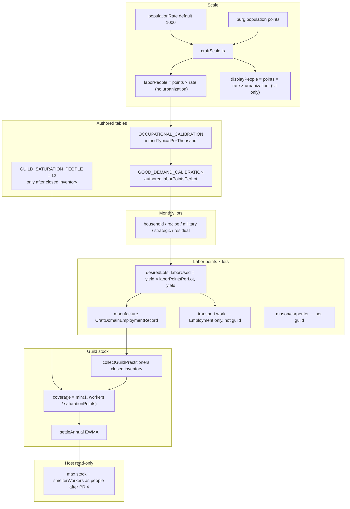

# ギルド財の史実較正: 需要・労働粒度・表示人口スケール

| 項目 | 内容 |
| :--- | :--- |
| **Status** | Draft — PR 1–2 implemented (tables + Overview; market residual/representative recipe behind applyCalibration, default false) |
| **Author** | — |
| **Date** | 2026-08-19 |
| **Revised** | 2026-08-19（第4稿: smelterWorkers 人換算は旧トン閾値を保存、Phase 2 停止条件、未マップ財の lots フォールバック、0.50 cap の適用範囲） |
| **Owner** | Economy 拡張（`src/extensions/economy/`） |
| **Depends on** | [knowledge-guild-system.md](./knowledge-guild-system.md)（実装済み）、[urban-employment-demand.md](./urban-employment-demand.md)（実装済み）、[urban-housing-system.md](./urban-housing-system.md) / [urban-construction-industry.md](./urban-construction-industry.md)（mason/carpenter 分離は維持）、[goods-unit-scale.md](./goods-unit-scale.md)、[guild-city-bases.md](./guild-city-bases.md) |
| **Unblocks** | [steam-engine-knowledge-accumulation.md](./steam-engine-knowledge-accumulation.md)、`mechanicalWorkshops` / `oceanGoingHulls` / `rotarySteamPower` 以降の技術ゲート。本設計は蒸気パッチではない。 |

**参照フィクスチャ（テストと表の共通前提。典型都市の保証値ではない）:** 表示 9000 人、`burg.population = 9`、`populationRate = 1000`、`urbanization = 1`、内陸、非港、Generic、市場あり。人口ポイントの出処は `burgs-generator.ts` の `definePopulation`。レートの出処は `optionsState.ts` 既定 1000 と `main.ts` の `Object.assign`。`worldContext.populationRate` の初期 1 はプレースホルダであり `burg.population` ではない。

---

## Overview

表示人口、`burg.population` ポイント、クラフト Workers、`GUILD_SATURATION_WORKERS`、建設雇用、`runWorkerLoop` の 1 ステップ粒度が、互いに矛盾した単位で動いている。参照フィクスチャでは Guild Overview の Woodworking Workers `1` は 1000 人、`GUILD_SATURATION_WORKERS = 6` はコメント上「一手の親方」だが実装では 6000 人で飽和する。その結果、樽・縄・矢の労働は史実の 10–40 人帯を表現できず、ギルド `stock` は後続技術ゲートに届かない。

本設計は **史実職業比率を単一の較正テーブルとして Economy 拡張に置き、そこから財需要・労働粒度・ギルド飽和を導く**。ハウジング文化は `housingRecipes.ts` の mason/carpenter 分割に残す。ギルド木工の **製造財** は Barrels / Ropes / Arrows に限定する。荷車・Wagon・川舟の工作は木工ギルド実践者から外す（Key Decision 10 / §2.0 P2）。蒸気ゲートの数値いじりや、建設大工の木工ギルドへの合流は行わない。

**飽和定数を 12 人へ下げるのは、`collectGuildPractitioners()` に入るすべての入力が人軸へ揃った同一 PR の中だけである。** 片方だけ動かすと、製錬 BASE 0.5 ポイントや座席 +1 ポイントが coverage=1 を作り、後続科学が誤って「届いた」ことになる。

---

## Background & Motivation

### 単位の食い違い（蒸気が止まった直接原因）

| 量 | 単位 | 参照フィクスチャ | 出典 |
| :--- | :--- | ---: | :--- |
| 表示人口（UI センサス） | `burg.population × populationRate × urbanization` | 9000 人 | `optionsState.ts`（`populationRate: 1000`, `urbanization: 1`）、`main.ts` 349–360、`textileDemand.ts` `actualUrbanPopulation()`、`foodProcessingLedger.ts` `getBurgPeople()` |
| `burg.population` | 人口ポイント | 例: 9（フィクスチャ） | `burgs-generator.ts` `definePopulation`。セル適性から決まる。レート初期値とは無関係 |
| 労働プール | `burg.population` ポイント（urbanization なし） | 9 | `production-generator.ts` `state.population` |
| Guild Workers | 人口ポイント | Woodworking `1` ≈ 1000 人 | `guild-overview.ts`、`BurgEditorGuildsTab.tsx` |
| `GUILD_SATURATION_WORKERS` | 人口ポイント | 6 ≈ 6000 人 | `guildKnowledge.ts`。コメントは "a handful of master craftspeople" |
| ギルド coverage | `min(1, workers / 6)` | Workers=1 なら 0.167 | `GuildKnowledgeModule.settleAnnual()` |
| `runWorkerLoop` 1 ステップ | 労働と収率が同一 | `workerFraction` ロット = `workerFraction` ポイント | `executeManufacture`: `actualYield = min(workerFraction, maxYield)` |
| 建設 `CONSTRUCTION_WORKERS_BASE` | 人口ポイント | 最低 1 = 1000 人 | `constructionEmployment.ts` |
| 衣類ロット | 実人数 / 1000 | 既に人スケール | `textileDemand.ts` `PEOPLE_PER_TEXTILE_MARKET_LOT = 1_000` |

`technologyDevelopmentSpeed` は EWMA 年数を圧縮するだけで coverage 上限は上げられない。`technologyRequirementEase` はゲートを割るプレイヤ回避策であり、世界側の修正ではない。

### 木工が 1 Workers で終わる本当の理由

textiles が「人スケールの衣類需要で多ステップ消費する」からではない。参照フィクスチャの衣類は `9000 / 1000 / 4 / 12 ≈ 0.1875` ロット/月であり、`getGarmentProductionHeadroom` がその上限を掛ける。textiles が勝つのは `getDemandFocus()` が未充足カテゴリの **先頭 1 つ** だけをブーストし、Phase 2 が利益順の勝者総取りだからである（`production-generator.ts` 1237–1250, 799–831）。

Barrels が負ける理由は次の 3 点:

1. `demandCoverage.utilities` が約 14 品で割られる。
2. Wine / Beer の `demandCoverage` が空のため、`collectIndustrialDemand()` は世帯台帳の `Barrels: 0.08` シンクを見ない。
3. 1.0 ポイント/ロットだと 9.36 ロットは町の全労働に近い。

Phase 1 は保存食とその材料（Barrels を含む）に `CELL_FOOD_PRESERVATION_LABOR_SHARE = 0.15`（人口ポイントの 15%）の先取を既に与えている。一部の樽が既に作られるのはこのため。較正後のバッチ 1 決定は、この 15% キャップ（参照フィクスチャで 1.35 ポイント）の内側に `lots × laborPointsPerLot ≈ 0.010` を収める。Phase 1 が較正済み樽ロットを先に埋め、Phase 2 は残ヘッドルームだけを見る（二重製造しない）。

`CRAFT_DOMAIN_BY_GOOD_NAME` の woodworking 製造財は Barrels / Ropes / Arrows のみ。建設 `carpenterWorkers` は別プール。荷車工作は別入力（Key Decision 10 / §2.0 P2）。

### 技術ゲートが stock を読めない

`technologyProgress.ts` は Economy の `guildKnowledgeStocks` を State 内 max で読み、`signals.woodworking` 等にする。加えて `smelterWorkers` は `smelter.workers` の生合計（ポイント）である。ホストは労働を作らない。

`mechanicalWorkshops` は woodworking 0.15 / 0.30 / 0.45。Workers=1 の coverage 0.167 では `known` すれすれ。飽和だけ 0.012 にすると、未換算のポイント源が他ドメインを即 saturation する（§2.0）。

### 既にある史実入力（完全ではない。出発点）

- Laumonier, Montpellier 1435–46: 約 2200 世帯、職業判明約 2/3。fustiers（住居・家具・薪の広義大工）は判明職業の 6%、世帯主 81 人、都市 < 20k。靴屋約 4%。https://www.medievalists.net/2026/04/common-jobs-medieval-city/
- Dyer 2025 / Leach 2017: York 1300–1534 自由市民登録 355 carpenters vs 156 masons。London 1477 Carpenters' Company 106 人、London 約 40–50k。Company は親方のみ。
- ハウジング文化は `BASE_HOUSING_RECIPE_BY_CULTURE`。mason シェア = stone+brick。
- ゲーム木工 **製造財** のみの目標帯: 人口の 0.1–0.5%、参照フィクスチャで 10–40 人。

---

## Goals & Non-Goals

### Goals

1. スケールの単一ソース。飽和とループ粒度は同じ軸で同時に動かす。
2. 職業較正テーブル（8 ドメイン + 建設 2 プール + trade / mining / smelting / administration）。各行に貼り付け可能な `inlandTypicalPerThousand`。
3. 財別需要較正。v1 は全ギルドマップ財に数値行を置く。`laborPointsPerLot` は著者定数（診断の expected は外れうる）。
4. 型付き較正モジュール + Tools 診断。巨大 options ダンプは作らない。v1 に強度スライダは置かない。
5. 後続技術の土台。ゲート監査は、全実践者入力が人軸になったあとの依存 PR。

### Non-Goals

- 建設 carpenter を woodworking ギルドへ合流させない。
- 家石工を masonry ギルドへ、石灰経路が石造都市限定になる形では合流させない。
- `populationRate` 既定 1000 の即時廃止。
- 経済の人単位全面リライト。
- 本タスクでの実装。
- 新規 `window.*`、`any`。
- 荷車・Wagon・川舟を木工ギルド実践者に足すこと（Key Decision 10。雇用 Overview には残す）。

---

## Key Decisions

1. **人口ポイントは内部会計単位のまま。換算は `craftScale.ts`。** 既定レート 1000 は維持する。
2. **ギルド飽和は人で定義する（12 人）。適用は実践者台帳が閉じた同一 PR のみ。** 単源 coverage **≤ 0.50** はサイト班・座席・工房・病院・extras にだけ適用する。著者の製造労働（P1）はキャップしない（樽 0.83、木工 typical 19.8 人で coverage 1 は意図どおり）。サイト全従業員を知識に足さない。
3. **労働ポイントとロット収率は別量である。** `executeManufacture` はロットを出し、消費労働は `actualYield × laborPointsPerLot`。1.0 キャップは製造収率に使わない。
4. **`laborPointsPerLot` は著者定数（方針 A）。** 職業 typical は診断ターゲットであり、生産が需要を満たしても ratio は 1 に恒等しない。実行時に `points* / lots` で解かない。
5. **需要の正本は較正行。`demandCoverage` は残余のみ。** `targetUnits` を較正ロットに替えるのは、収率/労働分離と同一 PR（PR 3）。
6. **建設 carpenter/mason はテーブルに載せるがギルド実践者には入れない。**
7. **オーサリングは TypeScript テーブル。v1 に `craftLaborIntensityScale` スライダは置かない。** 診断 JSON で足りる。v2。
8. **ホスト技術グラフは stock / 労働者シグナルを読むだけ。** PR 4 は (a) 0–1 **stock**（`administration` を含む）を人に変換しない、(b) 生の合計である `smelterWorkers` だけ人単位へ直す。PR 3 のフラグ既定は **false**。
9. **職業「都市住民」v1 は `points × populationRate`（住宅 K18 と同じ。urbanization なし）。** 労働プールが urbanization を掛けないため。UI の Display people 列はセンサス（urbanization 込み）を別表示する。
10. **荷車工作はギルド木工から外す。** `collectGuildPractitioners` に足さない。工作容量は coopers の 25% ではなく、専用の人スケール枠（§2.0 P2 / Issue 26）。
11. **建設の資材ロットは旧ポイント式のまま（どの規模でも不変）。雇用・hire board・laborFactor だけ人スケール。** `pointsToPeople(required) * 1.0 lot/人年` を全 required に掛けない。

---

## Proposed Design

### パイプライン



---

### 1. スケール — `craftScale.ts`

純関数。`economyContext` 非依存。

```ts
export const DEFAULT_PEOPLE_PER_POPULATION_POINT = 1000;

/** Census shown in UI. Not the occupational labor base. */
export function displayPeople(
  populationPoints: number,
  populationRate: number,
  urbanization: number
): number {
  return Math.max(0, populationPoints) * Math.max(1, populationRate) * Math.max(0, urbanization);
}

/** Occupational / housing-aligned urban people (K18 — no urbanization). */
export function laborPeople(populationPoints: number, populationRate: number): number {
  return Math.max(0, populationPoints) * Math.max(1, populationRate);
}

export function peopleToPoints(people: number, populationRate: number): number {
  return Math.max(0, people) / Math.max(1, populationRate);
}

export function pointsToPeople(points: number, populationRate: number): number {
  return Math.max(0, points) * Math.max(1, populationRate);
}

export const GUILD_SATURATION_PEOPLE = 12;

export function guildSaturationPoints(populationRate: number): number {
  return Math.max(peopleToPoints(GUILD_SATURATION_PEOPLE, populationRate), 1e-9);
}
```

ゼロレートガードはすべて `Math.max(1, populationRate)`。`ACADEMY_SATURATION_WORKERS = 8` は §1 だけでは変えない。行政 Employment 人化・`ACADEMY_ADMIN_KNOWLEDGE_CAP_PEOPLE = 8`・`ACADEMY_SATURATION_PEOPLE = 16` は同一 PR 3（§2.0）。

| 呼び出し | 現行 | 本設計 |
| :--- | :--- | :--- |
| 職業 expected | （なし） | `laborPeople`（urbanization なし） |
| UI Display people | まちまち | `displayPeople`（urbanization 込み） |
| 住宅 `getUrbanPeople` | `points × rate` | 変更しない |
| 生産プール | `burg.population` | 変更しない |
| `RESIDUE_GUILD_SATURATION_WORKERS` | 手コピー 6 | 較正済みドメインは `guildSaturationPoints()`。未適用中は 6 のまま |

---

### 2.0 実践者入力の閉鎖台帳（飽和変更の前提）

`coverage = min(1, workers / saturationPoints)` に入る **すべて**。新飽和をマージする前に各行を人軸へ変換する。

**数値制約（テスト可能）:** サイト班・座席・工房・病院・extras の単一の源 S について `pointsToPeople(S) / SATURATION_PEOPLE ≤ 0.50`。**製造ループ（P1）と著者較正労働には適用しない。** `CraftDomainEmploymentRecord` に `SITE_KNOWLEDGE_CAP` を掛けない（掛けると woodworking が 0.50 で止まり `oceanGoingHulls` 0.55 に届かない）。サイトの全従業員を知識 coverage に足さない。Employment Overview は実人数、ギルド/アカデミーのサイト入力は `min(employmentPeople, SITE_KNOWLEDGE_CAP_PEOPLE)`。

| 定数 | 値 | coverage 単源 |
| :--- | ---: | ---: |
| `GUILD_SATURATION_PEOPLE` | 12 | — |
| `ACADEMY_SATURATION_PEOPLE` | 16 | — |
| `GUILD_SITE_KNOWLEDGE_CAP_PEOPLE` | **6** | 6/12 = **0.50**（製錬サイト） |
| `ACADEMY_ADMIN_KNOWLEDGE_CAP_PEOPLE` | **8** | 8/16 = **0.50** |
| 工房 `researchers` | **2 人** | 2/16 = 0.125 |
| 薬種商 `practitioners` | **2 人** | 2/16 = 0.125 |
| 病院 trial / service | **3 / 6 人** | 0.188 / 0.375 |
| 座席 extra | 1–3 人 | ≤ 3/12 = 0.25 |
| ギルド instruments upsert | 2–3 人 | ≤ 0.25 |

同一 Burg の medicine = 薬種商 2 + 病院 6 = 8/16 = 0.50（`occupied` で病院は Burg あたり 1）。これも ≤ 0.50。

| ID | 源 | ファイル | 現行 | 変換 | 単源 coverage | テスト |
| :--- | :--- | :--- | :--- | :--- | ---: | :--- |
| P1 | `runWorkerLoop` 製造 | `production-generator.ts` | 1.0 pt/lot | `laborUsed = yield × laborPointsPerLot`。**0.50 cap 対象外** | 樽 0.010/0.012 ≈ **0.83（意図どおり）**。木工 typical 19.8 人なら coverage 1 | 9.36 lot × 0.00106 ≈ 0.0099 pt、収率 9.36。製造労働にサイト cap を掛けない |
| P2 | Transport work | `transportAssetOrders.ts` | 4–8 pt が woodworking ギルドへ。容量は観測 woodworking の 25% | **ギルドから除外**。`requiredWorkPoints` は人（cart 4、wagon 8、barge 6）。容量は専用 `TRANSPORT_CRAFT_PEOPLE_PER_THOUSAND = 1.5`（coopers ではない） | 0（ギルドに入らない） | cart が `collectGuildPractitioners` に無い。9000 人フィクスチャで wagon 1 両が完成する |
| P3 | `SmelterOperation.workers` | `smelterOperations.ts` | BASE 0.5 + tons×0.0025 が **全額** ギルドへ | Employment: BASE **8 人** + 2.5 人/年トン。ギルド冶金: `min(employment, 6 人)` | **0.50**（900 トン炉でも 6/12） | 稼働 BASE 製錬だけで metallurgy coverage ≤ 0.50。フル炉でも ≤ 0.50 |
| P4 | `MineOperation.workers` | `mineOperations.ts` | 4 + richness×6 | Employment: BASE 40 人 + richness×80 人。ギルドには足さない | 0 | 雇用 Overview が 1 万人にならない |
| P5 | `AdministrationEmploymentRecord` | `administrationEmployment.ts` → academy `administration` | BASE 4 pt + pop×0.005 + burgs×1 **全額** がアカデミーへ | Employment: BASE **8 人** + Burg あたり **2 人** + `pointsToPeople(statePopPoints × 0.005)`。アカデミー: `min(employment, 8 人)` | **0.50** | 1 Burg 首都の administration coverage ≤ 0.50 |
| P6 | engineering extra 1–3 | `technologyBiasApply.ts` | 1–3 pt | 1–3 人 | ≤ 0.25 | 座席 1 人ではギルド飽和に届かない |
| P7 | `mineLaborer` +1 | `technologyBiasApply.ts` | +1 pt | +1 人 | 0.08 | 同上 |
| P8 | residue extras | `technologyBiasApply.ts` | `stock × 6` pt | 較正済みドメインは `stock × saturationPoints`（最大 12 人）。**プレイヤーバイアスの既存仕様**（stock=1 で飽和可） | ≤ 1.0（意図的） | extra ≤ saturationPoints |
| P9 | `upsertInstruments(RESEARCHERS)` | `experimentalWorkshops.ts` | 2–3 pt → ギルド instruments | 2–3 **人** | ≤ 0.25 | 工房ギルド instruments coverage ≤ 0.25 |
| P10 | 建設 named seat | `constructionHire.ts` | +1 pt | `peopleToPoints(1)` | （建設、ギルド外） | 1 座席は 8 人 BASE を満員にしない |
| P11 | `MIN_TRACKED_WORKERS` | `craftEmployment.ts` | 0.01 pt | 床 0.5 人、`rn(next, 6)` | — | 3 人木工が残り coverage 0.25 |
| **P12** | `ExperimentalWorkshop.researchers` | `experimentalWorkshops.ts` → academy **naturalPhilosophy**（`academyKnowledge.ts` 107–108）。P9 とは別経路 | 2 pt | **2 人** | 2/16 = **0.125** | 工房だけで naturalPhilosophy coverage ≤ 0.125 |
| **P13** | `ApothecaryWorkshop.practitioners` | `apothecaryWorkshops.ts` `PRACTITIONERS = 2` → academy **medicine** | 2 pt | **2 人** | **0.125** | 薬種商だけで medicine coverage ≤ 0.125 |
| **P14** | `HospitalInstallation.practitioners` | `hospitalInstallations.ts` trial 3 / service 6 → academy **medicine** | 3 / 6 pt | **3 / 6 人** | 0.188 / 0.375 | 病院だけで medicine ≤ 0.375。薬種商+病院 ≤ 0.50 |

`collectGuildPractitioners()` 変更後:

```
min(peopleToPoints(smelterEmploymentPeople), peopleToPoints(6))  // metallurgy SITE only; cap 6
+ manufacture-only CraftDomainEmploymentRecord                  // NOT capped; may exceed 0.50
+ extraWorkers (people-scaled)                                  // seats/residue; extras ≤ 0.50 except residue-at-1
```

`AcademyKnowledge.collectPractitioners()` 変更後:

```
administration: min(adminEmploymentPeople, 8)
medicine:       apothecary 2 + hospital 3|6   // already ≤ 8 combined
naturalPhilosophy: workshop.researchers 2
+ extraWorkers scholarly (people-scaled)
```

transport は `getTransportCraftCapacity(burgId) = peopleToPoints(laborPeople × 1.5 / 1000)`。`planCraftWork` は `CraftDomainEmploymentRecord` の 25% を読まない。9000 人 → 13.5 人容量。wagon 8 人は完成可能。

アカデミー飽和 16 人と行政 Employment 人化は **同じ PR**。知識キャップなしに Employment 全数をアカデミーへ足すことは禁止（BASE 8 人でも州人口項で数千人になる）。

---

### 2. 職業較正テーブル — `occupationalCalibration.ts`

`inlandTypicalPerThousand` は **都市労働住民 1000 人あたりの従事者**。参照フィクスチャ人 = `9000 × inlandTypicalPerThousand / 1000`。`inlandTypical: 20` を 9000 人列からコピーしてはいけない。

#### 2.1 ギルド 8 ドメイン（製造のみ）

| pool | min | max | **inlandTypicalPerThousand** | 参照フィクスチャ人 | 期待 pt | 財 |
| :--- | ---: | ---: | ---: | ---: | ---: | :--- |
| `woodworking` | 1.0 | 5.0 | **2.2** | 19.8 | 0.0198 | Barrels, Ropes, Arrows |
| `textiles` | 15 | 40 | **27** | 243 | 0.243 | Cloth, Garments, Sails |
| `leather` | 20 | 40 | **30** | 270 | 0.270 | Leather, Boots |
| `metallurgy` | 8 | 20 | **12** | 108 | 0.108 | Bronze, Tools, Arms, Bullets, Harnesses（+製錬はサイト加算） |
| `masonry` | 1 | 3 | **2.0** | 18 | 0.018 | Lime, Roman Concrete |
| `glassware` | 8 | 20 | **12** | 108 | 0.108 | Ceramics, Glass, Lab Glassware |
| `printing` | 1 | 5 | **2.5** | 22.5 | 0.0225 | Paper, Ink, Books |
| `instruments` | 0.5 | 2 | **1.0** | 9 | 0.009 | Liquor（暫定マップ） |

フィクスチャテスト: Generic 内陸 9000、rate 1000 → woodworking expected people ∈ [10, 40]、points ∈ [0.010, 0.040]。

港: `modifiers.port = 2` は woodworking のみ（縄）。2.2 → 4.4 人/1000 → 39.6 人。

#### 2.2 建設（ギルドに入れない）

`constructionTotalPerThousand = 22`。`cultureWoodShare: true` のとき:

```text
carpenterPeople = laborPeople × 22/1000 × housingRecipe.wood
masonPeople     = laborPeople × 22/1000 × (stone + brick)
```

Generic（wood 0.45）: carpenter 89.1 人 (0.089 pt)、mason 108.9 人 (0.109 pt)。Highland wood 0.25: carpenter 49.5、mason 148.5。Hunting wood 0.70: carpenter 138.6、mason 59.4。

現行 BASE 1 pt は参照フィクスチャで 1000 人（11%）。雇用の新 BASE は **8 人**。バックログ項 `effectiveBacklog × adults × 0.05` は成人 **ポイント** のまま（50 adult-point 首都で extra ≈ 0.29 pt ≈ 294 人）。

**資材と雇用は別式（Key Decision 11）。** `masonLoad = pointsToPeople(required) * 1.0` を全 required に掛けると、バックログ 0.29 pt が 294 石ロットになり市場が壊れる。

```text
# Materials and dwelling progress — UNCHANGED point formula at every size
requiredPoints = 1 + effectiveBacklog × adultsPoints × 0.05
masonLoad      = requiredPoints × masonShare × STONE_PER_MASON_WORKER_ANNUAL     // still 8 lots/point
woodNeed       = requiredPoints × (1 − masonShare) × WOOD_PER_CARPENTER_WORKER_ANNUAL  // still 10
laborFactor    uses people-scaled assigned / people-scaled required (below)
materialFactor from masonLoad / woodNeed as today
deltaDwellings = requiredDwellings × housingBacklog × 0.25 × min(laborFactor, materialFactor) / 12

# Employment, hire board, named seats — people
requiredPeople = 8 + pointsToPeople(effectiveBacklog × adultsPoints × 0.05)
laborFactor    = assignedPeople / requiredPeople
namedSeat      = 1 person = peopleToPoints(1)
```

フィクスチャ:

| Burg | adults pt | 石ロット/年 (Generic 0.55) | 雇用人 | hire |
| :--- | ---: | ---: | ---: | :--- |
| 9-point 空町（backlog≈0） | ~5 | **≈ 4.4**（旧式） | **8** | demand 8 人 > floor 3 人 → 少なくとも 1 人分の posting |
| 50-point 首都、backlog 1、sizeTarget≈0.117 | 50 | **≈ 5.7**（旧式 1.29×0.55×8） | 8+294=**302** | 302 人需要、MIN=1 人、MAX=12 人。座席 1 人では埋まらない |

`constructionJobPostings.ts` / `constructionHire.ts`（PR 3）:

```text
DEMAND_FLOOR_FOR_POSTINGS = peopleToPoints(3)     // was 1.5 points
CONSTRUCTION_MIN_POSTINGS = peopleToPoints(1)     // was 1 point
CONSTRUCTION_MAX_POSTINGS = peopleToPoints(12)    // was 12 points
```

`openSeats` は人スケールの demand から計算する。マクロ reconcile の `macroTarget` も people-scaled required に合わせる（さもないと 1.5 pt 床で posting が永久に出ない）。

#### 2.3 その他

| pool | inlandTypicalPerThousand | 備考 |
| :--- | ---: | :--- |
| `administration` | 15（首都のみ。`modifiers.capital`） | Employment はサイト型（P5）。アカデミー知識は cap 8 人 |
| `mining` | 0（サイト） | BASE 40 人 + richness×80 人 |
| `smelting` | 0（サイト） | Employment: BASE 8 人 + 2.5 人/年トン。ギルド: cap 6 人 |
| `trade` | 80（Market 中心） | 既存 caravan 式。診断のみ |
| `service` | （乗数 1.5） | 入力が直れば追従 |

#### 2.4 型

```ts
export interface OccupationalCalibrationRow {
  pool: OccupationalPool;
  peoplePerThousandUrban: {
    min: number;
    max: number;
    inlandTypicalPerThousand: number;
  };
  modifiers?: {
    port?: number;
    capital?: number;
    hasQuarry?: number;
    cultureWoodShare?: boolean;
  };
  goodNames: readonly string[];
  guildDomain: CraftKnowledgeDomain | null;
  sources: readonly string[];
}

export function expectedWorkerPoints(args: {
  row: OccupationalCalibrationRow;
  laborPeople: number;
  populationRate: number;
  port: boolean;
  capital: boolean;
  hasQuarry: boolean;
  housingRecipe?: HousingRecipe;
}): number {
  const perK = args.row.peoplePerThousandUrban.inlandTypicalPerThousand;
  let people = (args.laborPeople / 1000) * perK;
  if (args.port && args.row.modifiers?.port) people *= args.row.modifiers.port;
  if (args.capital && args.row.modifiers?.capital) people *= args.row.modifiers.capital;
  if (args.hasQuarry && args.row.modifiers?.hasQuarry) people *= args.row.modifiers.hasQuarry;
  if (args.row.modifiers?.cultureWoodShare && args.housingRecipe) {
    const totalPerK = perK; // construction rows store the pool's own typical; see §2.2 split
    const total = (args.laborPeople / 1000) * 22;
    if (args.row.pool === "constructionCarpenter") people = total * args.housingRecipe.wood;
    if (args.row.pool === "constructionMason") {
      people = total * (args.housingRecipe.stone + args.housingRecipe.brick);
    }
  }
  if (args.row.modifiers?.capital && !args.capital && args.row.pool === "administration") people = 0;
  return peopleToPoints(people, args.populationRate);
}
```

建設 2 行は `inlandTypicalPerThousand` を診断バンド用に carpenter 10 / mason 12 と書き、`cultureWoodShare` 時は合計 22 をレシピで割る（上式）。`expectedWorkerPoints` は advertised 修飾子をすべて実装する。

---

### 3. 財別需要較正 — 方針 A（著者 `laborPointsPerLot`）

職業 typical は **外れうる診断**。均衡式は解かない。

```text
lots_g     = Σ provenance_p(g, burg, market, ledgers)
labor*_g   = lots_g × laborPointsPerLot_g     // 予測。actual はループ結果
expected_d = expectedWorkerPoints(domain)
ratio_d    = actualWorkers_d / expected_d     // 需要充足でも 1 とは限らない
```

```text
laborPointsForLots(good, lots, populationRate) =
  laborPointsPerLotAtDefaultRate
  × (DEFAULT_PEOPLE_PER_POPULATION_POINT / max(1, populationRate))
  × 1                          // v1: no intensity slider
```

§3.2 の「balancer solves laborPointsPerLot」は削除する。木工内陸シェアは著者定数: Barrels 0.50 / Ropes 0.30 / Arrows 0.20。港: 0.30 / 0.50 / 0.20。

樽の著者値は **シェア 0.50 を掛けたあと**:

```text
barrel people typical = 19.8 × 0.50 = 9.9
urban ale lots        = 9000 × 0.65 × 48 / 12 / 200 = 117
barrel lots           = 117 × 0.08 = 9.36     // 都市分。後背地は別加算
laborPointsPerLotAtDefaultRate = 9.9 / 9.36 / 1000 = 0.001058 ≈ 0.00106
people per lot        = 1.06
```

（初稿の 20/9.36=2.1 はシェア未適用のため捨てる。）

#### 3.1 Provenance と関数引数

`craftDemandCalibration.ts` はロット計算で `economyContext` を読んでよい（純でない）。`craftScale.ts` とテーブル定数だけが純関数。

```ts
export type DemandProvenanceKind =
  | "householdPerCapita"
  | "recipeDerived"
  | "militaryLedger"
  | "strategicOrder"
  | "categoryResidual";

export function getCalibratedMonthlyLots(args: {
  good: Good;
  burg: Burg;
  market: Market;
  laborPeopleBurg: number;
  laborPeopleMarketUrban: number;
  laborPeopleMarketRural: number;
  populationRate: number;
  port: boolean;
  shipbuildingEnabled: boolean;
  militaryAnnualDemand: Partial<Record<string, number>>; // goodName → lots/year at state, already burg-attributed
  strategicOutstanding: Partial<Record<string, number>>; // goodName → lots this cycle
  foodFillingsThisMonth: { wine: number; beer: number; cider: number; perry: number; pomaceWine: number; liquorBarrel: number };
}): number;
```

**後背地帰属（樽・ビール系）:** `foodProcessingLedger` の充填は市場（都市+農村）。

```text
urbanShare_b = laborPeopleBurg / max(laborPeopleMarketUrban, ε)
ruralBarrels = laborPeopleMarketRural × ALE_TARGETS... / 12 / 200 × 0.08
burgBarrels  = (marketUrbanBeerLots × 0.08) × urbanShare_b
             + (burg が market.centerBurgId なら ruralBarrels else 0)
             + 同様に wine/cider/perry/pomaceWine
             + liquorBarrel fillings × 0.5（返却率が低いレシピ）
```

**造船オフ:** `strategicOrder` を 0 とみなし、Ropes/Sails は inland `householdPerCapita` のみ。Economy は `shipClasses.ts` を import しない。既存の `fmg:shipbuilding-*` / `getStrategicProcurementOrders()` を読む。

#### 3.2 v1 `GOOD_DEMAND_CALIBRATION`（参照フィクスチャで閉じる）

`laborPointsPerLotAtDefaultRate` は「フィクスチャ expected people × domainShare / フィクスチャ lots」。lots が 0 に近い財は floor lots を置き、labor が発散しないようにする。

**Woodworking**（expected 19.8 人）

| goodName | share I/P | provenances | フィクスチャ lots/月 | laborPt/lot @1000 | residualWeight |
| :--- | :--- | :--- | ---: | ---: | ---: |
| Barrels | 0.50 / 0.30 | recipeDerived: 上記 cask fillings | 9.36 urban ale のみ（後背地は実行時加算） | **0.00106** | 0（`demandCoverage` 空） |
| Ropes | 0.30 / 0.50 | household 0.002 coil/人/年; port は +strategicOrder | 9000×0.002/12=1.5 | 5.94/1.5/1000=**0.00396** | 0 |
| Arrows | 0.20 / 0.20 | militaryLedger; hunting residual | 平時 hunting ≈ 0.8（下記） | 3.96/0.8/1000=**0.00495** | hunting 0.5。**military coverage 0**（台帳が正本） |

Arrows 平時 hunting: `DEMAND_TARGET_FACTORS.hunting` 0.05 × 9 pt × (0.5 / 狩猟カバレッジ合計)。狩猟合計を仮に 1.0（Arrows 0.5 + Bullets 0.4 等）とすると 9×0.05×0.5 ≈ 0.225 では少ない。v1 は **authored peacetime 0.8 lot/月**（fletcher 約 4 人が月 0.8 quiver）を `householdPerCapita` 0.8×12/9000 ≈ 0.00107 quiver/人/年として書く。軍需は加算。`ARCHER_ARROWS_PER_HEAD = 0.05` は年次。弓兵 200 の国家は +10/12 ≈ 0.83 lot/月を供給市場の弓生産 Burg へ。帰属: その State の woodworking 実践者がいる供給市場の中心 Burg。無ければ首都。

**Textiles**（243 人。Cloth 0.20 / Garments 0.75 / Sails 0.05 内陸。港 Sails 0.25 / Garments 0.60 / Cloth 0.15）

| goodName | share I | provenances | フィクスチャ lots/月 | laborPt/lot |
| :--- | :--- | :--- | ---: | ---: |
| Garments | 0.75 | 既存 `textileDemand`（`people/1000/4/12`、気候倍率） | 0.1875 | 182.25/0.1875/1000=**0.972** |
| Cloth | 0.20 | recipeDerived: Garments×1 + Sails×1（代表レシピ index 0） | 0.1875 | 48.6/0.1875/1000=**0.259** |
| Sails | 0.05 | strategicOrder; 内陸 floor 0.05 lot | 0.05 | 12.15/0.05/1000=**0.243** |

Garments の `demandCoverage.clothing = 1` は維持（textile 台帳が既に人ベース）。Cloth は coverage 空のまま。Sails の `military: 1` は 0 にし、造船注文を正本にする。

**Leather**（270 人。Leather 0.30 / Boots 0.70）

| goodName | share | provenances | lots/月 | laborPt/lot |
| :--- | :--- | :--- | ---: | ---: |
| Boots | 0.70 | household: 0.25 pair/人/年 ÷ `itemsPerUnit` 20 | 9000×0.25/20/12=9.375 | 189/9.375/1000=**0.0202** |
| Leather | 0.30 | recipeDerived: Boots×1 + Harnesses 派生 | 9.375 | 81/9.375/1000=**0.00864** |

Boots `utilities: 1` は 0。`itemsPerUnit` は `goodsUnitFlavor.ts` の 20（表示用だがロット換算に使うことをここに固定する）。

**Metallurgy**（108 人鍛冶。製錬はサイト）。Tools 0.35 / Arms 0.25 / Harnesses 0.15 / Bullets 0.15 / Bronze 0.10

| goodName | share | provenances | floor lots/月 | laborPt/lot |
| :--- | :--- | :--- | ---: | ---: |
| Tools | 0.35 | household 0.02 set/人/年（更新） | 9000×0.02/12=15 | 37.8/15/1000=**0.00252** |
| Arms | 0.25 | militaryLedger `ARMS_PER_HEAD` 0.01/年 | 平時 floor 0.4 | 27/0.4/1000=**0.0675** |
| Harnesses | 0.15 | military mounted + utilities 残余 0 | 0.3 | 16.2/0.3/1000=**0.054** |
| Bullets | 0.15 | militaryLedger; hunting 0.4 は残す | 0.3 | 16.2/0.3/1000=**0.054** |
| Bronze | 0.10 | recipeDerived from Tools/Arms bronze レシピ | 2.0 | 10.8/2/1000=**0.0054** |

Tools `utilities: 1` は 0（per-capita へ）。Arms/Harnesses の `military` coverage は 0（台帳正本）。Bullets hunting 0.4 は残す。Bronze coverage 空。

**Masonry**（18 人。Lime 0.45 / Roman Concrete 0.55）

| goodName | share | provenances | lots/月 | laborPt/lot |
| :--- | :--- | :--- | ---: | ---: |
| Roman Concrete | 0.55 | 建設オペの石代替消費（既存 produceMonth） | フィクスチャ ~0.2 | 9.9/0.2/1000=**0.0495** |
| Lime | 0.45 | recipeDerived: Concrete×1 | 0.2 | 8.1/0.2/1000=**0.0405** |

Lime coverage 空。Roman Concrete `construction` は 0（オペが正本）。家石工労働には入れない。

**Glassware**（108 人。Ceramics 0.70 / Glass 0.25 / Lab Glassware 0.05）

| goodName | share | provenances | lots/月 | laborPt/lot |
| :--- | :--- | :--- | ---: | ---: |
| Ceramics | 0.70 | household 0.15 wain/人/年 | 9000×0.15/12=112.5 | 75.6/112.5/1000=**0.000672** |
| Glass | 0.25 | luxury residualWeight 1.0 + Liquor 0.25 派生 | 1.0 | 27/1/1000=**0.027** |
| Lab Glassware | 0.05 | 技術後の工房消費のみ。世帯 0 | floor 0.05（消費 0 なら ratio は外れる） | **0.108**（著者定数。5.4 人 / 0.05 lot / 1000） |

Ceramics `utilities: 1` は 0。Lab coverage 空。

**Printing**（22.5 人。Books 0.60 / Paper 0.25 / Ink 0.15）

| goodName | share | provenances | lots/月 | laborPt/lot |
| :--- | :--- | :--- | ---: | ---: |
| Books | 0.60 | luxury residual + capital×2 | 0.4（首都 0.8） | 13.5/0.4/1000=**0.0338** |
| Paper | 0.25 | recipeDerived Books×1 | 0.4 | 5.625/0.4/1000=**0.0141** |
| Ink | 0.15 | recipeDerived Books×0.5 | 0.2 | 3.375/0.2/1000=**0.0169** |

Books `luxury: 1` は残余として残し `residualWeight` 1。Paper/Ink coverage 空。

**Instruments**（9 人。Liquor 1.00。マップ暫定、`sources: ["provisional"]`）

| goodName | share | provenances | lots/月 | laborPt/lot |
| :--- | :--- | :--- | ---: | ---: |
| Liquor | 1.00 | `annualLotsPerPerson = 0.000333`（vessel リットルは定義しない。`foodLots.ts` に `LITERS_PER_LIQUOR_LOT` は足さない） | 9000 × 0.000333 / 12 = **0.25** | 9/0.25/1000=**0.036** |

Liquor の `unit` は現行どおり `"vessel"`。世帯需要はロット/人を直接書き、容量の逆算を実装者にさせない。instruments マップは v1 暫定行。時計 Good は従属計画。

**未マップ財（Bread / Brick / Salt / Dyes / Cheese 等、較正行が無い recipe 財）:**

```text
laborPointsPerLot = uncalibratedLaborPointsPerLot = 1.0   // 現行と同一の労働恒等
remainingLots[g]  = 現行の getDemandTargets / collectConsumerDemand / collectIndustrialDemand
                    が与える月次ロット（今日 Phase 2 が狙う量と同じ）
cap_g             = +∞（職業テーブルのドメインキャップなし）
```

`getCalibratedMonthlyLots` は較正行が無い財に **0 を返してはいけない**。0 だと Phase 2 から落ち、Brick/Salt/Bread が作られなくなる。較正行がある財だけ著者 provenance を使い、それ以外は現行需要経路のフォールバック。ギルド飽和は未マップ財には付けない。

`collectIndustrialDemand`: 代表レシピは `typicalRecipeIndex`（省略時は最小原料費レシピ）。Beer 4 穀物は 0.08 を 1 回だけ。較正済み中間財が `categoryResidualWeight === 0` なら `collectConsumerDemand` の分母から外す。

#### 3.5 生産ループ — 労働 ≠ 収率

3 量を分離する:

| 量 | 意味 |
| :--- | :--- |
| `desiredLots` | `getCalibratedMonthlyLots` の残り |
| `actualYield` | 原料・資金・ヘッドルームでキャップした **ロット** |
| `laborUsed` | `actualYield × laborPointsPerLot`（ポイント） |

```ts
// production-generator.ts — patched identities (comments in English)

private executeManufacture(
  state: BurgProductionState,
  index: ProductionIndex,
  decision: ProductionDecision,
  laborBudget: number
): { yieldLots: number; laborUsed: number } {
  const laborPerLot = laborPointsForLots(decision.action.good.name, 1, populationRate);
  const desiredLots = laborPerLot > 0 ? laborBudget / laborPerLot : 0;
  let actualYield = Math.min(desiredLots, decision.action.maxYield);
  actualYield = Math.min(actualYield, garmentOrFoodHeadroom(...));
  actualYield = Math.min(actualYield, affordableYieldFromTreasury(...));
  if (actualYield <= 1e-9) return { yieldLots: 0, laborUsed: 0 };
  // consume ingredients scaled by actualYield (lots), not laborBudget
  const produced = actualYield * cultureModifier * guildBonus * laborProductivity * outputMultiplier;
  const laborUsed = actualYield * laborPerLot;
  return { yieldLots: produced, laborUsed };
}

private planGoodAction(..., targetLots: number, stepLots: number, workersLeft: number, ...): GoalActionPlan | null {
  const laborPerLot = laborPointsForLots(good.name, 1, populationRate);
  const workersNeeded = targetLots * laborPerLot; // NOT targetLots
  const immediate = this.buildImmediateManufactureCandidate(
    state, recipe, demandEffect, Math.min(stepLots, targetLots), good.i
  );
  if (immediate && workersNeeded <= workersLeft + 1e-6) { /* ... */ }
  // recursive ingredient plans use lots, not 1:1 workers
}

// makeProductionDecision today: planGoodAction(..., fraction, fraction, workersLeft)
// after: 
const targetLots = remainingCalibratedLots.get(good.i) ?? 0;
const cap = expectedWorkerPoints(domain) * domainShare(good, port);
const laborBudget = Math.min(workersLeft, cap, targetLots * laborPerLot);
planGoodAction(..., targetLots, targetLots, workersLeft, ...);
```

単体テスト（必須）:

```text
9.36 barrel lots × 0.00106 pt/lot → laborUsed ≈ 0.0099 pt
produced lots ≈ 9.36 (ingredient-capped)
NOT produced lots === 0.0099
```

**財別労働キャップ（Risks から昇格）:**

```text
cap_g = expectedWorkerPoints(domain) × domainShare_g
```

バッチ 1 回で樽が木工予算を吸い切らない。

**禁止:** `executeManufacture` / `makeProductionDecision` に `laborBudget = Math.min(1, workersLeft)` を渡す経路。それを残すと `desiredLots = 1 / 0.00106 ≈ 943` 樽（または `1 / 0.0675 ≈ 15` Arms）が 1 ステップで出る。

**Phase 1 / 1b / 2 制御（PR 3）。** `ceil(population)` 回の 1.0 ポイントループは廃止する。各 phase は財あたり高々 1 回のバッチ製造。

```text
remainingLots[g] =
  calibration row ? getCalibratedMonthlyLots(...)
                  : currentDemandLots(g)   // today's consumer+industrial path; never 0 just because unmapped
workersLeft = state.population − reservedTransportWork.total
skipped = ∅
maxIters = productiveGoods.length + 1     // hard cap; replaces ceil(population) 1.0-point steps

function laborBudgetFor(good, phaseCapRemaining):
  laborPerLot = laborPointsForLots(good)          # authored or 1.0 if unmapped
  cap_g = calibration row ? expectedWorkerPoints(domain) × domainShare_g : +∞
  return min(workersLeft, phaseCapRemaining, cap_g, remainingLots[g] × laborPerLot)

function applyManufacture(good, budget, phaseCap):
  { yieldLots, laborUsed } = executeManufacture(..., budget)
  if laborUsed ≤ ε:
    remainingLots[good] = 0                       # (a) skip this good this cycle
    skipped.add(good)
    return phaseCap
  remainingLots[good] -= yieldLots
  workersLeft -= laborUsed
  return phaseCap − laborUsed

# Phase 1 — finite for-list (no hang)
phaseCap = state.population × CELL_FOOD_PRESERVATION_LABOR_SHARE
for good in priorityGoods:
  budget = laborBudgetFor(good, phaseCap)
  if budget ≤ ε: continue
  phaseCap = applyManufacture(good, budget, phaseCap)

# Phase 1b — finite for-list
phaseCap = state.population × STRATEGIC_PRIORITY_LABOR_SHARE
for good in strategicGoods:
  shareCap = phaseCap × goodStrategicWeight / totalWeight
  budget = laborBudgetFor(good, min(phaseCap, shareCap))
  if budget ≤ ε: continue
  phaseCap = applyManufacture(good, budget, phaseCap)

# Phase 2 — must make progress or skip; never spin
iters = 0
while workersLeft > ε and iters < maxIters:
  iters += 1
  decision = makeProductionDecision among remainingLots > 0 and good ∉ skipped
  if !decision: break
  budget = laborBudgetFor(decision.good, workersLeft)
  if budget ≤ ε:
    skipped.add(decision.good)
    continue
  applyManufacture(decision.good, budget, workersLeft)
```

`laborUsed ≈ 0`（原料・資金不足で `executeManufacture` が早期 return）のとき `workersLeft` も `remainingLots` も減らないので、その財を `skipped` にして **continue** する（同一財を無限に選ばない）。`maxIters` は第二の停止条件。Phase 1/1b は有限 `for` なのでハングしないが、同じ skip を使う。

必須テスト:

```text
Phase 1b laborBudget must never be 1.0 when laborPerLot is 0.00495 (Arrows) or 0.0675 (Arms)
9000-person Phase 1 barrel: laborUsed ≈ 0.01 < 1.35 cap
A good that plans positive lots but fails ingredient buy does not hang produceMonth
  (laborUsed = 0 → remainingLots[g] = 0, loop proceeds)
With applyCalibration on, a burg that today makes Brick/Salt still makes them in one batched step
```

---

### 4. 較正機能

#### 4.1 ファイル

| ファイル | 役割 |
| :--- | :--- |
| `generators/craftScale.ts` | 純換算 |
| `generators/occupationalCalibration.ts` | 職業テーブル |
| `generators/craftDemandCalibration.ts` | 財テーブル + lots（context 可） |
| `generators/craftScale.test.ts` / `occupationalCalibration.test.ts` / `craftDemandCalibration.test.ts` | フィクスチャ恒等式（方針 A: labor×lots は expected と近傍、恒等ではない） |
| `store/economyCalibrationState.ts` | Zustand + `localStorage` キー `fmg-economy-calibration` |
| `controllers/calibrationOverview.ts` | 既存 state を読む |
| `ui/dialogs/CalibrationOverviewDialog.tsx` | Tools 表 |
| `index.tsx` | Guild Overview と同型の register/cleanup |

#### 4.2 フラグ

`useEconomyCalibrationState`:

```ts
{
  applyCalibration: boolean; // default false until PR 4
}
```

`applyCalibration === false` が復元するもの:

1. `collectConsumerDemand` の現行分母（全 `demandCoverage`）
2. `collectIndustrialDemand` の全レシピ加算
3. `runWorkerLoop` 1.0 ポイントステップと `actualYield = min(workerFraction, maxYield)`
4. `GUILD_SATURATION_WORKERS = 6` と `RESIDUE_GUILD_SATURATION_WORKERS = 6`
5. 建設 BASE 1、資材 8/10、座席 +1 ポイント
6. 製錬/鉱山/行政の現行 BASE
7. transport を `byDomain` に足す現行と、容量 = 観測 woodworking の 25%
8. `MIN_TRACKED_WORKERS = 0.01`、`rn(next, 3)`
9. `ACADEMY_SATURATION_WORKERS = 8`
10. カタログ `demandCoverage` 手を入れる前の値（PR 2 のカタログ変更はフラグで分岐）

テストフック: ストアを直接 `setState`。ホスト `optionsState` には置かない。

PR 1 の診断はフラグに依存しない。ratio アラート（Far below / Far above）は `applyCalibration && grainConverted` のときだけ。PR 2 期間は lots 列だけ出し、ratio を強調しない。

#### 4.3 UI（英語）

Guild Overview と同じ: `registerDialog` + `registerAction({ tab: "tools", section: "edit", dialogId: "calibrationOverview", onClick: CustomEvent })` + `registerToolAction`。disable で `closeDialog("calibrationOverview")` と `unregisterToolAction`。i18n は `src/i18n/locales/en.json` と `ja.json` の `extensions.calibrationOverview.*`（英語コピー、ja は英語フォールバック可）。

`extensions.guildOverview.workersTip`（`coverage = workers / 6`）と `BurgEditorGuildsTab.tsx` 31 行目の `data-tip` は **PR 3** で更新（世界がまだ 6 の間は PR 1 で触らない）。

列: Burg / State / Domain / Display people / Labor people / Expected people / Expected points / Actual workers pts / Actual people / Ratio / Demand lots / Labor from authored lots / Guild coverage / Stock。下段 Good 内訳（provenance lots、authored laborPt/lot、catalogue coverage）。

永続: マップに焼かない。JSON export は読み取り専用。JSON import は v2。スライダは v2。

#### 4.4 バランサ手順

1. PR 1 で actual を測る。
2. PR 2 で市場残余を見る（ratio は見ない）。
3. PR 3 フラグ on で ratio を見る。lots 過大なら **著者** `laborPointsPerLot` を下げる（実行時に解かない）。
4. coverage が 1 なのに人が多すぎる → typical が過大、またはサイト班の cap 漏れ（P2–P14）。製造労働の 0.83 はバグではない。
5. テーブルをコミット。

---

### 5. 本設計がアンロックするもの

20 人木工製造 → 0.020 pt → saturation 12 人で coverage ≈ 1 → stock。`mechanicalWorkshops.adopted` 0.45 は **製造労働が載れば** 届く。製錬サイト 6 人キャップや荷車では届かせない。

PR 4 までフラグ既定 false。PR 4 は 2 列:

| 列 | シグナル | PR 4 の扱い |
| :--- | :--- | :--- |
| (a) 0–1 **stock** | `woodworking`, `metallurgy`, `masonry`, `glassware`, `printing`, `instruments`, **`administration`**, `naturalPhilosophy`, `medicine` | 労働が人軸になったあと監査するだけ。**`pointsToPeople` しない**（0.45 stock を 450 人にすると全ゲートが通る） |
| (b) 生の人数合計 | **`smelterWorkers` のみ**（`technologyProgress.ts` 549–554 が `smelter.workers` を加算） | ゲート数値は **旧ポイント閾値が意味した年トンを保存**して人へ直す。**8/20/40 人は使わない**（BASE 8 人や ~13 トン炉で adopted が通ってしまう） |

`smelterWorkers` 人換算（旧 `workersPoints = 0.5 + tons × 0.0025`、新 Employment `people = 8 + 2.5 × tons`）:

```text
tons   = (minPoints − 0.5) / 0.0025
people = 8 + 2.5 × tons
       = 1000 × minPoints − 492
```

| 現行 minPoints | 含意トン | PR 4 people min |
| ---: | ---: | ---: |
| 2 | 600 | **1508** |
| 4 | 1400 | **3508** |
| 6 | 2200 | **5508** |
| 8 | 3000 | **7508** |
| 10 | 3800 | **9508** |
| 12 | 4600 | **11508** |
| 14 | 5400 | **13508** |

`highTempFurnace` known/demonstrated/adopted は 2/6/10 ポイント → **1508 / 5508 / 9508 人**。200 トン炉は `8 + 2.5×200 = 508` 人で **adopted 9508 に届かない**（今日 ~1 ポイントで adopted 10 に届かないのと同一）。旧 10 ポイント相当（3800 トン）は新 9508 人で通る。これは蒸気ゲートを緩めるパッチではない。

`urbanPopulation: 5/12/20` はポイントのまま（規模ゲート）。木工 saturation の再変更と carpenter 合流はしない。

---

### アーキテクチャ

Economy がテーブルと生成器を所有。ホストは stock と（PR 4 以降）人単位労働者シグナルを読む。4 層。`viewContext` にレイヤを足さない。

---

## API / Interface Changes

新規は §1–4 の型。ホスト `window.fmg` は増やさない。

`GUILD_SATURATION_WORKERS` はフラグ off のとき 6、on のとき `guildSaturationPoints()`。

---

## Data Model Changes

永続スキーマは増やさない。`fmg-economy-calibration` は拡張 localStorage（フラグのみ v1）。旧セーブの stock は EWMA で再収束。マイグレーションコードなし。

---

## Alternatives Considered

### (i) 飽和だけ下げる

未換算ポイント源が全科学を即 unlock。却下。

### (ii) `DEMAND_TARGET_FACTORS` / coverage だけ

ゼロサム。Wine/Beer の 0.08 に届かない。却下。

### (iii) 人単位全面リライト

セーブ・E2E・全 BASE が同時破壊。却下。

### (iv) 較正テーブル + 著者労働強度 + 閉鎖台帳のうえで飽和変更（採用）

方針 A により診断 ratio が意味を持つ。PR 3 は大きいが、飽和を分割すると Issue 2 が再発する。

---

## Security & Privacy Considerations

オフライン。診断 JSON を外部送信しない。v2 import は有限・非負にクランプ。

---

## Observability

Calibration Overview。ratio アラートはフラグ on 後のみ。P2–P14 のサイト/座席/工房単源 coverage ≤ 0.50 テストが回帰ネット。P1 製造 0.83 は除外。

---

## Rollout Plan

1. PR 1 診断（世界不変）。
2. PR 2 市場残余 + 代表レシピのみ。`targetUnits` は触らない。
3. PR 3 フラグ裏で **全実践者源（P1–P14）+ サイト知識キャップ + 収率/労働分離 + Phase 制御 + 飽和 + 建設資材/雇用分離 + hire board + 追跡床 + アカデミー飽和同行**。既定 **false**。
4. PR 4 stock 監査（人に変換しない）+ `smelterWorkers` だけ人単位 + フラグ既定 true。

ロールバック: フラグ false。

性能: バッチ化はステップを減らす。

---

## Open Questions

1. `populationRate` 既定 1000 を維持。表示人は ×1000、`burg.population` は小さいポイントのまま。換算は `craftScale.ts`。**決定済み。** 既定 1 への変更は本設計の対象外。
2. バッチ vs 小数ステップ → **バッチを採用**。未決ではない。
3. ドメイン別飽和 v2。PR 3 マージ時は全ドメイン 12 人。
4. Liquor=`instruments` は v1 暫定行で固定。時計 Good は従属。
5. スライダ → **v2**。未決ではない。
6. 荷車を将来木工バンドに入れるか → v2。v1 はギルド除外。

ユーザー判断は残っていない。上はいずれも決定済みまたは v2。

---

## Risks

| リスク | 深刻度 | 緩和 |
| :--- | :--- | :--- |
| ポイント源の取りこぼしで coverage=1 | High | §2.0 サイト cap ≤ 0.50（製造労働は除外）。漏れたらフラグ false |
| PR 4 で製錬ゲートが緩む | High | 人 min = 1000×旧pt − 492。8/20/40 禁止。200 トン炉は highTempFurnace.adopted 不合格 |
| Phase 2 が laborUsed=0 で無限ループ | High | skip その財 + maxIters |
| 未マップ財が作られない | High | remainingLots フォールバック = 現行 consumer+industrial |
| PR 3 で megacity `employmentDemand` が落ちる | High | 建設/行政/鉱業を同一 PR で人化 |
| Beer 工業需要 4 倍→1 倍 | Med | PR 2。世帯台帳が正本。reserve テスト |
| 1 財独占 | Med | §3.5 `cap_g` |
| PR 3 フラグ on × PR 4 前で冶金ゲート全滅 | High | 既定 false。PR 4 で単位整合してから既定 true |
| 方針 A で ratio が 1 からずれる | Low | 仕様。ユーザーに「解け」と言わない |

---

## References

- `src/extensions/economy/generators/goods-generator.ts` — `DEMAND_TARGET_FACTORS`, Barrels/Ropes/Arrows/Wine/Beer
- `src/extensions/economy/generators/markets-generator.ts` — `collectConsumerDemand`, `collectIndustrialDemand`
- `src/extensions/economy/generators/production-generator.ts` — `runWorkerLoop`, `executeManufacture`, `planGoodAction` (`workersNeeded: targetUnits`), `makeProductionDecision` (line 1499 `fraction` 二重渡し), `getDemandFocus`
- `src/extensions/economy/generators/craftEmployment.ts` — `MIN_TRACKED_WORKERS = 0.01`, `rn(next, 3)`
- `src/extensions/economy/generators/guildKnowledge.ts` / `guildKnowledgeTypes.ts` / `technologyBiasApply.ts`
- `src/extensions/economy/generators/transportAssetOrders.ts` — cart/wagon/barge `requiredWorkPoints` 4/8/6, `requiredCraft: "woodworking"`
- `src/extensions/economy/generators/experimentalWorkshops.ts` — `RESEARCHERS = 2`, `upsertInstruments`, `researchers` → academy naturalPhilosophy
- `src/extensions/economy/generators/apothecaryWorkshops.ts` — `PRACTITIONERS = 2` → academy medicine
- `src/extensions/economy/generators/hospitalInstallations.ts` — trial 3 / service 6 → academy medicine
- `src/extensions/economy/generators/constructionEmployment.ts` — `STONE_PER_MASON_WORKER_ANNUAL = 8`, `WOOD_PER_CARPENTER_WORKER_ANNUAL = 10`
- `src/extensions/economy/generators/constructionJobPostings.ts` / `constructionHire.ts` — `DEMAND_FLOOR_FOR_POSTINGS = 1.5`, min/max postings 1/12
- `src/extensions/economy/generators/smelterOperations.ts` / `mineOperations.ts` / `administrationEmployment.ts` / `academyKnowledge.ts`
- `src/extensions/economy/generators/militaryResources.ts` — `ARCHER_ARROWS_PER_HEAD = 0.05`
- `src/extensions/economy/generators/textileDemand.ts` / `foodLots.ts` / `foodProcessingLedger.ts` / `goodsUnitFlavor.ts`
- `src/store/optionsState.ts` / `src/main.ts` / `src/modules` `burgs-generator.ts` `definePopulation`
- `src/generators/technologyDefinitions.ts` / `technologyProgress.ts`（`smelterWorkers` 加算）
- `src/extensions/economy/index.tsx` ~2000–2256 — dialog 登録と disable cleanup
- `src/i18n/locales/en.json`, `ja.json` — `extensions.guildOverview.workersTip`
- Laumonier / Dyer / Leach 上記

---

## PR Plan

各 PR は単独マージ可能。世界を変える飽和は、台帳が閉じてから 1 回だけ。

### PR 1 — Types and diagnostics (no world change)

- **Title:** `feat(economy): add craft calibration tables and expected-vs-actual overview`
- **Files:**  
  `src/extensions/economy/generators/craftScale.ts`  
  `src/extensions/economy/generators/occupationalCalibration.ts`  
  `src/extensions/economy/generators/craftDemandCalibration.ts`  
  `src/extensions/economy/generators/craftScale.test.ts`  
  `src/extensions/economy/generators/occupationalCalibration.test.ts`  
  `src/extensions/economy/generators/craftDemandCalibration.test.ts`  
  `src/extensions/economy/store/economyCalibrationState.ts`  
  `src/extensions/economy/store/calibrationOverviewState.ts`  
  `src/extensions/economy/controllers/calibrationOverview.ts`  
  `src/extensions/economy/ui/dialogs/CalibrationOverviewDialog.tsx`  
  `src/extensions/economy/index.tsx`（Guild Overview と同型の register / `closeDialog` / `unregisterToolAction`）  
  `src/i18n/locales/en.json`  
  `src/i18n/locales/ja.json`
- **Depends on:** なし
- **Description:** 換算 API、`inlandTypicalPerThousand` 付き職業表、全ギルド財の著者 `GOOD_DEMAND_CALIBRATION`。診断は現行 actual と expected を並べる。`demandCoverage`・ループ・飽和は変更しない。ratio アラートは出さない。フィクスチャ: 9000 人 → woodworking people ∈ [10,40]。`applyCalibration` 既定 false。`workersTip` はまだ 6。

### PR 2 — Market residual and typical-recipe industrial demand only

- **Title:** `fix(economy): stop uncalibrated goods from stealing residual demand`
- **Files:**  
  `src/extensions/economy/generators/markets-generator.ts`  
  `src/extensions/economy/generators/goods-generator.ts`（Barrels/Ropes/Arrows/Sails/Boots/Tools/Arms/Harnesses/Ceramics の coverage をフラグ on のとき §3.2 どおり）  
  `src/extensions/economy/generators/markets-generator.test.ts` 他
- **Depends on:** PR 1
- **Description:** `applyCalibration` 時のみ: 較正済み財を `collectConsumerDemand` 分母から外す。`collectIndustrialDemand` は代表レシピ。`targetUnits` / `runWorkerLoop` / `planGoodAction` は **変更しない**。Beer の樽 industrial が 4 倍→1 倍になる reserve テストを更新。Calibration の lots 列は出してよい。ratio アラートは出さない。

### PR 3 — Closed-inventory people grain, saturation, and yield/labor split

- **Title:** `fix(economy): people-scale guild labor and split manufacture yield from labor`
- **Files:**  
  `src/extensions/economy/generators/production-generator.ts`  
  `src/extensions/economy/generators/craftEmployment.ts`  
  `src/extensions/economy/generators/guildKnowledge.ts`  
  `src/extensions/economy/generators/academyKnowledge.ts`  
  `src/extensions/economy/generators/technologyBiasApply.ts`  
  `src/extensions/economy/generators/experimentalWorkshops.ts`（`researchers` と `upsertInstruments` の両方）  
  `src/extensions/economy/generators/apothecaryWorkshops.ts`  
  `src/extensions/economy/generators/hospitalInstallations.ts`  
  `src/extensions/economy/generators/transportAssetOrders.ts`  
  `src/extensions/economy/generators/constructionEmployment.ts`  
  `src/extensions/economy/generators/constructionEmployment.test.ts`  
  `src/extensions/economy/generators/constructionJobPostings.ts`  
  `src/extensions/economy/generators/constructionHire.ts`  
  `src/extensions/economy/generators/smelterOperations.ts`  
  `src/extensions/economy/generators/mineOperations.ts`  
  `src/extensions/economy/generators/administrationEmployment.ts`  
  `src/extensions/economy/generators/basicEmployment.ts`  
  `src/extensions/economy/generators/textileDemand.ts`  
  `src/extensions/economy/controllers/calibrationOverview.ts` / Guild UI ツールチップ  
  `src/extensions/economy/ui/components/BurgEditorGuildsTab.tsx`  
  `src/i18n/locales/en.json` / `ja.json`（`workersTip`）  
  関連テスト一式
- **Depends on:** PR 2
- **Description:** フラグ on のときだけ: §2.0 P1–P14 を人軸へ。サイト知識キャップ（製錬 6 人、行政アカデミー 8 人）。transport をギルドから除外し、容量を `1.5 人/1000` の専用枠にする。`runWorkerLoop` は §3.5 の Phase 1/1b/2 バッチ制御。`min(1, workersLeft)` を `laborBudget` に渡す経路は禁止。ここで初めて較正ロットを製造する。ギルド飽和 12 人、アカデミー飽和 16 人（行政 Employment 人化と同時）。建設は資材=旧ポイント式、雇用/hire=`people`（floor 3 人、min 1 人、max 12 人）。`MIN_TRACKED_WORKERS` 0.5 人。`textileDemand.ts` は 3 定数に分割: `MIN_TEXTILE_BURG_PEOPLE = 2000`（`laborPeople` と比較）、`MIN_TEXTILE_ORDER_LOTS = 2`、`MIN_TEXTILE_MARGIN_FLOOR = 2 * MIN_TEXTILE_MONTHLY_MARGIN_PER_WORKER`。スライダは作らない。**既定 false。** ホストゲート数値は触らない。

  必須テスト: 稼働 BASE 製錬 ⇒ metallurgy coverage ≤ 0.50。1 Burg 行政 BASE ⇒ administration coverage ≤ 0.50。工房+病院だけ ⇒ naturalPhilosophy ≤ 0.125 かつ medicine ≤ 0.50。製造木工 19.8 人は cap されず coverage 1 まで届く。Phase 1b が laborBudget 1.0 から数百 Arrows/Arms を出さない。原料不足で laborUsed=0 の財が `produceMonth` をハングさせない。`applyCalibration` on でも今日 Brick/Salt を作る Burg は 1 バッチで作り続ける。9-point 空町の石 ≈ 4.4 ロット。9-point 町に hire posting がある。named seat 1 人は BASE 8 人を満員にしない。50-point 首都の石ロットが旧式（≈ 5.7）のまま。9000 人フィクスチャで wagon 1 両が完成する。3 人木工が残る。

### PR 4 — Technology signal units and gate audit (dependent)

- **Title:** `chore(tech): restated smelterWorkers in people and audit 0-1 guild/academy stocks`
- **Files:**  
  `src/generators/technologyProgress.ts`（`smelterWorkers` 加算だけ `pointsToPeople`。`signals.administration` は academy stock のまま）  
  `src/generators/technologyDefinitions.ts`（`smelterWorkers` ミニマだけ人単位。0–1 stock ゲートは監査し、届くなら触らない）  
  `docs/plan/steam-engine-knowledge-accumulation.md` 追記  
  技術テスト
- **Depends on:** PR 3
- **Description:** 列 (a) 0–1 stock: `woodworking`, `metallurgy`, `masonry`, `glassware`, `printing`, `instruments`, `administration`, `naturalPhilosophy`, `medicine` — 人に変換しない。列 (b) 生人数: `smelterWorkers` のみ。`administration: 0.2–0.55` は stock であり、`pointsToPeople(0.45)` してはいけない。stock ゲートが現実の製造労働で届くなら数値は変えない。

  `smelterWorkers` のポイント→人は **同じ年トン閾値** を保存する。`tons = (minPoints − 0.5) / 0.0025`、`people = 8 + 2.5 × tons = 1000 × minPoints − 492`。表: 2→1508、4→3508、6→5508、8→7508、10→9508、12→11508、14→13508。**8/20/40 人は書かない**（BASE 8 人で known が通り、~13 トンで adopted が通る）。必須テスト: 200 トン炉（508 人）は `highTempFurnace.adopted`（9508）に不合格。旧 10 ポイント相当（3800 トン、9508 人）は合格。これは蒸気パッチではない。

  `urbanPopulation` はポイントのまま。フラグ既定を true にするのはこの PR。木工 saturation の再変更と carpenter 合流はしない。
