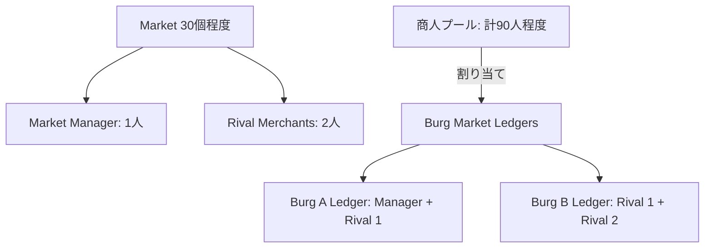

# 商人キャラクター削減仕様案：プール制の導入と商会幹部の削減

現在、Economy拡張機能において商人および商会幹部キャラクターが3,500人程度作成されてしまい、パフォーマンス低下やUI視認性の悪化を招いています。本ドキュメントでは、キャラクター総数を100人程度（為政者の300人より少ない規模）に抑えつつ、商人同士のライバル関係をゲーム的に分かりやすく表現するための再設計案を提示します。

---

## 1. 根本原因の分析と現状のキャラクター内訳

キャラクター数が3,500人規模まで膨張している原因は、以下の2つのジェネレータロジックにあります。

### 原因①：全Burgでの無制限な商人作成 (`burgMarketLedgers.ts`)
- `ensureLedgerMerchants()` 内で、各Burg（通常300〜400個）ごとに人口や特性に応じて **2〜5人** の商人 (`burgMarketMerchant` ロール) を新規作成しています。
- 不足していると `createMerchant(burg)` が走り、毎回 `pack.characters` にユニークな新規キャラクターを追加します。
- これにより、一般商人だけで **約 1,000〜1,500人** が生成されます。

### 原因②：全Burgに対する商会の作成と幹部キャラクターの量産 (`merchantOrganizations.ts`)
- `syncMerchantOrganizations()` において、全 `BurgMarketLedger`（＝全Burg）に対して `MerchantOrganization` (商会) を1つずつ作成しています（約300〜400個）。
- そのうち、`scale` が `"major"`（全商会の上位15% ≒ 約50〜60個）の商会に対して、以下の幹部キャラクターを `createOrganizationStaff()` で新規作成しています。
  - **Secretary (秘書)**: 1人
  - **Bodyguard (用心棒)**: 1人
  - **Executive (幹部)**: 所属するBurgの数に応じて `Math.ceil(servedBurgCount / random(3, 6))` 人（平均5〜10人）
- これにより、商会幹部だけで **約 1,000〜1,500人** のキャラクターが新規作成されます。

---

## 2. 100人程度に絞るための削減仕様案

「商人同士のライバル関係」というゲーム的要素を維持しつつ、キャラクター総数を100人程度に抑えるため、**「マーケット専属の商人プール制」** と **「商会幹部キャラクター生成の廃止」** を導入します。

### 仕様案1：マーケット専属の商人プール制（Merchant Pool per Market）
各Burgで個別のユニークな商人を作るのをやめ、**「マーケット（商圏）ごとに限られた数の商人だけが存在し、彼らがそのマーケット内の各Burgの市場シェアを分け合う」** 形にします。

1. **Marketごとの商人プール**:
   - 各Market（約30個程度）に対して、以下の固定数のキャラクターのみを作成します。
     - **Market Manager** (大商会の会頭): 1名 (既存仕様)
     - **Rival Merchant** (ライバル商人): 2名 (新規仕様、ロール: `marketRivalMerchant`)
   - キャラクター総数は `30 Market * 3人 = 90人` 程度となり、目標の100人前後に収まります。
2. **Burg Market Ledger での割り当て**:
   - 各BurgのLedger (`merchants`) にには、新規キャラクターを作成するのではなく、そのBurgが属するMarketのプール（Manager + Rivalsの計3人）からキャラクターを割り当てます。
   - `getDesiredMerchantCount(burg)` は 1〜3人（大都市なら3人全員、小規模なら1〜2人）とし、プール内のキャラクターIDを再利用（兼任）させます。
   - これにより、同一マーケット内の異なる都市市場で同じ競合商人が登場し、「A氏 vs B氏 vs C氏」のライバル関係が分かりやすくなります。

### 仕様案2：商会 (Merchant Organization) と幹部キャラクターの削減
商会の構造を簡素化し、余分な幹部キャラクターの自動生成を排除します。

1. **商会（Organization）の数を制限**:
   - 全Burg（300個以上）に商会を作るのをやめ、**Market Managerが率いる大商会（Major Organization）のみ**（計30個程度）、またはRival Merchantを含む主要商人の数（最大90個程度）に限定します。
2. **幹部キャラクター（Secretary, Bodyguard, Executive）の新規作成の廃止**:
   - `secretary`, `bodyguard`, `executive` をユニークなキャラクターとして新規作成する処理を廃止します。
   - 用心棒や秘書は、データ上のステータスとして処理するか、あるいはRival Merchantたちを幹部（Executive）のリストに割り当てるなどして、キャラクターオブジェクトの新規作成を伴わないようにします。

---

## 3. 期待される効果

1. **キャラクター総数の激減**:
   - 商人・商会関連のキャラクターが **約3,000人以上 → 90〜100人程度** へ激減します。
2. **ライバル関係の明瞭化**:
   - `Markets Overview` ダイアログの `Burg merchants` タブの `Rivals` 列に表示される商人が、そのマーケットで固定された主要なライバル商人（1〜2名）になり、関係性が把握しやすくなります。
3. **パフォーマンスとデータ容量の改善**:
   - キャラクターの生成処理・データ保存サイズ・UI描画負荷が大幅に軽減されます。

---

## 4. 変更予定のファイルと方針

### ① [burgMarketLedgers.ts](file:///Users/h-yamaguchi/Projects/Fantasy-Map-Generator/src/extensions/economy/generators/burgMarketLedgers.ts)
- `ensureLedgerMerchants()` での `createMerchant(burg)` 呼び出しを廃止。
- 代わりに、`market.managerCharacterId` および Marketに紐づく `rivalCharacterIds` から商人を割り当てるように修正。
- `pruneStaleMerchantRoles()` でのクリーンアップ処理をプール制に合わせて更新。

### ② [marketManagers.ts](file:///Users/h-yamaguchi/Projects/Fantasy-Map-Generator/src/extensions/economy/generators/marketManagers.ts) または新規モジュール
- 各Marketに対して2名のライバル商人 (`marketRivalMerchant` ロール) を作成・維持する `syncMarketRivals(markets)` ロジックを追加。
- 宗教や文化に応じたパラメータ設定を適用。

### ③ [merchantOrganizations.ts](file:///Users/h-yamaguchi/Projects/Fantasy-Map-Generator/src/extensions/economy/generators/merchantOrganizations.ts)
- `syncMerchantOrganizations()` において、商会数を主要商人（Manager / Rivals）が率いるものだけに限定。
- `syncMerchantOrganizationCharacters()` 内での `secretary`, `bodyguard`, `executive` の新規作成ロジック（`createOrganizationStaff`）を廃止。

---

## 5. ご確認いただきたい点（Open Questions）

1. **Rival Merchantの人数はMarketごとに「2名（Manager含めて計3名）」で十分でしょうか？**
   - 2名にすると、プールが3人になり、`getDesiredMerchantCount` (最大3) で全大都市にこの3人が登場し、ライバル関係が綺麗に表現されます。
2. **商会幹部（Secretary / Bodyguard / Executive）のユニークキャラクター生成は完全に廃止してよろしいでしょうか？**
   - 廃止することで1,000人以上のキャラクターを削減できます。もし一部の重要NPC（例えば最大商会の用心棒など）のみを残したい場合は、ごく少数の「最大規模のMajor Company」の会頭にのみ用心棒などを1人割り当てるような制限付きの仕様にすることも可能です。

## 5.1 回答

1. `2名（Manager含めて計3名）`で良い。ライバルが一人だと1:1の殺し合いになるが、1:1:1なら2:1の状況を作ったりゲーム性が向上する。
2. 廃止ではなく、一時的な無効化。ハードコーディングでOK。最終的にはZustandに状態を保存してON/OFFを地図のGenerationオプションから変更する。
