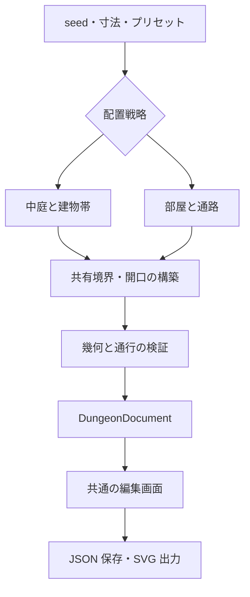

# Dungeon Editor — 屋内・施設平面の生成と編集

- 状態: 段階 1〜3 の単層・矩形区画の初期版を実装済み。FMG / CE 連携と追加プリセットは後続。
- 更新日: 2026-09-29
- 配置先: [src/dungeon-editor](../../src/dungeon-editor/README.md)
- 関連: [世界地図上のダンジョン配置](high-fantasy-dungeons.md)

## 1. 目的と境界

City Editor (CE) と並ぶ独立した Dungeon Editor (DE) を作る。
ここでいうダンジョンは地下迷宮に限定せず、隊商宿、砦、修道院など、部屋・通路・壁・扉で構成される探索可能な施設平面を含む。居住中の隊商宿も生成でき、廃墟化や敵の配置を必須にしない。

初期目標は次の二つを同じ編集画面・保存形式で扱うこと。

1. **caravanserai**: 中央の開放中庭、周囲の反復する小部屋、奥の通路・大部屋、主入口を持つ矩形施設。
2. **room-corridor**: 大小の部屋を通路で結び、分岐・行き止まり・周回路を持つ探索型平面。

FMG は世界内の位置と属性、CE は都市の街路・建物配置、DE は施設内部を担当する。
DE は単独で起動でき、世界データを必須にしない。施設が都市内にある場合も、内部文書を都市の街区に変換しない。

初期対象外: 戦闘・経済・探索進行のシミュレーション、複数階の自動生成、曲線洞窟、画像からの自動トレース、Watabou 形式のインポート、建築構造計算。

## 2. 参照から採用する特徴

### 2.1 隊商宿の平面図

参照: [temp/Carvansara_plan.png](../../temp/Carvansara_plan.png)（ユーザー提供、Wikipedia 由来との説明）。
原ページ・作者・画像ライセンスは未確認。以下はこの画像の観察であり、隊商宿全般の歴史的要件ではない。画像ファイルは開発時の参考とし、実行時アセットには組み込まない。

- 矩形に近い厚い外周と、大きな中央中庭。
- 中庭側に並ぶ小部屋と、それより外側の連続した空間。
- 中庭へ通じる目立つ入口の軸線と、四隅・側面にある変形した区画。
- 左右の反復性が高いが、すべての部屋が同じ大きさではない。

画像だけから部屋用途は断定しない。「客室・倉庫・厩・管理室」等は生成プリセット側の用途候補として設定する。
初期実装は直角の矩形・L 字区画で構成を再現する。斜めの隅切りや柱・ヴォールトの精密再現は後続とする。

実装済みの v1 は矩形区画に限定する。L 字室は、有効床領域の通行検証を追加する段階で対応する。

### 2.2 One Page Dungeon

参照: [Watabou — One Page Dungeon](https://watabou.itch.io/one-page-dungeon)（2026-09-29 確認）。
公開ページには再生成操作とオプション操作が案内されている。
DE では、一枚で読み取れる部屋・通路型の平面を目標にし、同製品の内部アルゴリズムは前提にしない。
UI・コードの複製ではなく、以下を本プロジェクトの要件として実装する。

- seed と設定から平面を生成し、部屋番号・縮尺・任意の注記を付ける。
- 生成後の部屋・扉を編集して保存できる。
- 編集用 JSON と閲覧用 SVG を出力する。

## 3. アーキテクチャの決定

**専用の配置戦略 + 共通の平面文書 + 共通の編集器**を採用する。
矩形施設を都市メッシュの変形で作らない。CE の `CastlePlan` のような用途付き建物表現は参考にするが、型や生成処理を直接流用しない。

`core` は DOM・FMG store・CE に依存しない純粋処理、`render` は文書から図形を作る処理、`ui` は操作、`io` は入出力に限定する。依存方向は `ui → core/render/io`、`io/render → core`。
seed 付き乱数などの共通化は、依存関係を確認した小さなユーティリティに限る。CE の生成器をコピーして第三の都市生成器にしない。

## 4. 共通データモデル

以下は実装時の契約案。文書の正式な型定義・マイグレーションは実装段階で追加する。

| 要素 | 主なデータ | 意味 |
| --- | --- | --- |
| `DungeonDocument` | format, version, id, title, units, levels, generation, source? | 保存する平面全体 |
| `Level` | id, elevationMeters, vertices, spaces, boundaries, openings, fixtures, entrances | 一つの階。初期版は一階のみ |
| `Vertex` | id, point | 共有境界の端点 |
| `Space` | id, kind, use, boundaryRefs, roof, label, required, locked | 部屋・通路・中庭・前庭 |
| `Boundary` | id, a, b, leftSpaceId, rightSpaceId, barrier, thicknessMeters, locked | 空間境界を一度だけ保持 |
| `Opening` | id, boundaryId, offsetMeters, widthMeters, kind, state, visibility, locked | 境界上の扉・門・開放アーチ等 |
| `Fixture` | id, spaceId, kind, footprint, blocking, locked | 柱、家具、井戸など |
| `Entrance` | id, openingId, role | 主入口・副入口。初期版は外部境界の開口を参照 |

座標はローカルのメートル、X 右向き・Y 下向き。初期生成は 0.25 m の整数格子上で計算し、表示用のマス目（例: 1 m）は別設定とする。直角平面の全体回転は描画・外部配置時の変換とし、内部座標は直交状態を保つ。

`Space.kind` は `room | corridor | courtyard | yard`、`use` は用途文字列、`roof` は `covered | open`。中庭は障害物や建物の穴ではなく、歩ける屋外空間として扱う。
外部は同一階の境界で片側の space が `null` の領域として表す。外部を経由してすべての出口が自動的につながるとはみなさず、外構内の移動が必要なら明示的な `yard` を作る。

### 4.1 壁と開口の正本

共有境界を正本とし、部屋の輪郭を別の可変ポリゴンとして二重保存しない。`boundaryRefs` は向き付きの閉じたリングで、そこから部屋ポリゴンを導出する。初期版は各空間一リング、穴なし。中庭を囲む環状通路は四つの帯区画に分けて開放境界でつなぐ。

`barrier = wall | open`。隣接する二室の壁は同じ `Boundary` を参照する。壁厚は中心線から両側に半分ずつ取り、床の有効輪郭を導出する。外周寸法も境界中心線基準とし、UI では有効寸法と区別する。

壁は開口区間を差し引いて描画し、柱・壁厚を差し引いた移動可能領域を通行検証に使う。`open` 境界では壁を描かず、十分な有効幅があれば空間同士を接続する。
開口は境界の a → b を基準にした距離と幅で定義する。角をまたぐ開口、重なる開口、壁より長い扉、`open` 境界上の扉を禁止する。境界分割時は開口の参照を移し、開口を横断する分割は拒否する。

共有境界は配置後の区画線を端点・T 字交点で分割して正規化する。生成中の部屋矩形・通路ポリゴンは作業データにとどめる。
区画の重複は解消してから文書化し、辺の最大接続数は二空間。点接触だけでは隣接とみなさない。

### 4.2 接続と再現性

通行グラフは空間をノード、開放境界・通れる開口をエッジとして文書から導出し、別の編集可能データとして保存しない。
構造上の到達性（閉扉・施錠扉・隠し扉も開けられると仮定）と、現在状態での到達性を区別する。必須室の生成保証には、隠し扉を除き通常扉を開けられる条件の到達性を用いる。通路交差は必ず接続区画として正規化する。

`generation` は strategy、algorithmVersion、seed、正規化済み設定、成功した attempt を保持する。同一バージョン・入力で同一の ID と図形を返す。形状・家具・注記には独立の乱数系列を使い、家具の設定変更で部屋配置を変えない。
JSON は完成図形を保存する。手編集後の文書は seed のみでは復元できないので、seed 共有と文書共有を分ける。

## 5. 生成パイプライン

共通 API 案: `generateDungeon(request) → {ok, document?, diagnostics, attempts}`。
部分生成を成功扱いにせず、失敗時は現在編集中の文書を保持する。

1. 寸法・部屋数・最小幅の検証。配置できない設定は理由付きで終了。
2. プリセット別に空間と望ましい接続を作る。
3. 非重複区画へ正規化し、共有境界・壁・開口を確定。
4. 有効幅・入口・到達性を検証し、可能なら局所修復。
5. 用途と家具を配置。家具配置後にも通行を検証。
6. 完成文書と診断を返す。

初期上限は 128 空間・32 試行。試行ごとに `${seed}:layout:${attempt}` の独立乱数を使う。上限到達時に条件を黙って緩めず、失敗条件と設定変更の候補を表示する。性能目標は基準端末を決めた後に測定で確定する。

### 5.1 caravanserai 戦略

主な設定: 外周幅・奥行、中庭幅・奥行、部屋帯の奥行、背面通路幅、最小室幅、主入口側・幅、対称性、外壁厚・間仕切り厚。
最初の検証用設定案は外周 60 × 70 m、中庭 24 × 30 m、通路有効幅 2 m、入口有効幅 3 m。これは画像の縮尺推定でも歴史的標準値でもない。

1. 矩形外周と中心中庭を決定し、四辺の建物帯を予約する。
2. 主入口側に入口棟・前室・中庭への通路を先に確保する。
3. 中庭沿いの帯を客室等の反復区画へ分割。対称設定では対になる辺の分割を対応させる。
4. 残りの外側の帯に背面通路と大部屋を配置。四隅は角専用の区画として処理し、辺ごとの配置を重ねない。
5. 各室を中庭または通路に接続し、外部→入口→中庭→必須室の経路を検証する。
6. 必要なら倉庫・厩などの用途、柱、井戸を追加。柱や家具が扉の前を塞がないことを確認する。

見た目の左右対称だけでなく、中庭周囲の反復と門からの動線を成立させる。外壁の凹凸や図面の細かい斜角は後続機能とする。
建物帯が薄すぎるときに小部屋を潰して詰め込まず、寸法不足として返す。

### 5.2 room-corridor 戦略

主な設定: 平面範囲、部屋数、室寸法の範囲、通路有効幅、目標ループ数、主入口側。

1. 整数格子上に矩形室を非重複で配置し、壁厚と通路の余地を予約する。
2. 室間距離から候補接続グラフを作り、全室を結ぶ木を基本経路とする。
3. 境界上の扉候補を選び、通路を格子上の直交経路として探索する。無関係の室を横切らず、幅を持つ障害物判定を行う。
4. 接続失敗なら別の扉候補・辺を試し、木が完成しなければ再配置する。
5. 追加接続でループを作る。最終図形のグラフでループ数を測り、意図しない接触や交差で増減した場合は修復・再試行する。
6. 外部から入口室への開口、扉、用途を確定する。

通路を線として描くだけでは完了にしない。交差部や曲がり角を含む床領域を作り、壁と接続グラフの両方が一致することを要求する。

v1 の実装では、各室を寸法の異なる矩形として格子状の配置枠に置き、上下左右の隣接枠間に通路領域を予約する。ランダム重みの隣接グラフから Kruskal 法で木を作り、追加辺で指定した周回路数を作る。通路は実際の床区画で、両端に扉を持つ。予約した直交通路を使うため、初期版には A* や通路交差の生成を導入していない。任意配置の室・屈曲通路は後続で追加する。

### 5.3 後続プリセット

`fort`、`monastery` は施設配置戦略の追加候補。まず caravanserai の共通化範囲を実装で確認してから、建物帯・中庭・門の部品を抽出する。
廃墟・占拠・浸水などは建物用途と別の状態として拡張する。既存 `DungeonKind` の `wealth_lair` 等は世界内の役割であり、平面形状の列挙型に流用しない。

## 6. 編集画面

CE と同様、中央キャンバスと設定・選択対象・履歴のパネルを持つ独立ページにする。

- 生成: プリセット、seed、寸法、部屋数、対称性、再生成、別 seed。
- 表示: ズーム・パン・全体表示、グリッド、縮尺、部屋番号、用途、屋根の有無。
- 編集: 部屋選択、ラベル・用途変更、壁上への扉追加・移動・削除、共有壁の移動。
- 診断: 入力不整合、到達不能室、幅不足を対象空間に対応付けて表示。
- 保存: JSON 読み書き、SVG 出力、Undo / Redo。

共有壁の移動は接する両室と開口を一つのトランザクションで更新する。形状の自交差・室の消滅・開口のはみ出しは確定前に拒否する。
扉削除による孤立は手編集では警告付きで許し、生成結果の必須室接続保証とは区別する。

初期版の再生成は全体置換で、Undo で戻せる。ロック済み要素があるときは再生成を拒否し、解除すべき対象を表示する。ロックを守った部分再生成は後続で追加する。
選択操作・ドラッグ中は再生成しない。長い生成を Worker に移す場合は request ID と文書 revision を照合し、古い結果が新しい編集を上書きしないようにする。

## 7. 保存・FMG / CE との連携

ネイティブ形式は `format: "fmg-dungeon-editor"`, `version: 1`、拡張子 `.fmg-dungeon-editor.json` を予定。読込時はサイズ・件数上限、有限座標、ID の一意性・参照整合性、境界・開口・リングの妥当性を検証する。未知の version は明示的に拒否する。
SVG は単体で開ける閲覧用出力とし、任意文字列をエスケープする。SVG を編集用保存データとみなさない。

初期版は単独ページとローカルファイルで完結。後続の `DungeonSiteDescriptor` は version、seed、source、推奨 preset、入口方位、任意の敷地寸法・輪郭を含む独立 DTO とする。world store を DE に import しない。

`source` は `burg | dungeon-site | city-building` の識別子と世界・都市文書 ID を持つ任意の参照。参照先がなくても保存平面を開ける。
`burg.group = caravanserai` はプリセットの推奨値に使い、実際の用途・形状は選択可能とする。集落人口をそのまま部屋数にしない。
CE へ返す場合は建物 ID、DE 文書参照、敷地輪郭、入口位置、配置変換を接続する。単位はメートルで一致させ、内部平面を勝手に縮小して既存建物へ押し込まない。敷地が合わない場合は再生成または配置変更を選ぶ。

既存 `pack.dungeons` と `Dungeons.clear()` は世界の配置・危険度の責務を維持する。DE はそれらを書き換えず、世界側のサイトが消えても保存済みの内部文書は削除しない。
世界配置計画の「内部マップは非目標」はその配置システムの範囲として維持し、本計画が別モジュールで平面生成を追加する。

ページ実装時は `vite.config.ts` の multi-page input に `dungeonEditor: src/dungeon-editor/index.html` を追加する。公開先の base path を尊重し、URL をルート固定で組み立てない。

## 8. 検証と受け入れ条件

### 共通

- 同じ algorithmVersion・seed・設定で、ID を含む同じ平面が生成される。
- 空間の面積は正で、内部が重複せず、境界リングが閉じる。
- 同じ壁の二重保持、参照切れ、壁外の開口、重複開口がない。
- 全必須室が主入口から通常扉経由で到達可能。家具配置後の通路幅も基準を満たす。
- JSON 往復で形状と編集属性が保持され、Undo / Redo で編集前後に戻る。
- 失敗・過大入力・試行上限到達で既存文書を破壊しない。

### caravanserai

- 一つの主要な開放中庭と、その四辺の室群がある。
- 主入口から中庭への通路があり、中庭が家屋で埋まらない。
- 対称設定では、用途・家具を除く対象の配置が指定軸で対応する。
- 入口棟・四隅・背面通路が互いに重ならず、室が外周からはみ出さない。

### room-corridor

- 指定部屋数（通路区画を除く）を満たすか、失敗を明示する。
- 点接触を通路として誤認しない。通路交差は図形上も接続される。
- 目標ループ数は最終通行グラフの `E - V + C`（C は連結成分数、外部ノードは除外）で検証する。

実装時は固定 seed 群で大小・縦長・横長・寸法限界・高密度を検証する。幾何・到達性のテストに加え、代表 seed の SVG を描画して壁の継ぎ目、扉の抜け、ラベルを目視確認する。参照画像との画素一致は受け入れ条件にしない。

## 9. 実装順序

| 段階 | 作るもの | 完了条件 |
| --- | --- | --- |
| 0（完了） | 専用フォルダ・本設計 | 責務・文書・二戦略・検証条件が明文化される |
| 1（初期版完了） | 文書型、共有境界、SVG、caravanserai 純粋生成器 | 中庭・反復室・入口が固定 seed で成立する |
| 2（初期版完了） | 独立ページ、生成操作、JSON、扉編集、履歴 | 生成→編集→保存→再読込の一連の操作ができる |
| 3（初期版完了） | room-corridor 戦略、共有壁編集、診断表示 | 二戦略が同じ編集器で動き、到達性・幅・ループ検証が通る |
| 4 | FMG / CE 入出力、fort / monastery | 世界・都市の責務を保ったまま参照と再編集ができる |
| 5 | 複数階、部分再生成、廃墟、斜角・曲線 | 各機能の契約・検証を追加してから拡張する |

最初の縦断実装は caravanserai とする。四角い外壁だけではなく、中庭・部屋・扉・通行の整合性までを最小成果に含める。

## 10. 初期版の実装状況

- 独立ページ `/dungeon-editor/` と Vite エントリー、二つの純粋生成器を追加。
- 共有境界と開口を正本にし、輪郭・壁厚を差し引いた矩形の有効寸法・扉の角からの距離・重複・参照整合性を検証。
- 通常到達性、隠し扉を含む構造上の到達性、開いた扉だけを使う現在状態の到達性を区別。画面の診断は通常到達性を使う。
- 部屋名・用途・ロック、扉の追加・位置・幅・状態・削除、外壁上の主入口指定、連続した共有壁の移動、Undo / Redo を実装。
- JSON は完成図形を保存し、読込時に 2 MB・件数・版・幾何を検証。SVG は閲覧用で編集用データを含まない。
- 井戸は装飾のみで `blocking: false`。通行を塞ぐ家具は未対応。
- 中央中庭の寸法は格子との整合で最大 0.25 m 調整し、調整後の寸法を生成記録に保持する。
- FMG / CE 入出力契約、複数階、L 字室、部分再生成、追加プリセットは未実装。

テストは `src/dungeon-editor/**/*.test.ts` に配置。固定 seed 群、入口方位、大小・縦長・横長、指定部屋数・周回路数、生成失敗、JSON 往復と不正入力、編集の原子性・履歴・ロック、SVG の文字列エスケープ、画面操作を検証する。
