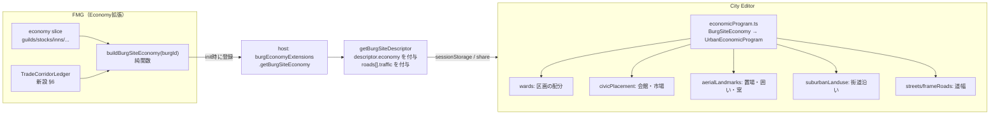

# FMG経済シミュレーション → CE都市生成 連携設計

| 項目 | 内容 |
| :--- | :--- |
| **Status** | 一部実装。ギルド会館は職人0人でも置く。交易回廊台帳と `roads[].traffic` を実装。置き場は Paia 1350 で較正し、`storage[]` の面積を城壁内（穀倉・倉庫）と城壁外（家畜市・材木置場・石置場・燃料置場）に描く。樽倉は敷地を取らない。区画重みは職人比・`commerce.rank`・市場中心で置き換える。郊外の交通と門前の宿は未実装 |
| **Date** | 2026-10-10 |
| **Owner** | Economy 拡張（プロファイル生成）+ host（descriptor）+ CE（都市生成） |
| **検証データ** | `temp/000.savdata/Paia 2026-10-10-09-54.fmg`（1年進行、1348年）。回廊の確認は `temp/000.savdata/Paia 2026-10-10-10-54.fmg`（1350年1月1日。台帳導入前に進めたので、残っている配送と航行中キャラバンを台帳に再生して見る） |
| **関連** | [guild-city-bases.md](./guild-city-bases.md)（GuildChapter）、[goods-unit-scale.md](./goods-unit-scale.md)（1 unit＝ロット）、[urban-inn-system.md](./urban-inn-system.md)、[economy-coupling-audit.md](./economy-coupling-audit.md) L8（Public Works）、[docs/city-editor/plan/1008-wards-and-features.md](../city-editor/plan/1008-wards-and-features.md)、[docs/city-editor/plan/1005-fmg-integration-design.md](../city-editor/plan/1005-fmg-integration-design.md) |

---

## 1. 目的

FMGの経済シミュレーションが年々更新している「その都市に何があり、何が動いているか」を、CEが描く都市の土地利用・施設・道路に反映する。

- ギルド：正式拠点（会館）と実際の作業場・付属施設を、職種ごとの適地に置く。
- 在庫：家畜・木材・石材のようにかさばる商品は、在庫量に見合う置き場（家畜囲い・材木置場・石置場）を確保する。
- 交易：どの道がどれだけ使われているかで、道幅・門前の宿屋・街道沿いの郊外の伸び・市場の規模を変える。FMG側では、どの都市間の交易路を整備すべきかを判定できるようにする。

あわせて、逆方向の点検として、CEが描いているのにFMGがシミュレーションもカウントもしていない事項と、セーブから見つかったFMG側の不整合を §8 にまとめる。

**非目標（v1）**：CEで描いた結果をFMGのシミュレーションへ書き戻すこと。CEは参照するだけとする（§9 で将来扱い）。

---

## 2. 現状の受け渡し経路

| 経路 | 中身 | 経済情報 |
| :--- | :--- | :--- |
| `getBurgSiteDescriptor()`（`src/services/burgSiteDescriptor.ts`）→ sessionStorage `fmg.citySite` → CE `incomingCity.ts` | 地形・川・海岸・道路（`roads[].nextBurg` に隣接都市の人口・`wealth`・`treasury`）・文化・時代・`dwellings`・`lotOccupancy` | **無し**。Burgの真偽値フラグ（`capital/port/citadel/plaza/walls/temple/shanty`）だけ |
| `burgEconomyExtensions.getBurgEconomySummary`（`src/services/burgEconomyExtensions.ts`） | Burg Editor の表示用文字列 | あるが**整形済みの文字列**で、CEには渡っていない |
| CEのUIプリセット | `composition: standard/commercial/warehouses/estates`、`harborPreset`、`approachBeyond.role: granary/market/...` | 手動選択か、隣接都市の役割からの推測 |

host core は Economy 拡張を import できない（拡張境界）。したがって経済データを descriptor に載せるには、`getBurgEconomySummary` と同じ「拡張がフックに関数を登録し、hostが呼ぶ」型が要る。

---

## 3. セーブ実測（Paia, 1348年）

設計の前提を推測ではなく実データで固めるため、セーブ（zip: `simulation/core.json` + `map/world.json`）を集計した。

### 3.1 Burg単位で取れる量

| データ | 件数 | CEに使える内容 | 備考 |
| :--- | ---: | :--- | :--- |
| `guildChapters` | 162 | 正式会館の職種・設立年・適合度 | woodworking 36 / masonry 29 / textiles 26 / leather 21 / glassware 21 / instruments 17 / printing 9 / metallurgy 3 |
| `guildKnowledgeStocks` | 455 | 実践者の技術ストック・金庫 | textiles 301 / metallurgy 58 / leather 58 / woodworking 37 / printing 1 |
| `craftDomainEmployment` | 306 | 職種別の就業者（人口ポイント） | |
| `smithingWorkshopLedgers` | 33 | 鍛冶工房の生産ライン | |
| `burgWholesaleInventories` | 631 | Burg別卸在庫（good→units） | |
| `burgRetailInventories` | 631 | Burg別小売在庫（onHand/target） | |
| `markets[].goods` | 27 | 市場中心Burgの在庫 | 例: Paris 食料 268,823 lot、家畜 573頭 |
| `innFacilities` | 1,053 | 宿の等級・棟数・客室・**厩舎数** | market 508 / wayside 372 / waterside 139 / grand 20 / caravanserai 14 |
| `urbanWaterSystems` | 592 | 上下水の段階・汚染・洪水 | tier 0: 209 / 1: 325 / 2: 58 |
| `constructionOperations` | 588 | 住宅ストック・石工/大工 | |
| `quarryOperations` / `mineOperations` / `smelterOperations` | 168 / 27 / 24 | 採石・鉱山・製錬の所在と人数 | 製錬所の半数（12/24）は Burg と別セル |
| `saltworks` | 461 | 塩田（セル） | すべて saltPan |
| `levees` / `dams` | 30 / 32 | 堤防・ダム | 堤防30件すべて `materialShortage` で機能していない |
| `shipbuilding.hulls[].homeBurgId` | 587 | 母港別の船体数 | Hajsatad 等の上位港は各20隻 |
| `merchantOrganizations[].homeBurgId` | 27 | 商会の本拠 | |
| `academyKnowledgeStocks` / `mintLedgers` | 21 / 21 | 学術拠点・造幣 | |
| `productionByBurg` | 631 | 直近の生産とレシピ | 加工品: Beer 134 Burg / Barrels 95 / Preserved food 55 / Charcoal 21 / Linen 14 / Leather 4 |
| `burg.fortificationQuality` / `foodReserve` / `security` / `sanitation` | — | 城壁品質・備蓄・治安 | |
| `funeral.remainsByCell` | 3,012 | セル別の累積遺骸数 | 墓地の規模に使える |
| `landUse.cells[].patches` | 3,314 | 農地・森林転換のパッチ | 郊外の耕地形状に使える |

### 3.2 交易のカウント

| データ | 中身 | 限界 |
| :--- | :--- | :--- |
| `Route.traffic`（`publicWorks.recordRouteTraffic`） | 陸路の路線ごとにキャラバン出発1回＝+1、年0.7で減衰 | **陸路のみ**（海路128本は記録されない）。回数であって量（lot・価値・積荷枠）ではない。都市ペアが分からない。633路線中79路線に値があり、最大13.58（路線37） |
| `Market.caravanArrivalVolume` | 市場ごとの到着キャラバン量（約2か月で半減） | 市場単位。最大5.6 |
| `caravans[]` | 進行中キャラバン189件。`routeSegments` に実経路 | 進行中の分だけ。完了すると消える |
| `marketShipments[]` | 市場内の Burg→Burg 配送2,759件（855ペア） | 直近の窓だけで、累計ではない |
| `escortJobPostings[].destinationBurgId` | 護衛依頼の行き先と脅威 | 依頼であって実績ではない |
| `cumulativeGoodsSales` | 品目別の累計販売 | 場所の情報が無い |

**結論**：「どの都市とどの都市の間の交易路を整備すべきか」を判定する**都市ペア単位・量ベースの累計台帳が存在しない**。§6 で新設する。

### 3.3 単位スケール

[goods-unit-scale.md](./goods-unit-scale.md) は実装済みで、`unit` は会計ロット（wain/pile/pallet/barrel…）、家畜は `head`＝1頭。したがって在庫は物理量に換算できる。ただし `cargo.handlingClass` は 207品目中154品目が既定値の `loose` のままで、置き場の形を決めるには粗すぎる。置き場の分類はCE側の表（§5.3）で品目タグから決める。

---

## 4. 全体構成



設計上の決まり：

1. **FMG側で正規化し、CEはロット単位を知らない。** プロファイルは「面積（m²）」「順位（0..1）」「列挙値」で渡す。ロット→m²の換算はFMG側の一か所（`siteEconomyFootprint.ts`）に置き、CEは受け取った面積を区画に割り当てるだけにする。換算係数を変えるときにCEの再生成ロジックを触らないため。
2. **年次で確定した値だけを使う。** 月次の在庫や進行中キャラバンはその日の揺れでCEの結果が毎回変わる。年次決算値・EWMA・累計台帳を使う。
3. **欠けていても生成できる。** `descriptor.economy` が無い（Economy無効・旧共有リンク）場合、CEは現行どおりの生成をする。
4. **再現性。** CEの共有データ（`CityEditorShare.descriptor`）にプロファイルがそのまま入るので、リンクからの再現は保たれる。FMGで年を進めると同じBurgでも結果が変わるのは仕様とする（`economy.year` を表示）。

---

## 5. データ契約

### 5.1 `BurgSiteEconomy`（descriptor の任意フィールド）

`descriptor.economy?: BurgSiteEconomy`。任意フィールドの追加なので `DESCRIPTOR_VERSION` は 3 のまま。CE側の型コピー（`core/gen/site/burgSiteDescriptor.ts`）を同時に更新する。

```ts
export interface BurgSiteEconomy {
  version: 1;
  /** シミュレーション年。CE の UI に「1348年の経済状態」と表示する。 */
  year: number;
  /** 世界内での相対順位 0..1（人口と独立した商業の発達度）。 */
  commerce: {
    rank: number;
    /** この Burg が Market の中心か。中心なら市場・卸倉庫を大きく取る。 */
    marketCenter: boolean;
    /** 商会本拠（major/minor）。商館を1棟置く。 */
    merchantHouse: "major" | "minor" | null;
    mint: boolean;
    /** Market.caravanArrivalVolume の世界内順位。 */
    caravanArrivalRank: number;
  };
  guilds: SiteGuild[];
  storage: SiteStorageYard[];
  facilities: SiteFacility[];
  /** 主要な交易相手（§6 の台帳から、上位8件）。 */
  tradePartners: SiteTradePartner[];
}

export type GuildDomain =
  | "metallurgy" | "woodworking" | "masonry" | "textiles"
  | "leather" | "glassware" | "instruments" | "printing";

export interface SiteGuild {
  domain: GuildDomain;
  /** chapter = 正式会館あり、informal = 実践者のみ。 */
  status: "chapter" | "informal";
  /** 実践者数（実人数。人口ポイント×populationRate）。0 でも会館と付属施設は置く。職人街だけ割かない。 */
  practitioners: number;
  /** 会館の格 0..1（金庫と技術ストックの世界内順位）。 */
  prestige: number;
  foundedYear: number | null;
}

export type StorageForm =
  | "livestockPen"   // 家畜（head）
  | "timberYard"     // Wood/Timber/Mahogany
  | "stoneYard"      // Stone/Marble/Brick/Clay/Lime...
  | "fuelStack"      // Peat/Coal/Charcoal
  | "granary"        // 穀物・豆
  | "cellar"         // 樽物（Beer/Wine/Oil）: 地下なので地上面積は小さい
  | "warehouse";     // その他の梱包品

export interface SiteStorageYard {
  form: StorageForm;
  /** 必要な敷地面積（m²）。FMG側で lot→m² 換算済み、都市規模で上限をかけ済み。 */
  areaM2: number;
  /** 最大の品目名（ラベル・ツールチップ用）。 */
  mainGoods: string[];
  /** 物資がどの方向から来るか：交易相手・生産地の方位（度）。置き場を門の側に寄せる。 */
  inflowAzimuthDeg: number | null;
  /** 水運で入るなら true（材木の筏流し・石材の荷揚げ）。岸に寄せる。 */
  waterborne: boolean;
}

export type FacilityKind =
  | "inn" | "caravanserai" | "stableYard"
  | "brewery" | "cooperage" | "charcoalBurning"
  | "shipyard" | "ropewalk"
  | "quarryWorks" | "limeKiln" | "smithy" | "smelter" | "mineHead"
  | "saltPan" | "levee" | "dam"
  | "waterworks" | "publicGranary" | "harborWorks";

export interface SiteFacility {
  kind: FacilityKind;
  count: number;
  /** 規模 0..1（棟数・人数・容量から）。 */
  scale: number;
  /** 地図上の位置が FMG に既にある場合（製錬所・塩田・堤防・ダムのセル）、局所座標 m。 */
  positionMeters?: [number, number];
}

export interface SiteTradePartner {
  burgId: number;
  name: string;
  /** 年間の積荷枠（cargo slots）。量の比較用。 */
  annualSlots: number;
  mode: "land" | "river" | "sea";
  /** descriptor.roads[] のどの道を通るか（陸路のみ）。 */
  routeId: number | null;
  mainGoods: string[];
}
```

### 5.2 `roads[]` への追加（host core のみで可能）

`Route` は core の `pack.routes` にあるので、Economy 拡張を経由せずに付けられる。

```ts
interface BurgSiteRoadEntry {
  // 既存フィールド …
  /** Route.traffic（年0.7減衰の出発回数）。未記録は 0。 */
  traffic?: number;
  /** 世界の陸路内での traffic 順位 0..1。 */
  trafficRank?: number;
}
```

### 5.3 在庫 → 置き場の換算（FMG側 `siteEconomyFootprint.ts`）

その Burg の卸（`burgWholesaleInventories`）と小売（`burgRetailInventories.onHand`）を足す。市場中心の `stapleCrop` は、Food Ledger の age0+age1+age2（まだ倉にある滞留）に置き換える。`storageOverflow` は置き場を失った分なので面積にしない。`markets[].goods.stock` は卸と同じ山の写しなので足さない。`stapleFood`（Grain の集計）は作物ロットと二重なので落とす。

| form | 判定 | 面積（Paia 1350 で採用） | 置く場所 |
| :--- | :--- | :--- | :--- |
| livestockPen | `liveAnimal` タグ | 牛・馬・象・駱駝 4 m²/頭、羊・山羊・豚・犬 1.5 m²/頭、鶏・猫 0.3 m²。頭数は現在庫 | 城壁外・門前の家畜市（Viehmarkt）。屠畜場・なめし場と同じ下流側 |
| timberYard | Wood/Timber/Mahogany | 1 pile = 6 m² | 川岸（`waterborne`）か、森の方角の門の外 |
| stoneYard | Stone/Marble/Brick/Clay/Lime、または `construction` かつ `mineral` | 1 lot = 4 m² | 採石場の方角の門、または荷揚げ岸 |
| fuelStack | `fuel`（樽物と材木を除く） | 1 lot = 2 m² | 城壁外（火災） |
| granary | `stapleCrop` | 1 wain = 1.2 m²（多層の床面積で割り戻し） | 市場近く・城壁内。`burg.publicWorks.granary` があれば公共穀倉を追加 |
| cellar | barreled | 地上 0.2 m²/barrel | 区画内に吸収（建物を大きくするだけ） |
| warehouse | その他 | 1 lot = 0.8 m² | 港・市場・商館の周り |

都市規模の上限：置き場の合計は市街地円盤（`occupancyRadiusMeters` の πr²）の 15%（市場中心は 25%）まで。超える分は形の比を保って縮め、`areaM2` に上限後の値を入れる。

**較正（Paia 1350、`temp/000.savdata/Paia 2026-10-10-10-54.fmg`）**：上の係数を卸＋小売に掛けると、Marba（首都、市場中心ではない、人口約 1.2 万、円盤 31.6 ha）は 0.45%。Paris（市場中心、人口約 1.0 万、円盤 25.7 ha）は 108% で、穀倉だけで 27 ha（Maize の卸 12.3 万 wain）。同じ市場の Ledger は滞留 1.78 万 wain、overflow 17.5 万 wain。滞留だけを採ると Paris の穀倉は円盤の約 8% で、上限の内側に収まる。係数はこの表のまま使う。

---

## 6. 交易回廊台帳（FMG側・新設）

### 6.1 なぜ `Route.traffic` だけでは足りないか

- 陸路しか数えない。港町同士の交易（Paia の上位港はすべて Naval）が見えない。
- 回数しか無い。家畜100頭の隊と薬草1束の隊が同じ +1。
- 路線単位なので、A→B の交易が途中の何本の路線を通っても「A と B の間」として集計できない。
- 整備が必要かどうか（遅い・危ない・渡河が無い）を判断する材料が無い。

### 6.2 データ

```ts
// src/extensions/economy/generators/tradeCorridorLedger.ts（新規）
export interface TradeCorridor {
  /** 小さい burgId を先にした無向ペア。 */
  burgA: number;
  burgB: number;
  /** 年0.7減衰の累計（Route.traffic と同じ保持率で揃える）。 */
  departures: number;
  cargoSlots: number;
  value: number;
  byMode: { land: number; river: number; sea: number }; // cargoSlots の内訳
  /** 直近の実績所要日数（EWMA）と、地形上の理想日数（全区間を road とした場合）。 */
  meanTravelDays: number;
  idealTravelDays: number;
  /** 護衛依頼・襲撃損失から推定した危険度 0..1。 */
  threat: number;
  /** 通過する陸路 routeId（多い順）。 */
  routeIds: number[];
  /** 渡し船で渡った回数（橋が無い地点）。 */
  ferryCrossings: number;
}
```

記録点は `recordRouteTraffic` を呼んでいる2か所（`caravans.ts` の出発処理：商業便と国家調達）と、`marketShipments` の配送完了時。キャラバンの起点・終点は Market 単位なので、Market の中心 Burg をペアの端にする。`marketShipments` は Burg→Burg が分かるので、そのまま使う。

保存は economy slice の `tradeCorridors`。件数は無向ペアなので最大でも数千件（Paia：caravan 41ペア＋shipment 855ペア）。

### 6.3 整備が必要な区間の判定

年次決算で次の指標を出し、`tradeCorridorNeeds` として一覧化する（Trade 系ダイアログに表を1枚追加）。

| 指標 | 式 | 意味 |
| :--- | :--- | :--- |
| 需要 | `cargoSlots` の世界内順位 | 使われているか |
| 遅れ | `meanTravelDays / idealTravelDays` | 舗装・道路昇格の効果 |
| 危険 | `threat` | 治安投資・護衛の効果 |
| 渡河不足 | `ferryCrossings / departures` | 橋の候補（**橋は `bridgeSkewPolicy.ts` の上限内に架けられる地点だけを候補にする**。上限を超える地点は「迂回路」か「渡し船の維持」として出す） |
| 港湾不足 | 海路比率が高く、端の Burg の `publicWorks.harbor` が低い | 港湾工事の候補 |

`publicWorks.ts` の道路昇格は現在 `Route.traffic ≥ 24` と国内比率だけで判定している。これを「需要×遅れ」の大きい回廊の路線を優先する並べ替えに置き換える（閾値と費用はそのまま）。橋の新設は現行の Public Works に無いので v2（§9）。

### 6.4 CEでの使い方

`descriptor.economy.tradePartners` と `roads[].traffic` から：

- **道幅と舗装**：`trafficRank` 上位の道は門外の道幅を広げ、石畳表現にする（`group: roads` と整合）。
- **門前の宿**：`innFacilities` の wayside / caravanserai を、`traffic` 最大の道の門外に置く。厩舎数（`stableSpaces`）で中庭の大きさを決める。
- **街道沿いの郊外**：`suburbanLanduse.ts` の `trade` プロファイル（いまは隣接都市の役割で決まる）を `trafficRank` で決める。リボン長を traffic に比例させる。
- **置き場の向き**：`SiteStorageYard.inflowAzimuthDeg` を、その品目の主な交易相手が通る道の入口方位から決める。

---

## 7. ギルドの施設と立地（CE側）

`SiteGuild` 1件を、会館（`status: chapter`）と作業場（`practitioners > 0`）と付属施設に分けて配置する。

**職人ゼロでも施設は作る。** ギルドの職人を置かないのは、NPCの数を抑えるための意図的な状態である。`practitioners = 0` の正式会館でも会館と付属施設（漂白場・なめし場・材木置場・石置場・石灰窯など）を置く。作業場の区画（職人街）だけは実践者数に比例し、0人なら割かない。会館が無く実践者だけいる場合は、職人街と付属施設を置き会館は置かない。

| 職種 | 会館 | 作業場（区画） | 付属施設・空地 | 立地規則 |
| :--- | :--- | :--- | :--- | :--- |
| textiles | 布地会館＋鐘楼（`belfry-cloth-hall.svg`、prestige 上位のみ） | 織工街 | 漂白場・張り枠場（`bleaching-field.svg`）、縮絨水車 | 会館は市場広場に面する。漂白場は城壁外の川沿いで、**なめし場より上流** |
| leather | 小会館 | 皮革街 | なめし場（既存）、屠畜場 | 河川の最下流・城壁外。家畜囲いと同じ側 |
| woodworking | 会館 | 大工・桶屋街（Barrels 生産があれば桶屋） | 材木置場、造船所（母港の船体があれば） | 川岸・港。材木置場は `timberYard` と共有 |
| masonry | ロッジ（大聖堂建設中なら境内） | 石工小屋 | 石置場、石灰窯 | 採石場の方角の門の近く。石灰窯は城壁外 |
| metallurgy | 会館 | 鍛冶街 | 製錬所・鉱山口（FMGにセルがあれば `positionMeters`） | 火災のため外周。鉱山の方角の門 |
| glassware | 会館 | ガラス工房 | 砂置場 | 城壁外または外周（火災）。White sand 生産地の方角 |
| printing | 会館 | 印刷所 | — | 大聖堂・学術拠点（academy）・行政の近く |
| instruments | 会館 | 工房 | — | 富裕区（patriciate）・市場の近く |

**区画配分（wards.ts）**：プロファイルが無いときは固定の35枠（craftsmen 21、slum 5、merchant 2、patriciate 2、market 2、administration、military、park）。プロファイルがあるときは `economyWardMix` が次の枠に置き換える。

- `craftsmen` 21枠を、`practitioners > 0` の職種比で最大剰余法により分ける。同じ職種は人数を合算する。0人のギルドは枠を取らない。全員0人なら21枠は職種なしの craftsmen のまま。分けた面には `craftDomain` を付ける。建物の形はまだ職種で変えない。
- `merchant` 枠は `commerce.rank`（0〜1）から `min(4, max(1, ceil(rank × 4)))`。rank 0 は 1枠。
- `market` 枠は 2。`marketCenter` なら 3。
- 郊外の traffic 駆動と門前の宿は未実装。
- 置き場（§5.3）は ward ではなく、城壁外は `aerialLandmarks`、城壁内は完成した街から敷地を切り出す（皮革なめし場と同じ方式）。`placeStorageYards` がギルド付属施設となめし場の後に置く。流入方位へ寄せ、水運の材木・石は川へ寄せ、家畜市は川の下流側へ寄せる。門・森林側・採石場側への固定は未実装。置けない余りは捨て、置いた多角形の面積をその区画の `areaM2` とする。

**時代**：会館・鐘楼は `highMedieval` 以降。印刷は `ageOfExploration` 以降（FMG側の技術で印刷が無ければ `printing` 自体が来ない）。

---

## 8. 逆方向の点検

### 8.1 CEが描いているのに、FMGがシミュレーション・カウントしていないもの

| CEの要素 | FMGの状態 | 提案 |
| :--- | :--- | :--- |
| **風車・水車**（`aerialLandmarks.ts`、`watermillFabric.ts`） | 製粉が無い。Flour・Bread は Goods にあるが、Paia では生産・在庫・販売すべて 0。穀物は粒のまま消費される | FMGに製粉レシピ（Grain→Flour）と製粉所の容量（水力は `damSites` / 川の流量、風力は `options.winds`）を追加。CEは製粉所の数をそこから受け取る |
| **なめし場** | Leather の生産は4 Burg だけ（leather の実践者ストックは58 Burg）。CEは川のある町なら全時代で描く | v1 は `SiteGuild(leather)` か Leather 生産がある町だけに描く |
| **屠畜場**（未実装だが家畜の行き先として必要） | 家畜を食べる加工が無い。Pig の市場在庫 6,323頭、累計販売 6,945頭が生きたまま流通している | FMGに屠畜（liveAnimal→食肉・皮・獣脂）を追加すれば、皮がなめし場、獣脂が Candles/Soap に繋がる |
| **風向き**（風車の向き、なめし場の風下） | FMGは `options.winds`（緯度帯ごとの卓越風）を持っている | descriptor に `climate.prevailingWindDeg` を追加（host core のみで可能）。CEの乱数の卓越風を置き換える |
| **修道院** | 宗教組織のシミュレーションは無い（academy の知識カテゴリに名前があるだけ） | 当面は文化の伝統で決める現行方式のまま。将来は宗教の所領・十分の一税と結ぶ |
| **絞首台・晒し台** | 治安は `burg.security` の数値だけ。司法は無い | `security` と人口から絞首台の有無を決める程度で足りる |
| **墓地の大きさ** | FMGは `funeral.remainsByCell` で累積遺骸数を持っている | 墓地面積をこの値から決める（現在は人口から推定） |
| **城壁外の畑** | FMGは `landUse.cells[].patches` で耕地・森林転換を持っている | 郊外の畑の比率をこの値から決める |
| **港のクレーン・岸壁** | `burg.publicWorks.harbor` はあるが、Paia では 0 Burg（§8.2） | Public Works が機能してから `harborPreset` に連動 |

### 8.2 セーブで見つかったFMG側の不整合

CEへ渡す前に直しておかないと、CEに「中身の無い施設」が描かれる。

1. **ギルド会館と実践者のずれ。** 会館162件のうち128件は実践者がいない（ストック>0.02 が無い）。逆に実践者ストック455件のうち253件は会館が無い。metallurgy は実践者58 Burg に対し会館3件。会館の配置（[guild-city-bases.md](./guild-city-bases.md) §3 の適合度）が地形・人口に寄りすぎ、実際の就業を反映していない。→ 適合度に `craftDomainEmployment` の重みを上げ、`informal` が数年続いた Burg を会館に昇格させる規則を足す。
2. **製品の無いギルド。** masonry（会館29）・glassware（21）・printing（9）があるのに、Brick・Lime・Glass・Books・Timber は市場在庫も販売も 0。instruments（17）は専用の Good が無い（設計どおり休眠）。→ これらの会館は CE では「会館のみ・作業場なし」になる。製品の流通が無い職種の会館を新設しない規則も検討する。
3. **公共事業がほぼ動かない。** State の `departmentBalances.publicWorks` は 0.51〜95.72（中央値 9.2）。港湾工事1段階 150、公共穀倉1段階 100 なので、半数以上の State は10年以上何も建たない。Paia で `burg.publicWorks` を持つ Burg は 0。道路昇格は traffic 24 が必要だが、1年後の最大値は 13.58。→ 費用か予算配分の較正が必要（[economy-coupling-audit.md](./economy-coupling-audit.md) L8）。
4. **堤防がすべて止まっている。** levees 30件すべて `lastFailureReason: materialShortage`。資材（Stone/Brick/Lime）が市場に無いことと同根（2.）。
5. **首都が市場中心でない。** 首都21のうち市場中心は7。Marba（首都・人口14,400）は市場中心ではなく、卸在庫が少ない（家畜8頭）。CEで首都の市場を一律に大きくすると実態と合わない。→ CE は `capital` ではなく `commerce.marketCenter` で市場規模を決める。
6. **海路の交通量が無い。** §3.2 のとおり。港町の発達度を測れない。§6 の台帳で解消。

---

## 9. 段階計画

| PR | 内容 | 主な場所 | 完了条件 |
| :--- | :--- | :--- | :--- |
| **E0** | セーブ集計スクリプトを `scripts/` に置き、§3 の数値を再現できるようにする | `scripts/` | Paia で §3 の表と同じ値が出る |
| **E1** | `roads[].traffic/trafficRank`、`climate.prevailingWindDeg` を descriptor に追加（core のみ） | `services/burgSiteDescriptor.ts`、CE 型コピー | `traffic` / `trafficRank` は交通のある陸路だけに付く。風向は未実装。値が無いときは従来どおり |
| **E2** | `BurgSiteEconomy` 型、`buildBurgSiteEconomy()`、`siteEconomyFootprint.ts`、`burgEconomyExtensions.getBurgSiteEconomy` 登録 | `extensions/economy/`、`services/burgEconomyExtensions.ts` | ギルド投影と置き場面積まで実装済み（職人0の会館を含む）。面積は `storage[]` に入り、CE が城壁内外に描く |
| **E3** | CE `economicWards.ts`。ward の重み・craftDomain、`suburbanLanduse` の traffic 駆動、門前の宿 | `city-editor/core/gen/` | プロファイルがあるとき、職人街は実践者比、商人街は rank で 1〜4、市場は市場中心で +1。`craftDomain` を面に書く。プロファイルが無い場合の出力は現行どおり。郊外の traffic 駆動と門前の宿は未実装 |
| **E4** | 置き場・家畜囲い・材木置場・石置場・漂白場・石灰窯・布地会館の配置と描画 | `aerialLandmarks.ts`、`storageYardPlacement.ts`、`render/` | 会館・職種別の付属施設は実装済み（職人0でも置く）。在庫の置き場は完成した街から切り出す。穀倉と倉庫は城壁内、家畜市・燃料・材木・石は城壁外。材木と石はギルド付属置場の面積を差し引く。1区画は 1600 m² まで、最大 6 区画。樽倉は描かない。公共穀倉、門や採石場への寄せ、樽倉ぶんの建物拡大は未実装 |
| **E5** | `TradeCorridorLedger` と整備判定、`publicWorks` の優先順の置き換え | `extensions/economy/generators/` | 台帳・減衰・整備表・道路の並べ替え・`tradePartners` を実装。1350年 Paia の残存配送を再生すると上位10組に港町ペアが入る。道幅・宿・郊外の描画は未実装 |
| **E6** | §8.2 の不整合修正（会館の昇格規則、Public Works 較正） | `guildChapters.ts`、`publicWorks.ts` | 会館の空き率が半分以下 |
| **v2** | 製粉・屠畜の追加（§8.1）、橋の新設を Public Works に追加（`bridgeSkewPolicy.ts` 準拠）、CE→FMG の書き戻し | | |

E1・E2 は独立に進められる。E3 以降は E2 に依存する。E5・E6 は CE と独立に進められる。

---

## 10. 未決事項

1. **置き場の換算係数**（§5.3）。**決定（2026-10-10）:** Paia 1350 の計測で上表の係数を採用する。市場中心の穀物は Ledger の滞留分だけを面積にする。
2. **会館だけの職種を CE で描くか。** **決定（2026-10-10）: 描く。** 職人のいないギルドはNPCを減らすための意図的な状態であり、データの不具合として隠さない。`practitioners = 0` でも会館と付属施設を置く。職人街の区画だけを割かない。製品流通の有無では施設を落とさない。
3. **時点の扱い。** CE は「今年の状態」を描く。年を進めて再度開くと区画が変わる。過去の状態を残したい場合は、CE 側の保存（`cityEditorFile.ts`）にプロファイルごと保存されるので、そちらを使う。
