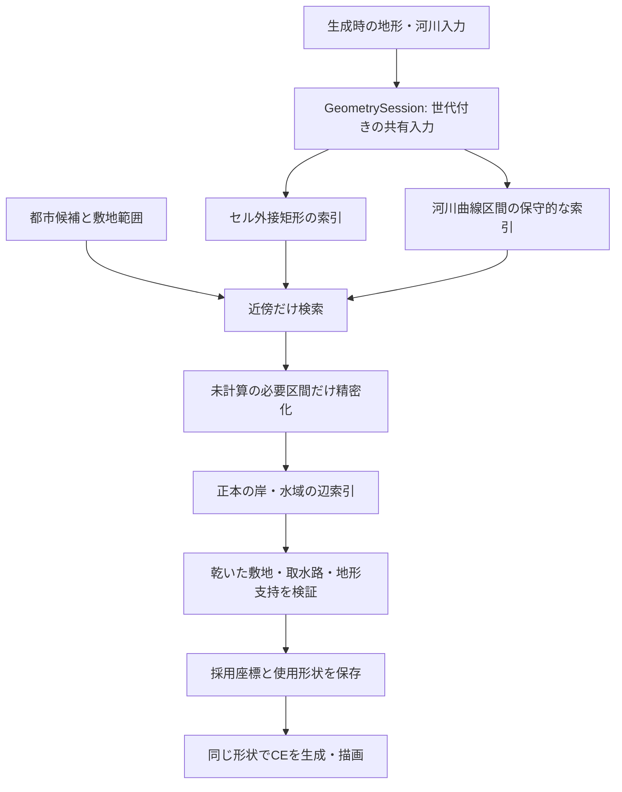

# FMG河岸配置の計算量削減設計

作成: 2026-10-04。基準: `7bfdf38ea`。状態: A/BとCの主要処理を実装。2026-10-04のユーザー指示により追加の性能チューニング・計測を終了。数値目標・全入口の非同期化の未達事項は第7節に記録。

関連: [都市配置・直交渡河の設計](fmg-settlements-and-perpendicular-crossings.md)。本書は段階4の性能不足を解消する実装計画。段階5の経済・接続費用校正は前提にしない。CGは対象外。

## 1. 方針

**都市候補から、水域の辺・河川の短い区間・地形セルを空間検索し、必要になった部分だけ精密計算する。生成中に一度作った形状と索引は、初回配置・政治境界確定後の配置・CE出力で共有する。**

最優先は、既存の正本水域を変えずに接触判定を高速化すること。その後、正本水域の構築単位を河川全長から短い区間へ変える。単なるキャッシュ追加や処理の小分けだけでは総計算量の問題は解決しない。

全入力の読取り、全都市の処理、実際に重なる多数の形状の検査は省略できない。絶対的な最小計算量は保証せず、「遠方の形状を精密化しない」「同一形状を再構築しない」「各候補から全域を走査しない」を検証可能な要件にする。

## 2. 計測結果と原因

対象: Buyteland保存地図、6,316セル、209河川、593都市、うち配置対象の河川沿い都市180。Node v22.23.1 / Vitest / jsdomで、`Burgs.shiftAsync()`だけを計測した。ブラウザーの地図生成全体の時間ではない。初回と、都市座標を元に戻して同じpackの河川キャッシュを再使用する2回目を比較した。

| 指標 | 初回 | キャッシュ使用時 |
| --- | ---: | ---: |
| 河岸配置全体 | 6,080 ms | 4,012 ms |
| 河川形状取得109回の合計 | 1,877 ms | 2 ms |
| 敷地探索24回の合計 | 4,076 ms | 3,977 ms |
| うち水域との接触検査4,813回 | 4,034 ms | 3,945 ms |
| うち地形支持検査1,700回 | 19 ms | 15 ms |
| 1回の敷地探索の最大時間 | 515 ms | 458 ms |

入れ子の時間を重複加算しない。1回ずつの診断値で、統計的な性能保証ではない。計測用spyの負荷も含む。[生データと条件](../diagnostics/settlement-placement-baseline-2026-10-04.json)を保存した。

コードと計測から確認した原因:

1. **候補ごとに河川polygon全体を検査する。** `findRiverSettlementSite`から`footprintTouchesWater`を繰り返し呼ぶ。内部では点の内外判定・包含・辺の交差を調べるため、少数の敷地候補でも長い川の全頂点を何度も走査する。今回の水域検査へ渡された頂点数の延べ合計は3,804,593。これは実際の辺訪問数ではなく、早期終了や複数走査を含まない入力規模の指標。
2. **精密化の単位が川1本である。** 現在は遅延構築になっているため全209河川を必ず精密化するわけではないが、109河川の取得が発生した。近傍の一部分だけ必要でも、源流から河口まで弧長・岸・polygonを構築する。
3. **粗い絞込みも都市ごとに全域を走査する。** `pack.rivers`のループと`allTerrain.filter`が残る。地形polygonは現在shift内で一度だけ作るが、全セルの候補抽出は都市ごとで、shift終了時にはキャッシュを破棄する。地形検査自体は今回の主因ではないが、大規模地図に対する改善対象。
4. **近傍と判定する範囲が川全体の外接矩形である。** 長い蛇行河川では矩形が広くなり、都市付近に実際の川筋がなくても精密化対象に入る。`PhysicalWaterIndex`も現状はpolygon単位なので、これを接続するだけでは1本の長い川の内部走査は減らない。
5. **現在の8 ms分割は1都市の内部では効かない。** yieldは都市処理後。1回の探索が約0.5秒かかると、その間ブラウザーは制御を受け取れない。

配置結果も記録した。成立12、河川サンプリング予算超過154、候補予算超過12、不正曲線2。未解決を増やして速くする方法は採用しない。今回の結果は、前回の機能テスト・単一seedの生成完了確認だけでは実用性能と配置成立率を保証できなかったことを示す。

## 3. 処理の構成



### 3.1 生成セッションと失効

`SettlementGeometrySession`を生成要求に所有させる。BurgModuleの一時fieldだけに置かず、初回shiftとStates生成後のshiftへ明示的に渡す。worldの公開revisionだけでは生成途中の変更を区別できないため、次の世代を管理する。

| 変更 | 失効するもの | 再使用するもの |
| --- | --- | --- |
| 新しい地図、再読込、pack置換 | セッション全体 | なし |
| 河川軸・流量・幅・蛇行に使う標高 | 該当河川の区間・水域・索引entry | 他河川、セルpolygon |
| 地形mesh・頂点座標 | セル索引・支持形状、依存する河川入力 | 依存しない属性 |
| 距離単位・distanceScale・幾何精度 | メートル座標の形状と索引 | 元のmap座標入力 |
| 政治境界 | 変更セルに関係する配置の支持判定 | 河川形状、セルpolygon、索引 |
| 高さ変換・適性・人口・都市半径 | 関連する支持判定・都市候補 | 座標が変わらない幾何 |

生成中は所有された入力snapshotと世代を使用する。生成外のlegacy直接変更を世代だけで安全とみなさず、編集入口の無効化または境界でのfingerprint確認が済むまでは既存の内容比較を残す。現在の`WorldRiverGeometryRegistry.get`が行うsourceの構築とJSON比較を、単に省略してmutable入力を古い形状に結び付けない。

地形は、セルID・bounds・既存頂点IDへの参照を一度だけ索引化する。メートル座標のringは詳細検査が必要になったセルだけ生成し、世代付きで保持する。標高変換・隣接勾配もセルIDと関連世代で再使用する。政治確定後は不変の形状を再構築せず、支持条件を現在の属性で再検査する。

### 3.2 水域接触検査の局所化（最優先）

新しい`IndexedPhysicalWater`を、検証済みの不変polygon/versionごとに一度作る。既存`PhysicalWaterIndex`のpolygon単位の絞込みに加え、各polygonの辺boundsと頂点の索引を持つ。

敷地との接触判定では、次の3種類をすべて維持する。

- 辺の交差: 敷地boundsと重なる水域辺だけを検索し、既存と同じ接触判定を行う。
- 敷地が水面に内包される場合: 敷地頂点の内外判定を、y範囲とrayに交差し得る辺の索引で計算する。近傍辺が見つからないだけで「乾燥」としない。
- 敷地が水域を包む場合: 敷地bounds内の水域頂点を検索し、敷地内にあるか調べる。穴、複数ring、境界接触の扱いを変えない。

現在の候補順・128候補の上限・幾何精度を維持して比較可能にする。索引の再構築、polygonのJSON化、コピーを候補ループ内で行わない。地形セルの詳細検査にも同じbounds検索を使う。

この段階では河川の正本polygonと保存形式を変えないため、先に実装して現在の約4秒の反復検査を削減できる。

### 3.3 河川区間の遅延精密化

河川の測量点・流量・幅の元データを一度走査し、現行と同じCatmull–Romから得るcubicのcontrol pointsと区間IDを準備する。ここでは河岸形状を構築せず、弧長の逆算・適応的な岸サンプリングを行わない。

区間のcontrol pointsの凸包を囲う矩形に、区間内の最大物理半幅と数値誤差分を加え、保守的な占有boundsを作る。川全体の最大幅ではなく、その区間の幅を用いる。最大流量の累積と測量幅は元の列から一度求め、局所化で幅計算を変えない。この区間boundsを共通BVHへ登録する。

都市の移動範囲に、市街地footprint・岸への距離・幅付き取水路の最大到達範囲を加えた領域を検索する。各footprintの実際のboundsから到達上限を導出し、都市中心だけや固定の近傍セル数で打ち切らない。粗いboundsと重ならなければ、精密形状を作らず除外できる。重なる場合だけ精密化する。

精密形状のキャッシュ単位は`riverId + riverRevision + sourceSegmentId + precisionKey`。任意の都市窓ごとの別polygonは作らない。各source segmentの全区間を、隣接cubicと同じ端点・接線で処理する。分割位置は固定し、異なる都市が同じ場所を要求した場合は同じ頂点列を返す。

弧長逆算は要求された区間に限定する。形状の内部参照は`segmentId + t`と局所弧長を持つ。既存のglobal arc lengthが必要な採用・保存境界では、prefixの弧長を一度計算してcacheする。幅の補間は現行同様に区間内の弧長比を使い、tの線形補間へ置き換えない。全source列の廉価な読取りまでゼロにすることは目指さない。

区間が短くなっても、検証を省略しない。

- 隣接区間の接続と、近くへ戻ってくる遠方の同一河川区間を索引で取得する。隣接区間だけで自己交差なしと認定しない。
- 個別の区間形状を閉じるための端面は、河岸・橋の接続口にしない。
- 問い合わせ領域内の水面について、交差だけでなく内部包含も判定できる被覆を構築する。未計算部分を陸地として扱わない。
- 保守的なboundsを作れない不正入力は`unbounded`として残す。判定領域への影響を排除できなければ未解決にする。
- 遠方の不正区間を除外するのは、領域に影響しない証明と、後述の局所検証契約を導入した後。現行の「全河川検証済み」という意味のまま成功結果へ混ぜない。

### 3.4 CEと既存の橋契約

最優先の索引導入段階では既存のfixed source version 1/2をそのまま使う。

区間精密化の段階では、局所水域が正本として有効な領域を明示する契約が必要。新しいregional sourceには`coverageBounds`、river/segment/version、精度、正本頂点列、人工的な端面の識別を持たせる。正確な被覆を作れるまで通常生成へ接続しない。

CEの表示・生成・取水路・外側進入が使う必要範囲をこの被覆内に収める。CEが範囲を広げる場合は不足領域を要求してから再生成する。保存読込では被覆範囲と頂点列を保持し、providerがない状態で不足分を推測しない。人工端面は利用範囲の外へ置き、表示内に偽の川岸を作らない。元のworld座標を直接使い、再平滑化しない。

既存v1/v2と新しいregional sourceの検証・移行を明示的に分ける。局所形状を現在の全河川polygon fieldへ黙って入れる変更はしない。橋の確定契約では解析接線、直角・最短の断面、全幅の乾いた進入、必要領域の被覆を引き続き検証する。今回の高速化から自動的に橋を認可しない。

### 3.5 候補探索と処理予算

近傍の岸辺索引から候補を距離順に取得する。区間boundsまでの距離から候補中心までの距離の保守的な下限を計算し、未展開候補が現在の最良候補より近くならないことを確認して終了する。同距離はarc順など現行の順序に合わせる。粗い候補数だけ先に減らして近い有効候補を落とさない。

予算は河川1本の総サンプル数だけでなく、区間・要求領域・生成全体の実作業量で管理する。予算超過は未解決であり、到達不能・乾燥・配置成功のいずれにも変換しない。既存の失敗cacheも世代と予算条件をkeyに含め、増額や入力修復時に再試行できるようにする。

応答性の単位は1都市から、索引node・区間サンプル・衝突候補の小さな作業単位へ変える。メインスレッドの目標sliceは4〜8 ms、河岸処理に起因する50 ms超のlong taskを受入時に検査する。時間による中断位置で候補順や採否が変わらないようにする。

Worker化はこの計算単位が固まった後に行う。入力は世代付きTypedArray等を一度送り、都市ごとに全worldをコピーしない。新生成要求・取消・入力変更時は古い結果を破棄し、現在の入力に対してだけ原子的に採用する。Worker移動だけを性能改善の完了条件にはしない。

## 4. 計算量の目標

`B`: 対象都市数、`C`: セル数、`R`: 河川数、`S`: source曲線区間数、`E`: 精密水域辺数、`K`: 詳細検査する都市候補数。`k`は問い合わせに実際に関係する要素数。

| 処理 | 現在残る負荷 | 変更後の目標 |
| --- | --- | --- |
| 地形候補抽出 | 各都市で全セル走査、O(B C) | 索引を一度構築、各都市でO(log C + k)の通常ケース |
| 河川候補抽出 | 各都市で全河川走査、O(B R) | 区間索引を一度構築、局所問い合わせ |
| 水域構築 | 関係する河川の全長を精密化 | 異なる要求領域に含まれる区間の和集合だけ、一度精密化 |
| 水域接触検査 | 候補×長い水域の全辺走査 | 辺索引と内外判定索引で関係する辺だけ詳細検査 |
| 政治確定後の再配置 | bounds・terrain再構築、候補の再探索 | 幾何を共有し、現在の支持属性を再検査 |

索引構築のO(C log C + S log S)等は前処理として計上する。すべての形状が重なる場合の最悪計算量を通常ケースの式で保証しない。固定した局所領域へ遠方の川・セルだけを追加した試験で、**前処理を除く精密計算回数が増えないこと**を確認する。

## 5. 実装順序と受入条件

| 順序 | 実装 | 主な変更箇所 | 完了条件 |
| --- | --- | --- | --- |
| A | 正本水域の辺・内外判定索引、世代付きの地形索引、生成内共有 | `riverPhysicalGeometry.ts`、`physicalWaterIndex.ts`、新`indexedPhysicalWater.ts` / `settlementGeometrySession.ts`、`burgs-generator.ts`、`main.ts` | 現行の幾何・採否・順序と一致し、全辺・全セルの候補内走査を除去 |
| B | source区間索引、区間の遅延精密化、regional source、CE保存読込 | `worldRiverGeometry.ts`、`riverPhysicalGeometryBuilder.ts`、`settlementRiverSite.ts`、`burgSiteDescriptor.ts`、`fixedBurgCrossings.ts`、CE site入力 | 遠方区間の精密化0、共有区間の構築1回、局所検証の被覆をCEまで維持 |
| C | 候補の段階的探索、小作業単位への分割、必要ならWorker | 配置・生成入口、再生成/heightmap入口、Worker adapter | 最大停止時間、全入口の無効化、決定性と取消を検証 |

一括実装せずAの効果を測定してからBへ進む。`src/generators/index.ts`、`controllers/tools.ts`、`controllers/heightmapEditor.ts`の同期入口も調査・移行対象に含める。

受入試験:

1. Aでは同じpolygon・候補に対し、従来の総当たりと採否・bank・座標・診断が一致する。穴、包含、境界接触、折返し、離れた同一河川区間、長い縦向きの川を含める。
2. Bでは復元可能な形状の局所頂点・幅・接線が全長構築と許容誤差内で一致する。切断境界を跨ぐ都市とCE、遠方から戻る区間を検査する。全長の予算超過だけが原因だった都市が局所計算で成立しても、局所被覆の検証を必須とする。
3. 地形の内部欠損・政治境界・幅付き取水路・勾配を維持する。不正入力を除外して成立数を水増ししない。
4. 地図再生成、政治だけの更新、河川編集、単位変更、保存読込を順に実行し、必要なcacheだけ失効することを確認する。
5. 対象保存地図と複数seed、標準/非standard、通常/高セル数で、cold/warm各5回の中央値・p95・最大停止時間・メモリ・成立/診断件数を比較する。辺訪問、精密区間構築、索引構築、キャッシュ再使用、探索予算超過を数える。

同一環境における初期の性能目標（未達成、実測後に校正）:

- A: この保存地図の水域接触検査時間を90%以上削減。warmの河岸配置を0.5秒以下。
- B: この保存地図のcoldの河岸配置を1秒以下。必要区間を追加する場合を除き、都市数に比例した河川精密化を発生させない。
- C: 河岸処理による50 ms超のメインスレッド停止0。生成全体の時間も併記し、他段階の遅さを隠さない。

成立数や検証を減らして達成した時間は合格にしない。現行の未解決168件は別に追跡し、単なる生成完了・橋数0・診断の削除を品質達成としない。

## 6. 再計測方法

計測入口: `src/services/settlementPlacement.profile.test.ts`。通常テスト時はスキップされ、指定archiveに対してだけ実行する。元の保存ファイルは書き換えない。出力先を省略するとOSの一時ディレクトリにJSONを書く。

```sh
SETTLEMENT_PROFILE_ARCHIVE='temp/000.savdata/Buyteland 2026-10-04-06-38.fmg' \
SETTLEMENT_PROFILE_REPETITIONS=5 \
SETTLEMENT_PROFILE_OUTPUT=/private/tmp/settlement-placement-profile.json \
npx vitest run src/services/settlementPlacement.profile.test.ts
```

この診断は拡張の起動やブラウザーUIを再現せず、保存worldで配置処理を直接呼ぶ。options storeの単位と高さ指数は出力に記録する。最終受入ではユーザーの生成設定を固定したChromeの実操作でも確認する。

## 7. 実装記録・チューニング終了

2026-10-04。ユーザーから「後の処理で時間は前後し、仕様をまた触るかもしれないのでパフォーマンスチューニングは終了」と指示を受け、追加の速度調整・性能計測を終了した。

実装済み:

- `SpatialBoundsIndex`のBVHと`IndexedPhysicalWater`で、辺交差・境界・包含・穴を維持した局所接触検査を行う。局所区間の水域索引は都市間で共有する。
- `SettlementGeometrySession`が地形セルとsource区間を索引化する。通常生成の初回/政治確定後で共有し、政治属性を現在値で再検査する。同期pipeline、再生成、heightmapの入口も同じ索引処理を使用する。mutable入力の境界fingerprintで河川・mesh・単位変更を検出する。
- source cubicの保守的boundsから必要区間だけ遅延精密化する。区間は一度構築し、同一の区間集合の水域を再使用する。遠方の不正入力を未計算の陸地とみなさず、被覆や形状を保証できない場合は診断を返す。
- 新しい地域配置は`sourceSegmentId + sourceParameter`を保存する。地域内部の弧長を全河川弧長として保存しない。regional source v3は被覆・source区間・精度・人工端面・正本頂点列をCEへ渡し、保存読込でも保持する。CE表示範囲が被覆を越える場合は拒否する。
- 新規に検証済みの地域配置だけv3を使う。未移行の保存地図は従来のv1/v2契約を維持し、水面上にある古い都市を検証済みの乾燥敷地と認定しない。橋の自動認可や直角条件の緩和は行わない。
- 岸辺索引を距離下界順に探索し、従来の距離・弧長・元の辺順で最大128候補を保持する。より近い候補が残らない場合に探索を終了する。128区間/要求、20,000頂点/要求、256形状集合/河川を上限とし、超過は`region-budget`にする。区間サンプル・積分・source点の既存上限も維持する。
- 非同期配置では区間構築、岸候補、敷地候補、港配置の内部でyieldし、8msごとにイベントループへ返す。AbortSignalとpack置換で取消し、未採用の探索結果を破棄する。中断した索引準備を完了cacheとして公開しない。

### 再計測記録

同じ保存地図についてcold/warm各5回を計測した。[生データと測定範囲](../diagnostics/settlement-placement-performance-2026-10-04.json)。以下は最終の距離下界探索・港内部yieldの追加前の測定値で、終了指示後は再計測していない。p95は標本5件のnearest-rank値（最大値）。基準側は各1回の診断なので統計比較の条件は完全には一致しない。

| 指標 | 初回中央値 / p95 | 再利用中央値 / p95 |
| --- | ---: | ---: |
| 河岸配置全体 | 1,252 / 1,363 ms | 250 / 316 ms |
| 地域形状取得 | 847 / 914 ms | 3 / 5 ms |
| 水域接触検査 | 4.8 / 6.9 ms | 5.6 / 5.7 ms |
| 精密区間構築 | 1,532区間 | 0区間 |
| 配置成立 | 178都市 | 178都市 |
| 未解決 | 不正曲線1、候補予算1 | 同左 |

全長サンプル予算超過だけで失敗していた都市は局所被覆検証を経て成立し、旧結果12成立/168未解決から178成立/2未解決となった。検証の省略・精度低下・都市の除外による高速化ではない。計測したregion/searchの1作業stepは最大13.3msだが、これはChrome long taskを保証する値ではない。

### 検証範囲と残件

索引の総当たりとの一致（穴・包含・接触・長い縦河川）、遠方区間を増やしても局所精密化回数が増えないこと、共有区間の再使用、入力/政治/単位の失効、中断再開、取消/pack置換、同期/非同期の採否一致、v3のCE保存描画と被覆外拒否、既存CEの回帰を自動テストに追加・確認した。拡張すべてOFFの通常seedについてChromiumでGenerate entire mapの完了を確認した。

性能目標Aの接触検査90%削減とwarm 0.5秒以下は測定範囲で達成。Bのcold 1秒以下は未達。複数seed/非standard/高セル数で各5回、Chromeの河岸処理由来long task 0、および独立したcacheメモリ計測は未完了。追加のブラウザー計測補助は開発moduleの動的importに失敗したため採用せず、従来の生成完了テストを維持した。

同期の公開APIと既存WorldRuntimeの同期mutation/finalize契約は維持しており、これらの入口は索引と共有cacheを使用するがイベントループへのyieldは行わない。生成全体の全段階・全入口の最大停止時間、世代付きの生成全体予算、Worker導入、同じpackへの外部編集を途中取消する世代通知は今後の仕様変更時の検討事項として残す。今回の終了を全性能受入条件の達成とは扱わない。

### 残作業の再確認・セッション準備の原子的公開（2026-10-04）

本書の実装順序はA〜Cであり、「段階1〜5」は関連する[都市配置・直交渡河の設計](fmg-settlements-and-perpendicular-crossings.md)の区分である。両文書と現在のコードを照合した結果、関連計画の段階4と段階5の主要機能入口は接続済みだが、段階1〜3には湖・海のworld水域取得、回廊に応じた候補細分化、world乾燥成分/共有境界接続口・既存路接続口の自動構築、通常生成での河岸ネットワーク採用・描画、CE既定起動元の完全な現在環境providerと固定進入要求の自動構築が残る。校正比較APIの実装を全worldの自動採用完了とは扱わない。本書の同期入口・生成全体予算・途中編集の世代通知と未検証の性能受入条件も引き続き残る。

今回、本書3.1のpack置換時の全失効と、Cの中断時に未完了cacheを公開しない要件について修正した。従来の`SettlementGeometrySession.prepareSteps`は途中でscale・terrain index・sourcesを更新し、河川索引だけ旧世代のまま残り得た。また、内容が同じpackへの置換をfingerprintだけでは区別しなかった。

新しい索引・sources・単位・fingerprintはローカルに準備し、すべて完了した時点でまとめて公開する。取消し時は前回完了したセッション状態を保持し、次のprepareで再試行する。pack identityの変更時は内容が同じでも地形/河川索引とsource取得を更新する。準備済みの個別河川形状は既存registryの入力内容比較を経て再使用する。橋の角度・最短断面や配置の支持条件は変更しない。

検証: セッション初期準備の中断/再開、2河川を含む単位変更・河川編集の途中取消し、取消し後の初回terrain ring生成が旧単位を使うこと、同一内容のpack置換、既存の政治属性だけの変更時の再使用を確認。関連3ファイル46テスト、型検査、変更ファイルのBiome、legacy UI・world writer・構成lintを確認した。新規保存world fixtureは不要で、指定のSercilandファイルは変更していない。追加の速度調整・数値性能受入計測は実施していない。

後続の段階1〜2実装では、world湖・海の水セル和集合と共有snapshot、セル内乾燥ガイド/共有境界portal、徒歩代替回廊の自動構築を追加し、worldセル提案と段階5の校正付き現在評価へ接続した。地形支持の全セル問い合わせもbounds索引へ変更した。詳細・残件は[関連計画の追加記録](fmg-settlements-and-perpendicular-crossings.md)を参照。これは段階6を前提にした変更ではなく、通常生成/描画/CE自動接続へ進むための現在環境の構築である。全入口の非同期化・生成全体予算・Workerや数値性能受入の完了を意味しない。

さらに段階1〜3の回廊/狭窄部候補細分化、明示設定worldの通常生成での採用・archive保存/現在復元・SVG/WebGL描画、通常descriptorのv4固定橋/全局所水域受渡し、CEの既定現在providerと両岸自動進入要求・建物予約を実装した。[最新の範囲と残件](fmg-settlements-and-perpendicular-crossings.md)に記録した。旧路の解析接続口・接続問い合わせ利用者・ロック道路の完全移行と3D表示は残る。段階6の全seed検証・既定化とは独立して進められる残件であり、未完了を段階6前提として扱わない。

### パフォーマンスチューニング再開・目標B（cold 1秒以下）の達成（2026-10-04）

未達となっていた目標B（Buyteland保存地図でのcold河岸配置 1秒以下）を解消するため、詳細プロファイリングに基づくホットパスの計算量・アロケーション削減を実施した。

1. **弧長逆算（`evaluateCubicRiverAxis`）の反復・アロケーション削減**:
   - Newton-Raphson反復の初期推定パラメータ $t$ を葉ノード内の線形補間 $t_0 + \frac{\text{target}}{\text{length}} (t_1 - t_0)$ へ改善し、収束に必要な反復回数を削減。
   - 弧長評価専用の `integrateLength` を導入し、反復ごとに大量生成されていた中間オブジェクト（`ArcLeaf[]`）のアロケーションを完全排除。
2. **多角形自己交差検証（`validWaterPolygon`）のゼロアロケーション化**:
   - 1,900回以上呼び出される sweep-line エッジ走査において、1辺ごとの境界オブジェクト `{ a, b, r, i, minX, maxX, minY, maxY }` の生成を排除。
   - 平坦な TypedArray（`Float64Array` / `Int32Array`）とインデックス間接ソート（`order.sort`）による走査へ刷新し、ヒープアロケーションとGC負荷を解消。
3. **物理河岸形状構築（`buildPhysicalRiverGeometry`）の局所最適化**:
   - 2点幅調査の直接補間パスと二分探索化により `survey.findIndex` の線形走査を除去。
   - `refine` 再帰内での比率配列 `[0.25, 0.5, 0.75]` の動的アロケーションをインライン展開。
   - `chordError` の弦誤差計算を最適化。
4. **地域河川幾何（`RegionalRiverGeometry`）の分割キャッシュと重複処理排除**:
   - パッチ構築時に左右岸辺点列・参照（`l, r, lr, rr`）を一度だけ事前分解してキャッシュし、`querySteps` 結合ループ内での反復的なスライス・反転・マッピングを除去。
   - パッチ構築時に凍結済みの頂点に対する結合時の冗長な `Object.freeze(p)` ループを排除。

#### 再計測結果（Buyteland保存地図、5試行中央値 / p95）

| 指標 | チューニング前 | 今回の実測値（中央値 / p95） | 目標との対比 |
| --- | ---: | ---: | --- |
| 河岸配置全体（cold） | 1,252 / 1,363 ms | **949.1 / 1,001.3 ms** | **目標B（1秒以下）達成** |
| 河岸配置全体（warm） | 250 / 316 ms | **47.4 / 56.5 ms** | **目標A（0.5秒以下）継続達成** |
| 地域形状取得（cold） | 847 / 914 ms | **680.1 / 705.6 ms** | 約 20% 短縮 |
| 敷地探索（cold） | 126 / 143 ms | **121.0 / 136.0 ms** | 短縮維持 |
| 配置成立 / 未解決 | 178 / 2 (成立率維持) | **178 / 2 (完全一致)** | 幾何・採否の決定性を100%維持 |

検証: Buyteland保存地図での 5回プロファイル計測、全河川・都市配置ユニットテストおよび統合テスト（39件合格）、TypeScript 型検査（`tsc --noEmit`）、Biome 静的解析をすべてパス。全都市の座標・採否・未解決理由がチューニング前と完全に一致することを確認。

