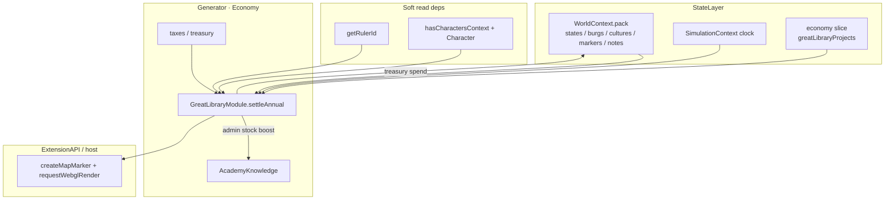
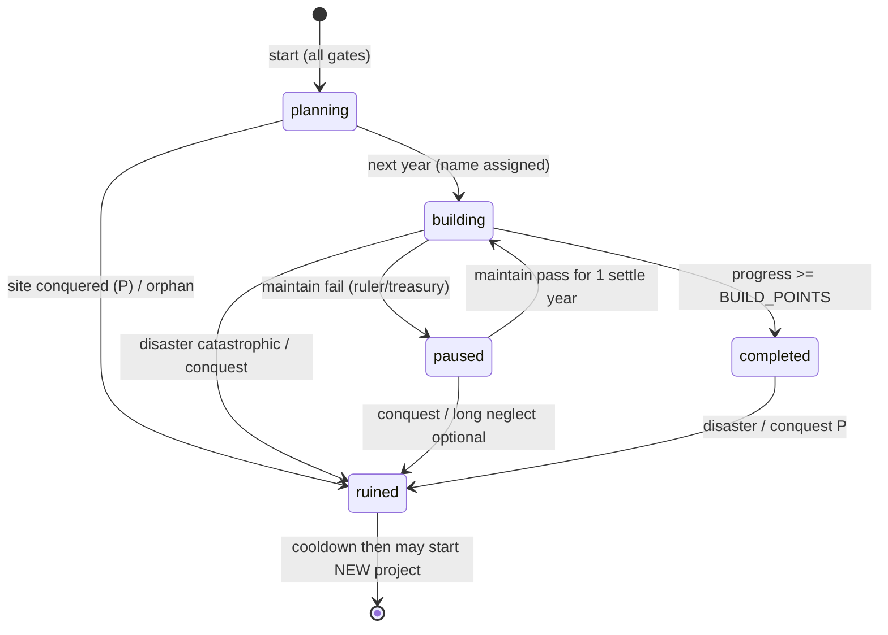

# 大図書館 (Great Library / Library of Alexandria) システム設計

| 項目 | 値 |
| --- | --- |
| 文書 | `docs/plan/great-library.md` |
| 著者 | (AI design pass; maintainers TBD) |
| 日付 | 2026-08-02 |
| 改訂 | 2026-08-13 r5（ギルド/技術蓄積システム側の進展を現状監査に反映: tick順修正、GuildChapters・個人技能熟練レイヤーを追記。設計判断そのものは無変更） |
| 状態 | **Draft** |
| 関連 | [knowledge-guild-system.md](./knowledge-guild-system.md)、[states-personality.md](./states-personality.md)、[state-treasury-department-budget.md](./state-treasury-department-budget.md)、[urban-construction-industry.md](./urban-construction-industry.md)、[shipbuilding.md](./shipbuilding.md) |

---

## Overview

知を重んじる文化を持ち、知に優れ知を重んじる統治者が在位し、国家が財政的に裕福なとき、その国家が首都にアレクサンドリアの大図書館に類する**王室庇護の大図書館**を着工する仕組みを設計する。完成は即時ではなく、複数年・複数フェーズの国家プロジェクトとして進行し、途中で戦争・征服・火災・統治交代により中断・破壊されうる。

データ所有は **Economy 拡張**に置き、既存の知識4層（Guild / Academy / StateSecret / MartialDiscipline）と印刷ギルド（`printing`）・`Books` 財・`state.treasury` 投資パターン・`economy.tick` の年次 `settleAnnual` 自己ゲートに接続する。

**v1 の真の垂直スライス**（実装可能で効果が観測できる最小集合）:

1. 三重条件での着工判定
2. 複数年の treasury patronage 建設（pause/resume 含む）
3. 完成時の **Academy `administration` stock ブースト**（唯一の既存ボーナス消費者への接続）
4. 地図 **marker + note**（`ExtensionAPI` 経由）
5. 征服時の破壊/撹乱

`naturalPhilosophy` ストック蓄積と Overview 表示は PR4 で載せるが **ボーナス消費者は作らない**。Books 市場需要フックは **PR4 stretch**（未接続なら Overview の flavor のみ）。

---

## Background & Motivation

### 現状監査（コード参照）

| 項目 | 現状 | 参照 |
| --- | --- | --- |
| アカデミー | `SCHOLARLY_KNOWLEDGE_DOMAINS = ["administration"]` のみ。`naturalPhilosophy` 未配線 | `academyKnowledgeTypes.ts` |
| Academy settle | 頭数 EWMA、`ACADEMY_SATURATION_WORKERS = 8`、`ACADEMY_ADOPTION_RATE = 0.15`、`ACADEMY_DECAY_RATE = 0.15`、`ACADEMY_BONUS_MAX = 0.2`、征服 `ACADEMY_CONQUEST_DISRUPTION_PENALTY = 0.4` | `academyKnowledge.ts` |
| StateSecret 支出 | `STATE_SECRET_BUDGET_SHARE_OF_TREASURY = 0.05`、`STATE_SECRET_TARGET_ANNUAL_SPEND = 20`（満カバレッジに treasury ≥ 400 が必要） | `stateSecretKnowledge.ts` |
| Tick 順（2026-08-13 再監査で修正） | `GuildKnowledge → GuildChapters → GuildSuccession → AcademyKnowledge → StateSecretKnowledge → MartialDisciplineKnowledge → MartialIndividualMastery → GuildTreasury`。2026-08-02 設計時点から `GuildChapters`（GuildKnowledge直後）と `MartialIndividualMastery`（MartialDisciplineKnowledge直後）が新規挿入された。**Academy↔StateSecret の隣接関係（GreatLibrary の挿入点）は不変** | `economy/index.tsx` |
| 個人技能熟練レイヤー（2026-08-13 追記・新設） | Guild層に人物単位の熟練度が追加された: `individualSkillMastery.ts`（`CharacterDomainSkill`、domain=blacksmithing/smelting/weaving/tailoring/swordsmanship/archery/horsemanship）、`martialIndividualMastery.ts`（named commander の swordsmanship/archery、`MartialDisciplineKnowledge`直後にtick）。**scholarly domain（administration/naturalPhilosophy）には個人熟練レイヤーが存在しない**——Academy 層は本設計時点と同じ頭数集計 EWMA のみで、KD-3/PR4 の前提に影響なし | `individualSkillTypes.ts`、`individualSkillMastery.ts`、`martialIndividualMastery.ts` |
| masonry ギルド知識の消費先（2026-08-13 追記） | `GuildKnowledgeStock(domain="masonry")` が `urbanWaterSystem.ts` / `innFacilities.ts` / `urbanWaterTech.ts` の建設効率へ接続済み（本設計時点は未接続だった）。KD-6/較正表の「masonry 乗数は v1 で入れない」判断はそのまま維持するが、将来 stretch で接続する際の実装済み前例として記録 | `urbanWaterSystem.ts` |
| 統治者 | `getRulerId(state)`（nobilityContext）。Characters: `skills.learning`、personality、`CommitmentKind` に scholarship 無し | `nobilityContext.ts`、`characterTypes.ts` |
| Economy→Nobility/Characters | 既存: `treasuryAllocation.ts` が `getRulerId`、`guildSuccession.ts` が Character 型 | 同上 |
| Characters ガード | `hasCharactersContext()` | `charactersContext.ts` |
| Culture | `CultureType` = Generic/Hunting/Highland/River/Lake/Naval/Nomadic のみ。知識フィールド無し | `models.ts` |
| Treasury snapshot | `getTreasuryAllocationSnapshots()` / `domesticIncome` は **セッション内メモリ**（`_snapshotByState`）。`clearTreasuryAllocationSnapshots` で regen 時クリア。永続化されない | `treasuryAllocation.ts` |
| StrategicGoal | `"siege" \| "raid"` のみ | `simulationContext.ts` |
| 造船キュー | `SHIPYARD_BUILD_POINTS_PER_YEAR = 2`、progress 累積 | `shipClasses.ts` / `shipyardQueue.ts` |
| 征服フック | `captureBurg` → 新規征服のみ `applyConquestDisruption(burgId)` | `localDefense.ts`、`conquestDisruption.ts` |
| Markers | `pack.markers` + notes。`createMarker` は `worldRuntime.ts` のみ。**`"markers"` は `WEBGL_MANAGED_SVG_LAYER_IDS`**（SVG overlay ではない） | `hybridLayerPolicy.ts`、`worldRuntime.ts` |
| WebGL 更新 | `ExtensionAPI.requestWebglRender()` → `scheduleWebglUpdate`（`app.ts`）。Economy 既存利用: `goods-editor.ts` | `extension-api.ts` |
| Economy slice | `getSliceArray` / `setSliceArray` → `simulation.extensions.economy`。`validateEconomySlice` は既知フィールド中心、未知配列は現状パススルー | `economyContext.ts`、`extensionStateSlices.ts` |
| printing / Books | `printing` ドメイン、Books recipes | `guildKnowledgeTypes.ts`、`goods-generator.ts` |

### 痛点

- 知識の「日常蓄積」はあるが、王室庇護の歴史的威信プロジェクトが無い。
- `naturalPhilosophy` の頭数源が無く Academy Phase 3 残件が止まっている。
- knowledge-guild §8.1 決定 6 / Phase 8 の文化バイアス受け皿が未定義。

---

## Goals & Non-Goals

### Goals

1. **三重条件**を明示エンコード: (a) 文化が知を重んじる (b) 統治者が知に優れかつ知を重んじる (c) 国家が建設可能なほど裕福。
2. **着工〜完成が複数年**（較正済み 8〜15 年）。費用・pause/resume・中断リスク。
3. 既存知識スタック（Academy / 征服撹乱 / treasury 投資パターン）と接続。
4. 拡張境界: Economy コア所有、Nobility/Characters は読み取りソフト依存。
5. 完成効果が **実装可能な形で**意味を持つ（administration ブースト + marker が本丸）。
6. アレクサンドリア的フレーバー: 王室庇護、収集、学者、火災/戦争脆弱性、ROI より威信。

### Non-Goals（v1）

- フル Culture 拡張。`knowledgeValue` の薄いフィールドのみ。
- 新 `CommitmentKind: "scholarship"` の必須化。
- 汎用 Wonder / Great Work フレームワーク。
- Books 市場需要の本接続（stretch）、交易ルート強制徴収。
- `naturalPhilosophy` の税金/生産ボーナス消費者発明。
- 教会 network、技術窃取の完全諜報、3D 建物結合。
- プレイヤー強制着工サンドボックス（PR7 任意）。

---

## Key Decisions

### KD-1: データ所有は Economy、判定は年次 settle 内で完結

| 選択肢 | 評価 |
| --- | --- |
| A. Economy 所有 + Economy が条件判定 | **採用** |
| B. Nobility StrategicGoal | StrategicGoal は軍事専用。不採用 |
| C. 独立 GreatWorks 拡張 | treasury/academy から遠い。不採用 |

Nobility/Characters 無効または `hasCharactersContext() === false` または統治者欠落/死亡時は着工しない（ソフト依存）。Economy 無効時はシステム不在。

### KD-2: 文化は `Culture.knowledgeValue: number`（0..1）

| CultureType | `KNOWLEDGE_VALUE_PRIOR` |
| --- | --- |
| Generic | 0.45 |
| River / Lake | 0.50 |
| Naval | 0.48 |
| Highland | 0.40 |
| Hunting | 0.28 |
| Nomadic | 0.22 |

生成: `clamp01(gauss(prior, 0.12))`。閾値 **`GREAT_LIBRARY_CULTURE_MIN = 0.55`**。

ヘルパ **`getCultureKnowledgeValue(culture)`**: **host 側専用**モジュール `src/utils/cultureKnowledgeValue.ts`（prior 表 + getter）。`knowledgeValue` が有限ならそれを、でなければ prior（セーブ互換）。`cultures-generator.ts` と Economy の両方がここを import する。**Economy に prior 表を置かない**（core generator → economy 依存を禁止）。すべての culture 生成・複製経路で永続フィールドを埋める（§API / PR1）。

### KD-3: 統治者は合成スコア（raw `skills.learning`）

**スキル読み取り**: v1 は **raw `character.skills.learning`** を使う（`treasuryAllocation` / `guildSuccession` と同型）。`api.getEffectiveSkill` は使わない（船の engineering 特例と揃えない——Economy の既存キャラ読みは raw が支配的）。明示的な設計選択。

#### Theocracy 判定（**製品決定 r4**）

神権国家だけ piety を values に入れる。全政体共通ではない。

判定は Nobility の `isReligiousForm`（`characterLifecycle.ts`）の **form / formName 枝のみ** を使う。`primarySkill === "learning"` 枝は中央官職の宗教ロール用であり **国家形態判定には使わない**。

```typescript
/** Dominant codebase pattern: characterLifecycle.ts isReligiousForm form branches. */
function isGreatLibraryTheocracyState(state: {
  form?: string;
  formName?: string;
}): boolean {
  if (state.form === "Theocracy") return true;
  if (state.formName && ["Theocracy", "Holy State", "Bishopric"].includes(state.formName)) {
    return true;
  }
  return false;
}
```

- 主キー: `state.form === "Theocracy"`（`BASELINE_ALLOCATION_BY_FORM` / taxes と同型の form 文字列）
- 副キー: `formName` が `Theocracy` / `Holy State` / `Bishopric`（称号テーブル `titleTable.ts` の Theocracy 系と一致）

#### valuesKnowledge 式

```
excellence = skills.learning / 100
aff = commitmentScholarshipAffinity(character)   // 0..1
rat = personality.rationality / 100
zeal = personality.zeal / 100
greedInv = 1 - personality.greed / 100
piety = personality.piety / 100

// Non-theocracy（従来どおり・変更なし）
valuesKnowledge =
  0.40 * rat
+ 0.25 * aff
+ 0.20 * zeal * aff
+ 0.15 * greedInv

// Theocracy only（重み再配分で合計 1.0 を維持。piety を独立項として追加）
valuesKnowledge =
  0.30 * rat
+ 0.15 * piety
+ 0.25 * aff
+ 0.20 * zeal * aff
+ 0.10 * greedInv

rulerScore = excellence * (0.35 + 0.65 * valuesKnowledge)
```

**意図**: 神権国家では信仰心（`piety`）が「知を重んじる」patronage の一部になる（聖典・写本・神学図書館フレーバー）。合理性を 0.40→0.30、反強欲を 0.15→0.10 に下げて枠を作り、piety 0.15 を載せる。非神権では piety を **読まない**（高 piety の世俗王が自動で有利にならない）。

`commitmentScholarshipAffinity`（primary/secondary を `weight` 欠損時 1.0 で加重平均）:

| CommitmentKind | affinity |
| --- | --- |
| ideology, craft, domain | 1.0 |
| office, state, faith | 0.55 |
| nation_culture, people | 0.35 |
| family, house, liege, patron, comrades | 0.30 |
| wealth, self, hedonism, rivalry | 0.0 |
| （将来）scholarship | 1.0 |
| その他（未列挙） | 0.25 |

**ガード（eligibility 必須）** — `payRulerHouseholdStipend`（`treasuryAllocation.ts`）と同型:

1. `hasCharactersContext()` が false → `rulerOk = false`
2. `getRulerId(state)` が `undefined` → false
3. `getCharacters().find(c => c.i === rulerId && !c.dead)` が無い → false（**`pack.characters` を直接読まない**；`getCharacters()` が canonical）
4. Nobility コンテキスト未初期化でも `getRulerId` は legacy を読むが、キャラ不在なら false

**閾値**:

- `GREAT_LIBRARY_RULER_LEARNING_MIN = 65`
- `GREAT_LIBRARY_RULER_SCORE_MIN = 0.42`

**ボーダーライン例（PR2 テスト行列）** — 実装テストは純関数の出力を期待値にする（表の手書きコピー禁止）。非神権は piety を式に入れない。

| form | learning | rat | piety | commitment | zeal | greed | values | rulerScore | 判定 |
| --- | --- | --- | --- | --- | --- | --- | --- | --- | --- |
| Monarchy | 80 | 70 | — | craft 1.0 | 50 | 40 | ≈0.720 | ≈0.654 | pass |
| Monarchy | 65 | 60 | — | craft 1.0 | 40 | 50 | ≈0.620 | ≈0.489 | pass |
| Monarchy | 90 | 40 | — | wealth 0.0 | 30 | 95 | ≈0.168 | ≈0.413 | fail（values） |
| Monarchy | 64 | 90 | — | ideology | 80 | 20 | — | — | fail（learning フロア） |
| Monarchy | 75 | 50 | — | family 0.30 | 40 | 40 | ≈0.389 | ≈0.452 | pass |
| Monarchy | 70 | 45 | — | family 0.30 | 30 | 50 | ≈0.335 | ≈0.397 | fail |
| **Theocracy** | 70 | 45 | **80** | faith 0.55 | 50 | 40 | **≈0.508** | **≈0.476** | **pass**（高 piety） |
| Theocracy | 68 | 40 | **25** | faith 0.55 | 40 | 50 | ≈0.356 | ≈0.395 | fail（低 piety） |

Theocracy pass 行の検算:  
`0.30*0.45 + 0.15*0.80 + 0.25*0.55 + 0.20*0.50*0.55 + 0.10*0.60 = 0.5075`  
`rulerScore = 0.70 * (0.35 + 0.65*0.5075) ≈ 0.476` ≥ 0.42。

### KD-4: 裕福さは「建設可能 patron 余力」——`yearsOfReserve` は使わない

#### 問題（改訂理由）

`treasury / domesticIncome` を「準備年数」と呼ぶのは誤りに近い。`collectTaxes()` は収入加算後に軍事維持・俸給を差し引くため、健全な大国でも `treasury/income` はしばしば ≪ 1。また `getTreasuryAllocationSnapshots()` の `domesticIncome` は **永続化されないセッション内メモリ**であり、ロード直後は `Taxes.collectTaxes()` 再実行まで空になりうる。

#### 採用ゲート（着工）

**着工の hard AND**（これだけが `eligible` を false にする）:

| # | 条件 | 定数 |
| --- | --- | --- |
| W1 | `treasury >= GREAT_LIBRARY_TREASURY_FLOOR` | **300** |
| W2 | 予測カバレッジ `projectedCoverage = min(1, (treasury * BUDGET_SHARE) / TARGET_ANNUAL_SPEND) >= MIN_START_COVERAGE` | **0.85** |
| W3 | 非戦時: `diplomacy` に `"Enemy"` が無い | `REQUIRE_PEACE_TO_START = true` |

W1+W2 の含意: 既定定数では `BUDGET_SHARE = 0.10`、`TARGET_ANNUAL_SPEND = 30` のため、W2 満額には `treasury >= 30/0.10 = 300`。つまり **FLOOR と満カバレッジが一致**し、「着工できる国家 ≒ 広告工期で終えられる国家」になる。

**非ゲート信号（Overview のみ・`eligible` に含めない）**:

| 信号 | 意味 |
| --- | --- |
| `supplyStrain` | 定義されており `>= 0.35` なら Overview に警告表示するだけ。着工は **ブロックしない** |
| `domesticIncome` snapshot | あれば表示。ロード直後未収集なら "n/a" |

**収入 snapshot は着工ゲートに使わない。**

維持中（building）の財政ゲートは §状態機械を参照（着工より緩い）。

### KD-5: 建設 progress と 8〜15 年の較正

#### 定数（改訂後）

```typescript
export const GREAT_LIBRARY_CULTURE_MIN = 0.55;
export const GREAT_LIBRARY_RULER_LEARNING_MIN = 65;
export const GREAT_LIBRARY_RULER_SCORE_MIN = 0.42;

export const GREAT_LIBRARY_TREASURY_FLOOR = 300;
export const GREAT_LIBRARY_MIN_START_COVERAGE = 0.85;
export const GREAT_LIBRARY_REQUIRE_PEACE_TO_START = true;

export const GREAT_LIBRARY_BUILD_POINTS = 12;
export const GREAT_LIBRARY_BUDGET_SHARE = 0.10; // of treasury per building year
export const GREAT_LIBRARY_TARGET_ANNUAL_SPEND = 30; // full coverage
export const GREAT_LIBRARY_PROGRESS_PER_FULL_COVERAGE = 1.0; // points / year at coverage=1
// planning year: no treasury spend, no progress (name/site only).
// First building year: full spend + full progress (no half-spend promotion year).

export const GREAT_LIBRARY_MAINTAIN_TREASURY_FLOOR = 150; // building/paused resume
export const GREAT_LIBRARY_MAINTAIN_COVERAGE = 0.40; // min projected coverage to stay building
export const GREAT_LIBRARY_MAINTAIN_RULER_SCORE = 0.315; // 0.75 * RULER_SCORE_MIN
export const GREAT_LIBRARY_WARTIME_PROGRESS_FACTOR = 0.4; // if war mid-build (no auto-pause)

export const GREAT_LIBRARY_FIRE_CHANCE_BUILDING = 0.01;
export const GREAT_LIBRARY_FIRE_CHANCE_COMPLETED = 0.008;
export const GREAT_LIBRARY_FIRE_CHANCE_PAUSED = 0.005; // still at risk, lower activity
// planning: no fire roll

export const GREAT_LIBRARY_COMPLETION_ACADEMY_BOOST = 0.25;
export const GREAT_LIBRARY_SCHOLAR_WORKERS_AT_FULL = 6;
export const GREAT_LIBRARY_REBUILD_COOLDOWN_YEARS = 20;
export const GREAT_LIBRARY_PAUSE_DECAY_AFTER_YEARS = 5; // then progress *= 0.95 / year
export const GREAT_LIBRARY_ENDOWMENT_MAINTAIN_SPEND_FACTOR = 0.25; // of TARGET after complete
```

比較: StateSecret は `STATE_SECRET_BUDGET_SHARE_OF_TREASURY = 0.05` / `STATE_SECRET_TARGET_ANNUAL_SPEND = 20`（満額に treasury ≥ 400）。大図書館の着工フロア 300 は「SS 満額投資ができる国よりやや低いが、SS より高い年額ターゲットを 10% 抜きで賄える国」。

#### 較正表（`progress += coverage * PROGRESS_PER_FULL_COVERAGE`、戦争なし、毎年 treasury が支出後に同水準へ回復する単純モデル）

**カレンダー確定（Option C）**:

1. **Year 0 (`planning`)**: 支出なし・progress なし。翌 settle で `building` へ昇格し正式名確定。
2. **Years 1–12 (`building`)**: 毎年 full-coverage なら progress +1.0。`BUILD_POINTS = 12` に達した年に完成。
3. **合計カレンダー年**: **1 + 12 = 13 年**（planning 1 + progress 12）。半額支出の「命名専用 building 年」は設けない。

| 期首 treasury | spend = min(t×0.10, 30) | coverage | 年 progress | progress 年数 | カレンダー合計 |
| --- | --- | --- | --- | --- | --- |
| 250 | （着工不可: FLOOR 未達） | — | — | — | — |
| 300 | 30 | 1.00 | 1.00 | **12** | **13**（+1 planning） |
| 400 | 30 | 1.00 | 1.00 | **12** | **13** |
| 600 | 30 | 1.00 | 1.00 | **12** | **13** |
| 300、毎戦時 | 30 | 1.00×0.4 | 0.40 | **30** | **31**（長い——和平推奨） |
| 300、3 年 pause 後再開 | — | — | — | 12 + pause | 13 + pause |

**表現の区別**:

- **着工適格 (eligible to start)**: 三重条件 + W1–W3。
- **広告工期で完成 (on-schedule finish)**: 平和・patronage 維持なら **progress 12 年 + planning 1 年 = 13 カレンダー年**が標準。pause/戦争で伸びる。

treasury が建設中に 150 未満へ落ちると pause（支出停止）。回復して maintain ゲートを 1 年満たせば resume。

### KD-6: 完成効果——v1 本丸 vs stretch

| 効果 | v1 本丸 | PR | 備考 |
| --- | --- | --- | --- |
| サイト Academy `administration` stock `min(1, stock+0.25)` | ✅ | PR3/4 | 既存 `getAcademyBonus` → poll tax に波及 |
| Marker + note | ✅ | PR6（plumbing は PR3.5） | WebGL managed + `requestWebglRender` |
| Multi-year spend / pause | ✅ | PR3 | |
| 征服撹乱 | ✅ | PR5 | |
| `naturalPhilosophy` 頭数 + stock 蓄積 | ◐ 観測可能 | PR4 | **UI 必須**。`getAcademyBonus(..., "naturalPhilosophy")` は **呼ばない** |
| Books 市場需要 mult | stretch | PR4 optional | 接続先未確定なら Overview flavor のみ |
| 外交威信 | ❌ | 将来 | note テキストのみ |

### KD-7: 破壊・中断（詳細は状態機械・災害節）

- 統治者死亡 → **破棄しない**。patronage 停止 → `paused`。
- サイト征服 → progress/endowment ペナルティ、所有権は自動移譲しない。
- 火災 → 深刻度ティア。

---

## Proposed Design

### アーキテクチャ



### 状態機械



#### 遷移表

| From | To | 条件 | 副作用 |
| --- | --- | --- | --- |
| — | `planning` | eligibility 全合格、当該 state に active プロジェクト無し | `startedYear`、`patronRulerId`、`progress=0`、site=`state.capital`、`name` 仮。**この年は treasury 支出なし** |
| `planning` | `building` | 翌年 settle に到達（planning は最大 1 年） | 正式名確定。**昇格そのものが progress を生まない**；同年の `tryBuildYear()` が通常どおり full spend + progress を行う（半額ルールなし） |
| `planning` | `ruined` | サイト征服で catastrophic 扱い、または burg/state 消滅 | |
| `building` | `building` | maintain 合格 | spend、progress+=…、fire ロール |
| `building` | `paused` | maintain 不合格（統治者スコア / 死亡 / treasury / coverage） | **spend なし、progress 増なし**。`pausedSinceYear` 記録 |
| `building` | `completed` | `progress >= BUILD_POINTS` | completion フック |
| `building`/`paused` | `ruined` | 征服/災害ティア | marker 廃墟化 |
| `paused` | `building` | **その年の maintain ゲートを満たす**（1 年判定で即 resume） | `pausedSinceYear` クリア |
| `completed` | `ruined` | 災害 catastrophic / 征服 P | endowment 破棄扱い |
| `ruined` | — | 同一 state は `completedYear/ruinedYear + REBUILD_COOLDOWN` 後に新規 planning 可 | 新 `id` の別プロジェクト |

#### Maintain ゲート（building 継続 / paused→building）

| 条件 | 内容 |
| --- | --- |
| M-ruler | 生存統治者かつ `rulerScore >= MAINTAIN_RULER_SCORE`（学習フロアは着工時のみ厳格。維持は score のみ） |
| M-treasury | `treasury >= MAINTAIN_TREASURY_FLOOR` (150) |
| M-coverage | `projectedCoverage >= MAINTAIN_COVERAGE` (0.40) |
| 戦争 | maintain 失敗には**しない**。代わりに progress に `WARTIME_PROGRESS_FACTOR` |

#### Pause 中の挙動

| 項目 | 挙動 |
| --- | --- |
| treasury 支出 | **なし** |
| progress 増加 | **なし** |
| progress 減衰 | `paused` が `PAUSE_DECAY_AFTER_YEARS`（5）を超えた年だけ `progress *= 0.95`（下限 0） |
| fire ロール | `FIRE_CHANCE_PAUSED` で実施 |
| endowment | building 中は未使用。completed のみ |
| 統治者交代 | 新王が M-ruler を満たせば翌 settle で resume 可 |

#### Planning 中

- fire なし
- maintain 失敗で pause にはせず、**翌年 eligibility 再評価**: 不合格ならプロジェクト削除（planning キャンセル）か `ruined` 相当で捨てる。**採用: planning を破棄（配列から除去）**——名も無い足場は残さない
- サイト征服: 除去

### 年次フロー (`settleAnnual`)

**現状再監査（2026-08-13）**: `economy/index.tsx` の実際の並びは `GuildKnowledge → GuildChapters → GuildSuccession → AcademyKnowledge → StateSecretKnowledge → MartialDisciplineKnowledge → MartialIndividualMastery → GuildTreasury`（2026-08-02 の設計時点から `GuildChapters` と `MartialIndividualMastery` が増設）。**Academy → StateSecret の隣接関係は変わっていない**ため、以下の挿入方針はそのまま有効:

順序（**確定**）:

```
… → AcademyKnowledge.settleAnnual()
  → GreatLibrary.settleAnnual()      // 本モジュール
  → StateSecretKnowledge.settleAnnual()
  → …
```

**意図**: 同年の Great Library 支出が先に `state.treasury` を減らし、StateSecret（`STATE_SECRET_BUDGET_SHARE_OF_TREASURY`）は残額の 5% を見る——**威信を火薬より先に請求**。両方 `Math.max(0, treasury - spend)` で非負を保証。単体テストで同年実行時に NaN/負の treasury が無いことを検証。

疑似コード:

```
if lastSettledYear == year: return false
lastSettledYear = year

orphanPass()  // missing state/burg → ruined or drop

for each project in projects:
  syncOccupationFlags()  // burg.state !== project.stateId
  switch status:
    planning → tryPromoteOrCancel()  // promote then same-year tryBuildYear() if still eligible
    building → if occupied: no spend, no progress, no fire, no pause-decay; status unchanged
               else tryBuildYear()
    paused → if occupied: no spend, no progress, no fire, no pause-decay; status stays paused
             else if maintain(): status=building; tryBuildYear()
             else applyPauseDecay(); rollFire()
    completed → if occupied: no maintain spend, no fire; endowment still may idle-decay slowly optional
                else maintainEndowment(); rollFire()
    ruined → no-op

for each state without active project:
  if eligibility(state).eligible: create planning project
```

### 建設進行（building 年）

1. **occupied**（後述）なら: **支出なし・progress なし・fire なし・pause-decay なし**。status は `building` のまま（UI は occupied フラグで表示）。return
2. maintain 失敗 → `paused`、return
3. `spend = min(treasury * BUDGET_SHARE, TARGET_ANNUAL_SPEND)`（**常に full ルール**。planning 昇格年の半額は廃止）
4. `treasury = rn(max(0, treasury - spend), 2)`；`totalSpent += spend`
5. `coverage = spend / TARGET_ANNUAL_SPEND`
6. `factor = isStateAtWar(state) ? WARTIME_PROGRESS_FACTOR : 1`
7. `progress += coverage * PROGRESS_PER_FULL_COVERAGE * factor`（masonry ギルド乗数は **v1 では入れない**）
8. phase 表示: progress/BUILD_POINTS 比で sitePrep / structure / collection / inauguration
9. collection phase の Books 購入は **v1 実装しない**（フレーバー文のみ）
10. fire ロール（§災害）— occupied ではない通常 building のみ
11. `progress >= BUILD_POINTS` → complete

### 完成処理（本丸）

1. `status = completed`、`completedYear = year`、`endowment = max(endowment, 0.35)`
2. サイト `AcademyKnowledgeStock` administration: `stock = min(1, stock + COMPLETION_ACADEMY_BOOST)` を **直接 mutate**（`setAcademyKnowledgeStocks`）
3. **Marker + note（段階的）**:
   - **PR3 のみ**: マーカーを作らない。完成の機械的効果は step 2 の admin boost だけ。
   - **PR3.5 以降かつ API 利用可能時（PR6 で必須化）**: `api.createMapMarker` / `updateMapMarker` で marker+note を配置・更新。API 未配線の settle ではスキップしてよい（次の PR6 初回 settle または Overview オープン時にバックフィル）。
4. （PR4）`libraryScholarEmployment` upsert、`naturalPhilosophy` ドメインを Academy に接続
5. （PR4 stretch）Books demand — 未配線ならスキップ

完成後の年次: `maintainSpend = TARGET_ANNUAL_SPEND * ENDOWMENT_MAINTAIN_SPEND_FACTOR`（7.5）を上限に小額支出で endowment EWMA。払えなければ endowment 減衰、学者人数 = `SCHOLAR_WORKERS_AT_FULL * endowment`。

### 災害（火災）深刻度ティア

年次 1 回、`rng` で `chance` をロール（status 別 chance 定数）。当たったら severity をロール:

| Severity | 重量 (building) | 重量 (completed) | 効果 |
| --- | --- | --- | --- |
| minor | 0.60 | 0.55 | building: `progress = max(0, progress - 1)`；completed: `endowment *= 0.90`；note に小火災追記 |
| major | 0.30 | 0.35 | building: `progress *= 0.5`；completed: `endowment *= 0.70`；marker legend 更新 |
| catastrophic | 0.10 | 0.10 | `status = ruined`；endowment=0；marker icon を廃墟（例: `🏚️`）へ；note 大災害 |

- `planning`: ロールしない
- `paused`: chance は `FIRE_CHANCE_PAUSED`、効果は building と同じティア表
- `ruined`: ロールしない

### 征服・占領（所有権）

`conquestDisruption.ts` → `applyGreatLibraryConquestDisruption(burgId)`:

**サイト burg が新規征服されたとき**（`captureBurg` の既存ゲートと同じ「新規」）:

| status | 効果 |
| --- | --- |
| planning | プロジェクト削除 |
| building | `progress *= 0.3`；追加で P=0.40 なら `ruined` |
| paused | building と同様 |
| completed | `endowment *= 0.4`；P=0.25 で `ruined`；廃墟でなければ marker 更新 |
| ruined | no-op |

**所有権ポリシー（確定）**:

- プロジェクトは **`burgId` をサイトの正**とし、`stateId` は「発注した国家 / 正規の庇護者」。
- 征服後 `burgs[burgId].state !== project.stateId` を **occupied** と定義。
- occupied 中（**年次**）:
  - **旧 state は支出できない**（自国 treasury から敵地の館を建て続けない）
  - **progress 増なし・fire ロールなし・pause-decay なし**（征服の one-shot 撹乱は `applyGreatLibraryConquestDisruption` 側のみ）
  - status は無理に `paused` へ切り替えない（財政 pause と占領を UI で区別するため occupied フラグを使う）
  - **新 state は自動で patronage を継承しない**（無料完成の抜け道を防ぐ）
  - completed の endowment 維持支出も停止
  - 新 state が自分の館を建てたい場合は、**自首都で別プロジェクト**が必要（一国家一館）。占領都市の敵館は `ruined` にするか放置——**自動 transfer はしない**
- 奪還（`stateHistory` により新規征服でない）: ペナルティ無し。`stateId` 一致に戻れば occupied 解除、completed なら維持費再開、building なら通常 `tryBuildYear` / maintain へ

**State 削除 / neutral `i===0`**: orphan pass で project → `ruined` または削除。`state.i === 0` は着工対象外。

**併合・分割**: v1 非対応。orphan / stateId 不一致として occupied または ruined。

### レンダリング / UI / WebGL

| 項目 | 方針 |
| --- | --- |
| Marker 層 | **`markers` は `WEBGL_MANAGED_SVG_LAYER_IDS`**。deck.gl が `pack.markers` を描く。SVG overlay ではない（誤記を訂正） |
| 作成後 | 必ず `api.requestWebglRender()`（Economy の `goods-editor.ts` と同型） |
| ID | `markerI = last(pack.markers)?.i + 1 \|\| 0`（`battle-screen.ts` と同型） |
| note id | `marker${markerI}` 一意 |
| type | `"greatLibrary"` |
| icon | building: `🏗️` / completed: `📚` / ruined: `🏚️` |
| 専用 SVG 層 | 不要 |
| Overview | PR6。eligibility 内訳・progress・occupied 表示 |

### Marker 作成経路（**決定: Approach B**）

Economy から `worldRuntime.createMarker` を直接 import しない（拡張境界と madge を汚しやすい）。

**採用**: `ExtensionAPI` に狭いマーカー API を追加する。

```typescript
// extension-api.ts（概念）
createMapMarker(input: {
  /** Caller does NOT set i or note.id — the API allocates both. */
  marker: Omit<Marker, "i">;
  note: { name: string; legend: string }; // id is assigned by the API
}): { markerId: number; noteId: string } | null;

updateMapMarker(markerId: number, patch: Partial<Omit<Marker, "i">> & {
  noteName?: string;
  noteLegend?: string;
}): boolean;
```

**note 同一性契約（必須）**:

1. API が `markerI = last(pack.markers)?.i + 1 || 0` を割り当てる（`battle-screen.ts` と同型）。
2. API が `note.id = \`marker${markerI}\`` を設定する。呼び出し側は id を発明しない。
3. 既存 id と衝突する場合は create を拒否（null）する。
4. 成功時に `requestWebglRender()` / `scheduleWebglUpdate` を API 内で呼ぶ。

実装は `app.ts` の `buildExtensionAPI` 内で既存 `createMarker`（`worldRuntime`）に完全な `{ marker, note }` を渡す（host は note に `id` 必須——`worldRuntime.ts`）。

- **PR3.5**: API 追加 + 薄いユニット/型のみ。Great Library settle はまだ呼ばなくてよい。
- **PR6**: Great Library が API を使い marker を置く。PR3 はマーカー無しで完了してよい。
- Approach A（hostCore re-export）は built-in には速いが、他拡張と WebGL 更新を忘れやすいので B を優先。

### Persistence

Economy データは `simulation.extensions.economy` 上の slice 配列/スカラー（`getSliceArray` / `setSliceArray` および既存 year-gate と同型の getter/setter）。

| フィールド | 型 | 初期 | 備考 |
| --- | --- | --- | --- |
| `greatLibraryProjects` | `GreatLibraryProject[]` | `[]` | セーブ対象 |
| `greatLibraryLastSettledYear` | `number \| null` | `null` | **ロード後も保持**してよい（同年二重 settle 防止）。マップ再生成時は clear |
| `greatLibraryNextId` | `number` | `1` | |
| `libraryScholarEmployment` | `LibraryScholarEmploymentRecord[]` | `[]` | PR4 |
| （作らない）`libraryBooksDemandBias` | — | — | Books stretch 時のみ再検討 |

**ライフサイクル**:

| イベント | 挙動 |
| --- | --- |
| Economy disable / cleanup | 全 greatLibrary* フィールド clear（他 knowledge と同様 `index.tsx`） |
| マップ再生成 | clear + cultures は新規 `knowledgeValue` |
| マップロード | projects を復元。orphan pass を初回 settle または load hook で実行 |
| Culture に `knowledgeValue` 欠落 | `getCultureKnowledgeValue` が prior を返す。任意でロード時 hydrate して書き戻し |
| Marker 不整合 | project.markerId が `pack.markers` に無い → 次回 settle で再作成（completed/building のみ） |
| `greatLibraryLastSettledYear` | ロード後、時計が同じ年なら settle スキップ（正しい）。時計が巻き戻る特殊操作は既存 knowledge と同じ制約 |

**validateEconomySlice**: 必須ではない（現状 academy 配列も厳密検証されていない）。任意で PR3 にて `greatLibraryProjects` が配列であることだけ assert 可能。

**クリア API**: `clearGreatLibraryState()` を `clearEconomyContext` 経路または disable ハンドラから呼ぶ。

### データモデル

```typescript
export type GreatLibraryStatus =
  | "planning"
  | "building"
  | "paused"
  | "completed"
  | "ruined";

export type GreatLibraryPhase =
  | "sitePrep"
  | "structure"
  | "collection"
  | "inauguration";

export interface GreatLibraryProject {
  id: number;
  stateId: number;
  burgId: number;
  status: GreatLibraryStatus;
  phase: GreatLibraryPhase;
  progress: number;
  startedYear: number;
  completedYear?: number;
  ruinedYear?: number;
  pausedSinceYear?: number;
  totalSpent: number;
  endowment: number;
  markerId?: number;
  patronRulerId?: number;
  name: string;
}

export interface LibraryScholarEmploymentRecord {
  burgId: number;
  workers: number;
}

export interface GreatLibraryEligibility {
  eligible: boolean;
  cultureOk: boolean;
  rulerOk: boolean;
  wealthOk: boolean;
  peaceOk: boolean;
  alreadyHasLibrary: boolean;
  scores: {
    knowledgeValue: number;
    rulerScore: number;
    learning: number;
    treasury: number;
    projectedCoverage: number;
  };
}
```

### 一国家一館・世界に複数

- **世界**: 完成館は何館でも可（各国 1）。
- **stateId ごと**: `planning|building|paused|completed` が1つでもあれば新規着工不可。
- **`ruined` のみ** + `ruinedYear + REBUILD_COOLDOWN_YEARS` 経過で再挑戦。
- vassal 首都: 独立 `state.i` なら自前判定（特別扱いなし）。
- 国家消滅: orphan → ruined/drop。

### naturalPhilosophy（PR4）

- `SCHOLARLY_KNOWLEDGE_DOMAINS` に `"naturalPhilosophy"` を追加。
- `collectPractitioners` が `libraryScholarEmployment` を読む。
- **禁止**: `getAcademyBonus(burgId, "naturalPhilosophy")` を taxes 等へ接続しない。
- **必須**: Great Library Overview または Academy 系 UI で NP stock / scholars を表示し、虚飾ストックに見えないようにする。

### Books demand（PR4 stretch）

市場需要の具体 call site は `production-generator.ts` の demand coverage 組立が複雑で、安易な第2需要系を増やしたくない。

**v1 確定方針**: Books 需要 mult は **実装しない**（ドキュメント上 stretch）。Overview に「Collection tradition (flavor)」を出すに留める。将来接続するなら単一の既存乗数フックを調査してから別 RFC。

---

## API / Interface Changes

### Culture

```typescript
// models.ts Culture
knowledgeValue?: number; // 0..1
```

```typescript
// src/utils/cultureKnowledgeValue.ts  （host のみ。Economy / cultures-generator が import）
export const KNOWLEDGE_VALUE_PRIOR: Record<CultureType, number>; // Generic 0.45, …
export function getCultureKnowledgeValue(
  culture: Pick<Culture, "type" | "knowledgeValue">
): number;
export function rollCultureKnowledgeValue(type: CultureType | undefined, rng: …): number;
```

**配置ルール**: prior 表と getter は **host**（`src/utils/` または `src/generators/`）に置く。Economy はこれを import してよい。**逆方向（generator → economy）は禁止**。economy 内に prior 表の第二コピーを作らない。

**PR1 生成カバレッジ必須**:

- `cultures-generator.ts` の全 culture マテリアライズで `knowledgeValue = roll…` を代入
- locked culture 保持時も欠落なら `getCultureKnowledgeValue` で hydrate
- エディタ新規 culture（スライダーは PR7 で可、最低限 prior/roll 代入）
- culture 複製/split があれば `knowledgeValue` をコピーまたは再ロール（実装に split が無ければ N/A）
- **`burg.type` は使わない**（site 文化は `state.culture`）

### ExtensionAPI

- `createMapMarker` / `updateMapMarker`（§Marker 作成経路）
- 既存 `requestWebglRender` をマーカー API 内からも呼ぶ

### economyContext

上記 Persistence フィールドの getter/setter + year gate + clear。

### Academy（PR4）

ドメイン拡張 + library scholars。administration boost は GreatLibrary から stock 直接更新でも可（PR3）。

### conquestDisruption

`applyGreatLibraryConquestDisruption(burgId)` を既存 `applyConquestDisruption` から呼ぶ。

---

## Data Model Changes & Migration

| 変更 | マイグレーション |
| --- | --- |
| `Culture.knowledgeValue?` | 欠落 → `getCultureKnowledgeValue` prior |
| economy slice 新規 | 欠落 = 空配列 / null year |
| markers type `greatLibrary` | 未知 type も一覧表示可 |
| mid-build セーブ | status/progress/pausedSinceYear をそのまま再開 |

---

## Alternatives Considered

### Alt-1: Nobility `StrategicGoal` に greatWork

軍事消費者への波及が大きい。不採用。

### Alt-2: CultureType に Scholarly

地理類型と直交概念の混在。不採用。

### Alt-3: 即時完成

ユーザー要求と史実フレーバーに反する。不採用。

### Alt-4: 独立 greatWorks 拡張

v1 では過剰。将来 extract 可。

### Alt-5: 適格国家の年次ランダム抽選

テスト容易性のため **v1 は決定論的**（適格ならその年 planning）。Boldness による `P(start)` は PR7 任意。

### Alt-6: Ecclesiastica / Chancery 部門予算から支出

`BASELINE_ALLOCATION_BY_FORM` の ecclesiastica/chancery は現状「名目 Budget」中心で、learning 官職俸給と接続済み。図書館を部門ラインに載せるのは財政 UI と整合するが、StateSecret と同型の **直接 treasury debit** の方が既存パターンに近く実装が短い。**v1 は直接 debit**。将来 `allocateTreasury` に `greatLibrary` 行を足す余地を注記。

### Alt-7: Shipbuilding の `ShipyardQueueEntry` 型再利用

型が hull/shipClass 前提で汚染が大きい。**bespoke `GreatLibraryProject`** を採用（概念だけ progress を借りる）。

---

## Security & Privacy Considerations

ブラウザローカルのみ。個人データなし。脅威モデル該当なし。

---

## Observability

| 手段 | 内容 |
| --- | --- |
| ユニットテスト | eligibility 行列、較正表の年数、pause/resume、征服 occupied、同年 GL+SS treasury、year gate |
| DEBUG | `GreatLibrary: state N planning|building|paused|completed|ruined|occupied` |
| UI | Overview に status/progress/coverage/treasury/eligibility 内訳 |
| madge | Economy→Nobility 循環が増えないこと（チェックリスト） |

---

## Rollout Plan

1. Economy 拡張トグルが実質フラグ
2. PR 順に従う（較正定数は PR3 でテスト固定）
3. ロールバック: settle 登録削除 / 拡張 disable；セーブの projects は無害
4. 世界に 0〜少数の館になるよう閾値は厳しめ開始

### リスク

| リスク | 重大度 | 緩和 |
| --- | --- | --- |
| 閾値で永久 0 館 | Med | 合成合格フィクスチャ；Overview 内訳 |
| 全大国が建設 | Med | 三重条件 + 平和 + 一国家一館 + FLOOR 300 |
| GL と SS の treasury 競合 | Med | 順序固定、非負クランプ、テスト |
| NP 虚飾ストック | Low | Overview 必須、bonus 非接続を明記 |
| Marker API 遅延 | Med | PR3.5 で先行 |
| Culture 生成経路漏れ | Low | PR1 チェックリスト |

---

## Open Questions

1. ~~サイトを首都以外に？~~ **v1 は首都固定**（決定）。
2. ~~Theocracy で piety を values に入れるか~~ — **解決（r4）**: 神権国家のみ `valuesKnowledge` に `0.15 * (piety/100)` を含む再配分式を使う。判定は `state.form === "Theocracy"` または `formName ∈ {Theocracy, Holy State, Bishopric}`（`characterLifecycle.isReligiousForm` の form 枝。`primarySkill === "learning"` は使わない）。非神権は従来式のまま piety 非参照。
3. プレイヤー手動着工 — PR7。
4. ~~Boldness~~ — **v1 決定論。PR7 で任意確率化**。
5. Books 強制収集 — non-goal。
6. Phase 8 との公式統合タイミング — `getCultureKnowledgeValue` を共有したら自然合流。

---

## PR Plan

### PR1 — `Culture.knowledgeValue` + host ヘルパ + 生成カバレッジ

- **タイトル**: `feat(cultures): add knowledgeValue trait for scholarly bias`
- **ファイル**: `models.ts`, **`src/utils/cultureKnowledgeValue.ts`**（prior + `getCultureKnowledgeValue` / `rollCultureKnowledgeValue`）, `cultures-generator.ts`, テスト
- **内容**: host に prior を置き、全マテリアライズ経路で代入、セーブ欠落 fallback。エディタスライダーは任意。Economy は後続 PR でこの util を import

### PR2 — 型・eligibility 純関数

- **タイトル**: `feat(economy): Great Library eligibility model`
- **ファイル**: `greatLibraryTypes.ts`, `greatLibraryEligibility.ts`（純関数）, economyContext getters 骨格, テスト（純関数から期待値生成；手書き行列の誤コピー禁止）
- **内容**: tick 未接続。`hasCharactersContext` + `getRulerId` + `getCharacters()` ガード込み。`isGreatLibraryTheocracyState` + Theocracy / 非 Theocracy の **二系統 valuesKnowledge**（piety 項は神権のみ）。PR2 テストに Theocracy 高/低 piety 行を含める

### PR3 — settle: 状態機械・支出・pause/resume・完成 admin boost（**マーカー無し**）

- **タイトル**: `feat(economy): Great Library multi-year settleAnnual with pause/resume`
- **ファイル**: `greatLibrary.ts`, `economy/index.tsx`（**Academy → GreatLibrary → StateSecret**）, clear on disable, テスト
- **依存**: PR1, PR2。**PR3.5 に依存しない**
- **Acceptance**:
  - 遷移表の全 status をテスト
  - planning 年: spend=0, progress=0
  - building 12 年 full coverage で完成（カレンダー 13 = 1 planning + 12 progress）
  - pause 中 spend=0
  - resume 1 年 maintain で building
  - 統治者死亡 → paused → 新王合格で resume
  - 完成で administration stock +0.25
  - 負の treasury なし
  - **marker を作らない / createMapMarker を呼ばない**

### PR3.5 — Marker ExtensionAPI plumbing（Great Library 非接続）

- **タイトル**: `feat(extension-api): createMapMarker / updateMapMarker for built-in extensions`
- **ファイル**: `extension-api.ts`, `app.ts` / `buildExtensionAPI`, 型, 小テスト
- **内容**: worldRuntime `createMarker` ラップ、**`note.id = marker${i}` を API が割当**、`requestWebglRender`。Great Library からの呼び出しは PR6

### PR4 — naturalPhilosophy scholars + Overview 観測（Books は stretch）

- **タイトル**: `feat(economy): Great Library scholars feed naturalPhilosophy stock`
- **ファイル**: `academyKnowledgeTypes.ts`, `academyKnowledge.ts`, employment slice, Overview または Academy UI
- **必須**: NP stock 表示。**禁止**: taxes への NP bonus
- **Stretch**: Books demand（やらなくても PR 完了可）

### PR5 — 征服 occupied・火災ティア・廃墟

- **タイトル**: `feat(economy): Great Library conquest occupation and fire severity`
- **ファイル**: `conquestDisruption.ts`, `greatLibrary.ts`, テスト
- **内容**: KD-7 + occupied 年次（no spend/progress/fire）+ 災害ティア表

### PR6 — Markers 利用 + Great Library Overview UI

- **タイトル**: `feat(economy): Great Library markers and overview dialog`
- **依存**: PR3, **PR3.5**
- **内容**: 完成（および任意で building）時に `createMapMarker`/`updateMapMarker`、既存 completed のバックフィル、Tools ダイアログ、eligibility 内訳。WebGL 再描画は API 内包を確認

### PR7（任意）— バランス、Boldness 確率、手動着工、culture スライダー

---

## 実装チェックリスト

- [ ] `getCultureKnowledgeValue` は **host** `src/utils/cultureKnowledgeValue.ts`（Phase 8 からも再利用）
- [ ] `hasCharactersContext` + `getCharacters()` + dead ruler ガード（pack.characters 直読み禁止）
- [ ] raw `skills.learning` をコメントで明記
- [ ] `isEconomyContextReady` パターン
- [ ] disable/regen clear
- [ ] orphan pass on settle
- [ ] occupied: no spend / no progress / no fire
- [ ] `npm run madge` クリーン（generator→economy 依存を増やさない）
- [ ] 較正: planning 1 + progress 12 = 13 カレンダー年をテストで固定
- [ ] PR3 で marker を作らないこと
- [ ] `createMapMarker` が note.id を割当すること
- [ ] UI 文言英語

---

## Historical Flavor Mapping

| 史実要素 | 本設計 |
| --- | --- |
| 王室庇護 | 統治者 score + treasury patronage |
| ムセイオン | PR4 scholars → NP stock（観測） |
| 書物収集 | note フレーバー；Books 需要は stretch |
| 威信 | admin 税効率ブースト + marker |
| 火災・戦乱 | ティア付き災害 + 征服/occupied |
| 一極集中脆弱性 | 単一 burg サイト、自動継承なし |

---

## References

- [knowledge-guild-system.md](./knowledge-guild-system.md)
- [states-personality.md](./states-personality.md)
- [state-treasury-department-budget.md](./state-treasury-department-budget.md)
- `stateSecretKnowledge.ts` — `STATE_SECRET_BUDGET_SHARE_OF_TREASURY`, `STATE_SECRET_TARGET_ANNUAL_SPEND`
- `academyKnowledge.ts` — Academy EWMA / conquest penalty constants
- `economy/index.tsx` — tick order
- `nobilityContext.ts` — `getRulerId`
- `characterTypes.ts` — skills / personality / commitment
- `charactersContext.ts` — `hasCharactersContext`
- `treasuryAllocation.ts` — snapshots（非永続）
- `hybridLayerPolicy.ts` — `WEBGL_MANAGED_SVG_LAYER_IDS` includes `"markers"`
- `extension-api.ts` — `requestWebglRender`
- `worldRuntime.ts` — `createMarker`
- `localDefense.ts` / `conquestDisruption.ts` — conquest hook
- `goods-editor.ts` — Economy からの `requestWebglRender` 先例
- `guildChapters.ts` / `guildChapterSuitability.ts` — 2026-08 増設、Tick 順 GuildKnowledge直後
- `individualSkillMastery.ts` / `individualSkillTypes.ts` — 2026-08 増設、Guild層の人物単位熟練レイヤー（scholarly domain 対象外）
- `martialIndividualMastery.ts` — 2026-08 増設、Tick 順 MartialDisciplineKnowledge直後
- `urbanWaterSystem.ts` — masonry ギルド知識の実装済みボーナス消費先（2026-08 接続）

---

## Revision Summary（文書 r2）

- 裕福ゲートを `yearsOfReserve` から **treasury floor + projected coverage** に置換。snapshot は UI 専用と明記。
- 建設定数を再較正し **treasury 300 → 年 progress 1.0 → 12 年**の表を掲載。
- **pause/resume 状態機械**と統治者死亡、planning キャンセル、pause 減衰を定義。
- 火災 **minor/major/catastrophic** ティアを定義。
- Markers を WebGL managed と訂正。`requestWebglRender` 必須。
- **Persistence** 節を追加（フィールド、clear、load、orphan、year gate）。
- Marker 経路を **ExtensionAPI `createMapMarker`** に決定（PR3.5）。
- Tick 順を **Academy → GreatLibrary → StateSecret** に確定。
- 征服後 **occupied / 非継承** ルールを確定。
- Books 需要を stretch に降格。v1 本丸を admin boost + marker + multi-year spend に再定義。
- 統治者 affinity 表の欠落 kind、raw skill、ガードを追加。
- PR 計画に PR3 acceptance / PR3.5 / fire を PR5 へ同梱を反映。

## Revision Summary（文書 r3）

- 完成処理の marker を **PR3.5+/PR6 ゲート**。PR3 は admin boost のみ（PR3 は PR3.5 非依存）。
- `getCultureKnowledgeValue` を **host `src/utils/cultureKnowledgeValue.ts` のみ**に固定（economy 側 prior 禁止）。
- 統治者スコア行列を式どおり再計算（family 行は pass；fail 行を learning 70 + family に差し替え）。
- 工期を **Option C** に統一: planning は無支出・0 progress、building は常に full spend、**1+12=13 カレンダー年**。半額昇格年を廃止。
- 統治者解決を **`getCharacters()`** に合わせて記述。
- `createMapMarker` が **`i` と `note.id = marker${i}` を割当**する契約を明記。
- occupied 年次: **no spend / no progress / no fire / no pause-decay**、status は切り替えない。
- typo「缺損」→「欠損」。`supplyStrain` を hard AND から外し Overview 警告のみ。

## Revision Summary（文書 r4）

- **製品決定**: Theocracy のみ `valuesKnowledge` に piety を組み込む。非神権は従来式のまま。
- 判定: `state.form === "Theocracy"` または `formName` ∈ Theocracy / Holy State / Bishopric（`characterLifecycle.isReligiousForm` の form 枝のみ）。
- Theocracy 式: `0.30·rat + 0.15·piety + 0.25·aff + 0.20·zeal·aff + 0.10·greedInv`。
- ボーダーライン表に Theocracy pass/fail 行を追加。Open Question #2 を解決済みに更新。

## Revision Summary（文書 r5）

コード再監査（2026-08-13、r4 執筆から約10日分のギルド/技術蓄積システム側コミットを確認）。**設計判断（KD-1〜KD-7）に変更なし**——挿入点・定数・ゲート式はすべて再検証済みで現行コードと整合。陳腐化していたのは「現状監査」節の事実記述のみ:

- **Tick 順を修正**: `GuildKnowledge → GuildSuccession → AcademyKnowledge → …` は古い。実際は `GuildKnowledge → GuildChapters → GuildSuccession → AcademyKnowledge → StateSecretKnowledge → MartialDisciplineKnowledge → MartialIndividualMastery → GuildTreasury`（`GuildChapters`・`MartialIndividualMastery` が新規挿入）。GreatLibrary の挿入点（Academy↔StateSecret間）はこの2件の影響を受けず、KD-1/PR3 の方針は無修正で有効。
- **個人技能熟練レイヤーを現状監査に追記**: `individualSkillMastery.ts`（Guild: blacksmithing/smelting/weaving/tailoring/swordsmanship/archery/horsemanship）と `martialIndividualMastery.ts`（named commander）が新設された。scholarly domain（administration/naturalPhilosophy）には同種のレイヤーが無く、KD-3 raw skill 読み取り方針・PR4 の naturalPhilosophy 設計に影響なしと確認。
- **masonry ギルド知識の接続を追記**: `GuildKnowledgeStock(domain="masonry")` が `urbanWaterSystem.ts` 等の建設効率へ接続済みになった。KD-6/較正表の「masonry 乗数は v1 で入れない」という non-goal 判断はそのまま維持（変更不要）だが、将来接続時の実装済み前例として記録した。
- その他の監査項目（Academy定数、StateSecret定数、`getRulerId`/`hasCharactersContext`/`getCharacters`ガード、`CommitmentKind`一覧、`CultureType`7種、personality フィールド、`isReligiousForm`、`titleTable`、`SHIPYARD_BUILD_POINTS_PER_YEAR`、`WEBGL_MANAGED_SVG_LAYER_IDS`、`createMapMarker`/`updateMapMarker`未実装、`economyContext` slice パターン、`applyConquestDisruption`フック、`printing`/`Books`ドメイン、knowledge-guild-system.md Phase 8 未確定）はすべて現行コードと再照合し、変更なしを確認。
