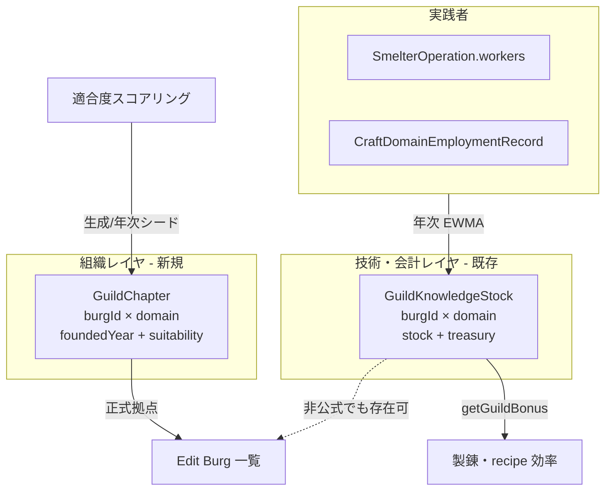
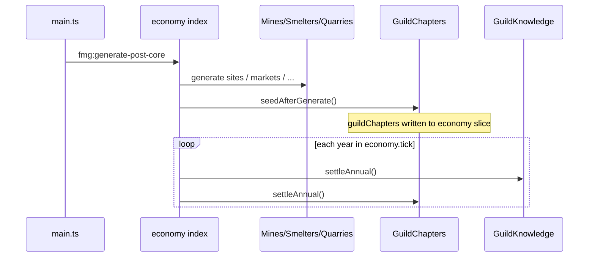

# ギルド都市拠点(拠点) + Edit Burg ギルド一覧

| 項目 | 内容 |
| :--- | :--- |
| **Status** | Draft / design-only（未実装） |
| **Author** | — |
| **Date** | 2026-08-02 |
| **Owner** | Economy 拡張（`src/extensions/economy/`） |
| **Depends on** | [knowledge-guild-system.md](./knowledge-guild-system.md) Phases 1–7 実装済み、[burg-treasury-equilibrium.md](./burg-treasury-equilibrium.md) の `GuildKnowledgeStock.treasury` |

---

## Overview

現状のギルド層は、実践者がいる Burg に自動で `GuildKnowledgeStock { burgId, domain, stock, treasury }` が立つ**技術・金庫の観測値**であり、「どの都市に**組織としての拠点(chapter)**を構えるか」という意図的な配置決定を持たない。また Edit Burg（`BurgEditorDialog`）にはその都市のギルド一覧が無い。

本設計は次の2点を足す。

1. **拠点(GuildChapter)**: ドメインごとに「活動都合の良い都市」へ正式支部を置く配置ロジック（生成時シード + 年次の緩やかな再評価）。既存の `GuildKnowledgeStock` 成長ルール（§8.1 決定2: 人口ゲートなし・実践者駆動）は壊さない。
2. **Edit Burg 表示**: 当該 Burg のギルド一覧（正式拠点 + 必要なら非公式実践）を、拡張システム既存パターンで注入する。

---

## Background & Motivation

### 現状（コード）

| 要素 | 実装 | ギャップ |
| :--- | :--- | :--- |
| 技術・金庫 | `GuildKnowledgeStock`（`guildKnowledgeTypes.ts`）— 実践者 EWMA + 利益分配金庫 | 「拠点を構えた」組織フラグが無い |
| 年次更新 | `GuildKnowledge.settleAnnual()` → 実践者がいれば stock 成長、いなければ減衰 | 拠点の設立/廃止とは独立 |
| 師弟 | `guildSuccession.ts`（現状 metallurgy のみ、stock>0 の Burg） | 拠点優先の親方配置が無い |
| グローバル一覧 | Tools → Edit → Guilds（`GuildOverviewDialog` / `guild-overview.ts`） | Burg 単位の視点が無い |
| Edit Burg | `BurgEditorDialog.tsx` + `burg-editor.ts` + `burgEconomyExtensions` で経済サマリを**行として**注入 | ギルド一覧無し。`registerEditorTab` は StatesEditor のみ消費 |

### 痛み

- プレイヤーが「この都市にどんなギルドがあるか」を Burg 編集 UI から見られない。
- 実践者が出た場所＝ギルド存在となり、**鉱脈・港・首都・市場**などドメイン固有の「都合の良い都市」への組織的集中が表現されない。
- Merchant 側には `MerchantOrganization.homeBurgId` という「本拠」があるが、ギルド層には対応物が無い。

### 既存との整合方針

**`GuildKnowledgeStock` を再設計しない。** 技術ストックは引き続き実践者駆動の連続量。拠点は**その上に載る薄い組織レイヤ**として追加する（knowledge-guild-system Phase 8 の文化・地形バイアスとも両立可能なフック）。

---

## Goals & Non-Goals

### Goals

1. ドメイン別に「都合の良い Burg」へ **正式ギルド拠点(GuildChapter)** を配置できること。
2. Edit Burg で、その都市のギルド一覧（ドメイン名・stock/bonus・treasury・地位・マスター名など）を見られること。
3. Economy 拡張の所有境界を守り、host は薄いタブ枠のみ、ロジック・データは extension 内に閉じること。
4. セーブ/ロード・再生成（`fmg:generate-post-core`）で拠点が失われないこと。
5. §8.1 決定2（人口ゲートなし・少人数支部許容）と矛盾しないこと——拠点は stock 成長の**前提条件にしない**。

### Non-Goals（v1）

- 国家横断のギルド同盟、HQ–支部ツリーの本格ネットワーク（Option C の完全版）。
- Academy / StateSecret / Martial 層の「拠点」化。
- 地図レイヤ（ギルド章のアイコン描画）や WebGL 表示。
- 拠点ボーナスによる生産効率の二重計上（stock ボーナスと別建て）。v1 は表示 + 配置が主。
- プレイヤーが UI から拠点を手動で設立/移転する編集ツール（将来）。
- metallurgy 以外への師弟展開（既存 Phase 6 の横展開は別タスク）。
- instruments ドメイン用 Good 新設（知識系ドキュメントどおり休眠）。

---

## Key Decisions

| # | 決定 | 根拠 |
| :--- | :--- | :--- |
| **KD-1** | **拠点 = 正式 `GuildChapter` エンティティ**（Option B lite）。`GuildKnowledgeStock` 自体を拠点にしない（Option A 却下）。フル multi-burg 組織ツリー（Option C）は将来。 | Stock は技術 EWMA の観測値であり、設立意図・キャップ・表示ステータスを載せる責務と衝突する。Merchant の「組織本拠」と「取引活動」分離と同型。 |
| **KD-2** | **stock 成長は拠点の有無に依存しない**。実践者がいれば informal でも stock が育つ（§8.1 決定2 維持）。 | 「人口ゲートを置かない」既存決定を壊さない。拠点は組織認知・UI・将来ボーナスのフック。 |
| **KD-3** | 配置は **生成時シード + 年次の低頻度再評価**。毎年フル再配置しない。 | 地図の味付け（初期配置）と長期の現実追従を両立。スラッシング回避。 |
| **KD-4** | 適合度は **ドメイン別スコア**（既存 Mine/Smelter/Quarry/Market/port/capital/craft 雇用等を合成）。新規地質シミュレーションは作らない。 | 既存データを読むだけなら Economy 内で完結し、メンテコストが低い。 |
| **KD-5** | Edit Burg は **`registerEditorTab({ editorId: "burgEditor", … })`**。host の `BurgEditorDialog` が StatesEditor と同型でタブを消費。 | 既に API が存在し States で実績あり。経済サマリ行の更なる肥大化を避け、一覧 UI に適する。 |
| **KD-6** | v1 のシミュレーション効果は **最小**（表示 + 配置永続 + 任意で師弟マスター生成の優先度）。生産ボーナスは既存 `getGuildBonus` のみ。 | バランス破壊を避け、まず観測可能性を確保。 |
| **KD-7** | データは `simulation.extensions.economy` スライス（`guildChapters`）に格納。他ギルド配列と同型の getter/setter。 | 既存 save/load 経路（economy slice）をそのまま使う。 |
| **KD-8** | Economy 無効時は Edit Burg に Guilds タブを出さない（register を enable ブランチに置く）。 | `burgEconomyExtensions` / overview columns と同じ enable/disable 契約。 |

---

## Proposed Design

### 1. 概念モデル: Stock vs Chapter



| 用語 | 意味 | データ |
| :--- | :--- | :--- |
| **Informal practitioners** | 実践者はいるが正式拠点なし | `GuildKnowledgeStock` のみ |
| **Chapter（拠点/支部）** | 組織として認めた都市拠点 | `GuildChapter`（通常は対応 stock も併存） |
| **HQ** | v1 では未使用（将来: State 内 primary） | `status: "hq"` 予約 |

**なぜ Option A（stock 閾値＝拠点）では足りないか**

- stock は「技術の熟練」であり「拠点を構えた」意図を表さない。孤児減衰中の stock も残りうる。
- 適合度の高い都市にまだ労働者がいない段階で「先に支部を置く」シードができない。
- キャップ（Burg あたりドメイン数）を stock 閾値で表現すると、生産シミュレーションと組織配置が結合しすぎる。

**なぜ Option C（商会型 multi-burg 組織）を v1 で採らないか**

- `MerchantOrganization` の parent/child・役員キャラは既に重い。ギルドはドメイン×都市の格子が自然（1 domain が多都市に支部を持つ）。
- まずは「都市に何があるか」の可視性を優先。ネットワークは後続。

### 2. データモデル

```ts
// src/extensions/economy/generators/guildChapterTypes.ts（新規）

import type { CraftKnowledgeDomain } from "./guildKnowledgeTypes";

/**
 * Formal craft-guild base (拠点) at one Burg for one domain.
 * Orthogonal to GuildKnowledgeStock: stock = technique + private treasury from practitioners;
 * chapter = intentional organizational presence (chartered base).
 */
export interface GuildChapter {
  burgId: number;
  domain: CraftKnowledgeDomain;
  /** Simulation year when the chapter was founded. */
  foundedYear: number;
  /**
   * v1: always "chapter". Reserved for multi-burg networks later
   * ("hq" = primary hall in a state, "branch" = subordinate).
   */
  status: "chapter" | "hq" | "branch";
  /** Last suitability score 0..1 (debug / UI tooltip). */
  suitability: number;
}

/** Display row for Edit Burg / optional filter on Guild Overview. */
export type GuildPresenceStatus = "chapter" | "informal";

export interface BurgGuildListRow {
  domain: CraftKnowledgeDomain;
  status: GuildPresenceStatus;
  stock: number;
  bonus: number;
  treasury: number;
  suitability: number | null;
  foundedYear: number | null;
  /** Living guildMaster character id if succession is wired for this domain. */
  masterCharacterId: number | null;
  masterName: string | null;
}
```

`economyContext.ts` に既存と同型:

```ts
export function getGuildChapters(): GuildChapter[] {
  return getSliceArray<GuildChapter>("guildChapters");
}
export function setGuildChapters(chapters: readonly GuildChapter[]): void {
  setSliceArray("guildChapters", chapters);
}
```

キーは `(burgId, domain)` 一意。`GuildKnowledgeStock` と同じ複合キー。

### 3. 適合度スコアリング

モジュール案: `src/extensions/economy/generators/guildChapterSuitability.ts`

**入力**: 既存 pack / economy スライスのみ（新規地形生成なし）。

| Domain | 主なシグナル（いずれも 0..1 に正規化して加重和） |
| :--- | :--- |
| `metallurgy` | active `MineOperation` / `SmelterOperation` の有無と workers、近傍の discovered ore deposit、`CraftDomainEmploymentRecord` metallurgy |
| `woodworking` | 森林バイオーム近接、Wood 系 strategic labor / 市場在庫、port（造船連想）、可能なら shipbuilding 候補は **Economy が shipbuilding を直接 import しない**前提で port+forest で代理（拡張間疎結合） |
| `masonry` | `QuarryOperation` / `computeQuarryCandidates` 相当、`ConstructionOperation` 需要、walls/citadel |
| `textiles` | Cloth/Garments/Sails の craft 雇用、plaza/market 規模、後背地人口 |
| `leather` | Leather/Boots craft 雇用、農村後背地、市場 |
| `glassware` | Ceramics/Glass craft、port/coast 近接、首都・大規模都市バイアス |
| `instruments` | 首都 / 高人口のみの弱いバイアス（Good 未実装のため休眠寄り） |
| `printing` | 首都、`AcademyKnowledgeStock` administration、Paper/Ink/Books craft |

共通因子（全ドメインに薄い加重）:

- `burg.capital`、人口スケール（**上限を決めるためではなく**、適合度の微調整のみ——人口ゲートにはしない）
- 同一 State 内に既に同ドメイン chapter が多いと **限界効用逓減**（分散を促す）

```ts
export function scoreGuildSuitability(
  burgId: number,
  domain: CraftKnowledgeDomain,
  ctx: SuitabilityContext // precomputed maps for one settle pass
): number; // 0..1
```

定数は仮置きし、単体テストで「鉱山都市は metallurgy が高い」「内陸砂漠が woodworking で勝てない」程度の順序を固定する。

### 4. 配置アルゴリズム（シード + 年次）

モジュール案: `src/extensions/economy/generators/guildChapters.ts` — `GuildChaptersModule`

#### 4.1 キャップ（仮値・要チューニング）

```ts
/** Formal chapters per Burg (all domains combined). */
export const MAX_CHAPTERS_PER_BURG = 4;
/**
 * Per state, per domain: scale with settled burgs so large states get more halls
 * without locking small states out of at least one.
 */
export function maxChaptersForDomainInState(stateBurgCount: number): number {
  return Math.max(1, Math.min(6, Math.ceil(stateBurgCount / 10)));
}
/** Minimum suitability to found a new chapter. */
export const CHAPTER_FOUND_THRESHOLD = 0.35;
/** Annual chance to attempt one new founding per (state, domain) when under cap. */
export const CHAPTER_ANNUAL_FOUND_CHANCE = 0.15;
```

#### 4.2 生成時 (`seedAfterGenerate`)

`fmg:generate-post-core` の Economy パイプライン内、**Mine/Smelter/Quarry/Markets/Production 初回の後**（適合度の入力が揃ってから）:

```
clear previous chapters (on full regen)
for each CraftKnowledgeDomain:
  for each non-removed State:
    burgs = state burgs
    score each burg
    sort desc by score
    greedily pick while under maxChaptersForDomainInState and MAX_CHAPTERS_PER_BURG
      if score >= CHAPTER_FOUND_THRESHOLD → create GuildChapter
```

シードは決定的にするため `appServices.rng` / マップ seed 由来の PRNG を使う（`Math.random` 直叩きを避ける——既存 economy の決定的生成パターンに合わせる）。

#### 4.3 年次 (`settleAnnual`)

`economy.tick` 内、`GuildKnowledge.settleAnnual()` の**後**（その年の stock を見て解散判定できる）:

1. 消滅 Burg / removed の chapter を落とす。
2. suitability を再計算して chapter に書き戻す（表示用）。
3. **解散（低頻度）**: chapter があり、stock < ε かつ suitability < 閾値を連続 N 年 → 削除（定数で抑制）。
4. **新設（低頻度）**: 各 (state, domain) が cap 未満なら、未 chapter の最高スコア Burg を候補に `CHAPTER_ANNUAL_FOUND_CHANCE` で設立。
5. **移転は v1 非対応**（削除+他所への新設で自然に近似）。

#### 4.4 stock 成長との相互作用

| イベント | stock | chapter |
| :--- | :--- | :--- |
| 実践者が出る | 行が作られ成長 | 変化なし（informal 可） |
| 適合度シードで chapter 設立 | 変化なし（0 のままでも可） | 行追加 |
| 実践者消滅 | 減衰・削除 | chapter は残しうる（空の会館）→ 年次解散条件で整理 |
| 征服撹乱 | 既存 `applyConquestDisruptionToGuilds` | v1 は chapter 行を維持（組織は残るが技術は傷む）。将来ペナルティ可 |

**重要**: chapter があるからといって `GuildKnowledge.settleAnnual` が stock を捏造して増やさない。労働力が無い限り stock は育たない／減衰する。

### 5. Edit Burg UX

#### 5.1 Host 変更（薄い）

`BurgEditorDialog.tsx` を `StatesEditorDialog` と同型に:

- `useExtensionState(s => s.editorTabs)` を `editorId === "burgEditor"` でフィルタ
- Overview（既存本文）/ 拡張タブの切り替え UI
- 拡張タブは `component` をそのままマウント

`ExtensionEditorTab` 型変更は不要（`React.ComponentType` のまま）。タブは **現在編集中の Burg** を `useBurgEditorState` から読む。

> 注: States の Treasury/Personality タブは「全 State 一覧」だが、Burg の Guilds タブは **単一 Burg の詳細一覧**。これは Edit Burg の単一対象 UX に合わせた意図的な差。

#### 5.2 Economy 側 UI

- `api.registerEditorTab({ id: "burg-guilds", extensionId: ECONOMY_EXTENSION_ID, editorId: "burgEditor", label: "Guilds", component: BurgEditorGuildsTab })`
- enable 時に登録、disable / cleanup で `unregisterExtension` 経路に乗る（既存 registerEditorTab のクリーンアップ契約に従う）
- コンポーネント: `src/extensions/economy/ui/components/BurgEditorGuildsTab.tsx`
- コントローラ: `src/extensions/economy/controllers/burg-guilds.ts` の `listGuildsForBurg(burgId): BurgGuildListRow[]`

#### 5.3 一覧カラム

| 列 | 内容 |
| :--- | :--- |
| Domain | `metallurgy` 等（表示名は英語識別子のまま、または薄いラベルマップ） |
| Status | `Chapter` / `Informal` |
| Stock | `GuildKnowledgeStock.stock`（無ければ 0 または "—"） |
| Bonus | `getGuildBonus(burgId, domain)` |
| Treasury | guild treasury |
| Master | 生存中 `guildMaster` の名前（無ければ "—"）。metallurgy 以外は当面 "—" が多い |
| Founded | chapter の `foundedYear`、informal は "—" |

ソート: stock 降順、同点で chapter 優先。

#### 5.4 空状態

- Economy 有効だが拠点も stock も無い: *"No guilds or craft practitioners recorded in this burg."*
- Economy 無効: タブ自体が非表示。既存経済行は "—"（現行どおり）。

#### 5.5 リンク

- **Guild Overview**: ボタンで `openDialog("guildOverview")` + 可能なら将来フィルタ。v1 はダイアログを開くだけで可。
- **Master**: 名前クリックで Characters の編集に飛ばすのは Characters 有効時のみ・v1 は任意（無ければプレーンテキスト）。

#### 5.6 Guild Overview 側（任意・同一 PR または PR-3）

グローバル一覧に `status` 列を追加し、chapter の有無を表示。必須ではないが一貫性が高い。

### 6. シミュレーション効果（スコープ）

| フェーズ | 効果 |
| :--- | :--- |
| **v1（本設計の実装範囲）** | 配置・永続・Edit Burg /（任意）Overview 表示。生産効率は既存 stock ボーナスのみ。 |
| **v1.1 推奨オプション** | `guildSuccession` がマスター不在時に **同ドメイン chapter がある Burg を優先**して親方を生成（informal のみの Burg より chapter を選ぶ）。 |
| **v2 以降** | chapter 維持費（treasury から）、他 Burg への技術伝播ブースト、HQ 指定、プレイヤー設立、征服時の chapter 一時停止など |

v1 でボーナスを足さない理由: `getGuildBonus` が既に stock から効いており、chapter に別乗数を足すと適合度の高い都市が二重に有利になりバランス検証が必要になるため。

### 7. 永続化 / 生成パイプライン



- **保存**: `simulation.extensions.economy.guildChapters` 配列。専用マイグレーション不要（欠落時は `[]`、次回 generate または年次で埋まる）。
- **ロード**: 既存 slice 復元後、chapter が空で stock だけあるセーブは「全 informal」として合法。任意でロード時に `seedFromExistingStocks` は**しない**（旧セーブに突然拠点が林立するのを避ける）。必要なら「初回 settle で低頻度設立」に任せる。
- **再生成**: 他 economy 配列と同様にクリアしてから `seedAfterGenerate`。
- **拡張 disable**: `setGuildChapters([])` を clear 経路に含める（stock と同様）。

### 8. アーキテクチャ配置

```
src/extensions/economy/
  generators/
    guildChapterTypes.ts      # 型
    guildChapterSuitability.ts
    guildChapters.ts          # seed + settleAnnual
    guildKnowledge*.ts        # 変更最小（参照のみ）
  controllers/
    burg-guilds.ts            # listGuildsForBurg
  ui/components/
    BurgEditorGuildsTab.tsx
  economyContext.ts           # get/setGuildChapters
  index.tsx                   # registerEditorTab, tick order, generate hook

src/ui/dialogs/
  BurgEditorDialog.tsx        # editorTabs 消費（host 唯一の必須変更）
```

- **Host → Extension**: `registerEditorTab` のみ。ギルドデータの import はしない。
- **Extension → Host store**: `BurgEditorGuildsTab` が `useBurgEditorState` で `burgData.id` を読む（built-in 拡張の既存実務。動的 ZIP 拡張向けに厳密 DI するなら将来 `burgEditorExtensions.getActiveBurgId` フックを追加可能——v1 は不要）。
- **shipbuilding**: woodworking スコアで shipbuilding を **import しない**（AGENTS 依存方向: Economy は他拡張に依存しない）。port + forest で代理。

### 9. API / Interface Changes

#### Host

`BurgEditorDialog.tsx` のみ（型定義は既存 `ExtensionEditorTab` で足りる）。

#### ExtensionAPI

変更なし（`registerEditorTab` 既存）。

#### 新規 public ではないがテスト用に export

- `scoreGuildSuitability`
- `GuildChapters.seedAfterGenerate` / `settleAnnual`
- `listGuildsForBurg`

---

## Alternatives Considered

### Alt-1: Option A — stock 閾値を拠点とみなす

- **内容**: `stock >= T` の行だけを Edit Burg に出す。新規エンティティなし。
- **長所**: 実装最小。
- **短所**: 「都合の良い都市に構える」配置意図が無く、ユーザー要求の半分しか満たさない。閾値は技術レベルと組織存在を混同する。
- **判定**: 却下（一覧の interim フィルタには使えるが本命ではない）。

### Alt-2: `GuildKnowledgeStock` に `isChapter` フラグを生やす

- **内容**: 別配列を作らず stock 行に boolean/foundedYear。
- **長所**: キーが1つ。
- **短所**: settleAnnual が「実践者ループで行を再構築」しており、実践者ゼロの chapter を orphan 減衰パスと区別する分岐が増える。treasury クレジット側（`guildTreasury.ts`）も空 chapter 用に行作成が必要で、結局 chapter ライフサイクルが stock 更新に侵入する。
- **判定**: 見送り。別配列の方が責務分離が明確。

### Alt-3: Option C — MerchantOrganization 型のギルド商会ネットワーク

- **内容**: `homeBurgId` + child branches + 役員キャラ。
- **長所**: 物語性が高い。
- **短所**: Characters・外交・AI まで巻き込み scope 過大。ドメイン×都市格子とフィットしにくい。
- **判定**: v2 候補。`status: "hq" | "branch"` を型に予約するのみ。

### Alt-4: Edit Burg への注入を `burgEconomyExtensions` 拡張で行う

- **内容**: summary に `guilds: string` や行配列を足し、本体テーブルに埋め込む。
- **長所**: host のタブ実装が不要。
- **短所**: `BurgData` / `updateBurgValues` がさらに肥大。一覧・リンク・ソートに不向き。経済スカラー行と異質。
- **判定**: 却下。タブ方式を採用（KD-5）。

### Alt-5: 別ダイアログのみ（Edit Burg からボタンで開く）

- **長所**: host 変更ゼロに近い。
- **短所**: 「Burg を見ている文脈」が分断される。ユーザー要求は Edit Burg 上の一覧。
- **判定**: 補助としては Guild Overview があるので、主経路はタブ。

---

## Security & Privacy Considerations

- 単機ローカルシミュレーション。ネットワーク通信なし。
- セーブデータにキャラ名（マスター）が含まれるが既存 Characters と同レベル。
- 拡張 disable 時にスライスをクリアし、無効拡張のデータが UI に残らないようにする。

---

## Observability

- `GuildChapters.seedAfterGenerate` / `settleAnnual` の結果件数を `DEBUG` 時のみログ（既存 economy ジェネレータの慣例に合わせる）。
- 単体テスト:
  - 適合度順序（鉱山都市 > 無資源都市 for metallurgy）
  - キャップ遵守
  - stock 成長が chapter 無しでも動く回帰（既存 `guildKnowledge.test.ts` が green のまま）
  - `listGuildsForBurg` が chapter / informal を区別
- 手動: 生成後に Edit Burg → Guilds タブ、Tools → Guild Overview との突合。

---

## Rollout Plan

1. データ + シード/年次（フラグや UI 無しでもセーブに書ける）
2. Edit Burg タブ（表示）
3. Overview 列・師弟優先（任意）
4. 定数チューニングはプレイ後

**ロールバック**: `guildChapters` を読まない・タブを外すだけで可。stock 系は不変のため安全。

**Feature flag**: 専用フラグは不要。Economy 拡張の enable がフラグ。

---

## Risks

| リスク | 深刻度 | 緩和 |
| :--- | :--- | :--- |
| 初期シードが全都市に chapter を張りすぎて意味が薄い | 中 | 閾値 + per-burg/per-state cap。テストで件数上限を固定 |
| 年次再評価で拠点がちらつく | 中 | 低確率設立・連続年解散条件。移転ロジック無し |
| BurgEditor タブ追加でダイアログレイアウト崩れ | 低 | StatesEditor と同パターン。Overview 既定表示を維持 |
| woodworking が造船と乖離 | 低 | v1 は port+forest 代理。shipbuilding 連携は別設計 |
| 旧セーブに chapter が無く一覧が薄い | 低 | informal stock も表示。年次で徐々に設立 |
| 適合度が人口に引っ張られ大都市一強 | 中 | 人口は弱い共通因子のみ。ドメイン固有サイト信号を主にする |

---

## Open Questions

プロダクト判断が必要なもののみ（デフォルト案付き）。

1. **旧セーブへの遡及シード**: ロード直後に一括 `seedAfterGenerate` するか、年次のみか。  
   **デフォルト**: 年次のみ（セーブの世界観を急変させない）。
2. **Guild Overview に Status 列を v1 で入れるか。**  
   **デフォルト**: 入れる（実装コスト低・一貫性高）。
3. **表示名のローカライズ**: domain を Title Case 英語のままか。  
   **デフォルト**: 英語識別子のまま（プロジェクト UI 英語方針）。

それ以外（キャップ数値、閾値）は実装時プレースホルダで進め、プレイテストで調整。

---

## References

### Plan docs

- [knowledge-guild-system.md](./knowledge-guild-system.md) — ギルド層本体、§8.1 決定、Phases 1–7
- [burg-treasury-equilibrium.md](./burg-treasury-equilibrium.md) — `GuildKnowledgeStock.treasury`
- [corporation.md](./corporation.md) / 商会 — `MerchantOrganization` 本拠パターン（対比）
- [extension-system-guide.md](../extension-system-guide.md) — `registerEditorTab`、enable/disable

### Source（現状）

| パス | 役割 |
| :--- | :--- |
| `src/extensions/economy/generators/guildKnowledgeTypes.ts` | `GuildKnowledgeStock`, domains |
| `src/extensions/economy/generators/guildKnowledge.ts` | 年次 stock EWMA |
| `src/extensions/economy/generators/guildTreasury.ts` | 利益分配・還元 |
| `src/extensions/economy/generators/guildSuccession.ts` | 親方・弟子（metallurgy） |
| `src/extensions/economy/controllers/guild-overview.ts` | グローバル一覧 |
| `src/extensions/economy/ui/dialogs/GuildOverviewDialog.tsx` | Guild Overview UI |
| `src/extensions/economy/economyContext.ts` | slice getter/setter |
| `src/extensions/economy/generators/merchantOrganizationsTypes.ts` | `homeBurgId` 対比 |
| `src/services/burgEconomyExtensions.ts` | Edit Burg 経済サマリ注入（対比・非採用） |
| `src/ui/dialogs/BurgEditorDialog.tsx` | Edit Burg host UI |
| `src/controllers/burg-editor.ts` | `updateBurgValues` |
| `src/ui/dialogs/StatesEditorDialog.tsx` | `registerEditorTab` 消費の先例 |
| `src/store/extensionState.ts` | `ExtensionEditorTab` |
| `src/types/extension-api.ts` | `registerEditorTab` |
| `src/extensions/economy/index.tsx` | tick 順、`registerEditorTab`（states-treasury） |

---

## PR Plan

実装をレビュー可能な増分に分割する。各 PR は単独で green（tsc / lint / 関連テスト）を目標とする。

### PR-1: `GuildChapter` データモデル + 適合度 + シード/年次

| 項目 | 内容 |
| :--- | :--- |
| **Title** | `feat(economy): add GuildChapter placement (seed + annual settle)` |
| **Files** | `guildChapterTypes.ts`（新）, `guildChapterSuitability.ts`（新）, `guildChapters.ts`（新）, `guildChapters.test.ts` / suitability tests（新）, `economyContext.ts`（get/set）, `index.tsx`（generate-post-core 後シード、tick で settle、disable clear） |
| **Depends on** | なし |
| **Description** | `GuildChapter` スライス、ドメイン別適合度、cap 付きシードと年次低頻度設立/解散。`GuildKnowledgeStock` ロジックは変更しない（回帰テスト維持）。UI なしでもデータがセーブされる。 |

### PR-2: Edit Burg が `burgEditor` タブを消費

| 項目 | 内容 |
| :--- | :--- |
| **Title** | `feat(ui): support registerEditorTab in BurgEditorDialog` |
| **Files** | `src/ui/dialogs/BurgEditorDialog.tsx`（タブバー + Overview / 拡張タブ切替）。必要なら短いコメントのみ。 |
| **Depends on** | なし（Economy 未登録でもタブバー非表示で挙動不変） |
| **Description** | `StatesEditorDialog` と同型に `editorId === "burgEditor"` をフィルタして描画。ホスト単体でマージ可能。 |

### PR-3: Burg Guilds タブ + 一覧コントローラ

| 項目 | 内容 |
| :--- | :--- |
| **Title** | `feat(economy): Edit Burg Guilds tab listing chapters and informal stock` |
| **Files** | `controllers/burg-guilds.ts`, `ui/components/BurgEditorGuildsTab.tsx`, `index.tsx`（`registerEditorTab`）、任意で `GuildOverviewDialog` / `guild-overview.ts` に Status 列 |
| **Depends on** | PR-1, PR-2 |
| **Description** | `listGuildsForBurg`、Chapter/Informal 表示、空状態、Guild Overview への導線。Economy enable/disable でタブ出し入れ。 |

### PR-4（任意）: 師弟マスター生成の chapter 優先

| 項目 | 内容 |
| :--- | :--- |
| **Title** | `feat(economy): prefer guild chapters when placing new masters` |
| **Files** | `guildSuccession.ts`, `guildSuccession.test.ts` |
| **Depends on** | PR-1 |
| **Description** | マスター不在時の新規親方生成で、同ドメイン `GuildChapter` がある Burg を優先。生産ボーナスは触らない。 |

### 推奨マージ順

`PR-2`（host 枠）と `PR-1`（データ）は並列可 → `PR-3` → `PR-4`。

---

## 付録: ユーザー要求との対応

| 要求 | 本設計の答え |
| :--- | :--- |
| 各種ギルドが都合の良い都市に拠点 | ドメイン別適合度 + cap 付き `GuildChapter` シード/年次 |
| Edit Burg にギルド一覧 | `burgEditor` の Guilds タブ |
| 既存知識系との整合 | stock は維持、拠点は別レイヤ、人口ゲートなし |
