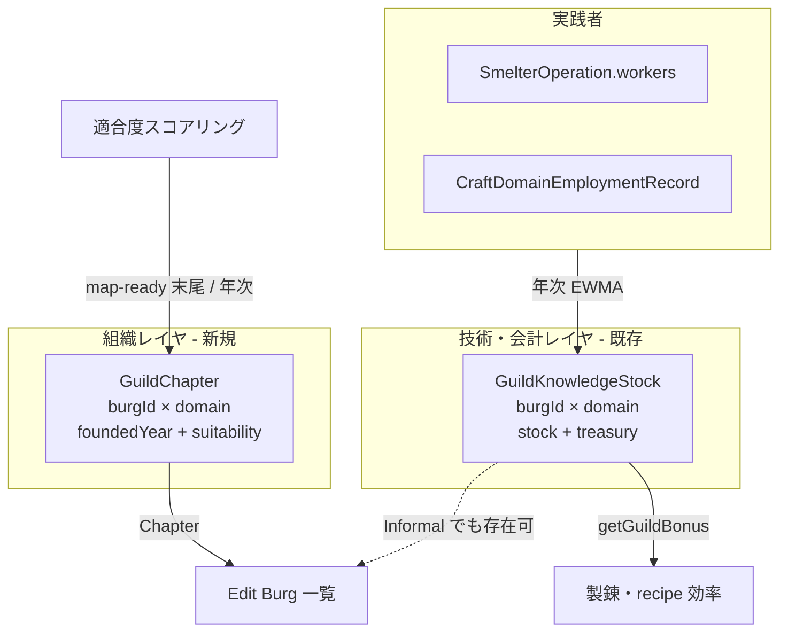
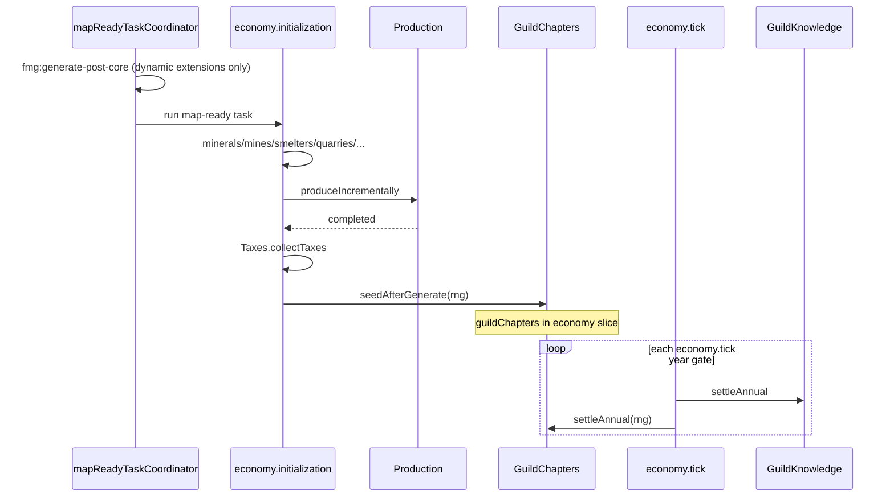

# ギルド都市拠点(拠点) + Edit Burg ギルド一覧

| 項目 | 内容 |
| :--- | :--- |
| **Status** | Draft / design-only（未実装）— 2026-08-02 review 反映改訂 |
| **Author** | — |
| **Date** | 2026-08-02 |
| **Owner** | Economy 拡張（`src/extensions/economy/`） |
| **Depends on** | [knowledge-guild-system.md](./knowledge-guild-system.md) Phases 1–7 実装済み、[burg-treasury-equilibrium.md](./burg-treasury-equilibrium.md) の `GuildKnowledgeStock.treasury` |

---

## Overview

現状のギルド層は、実践者がいる Burg に自動で `GuildKnowledgeStock { burgId, domain, stock, treasury }` が立つ**技術・金庫の観測値**であり、「どの都市に**組織としての正式拠点 (GuildChapter)** を構えるか」という意図的な配置決定を持たない。また Edit Burg（`BurgEditorDialog`）にはその都市のギルド一覧が無い。

本設計は次の2点を足す。

1. **拠点 (`GuildChapter`)**: ドメインごとに「活動都合の良い都市」へ正式会館を置く配置ロジック（map-ready 生成パイプライン末尾でのシード + 年次の緩やかな再評価）。既存の `GuildKnowledgeStock` 成長ルール（§8.1 決定2: 人口ゲートなし・実践者駆動）は壊さない。
2. **Edit Burg 表示**: 当該 Burg のギルド一覧（正式拠点 + 非公式実践）を、`registerEditorTab` + host の enable フィルタで注入する。

---

## Glossary（用語）

既存コード／コメントは、実践者ストック一般を口語的に "guild chapter" と呼ぶことがある（例: `GUILD_SATURATION_WORKERS` のコメント、「数人規模のギルド支部」）。本設計以降の区別:

| 用語 | 意味 | データ / UI |
| :--- | :--- | :--- |
| **Technique stock / informal technique stock** | 実践者駆動の技術 EWMA + 金庫。正式会館の有無と独立 | `GuildKnowledgeStock`。UI Status = **Informal** |
| **Formal chapter / 正式拠点 / 会館** | 組織として認めた都市拠点 | `GuildChapter`。UI Status = **Chapter** |
| **HQ / branch** | v1 未使用のネットワーク役割 | `GuildChapter.status` の予約値 |

**実装時ルール**: 新規・改訂する stock 層の英語コメントでは "chapter" を避け、"technique stock" / "practitioners" を使う。UI の "Chapter" は常に formal hall を指す。

---

## Background & Motivation

### 現状（コード）

| 要素 | 実装 | ギャップ |
| :--- | :--- | :--- |
| 技術・金庫 | `GuildKnowledgeStock`（`guildKnowledgeTypes.ts`）— 実践者 EWMA + 利益分配金庫 | 「拠点を構えた」組織フラグが無い |
| 年次更新 | `GuildKnowledge.settleAnnual()` → 実践者がいれば stock 成長、いなければ減衰 | 拠点の設立/廃止とは独立 |
| 師弟 | `guildSuccession.ts`（現状 metallurgy のみ、**各** stock>0 Burg が独立に master を ensure） | 拠点と master 生成の結び付きが無い |
| グローバル一覧 | Tools → Edit → Guilds（`GuildOverviewDialog` / `guild-overview.ts`） | Burg 単位の視点が無い |
| Edit Burg | `BurgEditorDialog.tsx` + `burg-editor.ts` + `burgEconomyExtensions` で経済サマリを**行として**注入 | ギルド一覧無し。`registerEditorTab` は StatesEditor のみ消費 |
| Economy 生成 | **`api.registerMapReadyTask({ id: "economy.initialization" })`**（`index.tsx`）。`fmg:generate-post-core` は map-ready タスク**より前**に発火し、built-in Economy のデータ生成には使わない | 拠点シードを誤ったイベントにぶら下げると入力が空 |

### 痛み

- プレイヤーが「この都市にどんなギルドがあるか」を Burg 編集 UI から見られない。
- 実践者が出た場所＝ギルド存在となり、**鉱脈・港・首都・市場**などドメイン固有の「都合の良い都市」への組織的集中が表現されない。
- Merchant 側には `MerchantOrganization.homeBurgId` という「本拠」があるが、ギルド層には対応物が無い。

### 既存との整合方針

**`GuildKnowledgeStock` を再設計しない。** 技術ストックは引き続き実践者駆動の連続量。拠点は**その上に載る薄い組織レイヤ**として追加する（knowledge-guild-system Phase 8 の文化・地形バイアスとも両立可能なフック）。

---

## Goals & Non-Goals

### Goals

1. ドメイン別に「都合の良い Burg」へ **正式ギルド拠点 (`GuildChapter`)** を配置できること。
2. Edit Burg で、その都市のギルド一覧（ドメイン名・stock/bonus・treasury・地位・マスター名など）を見られること。
3. Economy 拡張の所有境界を守り、host は薄いタブ枠 + **enable フィルタ**のみ、ロジック・データは extension 内に閉じること。
4. セーブ/ロード・再生成で拠点が失われないこと（clear / regenerate 契約は §7 の call-site 表に従う）。
5. §8.1 決定2（人口ゲートなし・少人数実践許容）と矛盾しないこと——拠点は stock 成長の**前提条件にしない**。

### Non-Goals（v1）

- 国家横断のギルド同盟、HQ–支部ツリーの本格ネットワーク（Option C の完全版）。
- Academy / StateSecret / Martial 層の「拠点」化。
- 地図レイヤ（ギルド章のアイコン描画）や WebGL 表示。
- 拠点ボーナスによる生産効率の二重計上（stock ボーナスと別建て）。v1 は表示 + 配置が主。
- プレイヤーが UI から拠点を手動で設立/移転する編集ツール（将来）。
- metallurgy 以外への師弟展開（既存 Phase 6 の横展開は別タスク）。
- instruments ドメイン用 Good 新設（知識系ドキュメントどおり休眠）。
- `unregisterEditorTab` API の新設（v1 は host 側 enable フィルタで足りる — KD-8）。
- knowledge 系配列全般（`guildKnowledgeStocks` 等）の clear 漏れ一括修正は**必須ではない**（§7。chapter のみ明示 clear）。

---

## Key Decisions

| # | 決定 | 根拠 |
| :--- | :--- | :--- |
| **KD-1** | **拠点 = 正式 `GuildChapter` エンティティ**（Option B lite）。`GuildKnowledgeStock` 自体を拠点にしない（Option A 却下）。フル multi-burg 組織ツリー（Option C）は将来。 | Stock は技術 EWMA の観測値であり、設立意図・キャップ・表示ステータスを載せる責務と衝突する。Merchant の「組織本拠」と「取引活動」分離と同型。 |
| **KD-2** | **stock 成長は拠点の有無に依存しない**。実践者がいれば informal でも stock が育つ（§8.1 決定2 維持）。 | 「人口ゲートを置かない」既存決定を壊さない。拠点は組織認知・UI・将来ボーナスのフック。 |
| **KD-3** | 配置は **生成時シード + 年次の低頻度再評価**。毎年フル再配置しない。 | 地図の味付け（初期配置）と長期の現実追従を両立。スラッシング回避。 |
| **KD-4** | 適合度は **ドメイン別スコア**（既存 Mine/Smelter/Quarry/Market/port/capital/craft 雇用等を合成）。新規地質シミュレーションは作らない。具体式は §3。 | 既存データを読むだけなら Economy 内で完結し、メンテコストが低い。 |
| **KD-5** | Edit Burg は **`registerEditorTab({ editorId: "burgEditor", … })`**。host の `BurgEditorDialog` が StatesEditor と同型でタブを消費し、**加えて `enabledExtensions[extensionId]` でフィルタ**する。 | 既に API が存在し States で実績あり。経済サマリ行の更なる肥大化を避ける。 |
| **KD-6** | v1 のシミュレーション効果は **最小**（表示 + 配置永続）。生産ボーナスは既存 `getGuildBonus` のみ。PR-4 の師弟ゲートは任意・明示的契約。 | バランス破壊を避け、まず観測可能性を確保。 |
| **KD-7** | データは `simulation.extensions.economy` スライス（`guildChapters`）に格納。他 economy 配列と同型の getter/setter。 | 既存 save/load 経路（economy slice）をそのまま使う。 |
| **KD-8** | **`registerEditorTab` は `init()` で one-shot**（`states-treasury` / `states-personality` と同型）。enable ブランチでの register/unregister は**しない**（`unregisterEditorTab` が存在しない）。タブ非表示は host が `enabledExtensions` でフィルタする。overview columns の live toggle とは**別契約**。 | 実コードの registerEditorTab ライフサイクルに合わせる。 |
| **KD-9** | **ライフサイクル**: シードは `economy.initialization` map-ready タスク末尾（Production 成功後）。年次は `economy.tick` 内 self-gate。regenerate / enable bootstrap / clear は §7 call-site 表に従う。`fmg:generate-post-core` には **built-in 拠点シードを載せない**。 | `mapReadyTaskCoordinator` は post-core を map-ready **より前**に発火する。Economy 本体生成は map-ready 上にある。 |

---

## Proposed Design

### 1. 概念モデル: Stock vs Chapter



| 用語 | 意味 | データ |
| :--- | :--- | :--- |
| **Informal** | 実践者/技術はあるが正式会館なし | `GuildKnowledgeStock` のみ |
| **Chapter** | 組織として認めた都市拠点 | `GuildChapter`（通常は対応 stock も併存） |
| **HQ** | v1 では未使用（将来: State 内 primary） | `status: "hq"` 予約 |

**なぜ Option A（stock 閾値＝拠点）では足りないか**

- stock は「技術の熟練」であり「拠点を構えた」意図を表さない。孤児減衰中の stock も残りうる。
- 適合度の高い都市にまだ労働者がいない段階で「先に会館を置く」シードができない。
- キャップ（Burg あたりドメイン数）を stock 閾値で表現すると、生産シミュレーションと組織配置が結合しすぎる。

**なぜ Option C（商会型 multi-burg 組織）を v1 で採らないか**

- `MerchantOrganization` の parent/child・役員キャラは既に重い。ギルドはドメイン×都市の格子が自然。
- まずは「都市に何があるか」の可視性を優先。ネットワークは後続。

### 2. データモデル

```ts
// src/extensions/economy/generators/guildChapterTypes.ts（新規）

import type { CraftKnowledgeDomain } from "./guildKnowledgeTypes";

/**
 * Formal craft-guild hall (正式拠点) at one Burg for one domain.
 * Orthogonal to GuildKnowledgeStock: stock = technique + private treasury from practitioners;
 * chapter = intentional organizational presence.
 */
export interface GuildChapter {
  burgId: number;
  domain: CraftKnowledgeDomain;
  /** Simulation year when the hall was founded. */
  foundedYear: number;
  /**
   * v1: always "chapter". Reserved for multi-burg networks later
   * ("hq" = primary hall in a state, "branch" = subordinate).
   */
  status: "chapter" | "hq" | "branch";
  /** Last suitability score 0..1 (debug / UI tooltip). */
  suitability: number;
}

/** Display status — never call informal stock a "chapter" in UI. */
export type GuildPresenceStatus = "chapter" | "informal";

export interface BurgGuildListRow {
  domain: CraftKnowledgeDomain;
  status: GuildPresenceStatus;
  stock: number;
  bonus: number;
  treasury: number;
  suitability: number | null;
  foundedYear: number | null;
  /** Living guildMaster character id if succession is wired for this domain. */
  masterCharacterId: number | null;
  masterName: string | null;
}
```

`economyContext.ts` に既存と同型:

```ts
export function getGuildChapters(): GuildChapter[] {
  return getSliceArray<GuildChapter>("guildChapters");
}
export function setGuildChapters(chapters: readonly GuildChapter[]): void {
  setSliceArray("guildChapters", chapters);
}

// Annual self-gate (same pattern as guildKnowledgeLastSettledYear)
export function getGuildChaptersLastSettledYear(): number | null { /* ... */ }
export function setGuildChaptersLastSettledYear(year: number): void { /* ... */ }
```

キーは `(burgId, domain)` 一意。`GuildKnowledgeStock` と同じ複合キー。

### 3. 適合度スコアリング

モジュール: `src/extensions/economy/generators/guildChapterSuitability.ts`

#### 3.1 `SuitabilityContext`（1 settle / seed パスで1回構築）

```ts
interface SuitabilityContext {
  burgsByState: Map<number, number[]>; // stateId → burgIds
  // site presence
  mineWorkersByBurg: Map<number, number>;
  smelterWorkersByBurg: Map<number, number>;
  hasDiscoveredOreNearBurg: Set<number>; // see distance rule below
  quarryWorkersByBurg: Map<number, number>;
  quarryCandidateScoreByBurg: Map<number, number>; // from computeQuarryCandidates stoneRatio
  constructionDemandByBurg: Map<number, number>; // 0..1 from housing gap / workers if available
  craftWorkersByBurgDomain: Map<string, number>; // `${burgId}:${domain}` → workers
  marketUrbanSizeByBurg: Map<number, number>; // 0..1 from market catchment / plaza
  forestAccessByBurg: Map<number, number>; // 0..1 neighbor forest ratio (biome tags)
  forestryLaborByBurg: Map<number, number>; // strategic labor "forestry" if present
  academyAdminByBurg: Map<number, number>; // AcademyKnowledgeStock.stock for administration
  capitalIds: Set<number>;
  portIds: Set<number>;
  citadelIds: Set<number>;
  wallsIds: Set<number>;
  plazaIds: Set<number>;
  logPopByBurg: Map<number, number>; // log1p(displayPop) normalized 0..1 within state
  chapterCountByStateDomain: Map<string, number>; // diminishing returns for new halls
}
```

**距離定義（ore 近傍）**: Burg の `cell` と、その Burg が属する market の `centerBurgId` が同じ market 列に乗る **同一 market 圏内**の discovered ore `MineralDeposit`、または Burg cell の **隣接1リング**（`pack.cells.c[burg.cell]`）に deposit cell がある場合を「近傍」とする。半径 km は導入しない（既存 site モジュールと同じ cell 近傍慣習）。

**人口因子**: `logPopNorm = log1p(burg.population) / max_s log1p(pop)` を **同一 State 内**で 0..1 に正規化。全域ランクは使わない（大国の首都が全 map で勝ちすぎるのを避ける）。

#### 3.2 ドメイン別加重（仮値・単体テストで順序を固定）

各シグナルを 0..1 にクリップしたうえで加重和し、最後に `min(1, sum)`。未定義シグナルは 0。

| Domain | 式（加重は仮） |
| :--- | :--- |
| `metallurgy` | `0.35·smelterW + 0.25·mineW + 0.20·oreNear + 0.10·craft(metallurgy) + 0.05·capital + 0.05·logPop` |
| `woodworking` | `0.30·forest + 0.20·forestryLabor + 0.20·port + 0.15·craft(woodworking) + 0.10·market + 0.05·logPop` （shipbuilding は **import しない**） |
| `masonry` | `0.30·quarryW + 0.20·quarryCandidate + 0.20·constructionDemand + 0.15·(walls∨citadel) + 0.10·craft(masonry) + 0.05·logPop` |
| `textiles` | `0.35·craft(textiles) + 0.25·market + 0.15·plaza + 0.15·logPop + 0.10·capital` |
| `leather` | `0.40·craft(leather) + 0.25·market + 0.20·logPop + 0.15·forest` （農村代理） |
| `glassware` | `0.30·craft(glassware) + 0.25·port + 0.20·capital + 0.15·market + 0.10·logPop` |
| `instruments` | `0.45·capital + 0.35·logPop + 0.20·market`（休眠寄り） |
| `printing` | `0.30·academyAdmin + 0.25·capital + 0.25·craft(printing) + 0.20·market` |

**分散ペナルティ**: 同一 `(state, domain)` に既に chapter が `k` 件ある候補について  
`score' = score * (1 / (1 + 0.35·k))`（新設判定時のみ。既存 chapter の suitability 再計算には適用しない）。

```ts
export function scoreGuildSuitability(
  burgId: number,
  domain: CraftKnowledgeDomain,
  ctx: SuitabilityContext
): number; // 0..1
```

単体テスト固定シナリオ例:

- 鉱山+製錬あり・人口小 vs 大都市無資源 → metallurgy は前者 > 後者
- 内陸・森林なし vs port+forest → woodworking は後者 >
- 首都+academy vs 辺境 → printing は前者 >

### 4. 配置アルゴリズム（シード + 年次）

モジュール: `src/extensions/economy/generators/guildChapters.ts` — `GuildChaptersModule`

#### 4.1 キャップと解散定数（仮値）

```ts
/** Formal halls per Burg (all domains combined). */
export const MAX_CHAPTERS_PER_BURG = 4;

export function maxChaptersForDomainInState(stateBurgCount: number): number {
  return Math.max(1, Math.min(6, Math.ceil(stateBurgCount / 10)));
}

/** Minimum suitability to found a new hall at seed or annual. */
export const CHAPTER_FOUND_THRESHOLD = 0.35;

/** Annual chance to attempt one new founding per (state, domain) when under cap. */
export const CHAPTER_ANNUAL_FOUND_CHANCE = 0.15;

/** Stock below this counts as "empty hall" for dissolution (with suitability). */
export const CHAPTER_DISSOLVE_STOCK_EPS = 0.02;

/** Suitability below this, together with empty stock, allows dissolution counter. */
export const CHAPTER_DISSOLVE_SUITABILITY = 0.20;

/** Consecutive annual settles meeting dissolve conditions before removing the chapter. */
export const CHAPTER_DISSOLVE_YEARS = 3;
```

解散カウンタは **永続フィールドを増やさない** v1 方針:  
各 settle で条件を満たす chapter について、**その年の stock/suitability が両方閾値割れ**なら内部 Map（モジュールローカル）ではなく、**単純化**:  
`stock < EPS && suitability < DISSOLVE_SUITABILITY` が **同一 settle で真** かつ `foundedYear <= year - CHAPTER_DISSOLVE_YEARS`（設立から最低 N 年経過）なら解散。  
連続カウンタをセーブしない代わりに「設立後クーリング + 同時条件」で近似する（レビューの N 年要件を、永続カウンタ無しで満たす）。

#### 4.2 生成時シード `seedAfterGenerate(rng)`

**呼び出し位置（必須）**: `economy.initialization` map-ready タスク内で、`Production.produceIncrementally` が **完了成功**し `Taxes.collectTaxes()` の**直後**（craft employment / sites が揃ってから）。キャンセルや disable で早期 return したパスでは呼ばない。

```
// pseudo — end of economy.initialization run():
// ... Production.produceIncrementally success ...
Taxes.collectTaxes();
GuildChapters.seedAfterGenerate(api.appServices.rng);
api.requestWebglRender();
```

**アルゴリズム**:

```
setGuildChapters([])  // full regen / init only
ctx = buildSuitabilityContext()
year = getSimulationYear() // or options.year at gen
for each CraftKnowledgeDomain:
  for each non-removed State:
    candidates = burgs in state, scored, sort desc by score'
    for c in candidates:
      if score' < CHAPTER_FOUND_THRESHOLD: break
      if chaptersIn(state,domain) >= maxChaptersForDomainInState: break
      if chaptersAt(burg) >= MAX_CHAPTERS_PER_BURG: continue
      add GuildChapter { burgId, domain, foundedYear: year, status: "chapter", suitability: score }
```

**RNG**: シード自体は現状スコア貪欲で決定的。将来タイブレークや確率を入れる場合は `rng` 引数（`RNGService` / `appServices.rng`）のみ使用。`Math.random` 禁止。

**seed 時点の stock**: 通常ほぼ空。シードは **sites + craft employment + 地形/フラグ** のみで行い、stock を前提にしない（§3 の Production 後配置がこれを保証）。

#### 4.3 年次 `settleAnnual(rng): boolean`

`economy.tick` 内、`GuildKnowledge.settleAnnual()` の**直後**（解散判定が当年 stock を読める）:

```ts
settleAnnual(rng: { float?: () => number; rand?: () => number } /* appServices.rng shape */): boolean {
  const year = getSimulationYear();
  if (getGuildChaptersLastSettledYear() === year) return false;
  setGuildChaptersLastSettledYear(year);
  // 1 drop removed burgs
  // 2 rebuild suitability on remaining chapters
  // 3 dissolve by §4.1 rules
  // 4 for each (state, domain) under cap: with CHAPTER_ANNUAL_FOUND_CHANCE via rng,
  //     try highest-scoring non-chapter burg
  return true;
}
```

**Self-gate の独立**: `GuildKnowledge.settleAnnual()` が既に同年 settle 済みで no-op しても、chapters 側は **独自の** `guildChaptersLastSettledYear` で判定する（他 annual モジュールと同型）。

**tick からの渡し方**:

```ts
GuildKnowledge.settleAnnual();
GuildChapters.settleAnnual(context.rng); // economy.tick の SimulationSystem context
// or api.appServices.rng if context.rng unavailable at call site — prefer context.rng
GuildSuccession.settleAnnual();
```

年次設立ロール: `rng.float()` または既存 API に合わせて `P(CHAPTER_ANNUAL_FOUND_CHANCE)` 相当。テストは rng を注入して決定的に固定。

#### 4.4 stock 成長・征服との相互作用

| イベント | stock | chapter |
| :--- | :--- | :--- |
| 実践者が出る | 行が作られ成長 | 変化なし（Informal 可） |
| 適合度シードで chapter 設立 | 変化なし（0 のままでも可） | 行追加 |
| 実践者消滅 | 減衰・削除 | chapter は残しうる → §4.1 解散 |
| 征服撹乱 | 既存 `applyConquestDisruptionToGuilds` | v1 は chapter 行を維持 |

**征服後の over-cap 過渡**: `burg.state` が変わると「新 State 側の per-domain cap」を一時的に超過しうる。v1 は **次の `settleAnnual` まで許容**し、その settle で新規設立を止め、解散条件に該当するものだけ落とす（強制移転はしない）。Risks 表にも記載。

**重要**: chapter があるからといって `GuildKnowledge.settleAnnual` が stock を捏造して増やさない。

### 5. Edit Burg UX

#### 5.1 Host 変更（薄い）

`BurgEditorDialog.tsx` を `StatesEditorDialog` と同型に拡張:

1. `useExtensionState` から `editorTabs` を取得し、`t.editorId === "burgEditor"` **かつ** `enabledExtensions[t.extensionId]` が truthy のものだけ表示。
2. タブバー: **Overview**（既定）+ 拡張タブ。
3. **レイアウト**:
   - タブバーは `Dialog` タイトル直下、`#burgBody` の上。
   - `activeTab === "overview"`: 現行どおり `#burgBody` 全体（紋章 + 表 + preview）+ `#burgFooter`。
   - `activeTab !== "overview"`: **`#burgBody` の中身だけ**を拡張 `component` に差し替え。`#burgFooter`（Locate / Emblem / Travel 等）は**常時表示**（Burg 操作はタブ横断で有用）。
4. ダイアログ open のたびに `activeTab` を `"overview"` に戻す（`isOpen` 立ち上がりで reset）。
5. 任意: StatesEditor と同様に `fmg:activate-editor-tab`（`editorId: "burgEditor"`, `tabId`）を listen。

`ExtensionEditorTab` 型変更は不要。タブコンポーネントは **現在編集中の Burg** を `useBurgEditorState(s => s.burgData?.id)` から読む（built-in Economy の既存実務）。

> States の Treasury/Personality タブは「全 State 一覧」、Burg の Guilds タブは **単一 Burg の詳細一覧**——Edit Burg の単一対象 UX に合わせた意図的な差。

**StatesEditor への同 enable フィルタ**: Burg と揃えるのが望ましいが、本機能の **必須スコープは BurgEditor のみ**。StatesEditor のフィルタ追加は同一 PR-2 の小さな follow-up として任意（Treasury タブが Economy disable 後も残る既存ギャップの修正）。

#### 5.2 Economy 側 UI

```ts
// init() 内 — enable ブランチではない
api.registerEditorTab({
  id: "burg-guilds",
  extensionId: ECONOMY_EXTENSION_ID,
  editorId: "burgEditor",
  label: "Guilds",
  component: BurgEditorGuildsTab
});
```

- `cleanup` / `unregisterExtension` 時にタブ登録も落ちる（既存契約）。
- disable 中は host フィルタで非表示。データは clear コマンドで消える（§7）。

コンポーネント: `src/extensions/economy/ui/components/BurgEditorGuildsTab.tsx`  
コントローラ: `src/extensions/economy/controllers/burg-guilds.ts` の `listGuildsForBurg(burgId): BurgGuildListRow[]`

```ts
// listGuildsForBurg: join chapters + stocks for burgId
// - chapter row even if stock missing (stock=0, treasury=0)
// - informal = stock row with no chapter
// sort: chapter first, then stock desc
```

#### 5.3 一覧カラム

| 列 | 内容 |
| :--- | :--- |
| Domain | `metallurgy` 等（英語識別子） |
| Status | `Chapter` / `Informal`（Glossary 準拠） |
| Stock | `GuildKnowledgeStock.stock`（無ければ 0） |
| Bonus | `getGuildBonus(burgId, domain)` |
| Treasury | guild treasury |
| Master | 生存中 `guildMaster` 名（無ければ "—"） |
| Founded | chapter の `foundedYear`、Informal は "—" |

#### 5.4 空状態

- Economy 有効だが chapter も stock も無い: *"No guilds or craft practitioners recorded in this burg."*
- Economy 無効: タブ非表示（host フィルタ）。既存経済行は "—"（現行どおり）。

#### 5.5 リンク

- **Guild Overview**: `openDialog("guildOverview")`。v1 はフィルタなしで可。
- **Master**: v1 はプレーンテキスト（Characters 編集への deep-link は任意・後続）。

#### 5.6 Guild Overview Status 列（PR-3 チェックリスト必須項目）

グローバル一覧に `status: "chapter" | "informal"` 列を追加。

- 行源: 既存どおり **全 `GuildKnowledgeStock`** を走査し、`(burgId, domain)` が `getGuildChapters()` にあれば `chapter`、なければ `informal`。
- **chapter のみで stock が無い**行は Overview に **出さない**（Overview は技術台帳のまま）。Edit Burg は chapter 空会館も出す——意図的な差（Overview = stock ledger、Edit Burg = presence）。
- 実装: `guild-overview.ts` の row 組み立てで `chapters` を Set 化して join。`listGuildsForBurg` とは別ヘルパ `isFormalChapter(burgId, domain)` を共有してよい。

### 6. シミュレーション効果（スコープ）

| フェーズ | 効果 |
| :--- | :--- |
| **v1（必須）** | 配置・永続・Edit Burg / Guild Overview Status。生産効率は既存 stock ボーナスのみ。 |
| **PR-4（任意・明示契約）** | 下記 §6.1 |
| **v2 以降** | chapter 維持費、技術伝播ブースト、HQ、プレイヤー設立、征服時サスペンドなど |

#### 6.1 PR-4 師弟ゲート（曖昧さ排除）

現状 `GuildSuccession.settleAnnual` は **各** `(burgId, domain∈SUCCESSION_DOMAINS)` with `stock > 0` について独立に `processGuildSuccession` → master 不在なら **必ず** `createMaster`。

**PR-4 の契約（a）**:

```
processGuildSuccession(...):
  ... handle dead master / promote apprentice as today ...
  if (!master) {
    const hasChapter = getGuildChapters().some(c => c.burgId === burgId && c.domain === domain);
    if (!hasChapter) return; // do NOT createMaster for informal-only burgs
    master = createMaster(...);
  }
  growApprentices / maybeSpawnApprentice as today (only if master exists)
```

- **(a)** informal のみ: 新規 master 自動生成を停止。既にいる master の死亡処理・弟子成長は、master がいる間は継続。
- **採用しない**: (b) 複数 Burg で限られた master 枠の競合（現状そのようなグローバル枠は無い）。
- metallurgy 以外は SUCCESSION_DOMAINS に入っていないため影響なし。

### 7. 永続化 / ライフサイクル / call-site 表



#### 7.1 Call-site 表

| 契機 | 動作 |
| :--- | :--- |
| **`economy.initialization` 成功末尾** | `GuildChapters.seedAfterGenerate(rng)`（**唯一のフルシード正規経路**） |
| **`economy.tick`** | `GuildChapters.settleAnnual(context.rng)` — `GuildKnowledge.settleAnnual()` の直後。self-gate `guildChaptersLastSettledYear` |
| **`economy.regenerate` `target: "economy"`** | sites/production 再生成の**後**に `seedAfterGenerate`（フル張り替え） |
| **`economy.regenerate` `target: "minerals"`** | sites 再生成後、**既存 chapter を clear せず** `settleAnnual` 相当の suitability 更新のみ、または軽量 `reseedAffected`（v1 推奨: clear せず `seedAfterGenerate` は呼ばず、次の年次に任せる。サイト激変で即追従したい場合のみ同 tick で `refreshSuitabilityAndFoundOnce`） |
| **`economy.regenerate` `target: "production"`** | Production 後。chapter は維持。次年度 settle で追随 |
| **`economy.regenerate` goods/markets/currency** | chapter 不変 |
| **enable ブランチ**（`!getGoods().length` のフル生成） | Production + taxes の後に `seedAfterGenerate`（initialization と同順） |
| **enable ブランチ**（goods 既存の部分修復） | seed しない（セーブの chapter を尊重） |
| **`economy.clear`（disable 時に dispatch）** | **`setGuildChapters([])` を必ず呼ぶ**。あわせて `guildChaptersLastSettledYear` fallback を reset |
| **`fmg:generate-post-core`** | **built-in 拠点ロジックを登録しない** |
| **`fmg:world-loaded`** | 遡及一括シードしない（Open Question デフォルト）。空 chapter + 既存 stock は Informal 表示 |

#### 7.2 clear と stock の非対称（明示）

検証済み: 現行 `economy.clear` は goods/markets/mines/smelters/merchant orgs 等を消すが、**`setGuildKnowledgeStocks([])` も academy/martial/stateSecret も呼ばない**。

本設計の方針:

- **`guildChapters` は clear に含める**（組織配置は拡張オフで残すべきでない。disable → clear の既存経路に乗る）。
- stock 配列の clear 漏れ修正は **本章の必須ではない**（任意の衛生 PR）。ドキュメント上「stock と同様」とは書かない。
- disable 後も古い stock がスライスに残る既存挙動は knowledge 系の既知ギャップとして受容。

#### 7.3 セーブ / 検証

- 保存: `simulation.extensions.economy.guildChapters`（`getSliceArray` / `setSliceArray`）。
- マイグレーション: 欠落時 `[]`。ロード時一括シードなし。
- **アーカイブ検証**: `validateEconomySlice` の whitelist に `guildKnowledgeStocks` が無いのと同水準。v1 は **任意**で `assertOptionalArrayField(slice, "guildChapters", "economy")` を追加してよいが、**必須ではない**。`collectEconomyCoreReferences` への `burgId` 収集も任意・非 blocking（stocks も未収集）。
- 「型安全な永続」より強い保証はコード現状と矛盾するため主張しない。

### 8. アーキテクチャ配置

```
src/extensions/economy/
  generators/
    guildChapterTypes.ts
    guildChapterSuitability.ts   # pure score + buildSuitabilityContext
    guildChapters.ts             # seedAfterGenerate + settleAnnual
    guildChapter*.test.ts        # colocated
  controllers/
    burg-guilds.ts
  ui/components/
    BurgEditorGuildsTab.tsx
  economyContext.ts              # get/set chapters + lastSettledYear
  index.tsx                      # init registerEditorTab; map-ready seed;
                                 # tick settle; clear; regenerate hooks

src/ui/dialogs/
  BurgEditorDialog.tsx           # editorTabs + enabledExtensions filter
  StatesEditorDialog.tsx         # optional same filter (PR-2 follow-up)
```

- **Host → Extension**: `registerEditorTab` + enable フィルタのみ。ギルドデータの import はしない。
- **shipbuilding**: woodworking で **import しない**（port + forest 代理）。

### 9. API / Interface Changes

| 面 | 変更 |
| :--- | :--- |
| Host BurgEditor | タブ UI + `enabledExtensions` フィルタ（§5.1） |
| Host StatesEditor | 任意で同フィルタ |
| ExtensionAPI | **変更なし**（`unregisterEditorTab` を v1 で足さない） |
| Economy slice | `guildChapters`, `guildChaptersLastSettledYear` |
| テスト export | `scoreGuildSuitability`, `buildSuitabilityContext`, `GuildChapters.seedAfterGenerate` / `settleAnnual`, `listGuildsForBurg` |

---

## Alternatives Considered

### Alt-1: Option A — stock 閾値を拠点とみなす

- **長所**: 実装最小。
- **短所**: 配置意図が無く、ユーザー要求の半分。閾値は技術と組織を混同。
- **判定**: 却下。

### Alt-2: `GuildKnowledgeStock` に `isChapter` フラグ

- **長所**: キーが1つ。
- **短所**: `settleAnnual` の実践者再構築パスに組織ライフサイクルが侵入。
- **判定**: 見送り。

### Alt-3: Option C — MerchantOrganization 型ネットワーク

- **長所**: 物語性。
- **短所**: scope 過大。
- **判定**: v2。`status` 予約のみ。

### Alt-4: `burgEconomyExtensions` に一覧を押し込む

- **短所**: `BurgData` 肥大、一覧 UI 不向き。
- **判定**: 却下（KD-5）。

### Alt-5: 別ダイアログのみ

- **短所**: Edit Burg 文脈が分断。
- **判定**: 主経路はタブ。Overview は補助。

### Alt-6: `unregisterEditorTab` + enable ブランチ register（Issue 2 Option B）

- **長所**: overview columns と対称。
- **短所**: ExtensionAPI 拡張 + States/Burg 双方の登録経路変更。v1 の必要性が薄い。
- **判定**: v1 不採用。host enable フィルタ（KD-8）を採る。

### Alt-7: `fmg:generate-post-core` でシード

- **短所**: built-in Economy 生成より**前**に発火し、sites/employment が空。
- **判定**: 却下（KD-9）。

---

## Security & Privacy Considerations

- 単機ローカルシミュレーション。ネットワーク通信なし。
- セーブにキャラ名が含まれうるが既存 Characters と同レベル。
- 拡張 disable → `economy.clear` で `guildChapters` を消し、無効時に組織配置が UI に残らない（タブも enable フィルタで非表示）。

---

## Observability

- `seedAfterGenerate` / `settleAnnual` の件数を `DEBUG` 時のみログ。
- 単体テスト（`*.test.ts` コロケート）:
  - 適合度順序フィクスチャ（§3.2）
  - キャップ遵守
  - self-gate（同年2回目 no-op）
  - stock 成長が chapter 無しでも動く（**`guildKnowledge.test.ts` が green のまま**）
  - `listGuildsForBurg` の Chapter/Informal 区別
  - clear が chapters を空にする
- 手動: 生成後 Edit Burg → Guilds、Tools → Guild Overview Status 突合。

---

## Rollout Plan

1. PR-1 データ + 適合度 + シード/年次 + clear/tick/init 配線  
2. PR-2 host タブ枠 + enable フィルタ  
3. PR-3 Guilds タブ + Overview Status  
4. PR-4 任意 succession ゲート  

**ロールバック**: chapters を読まない・タブを外すだけ。stock 系は不変。  
**Feature flag**: Economy enable がフラグ。

---

## Risks

| リスク | 深刻度 | 緩和 |
| :--- | :--- | :--- |
| 初期シード過多 | 中 | 閾値 + caps。テストで件数上限 |
| 年次ちらつき | 中 | 低確率設立・設立クーリング付き解散 |
| BurgEditor レイアウト崩れ | 低 | `#burgBody` のみ置換、footer 維持、Overview 既定 |
| woodworking と造船の乖離 | 低 | port+forest 代理 |
| 旧セーブで chapter 薄い | 低 | Informal 表示 + 年次設立 |
| 人口バイアス | 中 | State 内 log 正規化 + 弱い加重 |
| 征服後 State cap 超過 | 低 | 年次 settle までの過渡として許容（強制再配置しない） |
| clear 後も stock が残る | 低 | 既存 knowledge ギャップ。chapter は clear する |

---

## Open Questions

1. **旧セーブへの遡及シード**: ロード直後一括 vs 年次のみ。  
   **デフォルト**: 年次のみ。
2. **Guild Overview に Status 列を v1 で入れるか。**  
   **デフォルト**: 入れる（PR-3 必須チェック項目）。
3. **表示名のローカライズ**  
   **デフォルト**: 英語識別子のまま。
4. **minerals regenerate で即 reseeding するか。**  
   **デフォルト**: 即フル seed せず、年次追随（§7.1）。

---

## References

### Plan docs

- [knowledge-guild-system.md](./knowledge-guild-system.md)
- [burg-treasury-equilibrium.md](./burg-treasury-equilibrium.md)
- [corporation.md](./corporation.md)
- [extension-system-guide.md](../extension-system-guide.md)

### Source（現状）

| パス | 役割 |
| :--- | :--- |
| `src/runtime/mapReadyTaskCoordinator.ts` | post-core の後に map-ready タスク実行 |
| `src/extensions/economy/index.tsx` | `economy.initialization`, tick, clear, regenerate, `registerEditorTab` |
| `src/extensions/economy/generators/guildKnowledgeTypes.ts` | stock + domains |
| `src/extensions/economy/generators/guildKnowledge.ts` | 年次 stock EWMA + self-gate |
| `src/extensions/economy/generators/guildTreasury.ts` | 利益分配 |
| `src/extensions/economy/generators/guildSuccession.ts` | 親方・弟子（per-burg ensure） |
| `src/extensions/economy/controllers/guild-overview.ts` | グローバル一覧 |
| `src/extensions/economy/economyContext.ts` | slice getters |
| `src/runtime/extensionStateSlices.ts` | `validateEconomySlice` whitelist（stocks 未掲載） |
| `src/services/burgEconomyExtensions.ts` | 経済サマリ注入（対比） |
| `src/ui/dialogs/BurgEditorDialog.tsx` | Edit Burg |
| `src/ui/dialogs/StatesEditorDialog.tsx` | editorTabs 先例 |
| `src/store/extensionState.ts` | `ExtensionEditorTab` |
| `src/types/extension-api.ts` | `registerEditorTab`, `registerMapReadyTask` |
| `src/extensions/economy/generators/merchantOrganizationsTypes.ts` | `homeBurgId` 対比 |

---

## PR Plan

各 PR は単独で green（tsc / lint / 関連テスト）を目標。テストは `*.test.ts` コロケート。

### PR-1: `GuildChapter` データ + 適合度 + シード/年次 + ライフサイクル配線

| 項目 | 内容 |
| :--- | :--- |
| **Title** | `feat(economy): add GuildChapter placement (map-ready seed + annual settle)` |
| **Files** | `guildChapterTypes.ts`, `guildChapterSuitability.ts` (+test), `guildChapters.ts` (+test), `economyContext.ts`, `index.tsx`（**`economy.initialization` 末尾シード**、tick で `settleAnnual`、`economy.clear` で `setGuildChapters([])`、enable フル生成末尾シード、`target:"economy"` regenerate 後シード） |
| **Depends on** | なし |
| **Description** | 型・純粋スコア・キャップ付き seed/settle。self-gate `guildChaptersLastSettledYear`。`GuildKnowledge` ロジック不変（`guildKnowledge.test.ts` 回帰）。UI なし。 |
| **Acceptance** | §7.1 call-site 表の必須行がコードに存在; suitability 順序テスト; 同年 settle 2 回目 no-op; clear で chapters 空; **post-core リスナーに seed を載せない** |

### PR-2: BurgEditor が `burgEditor` タブを消費 + enable フィルタ

| 項目 | 内容 |
| :--- | :--- |
| **Title** | `feat(ui): support registerEditorTab in BurgEditorDialog with enable filter` |
| **Files** | `BurgEditorDialog.tsx`（タブバー、`#burgBody` 置換、footer 維持、Overview 既定、`enabledExtensions` フィルタ、任意 `fmg:activate-editor-tab`）。任意: `StatesEditorDialog.tsx` に同フィルタ |
| **Depends on** | なし |
| **Description** | Economy 未登録時はタブバー非表示で挙動不変。disable 中の extension タブは出ない。 |
| **Acceptance** | enable フィルタの unit/RTL または軽量テストがあれば尚可 |

### PR-3: Burg Guilds タブ + Overview Status 列

| 項目 | 内容 |
| :--- | :--- |
| **Title** | `feat(economy): Edit Burg Guilds tab + Guild Overview status` |
| **Files** | `controllers/burg-guilds.ts` (+test), `BurgEditorGuildsTab.tsx`, `index.tsx`（**`init()` で** `registerEditorTab`）, `guild-overview.ts` / `GuildOverviewDialog.tsx` / `guildOverviewState.ts`（Status 列） |
| **Depends on** | PR-1, PR-2 |
| **Description** | `listGuildsForBurg`; Chapter/Informal; 空状態; Overview は stock 行に status join（§5.6）。 |
| **Acceptance** | Economy disable でタブ非表示; Overview Status が chapter Set と一致 |

### PR-4（任意）: informal では新規 master を作らない

| 項目 | 内容 |
| :--- | :--- |
| **Title** | `feat(economy): require GuildChapter to auto-create guild masters` |
| **Files** | `guildSuccession.ts`, `guildSuccession.test.ts` |
| **Depends on** | PR-1 |
| **Description** | §6.1 契約 (a)。生産ボーナス非変更。 |

### 推奨マージ順

`PR-2` ∥ `PR-1` → `PR-3` → `PR-4`。

---

## 付録: ユーザー要求との対応

| 要求 | 本設計の答え |
| :--- | :--- |
| 各種ギルドが都合の良い都市に拠点 | ドメイン別適合度 + cap 付き `GuildChapter`（map-ready シード / 年次） |
| Edit Burg にギルド一覧 | `burgEditor` の Guilds タブ + enable フィルタ |
| 既存知識系との整合 | stock 維持、拠点は別レイヤ、人口ゲートなし |
