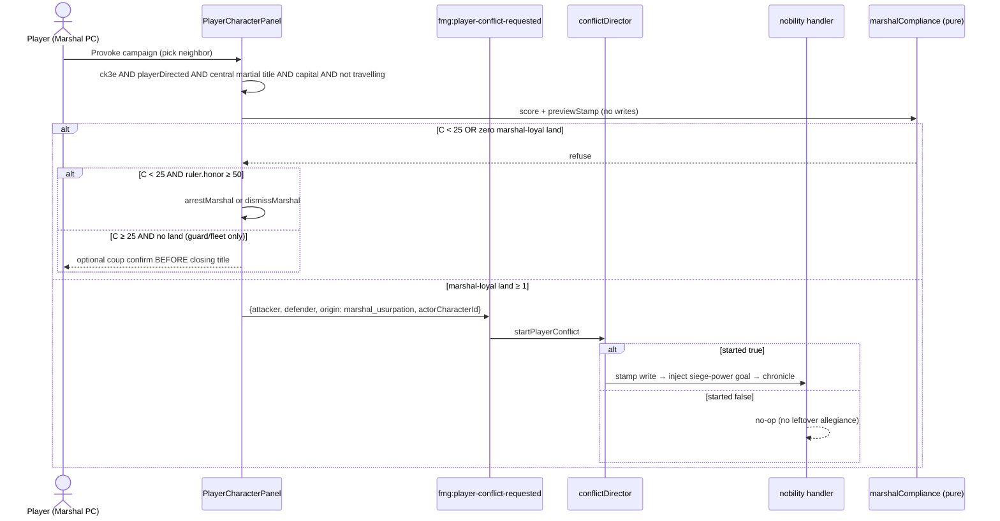
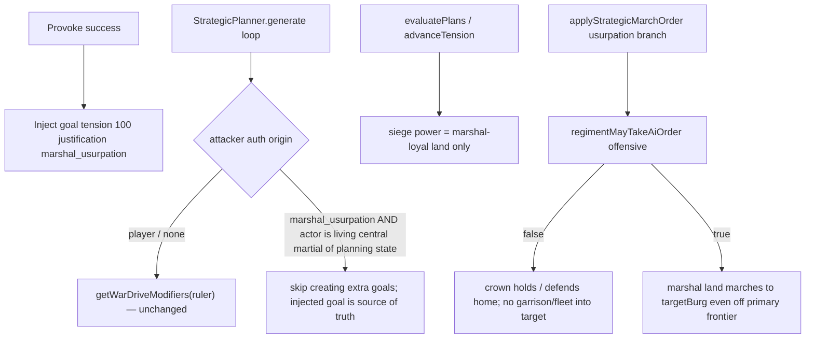

# プレイヤー軍務卿による君主の意に反する開戦

| 項目 | 内容 |
| :-- | :-- |
| 状態 | Draft |
| 対象 | Nobility / Characters / Diplomacy editor / Conflict director / Strategic planner / Regiment movement |
| 作成日 | 2026-09-06 |
| 改訂 | 2026-09-06（レビュー指摘を反映） |
| 著者 | — |
| 非対象 | NPC ホーク軍務卿の既存悪戯の再実装、Diplomacy Editor を第二の戦争地図にする改修、D&D プリセットへの宮廷陰謀の移植、近衛兵団の行軍解禁、負債クーデター用 `coupLegitimacy` / `civilUnrest` の流用 |

関連する実装済みフレーバー（辞任理由・NPC ホークの悪戯）は [`docs/plan/characters.md`](characters.md) §6「辞任理由のフレーバーと『手持ち無沙汰な鷹』の悪戯」を正本とする。本設計は **プレイヤーが軍務卿を操作して、君主が望まない戦争へ国を引きずり込む** 経路だけを扱う。

---

## Overview

現行の `playerDirected` 紛争政策では、Diplomacy Editor で関係を `Enemy` にした瞬間に `fmg:player-conflict-requested` が飛び、`startPlayerConflict()` が origin `"player"` の認可を **双方** の国家に書く。この経路は操作している人物が君主か軍務卿かを見ず、軍隊が従うかも見ない。戦略計画は常に **君主の Boldness**（`getWarDriveModifiers()`）で動き、NPC ホークの戦争製造（`tryProvokeWar()`）は `mayAdvanceAutonomousConflict()` でゲートされているため、プレイヤー志向マップでは使えない。

本設計は、CK3 宮廷かつ `conflictAutonomy === "playerDirected"` のとき、プレイヤーが当該国家の **中央軍務官職**（Marshal / Minister of War / General）を操作している場合に限り、「君主の外交意志を超えて **陸上野戦軍** を動かす」インキャラ行動を追加する。近衛兵団は現行どおり首都から出ない。艦隊は v1 の攻勢成功条件に数えない（海戦侵攻は `generate()` が未実装）。成功は軍事服従スコアに依存し、行進できる陸上野戦が 1 個も付かない独走は失敗とする。Fantasy は「主権者になること」ではなく **従属したまま野戦軍を引っ張ること** である。

---

## Background & Motivation

### 現状

| 経路 | 実装 | プレイヤー軍務卿に足りない点 |
| :-- | :-- | :-- |
| Diplomacy Editor → `Enemy` | `src/controllers/diplomacy-editor.ts` `changeRelation()` が `fmg:player-conflict-requested` を発火。`src/extensions/nobility/index.tsx` が `startPlayerConflict()` を呼ぶ | PC の役職を見ない。origin は常に `"player"` で **双方** に同じレコード。軍隊服従なし |
| 戦略計画 | `src/extensions/nobility/generators/strategic-planner.ts` が `getRulerId()` の Boldness と `getWarDriveModifiers()` を使う | ハト君主の下では認可されても攻撃目標が立たない |
| NPC ホーク悪戯 | `chooseIdleHawkMischief()` → `tryProvokeWar()` / `tryMilitaryCoup()` | `playerDirected` では `tryProvokeWar()` が no-op。プレイヤー操作ではない |
| 戦争フットング | `toggleWarFootingForRuler()` は `isLivingRulerOf()` 限定 | 軍務卿は戦時予算レバーを持てない（意図どおり維持する） |
| 近衛兵団 | `assignOfficers()` が `isCapitalGuard` を常に Marshal 配下にする。`advanceAllRegimentMovement()` は `if (r.isCapitalGuard) continue` で **一切行軍しない** | 近衛を「従う兵力」として数えると外交ラベルだけの戦争になる |
| 反応層 | `findHostileRegiments()` / `applyReactionMarchOrder()` は `diplomacy === "Enemy"` だけで野戦を動かす | 国家を Enemy にした瞬間、王冠忠誠の野戦も独走戦争へ吸い寄せられる |
| プレイヤー移動 | `playerCharacterTravel.ts` は burg-to-burg のみ。`Character.location` は burg id | 生成された Marshal は近衛の `commanderId` のみ。発令は首都に限定する |
| 関係史 | Neutrals `states[0].diplomacy` の年代記 + `State.campaigns`（`{name, start, end?, attacker, defender}`、**勝者フィールドなし**） | **キャラクター単位の従軍・戦勝記録は存在しない**。`end` は勝利ではない |

### 痛み

1. 軍務卿を PC に選んでも、戦争を起こす手段は GM 向け Diplomacy Editor しかなく、君主の意思との対立が表現されない。
2. origin `"player"` 一本だと、`mayAdvanceConflict` / `isStateInActiveConflict` / Diplomacy の Conflict バッジが「正当な宣戦」と「軍務卿の独走」を区別できない。双方に同じ origin を書くと、防御側 planner まで独走扱いになる。
3. ハト君主 + 認可済み `Enemy` でも planner が動かず、戦争が「外交ラベルだけ」で終わる。逆に Enemy にした瞬間、反応層が全野戦を動かす。
4. ベテラン将軍・高 Prestige・関係史を「兵が従いやすいか」に使うフックが無い。`campaign.end` を勝利と読むと生成時キャンペーンをほぼ全勝と誤算する。

---

## Goals & Non-Goals

### Goals

- CK3 宮廷（`getSelectedAbilityPresetId() === "ck3e"`）かつ `conflictAutonomy === "playerDirected"` で、PC が当該国家の **中央軍務称号**（`Marshal` / `Minister of War` / `General`）保持者であり君主ではないとき、君主が平和を望んでいても隣国への軍事行動を試みられる。
- 成功は軍事服従スコア（名声・対その隣国の戦争回数・包囲戦勝・指揮官との連帯・軍務予算 vs 君主の Honor/平和志向/名声と指揮官の忠誠）で決まり、失敗モードを必ず残す。
- 攻勢の独走は **行進可能な陸上野戦が 1 個以上**（`allegiance === "marshal" && !isCapitalGuard && !n && a > 0`）。近衛だけ・艦隊だけの「服従」は失敗。海戦侵攻が来るまで艦隊は成功条件に数えない。
- 開戦はプレイヤー行動として `playerDirected` と整合する。origin は攻撃側だけ `"marshal_usurpation"`、防御側は `"player"`（普通の応戦認可）。`mayAdvanceConflict` と bulk-advance 抑制は壊れない。
- UI は既存の `fmg:player-conflict-requested` を拡張する。第二の戦争地図は作らない。ボタンは上記ゲートを満たすときだけ見える。
- セーブ互換: 新フィールドはすべて optional。
- 関係史（対その隣国の戦争回数）と、在任中の `captured the city`、Prestige が高ければ兵を動かしやすい。

### Non-Goals

- 軍務卿を君主と同等の財政・宣戦権限者にしない（`toggleWarFootingForRuler`、公金押収、債務発行は君主のまま）。
- NPC ホーク経路（`tryProvokeWar`）を `playerDirected` で解禁しない。
- D&D プリセットへ宮廷陰謀・戦略計画を移植しない。HUD ボタンも出さない。
- 近衛兵団の「首都から出ない」不変条件を独走戦争のためだけに外さない。
- `State.coupLegitimacy` / `civilUnrest` / `legitimacyWarActive` を独走で触らない（Economy の負債クーデター・ticker と衝突する）。本物のクーデター（`tryMilitaryCoup`）が起きたときだけ、既存クーデター経路がそれらのフィールドを書いてよい。
- キャラクター単位の完全な戦史データベースは v1 では作らない。
- プレイヤー移動を burg 以外へ拡張しない。
- Honor/Piety/Rationality vs Energy/Boldness を一般的な辞任フレーバー判別軸にする作業（未配線のまま。`characters.md` §6 参照）。
- Ally / Vassal / Suzerain / Friendly への独走（背盟）は v1 対象外。

---

## Key Decisions

### D1. 軍務卿は主権者ではない（従属ファンタジー）

**決定**: プレイヤー軍務卿は宣戦の「国家意志」を書き換えない。書き換えるのは **どの陸上野戦（および将来の艦隊）が命令に従うか** と、従った連隊に対する戦略目標の注入だけである。v1 の攻勢は陸上のみ。君主はハトのまま `getWarDriveModifiers(ruler)` を使い続け、戦争フットング・公金・債務は触れない。**例外は D9 のみ**: 攻撃側 state の認可が `origin === "marshal_usurpation"` かつ `actorCharacterId` がその state の生存中央軍務官であるペアに限り、**その攻撃側の** 独走目標生成だけ軍務卿の Boldness/martial を使う。防御側・他ペア・王冠忠誠連隊には適用しない。

**根拠**: 要求は「君主の意に反して軍を引っ張る」であり、「将軍が王になる」ではない。後者は NPC `tryMilitaryCoup()` と、本設計の失敗梯子（D10）として残す。

### D2. origin は攻撃側だけ `"marshal_usurpation"`。防御側は `"player"`

**決定**: `ConflictAuthorization.origin` を `"player" | "marshal_usurpation"` に拡張する。任意フィールド `actorCharacterId?: number` は独走の攻撃側にだけ付ける。

`startPlayerConflict` の書き込み:

| 側 | `origin: "player"`（Editor / 省略時） | `origin: "marshal_usurpation"` |
| :-- | :-- | :-- |
| 攻撃側 → 防御側 | `{ origin: "player", startedAt }` | `{ origin: "marshal_usurpation", actorCharacterId, startedAt }` |
| 防御側 → 攻撃側 | `{ origin: "player", startedAt }` | `{ origin: "player", startedAt }`（応戦。独走タグは付けない） |

`mayAdvanceConflict(a, d)` は攻撃側レコードの origin が `"player"` または `"marshal_usurpation"` なら true（現行どおり **方向付き**）。防御側は `"player"` なので `mayAdvanceConflict(d, a)` も true（応戦できる）。`mayAdvanceAutonomousConflict` は false のまま。`shouldSuppressConflictAdvance`（bulk && !autonomous）は変えない。

Diplomacy バッジは **subject → object のレコードの origin** を読む（現行の「キーがあるか」だけではどちらも Player-directed に見える）。

History-mode（`historyModeForcesAutonomousConflict()`）では autonomous が強制されるため HUD 独走は出ない（ボタンは `playerDirected` 限定）。履歴ラン中に残った独走認可は AI 戦争と同時に生きうるが、本プレイスタイルの対象外。

**根拠**: 現行 `startPlayerConflict` は同じオブジェクトを双方に書く。ユニオン後もそうすると防御側 planner が攻撃側 Marshal の気質で逆侵攻するか、防御側 Marshal を誤って独走させる。防御側を `"player"` にすれば応戦は通常の認可戦争、D9 は攻撃側だけに効く。

### D3. NPC `tryProvokeWar` は使わない

**決定**: プレイヤー経路は origin 引数付き `startPlayerConflict` を呼ぶ。`tryProvokeWar()` の `mayAdvanceAutonomousConflict()` ゲートは触らない。

**根拠**: その関数は隣国を勝手に Enemy にし、`requiredAttackForce: 0` の `marshal_provocation` 目標を置く AI 用ショートカットである。player-directed で解禁すると NPC ホークも戦争を製造できる。

### D4. 従軍は campaign 回数。戦勝は `captured the city` のみ。`end` は勝利ではない

**決定**: **キャラクター単位の戦争記録は現時点で存在しない。** Relations history は Neutrals `states[0].diplomacy` の表示用年代記である。`Campaign` は `{name, start, end?, attacker, defender}` で **勝者を持たない**。`States.generateCampaign()` は隣国ごとに `attacker: state.i` と生成 `end` を書く。`generateDiplomacy()` が積む血讐キャンペーンは `end` 無しで、生成後に `end` を書くコードはリポジトリに無い。したがって **`end != null` を勝利と読んではならない。**

v1 プロキシ（クリック時 1 回、対象隣国 `targetId` 付き）:

- **在任期間**: `titles` + `pastTitles` のうち称号が `CENTRAL_MARTIAL_TITLE_RE`（`/Marshal|Minister of War|General/i`）にマッチする区間。`startYear` 欠落は区間に入れない。現行職の `endYear` は `getCurrentYear()`。年齢フィルタは掛けない（在任が重なっていればその人物は存在していた）。
- **warsVsTarget（従軍・関係史）**: `state.campaigns` のうち `(attacker, defender)` が `(marshalState, targetId)` または逆の件数。`characterLifecycle.calculateAffinities` と同じ数え方。年代記の宣戦イベントは **数えない**（同じ戦争が二重に入る）。
- **victories（戦勝）**: 年代記 `ChronicleEvent` のうち `action === "captured the city"`（完全一致。`"failed to capture the city"` / `"declared a war on its rival"` / `"avoided entering the war"` / `"joined the war on attackers side"` は除外）かつ `event.from === marshalState`。暦年は `simulationContext.currentYear - event.yearsAgo`。その年が在任期間と重なれば 1 勝。`to === targetId` なら対その隣国の勝利として victories 項に使い、他国への勝利は使わない。`campaign.end` は見ない。
- **prestige**: `Character.prestige`（1–100）を独立項。

v1.1 で optional `Character.militaryRecord?: { wars: number; victories: number; lastVictoryYear?: number }` を `battle-resolution.ts` が `captured the city` 時に在任中央軍務官へ書き戻す。undefined なら上記プロキシ。

**根拠**: 生成キャンペーンを「自国が attacker かつ end あり」で勝と読むと、ほぼ全隣国戦争が勝利になる。年代記の `action` はフレーズであり `/war|siege/` 部分一致は `"avoided entering the war"` まで拾う。

### D5. 攻勢には行進する **陸上** 野戦が必要。近衛・艦隊だけの服従は失敗

**決定**: クリック時に国家ネット `C`（0–100）を出し、非近衛に allegiance を振る。近衛（`isCapitalGuard`）は `allegiance` を付けても **行軍しない**（`advanceAllRegimentMovement` の既存 `continue` を外さない）。艦隊（`r.n`）は allegiance を付けてよいが、v1 では `applyStrategicMarchOrder` が `if (r.n) return false` し、`generate()` は海戦侵攻を disable しているため **攻勢成功に数えない**。

| 結果 | 条件 | 効果 |
| :-- | :-- | :-- |
| 失敗 | `C < 25`、または stamp 後に `allegiance === "marshal" && !isCapitalGuard && !n && a > 0` の連隊が 0 | 外交も認可も変えない。更迭/逮捕。陸上 0 で `C ≥ 25` なら D10 の近衛クーデター |
| 分裂 | `25 ≤ C < 55` かつ行進可能な marshal **陸上** 野戦が ≥ 1 | 有官は個別ロール、無官陸上/艦隊は `C ≥ 40` なら marshal |
| 過半 | `C ≥ 55` かつ行進可能な marshal **陸上** 野戦が ≥ 1 | 無官陸上/艦隊はすべて marshal。有官は個別ロールを **通った者だけ** marshal |

`MAX_FIELD_ARMIES = 21`（`military-generator.ts`）。加えて近衛 1、艦隊は別。有官は `OFFICER_ASSIGNMENT_CHANCE = 0.35` と `MIN_TROOPS_FOR_DEDICATED_OFFICER = 80` の **典型 0–3 であり上限ではない**。

**根拠**: 分裂帯で近衛だけが「従う」と、目標はあるが攻撃側が動かない。艦隊だけでも同じ空振り（陸上攻城に来ない）。近衛行軍を独走のためだけに解禁すると「近衛は合併せず首都を出ない」不変条件を壊す。

### D6. UI 入口は Player Character HUD。Editor は GM `"player"` のまま

**決定**: Nobility `PlayerCharacterPanel` に **Provoke campaign** を置く。見える条件はすべて真であること:

1. `getSelectedAbilityPresetId() === "ck3e"`（`usesCourtSystems` は `nobility/index.tsx` のローカル const であり、パネルから呼ばない）
2. `conflictAutonomy === "playerDirected"`
3. PC の state 称号が `CENTRAL_MARTIAL_TITLE_RE` にマッチ（**`primarySkill === "martial"` では出さない** — 野戦 Commander は `createOfficer` が martial を主技能にするため）
4. その国家の landed ruler が別人
5. `pendingTravel == null`
6. `character.location === state.capital`（burg id 一致。v1 で野戦駐留 burg は見ない）
7. 当該ペアに既存の `ConflictAuthorization` が無い（あれば拒否。Editor は GM として `"player"` へ上書きしてよい）

対象リスト: `state.neighbors` のうち関係が `Neutral` / `Unknown` / `Suspicion` / `Rival` / `Enemy`。**除外**: `Ally` / `Vassal` / `Suzerain` / `Friendly`。Unknown は Neutral 扱い（選んでよい）。

確定で HUD は服従スコアと **純粋** stamp プレビュー（書かない）だけを計算し、陸上 marshal 野戦が ≥ 1 なら `fmg:player-conflict-requested` を `origin: "marshal_usurpation"` + `actorCharacterId` 付きで発火する。世界への書き込み（認可・stamp・goal・年代記）はハンドラが `startPlayerConflict` の `started: true` の **あと** に一括で行う（Issue 23）。ハンドラは `actorCharacterId ===` 現在の PC かつ上記 3–4 を再検証し、失敗なら no-op（プレビュー stamp は書かれていないので残骸が残らない）。

**根拠**: Editor は第三国同士も Enemy にできる GM ツール。HUD をインキャラ入口にする。

### D7. 発令場所は首都 burg のみ（v1）

**決定**: `Character.location` は burg id。`location === state.capital` のときだけ Provoke 可能。旅中は不可。野戦 `commanderId` の駐留セル一致は v1 対象外（生成 Marshal の `commanderId` は行軍しない近衛だけなので、(a) と (b) は首都に潰れる）。

**根拠**: フィールド司令 PC にボタンを出さない（D6 の称号ゲート）以上、駐留 burg 分岐は実装しない。

### D8. CK3 かつ playerDirected のみ

**決定**: ボタン可視・発火・年次カウンタープレイは `getSelectedAbilityPresetId() === "ck3e"` かつ `getConflictAutonomy() === "playerDirected"`。D&D は出さない。autonomous マップでも出さない（disabled すら出さない）。

**根拠**: 官職ライフサイクル・武官任命・戦略計画は CK3 専用。autonomous では NPC 計画と独走タグが競合する。

### D9. 独走目標は注入する。王冠忠誠は攻勢 AI を取らない

**決定**: `generate()` の通常ループ（intel / `threatWeight` / ハト君主の `willingToAttack`）に独走を頼らない。成功クリックが `StrategicGoal` を **完全なリテラルで** 攻撃側に入れる（下記 Proposed Design）。`justification === "marshal_usurpation"` の目標について、戦力合計・80% 撤退・50% 到着は **marshal 忠誠かつ非近衛かつ非海軍** の `calculateEffectiveSiegePower * commanderPowerMultiplier` だけを数える（生の `a` と混在させない。首都は必ず `walls` がある）。

`applyStrategicMarchOrder` は独走目標について **primary-frontier の neighborState フィルタを使わない**。marshal 忠誠の陸上連隊を `goal.targetBurg` へ、同一 landmass / 陸路グラフが許す限り行軍させる。艦隊はこのパスに乗らない。

王冠忠誠（`allegiance !== "marshal"`、未定義含む）の、独走攻撃側連隊は、その独走対象に対する **攻勢 AI 命令を取らない**（戦略行軍だけでなく `ensureGarrisonMarchOrder` / `ensureFleetMarchOrder` も含む）。自国セル上の防御と、占領された **自国** burg の奪還は可。単一述語 `regimentMayTakeAiOrder` は **`src/generators/`**（`activeConflict.ts` の隣）に置き、`regimentMovement.ts` から extension を import しない。

**根拠**: Enemy 外交は応戦と `mayAdvanceConflict` に必要だが、反応層と駐屯/艦隊フォールバックは外交だけを見る。planner の skip だけでは王冠野戦が独走へ吸い寄せられる。

### D10. クーデターは開戦失敗の代替。兵が拒否したあとに無条件クーデターはしない

**決定**: 開戦成功後に自動で王位を奪わない。クーデター（既存 `tryMilitaryCoup()`、reason 文字列は変更しない）を HUD が提示できるのは **対象隣国を選んだあと**、`C ≥ 25` だが行進可能な marshal **陸上** 野戦が 0（近衛だけ / 艦隊だけ）のときだけ。

適格な隣国が 0（全員 Ally 等）のときは **v1 でクーデターを出さない**。`C` は `targetStateId` 付きでしか定義せず、対象無しの合成スコアは作らない。

`C < 25`（兵が将軍に付かない）ではクーデターも出さない。確認ダイアログは **称号を閉じる前**。`tryMilitaryCoup` は生存 landed 君主と `marshalTitle` を必要とする。

**根拠**: 既存クーデターは軍隊チェックが無い。服従失敗の直後に呼べば D5 を迂回して王位を取れる。対象無しパスは `warsVsTarget` が未定義なのでスコアを捏造することになる。宮廷クーデターは近衛で足りるが、対象戦争を試みて陸上だけが拒否したあとに限る。

---

## Proposed Design

### 全体フロー



### プレイヤーが実際に押すもの

1. Character Details の **Set as player character**（既存 `setPlayerCharacter()`）で Marshal を選ぶ。
2. HUD の `Provoke campaign` は D6 の条件をすべて満たすときだけ描画する（autonomous / D&D / 野戦司令 / 旅中 / 非首都では要素自体が無い）。
3. 小型 Dialog。行は隣国名、現行関係、`campaigns` の対その国回数（D4 の war-count）、在任中 `captured the city` 回数。除外関係は出さない。
4. 確定 → 服従スコア + 純粋 preview stamp。行進可能な marshal **陸上** 野戦が 1 以上ならイベントだけ発火。失敗なら tip と（条件付き）更迭/逮捕/近衛クーデター。既存認可があるペアは tip して発火しない。世界書き込みはハンドラ側。

Diplomacy Editor の Conflict バッジ:

| subject→object の origin | バッジ | tip |
| :-- | :-- | :-- |
| `"player"` | Player-directed（現行） | プレイヤー（または GM）が認可した紛争 |
| `"marshal_usurpation"` | Marshal-led（`ConflictStatus` `"marshal"`） | 軍務卿が独走して開戦。君主の認可ではない |
| なし + Enemy + playerDirected | Suspended（現行） | 変更なし |

`ConflictStatus`（`src/store/diplomacyEditorState.ts`）を `"autonomous" | "player" | "marshal" | "suspended" | "none"` に拡張する。`getConflictStatus` は `objectId in subject` ではなく `subject[objectId].origin` を読む: `"marshal_usurpation"` → `"marshal"`、`"player"` → `"player"`。防御側→攻撃側の `"player"` は現行 Player-directed のまま。Editor の `Enemy` クリック payload は現行 `{attackerStateId, defenderStateId}`（origin 省略 = `"player"`）。既存の独走認可があるペアを Editor が Enemy のまま触ると origin を `"player"` に上書きしてよい（GM）。逆に HUD は既存認可を上書きしない。 `conflictStatusCopy` は `Record<ConflictStatus, …>` なので型拡張と同時に Marshal-led 行を足す。

ボタンラベルは称号文字列をそのまま使う（"Provoke campaign as Marshal" / "… as Minister of War"）。

### 単一スキップ述語

`src/generators/regimentMovement.ts` は nobility 拡張を import しない（占領は `onCellEntered` コールバック）。述語は **`src/generators/marshalUsurpationOrders.ts`**（`activeConflict.ts` の隣）に置く。`activeConflict.ts` と同じく `simulationContext.extensions.nobility.conflictAuthorizationsByState` と `regiment.allegiance` を読む。Nobility の `localSkirmish` / `homeRecapture` / `marchCapture` はこの generator モジュールを import してよい。optional predicate を `advanceAllRegimentMovement` に通す案は採らない（呼び出し側が 8 関数あり、スレッド漏れが Issue 19 を再発させる）。

```ts
export type AiOrderKind = "offensive" | "home-defense";

export function isUsurpationAttackAgainst(attackerStateId: number, targetStateId: number): boolean {
  // slice origin === "marshal_usurpation" on attacker → target (not the defender's mirrored "player")
}

/** cell の pack.cells.state が regiment.state なら自国領上。 */
export function isOnHomeCells(regiment: MilitaryRegiment, cell: number, pack: PackedGraph): boolean;

/**
 * 独走攻撃側の王冠忠誠連隊は、独走対象への攻勢 AI を取らない。
 * 自国セル上の防御・占領された自国 burg の奪還は home-defense で常に true。
 * allegiance === "marshal" は常に true。
 * 独走対象でない国家に対しては常に true（通常の Enemy 戦争を壊さない）。
 */
export function regimentMayTakeAiOrder(
  regiment: MilitaryRegiment,
  targetStateId: number,
  kind: AiOrderKind
): boolean {
  if (kind === "home-defense") return true;
  if (regiment.allegiance === "marshal") return true;
  if (!isUsurpationAttackAgainst(regiment.state, targetStateId)) return true;
  return false;
}
```

呼び出し側（**これ以外に独走専用の if を散らさない**）:

| 関数 | ファイル | kind | 使い方 |
| :-- | :-- | :-- | :-- |
| `applyReactionMarchOrder` | `src/generators/regimentMovement.ts` | 敵が自国セル上なら `home-defense`、それ以外は `offensive` | false なら chase しない。退却（自 burg へ）は `home-defense` なので可 |
| `findHostileRegiments` | 同上 | — | 攻撃側王冠連隊からは、独走対象の連隊を「敵」に入れない。ただしその敵が攻撃側の自国セルにいるなら入れる（防御） |
| `applyRecaptureMarchOrder` | 同上 | `home-defense` | 占領された **自国** burg の奪還のみ可 |
| `applyStrategicMarchOrder` | 同上 | `offensive` | 独走目標: marshal 忠誠 **陸上** のみ。`justification === "marshal_usurpation"` のとき **primary-frontier neighbor フィルタを外し**、同一 landmass / 陸路グラフが許す限り `goal.targetBurg` へ行軍。`r.n` は現行どおり false |
| `ensureGarrisonMarchOrder` | 同上 | `offensive`（目的地が独走対象のセル/ burg のとき） | 王冠は独走対象の `neighborState` や `reclaimableEnemyCells`（対象国内の旧領）を目的地にしない。自領内の hold / 自 burg 退却のみ |
| `ensureFleetMarchOrder` | 同上 | `offensive`（目的港の所有が独走対象のとき） | 王冠艦隊は独走対象の敵港へ path しない |
| `LocalSkirmish.resolve` | `localSkirmish.ts` | 接触セルが stateA 領なら A 側 `home-defense` | 国境/敵領での接触は王冠 A を `regsA` から除外。近衛は現行どおり除外 |
| `tryRecaptureHomeBurg` | `homeRecapture.ts` | `home-defense` | 可 |
| `tryCaptureOnPassing` | `marchCapture.ts` | `offensive` | 独走対象 burg の通過占領は王冠不可、marshal 忠誠のみ |
| `evaluatePlans` / `advanceTension` の戦力合計 | `strategic-planner.ts` | — | 独走目標は `allegiance === "marshal" && !isCapitalGuard && !n` の `calculateEffectiveSiegePower * commanderPowerMultiplier` だけ加算 |

近衛は上記に加え、既存の `isCapitalGuard` continue が残るので行軍も小競り合いも無い。

### 服従スコア

純粋関数: `src/extensions/nobility/generators/marshalCompliance.ts`。

入力: marshal, ruler, state, targetStateId, characters, pack。

```ts
export interface MarshalComplianceBreakdown {
  prestige: number;          // Character.prestige, weight 0.25
  veteran: number;           // warsVsTarget + years in central martial office, weight 0.20
  victories: number;         // captured the city vs target during tenure, weight 0.15
  officerSolidarity: number; // mean relationToHundred(getSolidarity(marshal, officer.i)), empty → 50, weight 0.15
  marshalcyFunding: number;  // weight 0.10
  martialSkill: number;      // marshal.skills.martial, weight 0.15
  relationPull: number;      // Enemy 15, Rival 10, Suspicion 5, else 0 — folded into veteran before clamp
  pull: number;              // weighted sum, clamp 0–100
  rulerHonor: number;        // ruler.personality.honor, weight 0.30 of push
  rulerPeace: number;        // 100 - boldness, weight 0.25
  rulerPrestige: number;     // weight 0.20
  liegeLoyalty: number;      // mean relationToHundred(getSolidarity(officer, ruler.i)), empty → 50, weight 0.25
  push: number;              // 0–100
  net: number;               // clamp(pull - 0.55 * push, 0, 100)
}

const FOLLOW_MAJORITY = 55;
const FOLLOW_SPLIT = 25;
const UNTITLED_FOLLOW_IN_SPLIT = 40;

function relationToHundred(score: number): number {
  return (score + 100) / 2; // idleHawkMischief.ts と同じ
}
```

項:

- **veteran**: `min(100, 25 * warsVsTarget + 8 * yearsInCentralMartialOffice + relationPull)`。`warsVsTarget` は D4。対象隣国の関係史が効く。
- **victories**: `min(100, 35 * capturesVsTarget + (lastCaptureYear が currentYear-10 以内なら +15))`。captures は D4 の `action === "captured the city"` のみ。0 件なら項は 0（プロキシを捏造しない）。
- **marshalcyFunding**: `isEconomyContextReady()` が false なら **50**。true なら `clamp(0, 100, Math.round((state.militaryFundingRatio ?? 1) * 100))`。
- **officerSolidarity / liegeLoyalty**: 生存中の同国 `Commander` / `Admiral`（称号。Marshal 自身は除外）。0 人ならどちらも 50。

連隊 stamp（近衛はスキップして `allegiance` 未設定のまま = 行軍しない）:

```
if C < 25: stamp nothing (all crown / undefined). result = fail
else:
  for each non-guard regiment:
    untitled: marshal if (C ≥ 55) OR (split && C ≥ 40); else crown
    titled Commander/Admiral: marshal iff
      relationToHundred(getSolidarity(officer, marshal.i)) を使わず生の -100..100 で
      getSolidarity(officer, marshal) - getSolidarity(officer, ruler)
        + marshal.prestige * 0.3 + officer.personality.boldness * 0.2
        ≥ 30 + ruler.personality.honor * 0.25
      （過半帯でも有官はこの式。嫌っている司令は王冠に残る）
  if count(marshal && !guard && !n && a > 0) === 0: fail (no marching land)
```

個別ロールは **分裂帯と過半帯の有官だけ**。失敗帯では近衛も動かさない（行軍しないので stamp もしない）。preview stamp は純粋関数で `Map<regimentId, "crown" | "marshal">` を返し、**書かない**。書き込みはハンドラが認可成功後にだけ行う。

期待規模: 近衛 1 + 野戦最大 21 + 艦隊。有官は典型 0–3、上限なし。クリック時 O(regiments + officers + campaigns + chronicle groups)。テストは「有官 ≤ 3」を前提にしない。

### 成功時に書く `StrategicGoal`（完全リテラル）

`StrategicGoal`（`src/context/simulationContext.ts`）は `requiredAttackForce` 必須。NPC `tryProvokeWar` の `0` は使わない（`advanceTension` の「必要兵力の 50% が到着」が即成立する）。v1 の `targetBurg` は防御側首都であり、`burgs-generator` が `burg.walls = Number(burg.capital || …)` と書くため **常に要塞**（`isFortified === true`）。城壁に対する `calculateEffectiveSiegePower` は mounted = 0、ranged = 0.5、melee = 1。生の `a`（`regimentTroopStrength`）を入れると騎馬中心の loyal スタックが翌 Day-1 の `evaluatePlans` 80% 判定で goal を消される。

```ts
const isFortified = true; // capital always has walls
const militaryOptions = worldContext.options.military || [];
const characters = pack.characters || [];

const loyalLand = attacker.military.filter(
  r => r.allegiance === "marshal" && !r.isCapitalGuard && !r.n && r.a > 0
);

const loyalSiegePower = sum(
  loyalLand.map(
    r => calculateEffectiveSiegePower(r, isFortified, militaryOptions) * commanderPowerMultiplier(characters, r)
  )
);

const capitalBurgId = typeof defender.capital === "number" ? defender.capital : 0;

const goal: StrategicGoal = {
  targetBurg: capitalBurgId, // 首都。辺境 burg 選定は v1 ではしない（注入を確実にするため）
  targetState: defenderId,
  type: "siege",
  tension: 100, // getActiveSiegeTargets() が即日返す
  expectedCasualties: marshal.personality.boldness > 70 ? "low" : "moderate",
  justification: "marshal_usurpation",
  requiredAttackForce: Math.max(1, loyalSiegePower) // 同じ単位。生の a と混在させない
};
```

既存の同 `targetState` 目標があれば、それをこのリテラルで **置き換える**。`evaluatePlans` / `advanceTension` の 80% 撤退と 50% 到着は **同じ** loyal 陸上フィルタ + 同じ siege-power 単位。クリック時に `goalTargetBurg` / `destinationCell` を手で付けない。`tension: 100` により `getActiveSiegeTargets` が即日返し、`applyStrategicMarchOrder` の **独走分岐**（primary-frontier neighbor フィルタ無し、同一 landmass / 陸路グラフ）が marshal 陸上だけを `goal.targetBurg` へ送る。

### 成功時のその他の世界変化

1. 認可は D2 の非対称書き込み。
2. 双方 `diplomacy[id] = "Enemy"`（応戦と `mayAdvanceConflict` のため。王冠の攻勢は述語が止める）。
3. 年代記グループ `["War declaration (marshal)", event]` を `states[0].diplomacy` 先頭へ。`event.action = "led the army to war against the ruler's wishes"`。`from` = 攻撃側、`to` = 防御側、`yearsAgo = 0`。既存パーサ（先頭が文字列ヘッダ、残りが ChronicleEvent）を壊さない。
4. 上記 goal 注入。
5. ハンドラが stamp を書く（HUD のプレビューではない）。近衛・王冠は `actionStatus` を触らない。
6. `adjustSolidarity(ruler, marshal.i, -25)`。Marshal Honor ≥ 60 なら `adjustSolidarity(marshal, ruler.i, -10)`。
7. **`coupLegitimacy` / `civilUnrest` / `legitimacyPretenderId` は書かない。** 政治コストは solidarity と称号 reason と独走認可そのもの。

### 失敗モード

| 失敗 | 条件 | 効果 | 実装 |
| :-- | :-- | :-- | :-- |
| 兵が従わない | `C < 25` | 外交・認可なし。tip。prestige -5 | 新規 |
| 更迭 | `C < 25` かつ ruler.honor ≥ 50 | `dismissMarshal("Dismissed for insubordination")` | 新規ヘルパ。既存 `closeOffice` はランダム burg へ移すので **使わない** |
| 逮捕 | 更迭条件 + `location === capital` + (ruler.intrigue ≥ 60 **または** marshal.prowess < 40) | `arrestMarshal("Arrested for treason")`: 称号を閉じ、`location = capital`、`arrestedUntilYear = getCurrentYear() + 1` | Move / `pendingTravel` 開始は `arrestedUntilYear >= getCurrentYear()` で拒否 |
| 近衛/艦隊だけ | `C ≥ 25` だが行進 marshal **陸上** 0（対象隣国は選んである） | 外交なし。tip。D10 のクーデター確認を出してよい | 近衛行軍なし。対象無しマップではクーデター自体を出さない |
| 分裂 | D5 分裂かつ陸上野戦 ≥ 1 | 成功パス。王冠野戦は述語で攻勢しない | allegiance |
| クーデター | D10（対象あり + 陸上 0 + `C ≥ 25`） | 確認後に `tryMilitaryCoup`。reason は `"Deposed by military coup"` / `"Seized the throne"` のまま | 称号を閉じる **前**。失敗したらその後 dismiss 可 |

`C < 25` かつ Honor < 50: 更迭も逮捕もせず、兵が動かないだけ（弱い君主は罰しきれない）。シーケンス図と同じ。

カウンタープレイ（`nobility.characterLifecycle`、CK3 分岐、`processResignationsAndSuccessions` の直後）:

- 独走認可が残っている間、ruler.boldness < 40 かつ honor ≥ 55 なら **毎ティック** `P(0.2 * deltaYears)` で更迭/逮捕を再試行（idle-hawk と同じ時計）。Marshal が `location !== capital` なら失敗。
- 独走開始以降に `captured the city`（from = 自国）が 1 件でも付いたら、更迭率を半分（`P(0.1 * deltaYears)`）にし solidarity を +10 まで戻す。
- Marshal 死亡、または中央軍務称号喪失: **`isAnnualBoundary()`**（day=1, month=1）で `endPlayerConflict({attacker, defender})` を呼ぶ。防御側の `"player"` ミラーも消える。外交が Enemy のままならバッジは Suspended。飛行中の独走 goal / marshal 行軍は `endPlayerConflict` の既存 `discardStrategicGoals` が捨てる。追認は Editor で `"player"` 認可を出し直す。
- クーデター成功後、独走 origin は `"player"` に昇格しない（履歴）。終戦は和平 / Editor。

`allegiance` クリア: `endPlayerConflict` 時に攻撃側 military の `allegiance` を delete。`assignOfficers` 毎ティックでは消さない。

### 戦略計画との接続



`generate()` は独走ペアに対して新規目標を **足さない**（注入が正本。ハト君主ループが目標を消したり二重化したりしない）。`evaluatePlans` が `mayAdvanceConflict` で消さないよう、攻撃側認可が残っている間は保持する。Ally/Friendly チェックは v1 対象がそれらの関係を禁止するので到達しない。

プレイヤーは独走戦争を Advance Day で解決する。Week/Month/Year は現行どおり軍隊を動かさない（D2、Open Q なし）。

### 終戦

`fmg:player-conflict-ended` → `endPlayerConflict`（origin 不問、双方の認可と目標を破棄、攻撃側 allegiance を delete）。Marshal 死亡/更迭の年界失効も同じ関数。

`Military.generate()` が配列を作り直すと `allegiance` は消える。独走認可が残っていて `actorCharacterId` がまだ中央軍務に就いているなら、**同じ純粋 `stampMarshalAllegiance()` をもう一度実行**する（直近クリックと同じ入力なので結果は統計が変わらない限り同じ）。王冠へスナップしない。HUD に「Regenerate military は独走中の忠誠を再計算する」と data-tip。

---

## API / Interface Changes

### `ConflictAuthorization`

```ts
export type ConflictOrigin = "player" | "marshal_usurpation";

export interface ConflictAuthorization {
  origin: ConflictOrigin;
  startedAt: { year: number; month: number; day: number };
  actorCharacterId?: number; // 攻撃側の marshal_usurpation のみ
}

export interface PlayerConflictIntent {
  attackerStateId: number;
  defenderStateId: number;
  origin?: ConflictOrigin; // default "player"
  actorCharacterId?: number;
}
```

`isPlayerConflictAuthorized(attacker, defender)` は攻撃側レコードの origin ∈ {player, marshal_usurpation}。

`src/generators/activeConflict.ts` `hasPlayerAuthorization` も同じユニオン（**PR1**）。`origin === "player"` 固定のままでは独走中の戦時経済が乗らない。

イベント detail に origin / actorCharacterId を載せる。`_playerConflictRequestedHandler` はそれを渡し、marshal_usurpation のとき:

- `actorCharacterId` が `usePlayerCharacterState.playerCharacterId` と一致
- そのキャラが攻撃側の生存中央軍務官
- 既に別 origin の認可が無い

を満たさなければ return（**stamp しない**）。origin 欠落は `"player"`（Editor 互換）。

独走で `startPlayerConflict` が `{ started: true }` を返したあと、同じハンドラが **この順** で書く:

1. `stampMarshalAllegiance()`（プレビュー結果の適用。HUD は書いていない）
2. 上記 siege-power `StrategicGoal` を注入
3. 年代記 `War declaration (marshal)`

どれかが投げても認可だけ残らないよう、失敗時は `endPlayerConflict` で巻き戻す。HUD はスコアと発火だけ。

### HUD

`buildPlayerCharacterSummary` に `isCentralMartialOfficer: boolean`（称号正規表現のみ）。Provoke は `isCentralMartialOfficer && !isLandedRuler`。財政ボタンは現行の `isLandedRuler`。

パネルのプリセット判定: `getSelectedAbilityPresetId()`（`src/extensions/characters/charactersContext.ts`）。`usesCourtSystems()` は import しない。

### 連隊

```ts
allegiance?: "crown" | "marshal"; // undefined = crown
```

`militaryHierarchy === "dynamic"` のとき `splitDetachment()`（`regimentMovement.ts`）が新連隊を `parentId` 付きで push する。親の `allegiance === "marshal"` なら **detachment にコピー**する。未コピーだと undefined = crown になり、Issue 19 のスキップで攻勢スタックが痩せる。デフォルト `"simple"` では split は走らない。

### 逮捕

```ts
arrestedUntilYear?: number; // Character, optional
```

`dismissMarshal` / `arrestMarshal` は `characterLifecycle.ts` のランダム再配置 `closeOffice` を呼ばない。称号を `pastTitles` へ閉じ、逮捕だけ `location = state.capital`。

---

## Data Model Changes

| フィールド | 必須? | 移行 |
| :-- | :-- | :-- |
| `ConflictAuthorization.origin` ユニオン | 既存必須、値追加 | 旧セーブ `"player"`。読み取り側をユニオン対応。独走時は攻撃側だけ新値 |
| `actorCharacterId` | optional | 無しでも戦争は進むが D9 バイパスは ruler のまま（注入 goal は justification で動く） |
| `MilitaryRegiment.allegiance` | optional | 無し = crown |
| `Character.militaryRecord` | optional（v1.1 / PR6） | 無し = D4 プロキシ |
| `Character.arrestedUntilYear` | optional | 無し = 拘束なし |

`coupLegitimacy` / `civilUnrest` は **追加も更新もしない**。`State.campaigns` と年代記の形は変えない。

---

## Alternatives Considered

### Alt A. Diplomacy Editor の Enemy クリックを PC 役職で分岐する

- 利点: 新ボタン不要。
- 欠点: Editor は第三国対も編集できる。服従判定と GM 編集が同一クリックになる。
- **不採用**（D6）。

### Alt B. NPC `tryProvokeWar` を PC Marshal のときだけ player-directed で許可

- 利点: 数行。
- 欠点: 服従も非対称 origin も失敗モードも無い。`requiredAttackForce: 0`。ゲート緩和は NPC ホークも通す。
- **不採用**（D3）。

### Alt C. 軍務卿を戦争主権者にする / 近衛を独走中だけ行軍させる

- 利点: planner と movement の例外が減る。分裂帯が近衛だけで成立する。
- 欠点: 従属ファンタジーと「近衛は首都を出ない」不変条件を同時に壊す。war footing まで渡すと内政ごと乗っ取る。
- **不採用**。近衛行軍なし、陸上野戦が 0 なら失敗（D5）。

### Alt D. 従軍記録を必須の新テーブルにする / `campaign.end` を勝利にする

- 欠点: `end` は勝利ではない。必須テーブルは v1 を止める。
- **段階採用**: v1 は war-count + `captured the city`。v1.1 optional `militaryRecord`。

### Alt E. 分裂戦争では国家外交を Enemy にしない

- 利点: 反応層が王冠を動かさない。
- 欠点: `mayAdvanceConflict` と防御側応戦、`isStateInActiveConflict`、skirmish の Enemy ゲートを別系統で再実装することになる。
- **不採用**。Enemy は立て、王冠の攻勢だけ述語で止める（D9）。

---

## Security & Privacy Considerations

- 単一プレイヤーのローカルマップ。認証は無い。
- HUD 経路は PC 所属国の隣国だけ。ハンドラは `actorCharacterId ===` PC かつ中央軍務を再検証する（PR4 のテスト必須）。
- 既存認可の上書き: HUD は拒否。Editor は GM として `"player"` にできる。
- チート耐性は非目標。

---

## Observability

- 成功 tip に origin と `net` と marshal 忠誠の **陸上** 野戦数。
- 失敗は HUD tip + `pastTitles.reason`（英語カタログ）。
- テスト:
  - 攻撃側 origin `marshal_usurpation`、防御側 `"player"`。`mayAdvanceConflict` 双方向 true。バッジは subject 側 origin（`ConflictStatus` `"marshal"`）。
  - `isStateInActiveConflict` true（PR1 の `hasPlayerAuthorization` ユニオン）。
  - ハト君主（Boldness 20）でも注入 goal が tension 100 で残る。
  - **城壁首都 + 騎馬中心の loyal スタックで `evaluatePlans` が goal を消さない**（`requiredAttackForce` が siege power 単位）。
  - marshal 陸上野戦が別 rival 国境にいても、独走 `targetBurg` へ path を持つ（primary-frontier フィルタ無し）。
  - 王冠陸上は独走対象セルへ `destinationCell` を持たない（garrison fallback 含む）。王冠艦隊は対象港へ path しない。自国セル上の防御反応は残る。
  - 近衛が `destinationCell` を持たない。艦隊だけの stamp ではイベントを発火しない。
  - `tryProvokeWar` は playerDirected で false。
  - `campaign.end` があっても victories が増えない。`captured the city` だけで増える。
  - 既存認可があるペアへの Provoke が no-op。actor が PC でないイベントが drop（stamp 残骸なし）。
  - `militaryHierarchy === "dynamic"` で親 `allegiance === "marshal"` の detachment が同じ allegiance を持つ。
- デバッグ: バッジ + HUD の breakdown data-tip。

---

## Rollout Plan

- 新規フィーチャーフラグは作らない。ゲートは `getSelectedAbilityPresetId() === "ck3e"` と `conflictAutonomy === "playerDirected"`。
- 下記 PR はテスト付きでマージ可能。HUD ボタンは述語・stamp・goal 注入が揃う PR4 まで出さない（PR3 までの中間で Provoke = 全国戦争にならない）。
- ロールバックは PR 単位。optional フィールドは残っても無害。
- 既存 `"player"` 戦争は無変更。

---

## Open Questions

v1 の製品分岐は Key Decisions に閉じた。実装中にユーザー判断が要る項目は残していない。

---

## Risks

| 重大度 | リスク | 緩和 |
| :-- | :-- | :-- |
| High | planner が君主 Boldness のまま目標を消す/作らない | 注入 goal が正本。`generate()` は独走ペアに足さない。テスト: Boldness 20 でも tension 100 が残る |
| High | 城壁首都に生の `a` を入れると騎馬スタックで goal が消える | `requiredAttackForce` と withdraw/arrival を同じ siege-power 単位に。mounted-vs-walls テスト |
| High | `activeConflict.ts` が origin `"player"` 固定 | **PR1** でユニオン対応（HUD より前） |
| High | Enemy 外交が反応層・garrison/fleet で王冠を動かす | generator 層の `regimentMayTakeAiOrder` を表の全呼び出し側（garrison/fleet 含む）に必須 |
| High | 近衛/艦隊だけが「従う」と戦争が空振り | stamp 後に行進 marshal **陸上** 0 なら失敗（D5） |
| High | `applyStrategicMarchOrder` が別 rival 国境の loyal 陸上を動かさない | 独走分岐で primary-frontier neighbor フィルタを外し `targetBurg` へ |
| Medium | `evaluatePlans` が全軍戦力で撤退判定 | 独走目標は loyal 陸上の siege power だけ加算 |
| Medium | generators→nobility import 循環 | 述語は `src/generators/marshalUsurpationOrders.ts`（`activeConflict.ts` と同じ slice 読み） |
| Medium | Diplomacy Editor と HUD の二重入口 | バッジ origin、HUD は既存認可を上書きしない |
| Medium | `Military.generate()` で allegiance 消失 | 認可残存中は `stampMarshalAllegiance()` 再実行。王冠へ固定スナップしない |
| Low | D&D / autonomous でボタンが出る | `getSelectedAbilityPresetId()` と `conflictAutonomy`。パネルテスト |
| Low | 負債クーデター ticker を誤起動 | `coupLegitimacy` / `civilUnrest` を独走では書かない |

---

## References

- 実装済み辞任フレーバー: [`docs/plan/characters.md`](characters.md) §6
- 武官・近衛: [`docs/plan/char.md`](char.md)、`src/extensions/nobility/generators/officerAssignment.ts`
- 近衛非行軍 / 戦略行軍 / garrison / fleet: `src/generators/regimentMovement.ts`（`isCapitalGuard` continue、`applyStrategicMarchOrder` の neighbor フィルタ、`ensureGarrisonMarchOrder`、`ensureFleetMarchOrder`）、`MAX_FIELD_ARMIES = 21` in `military-generator.ts`
- 独走述語: `src/generators/marshalUsurpationOrders.ts`（`activeConflict.ts` と同じ nobility slice 読み。`regimentMovement.ts` は nobility を import しない）
- 包囲戦力: `calculateEffectiveSiegePower` / `commanderPowerMultiplier` in `src/extensions/nobility/generators/localDefense.ts`（城壁で mounted = 0）
- Diplomacy バッジ型: `ConflictStatus` in `src/store/diplomacyEditorState.ts`
- 紛争政策: `src/utils/conflictAutonomy.ts`、`src/extensions/nobility/conflictDirector.ts`、[`docs/plan/advance-time-loop-reduction.md`](advance-time-loop-reduction.md) Phase 1b
- 戦争駆動: `src/extensions/characters/characterSimulationHooks.ts` `getWarDriveModifiers`
- NPC ホーク: `src/extensions/characters/idleHawkMischief.ts`、`src/extensions/nobility/generators/marshalMischief.ts`
- 関係史: `src/ui/dialogs/DiplomacyHistoryDialog.tsx`、`Campaign` / `ChronicleEvent` in `src/types/models.ts`、`calculateAffinities` の war-count
- 関係キー: `src/utils/diplomacyRelations.ts`
- 財政: `toggleWarFootingForRuler`（君主限定）。独走は `coupLegitimacy` に触れない（`coupAftermath.ts`）
- プレイヤー HUD: `src/extensions/nobility/ui/components/PlayerCharacterPanel.tsx`
- プリセット: `getSelectedAbilityPresetId()` in `src/extensions/characters/charactersContext.ts`（`usesCourtSystems` は index.tsx のローカル）
- Economy ゲート: `isEconomyContextReady()` in `src/extensions/economy/economyContext.ts`

---

## PR Plan

各 PR は単体マージ可。**ボタンは PR4 まで出さない。**

### PR1 — 非対称 origin と認可の読み取り

- **依存**: なし
- **ファイル**: `src/extensions/nobility/types.ts`、`conflictDirector.ts`、`conflictDirector.test.ts`、`src/generators/activeConflict.ts`、`src/generators/activeConflict.test.ts`、`src/store/diplomacyEditorState.ts`（`ConflictStatus` に `"marshal"`）、`src/controllers/diplomacy-editor.ts`、`src/ui/dialogs/DiplomacyEditorDialog.tsx`
- **内容**: `ConflictOrigin`。`startPlayerConflict` が D2 どおり書く（独走は攻撃側だけ `marshal_usurpation` + actor、防御側は `"player"`）。省略時双方 `"player"`。`isPlayerConflictAuthorized` / `hasPlayerAuthorization` / バッジが origin を読む。`ConflictStatus` `"marshal"` → Marshal-led。HUD なし。
- **テスト**: origin なし → `"player"`。独走で `mayAdvanceConflict(att, def)` と `mayAdvanceConflict(def, att)` が true、`mayAdvanceAutonomousConflict` false。`isStateInActiveConflict` true。バッジは att→def が Marshal-led（`"marshal"`）、def→att が Player-directed。`endPlayerConflict` が双方を消す。

### PR2 — 服従スコア（純粋関数）

- **依存**: なし（PR1 と並列可）
- **ファイル**: 新規 `marshalCompliance.ts` / `.test.ts`
- **内容**: D4 プロキシと D5 stamp（副作用なしの stamp 結果を返す。書き込みは PR3）。`isEconomyContextReady` で funding。`relationToHundred`。空将校は 50。
- **テスト**: `campaign.end` だけでは victories 0。`captured the city` + 在任重なりで victories 増加。対その隣国の campaigns 件数で veteran 増加。年代記宣戦を wars に足さない。Economy オフで funding 50。有官人数の上限を仮定しない。

### PR3 — スキップ述語・allegiance・戦力フィルタ（エンジン。HUD なし）

- **依存**: PR1, PR2
- **ファイル**: `src/types/models.ts`（optional allegiance）、新規 `src/generators/marshalUsurpationOrders.ts`（`activeConflict.ts` 隣。`isUsurpationAttackAgainst` / `regimentMayTakeAiOrder`）、`regimentMovement.ts`（reaction / recapture / **strategic 独走分岐** / **ensureGarrisonMarchOrder** / **ensureFleetMarchOrder** / `splitDetachment` の allegiance コピー）、`localSkirmish.ts`、`homeRecapture.ts`、`marchCapture.ts`、`strategic-planner.ts`（独走 goal の siege-power フィルタ、`generate()` が独走ペアに目標を足さない）、`officerAssignment.ts`（再生成後の再 stamp 呼び出しだけ）、`marshalCompliance.ts` の stamp **適用**関数（書き込み。preview は PR2 の純粋関数）
- **内容**: generator 層の述語を表の全呼び出し側に接続。テストから `startPlayerConflict({origin:"marshal_usurpation"})` + stamp して王冠が独走対象へ行軍しないこと、garrison/fleet が対象国内/港を目的地にしないこと、自国セル防御は残ること、近衛が動かないことを固定する。goal 注入ヘルパ（siege-power リテラル、tension 100）もこの PR。`regimentMovement.ts` は nobility を import しない。
- **テスト**: ハト君主でも注入 goal が `evaluatePlans` で消えない。城壁首都 + 騎馬中心 loyal スタックで goal が残る（生の `a` ではない）。loyal 陸上 0 なら注入しない。別 rival 国境の loyal 陸上でも `targetBurg` へ path。王冠陸上は対象セルへ `destinationCell` 無し。王冠艦隊は対象港へ path 無し。`tryProvokeWar` 回帰。dynamic hierarchy で marshal 親の detachment が allegiance を継承。

### PR4 — HUD Provoke（最初のプレイヤー操作スライス）

- **依存**: PR1–PR3
- **ファイル**: `PlayerCharacterPanel.tsx`、`controllers/playerCharacter.ts`（`isCentralMartialOfficer`）、小型 Dialog、`nobility/index.tsx` ハンドラ、年代記 append
- **内容**: D6 ゲート。HUD はスコア + 純粋 preview stamp + イベント発火のみ。`started: true` のあとハンドラが stamp 書き込み → siege-power goal 注入 → 年代記。既存認可は拒否。ボタンは PR3 無しでは出ない（この PR が最初の可視）。隣国リストが空なら Provoke もクーデターも出さない。
- **テスト**: D&D / autonomous で非表示。旅中・`location !== capital` で非表示。Commander 称号で非表示。Ally/Friendly/Vassal/Suzerain がリストに無い。Unknown は出る。actor ≠ PC のイベント drop（allegiance 残骸なし）。既存 `"player"` 認可の上書きなし。陸上 0 の preview では発火せず、対象ありならクーデター確認のみ。

### PR5 — 更迭・逮捕・クーデター順序

- **依存**: PR4
- **ファイル**: `dismissMarshal` / `arrestMarshal`（ランダム `closeOffice` を使わない）、`PlayerCharacterPanel`（逮捕中 Move 無効、D10 確認ダイアログ）、`characterLifecycle.ts` の毎ティック `P(0.2 * deltaYears)` 再試行と `isAnnualBoundary()` での `endPlayerConflict`、`endPlayerConflict` の allegiance クリア
- **内容**: D10。クーデター確認は称号クローズ前。`C < 25` ではクーデター無し。対象隣国が 0 でもクーデター無し（v1）。Honor ≥ 50 で更迭。reason 文字列は指定どおり。`coupLegitimacy` は触らない。
- **テスト**: 低 net + 首都 + 高 Intrigue で逮捕位置が首都のまま。`closeOffice` 相当のランダム再配置が走らない。クーデター成功文字列は既存。死亡年界で双方認可が消える。

### PR6 — `militaryRecord` 書き戻し（optional）

- **依存**: PR4
- **ファイル**: `battle-resolution.ts`、`characterTypes.ts`
- **内容**: `captured the city` 時、在任中央軍務官へ optional カウンタ。プロキシは残す。
- **テスト**: フィールド無しセーブでもスコア計算可。書き戻し後は victories 項がプロキシより優先。

PR1 は既存プレイヤー戦争を壊さない読み取り拡張。PR3 で「王冠が独走に吸い寄せられない」を UI より先に固定する。PR4 が初めて Provoke を見せ、そのクリックは既に stamp + 述語 + 注入を通る。
