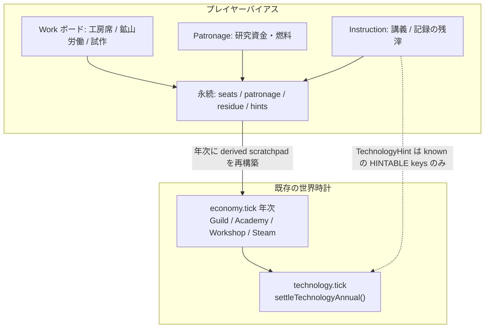
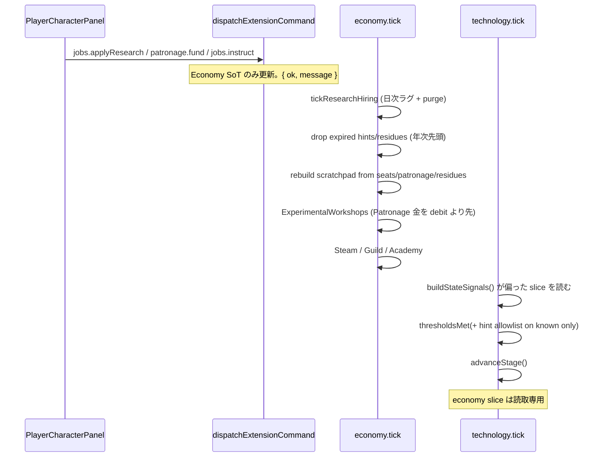
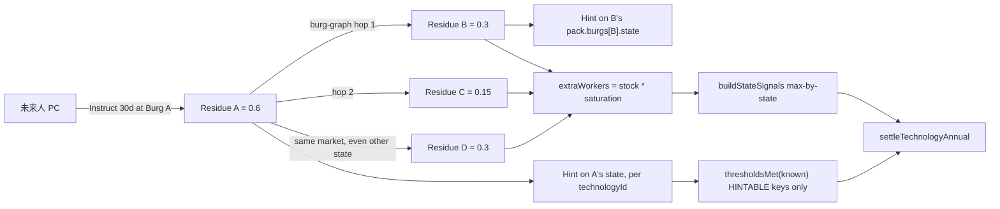

# プレイヤーキャラクターによる技術バイアス

| 項目 | 内容 |
| :--- | :--- |
| **状態** | Draft（2026-08-19 ユーザー決定反映: copyNotes ≥ demonstrated、講義対象は Overview で最大 3 件選択、近傍辺は roads/trails のみ。PR-9: TechnologyOverview 診断を接続） |
| **作成日** | 2026-08-19 |
| **著者** | Design draft (AI agent) |
| **対象リポジトリパス** | `docs/plan/player-character-technology-bias.md` |
| **依存** | Host 技術グラフ（`technologyProgress.ts` / `technologyDefinitions.ts`）、Economy 知識ストック・蒸気物証、Characters / Nobility の PC 選択と Work UI、既存ジョブボード（建設・護衛・間引き） |
| **関連** | [technology-development-roadmap.md](./technology-development-roadmap.md)、[steam-engine-knowledge-accumulation.md](./steam-engine-knowledge-accumulation.md)、[knowledge-guild-system.md](./knowledge-guild-system.md)、[individual-skill-mastery-system.md](./individual-skill-mastery-system.md)、[player-threat-cull-jobs.md](./player-threat-cull-jobs.md)、[urban-housing-system.md](./urban-housing-system.md)、[chemistry-medicine-knowledge-accumulation.md](./chemistry-medicine-knowledge-accumulation.md)、[great-library.md](./great-library.md) |

---

## Overview

世界の技術は、既に年次の所定速度・確率で動いている。`GuildKnowledgeModule.settleAnnual()` と `AcademyKnowledgeModule.settleAnnual()` が Burg 単位の EWMA ストックを進め、`ExperimentalWorkshopsModule.settleAnnual()` が `experimentRecord` を積み、`SteamInstallationsModule.settleAnnual()` が `SteamPumpTrial.documentedRuns` と `SteamInstallation` を更新し、最後に host の `settleTechnologyAnnual()`（`src/generators/technologyProgress.ts`）が `locked → known → demonstrated → adopted → diffused` を評価する。プレイヤーは第二の研究ミニゲームや第二の全球スライダーを持たない。プレイヤーキャラクター（PC）は、**同じシグナル・同じストック・同じ試作証拠に局所バイアスをかける**。

最初のプレイ可能スライスは蒸気経路（Era 4 前提四ノード + `atmosphericSteamPumping` 以降）に絞る。ただしデータモデルとチャネルは任意の `technologyId` / 知識ドメインに再利用できる汎用枠にする。究極形は、全技術を個人知として持つ未来人が Burg を渡り歩き、近傍へ研究情報をばらまいて周囲の開発が一斉に前へ進む、というものである。その場合でも段階を `diffused` まで飛ばさない。

講義の `TechnologyHint` が圧縮できるのは **`known` 帯の allowlist 済み知識 ratio**（`HINTABLE_KNOWN_RATIO_KEYS`）だけである。`atmosphericSteamPumping.known` は `{ mineDrainagePressure, deepMineCount, treasury }` であり知識 ratio を持たないため、hint だけでは ASP を `known` にできない。未来人が先に動かすのは ENP / 精密中ぐりの冶金 / 印刷・行政といった知識ゲートであり、ASP の実証・採用は現行どおり `steamTrialYears` / `steamInstallations` を要する。近傍の「一斉」は Burg グラフ 2 ホップ（または同一 market）への残滓伝播であり、セル経路の長さではない。



---

## Background & Motivation

### 現状（コードで確認した事実）

| 領域 | 実態 | 主なファイル |
| :--- | :--- | :--- |
| 技術グラフ | Host 所有。段階は `locked / known / demonstrated / adopted / diffused`。評価は暦年 1 回 | `src/generators/technologyTypes.ts`, `technologyDefinitions.ts`, `technologyProgress.ts` |
| 年次順序 | `economy.tick`（知識・試作）の後に `technology.tick`。`settleTechnologyAnnual()` は `lastEvaluatedYear === year` で自己ゲート | `src/generators/timeEngine.ts`（`technology.tick` は economy phase、lexical で `shipbuilding.tick` の後） |
| 蒸気第一ノード | `atmosphericSteamPumping`（era 5）。前提は `experimentalNaturalPhilosophy`, `mineSurveyAndDrainage`, `precisionBoringAndMeasurement`, `coalFuelSupply` がいずれも **adopted** | `technologyDefinitions.ts` ERA_4 / ERA_5 |
| ASP `known` | `{ mineDrainagePressure: 0.2, deepMineCount: 1, treasury: 80 }`。知識 ratio キーは無い | 同上 |
| ENP `known` | `{ administration: 0.25, printing: 0.25, treasury: 40, glassware: 0.1 }`。hint が効く最初の蒸気スライスノード | 同上 |
| 証拠ゲート | `deepMineCount`, `steamTrialYears`（`SteamPumpTrial.documentedRuns` の State 最大値）, `steamInstallations`, guild/academy ストック（EWMA、飽和は労働者 6 / 書記 8）, `treasury`, `urbanPopulation`, `experimentRecord` | `buildStateSignals()` / `thresholdsMet()` |
| 待ち年 | `heldLongEnough` は `floor(requiredYears / speed / ease)`。speed **と** ease の両方で割る | `technologyProgress.ts` |
| 速度スライダー | `technologyDevelopmentSpeed` は EWMA **年ステップ**・`minimumYearsAtPreviousStage`・拡散を圧縮する。証拠カウントは割らない | `src/utils/technologyDevelopmentSpeed.ts` の `applyKnowledgeEwma()` |
| 容易さスライダー | `technologyRequirementEase`（Options → Simulation、範囲 1–100、**既定値 1**）が閾値を割る / 免除する。待ち年も割る。**本システムは第二の全球チートにしない** | `src/utils/technologyRequirementEase.ts`, `optionsState.ts` |
| 蒸気物証 | `atmosphericSteamPumping` が `known` になると適格鉱山で試作開始。稼働年に `documentedRuns++`（上限は成功年あたり +1）。`demonstrated` 後に `SteamInstallation` へ転換。転換は追加の Iron/Tools ゲートを見ない | `src/extensions/economy/generators/steamInstallations.ts` |
| 実験工房 | State あたり最大 1。開設条件は `laboratoryGlassware` または ENP が `known`。年予算 `EXPERIMENTAL_BUDGET = 16` を **`debitTreasury(state, 16)` 固定**で引き、Books / Paper / Ink / Glass / Tools を消費。成功判定は **Glass（または Lab Glassware）かつ Tools** のみ。`annualBudget` フィールドは読まれない。`researchers` 初期値 2 | `experimentalWorkshops.ts`, `chemMedCommon.ts` |
| PC 選択 | Zustand `usePlayerCharacterState.playerCharacterId`。HUD は Nobility の `PlayerCharacterPanel` | `src/extensions/characters/store/playerCharacterState.ts`, `src/extensions/nobility/ui/components/PlayerCharacterPanel.tsx` |
| 既存ジョブ | 建設席（`PLAYER_HIRE_LAG_DAYS = 14`）、間引き任務、護衛任務（`ESCORT_PLAYER_HIRE_LAG_DAYS = 5`）。`characterHasEmploymentCommitment()` で xor。mutation は `dispatchExtensionCommand`。戻り値は `{ ok, message }`（`reason` ではない。パネルは `outcome.message` を tip する） | `constructionHire.ts`, `threatCullHire.ts`, `escortHire.ts`, `employmentCommitment.ts` |
| 技能 | `CharacterSkills.engineering` / `learning` / `stewardship` は 1–100。個人熟練ドメイン（`blacksmithing` / `smelting` / `weaving` / `tailoring` / `swordsmanship` / `archery` / `horsemanship`）は Economy 所有（`src/extensions/economy/generators/individualSkillTypes.ts`）。蒸気専用ドメインは未実装 | `characterTypes.ts`, `individualSkillTypes.ts` |
| 所在 | `Character.location` は Burg id。移動は Burg ↔ Burg のみ（`playerCharacterTravel.ts`） | `characterTypes.ts`, nobility travel |
| 経路 | `pack.routes.group` は `roads` / `trails` / `searoutes`。河川航路は `searoutes` + `navigation: "river"`。`TradeRoutePlanner.findRoutePath` はセル経路を返し海路を先に試す。Burg ホップ数は返さない | `routes-generator.ts`, `trade-animation.ts` |
| セーブ | 技術は `simulationContext.technology`。Economy ジョブ・工房・試作は `simulation.extensions.economy`。`validateEconomySlice()` は cull/escort/experimentalWorkshops 等を配列検査する。**`steamPumpTrials` / `steamInstallations` / guild & academy stocks は現時点で未登録**（opaque）。Characters は `characters` 配列 + `abilityPresetId` / `allowedRaceKeys` のみ | `simulationContext.ts`, `src/runtime/extensionStateSlices.ts` |

### 痛み

1. 世界は蒸気まで進む経路を既に持っているが、PC は護衛・建設・狩猟で時間を売るだけで、研究・試作・資金に手を出せない。
2. 為政者・商会主・高 `engineering` の職人というロール差が、技術グラフに届かない。
3. `technologyRequirementEase` を上げると全球の証拠が一様に緩む。特定の人物が特定の鉱山・工房で働いた感覚にならない。
4. 未来人ファンタジー（知識を持って旅し、周囲を一気に引き上げる）を載せる口が無い。直書きで `stage = "diffused"` にすると、鉱山も試作も不要な第二技術系になってしまう。

### プロダクト意図

- **為政者**: 国庫から工房予算・研究者頭数を足す。
- **商会**: 私財と物資で工房維持と試作稼働を支える。
- **技術者**: 本人が工房 / 試作坑に席を得て、記録レートと稼働を上げる。
- **労働者**: 鉱山の coverage を 1 人分足す（建設ジョブと同型）。
- **未来人**: 個人知を講義し、近傍 Burg のストックと **hintable な known 知識ゲート**を押し上げる。ASP の `known` 物証と実証・採用は省略しない。

---

## Goals & Non-Goals

### Goals

1. 世界時計を置換せず、**既存シグナルへの局所バイアス**として PC 行動を載せる。
2. Host の `settleTechnologyAnnual()` を唯一の段階評価者として保つ。PC も hint も `TechnologyProgress.stage` を書かない。
3. 建設 / 間引き / 護衛と同じ **Work UX**（所在、応募ラグ、named commitment、xor、command mutation、`{ ok, message }`）を再利用する。
4. 為政者・商会・技術者・労働者・未来人で、コストと効くチャネルを分ける。
5. 第一スライスは蒸気経路にフォーカスするが、チャネルとレコードは任意ノード / 任意知識ドメインに一般化する。
6. 未来人の講義は `HINTABLE_KNOWN_RATIO_KEYS` の `known` だけ圧縮できる。`demonstrated` / `adopted` の物証と、`mineDrainagePressure` のような物理 ratio は省略しない。
7. `technologyDevelopmentSpeed` と `technologyRequirementEase` との重ね方を明示し、第三の全球倍率を作らない。PC は `heldLongEnough` も `meetsTechnologyRequirement` も触らない。
8. セーブ / ロードは既存の namespaced slice + `validateEconomySlice` / `validateCharactersSlice` に載せる。
9. 研究ジョブ子系统は **新しい** Economy→Nobility import を足さない。Nobility UI は getter 読み + `dispatchExtensionCommand` 書き。Host は hint を `asStockArray` で読むだけ。

### Non-Goals

- 研究ポイントや独立したテックツリー UI を PC 専用に新設すること。
- `technologyRequirementEase` の二枚目として「PC 研究速度」スライダーを Options に足すこと。
- 全住民を研究者としてエージェントシミュレートすること。
- v1 で化学・医学・鉄道ノード専用アクションを全部実装すること（枠だけ蒸気以外でも使えるようにする）。
- Burg スコープの技術グラフへ評価単位を下ろすこと（評価は現行どおり State。局所性は Burg ストックと残滓で表現する）。
- `stage` を `diffused` まで飛ばすチートコマンド。
- 個人熟練に `steamEngineering` ドメインを v1 で新設すること。
- 建設ジョブの賃金モデルを研究席に持ち込むこと。
- v1 の `installationLabor` チャネル、および工房成功ゲートに載らない Endow Instruments。
- `findRoutePath` のセル長を「2 ホップ」とみなすこと。
- 近傍判定のために未使用の `findLandRiverRoutePath` を `TradeRoutePlanner` に足すこと。

---

## Key Decisions

| ID | 決定 | 理由 |
| :--- | :--- | :--- |
| **K1 — バイアス原則** | 世界は現行レートで動き続ける。PC は coverage / 予算 / 稼働率 / 記録残滓を足す。研究ミニゲームを並列しない。 | ユーザー指定の原則。既存の年次自己ゲートと証拠ゲートを壊さない。 |
| **K2 — 所有分割** | **Host** が段階評価と `TechnologyHint` の **読み取り**を持つ（slice を mutate しない）。**Economy** がボード・席・Patronage・残滓・hint の寿命・試作バイアスを持つ。**Characters** が PC 選択・技能・富・所在・個人知スライスを持つ。**Nobility** が PC パネル UI のみを持つ。研究ジョブ子系统は新しい Economy→Nobility import を足さない。既存の財政コードが `nobilityContext.getRulerId` を読むことは本設計の違反にしない。Economy は `copyNotes` 完了と `createPlayerCharacter` で、新設する `charactersContext` の getter/setter 経由に限り `personalTechnologyKnowledge` を書いてよい（建設が `Character.roles` を触るのと同じ）。死亡時の行削除は `advanceAge.ts` のまま。 | 建設 / 間引きと同じ境界。Host は現行 `buildStateSignals()` と同じく `asStockArray` のみ。 |
| **K3 — 第二スライダー禁止** | PC バイアスは閾値を割らない。証拠そのものを増やす。`heldLongEnough` も `meetsTechnologyRequirement` も呼ばない。 | `technologyRequirementEase` が既に全球のバーと待ち年を下げる。二重チートを防ぐ。 |
| **K4 — 雇用 xor** | 研究の named 席と講義 / 写経ミッションは `characterHasEmploymentCommitment()` に加える（建設 xor 間引き xor 護衛 xor 研究）。**Patronage（資金拠出）は雇用ではない**ので xor しない。 | 二重取りと役割衝突を防ぐ。為政者が国庫を出しながら移動する余地は残す。 |
| **K5 — 局所性の単位** | 効果の書き込みは Burg（工房・ギルド・アカデミー・鉱山）。評価は現行どおり State。`buildStateSignals()` は既にドメインごとに **State 内 Burg ストックの max** を取る。 | 技術グラフを Burg スコープへ下ろす巨大変更を避けつつ、「この町で教えた」を表現できる。 |
| **K6 — 近傍 = Burg グラフの BFS** | ノードは生存 Burg。v1 の辺は `pack.routes` のうち `group === "roads" \|\| group === "trails"` だけ。`route.merged` と `navigation === "river"` はスキップする。各ルートの `points[i][2]`（セル id）を順に歩き、そのセル列上に現れる生存 Burg の **連続ペア** に無向辺を張る（`burgSiteDescriptor.collectRouteLegs` と同じ）。ホップ 0 = 発信源、1 = 直接隣、2 = 中間 Burg が 1 つ。近傍 ⇔ `hops <= 2` **または** 同一の正の `burg.market`。同一 market は国境をまたいでよい。残滓と hint の `stateId` は **対象 Burg の** `pack.burgs[id].state`。v1 は同一 State に閉じない。セル数や `findRoutePath` の戻り長は使わない。河川航路（`group: "searoutes"` + `navigation: "river"`）は辺にしない（2026-08-19 決定。旧 Q6）。 | ライブの `pack.routes.group` は `roads` / `trails` / `searoutes` のみ。`group !== "searoutes"` は道路+小道であり河川を含まない。河川 searoute を足すと港町が全部近傍になる。 |
| **K7 — アーキタイプはチャネルで分ける** | ロール判定は既存データのみ。為政者 = landed **state** ruler（K22）。商会 = `roles.organizationId` または `MerchantOrganization` の chair/member。技術者 = `skills.engineering` 閾値。学者 = `skills.learning`。未来人 = 個人知スライス。 | 新しい Character サブクラスを作らない。 |
| **K8 — 蒸気先行・枠は汎用** | v1 の投稿・UI コピーは蒸気経路。型は `technologyId?` + `domain?` + `channel`。 | 化学・医学・鉄道が後から同じ席種を再利用できる。 |
| **K9 — v1 は named PC のみ** | 匿名 NPC の研究応募は作らない。世界は既に `ExperimentalWorkshop.researchers = 2` を自動雇用している。 | 間引きの anon はボード消化用。研究は頭数を二重計上しやすい。 |
| **K10 — 段階直書き禁止** | PC 行動も hint も `TechnologyProgress.stage` を書かない。K11 は `thresholdsMet` の allowlist 分岐であり stage 書き込みではない。 | 評価者を一つに保つ。 |
| **K11 — 講義の known-hint allowlist** | Economy が `TechnologyHint` を書く。Host は `thresholdsMet(def.known, signals, { hintKnowledgeRatios: true })` のときだけ、`HINTABLE_KNOWN_RATIO_KEYS` の min を満たしたとみなす。`demonstrated` / `adopted` では hint を見ない。カウント・金額・allowlist 外 ratio（特に `mineDrainagePressure`）は免除しない。 | 「原理を教える」と排水圧力のような物証を混同しない。 |
| **K12 — 個人知の置き場** | `simulation.extensions.characters.personalTechnologyKnowledge: Record<string, "all" \| string[]>`。`Character` 型に配列を足さない。validate はキー `/^\d+$/`、値は `"all"` または既知 `technologyId` 文字列配列。死亡時に行を落とす。 | ほとんどの人物は空。未来人は稀。 |
| **K13 — コスト三層** | 金（`state.treasury` / `Character.wealth` / Market 物資）、時間（応募ラグ + 在席）、機会費用（xor）。金額は §5 定数表。 | 護衛・建設と同じ「今この仕事をしている」感覚。 |
| **K14 — 失敗と減衰** | 離 burg / 死亡で席 purge（`purgeInvalidConstructionHireState` と同型）。資金停止は Patronage 適用後も `EXPERIMENTAL_BUDGET` に足りなければ `active = false`。残滓は `RESIDUE_DECAY_RATE = 0.15`。hint は `expiresAfterYear` 経過で Economy が削除。Host は economy slice を書かない。 | 「資金を切った / 先生が去った / 秘密が書かれなかった」。 |
| **K15 — スライダーとの重ね** | 待ち年の実式は `floor(requiredYears / speed / ease)`。Speed は EWMA 年ステップも掛ける。Ease は閾値も割る。PC は入力側だけを足し、待ちも閾値も再除算しない。 | 実装者が第三の wait divisor を足さないため。 |
| **K16 — ロールタグ** | 在席中は `Character.roles` に `source: "economy"`, `kind: "workshopResearcher" \| "trialMachinist" \| "mineLaborer" \| "instructor" \| "copyist"`。講義は `instructor`、写経ミッションは `copyist`。 | 建設の `constructionWorker` と同じ観測点。写経と講義を同じ kind にすると UI / purge が区別できない。 |
| **K17 — ラグ** | 工房 / 鉱山 / 試作席は建設に合わせ `RESEARCH_PLAYER_HIRE_LAG_DAYS = 14`。講義は **新規** `INSTRUCT_HIRE_LAG_DAYS = 7`（護衛の 5 日とは別定数）。写経は `COPY_NOTES_LAG_DAYS = 14`。Patronage は即時。 | 護衛 5 日を「近い 7 日」と偽らない。 |
| **K18 — tick 順と単一 SoT** | 永続 SoT は席 / 応募 / ミッション / 残滓 / hint / Patronage デポジット。`TechnologyBiasContribution[]` は **年次スクラッチパッドで非永続**。Economy 年次の先頭で SoT から再構築し、Guild / Academy / Workshop / Steam より前に適用する。 | 席 + contribution + `workshop.researchers` の三重計上を防ぐ。 |
| **K19 — 物証チャネルは加算に上限** | 試作の `documentedRuns` は成功年あたり +1 が上限。PC は utilization を押し上げられるが、1 年に +2 はしない。設置数も 1 鉱山 1 基の既存 `occupied` を破らない。v1 に `installationLabor` は無い。 | 転換処理は追加労働コストを評価しない。時間を完全に消すチートを防ぐ。 |
| **K20 — 講義対象はプレイヤーが選ぶ** | `jobs.instruct` はプレイヤーが `TechnologyOverviewDialog` で選んだ最大 3 `technologyId` を教える。Overview は滞在 State の未 adopted のうち **最浅ノードをデフォルト選択**してよいが、確定はプレイヤー。`"all"` は任意 id、配列個人知はその交差だけ選択可。hint は従来どおり `known` の `HINTABLE_KNOWN_RATIO_KEYS` だけ免除する。ASP を選んでも `deepMineCount` / `mineDrainagePressure` / `treasury` / `steamTrialYears` / `steamInstallations` は省略しない。 | ユーザー決定（2026-08-19）。自動 3 件では何を教えたか分からない。診断 PR-9 は選択 UI の前提にしない（Overview は既に存在する）。 |
| **K21 — Patronage は同年開設できる** | 年次未実行なら、Fund デポジットを同じ `ExperimentalWorkshops.settleAnnual()` が先に消費し、条件（ENP または `laboratoryGlassware` が `known` + 合計金 16）を満たせば同年開設する。金は Patronage を先に充当し、不足分だけ `debitTreasury`。 | 現行セトラーは `annualBudget` を読まず `debitTreasury(16)` 固定なので、デポジットを debit より前に差し込まないと工房が開かない。 |
| **K22 — 支払元** | `titles.landed && entityType === "state"` の統治者だけ `state.treasury`。province lord・商会・その他は `Character.wealth`。 | 領邦の国庫と領主私財を混同しない。 |
| **K23 — 未来人は作成時のみ** | `"all"` は `CreatePlayerCharacterOptions.personalTechnologyKnowledge` または Tools デバッグだけ。世界生成・ランダム住民には混ぜない。 | 生成漏れで ease 無しに広域 hint が出るのを防ぐ。 |

---

## Proposed Design

### 1. 原則: 世界が動き、PC は偏らせる

```text
現行（変更しない）
  workers / budget / fuel → EWMA stock / experimentRecord / documentedRuns
    → TechnologySignals → thresholdsMet(+ ease) + heldLongEnough(+ speed + ease)
    → advanceStage()

追加
  PC 席・Patronage・講義残滓
    → 同じ workers / budget / fuel / record を局所加算
    → 評価式は同じ。PC は heldLongEnough / meetsTechnologyRequirement を呼ばない
```

`advanceStage()` は、シグナルが十分で `minimumYearsAtPreviousStage` が無ければ同年に複数段階を上がれる。蒸気ノードは待ち年を持つ。待ち年の実式:

```text
waitYears = floor(requiredYears / getTechnologyDevelopmentSpeed() / getTechnologyRequirementEase() + 1e-9)
held = (year - startYear) >= waitYears
```

PC はこの式の入力を変えない。PC は待ちの間に証拠を揃える側を加速する。

### 2. アーキテクチャとデータフロー



Nobility の `PlayerCharacterPanel` は Economy getter を読む。mutation は `api.dispatchExtensionCommand({ extensionId: "economy", name: "jobs.applyResearch", … })`。execute は `{ changed, result: { ok, message } }` を返し、パネルは現行どおり `outcome.message` を tip する。

### 3. ロール判定

判定は毎回のコマンド / 年次適用時に生データから行う。永続ロールクラスは作らない。

| アーキタイプ | 判定 | 使える行動 |
| :--- | :--- | :--- |
| 為政者 | `titles` に `landed === true && entityType === "state"`。対象 State は title の `entityId` | `patronage.fundWorkshop`, `patronage.hireResearchers`（支払元 `state.treasury`）、`patronage.fuelTrial` |
| 商会 | `MerchantOrganization.chairpersonCharacterId` / `memberCharacterIds` / `roles.organizationId`。対象は滞在 Burg の `burg.market` が商会の `homeMarketId` かその市場圏 | 同じ Patronage 群。支払元は `Character.wealth` と市場在庫 |
| 技術者 | Join Workshop / Trial は `engineering >= 60` | `jobs.applyResearch` role `workshopResearcher` / `trialMachinist` |
| 学者 | `skills.learning >= 60` は Workshop 席の flavor 条件（engineering ゲートを満たせば記録寄り）。写経は学習値ゲート無し、現地段階のみ | `jobs.copyNotes` |
| 労働者 | 技能閾値なし | `mineLaborer`（+1 worker） |
| 未来人 | `personalTechnologyKnowledge[id] === "all"` または非空配列 | `jobs.instruct`。講義中は xor（K4） |

`stewardship` は Patronage の効率にだけ効く（§5）。段階へ直接倍率を掛けない。

### 4. v1 行動カタログ（規範・単一表）

xor 列が Yes の行動は `characterHasEmploymentCommitment` を拡張した研究コミットと排他。すべて対象 Burg に `location` していること。離 burg / 死亡は purge。コマンド戻りは `{ ok, message }`。

| 行動 | Command | Payload | xor | ラグ | UI | 効果 |
| :--- | :--- | :--- | :---: | ---: | :--- | :--- |
| Join Workshop | `jobs.applyResearch` | `{ characterId, burgId, role: "workshopResearcher" }` | Yes | 14d | Research グループ Apply（role=workshop） | 席。Academy `naturalPhilosophy` に `extraWorkers`（§5 段）。`workshop.researchers` は増やさない |
| Join Trial | `jobs.applyResearch` | `{ characterId, burgId, role: "trialMachinist", mineOperationId }` | Yes | 14d | Research Apply（role=trial） | 席。その坑の utilization 救援に技能係数 |
| Mine Labor | `jobs.applyResearch` | `{ characterId, burgId, role: "mineLaborer" }` | Yes | 14d | Research Apply（role=mine） | 席。guild `metallurgy` +1 worker |
| Cancel research app | `jobs.cancelResearchApplication` | `{ characterId }` | — | — | Research Cancel | ラグ中キャンセル |
| Resign research | `jobs.resignResearch` | `{ characterId }` | — | — | Research Resign | 席解除、role タグ除去 |
| Instruct | `jobs.instruct` | `{ characterId, burgId, technologyIds }`（1–3 件、Overview で選択） | Yes | 7d 後開始、滞在 30d で 1 パルス | Research Apply（role=teach）→ Overview ピッカー | 残滓 + hint（§7）。空配列・4 件以上・個人知に無い id は拒否 |
| Cancel instruct | `jobs.cancelInstruct` | `{ characterId }` | — | — | Research Cancel | ミッション中止。既パルスは残る |
| Copy notes | `jobs.copyNotes` | `{ characterId, burgId, technologyId }` | Yes | 14d | Research Apply（role=copy） | 現地段階 ≥ demonstrated。Accept 時 Books 0.1 + Paper 0.2 を市場から消費。完了時に `charactersContext` setter で個人知配列へ 1 id。role `copyist` |
| Fund Workshop | `patronage.fundWorkshop` | `{ characterId, burgId, amount? }` | No | 即時 | Patronage Fund | デフォルト `amount = 16`。当年（または翌年）デポジット |
| Hire Researchers | `patronage.hireResearchers` | `{ characterId, burgId, count? }` | No | 即時 | Patronage Hire | デフォルト `count = 1`。1 人 8 金。`workshop.researchers` のみ +N（上限 base 2 + 4） |
| Fuel Trial | `patronage.fuelTrial` | `{ characterId, mineOperationId }` | No | 即時 | Patronage Fuel | 金は今引く。物資量はデポジットに保存（市場へは置かない）。消費年の `operateSite` 直前に鉱山市場へ注入。その後救援 ≤0.35 |

v1 に **無い** 行動: Endow Instruments（工房成功ゲートは Glass∧Tools のみで Books/Paper/Ink は flavor。Q5 は v2）、Installation labor（転換セトラーに労働ゲートが無い。K19）。

工房が無い State で Join Workshop した場合: `{ ok: false, message: "No experimental workshop in this burg." }`。開設は K21 の Patronage または世界セトラーに任せる。

### 5. 定数・換算・derived scratchpad

#### 5.1 ライブセトラー由来の定数

| 定数 | 値 | 由来 |
| :--- | ---: | :--- |
| `EXPERIMENTAL_BUDGET` | 16 | `chemMedCommon.ts` |
| `WORKSHOP_BASE_RESEARCHERS` | 2 | `experimentalWorkshops.ts` `RESEARCHERS` |
| `STEAM_ANNUAL_COAL` | 2 | `steamInstallations.ts` |
| `STEAM_ANNUAL_TOOLS` | 0.35 | 同上 |
| `STEAM_BUILD_IRON` | 0.8 | 同上（`status === "building"` の年のみ） |
| `GUILD_SATURATION_WORKERS` | 6 | `guildKnowledge.ts` |
| `ACADEMY_SATURATION_WORKERS` | 8 | `academyKnowledge.ts` |
| `GUILD_DECAY_RATE` / `ACADEMY_DECAY_RATE` | 0.15 | 同上 |

#### 5.2 本設計が新設する定数

| 定数 | 値 | 意味 |
| :--- | ---: | :--- |
| `WORKSHOP_HIRED_RESEARCHER_CAP` | 4 | `researchers` 上限 = 2 + 4 = 6 |
| `WORKSHOP_RESEARCHER_HIRE_COST` | 8 | `16 / 2`。追加 1 人あたり |
| `FUND_WORKSHOP_DEFAULT` | 16 | 1 年分の工房予算 |
| `FUND_WORKSHOP_EFFECTIVE_CAP` | 48 | 3 × 16。過剰入金の効果上限 |
| `FUEL_TRIAL_UTILIZATION_RESCUE_CAP` | 0.35 | `operateSite` 後に足せる最大 |
| `RESIDUE_DECAY_RATE` | 0.15 | Guild/Academy と同じ |
| `RESIDUE_PULSE_SOURCE` | 0.6 | 講義発信 Burg |
| `RESIDUE_PULSE_HOP1` | 0.3 | Burg グラフ 1 ホップ |
| `RESIDUE_PULSE_HOP2` | 0.15 | 2 ホップ |
| `INSTRUCT_HIRE_LAG_DAYS` | 7 | 新規。護衛の 5 ではない |
| `INSTRUCT_MISSION_DAYS` | 30 | ラグ後の滞在で 1 パルス |
| `COPY_NOTES_LAG_DAYS` | 14 | 建設に合わせる |
| `COPY_NOTES_BOOKS` | 0.1 | 工房年次 Books 消費と同じ |
| `COPY_NOTES_PAPER` | 0.2 | 工房年次 Paper 消費と同じ |
| `HINT_DURATION_YEARS` | 3 | Host 評価に見える年数 |
| `RESEARCH_PLAYER_HIRE_LAG_DAYS` | 14 | 建設と同じ |
| `SEAT_WORKER_CAP` | 3 | 席由来 extraWorkers 上限 |
| `STEWARDSHIP_EFFICIENCY_RANGE` | 0.25 | ±25% |
| `EXPERIMENT_RECORD_RATE_K` | 0.5 | rate 側バイアス |
| `ENGINEERING_WORKSHOP_MIN` | 60 | Join Workshop/Trial 下限 |
| `ENGINEERING_MASTER` | 80 | extraWorkers 2 |
| `ENGINEERING_GRANDMASTER` | 95 | extraWorkers 3 |

#### 5.3 換算式

**席 extraWorkers（Join Workshop / Trial）**

```text
if engineering < 60: 応募不可
if 60 <= engineering < 80: extraWorkers = 1
if 80 <= engineering < 95: extraWorkers = 2
if engineering >= 95: extraWorkers = 3
```

Mine Labor は常に `extraWorkers = 1`（engineering ゲートなし）。

**残滓 → 実践者**

```text
saturation = domain が scholarly なら ACADEMY_SATURATION_WORKERS (8)
             それ以外は GUILD_SATURATION_WORKERS (6)
extraWorkers = residue.stock * saturation
```

発信パルス 0.6 は Academy で +4.8 人 ⇔ coverage +0.6。Guild なら +3.6 人 ⇔ coverage +0.6。残滓由来の extraWorkers は `saturation` でキャップ（coverage ≤ 1 を残滓だけで超えない）。

年次減衰: `residue.stock = applyKnowledgeEwma(stock, 0, RESIDUE_DECAY_RATE)`。`MIN_TRACKED_STOCK = 0.001` を下回ったら行削除（Guild 孤児と同じ）。

**experimentRecord は rate 側のみ**

現行成功年: `applyKnowledgeEwma(record, 1, rate)`。失敗年: `applyKnowledgeEwma(record, 0, 0.15)`。

```text
quality = clamp((engineering - 50) / 50, 0, 1)   // 席が無ければ 0。50→0, 100→1
rate'   = clamp(baseRate * (1 + EXPERIMENT_RECORD_RATE_K * quality), 0, 1)
target  = 成功なら 1、失敗なら 0   // 変更しない
```

`technologyDevelopmentSpeed` は `applyKnowledgeEwma` の **years ステップ**として既に掛かる。席は years を再乗算しない。テスト: `getTechnologyDevelopmentSpeed() === 25` + 席でも years は 25 のまま（rate だけ上がる）。

target 加算は **採用しない**。成功年の target は既に 1 なので加算は no-op になり、失敗年に target を上げると「物資が無くても記録が育つ」。

**stewardship → Patronage 効率**

```text
efficiency = 1 + STEWARDSHIP_EFFICIENCY_RANGE * clamp((stewardship - 50) / 50, -1, 1)
# 50 → 1.00, 100 → 1.25, 1 → 0.75
appliedGold = min(paidGold * efficiency, FUND_WORKSHOP_EFFECTIVE_CAP)
```

支払額 `paidGold` は treasury/wealth から満額引く。工房 debit に充当するのは `appliedGold`。Hire は `floor(paidGold * efficiency / 8)` 人、かつキャップ。

**Fuel Trial**

クリックは市場を補充しない。金だけ今引き、物資は `PatronageDeposit` に数量として残す。

1. コマンド時: 対象坑の当年需要（Coal 2、Tools 0.35、building 中なら Iron 0.8）をデポジットの `coal` / `tools` / `iron` に記録する。支払元（K22）から、その物資の市場価格相当の **gold だけ**を即時に引く。市場在庫は触らない。既に年次が走っていれば `year = currentYear + 1`、でなければ `currentYear`。
2. `SteamInstallations.settleAnnual()` 内、`year === currentYear` の fuel デポジットについて、対象鉱山の `marketId` へ `coal` / `tools` / `iron` を **`operateSite` の直前**に加算する。その tick で消費済みとしてデポジットを落とす。
3. 既存 `operateSite()` が市場から消費する（今注入した分が utilization に乗る）。
4. なお `utilization < 0.5` なら `min(FUEL_TRIAL_UTILIZATION_RESCUE_CAP, 0.5 - utilization)` を加算。成功ラインには届きうるが、1.0 から更に足して `documentedRuns += 2` にはしない。
5. `documentedRuns` インクリメント条件は現行 `utilization >= 0.5` のまま、年 +1 上限。

Join Trial 席がある坑では、step 4 の救援キャップを `rescueCap * (1 + 0.5 * quality)` には **しない**。救援は Patronage 専用。席は `operateSite` 後の加算 `min(0.15 * extraWorkers, 0.35)` として載せ、Fuel 救援との **合計** も 0.35 を超えない。K19。

#### 5.4 SoT と scratchpad（K18）

永続（セーブ）:

- `researchHireApplications`
- `researchNamedSeats`
- `researchInstructMissions`
- `instructionResidues`
- `technologyHints`
- `patronageDeposits`

非永続: `TechnologyBiasContribution[]`。`economy:annualUrbanKnowledge` の先頭で SoT から組み立て、その tick のセトラーにだけ渡す。allocator は不要。

二重計上の禁止:

| ソース | Academy/Guild への入り方 | 禁止 |
| :--- | :--- | :--- |
| Join Workshop 席 | scratchpad `academyCoverage` extraWorkers | `workshop.researchers++` しない |
| Hire Researchers | `workshop.researchers += N` のみ。Academy 既存の `add(..., workshop.researchers)` が拾う | scratchpad に同じ人を `academyCoverage` として足さない |
| Instruct 残滓 | `extraWorkers = stock * saturation` | 席や researchers に足さない |
| Fund Workshop | 金の debit 充当のみ | coverage 行を作らない |

### 6. 既存セトラーへの差し込み

**GuildKnowledgeModule.collectPractitioners()**  
`mineLaborer` 席と残滓（metallurgy 等）の extraWorkers を `add`。

**AcademyKnowledgeModule.collectPractitioners()**  
`workshopResearcher` 席と残滓（naturalPhilosophy）の extraWorkers を `add`。既存の `workshop.researchers` 経路は Hire 分だけが増えた値を読む。

**ExperimentalWorkshopsModule.settleAnnual()** — 規範の debit 順:

```text
need = EXPERIMENTAL_BUDGET  # 16
applied = patronage appliedGold for this burg/year (0 if none)
if applied > 0: need = max(0, need - applied)

if need > 0:
  if not debitTreasury(stateId, need): workshop.active = false; continue
else:
  # fully covered by patronage (ruler gold already taken, or merchant wealth)
  # do not call debitTreasury

# 開設: workshop が無く、ENP or laboratoryGlassware が known
#   かつ (applied + 成功した debit) >= 16 なら pickSponsorBurg して作成（K21）

consumeNamed Glass/LabGlassware and Tools as today
Books/Paper/Ink は現行どおり消費するが成功ゲートではない
success = glass > 0 and tools > 0
rate' = clamp(baseRate * (1 + 0.5 * quality), 0, 1)
applyKnowledgeEwma(record, success ? 1 : 0, success ? rate' : 0.15)
```

商会の wealth は Patronage デポジット作成時に既に引き落とされている。settle 時に `debitTreasury` へ置換しない（K22）。為政者の国庫はデポジット作成時に引き、settle では `applied` として need を減らす（二重引きしない）。

**SteamInstallationsModule.settleAnnual() / operateSite()**  
`year === currentYear` の fuel デポジット物資を、対象鉱山市場へ `operateSite` **直前**に加算する。その後現行 consume。救援加算は §5.3。`documentedRuns` 年 +1 のまま。クリック時に市場を触らない。

**settleTechnologyAnnual() / thresholdsMet()**

```ts
export const HINTABLE_KNOWN_RATIO_KEYS = [
  "experimentRecord",
  "administration",
  "printing",
  "naturalPhilosophy",
  "metallurgy",
  "woodworking",
  "masonry",
  "glassware",
  "instruments",
  "medicine"
] as const satisfies readonly (keyof TechnologySignals)[];

function thresholdsMet(
  thresholds: TechnologyThresholds,
  signals: TechnologySignals,
  opts?: { hintKnowledgeRatios?: boolean }
): boolean
```

`opts.hintKnowledgeRatios === true` かつキーが allowlist にあるときだけ、その min を満たしたとみなす。`advanceStage` は `def.known` 評価時に限り、その `(stateId, technologyId)` に生きた hint があれば opts を付ける。`def.demonstrated` / `def.adopted` には付けない。

allowlist に **入れない**（hint しても免除されない）例: `mineDrainagePressure`, `urbanSanitationPressure`, `epidemicPressure`, `labVesselQuality`, `pozzolanPractice`, すべての count / amount。

Host は Economy モジュールを import しない。hint は `asStockArray(economy.technologyHints)`。

### 7. 未来人 / 講義と「周囲が一斉に進む」



#### 7.1 Burg グラフ（K6）の実装契約

`TradeRoutePlanner.findRoutePath` をホップ数に使わない（海路優先・セル長）。`findLandRiverRoutePath` は追加しない。PR-8 の正は次だけ:

1. `pack.routes` を走査し、`group === "roads" || group === "trails"` だけ残す。`route.merged` と `navigation === "river"` はスキップ。
2. 各ルートの `points[i][2]`（セル id）を順に見る。セル上の生存 Burg を列にし、**連続する Burg 同士**に無向辺を張る（`burgSiteDescriptor.collectRouteLegs` と同じ）。同一セルに複数 Burg がいればそれらも隣接。
3. 道路/小道に載らない Burg はホップ近傍に入れない。同一 `burg.market > 0` なら market 述語で近傍になる。
4. BFS で hops。近傍 = `hops <= 2` OR 同一正 market。
5. 国境をまたいでよい。各対象 Burg の残滓 / hint の `stateId = pack.burgs[burgId].state`（0 / removed はスキップ）。
6. 河川航路（`searoutes` + `navigation: "river"`）と海路は辺にしない。

#### 7.2 technologyId → 残滓ドメイン

ミッションは最大 3 件の `technologyIds` を持つ。残滓は **ドメイン単位**（tech ごとではない）。hint は **tech ごと**。

| `technologyId`（代表） | 残滓 `domain` | 層 |
| :--- | :--- | :--- |
| `experimentalNaturalPhilosophy`, `mathAstronomyGeography` | `naturalPhilosophy` | academy |
| `recordReplication` | `printing` | guild |
| `distillation`, `laboratoryGlassware` | `glassware` | guild |
| `mineSurveyAndDrainage`, `precisionBoringAndMeasurement`, `atmosphericSteamPumping`, `condensateEfficiency`, `highTempFurnace`, `improvedMining` | `metallurgy` | guild |
| `mechanicalWorkshops`, `rotarySteamPower` | `woodworking` | guild |
| `coalFuelSupply` | `administration` | academy |
| マップ外 / 未登録 | 残滓なし。hint だけ書く | — |

同一パルスで複数 tech が同じドメインに落ちる場合、残滓行は 1 本。`stock = max(existing, pulse)`（加算して 1 を超えない）。hint は tech ごとに 1 行。

#### 7.3 手順

1. Accept Instruct。payload の `technologyIds`（1–3）を使う。`"all"` でなければ個人知配列との交差のみ。Overview は滞在 State の未 adopted 最浅ノードをデフォルトチェックしてよいが、プレイヤーが外したり ASP だけにしたりできる（K20）。自動で差し替えない。
2. 7 日ラグ後、30 日滞在が続けばパルス。hint は §7.4 の年窓。
3. 年次で残滓が extraWorkers になる。同一 market / 2 ホップの複数 Burg のストックが同時に上がる。
4. 隣接 State の Burg が近傍なら、その State にも残滓と hint が付く。
5. 深部鉱山が無い State は ASP `known` の `deepMineCount` で止まる。hint は ASP `known` を満たさない（K11）。

#### 7.4 hint の寿命（Host は slice を書かない）

`remainingYears` をデクリメントしない。窓で表す:

```ts
interface TechnologyHint {
  stateId: number;
  technologyId: string;
  burgId: number;
  sourceCharacterId: number;
  firstEligibleYear: number;
  expiresAfterYear: number; // inclusive
}
```

パルス時:

```text
HINT_DURATION_YEARS = 3
alreadySettled = getGuildKnowledgeLastSettledYear() === currentYear
  || getExperimentalWorkshopsLastSettledYear() === currentYear
firstEligibleYear = alreadySettled ? currentYear + 1 : currentYear
expiresAfterYear = firstEligibleYear + HINT_DURATION_YEARS - 1
```

- 年 Y の年次知識ブロック **前**にパルス: Host は Y, Y+1, Y+2 で見る。
- 年次 **後**（年初以降の残り日）にパルス: 初回は Y+1。Y+1, Y+2, Y+3。

Economy 年次先頭: `currentYear > expiresAfterYear` の hint を削除。Host は `firstEligibleYear <= year <= expiresAfterYear` の行だけを生きているとみなす。Host は economy を mutate しない。

#### 7.5 蒸気経路で hint / 席が実際に動かすもの

| ノード | `known` min | hint で免除されるキー | なお必要なキー |
| :--- | :--- | :--- | :--- |
| ENP | admin 0.25, printing 0.25, treasury 40, glassware 0.1 | admin, printing, glassware | **treasury 40** |
| mine survey | mineCount 1, metallurgy 0.25 | metallurgy | **mineCount 1** |
| precision boring | metallurgy 0.4, smelterWorkers 6 | metallurgy | **smelterWorkers 6**（count） |
| coal fuel | mineCount 1, treasury 30 | なし（hint は no-op） | 両方。demonstrated の administration は残滓で加速 |
| **ASP** | drainage 0.2, deepMineCount 1, treasury 80 | **なし** | 三つとも。hint を ASP に付けても `known` にならない |
| ASP demonstrated | drainage, deepMine, metallurgy, treasury, steamTrialYears 2 | なし（hint は demonstrated を見ない） | 試作成功年 |
| ASP adopted | + steamInstallations 1 等 | なし | 既存転換 |

「周囲が一斉に進む」= 近傍 Burg の ENP/冶金ストックが同時に上がり、知識ゲート付きノードの `known` が揃うこと。ASP 本体は鉱山国家へ旅して Join Trial / Fuel する。

写経: 現地 State の対象ノードが `demonstrated` 以上。`jobs.copyNotes` は 14 日 xor。未来人でなくても隣国で Instruct できる（配列個人知）。`"all"` は K23。

### 8. スライダーとの相互作用

| ノブ | 何を変えるか | PC バイアスとの関係 |
| :--- | :--- | :--- |
| `technologyDevelopmentSpeed` | `applyKnowledgeEwma` の years、`heldLongEnough` の待ち、拡散 | PC が足した coverage も同じ years で乗る。PC は years を再乗算しない |
| `technologyRequirementEase`（既定 1） | `meetsTechnologyRequirement` **と** `heldLongEnough` | PC は両方触らない。ease=100 なら hint も証拠も無意味 |
| PC 行動 | 入力（人・金・燃料・残滓） | 局所。去れば減衰 |

実装禁止: `magnitude / ease`、`documentedRuns += speed`、席があるだけで `thresholdsMet` を true、`heldLongEnough` の第三除数、allowlist 外 ratio の hint 免除。

### 9. UI

`PlayerCharacterPanel` の Work は既存の Construction / Hunt / Escort に **Research グループ**と **Patronage グループ**を足す。英語コピー。7 個の並列ボタンにしない。

**Research グループ**（xor、建設と同じ Apply / Cancel / Resign 振付）

- 状態行: `Workshop researcher` / `Trial machinist at <mine>` / `Mine labor` / `Teaching (18d left)` / `Copying notes (9d)` / `No workshop here`。
- `<select>`: `workshop` / `trial` / `mine` / `teach` / `copy`。ロールと所在で option disable + `data-tip`。
- ボタン 3 つ: Apply / Cancel / Resign。
- `teach` の Apply は既存の `TechnologyOverviewDialog` で最大 3 `technologyId` を選ばせる（PR-7。PR-9 診断は不要）。最浅未 adopted を初期チェックしてよい。英語コピー例: "Select up to 3 technologies to teach here."

**Patronage グループ**（xor しない）

- Fund Workshop / Hire Researchers / Fuel Trial。為政者・商会以外は disable。
- tip 例: "Pay into this burg's experimental workshop (Economy). Does not block escort or construction."

`TechnologyOverviewDialog` 診断は PR-9（蒸気スライス完了条件）。選択 State の生きた hint と、不足シグナル（`explainTechnologyGate`）。

移動中の講義は不可。護衛中に Teach も不可。Patronage は現地に工房 / 試作があれば実行可。

### 10. NPC

v1 は named PC のみ。世界側の匿名研究者 2 人は現状維持。後続で高 `engineering` NPC が空き席に応募する場合は、間引きの `ANON_ECOLOGY_SCALE = 0.5` にならい magnitude 半減・報酬なし（本設計では実装しない）。

### 11. 死亡・離 burg

`tickResearchHiring` の先頭で `purgeInvalidResearchHireState()`（建設と同型: dead、`location !== seat.burgId`、工房/鉱山消失で席とアプリとミッションを落とす、role タグ除去。写経中は `kind: "copyist"`）。

`personalTechnologyKnowledge` の **書き込み**は Economy の `jobs.copyNotes` 完了と `createPlayerCharacter` が、`charactersContext` に新設する getter/setter 経由で行う（建設が `Character.roles` を触るのと同じ。Characters 専用 command は足さない）。**死亡時の行削除**は `advanceAge.ts`（既存の `character.dead` セット箇所）のまま。残滓と hint は年限まで残る（記録は残る、先生は去った）。

---

## How player actions map onto existing signals

| PC 行動 | 既存の入力 | 触るオブジェクト | `TechnologySignals` への現れ方 | 蒸気ノードで効く段階 |
| :--- | :--- | :--- | :--- | :--- |
| Fund Workshop | `debitTreasury(state, 16)` 固定 | Patronage を debit より先に充当し `active` を維持 | 工房が生きれば `experimentRecord` と Academy `naturalPhilosophy` が年次で育つ | **ENP** known の知識側（treasury は別途必要）。ASP known の知識側は無い |
| Hire Researchers | `researchers = 2` | `researchers` のみ加算（≤6） | Academy `naturalPhilosophy` coverage | ENP demonstrated/adopted の admin/printing/experimentRecord 間接 |
| Join Workshop | EWMA `rate` | 席 extraWorkers + rate' | `naturalPhilosophy`, `experimentRecord`（rate） | ENP。ASP known は直接動かない |
| Mine Labor | smelter/craft workers | guild practitioners +1 | `metallurgy`（max-by-state） | mine survey / precision boring の metallurgy。ASP demonstrated の metallurgy |
| Fuel Trial | `operateSite()` 消費 | デポジット物資を `operateSite` 直前に鉱山市場へ注入 + 救援 ≤0.35。クリック時は市場を触らない | `steamTrialYears`（成功年に +1 が届きやすくなる） | ASP **demonstrated** |
| Join Trial | 同上 | utilization 加算 ≤0.35 合計 | 同上。年 +1 上限 | ASP demonstrated |
| Instruct + hint | なし | Residue + TechnologyHint | HINTABLE known ratio のみ。物理 count/amount/drainage は残る | **ENP known**（treasury 除く）、mine survey の metallurgy、precision の metallurgy。**ASP known は hint no-op**。coal known も no-op（残滓の administration は coal **demonstrated**） |
| Copy notes | 他 State の段階 | `charactersContext` setter で個人知配列 | 直後のシグナル変化なし | 後の Instruct の燃料 |

物理カウントを PC が直接インクリメントする列は無い。

---

## Data Model

### Economy slice（`simulation.extensions.economy`）

`validateEconomySlice()` に以下を `assertOptionalArrayField` する。`steamPumpTrials` 等の既存 opaque は本 PR で必須化しない（別作業）。新規研究配列は cull 並みに厳格。

| フィールド | 永続 | 役割 |
| :--- | :---: | :--- |
| `researchHireApplications` | Yes | ラグ中 |
| `researchNamedSeats` | Yes | SoT 雇用 |
| `researchInstructMissions` | Yes | teach / copy |
| `instructionResidues` | Yes | Burg+domain stock |
| `technologyHints` | Yes | Host 読取専用 |
| `patronageDeposits` | Yes | 当年/翌年の金・燃料 |
| derived contributions | **No** | 年次スクラッチ |

```ts
export interface ResearchNamedSeat {
  burgId: number;
  characterId: number;
  role: "workshopResearcher" | "trialMachinist" | "mineLaborer";
  mineOperationId?: number;
}

export interface ResearchHireApplication {
  i: number;
  burgId: number;
  role: ResearchNamedSeat["role"];
  characterId: number;
  daysRemaining: number;
  mineOperationId?: number;
}

export interface TechnologyInstructMission {
  characterId: number;
  burgId: number;
  stateId: number;
  kind: "teach" | "copy";
  daysRemaining: number;
  technologyIds: string[];
}

export interface InstructionResidue {
  burgId: number;
  domain: string;
  stock: number; // 0..1
  sourceCharacterId: number;
  lastPulseYear: number;
}

export interface TechnologyHint {
  stateId: number;
  technologyId: string;
  burgId: number;
  sourceCharacterId: number;
  firstEligibleYear: number;
  expiresAfterYear: number;
}

export interface PatronageDeposit {
  i: number;
  characterId: number;
  burgId: number;
  stateId: number;
  year: number; // first workshop/steam year that may consume it
  kind: "workshop" | "researchers" | "fuelTrial";
  gold: number;
  researcherCount?: number;
  mineOperationId?: number;
  coal?: number;
  tools?: number;
  iron?: number;
}
```

`PatronageDeposit.year`: 対象セトラー（工房または `SteamInstallations`）が既に走っていれば `currentYear + 1`、でなければ `currentYear`（hint と同じ alreadySettled 判定）。`kind: "fuelTrial"` の `coal` / `tools` / `iron` は **市場在庫ではなくデポジット上の数量**である。消費年の `SteamInstallations.settleAnnual` が `operateSite` の直前に鉱山市場へ加算し、その tick でデポジットを落とす。コマンドは gold だけ引き、棚を補充しない。

v1 は sticky 開口の `researchJobPostings` を持たない。対象（active workshop / running trial / active mine）が Burg にあれば Apply を出す。

### Characters slice

```ts
personalTechnologyKnowledge?: Record<string, "all" | string[]>;
```

`validateCharactersSlice`: キー `/^\d+$/`。値は `"all"` または文字列配列（要素は `getTechnologyDefinition(id)` が存在する id。未知 id はアーカイブ時に落とすか reject。推奨: reject）。

`CreatePlayerCharacterOptions` に `personalTechnologyKnowledge?: "all" | string[]` を足す（K23）。世界生成経路は渡さない。

### Host

`TechnologySimulationState` に PC フィールドを足さない。`TechnologySignals` に新キーを足さない。hint は `thresholdsMet` の opts。

### セーブ / ロード

- 旧セーブは欠落 = 空。
- hint の年は finite integer。`expiresAfterYear >= firstEligibleYear`。
- `worldArchive` の opaque に逃がさない。

---

## API / Interface Changes

コマンドは §4 表が正。`api.registerExtensionCommand` を使う。ExtensionAPI に新規メソッドは不要。

Host: `HINTABLE_KNOWN_RATIO_KEYS` を export。`thresholdsMet` に opts。`explainTechnologyGate(stateId, technologyId): string[]` を PR-6 でテストヘルパとして追加し、PR-9 で Overview が読む。

---

## Alternatives Considered

### A. PC 専用研究ミニゲーム（独立進捗バー）

各ノードに `playerResearchPoints` を持ち、ポイントで段階を買う。

- 利点: UI が分かりやすい。
- 欠点: 世界の EWMA / 試作 / 鉱山と二重管理。`settleTechnologyAnnual` が形骸化。ease と効能が重なる。
- **不採用**。

### B. 第三の全球スライダー「PC 研究速度」

Options に `playerTechnologyBias` を足し、PC 選択中だけ閾値や EWMA を割る。

- 利点: 実装が小さい。
- 欠点: 行動が無い。局所性も未来人の旅も無い。ease の二枚目。
- **不採用**。

### C. `TechnologyProgress.stage` を PC が直接書く

Teach で対象 State を即 `known` / `adopted`。

- 利点: 未来人ファンタジーが即座に出る。
- 欠点: 物証ゲートが死ぬ。
- **不採用**。hint は known の HINTABLE keys のみ。

### D. 技術評価を Burg スコープへ下ろす

- 利点: 「この町だけ蒸気を知っている」が第一級。
- 欠点: 現行定義・効果関数・UI をすべて割る。
- **見送り**。

### E. 採用案（本設計）: 入力側バイアス + 限定 known-hint

既存セトラーに加算口を足し、hint は known の allowlist。診断 UI（PR-9）を蒸気スライス完了条件にする。

- 利点: 評価者単一、ease と役割分担、既存 Work UX。
- 欠点: 「なぜ adopted にならないか」が分かりにくい → PR-9 必須。
- **採用**。

---

## Risks

| 重大度 | リスク | 緩和 |
| :--- | :--- | :--- |
| 高 | 席効果で `thresholdsMet` を短絡し、ease と二重免除する | K3 / K11。hint は `known` + allowlist 以外で true にしないユニット。`mineDrainagePressure` 非免除テスト |
| 高 | 年 +N `documentedRuns` で試作年を消す | K19。utilization 1.0 でも 1 年は +1 |
| 中 | Academy の席 + `workshop.researchers` + 残滓の三重計上 | K18。§5.4 表。テスト必須 |
| 中 | 為政者 Patronage が国庫を溶かす | 年次効果キャップ 48 金、研究者 +4。即時引き落とし |
| 中 | プレイヤーが ASP だけを選んで「なぜ known にならないか」が見えない | Overview は最浅をデフォルト提案。hint は ASP known を満たさない（K11/K20）。PR-9 診断は完了条件であり選択 UI の前提ではない |
| 中 | xor 漏れ | `employmentCommitment.ts` 単一ゲート |
| 中 | `findRoutePath` や河川 searoute をホップに誤用し沿岸が全部近傍になる | K6。`roads`/`trails` の `points[i][2]` 歩行。`findLandRiverRoutePath` は足さない |
| 低 | 個人知を Character に足してセーブ肥大 | K12 |
| 低 | ルート歩行のコスト | 年次 1 回、または講義パルス時だけ BFS。全ペア Dijkstra はしない |
| 低 | Economy 無効 | 現行ジョブと同じ tip |

---

## Security & Privacy Considerations

単機ローカルシミュレータ。`dispatchExtensionCommand` の execute 内で所在・xor・支払を検証する。パネルから slice を直接 mutate しない。Host は economy を書かないので hint 改ざんはセーブ編集に限る。

---

## Observability

- `economy:annualUrbanKnowledge` 内に `applyTechnologyBias` の所要。目標 +2ms 未満。
- `explainTechnologyGate` は PR-6 でユニットヘルパ、PR-9 で Overview に接続。
- 回帰は CI vitest。空 scratchpad の比較は `rn(..., 4)`（ビット一致は EWMA でフレークする）。

---

## Test Strategy

### ユニット（必須）

| 対象 | 断言 |
| :--- | :--- |
| Guild/Academy + 席 | extraWorkers で coverage 上昇。`rn(stock, 4)` が対照より大きい |
| 空 scratchpad | 既存フィクスチャと `rn(..., 4)` 一致（ビット一致禁止） |
| Workshop debit | Patronage 16 で `debitTreasury` 0 回・`active` 維持。0 金・国庫不足で `active false` |
| Hire | `researchers` だけ増え、席 extra と二重に Academy 加算されない |
| Steam | utilization 1.0 でも `documentedRuns += 1`。石炭不足年は救援 ≤0.35 で成功しうるが +2 にならない |
| `thresholdsMet` + hint | ENP known の admin/printing/glassware は通る。**treasury 不足は通らない**。ASP hint は `deepMineCount` 0 で known にならない。`mineDrainagePressure` は免除されない。demonstrated は hint 無視 |
| K20 | Overview のデフォルト提案は未 adopted の最浅（ENP が先、ASP は後）。プレイヤーが ASP だけ送っても `deepMineCount` 0 なら known にならない。4 件目は拒否 |
| xor | 建設席ありで applyResearch 失敗 |
| Patronage 非 xor | Fund 中に護衛応募が成功する（逆も） |
| 所在 | 別 Burg 応募失敗。離 burg / 死亡 purge（建設と同型） |
| hint 窓 | 年次前パルスは 3 回の Host 評価で見える。年次後パルスは翌年から 3 回。Host 後に economy の `expiresAfterYear` が変わっていない |
| 残滓換算 | パルス 0.6 → Academy extraWorkers 4.8、coverage +0.6 |
| 近傍 | hop 1/2 にパルス。hop 3 は 0。`searoutes` と `navigation === "river"` と `merged` は辺なし。同一 market の他 State Burg は残滓あり、hint.stateId はその Burg の state |
| スライダー | ease を magnitude に掛けない。speed=25 + 席で EWMA years が 25 のまま |
| セーブ | 新規 Economy 配列と `personalTechnologyKnowledge` の round-trip。validate が不正キーを reject |
| copyNotes | Books/Paper 不足で失敗。demonstrated 未満で失敗。14d xor |

### E2E

既存 `tests/e2e/helpers` に PC ジョブヘルパは無い（`advanceTime` のみ）。第一スライスは **`applyCharacterToResearchJob` + `advanceTime` の統合テスト**を正とする。E2E は「Research Apply ボタンが存在し、command が commit する」に留める。通年ストック対対照の E2E は任意。

---

## Rollout Plan

機能フラグは新設しない。Economy + Characters + Nobility が有効なときだけコマンドとボタンが出る。

蒸気スライス「完了」= PR-1 … PR-9。PR-9（診断）は任意の磨きではなく完了条件（Alternative E の UX 穴）。PR-3 単体は「現場があれば働ける」であり閉じたプレイループではない（工房開設は世界セトラーまたは PR-4）。

ロールバック: コマンドとボタンを戻せば空配列は無視され世界は現行速度に戻る。hint は `expiresAfterYear` で消滅。

---

## Open Questions

1. **写経の段階** — **解決（2026-08-19）**: 現地 `demonstrated` 以上。`adopted` まで見ない。
2. **講義の対象選択 UI** — **解決（2026-08-19）**: プレイヤーが既存 `TechnologyOverviewDialog` で最大 3 `technologyId` を選ぶ（K20）。最浅未 adopted はデフォルト提案のみ。PR-9 診断は不要。
3. **同一 State の複数工房** — **v2 送り**。v1 は現行どおり State あたり 1 工房を太らせる。
4. **`copyNotes` と個人熟練技法継承の統合** — **v2 送り**。v1 は独立。技法は鍛冶スライスのまま。
5. **Endow Instruments** — **v2 送り**。成功ゲートが Glass∧Tools だけなので、v1 で Books/Paper コマンドを足すと偽の救助になる。
6. **河川辺** — **解決（2026-08-19）**: v1 は `roads` / `trails` のみ（K6）。河川航路は近傍辺にしない。

（旧支払元は K22、旧未来人付与は K23、旧海路近傍は K6。）

---

## References

- `src/generators/technologyProgress.ts` — `settleTechnologyAnnual`, `buildStateSignals`, `thresholdsMet`, `advanceStage`, `heldLongEnough`
- `src/generators/technologyDefinitions.ts` — ERA_4 / ERA_5。ASP `known` に知識 ratio が無いこと
- `src/generators/technologyTypes.ts` — `TechnologySignals`, `COUNT_SIGNAL_KEYS` に無いキーは ratio 扱い
- `src/generators/timeEngine.ts` — `technology.tick`
- `src/utils/technologyDevelopmentSpeed.ts` — `applyKnowledgeEwma` years
- `src/utils/technologyRequirementEase.ts` — 証拠バー。既定 1
- `src/extensions/economy/generators/guildKnowledge.ts` — coverage = workers / 6
- `src/extensions/economy/generators/academyKnowledge.ts` — coverage = workers / 8
- `src/extensions/economy/generators/experimentalWorkshops.ts` — `debitTreasury` 固定、成功 = Glass∧Tools
- `src/extensions/economy/generators/steamInstallations.ts` — 試作と設置。転換に追加労働ゲート無し
- `src/extensions/economy/generators/chemMedCommon.ts` — `EXPERIMENTAL_BUDGET = 16`
- `src/extensions/economy/generators/employmentCommitment.ts` — xor
- `src/extensions/economy/generators/constructionHire.ts` — `{ ok, message }`, `purgeInvalidConstructionHireState`
- `src/extensions/economy/generators/escortJobPostings.ts` — `ESCORT_PLAYER_HIRE_LAG_DAYS = 5`
- `src/extensions/economy/generators/trade-animation.ts` — 海路優先 `findRoutePath`
- `src/extensions/economy/generators/individualSkillTypes.ts` — 個人熟練ドメイン（Economy 所有）
- `src/extensions/nobility/ui/components/PlayerCharacterPanel.tsx` — `outcome.message`
- `src/extensions/characters/characterPopulation.ts` — `CreatePlayerCharacterOptions`
- `src/runtime/extensionStateSlices.ts` — `validateEconomySlice` / `validateCharactersSlice`
- `docs/simulation/advance-time.md`
- `docs/plan/player-threat-cull-jobs.md`

---

## PR Plan

各 PR は単独でレビュー・マージ可能。後続が無くてもセーブ互換と現行数値（`rn` 4 桁）を壊さない。PR-3 を「閉じたプレイループ」とは呼ばない。蒸気スライス完了は PR-9 まで。

### PR-1 — 型・空スライス・validate

- **Title:** `feat(economy): add technology bias types and empty save slice`
- **Files:** `technologyBiasTypes.ts`（新規）、`economyContext.ts` getter/setter、`charactersContext.ts` に `getPersonalTechnologyKnowledge` / `setPersonalTechnologyKnowledge`（まだ呼ぶ側は無い）、`extensionStateSlices.ts`（Economy 配列 + `validateCharactersSlice` の `personalTechnologyKnowledge`）、ユニット
- **Dependencies:** なし
- **Description:** 永続 SoT フィールドだけ。contribution 配列は永続化しない。セトラーはまだ読まない。個人知 setter は PR-7 が使う。

### PR-2 — セトラー加算口（空なら現行と rn 一致）

- **Title:** `feat(economy): apply derived technology bias to guild, academy, and workshop settlers`
- **Files:** `guildKnowledge.ts`, `academyKnowledge.ts`, `experimentalWorkshops.ts`（debit 順の骨組み、デポジット空なら現行 `debitTreasury(16)`）、年次先頭の rebuild、各テスト
- **Dependencies:** PR-1
- **Description:** 空デポジット / 空席で既存 `rn(..., 4)` フィクスチャ一致。Steam と host は未変更。

### PR-3 — 研究雇用（工房・鉱山）と HUD グループ

- **Title:** `feat(economy,nobility): research workshop and mine-labor jobs on the PC work panel`
- **Files:** `technologyResearchHire.ts`、`employmentCommitment.ts`、`jobs.applyResearch` 群、`PlayerCharacterPanel.tsx` の Research グループ（select + Apply/Cancel/Resign）、purge、ユニット
- **Dependencies:** PR-2
- **Description:** 14 日ラグ、xor、離 burg / 死亡 purge。工房も鉱山も無い Burg では Apply が失敗メッセージ。Patronage / 講義 / 蒸気は未接続。**閉じた経済ループではない。**

### PR-4 — Patronage（Fund / Hire、同年開設）

- **Title:** `feat(economy): ruler and merchant patronage that can open a workshop the same year`
- **Files:** `technologyPatronage.ts`、`patronage.fundWorkshop` / `hireResearchers`、K21 debit 順の完成、パネル Patronage グループ（Fuel はまだ disable）、treasury/wealth テスト
- **Dependencies:** PR-3（所在検査）、PR-2（debit 口）
- **Description:** Fuel は入れない（PR-5）。K22 支払元。Hire は `researchers` のみ。

### PR-5 — 蒸気試作バイアス（Join Trial + Fuel）

- **Title:** `feat(economy): trial seats and fuel patronage bias steam pump evidence`
- **Files:** `steamInstallations.ts`、`trialMachinist` 席、`patronage.fuelTrial`、パネル Fuel / role=trial、K19 テスト
- **Dependencies:** PR-3（席）。PR-4 は Fuel 支払の wealth/treasury ヘルパを再利用できれば依存、でなければ PR-5 内に同じ引き落としを複製して PR-4 無しでもマージ可にする
- **Description:** コマンドは gold を引き `PatronageDeposit` に物資量を保存する（市場は触らない）。`SteamInstallations.settleAnnual` が `operateSite` 直前に鉱山市場へ注入し、救援 ≤0.35。段階直書きなし。

### PR-6 — Host known-hint（UI 無し）

- **Title:** `feat(tech): HINTABLE known-ratio keys in thresholdsMet`
- **Files:** `technologyProgress.ts`、`technologyTypes.ts`（allowlist export でも可）、`technologyProgress.test.ts`、`explainTechnologyGate` テストヘルパ
- **Dependencies:** PR-1（hint 配列の形）。Economy UI 不要。フィクスチャで `technologyHints` を直接置く
- **Description:** 受け入れ: ENP hint は知識 ratio を満たし treasury は満たさない。ASP hint は `deepMineCount` 無しで known にならない。`mineDrainagePressure` 非免除。Host は economy を書かない。

### PR-7 — 講義・写経・未来人フラグ

- **Title:** `feat(characters,economy): instruct missions, copy-notes, and create-time future-person flag`
- **Files:** `jobs.instruct`（payload `technologyIds` 1–3）、`copyNotes`、残滓パルス（**発信 Burg のみ**）、hint 年窓、`CreatePlayerCharacterOptions`、`advanceAge` の個人知削除、`charactersContext` setter を copyNotes 完了と create から呼ぶ、Research select の teach/copy、role `copyist`、既存 `TechnologyOverviewDialog` の最大 3 件ピッカー（最浅をデフォルトチェック）、K20 テスト
- **Dependencies:** PR-3（xor/ミッション）、PR-1（個人知 getter/setter）、PR-6（hint を Host が既に評価できること）。**PR-9 には依存しない**（Overview ダイアログは既存）
- **Description:** 近傍コピーは PR-8。講義対象はプレイヤー選択。ASP を選んでも hint は物証を飛ばさない。Economy は Characters command を新設せず、setter 経由で個人知を書く。

### PR-8 — Burg グラフ近傍残滓

- **Title:** `feat(economy): spread instruction residue along land burg graph`
- **Files:** `roads`/`trails` の `points[i][2]` 歩行による Burg 隣接、BFS hops、同一 market、hint を隣 State に複製、ユニット（hop 1/2/3、searoutes / river nav / merged 除外、国境 market）
- **Dependencies:** PR-7
- **Description:** `findRoutePath` をホップに使わない。`findLandRiverRoutePath` は追加しない。近傍の正は roads/trails 上の連続 Burg。

### PR-9 — Overview 診断（蒸気スライス完了条件）

- **Title:** `docs+ui(tech): technology bias diagnostics and plan cross-links`
- **Files:** `TechnologyOverviewDialog.tsx`、`explainTechnologyGate` の UI 接続、roadmap / steam 設計からのリンク、本書状態更新
- **Dependencies:** PR-6（ヘルパ）。PR-7 が未マージでもフィクスチャ hint を表示できる
- **Description:** 「なぜ ASP が known/adopted にならないか」を英語で見せる。新規シミュレーション挙動は入れない。**この PR までを蒸気スライス完了とする。**
