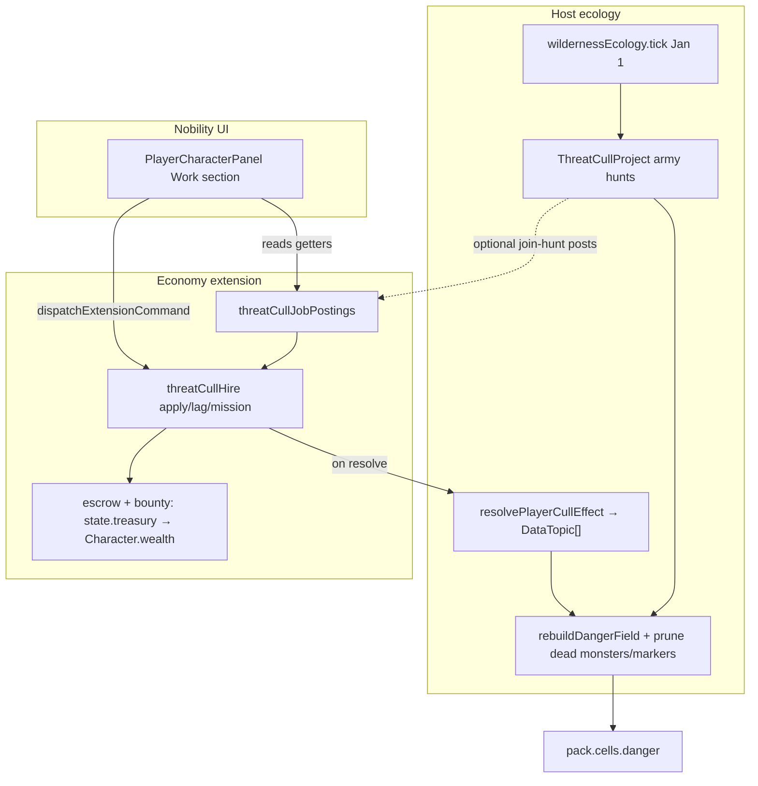

# Player-facing Threat Cull / Hunt Job Board

| Field | Value |
| :--- | :--- |
| **Author** | Design draft (AI agent) |
| **Date** | 2026-08-04 |
| **Status** | Design approved — **PR-1 … PR-3b implemented** (board + hire + combat resolve + ecology; PR-3c domain bonus still deferred) |
| **Intended repo path** | `docs/plan/player-threat-cull-jobs.md` |
| **Depends on** | Construction hire board (`constructionHire.ts`, urban-housing §hire board); wilderness ecology Phase 4–5 (`wildernessEcology.ts`, `biomePredators.ts`); characters skills + wealth; economy `martialIndividualMastery` / `individualSkills`; nobility PC panel |
| **Related** | [wild-oikoumene-frontier.md](./wild-oikoumene-frontier.md) Phase 4–5; [urban-housing-system.md](./urban-housing-system.md) construction hire board; [individual-skill-mastery-system.md](./individual-skill-mastery-system.md) (plan; live code is `martialIndividualMastery.ts`); [high-fantasy-dungeons.md](./high-fantasy-dungeons.md) (explicit non-goal: dungeons); [knowledge-guild-system.md](./knowledge-guild-system.md) Phase 5 martial domains |

---

## Overview

Players should be able to accept **monster-culling (間引き) or pest-control contracts in cities**, with the same *feel* as the existing construction hire board: apply while present in a burg, wait through a hire lag, hold a named commitment, and receive pay — while combat skills and target strength shape risk, bounty, and ecological impact.

This design adds a **burg-posted bounty / hunt board** that is **separate from** the host’s annual army-scale `ThreatCullProject` system, but **feeds the same danger ecology** through a host-owned mid-year effect API. Macro state hunts remain treasury-funded multi-year campaigns; PC contracts are short mission-like expeditions that pay personal `Character.wealth`, apply a fixed fraction of one army-year power chunk, and may injure or (rarely) kill the hunter. Targets are abstracted as `CullTarget` so **High Fantasy / Dark Fantasy monsters** and **non-fantasy rural pests** share one pipeline.



---

## Background & Motivation

### Current state (verified in code)

| Area | Reality | Key files |
| :--- | :--- | :--- |
| Construction hire board | Full demand D; macro fills 0.85D; sticky ~0.15 hire openings; PC apply requires location in burg; **player lag 14d**, **anon lag 7d**, hire round 7d; named seats + `Character.roles` (`kind: constructionWorker`); cancel/resign/purge; **no explicit PC wage** | `constructionJobPostings.ts`, `constructionHire.ts`, `economyContext` slice fields |
| PC Work UI | Shows construction seat / pending / openings; **reads economy getters**; mutates via `economy.jobs.*` commands; refresh via `refreshToken` after user actions only | `PlayerCharacterPanel.tsx` |
| Macro cull | Max 2 projects/state; Jan 1 self-gate; setup costs r1–r5 = 5/8/14/24/40; annual ~0.55×; yearsToClear 1/2/3/5/8; never writes `cells.state`; filters dead monsters + prunes markers on annual pass | `wildernessEcology.ts`, `simulationContext.ThreatCullProject` |
| Hunt geometry | `MAX_HUNT_HOPS`, `minHopsToSet`, `collectStateBorderCells`, `setupHuntCost`, `yearsToClear` are **module-private** today | `wildernessEcology.ts` |
| Monsters | `{ i, cell, name, rarity, power, basePower?, type }` | `types/models.ts` |
| Biome predators | Forest/mountain pressure into `cells.danger`; scale 1 / 1.25 / **0** for highFantasy / darkFantasy / none; base danger still computable when scale is 0 | `biomePredators.ts`, `dangerField.biomePredatorScaleForMode` |
| Threat profiles | highFantasy r1–3 only; darkFantasy r1–5; standard = no spawn | `threatProfiles.ts` |
| Character combat stats | `skills.martial`, `skills.prowess` 1–100; personal `wealth`; `dead` / `deathYear` | `characterTypes.ts` |
| Individual martial mastery (**live**) | Economy slice `individualSkills` with domains `swordsmanship` / `archery`; aptitude seed `0.65*martial + 0.35*prowess`; annual `practiceCoverage` growth for commanders | `martialIndividualMastery.ts`, `individualSkillMastery.ts`, `validateEconomySlice` lists `individualSkills` |
| Travel | Burg ↔ burg only (`playerCharacterTravel`); leave-burg purges construction seats | nobility travel controller |
| `economy.tick` write-set | `writes: ["extension.economy", "simulation.burgs", "simulation.states", "map.settlements"]` — **not** `simulation.cells` / `map.annotations` | `economy/index.tsx` |
| Wilderness tick write-set | `writes: ["simulation.cells", "simulation.states"]`; marks returned `DataTopic[]` | `timeEngine.ts` |
| Archive | `assertAndNormalizeWilderness` on `simulation.wilderness.cullProjects`; construction hire arrays are **opaque** (not in `validateEconomySlice`); `individualSkills` is validated as optional array | `worldArchive.ts`, `extensionStateSlices.ts` |

### Pain points

1. **Macro cull is invisible to PCs.** States fund border hunts and Tools lists them, but there is no burg board, personal bounty, or skill-driven risk.
2. **Construction board is the only “get a job in town” loop.** Martial play lacks an analogous contract surface.
3. **Non-fantasy maps have no rural pest loop.** Painted predator scale is 0 on standard maps; forest/mountain hinterlands still have base danger values usable for contracts.
4. **Construction does not pay named seats in coin.** Cull is danger-reduction for the realm → explicit treasury → wealth is the natural pay path.

### Product intent

- **Fantasy:** city boards post cull contracts against nearby named monsters, with stronger targets paying more and risking more.
- **Non-fantasy:** same board posts pest-control drives against biome-predator hinterland pressure (may not paint the danger map unless `ruralThreats` is on).
- Skills (`martial` / `prowess`, plus live `swordsmanship` / `archery` when present) raise the chance of **success without injury**.

### Divergence from construction (intentional)

| Dimension | Construction | Cull / hunt board (this design) |
| :--- | :--- | :--- |
| Economic role | Urban production labor | Danger reduction / bounty |
| PC wage | None (anonymous labor economics) | Explicit bounty from `state.treasury` → `Character.wealth` |
| Commitment shape | Ongoing named **seat** until resign | Fixed-length **mission** then ends |
| Player hire lag | 14 days | **7 days** (mission accept is faster than craft hire) |
| Anon hire lag | **7 days** (faster than player) | **10 days** (slower than player — heroes get first crack at scarce posts) |
| Anon hire round | Every 7 days | Every 14 days |
| Fort burgs | Excluded from posts | Optional border forts may post (darkFantasy flavor) |
| Macro analogue | Continuous annual employment reconcile | Annual army `ThreatCullProject` (Jan 1) — structural analogy, not temporal |
| Ecology writes | None | Host `resolvePlayerCullEffect` mid-year |

---

## Goals & Non-Goals

### Goals

1. Mirror construction hire **UX and lifecycle** (presence, apply lag, named commitment, cancel/resign/purge) for cull/pest contracts, with divergences documented above.
2. Keep **macro `ThreatCullProject` intact** and separate from PC applications (same separation as macro construction vs hire board).
3. Apply **immediate ecological effects** on success (monster `power` drop / pest suppression / danger rebuild / full-clear cleanup) without annexation (`cells.state` untouched), via a host API that returns `DataTopic[]` for `economy.tick` to mark.
4. **Skill-sensitive combat resolution** using pure functions over current `martial` + `prowess`, with optional live domain proficiency; practiceCoverage hooks into `martialIndividualMastery` rather than permanent base-skill inflation.
5. **Pay scales with target rarity only at post time**; payer is `state.treasury` with closed escrow accounting.
6. **Generalize targets** as `CullTarget` (`monster | biomePredator | residualDanger | pest`) so one board works across culture modes.
7. Ship **PC panel Work section** expansion first; optional Burg Editor / Employment Overview / Frontier panel summaries later.
8. Respect extension rules: **economy must not depend on nobility**; built-ins may import host modules; nobility may import economy **getters** for status (existing construction pattern) and mutates only via `dispatchExtensionCommand`.
9. **Save/load**: strict archive-normalize for new wilderness fields; register cull arrays in `validateEconomySlice` (improve on construction-hire opacity).

### Non-Goals

- Full party combat, tactical maps, or dungeon interior simulation.
- Replacing or deleting army-scale `ThreatCullProject`.
- Free-cell wilderness pathfinding / camping simulation.
- Paying cull wages via anonymous labor markets as if hunters were masons.
- Making standard culture sets spawn fantasy `Monster` entities.
- Agent-simulating every villager as a hunter.
- Multi-sortie campaigns in v1 (deferred).
- Prestige mutation on injury/success in v1.
- Character schema expansion for injury flags in v1.
- Regiment-attached cull (military movement integration) — deferred; see Alternatives.
- Claiming land or frontier incorporation as a side effect of cull success.

---

## Key Decisions

| ID | Decision | Rationale |
| :--- | :--- | :--- |
| **K1 — Hybrid relationship (C)** | Macro `ThreatCullProject` remains host annual army hunts. PC board posts **independent bounty contracts**. When a state project is active within range, the board may also list a **“join the royal hunt”** post. | Pure (A) couples PC UX to Jan-1 cadence and max-2 projects; pure (B) ignores funded hunts in Tools. |
| **K2 — Ownership split** | **Host** owns ecology effects + pest suppression + exported hunt geometry. **Economy** owns postings, applications, active contracts, bounty/escrow, commands, tick. **Nobility** owns PC panel UI: **reads economy getters**, **mutates via commands**. **Characters** supply skills/wealth/roles/dead. | Mirrors construction; fiscal wealth credit lives in economy patterns; host owns danger/monster mutations. |
| **K3 — Mission model** | After lag, contract is an **expedition** with `missionDaysRemaining`. **v1: one combat resolve per contract** (no multi-sortie). | Hunting is not continuous urban labor; travel is burg-only. |
| **K4 / K13 — Escrow closed** | On accept: **immediately deduct** escrow from `state.treasury` into `contract.escrow`. Never “reserve” without mutating treasury. On resolve/resign: explicit pay/forfeit rules (see §5.3). | Matches macro hunt immediate deducts; avoids double-charge / phantom reserve. |
| **K5 — Combat score weights** | v1 base: `0.55 * prowess + 0.45 * martial` (**personal fight**). Live commander aptitude uses `0.65 * martial + 0.35 * prowess` (**command/organization**). Weights **intentionally differ**. **`cullDomainBonus` from `individualSkills` is PR-3c only** — PR-3b / v1 combat uses `domainBonus = 0`. | Do not force one formula; ship skill baseline first, domain bonus as incremental polish. |
| **K6 — Non-fantasy pests** | Same job board; targets from hinterland biome **base** danger (no need for painted `cells.danger > 0`). `pestSuppressionByCell` + optional `options.ruralThreats` (default **false**) for painted danger. | Scale is 0 on standard maps today; contracts still valid. |
| **K7 — Board capacity** | Cap open posts per burg (1–3) and per state (12); prefer border / high-danger / forest hinterland burgs. | Avoids empty inland spam and dragon-in-every-village. |
| **K8 — Death / injury v1** | Injury: economy `cullCooldowns` + optional wealth loss only (no Character schema, **no prestige**). Death: `character.dead = true`, `deathYear = simulationContext.currentYear`; purge cull **and** construction; leave titles to existing dead handling. Death is rare. | Only aging path sets dead today; keep minimal. |
| **K9 — PC power scale** | Single constant: **`PC_ARMY_YEAR_FRACTION = 0.25`**. Intensity 0..1 from combat multiplies that chunk. Outcome quality uses intensity bands, not a second “15–35%” band. | Removes implementer disagreement. |
| **K10 — Mutual exclusion** | Construction **xor** cull: hard-block **both** apply paths if the other has seat/app/contract. **No auto-cancel.** Shared helper `characterHasEmploymentCommitment`. | Prevents dual wages / role chaos. |
| **K11 — Anon NPC ecology** | Anon applications accept into `CullActiveContract` with **`characterId: null`** (same mission timer, no escrow, no role tag). On resolve: synthetic combat score **45** through `resolveCullCombat`, then ecology at **`ANON_ECOLOGY_SCALE = 0.5`**, **no** treasury bounty / **no** personal wealth. Purge never runs location checks for null characterId. | Boards clear without paying NPCs; typed mission state so PR-3b is implementable. |
| **K12 — Mission SoT** | **Economy-only** `CullActiveContract` is source of truth. No nobility `pendingCullMission`. UI derives “on hunt Nd” via getter. Leave-burg / travel away aborts via purge. | Save/load + single SoT. |
| **K14 — Immediate ecology** | Full-clear removes zero-power monsters + prunes markers **on resolve**; danger rebuild **immediate**; host API returns exact `DataTopic[]` per ownership table (K18). | Success must feel immediate; not dirty-until-Jan-1. |
| **K18 — DataTopic ownership** | `pack.cells.danger` + `simulation.wilderness` → **`simulation.cells`**. `pack.monsters`, `pack.markers`, `world.notes` → **`map.annotations`**. Treasury → **`simulation.states`** (economy). `resolvePlayerCullEffect` returns the union of topics it mutated. | Matches `dataFieldOwnership.ts`; closes prior Open Q7. |
| **K19 — Injury orthogonal** | Combat `outcome` is only `"success" \| "partial" \| "fail" \| "dead"`. `injured: boolean` is separate. Pay follows ecology outcome only; injury only sets cooldown (+ optional wealth loss). | One implementable model; no `"injured"` ecology tier. |
| **K15 — Join-hunt diagnostics only** | Join-macro success may bump `dangerReduced` / optional `playerAssistYears` diagnostic fields only. **Never** mutates `progressYears` or `yearsToClear` residual. | Avoids double-counting army clear speed on the same damage channel. |
| **K16 — Rewild honesty** | PC-solo mid-year power cuts are **not** rewild-shielded. Next Jan 1 rewild applies unless macro hunted that monster that year. UI copy: wounded threats may recover over winter. | Matches host rewild; no silent magic shield. |
| **K17 — Full-clear immediate** | When PC (or anon) reduces `Monster.power` to 0, host API removes it from `pack.monsters` and runs marker prune **in the same call**. | Matches annual lifecycle intent mid-year. |

---

## Proposed Design

### 1. Relationship to macro `ThreatCullProject` (K1, K15, K16)

```text
State annual hunt (host, Jan 1)
  ThreatCullProject { cellId, stateId, monsterId, progressYears, … }
  setup/annual treasury costs; yearsToClear(rarity)
  applyHuntProgress → army chunk; huntedMonsterIds → rewild shield
  filter power>0 monsters; prune markers; rebuild danger

PC / named bounty board (economy.tick, any day)
  CullJobPosting → apply lag → CullActiveContract (expedition)
  resolvePlayerCullEffect → pcChunk * intensity; optional full-clear cleanup
  rebuild danger immediately; return DataTopic[] for markChanged
```

#### Hybrid stacking table (normative)

| Path | Monster power / pest | Rewild shield (next Jan 1) | Macro project fields | Treasury |
| :--- | :--- | :--- | :--- | :--- |
| **PC solo** (named) | `pcChunk * intensity` (K9); full-clear if power→0 | **None** — rewild applies if not macro-hunted that year | none | bounty via escrow + remainder |
| **PC join-macro** | **same power channel only** (same pcChunk formula) | Only if macro also lists monster in that year’s `huntedMonsterIds` (Jan 1) | **Diagnostics only**: may add to `dangerReduced`; optional `playerAssistYears += intensity * 0.25`. **Never** change `progressYears` | stipend (lower bounty table) |
| **Macro army** | army chunk `ceil(base/yearsToClear)` | Yes (hunted set) | `progressYears++` | setup + annual |
| **Anon NPC** | `0.5 * pcChunk * intensity` (K11) | none (same as PC solo) | none | **no pay** |

**Shared resources:** (1) `Monster.power` / pest suppression (effects stack additively on the same channel), (2) `state.treasury` (macro costs + PC bounties are separate spends). Power stacking is intentional; army clear speed is **not** double-counted via `progressYears`.

**Open Q6 closed:** join-hunt assists are diagnostics-only in v1 (K15).

### 2. Data model

#### 2.1 Host — ecology side effects + geometry

**New modules:**

| Module | Role |
| :--- | :--- |
| `src/generators/huntGeometry.ts` | `MAX_HUNT_HOPS`, `minHopsToSet`, `collectStateBorderCells`, score helpers |
| `src/generators/threatCullEffects.ts` | `CullTargetRef`, cost helpers, `resolvePlayerCullEffect` |

Keep annual orchestration in `wildernessEcology.ts`; import geometry/costs from the shared modules (refactor private fns out in PR-1).

```typescript
export type CullTargetKind = "monster" | "biomePredator" | "residualDanger" | "pest";

export interface CullTargetRef {
  kind: CullTargetKind;
  monsterId: number | null; // pack.monsters[i].i when kind === "monster"
  cellId: number;
  rarity: number; // 1–5; pests map to 1–2
  powerSnapshot: number; // at post time
  label: string;
}

export interface PlayerCullEffectInput {
  readonly world: WorldContext;
  readonly simulation: SimulationContext;
  readonly target: CullTargetRef;
  /** 0..1 from combat (or 0.5 * intensity for anon). */
  readonly intensity: number;
  readonly rng: RNGService;
  /** When true, join-macro diagnostic-only project updates allowed. */
  readonly macroCellId?: number | null;
}

export interface PlayerCullEffectResult {
  readonly cleared: boolean;
  readonly powerReduced: number;
  readonly dangerHint: number;
  /** Caller must writer.markChanged(...topics). */
  readonly topics: readonly DataTopic[];
}

/**
 * Single host entry for mid-year PC/anon cull success (and partial).
 * - Mutates Monster.power or pestSuppressionByCell
 * - If power <= 0: remove monster from pack.monsters; pruneDeadMonsterMarkers
 * - rebuildDangerField (immediate)
 * - Never writes cells.state
 * - Optionally updates ThreatCullProject diagnostics when macroCellId set
 */
export function resolvePlayerCullEffect(input: PlayerCullEffectInput): PlayerCullEffectResult;

export function setupHuntCost(rarity: number): number;
export function yearsToClear(rarity: number): number;
export function getCullTargetsNearBurg(
  world: WorldContext,
  simulation: SimulationContext,
  burgId: number
): CullTargetRef[];
```

**Topics contract (normative, K18 — closed; matches `dataFieldOwnership.ts`):**

| Mutation inside `resolvePlayerCullEffect` | Topic(s) **must** include |
| :--- | :--- |
| `cells.danger` rebuild and/or `simulation.wilderness.pestSuppressionByCell` | `"simulation.cells"` |
| `pack.monsters` power change or list filter (full-clear) | `"map.annotations"` |
| `pack.markers` / `world.notes` prune | `"map.annotations"` |
| No monster path (pest-only suppression + danger) | `"simulation.cells"` only |
| Typical named monster hit (power and/or clear + danger) | **both** `"simulation.cells"` and `"map.annotations"` |

`resolvePlayerCullEffect` returns the **union of topics it actually touched**. Economy marks those topics via `writer.markChanged(...result.topics)` and separately marks `"extension.economy"` / `"simulation.states"` for contracts and treasury.  
**PR-1 must not copy wilderness-ecology’s under-mark habit** if the annual path omits `map.annotations` when pruning — the new public API is correct-by-contract.

**PR-1 acceptance:** unit tests for full-clear cleanup (monster removed, marker gone, danger rebuilt) asserting `topics` includes `"map.annotations"` **and** `"simulation.cells"`; pest-only path asserts cells-only (no annotations unless danger rebuild alone is cells).

Extend `WildernessEcologyState`:

```typescript
export interface WildernessEcologyState {
  cullProjects: Record<number, ThreatCullProject>;
  lastEvaluatedYear: number | null;
  /**
   * Temporary rural/pest pressure suppression by cell (0..1).
   * Applied inside applyBiomePredatorDanger / rebuildDangerField (see §5.5 formula).
   * Decays on annual wilderness tick (e.g. −0.15/year, floor 0, drop key at 0).
   */
  pestSuppressionByCell?: Record<number, number>;
}
```

Optional diagnostic on project (v1 may store only on `dangerReduced` without schema change):

```typescript
// Prefer: only mutate existing dangerReduced += estimateLocalDangerDrop(...)
// If playerAssistYears is added later, it is float diagnostic only — not in v1 schema required.
```

#### 2.2 Economy — board / hire / contracts

| File | Role |
| :--- | :--- |
| `threatCullHireTypes.ts` | Types |
| `threatCullJobPostings.ts` | Board snapshots |
| `threatCullHire.ts` | Apply / lag / mission / resolve / purge / pay |
| `employmentCommitment.ts` (or in hire module) | `characterHasEmploymentCommitment` shared with construction |
| `economyContext.ts` | Slice getters/setters |

```typescript
export type CullContractRole = "hunter" | "pestController";

export interface CullJobPosting {
  i: number;
  burgId: number;
  stateId: number;
  target: CullTargetRef;
  macroCellId: number | null; // ThreatCullProject.cellId when join-macro
  bounty: number; // full success, posted target-only
  bountyPartial: number;
  missionDays: number;
  /**
   * Display tier only (from rarity, clamped 1–5).
   * **Never** passed into `resolveCullCombat` — combat uses `targetDifficulty(target)`.
   */
  uiDifficulty: number;
  openSeats: number; // usually 1
  postedAtDay: number; // simulation ordinal or tick stamp
  expiresInDays: number;
}

export interface CullHireApplication {
  i: number;
  postingId: number;
  burgId: number;
  characterId: number | null; // null = anonymous NPC
  daysRemaining: number;
}

export interface CullActiveContract {
  i: number;
  postingId: number;
  burgId: number;
  stateId: number;
  /** Named hunter; **null = anonymous NPC mission** (K11). */
  characterId: number | null;
  target: CullTargetRef;
  macroCellId: number | null;
  bounty: number;
  bountyPartial: number;
  /** Days until the single combat resolve (v1). */
  missionDaysRemaining: number;
  /**
   * Treasury units already deducted on accept (K13).
   * Always **0** for anon (`characterId === null`).
   */
  escrow: number;
  role: CullContractRole;
  /** Ecology/death tier only — never `"injured"` (K19). */
  lastOutcome?: CullEcologyOutcome;
}

/** Ecology + death tier stored on contracts and used for pay. Injury is orthogonal. */
export type CullEcologyOutcome = "success" | "partial" | "fail" | "dead";

/** @deprecated name — use CullEcologyOutcome; kept as alias for call sites */
export type CullCombatOutcome = CullEcologyOutcome;

/** characterId → simulation day ordinal when cooldown ends */
export type CullCooldowns = Record<string, number>;
```

Slice fields:

- `cullJobPostings: CullJobPosting[]`
- `cullHireApplications: CullHireApplication[]`
- `cullActiveContracts: CullActiveContract[]`
- `cullCooldowns: Record<string, number>` (or array of `{ characterId, untilDay }`)

Role tags:

```typescript
{
  source: "economy",
  kind: "cullHunter", // or "pestController"
  entityType: "burg",
  entityId: burgId,
  label: "Hunter" | "Pest controller",
  domain: target.label
}
```

Construction role filter must remain `kind === "constructionWorker"` only; cull uses distinct kinds so purge/remove cannot strip the wrong role.

#### 2.3 Mission soft-lock (K12)

- **SoT:** `CullActiveContract` while active (`missionDaysRemaining` may be 0 only on the resolve tick before deletion).
- Named getters: `getCharacterCullContract(characterId)`, `getCharacterPendingCullApplication(characterId)` — mirror construction (match `characterId !== null`).
- Anon contracts (`characterId === null`) are not shown on PC panel; they only consume board seats until resolve.
- **No** nobility store field for missions.
- While **named** contract active: UI may disable Move (**panel-only**); if the player still travels and leaves burg, **purge aborts** mission (forfeit escrow per resign policy). Economy commands do **not** read `pendingTravel`.
- Construction apply checks cull commitment via shared helper (and vice versa). Named commitment only counts non-null character ids.

### 3. Posting generation

#### 3.1 When

| Trigger | Action |
| :--- | :--- |
| `fmg:generate-post-core` (economy enabled) | `clearCullHireState` if full regen path; rebuild posts |
| Map load / reinit | Rebuild if empty or invalid targets |
| Monthly gate in `economy.tick` | Expire posts; refill to caps |
| After macro hunt start/clear (optional) | Refresh join-hunt posts |

#### 3.2 Where (eligibility)

Burg eligible if:

1. Valid, not removed.
2. Owning `stateId > 0`.
3. Forts: excluded by default like construction; **optional include** when burg is on state border and `culturesSet === "darkFantasy"` (feature constant `CULL_ALLOW_BORDER_FORTS`).
4. At least one target from `getCullTargetsNearBurg`:
   - **Monster (fantasy):** living monster within `MAX_HUNT_HOPS` of state border **and** within hops of burg cell.
   - **Join-macro:** active `ThreatCullProject` for this state in range.
   - **Pest:** hinterland cells (1–3 hops) with `getBiomePredatorBaseDanger(...) > 0` — **does not require** `cells.danger > 0`.
5. State treasury ≥ min escrow + `HUNT_RESERVE` (10); else skip or post only if cheaper pest bounty fits.

#### 3.3 Caps & constants

```typescript
export const CULL_MAX_POSTINGS_PER_BURG = 3;
export const CULL_MAX_POSTINGS_PER_STATE = 12;
export const CULL_POST_EXPIRE_DAYS = 45;
export const CULL_PLAYER_HIRE_LAG_DAYS = 7;
export const CULL_ANON_HIRE_LAG_DAYS = 10;
export const CULL_ANON_ROUND_DAYS = 14;
export const PC_ARMY_YEAR_FRACTION = 0.25;
export const ANON_ECOLOGY_SCALE = 0.5;
export const CULL_INJURY_COOLDOWN_DAYS = 30;
export const CULL_INJURY_WEALTH_LOSS = 0.5; // absolute treasury units, rn
export const HUNT_RESERVE = 10; // match wildernessEcology
```

Score: `danger * 2 + rarity * 12 - hops * 8` (same spirit as `selectHuntTarget`).

#### 3.4 Fantasy vs non-fantasy

| Mode | Monster posts | Join-macro | Pest posts |
| :--- | :--- | :--- | :--- |
| highFantasy | r1–3 | Yes | Optional residual predators |
| darkFantasy | r1–5 | Yes | Yes |
| standard / none | Only if loaded monsters exist | Only if projects exist | **Yes** when hinterland base danger &gt; 0 |

**UI tooltip for pest posts:** “Hinterland pests (local pressure; may not show on the danger map unless Rural threats is on).”

**v1 residualDanger posts:** **out of scope** (macro selector also never starts residual-only projects). Defer to v2 when `cells.danger >= WILD_LAND_MARGIN_DANGER_MIN` and no monster.

#### 3.5 Content smoke (acceptance)

| Map | Expect at least one post |
| :--- | :--- |
| Fantasy frontier, border market burg, living nearby monster | Monster or join-macro post |
| Standard cultures, forest/mountain hinterland market burg | Pest post (if economy enabled) |
| Inland pure grassland burg | Often empty — OK |

### 4. Apply / resolve flow

```mermaid
sequenceDiagram
  participant PC as PlayerCharacterPanel
  participant Cmd as economy.jobs.*
  participant Hire as threatCullHire
  participant Tick as economy.tick
  participant Eco as resolvePlayerCullEffect
  participant W as TransactionWriter

  PC->>Cmd: jobs.applyCull { characterId, postingId }
  Cmd->>Hire: apply (presence, xor employment, seat, lag=7)
  Tick->>Hire: tickCullHiring(deltaDays, rng)
  Note over Hire: accept → role tag; deduct escrow from treasury
  Tick->>Hire: missionDaysRemaining -= delta
  Hire->>Hire: resolveCullCombat pure (one roll chain)
  alt success / partial
    Hire->>Eco: resolvePlayerCullEffect
    Eco-->>Hire: topics
    Hire->>W: markChanged(topics + economy + states)
    Hire->>Hire: pay remainder bounty to wealth (named only)
    Note over Hire: if injured flag: cooldown + optional wealth loss (no pay tier change)
  else fail
    Hire->>Hire: forfeit escrow; if injured then cooldown
  else dead
    Hire->>Hire: dead+deathYear; purge cull+construction
  end
```

#### 4.1 Apply rules

- Character exists, not dead; not on injury cooldown.
- `character.location === posting.burgId`.
- **`pendingTravel`:** panel-only disable for Apply (same as construction). Economy commands **must not** import nobility travel state; location + purge-on-leave are the command-side guarantees.
- **`characterHasEmploymentCommitment(id)` is false** — construction seat/app **or** named cull contract/app.
- Posting has free seat after pending apps.
- State solvent for escrow amount (named only).
- Command validates existence/location/solvency only — **no** playerCharacterId ownership check (parity with construction; console may apply for any character).

#### 4.2 Lag

- PC: 7 days.
- Anon: 10 days lag, rounds every 14 days (heroes faster — see Divergence table).

#### 4.3 Mission duration (v1 single resolve)

```text
missionDays = clamp(5 + hops*2 + rarity*3 + floor(powerSnapshot/5), 5, 40)
// sortiesRequired is NOT used in v1 — always one combat at mission end
```

When `missionDaysRemaining` hits ≤ 0 **and** `CULL_RESOLVE_ENABLED` (PR-3b+): **one** `resolveCullCombat` → pay/ecology → delete contract → clear role (named).

Early complete: only via resign, purge, death, or target already gone (rebind: treat as intensity-0 auto-complete with refund-half escrow policy for named).

#### 4.4 Cancel / resign / purge

| Action | Escrow | Ecology | Other |
| :--- | :--- | :--- | :--- |
| Cancel application | n/a | none | free seat |
| Resign active mission (named) | **forfeit 100%** (already deducted; no refund) | none | clear role |
| Leave burg / invalid location (named only) | same as resign | none | purge; **anon contracts skip location checks** |
| Death (named) | forfeit | none | purge cull + construction; set dead |
| Target gone mid-mission | **refund 50%** of escrow to state (named); anon escrow is 0 | none | clear contract |

`EscrowDisposition = "forfeit" | "refund_half" | "apply_to_bounty"`.

### 5. Combat resolution (implementable)

RNG: use **`context.rng`** from the simulation system run (same as wilderness / economy tick). Pure functions accept `RNGService`.

#### 5.1 Scores

```typescript
import { getIndividualSkill } from "./individualSkillMastery";

/** Personal sortie score — intentional weights (K5). */
export function combatScore(character: Character, domainBonus = 0): number {
  const s = character.skills;
  return 0.55 * (s.prowess ?? 50) + 0.45 * (s.martial ?? 50) + domainBonus;
}

/**
 * Live individualSkills domain bonus (swordsmanship / archery).
 * **PR-3b / v1: do not call** — pass `domainBonus = 0`.
 * **PR-3c: enable** for named hunters only.
 * Commander aptitude seeding uses 0.65 martial + 0.35 prowess — different purpose.
 */
export function cullDomainBonus(characterId: number): number {
  const sword = getIndividualSkill(characterId, "swordsmanship")?.proficiency ?? 0;
  const bow = getIndividualSkill(characterId, "archery")?.proficiency ?? 0;
  return 0.15 * sword + 0.05 * bow;
}

/** Anon NPC synthetic combat score (K11) — modest competent hunter, not a hero. */
export const ANON_COMBAT_SCORE = 45;

/**
 * Resolution difficulty (~20–95). Always derived from `CullTargetRef` snapshots.
 * Independent of posting.uiDifficulty (1–5 display only).
 */
export function targetDifficulty(target: CullTargetRef): number {
  return Math.min(95, 15 + target.rarity * 12 + target.powerSnapshot * 1.5);
}

/** UI stars from rarity only. */
export function uiDifficultyFromRarity(rarity: number): number {
  return Math.max(1, Math.min(5, Math.round(rarity)));
}
```

#### 5.2 Outcome pure function (K19 — injury orthogonal)

```typescript
export type CullEcologyOutcome = "success" | "partial" | "fail" | "dead";

export interface CullCombatResult {
  /** Ecology / death tier only — never "injured". */
  outcome: CullEcologyOutcome;
  /** 0..1 ecology scale before anon factor; 0 on fail/dead. */
  intensity: number;
  /** Orthogonal injury flag; does not change outcome or bounty tier. */
  injured: boolean;
}

/**
 * Single normative combat resolver. Injury never overwrites outcome.
 * Pay callers use `outcome` only; injury callers set cooldown / optional wealth loss.
 */
export function resolveCullCombat(args: {
  combatScore: number;
  /** Must be targetDifficulty(target), not posting.uiDifficulty. */
  difficulty: number;
  rarity: number;
  rng: RNGService; // rng.rand() → [0,1)
}): CullCombatResult {
  const delta = args.combatScore - args.difficulty;
  const u = () => args.rng.rand();

  // Critical death checks first
  if (delta < -25 && u() < 0.03) {
    return { outcome: "dead", intensity: 0, injured: false };
  }
  if (args.rarity >= 5 && args.combatScore < 35 && u() < 0.08) {
    return { outcome: "dead", intensity: 0, injured: false };
  }

  if (delta >= 15) {
    const intensity = 0.85 + u() * 0.15; // U(0.85, 1.0)
    const injured = u() < 0.02;
    return { outcome: "success", intensity, injured };
  }

  if (delta >= -5) {
    const intensity = 0.35 + u() * 0.25; // U(0.35, 0.60)
    const injured = u() < 0.15;
    return { outcome: "partial", intensity, injured };
  }

  // Fail band — high injury chance, still outcome "fail"
  const injuryP = Math.min(0.7, Math.max(0.25, 0.25 - delta / 80));
  const injured = u() < injuryP;
  return { outcome: "fail", intensity: 0, injured };
}
```

**Pay rule (normative):** bounty/escrow follows **`outcome` only** (`success` / `partial` / `fail` / `dead`).  
**Injury rule (normative):** if `injured`, set `cullCooldowns` (+ optional `CULL_INJURY_WEALTH_LOSS`); UI may show “Success (injured)” as presentation, but `lastOutcome` stays the ecology tier.

#### 5.3 Worked examples

Assume `domainBonus = 0`. Difficulty = `min(95, 15 + 12*r + 1.5*power)`.

| Case | Score | Target | Diff (approx) | delta | Expected band |
| :--- | ---: | :--- | ---: | ---: | :--- |
| A | 40 | r1 Beast power 5 | 15+12+7.5=34.5 | +5.5 | partial (delta ≥ −5, &lt; 15) |
| B | 60 | r1 Beast power 5 | 34.5 | +25.5 | success |
| C | 40 | r3 Greater power 14 | 15+36+21=72 | −32 | fail / death risk (delta &lt; −25) |
| D | 80 | r3 Greater power 14 | 72 | +8 | partial |
| E | 80 | r5 Calamity power 50 | 15+60+75→95 | −15 | fail, high injury p |
| F | 30 | r5 Calamity power 50 | 95 | −65 | fail / elevated death if r5 &amp; score&lt;35 |

#### 5.4 Pay & escrow accounting (closed)

**Post-time bounty (target-only, K5 pay fix):**

```typescript
export function computePostedBounty(rarity: number): { bounty: number; bountyPartial: number } {
  const setup = setupHuntCost(rarity);
  const bounty = rn(setup * 0.4 * (1 + 0.05 * (rarity - 1)), 2);
  const bountyPartial = rn(bounty * 0.4, 2);
  return { bounty, bountyPartial };
}
// Join-macro stipend: bounty = rn(annualHuntCost * 0.25, 2); partial = 0.4 * bounty
// PC full bounty ≈ 0.4× macro setup is intentional (hero fee vs army campaign).
```

No `combatScoreMedian` at posting. No payout-time hero bonus in v1 (flag reserved, default off).

**Escrow on accept (named characters only):**

```text
escrowAmount = min(bountyPartial, max(0, state.treasury - HUNT_RESERVE))
if escrowAmount < bountyPartial * 0.5: reject apply (state too poor)
state.treasury = rn(state.treasury - escrowAmount, 2)
contract.escrow = escrowAmount
```

**On resolve:**

| Outcome | Treasury | Character.wealth | Injury flag |
| :--- | :--- | :--- | :--- |
| success | deduct `max(0, bounty - escrow)` more if solvent; else deduct all remaining above HUNT_RESERVE; tip shortchange | `+ (escrow + extraPaid)` | if injured: cooldown (+ optional wealth loss) **after** pay |
| partial | deduct `max(0, bountyPartial - escrow)` (usually 0 if escrow was bountyPartial) | `+ min(bountyPartial, escrow + extra)` | same orthogonal injury handling |
| fail / dead / resign | escrow already in treasury → **no refund** | 0 | fail may still set injured cooldown |
| target gone | credit `0.5 * escrow` back to treasury | 0 | n/a |

Injury **never** downgrades success→partial pay or cancels a successful bounty.

Mirror fiscal style:

```typescript
state.treasury = rn(state.treasury - extra, 2);
character.wealth = rn((character.wealth || 0) + paid, 2);
```

**Anon:** no escrow, no wealth, ecology only at `ANON_ECOLOGY_SCALE`.

#### 5.5 Ecology intensity (K9) and pest suppression formula

```typescript
const base = monster.basePower ?? monster.power;
const armyChunk = Math.max(1, Math.ceil(base / yearsToClear(monster.rarity)));
const pcChunk = Math.max(1, Math.ceil(armyChunk * PC_ARMY_YEAR_FRACTION)); // 0.25
const powerCut = Math.max(1, Math.round(pcChunk * intensity * anonScale));

// On success/partial pest or biomePredator path:
pestSuppressionByCell[cell] = min(1, (pestSuppressionByCell[cell] ?? 0) + 0.25 * intensity * anonScale);
```

**Danger rebuild (PR-1 normative):** pass `pestSuppressionByCell` into `rebuildDangerField` / `applyBiomePredatorDanger`. For each cell’s predator contribution:

```text
predatorAdd = round(base * intensityScale * (1 - clamp01(pestSuppressionByCell[cell] ?? 0)))
```

Unit test: suppression `1.0` → zero predator add on that cell (monster influence unchanged).

### 6. Skill growth hooks

**PR-3b / v1 combat:** `domainBonus = 0` (martial + prowess only). Optional: on named success/partial, write `cullPracticeCredit[characterId]` for later annual settle — may land in 3b as a dead-store or wait for 3c; **must not** `skills.prowess += 1`.

**PR-3c:** (1) enable `cullDomainBonus` for named hunters in RESOLVE; (2) consume practice credits in `MartialIndividualMastery.settleAnnual` (or hunt-specific annual pass).

### 7. Non-fantasy generalization

Same commands/UI. Pest labels from biome signals (narrative only):

| Signals | rarity | label examples |
| :--- | ---: | :--- |
| forest + cold | 1 | Wolf cull |
| forest | 1 | Boar drive |
| forest + mountain | 2 | Bear problem |
| highland/mountain | 2 | Mountain cats |

Requires **economy** enabled for board; named PC UX requires **characters** (+ nobility panel). Anon fills can run with characters present or absent if posts exist — ecology still applies at half intensity.

### 8. UI

#### 8.1 PlayerCharacterPanel (required)

- **Reads:** `getCharacterCullContract`, `getCharacterPendingCullApplication`, `getCullJobPostingsForBurg(burgId)` (same import style as construction).
- **Mutations:** `dispatchExtensionCommand` only.
- Status: openings / applying / on hunt Nd / cooldown.
- Buttons: Apply hunt, Cancel application, Resign hunt.
- **Required:** subscribe to `fmg:simulation-updated` (or equivalent) to bump `refreshToken` so mission countdown advances without user click.
- Mutual exclusion: `canApplyConstruction` false when cull commitment; `canApplyCull` false when construction commitment.
- Pest tooltip notes danger-map caveat (§3.4).

#### 8.2 Optional

- Burg Editor / Employment Overview hunt column.
- FrontierStatusPanel: PC assists / pest suppression counts.

### 9. Ownership / module placement

```text
src/generators/huntGeometry.ts          HOST — hops/border helpers
src/generators/threatCullEffects.ts     HOST — resolvePlayerCullEffect + costs
src/generators/wildernessEcology.ts     HOST — annual macro; import shared helpers; suppression decay
src/context/simulationContext.ts        HOST — pestSuppressionByCell
src/runtime/worldArchive.ts             HOST — normalize pestSuppression
src/runtime/extensionStateSlices.ts     validateEconomySlice cull arrays

src/extensions/economy/generators/threatCull*.ts
src/extensions/economy/generators/constructionHire.ts  — call shared employment commitment
src/extensions/economy/economyContext.ts
src/extensions/economy/index.tsx        commands + economy.tick writes expansion

src/extensions/nobility/.../PlayerCharacterPanel.tsx  reads getters + commands + simulation-updated
```

### 10. Simulation tick integration & write-set

**`economy.tick` expansion (normative, K18):**

```typescript
reads: [
  "map.politics",
  "map.annotations",       // monsters / markers for target validity
  "extension.economy",
  "simulation.burgs",
  "simulation.states",
  "simulation.cells"       // danger, wilderness, hops geometry
],
writes: [
  "extension.economy",
  "simulation.burgs",
  "simulation.states",
  "map.settlements",
  "simulation.cells",      // danger + wilderness.pestSuppressionByCell
  "map.annotations"        // pack.monsters / markers / notes when resolvePlayerCullEffect mutates them
]
```

Ownership map (`dataFieldOwnership.ts`): `pack.cells.danger` + `simulation.wilderness` → `simulation.cells`; `pack.monsters` + `pack.markers` + `world.notes` → `map.annotations`. Economy must declare every topic it `markChanged`s:

```typescript
const result = resolvePlayerCullEffect(...);
if (result.topics.length) writer.markChanged(...result.topics);
writer.markChanged("extension.economy", "simulation.states"); // contracts + bounty
```

Tick body near construction:

```typescript
tickCullHiring(effectiveDays, context.rng);
refreshCullJobPostingsIfNeeded(...);
```

Host annual wilderness: decay `pestSuppressionByCell`; unchanged macro gate.

### 11. Save / load

**Host PR-1 — `assertAndNormalizeWilderness`:**

- Default `pestSuppressionByCell = {}` if missing.
- Each key: integer cell id string; value finite number clamped to `[0, 1]`; drop non-finite.
- Existing `cullProjects` rules unchanged.

**Economy PR-2/3 — `validateEconomySlice`:**

Intentionally **stricter than construction hire** (which remains unvalidated opaque arrays). Register:

```typescript
"cullJobPostings",
"cullHireApplications",
"cullActiveContracts"
// cullCooldowns: assert optional record or array
```

Minimum: `assertOptionalArrayField` for the three arrays. Optional deeper shape checks on load; always **rebind** contracts/postings whose `monsterId` is missing → drop or convert post to expired.

**Clear paths:** `clearCullHireState()` alongside `clearConstructionHireState` on economy disable / generate-post-core reset.

**dataFieldOwnership:** parent `simulation.wilderness` already owned; no new top-level field. Economy slice keys do not need ownership map entries beyond extension slice opacity.

### 12. Risks

| Risk | Severity | Mitigation |
| :--- | :--- | :--- |
| TransactionWriter throw on undeclared topics | Critical | PR-1/3 expand writes; return topics from host API |
| PC bankrupts states | Med | Escrow + HUNT_RESERVE + caps |
| PC clears r5 too fast | High | K9 0.25 fraction + skill gate + single resolve |
| Rewild undoes PC damage | Low/Med | Honest UI copy (K16) |
| Dual employment | Med | K10 shared helper both apply paths |
| Non-fantasy “job but no danger map” confusion | Med | Tooltip; ruralThreats default false |
| Death without title cleanup | Med | Minimal dead flags; purge jobs; titles left to existing paths |

---

## API / Interface Changes

### Extension commands (economy) — construction parity

```typescript
// jobs.applyCull — required payload; no auto-pick in command
payload: { characterId: number; postingId: number }

// jobs.cancelCullApplication
payload: { characterId: number }

// jobs.resignCull
payload: { characterId: number }
```

Return: `{ ok: boolean; message: string; ... }`. UI may choose best `postingId` from burg listings before calling.

Validation parity with construction: existence, location, solvency, open seats — **not** player-id ownership.

### Host exports (PR-1)

- `huntGeometry.ts`: `MAX_HUNT_HOPS`, `minHopsToSet`, `collectStateBorderCells`, …
- `threatCullEffects.ts`: `setupHuntCost`, `yearsToClear`, `resolvePlayerCullEffect`, `getCullTargetsNearBurg`, `PC_ARMY_YEAR_FRACTION` (or economy-only constant with host exporting army chunk helper)

### Options (PR-6)

```typescript
// optionsState
ruralThreats: boolean; // default false
```

---

## Data Model Changes

| Location | Change |
| :--- | :--- |
| `simulation.wilderness` | `pestSuppressionByCell?: Record<number, number>` |
| `simulation.extensions.economy` | cull postings/apps/contracts/cooldowns |
| `Character.roles` | `cullHunter` / `pestController` kinds |
| `pack.monsters` | power mutations + mid-year removal on clear |
| `pack.cells.danger` | immediate rebuild |
| `economy.tick` reads/writes | + cells (+ annotations if needed) |

---

## Alternatives Considered

### Alt 1 — Pure micro-seats on `ThreatCullProject` (A)

Rejected as sole model (Jan 1, max 2/state). Retained only as join-hunt posts.

### Alt 2 — Fully separate bounties, no macro interaction (B)

Rejected as sole model; hybrid preferred.

### Alt 3 — Continuous employment like masons

Rejected for primary loop (mission fantasy + single combat resolve fit better).

### Alt 4 — Entire board in host / Tools frontier only

Rejected for v1; loses hire-board/commands/PC wage patterns. Frontier panel remains read-only observability.

### Alt 5 — Full wild-cell travel + tactical combat

Deferred (no pathfinding stack).

### Alt 6 — Regiment-attached cull (commander leads army hunt)

Deferred; would couple military movement/regiments. Personal sortie board ships first; later may redirect join-macro to regiment ops.

---

## Security & Privacy Considerations

- Single-player local simulation; no network auth.
- Commands: validate character exists, not dead, location, solvency, seat availability — **same as construction** (no playerCharacterId gate in economy; panel supplies the PC id).
- Optional later: panel-only path asserts focus character.
- Archive: reject non-finite bounties / clamp suppression.

---

## Observability

| Signal | How |
| :--- | :--- |
| Posts generated / expired | DEBUG counts |
| Resolve outcomes | tip + `fmg:simulation-updated` |
| PC panel countdown | **must** listen to `fmg:simulation-updated` |
| Unit tests | combat pure fns, escrow ledger, full-clear cleanup, mutual exclusion, archive normalize |
| Frontier panel | optional PR-5 |

---

## Rollout Plan

1. Behind economy enablement; PC UI when nobility + characters.
2. Flags: `ruralThreats` default false; no base-skill XP.
3. Rollback: skip tick hooks / commands; macro unchanged; slice fields ignored if unused.
4. Compat: normalize missing fields.

---

## Open Questions

1. ~~Escrow vs pay-on-success?~~ **Closed (K13):** immediate deduct of escrow (`bountyPartial`) on accept.
2. Forts post by default? **Closed for v1:** border forts only if `CULL_ALLOW_BORDER_FORTS` and darkFantasy.
3. Anon NPC hunters? **Closed (K11):** `CullActiveContract.characterId = null`, mission timer, `ANON_COMBAT_SCORE = 45`, half ecology, no pay.
4. Injury schema? **Closed (K8):** cooldown + optional wealth loss only.
5. Province treasury payer? Deferred to multi-ledger fiscal work.
6. ~~Join-hunt progressYears credit?~~ **Closed (K15):** diagnostics only.
7. ~~DataTopic for monsters/markers?~~ **Closed (K18):** `map.annotations` for monsters/markers/notes; `simulation.cells` for danger/wilderness.

---

## Appendix A — v1 algorithm (normative pseudocode)

```text
INVARIANTS
  - never write cells.state from cull paths
  - construction xor cull commitment
  - escrow always reflected in treasury (no phantom reserve)
  - one combat resolve per contract
  - PC power cut = ceil(armyChunk * 0.25) * intensity [* 0.5 if anon]
  - rewild shield only via macro huntedMonsterIds on Jan 1

APPLY(characterId, postingId):
  ch = findCharacter; post = findPosting
  require ch alive, ch.location == post.burgId
  require not characterHasEmploymentCommitment(ch)
  require not cullCooldowns active
  require post.openSeats after pending > 0
  require state.treasury can fund escrow floor
  push CullHireApplication { daysRemaining: 7, characterId, postingId }

TICK_HIRE(deltaDays, rng):
  purgeInvalidCullState()  // dead, wrong burg (named only), missing post
  purgeInvalidConstructionHireState() // existing
  for app in applications:
    app.daysRemaining -= deltaDays
    if <= 0: ACCEPT(app)
  for contract in active:
    contract.missionDaysRemaining = max(0, contract.missionDaysRemaining - deltaDays)
    // PR-3a: CULL_RESOLVE_ENABLED = false → freeze at 0, do not RESOLVE
    // PR-3b: CULL_RESOLVE_ENABLED = true
    if CULL_RESOLVE_ENABLED and contract.missionDaysRemaining <= 0:
      RESOLVE(contract, rng)
  maybeRunAnonRound()

ACCEPT(app):
  if app.characterId == null:
    create CullActiveContract {
      characterId: null,
      missionDaysRemaining: post.missionDays,
      escrow: 0,
      // no role tag
    }
  else:
    escrow = min(bountyPartial, treasury - HUNT_RESERVE)
    treasury -= escrow
    create CullActiveContract {
      characterId: app.characterId,
      missionDaysRemaining: post.missionDays,
      escrow
    }
    add role tag cullHunter|pestController
  remove application; decrement conceptual open seat

// PR-3a: do NOT call RESOLVE — freeze contracts at missionDaysRemaining <= 0 until PR-3b
// PR-3b: enable RESOLVE below

RESOLVE(contract, rng):
  if contract.characterId == null:
    score = ANON_COMBAT_SCORE  // 45
    named = false
  else:
    ch = findCharacter(contract.characterId)
    score = combatScore(ch) + domainBonus  // domainBonus=0 in PR-3b; cullDomainBonus in PR-3c
    named = true
  result = resolveCullCombat({
    score,
    difficulty: targetDifficulty(contract.target),  // NOT posting.uiDifficulty
    rarity: contract.target.rarity,
    rng
  })
  contract.lastOutcome = result.outcome
  if named and result.injured:
    cullCooldowns[ch] = now + 30
    maybe wealth -= CULL_INJURY_WEALTH_LOSS
  if named and result.outcome == dead:
    ch.dead = true; ch.deathYear = currentYear
    purge cull + construction for ch
    delete contract; return
  if result.intensity > 0:
    scale = named ? 1 : ANON_ECOLOGY_SCALE  // 0.5
    effect = resolvePlayerCullEffect({ target, intensity: result.intensity * scale, macroCellId })
    markChanged(...effect.topics)  // simulation.cells and/or map.annotations
  if named and result.outcome in {success, partial}:
    pay wealth from escrow + optional extra deduct  // pay follows outcome only
  // fail/dead/anon: escrow already in treasury or was 0; no named wealth
  if named: clear role
  delete contract; remove/expire posting if cleared

characterHasEmploymentCommitment(id):
  return hasConstructionSeatOrApp(id)
      OR hasCullContractOrApp with characterId == id  // ignore anon null contracts
```

---

## References

- `src/extensions/economy/generators/constructionHire.ts`
- `src/extensions/economy/generators/constructionJobPostings.ts`
- `src/extensions/economy/generators/martialIndividualMastery.ts` (**live** swordsmanship/archery)
- `src/extensions/economy/generators/individualSkillMastery.ts` — `getIndividualSkill`
- `src/extensions/economy/index.tsx` — commands; `economy.tick` writes
- `src/extensions/nobility/ui/components/PlayerCharacterPanel.tsx`
- `src/generators/wildernessEcology.ts`
- `src/generators/biomePredators.ts` / `dangerField.ts`
- `src/generators/threatProfiles.ts`
- `src/context/simulationContext.ts`
- `src/runtime/worldArchive.ts` — `assertAndNormalizeWilderness`
- `src/runtime/extensionStateSlices.ts` — `validateEconomySlice` / `individualSkills`
- `src/types/models.ts` — `Monster`
- `docs/plan/wild-oikoumene-frontier.md` Phase 4–5
- `docs/plan/urban-housing-system.md` hire board
- `docs/plan/individual-skill-mastery-system.md` — plan; prefer live modules above
- `docs/plan/high-fantasy-dungeons.md`

---

## PR Plan

### PR-1 — Host geometry, effect API, write-set contract, archive

- **Title:** `feat(wilderness): hunt geometry exports, resolvePlayerCullEffect, pest suppression`
- **Files:** `huntGeometry.ts`, `threatCullEffects.ts`, refactor `wildernessEcology.ts`, `simulationContext.ts`, `dangerField`/`biomePredators` suppression read, `worldArchive.ts` + tests (full-clear cleanup, normalize clamp)
- **Dependencies:** none
- **Description:** Export hops/border/cost helpers; implement `resolvePlayerCullEffect` returning `DataTopic[]` (immediate danger rebuild, monster filter, marker prune); `pestSuppressionByCell` + annual decay; document required `economy.tick` reads/writes for consumers. No economy board yet.

### PR-2 — Economy postings + slice validation

- **Title:** `feat(economy): threat cull job postings and validated slice fields`
- **Files:** `threatCullHireTypes.ts`, `threatCullJobPostings.ts`, `economyContext.ts`, `extensionStateSlices.ts` (`cullJobPostings` etc.), generate-post-core rebuild, tests for target selection / pest without painted danger
- **Dependencies:** PR-1
- **Description:** Burg boards; caps; join-macro detection; `clearCullHireState`; validateEconomySlice optional arrays (stricter than construction hire).

### PR-3a — Apply / lag / accept / purge / mutual exclusion

- **Title:** `feat(economy): threat cull hire lag and employment xor construction`
- **Files:** `threatCullHire.ts` (no combat ecology yet), `constructionHire.ts` (shared commitment check), commands apply/cancel/resign, `economy.tick` lag/accept only, tests
- **Dependencies:** PR-2
- **Description:** Applications; accept → `CullActiveContract` (named: escrow + role; anon: `characterId: null`, escrow 0); purge; hard-block construction xor cull both ways. Mission timer may decrement but **`CULL_RESOLVE_ENABLED = false`** — contracts freeze at `missionDaysRemaining <= 0` without pay/ecology. **Do not enable resolve path until PR-3b** (avoids burning escrow with no bounty). Resign/cancel still work (forfeit).

### PR-3b — Mission resolve, combat, pay, ecology markChanged

- **Title:** `feat(economy): cull combat resolution, bounties, mid-year ecology writes`
- **Files:** `threatCullHire.ts` resolve path, pure combat module/tests, `economy/index.tsx` expand writes/reads (`simulation.cells`, `map.annotations`) + `markChanged`, death/injury cooldown, anon `ANON_COMBAT_SCORE` + half-ecology
- **Dependencies:** PR-3a, PR-1
- **Description:** Set `CULL_RESOLVE_ENABLED = true`; one combat per contract; **`domainBonus = 0`**; pay by ecology outcome only; injury orthogonal; `resolvePlayerCullEffect` topics; full-clear must include `map.annotations`; worked-example unit tests.

### PR-3c — practiceCoverage + cullDomainBonus

- **Title:** `feat(economy): cull practice credits and individualSkills domain bonus`
- **Files:** `martialIndividualMastery` hook / cull practice credit; call `cullDomainBonus` in RESOLVE for named hunters
- **Dependencies:** PR-3b
- **Description:** Enable live swordsmanship/archery bonus; practiceCoverage consumption; still no base `skills.*` inflation.

### PR-4 — PlayerCharacterPanel

- **Title:** `feat(nobility): PC panel hunt board + simulation-updated refresh`
- **Files:** `PlayerCharacterPanel.tsx`
- **Dependencies:** PR-3b
- **Description:** Getters + commands; mutual exclusion UI; **subscribe `fmg:simulation-updated`**; English tooltips including pest caveat.

### PR-5 — Frontier observability (optional)

- **Title:** `feat(ui): frontier panel player cull summaries`
- **Files:** `FrontierStatusPanel.tsx`, host summary helper
- **Dependencies:** PR-3b
- **Description:** Active contracts / recent assists read-only.

### PR-6 — ruralThreats option + doc promotion

- **Title:** `feat(options): ruralThreats and promote player-threat-cull-jobs plan`
- **Files:** `optionsState.ts`, danger path, `docs/plan/player-threat-cull-jobs.md`
- **Dependencies:** PR-1–PR-4
- **Description:** Default false; balance pass; move design into repo. Burg Editor column only if tiny follow-up.

### Merge order

```text
PR-1 → PR-2 → PR-3a → PR-3b → PR-4
                      ↘ PR-3c
              PR-3b → PR-5
PR-4 → PR-6
```

---

## Acceptance criteria (implementation checklist)

- [ ] Construction hire still works; **xor** cull enforced in **both** apply paths.
- [ ] Macro `ThreatCullProject` still max 2/state, Jan 1, no `cells.state` writes.
- [ ] `economy.tick` declares all topics it marks; full-clear removes monster + markers mid-year; danger updates immediately.
- [ ] PC-solo damage can rewild next Jan 1 unless macro hunts that monster; join-hunt does not advance `progressYears`.
- [ ] Escrow deducted on accept; no double-charge; fail/resign forfeit; success pays remainder rules.
- [ ] Posted bounty target-only; combat pure functions + unit tests for examples A–F style.
- [ ] v1 single combat resolve; K9 uses 0.25 only; injury orthogonal (pay by outcome only).
- [ ] Anon: `characterId: null` active contracts, `ANON_COMBAT_SCORE`, half ecology, no wealth.
- [ ] Injury = cooldown (+ optional wealth); death = dead+deathYear + dual purge; no prestige.
- [ ] Mission SoT = `CullActiveContract` only; PC panel refreshes on `fmg:simulation-updated`.
- [ ] `pendingTravel` panel-only; no economy import of nobility travel store.
- [ ] Pest posts without painted danger; tooltip caveat; `ruralThreats` default false.
- [ ] Pest suppression formula `base * scale * (1 - suppression)`; full-clear topics include `map.annotations`.
- [ ] `uiDifficulty` 1–5 display only; combat uses `targetDifficulty(target)`.
- [ ] PR-3b domainBonus = 0; PR-3c enables `cullDomainBonus`.
- [ ] PR-3a does not complete/pay missions without 3b resolve gate.
- [ ] Archive: pestSuppression clamp; cull arrays in validateEconomySlice.
- [ ] Hunt geometry exported from host; economy does not reimplement hops.
- [ ] Economy disabled → no commands; host macro unaffected.
- [ ] No economy→nobility imports; English UI strings.
