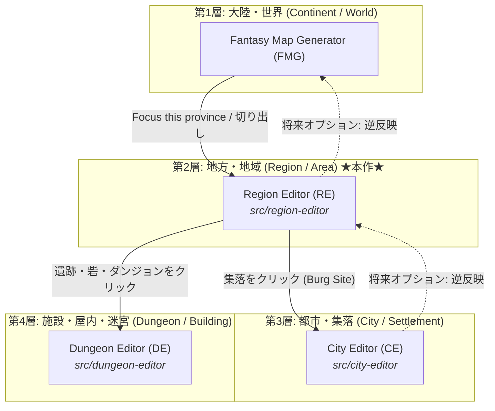
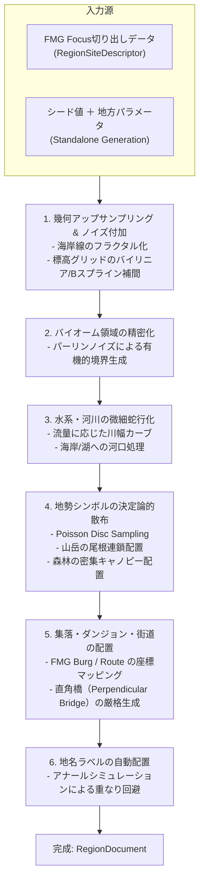
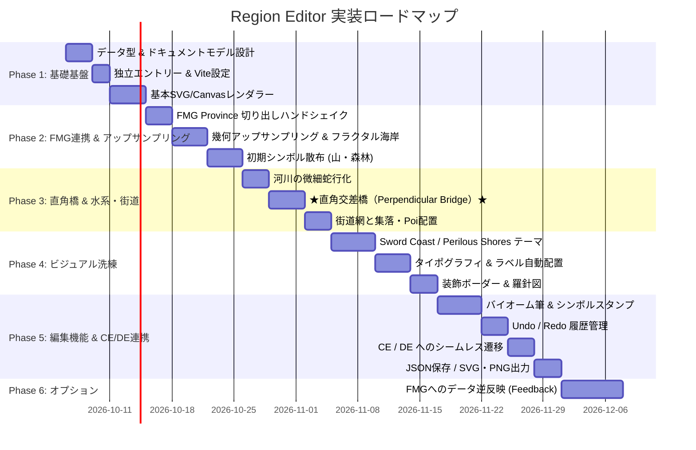

# Region Editor (RE) — 地方・地域地図の生成と編集

- 状態: Phase 1〜5（基礎基盤・FMG連携・直角橋・Schley/Perilous描画・編集ツール群・CE/DE連携）実装完了
- 更新日: 2026-10-05
- 配置先: `src/region-editor/`
- ドキュメント: `docs/plan/region-editor.md`
- 関連:
  - FMG Focus View: `src/controllers/focus-view.ts`
  - City Editor (CE): [src/city-editor](../../src/city-editor/README.md), [docs/plan/city-editor](../city-editor/)
  - Dungeon Editor (DE): [src/dungeon-editor](../../src/dungeon-editor/README.md), [docs/plan/dungeon-editor.md](dungeon-editor.md)
  - 橋梁交差原則: [AGENTS.md](../../AGENTS.md), [docs/plan/fmg-settlements-and-perpendicular-crossings.md](fmg-settlements-and-perpendicular-crossings.md)

---

## 1. 概要と目的

### 1.1 背景
現在、Fantasy Map Generator (FMG) には州（Province）や国家（State）の表示範囲を絞り込む **"Focus this province"**（`enterFocus`）機能が存在する。しかし、これは単に世界地図のセル描画を対象領域に限定してカメラをズームするだけの「表示上のマスキング」であり、セルの解像度や表現様式は世界・大陸地図の粗いボロノイ多角形のままである。

一方、TRPGのセッションやファンタジー世界の執筆においては、大陸全体（マクロ）と個別の都市（ミクロ）の間に、**「冒険の主舞台となる地方・地域（メゾ）」**の地図が不可欠である。
具体的には：
- **D&D 5e の Sword Coast（ソード・コースト）地図**（マイク・シュレイ氏の筆による名作地図）のように、個々の山岳の峰、鬱蒼とした森林群、蛇行する清流、点在する砦や遺跡、主要街道が手描きタッチで美しく描かれた地方地図。
- **Watabou 氏の Perilous Shores（危殆の岸辺）**のように、中規模な沿岸・内陸地域を有機的な領域分割、バイオーム質感、特徴的な集落シンボル、危険な冒険地点（Poi）とともに自動生成・編集できる地図。

本機能 **Region Editor (RE)** は、FMG（大陸・世界）と CE（都市）の中間に位置する、**地方・地域・エリア規模の地図を専門に生成・編集・出力する独立エディタ**である。

### 1.2 4層マルチスケール・エコシステム
本プロジェクトは、TRPG・創作におけるあらゆる縮尺をシームレスに網羅する「4層マルチスケール地図統合環境」を確立する。



| 階層 | エディタ | 主な管轄スケール | 描画要素 | 参照先・関連 |
| :--- | :--- | :--- | :--- | :--- |
| **L1** | **FMG** | 大陸・惑星・全国家（数千〜数万 km） | ボロノイセル、大陸気候、国家領域、交易網 | `src/app.ts` |
| **L2** | **RE** (新規) | **地方・地域・エリア（数十〜数百 km）** | **個別山岳、森林群、蛇行河川、街道、直角橋、地方集落、ダンジョン入口** | `src/region-editor` |
| **L3** | **CE** | 都市・町・村・城塞（数百 m 〜 数 km） | 街路網、街区、城壁、家屋、広場、直角橋 | `src/city-editor` |
| **L4** | **DE** | 屋内・隊商宿・迷宮（数十〜数百 m） | 部屋、通路、中庭、壁、扉、家具、防衛開口 | `src/dungeon-editor` |

---

## 2. 命名の検討と選定

ユーザー要望：
> *-editor のような city-editor, dungeon-editor と同様の命名にしたい。
> province というよりは地域・地方・エリアのような命名が良いので、適切な名前も考えて下さい。

### 2.1 命名候補の比較検証

| 候補 | 略称 | 評価 | 検討理由・ニュアンス |
| :--- | :---: | :---: | :--- |
| **`region-editor`** | **RE** | **最有力（推奨）** | **英語圏の地図制作・TRPGにおいて「地方地図」は一貫して "Regional Map" と呼ばれる。Watabou の Perilous Shores もジャンル名は "Region generator"。`city-editor`, `dungeon-editor` との語感の統一性、響き、明快さすべてにおいて最適。** |
| `realm-editor` | RE | 次点 | ファンタジー感（Forgotten Realms 等）はあるが、Realm は「領国・王国（State）」という政治的統治領域のニュアンスが強く、山野・未開地・フロンティアを含む自然地理の表現としてはやや政治寄り。 |
| `area-editor` | AE | △ | 「エリア」は汎用性が高すぎる。都市内のエリアやダンジョン内のエリア、ゲームのゾーンと混同されやすく、地図のスケール感が伝わりにくい。 |
| `province-editor` | PE | × | ユーザー要件にて「province というよりは地域・地方・エリア」と明示除外の意向。また行政区画に束縛されてしまう。 |
| `territory-editor` | TE | △ | 縄張り・領土という軍事・領有の意味合いが強くなる。 |
| `domain-editor` | DE | × | DE はすでに `dungeon-editor` の略称として定着しており、プロジェクト内で衝突する。 |
| `wilderness-editor` | WE | × | 荒野・野外に偏り、都市や街道、港湾を含む地域全体の包括的エディタとして適さない。 |

### 2.2 決定
**名称: `Region Editor`**  
**略称: `RE`**  
**ディレクトリ: `src/region-editor`**  
**ドキュメント: `docs/plan/region-editor.md`**  
**データ形式識別子: `fmg-region-editor`**

---

## 3. アートスタイルとビジュアル要件

本エディタの目標とする視覚的表現は、以下の2つの著名な作品の特徴を巧みに融合させた「高品質なクラフト感のあるファンタジー地域地図」である。

### 3.1 参照 1: D&D Sword Coast 地図（マイク・シュレイ様式）
- **地形シンボル**:
  - **山脈**: 一枚のベタ塗り等高線ではなく、個々の峰（Peak）が立体的な陰影（左上からの光源、右下のシャドウハッチング）を伴って連なり、尾根を形成するアイソメトリック風シンボル。雪線より上は白い雪冠。
  - **丘陵**: 山脈の周囲になだらかな半円形の小丘シンボルが散布され、平地へと緩やかに移行。
  - **森林**: 単なる緑の領域ポリゴンではなく、小さな丸い樹木（広葉樹）や三角形のトウヒ（針葉樹）が密集して林冠（キャノピー）を形成し、外周部に手描き風のテクスチャ境界を持つ。
  - **湿地・沼沢**: 葦（アシ）の束、水たまり、ぬかるみの水平ハッチングシンボル。
- **海岸・水系**:
  - 複雑なフラクタル海岸線、砂浜・崖（クリフの崖線）、暗礁・小島。
  - 海岸線から外側へ広がる段階的な等深線または波紋（リプル）のペン画ハッチング。
  - 上流の細い支流から下流へ行くにつれて有機的に太くなるベクターリバー。
- **都市・拠点シンボル**:
  - 城壁、塔、尖塔、大聖堂などを精緻にデフォルメしたシンボル（規模に応じて大都市・城塞・町・村・港に分類）。
- **タイポグラフィと装飾**:
  - 風格あるファンタジーセリフフォント（Cinzel, IM Fell English, MedievalSharp 等）。
  - 地域名（湾曲配置）、自然地形名（イタリック）、都市名（明朝・ローマン太字）。
  - 四隅の装飾枠（ボーダー）、精緻なコンパスローズ（羅針図）、距離スケールバー（Miles / Leagues / km）。
  - 羊皮紙（パーチメント）の古びた紙のテクスチャ・ビネット効果。

### 3.2 参照 2: Watabou: Perilous Shores 様式
- **構造化された領域（Cells / Regions）**:
  - 有機的な多角形メッシュにより、各小地域（Valley, Wood, Marsh, Shore）が明確な個性を保つ。
  - 海岸と島嶼の有機的かつゲーム的な適正スケール感。
- **白黒・木版画 / 限定色パレット**:
  - 線の強弱とハッチングによるミニマルかつ美しい表現。
  - 「クラシックペン画（モノクロ）」「ヴィンテージカラー（淡い水彩染め）」「パーチメント」のテーマ切り替え。
- **PoI (Points of Interest) の密度感**:
  - ダンジョン、遺跡、廃墟の塔、怪物の棲み処、聖地などが魅力的なアイコンと短いフレーバー名で配置される。

---

## 4. 厳格な設計原則 (User Rules & Constraints)

### 4.1 河川と橋の直交交差原則（最優先規約）
プロジェクト規約（`AGENTS.md`）において以下が絶対原則として定められている：
> **FMGとCEにおいて、河川を通過する橋は河川の進行方向と直角に交差させ、最短距離で通過させる。直角に交差しない橋は絶対に描いてはならない。**

本エディタ（RE）においてもこの原則を完全に遵守する。
1. **交差検出**: 街道（Road）が河川（River）の流路ポリラインと交差する点を幾何学的に検出する。
2. **法線ベクトルの算出**: 交差地点における河川の局所接線ベクトル $\vec{T}$ を求め、その法線ベクトル $\vec{N}$（河川に対して90度直角な方向）を算出する。
3. **最短直角セグメントの挿入**: 街道が斜めに河川に進入する場合でも、橋梁部分（Bridge Segment）は河川の両岸の間を法線 $\vec{N}$ に沿って最短距離・直角（90° $\pm 0.01^\circ$）で横断させる。
4. **アプローチ道路の接続**: 両岸の橋頭保から本来の街道へと滑らかなベジェ曲線またはフィレットで進入路（Approach Road）を接続する。

```
       河川の流れ ↓
 ~~~~~~~~~~~~~~~~~~~~~~~~~
           |  (左岸)
      +----+----+
======|  [ 橋 ] |======   ← 河川に対して厳格に直角（90度）
      +----+----+
           |  (右岸)
 ~~~~~~~~~~~~~~~~~~~~~~~~~
```

---

## 5. データモデル設計 (`RegionDocument`)

Region Editor が扱う正本データモデル。FMG や CE の内部クラスに依存しない純粋な TypeScript インターフェースとして定義する。

```typescript
export const REGION_DOCUMENT_FORMAT = "fmg-region-editor";
export const REGION_DOCUMENT_VERSION = 1;

export interface RegionDocument {
  format: typeof REGION_DOCUMENT_FORMAT;
  version: typeof REGION_DOCUMENT_VERSION;
  id: string;
  title: string;
  seed: string;
  
  /** 地図の物理寸法とスケール */
  bounds: {
    widthMeters: number;       // 例: 150,000 (150km)
    heightMeters: number;      // 例: 100,000 (100km)
    metersPerUnit: number;     // 描画座標 1 unit あたりのメートル
  };

  /** 起源情報（FMGからインポートされた場合の追跡データ） */
  source?: {
    fmgMapSeed: string;
    provinceId?: number;
    provinceName?: string;
    stateId?: number;
    stateName?: string;
    fmgBBox: [number, number, number, number]; // [minX, minY, maxX, maxY] in FMG coords
  };

  /** 地形・基底層 */
  terrain: {
    coastlinePolygons: Array<Array<[number, number]>>; // 海岸線外輪郭
    lakePolygons: Array<Array<[number, number]>>;      // 内陸湖輪郭
    heightfield?: {                                    // 標高グリッド（陰影起伏・等高線用）
      cols: number;
      rows: number;
      minElevationMeters: number;
      maxElevationMeters: number;
      elevationsMeters: number[];
    };
    contours?: Array<{                                 // 生成・保持される等高線データ
      id: string;
      elevationMeters: number;
      points: Array<[number, number]>;
      isIndex?: boolean;                               // 主等高線（太線）
      isClosed?: boolean;                              // 孤立峰・閉曲線
    }>;
    contourIntervalMeters?: number;                    // 等高線間隔 (m)
    showContours?: boolean;                            // 等高線レイヤー表示フラグ
  };

  /** バイオーム領域（面情報） */
  biomes: RegionBiomeArea[];

  /** 個別配置された地勢シンボル（山、木、丘、湿地など） */
  symbols: RegionSymbol[];

  /** 水系（河川・水路） */
  rivers: RegionRiver[];

  /** 橋梁（河川と直角交差する構造物） */
  bridges: RegionBridge[];

  /** 交通網（街道、航路） */
  routes: RegionRoute[];

  /** 拠点・都市・集落 */
  settlements: RegionSettlement[];

  /** 冒険地点・遺跡・ランドマーク (Poi) */
  landmarks: RegionLandmark[];

  /** 地名・注記テキスト */
  labels: RegionLabel[];

  /** 地図装飾設定 */
  decoration: {
    theme: "schley" | "perilous" | "parchment" | "monochrome";
    showCompassRose: boolean;
    compassPosition: [number, number];
    showScaleBar: boolean;
    scaleBarPosition: [number, number];
    showBorder: boolean;
    borderStyle: "ornate" | "simple" | "none";
  };
}

export type BiomeKind =
  | "ocean"
  | "grassland"
  | "deciduous_forest"
  | "coniferous_forest"
  | "tropical_forest"
  | "savanna"
  | "hills"
  | "mountains"
  | "snow_mountains"
  | "glacier"
  | "swamp"
  | "marsh"
  | "desert"
  | "tundra"
  | "badlands";

export interface RegionBiomeArea {
  id: string;
  kind: BiomeKind;
  polygon: Array<[number, number]>;
  color?: string;     // CE互換の地表・セル塗りつぶし色オーバーライド
  isWater?: boolean;  // 海洋・水域フラグ
}

export type SymbolType =
  | "mountain_peak_major"
  | "mountain_peak_minor"
  | "mountain_snow"
  | "hill_single"
  | "hill_cluster"
  | "tree_deciduous"
  | "tree_pine"
  | "tree_jungle"
  | "tree_dead"
  | "swamp_grass"
  | "marsh_reed"
  | "sand_dune";

export interface RegionSymbol {
  id: string;
  type: SymbolType;
  x: number;
  y: number;
  scale: number;
  rotationDeg: number;
  elevationMeters?: number;
  locked?: boolean;
}

export interface RegionRiver {
  id: string;
  name: string;
  points: Array<[number, number]>; // 蛇行ポリライン
  widths: number[];                // 各点の川幅（メートル）
  dischargeM3s: number;            // 流量
}

export interface RegionBridge {
  id: string;
  riverId: string;
  routeId: string;
  center: [number, number];
  lengthMeters: number;
  widthMeters: number;
  angleDeg: number;                // 河川接線に対して厳格に +90° または -90°
  style: "stone_arch" | "wooden" | "suspension";
}

export interface RegionRoute {
  id: string;
  kind: "highway" | "road" | "trail" | "sea_lane";
  points: Array<[number, number]>;
  name?: string;
}

export interface RegionSettlement {
  id: string;
  burgId?: number;                 // FMG burg.i との対応（存在する場合）
  name: string;
  position: [number, number];
  type: "metropolis" | "city" | "town" | "village" | "castle" | "port";
  population?: number;
  isCapital?: boolean;
  hasWalls?: boolean;
  hasCitadel?: boolean;
  hasPort?: boolean;
  /** CE (City Editor) 用のシード・設定 */
  cityEditorSeed?: string;
}

export interface RegionLandmark {
  id: string;
  dungeonId?: number;              // FMG dungeon / lair との対応
  name: string;
  position: [number, number];
  kind: "ruins" | "dungeon" | "tower" | "tomb" | "mine" | "cave" | "shrine" | "monolith";
  dangerLevel?: number;
  /** DE (Dungeon Editor) 用のシード・プリセット */
  dungeonPreset?: "caravanserai" | "room-corridor";
}

export interface RegionLabel {
  id: string;
  text: string;
  position: [number, number];
  category: "region" | "natural" | "settlement" | "water" | "landmark";
  fontSizePt: number;
  fontStyle: "serif" | "italic" | "gothic" | "uncial";
  curvaturePoints?: Array<[number, number]>; // 湾曲配置用パス
}
```

---

## 6. 生成パイプライン (Generation Pipeline)

Region Editor は、以下の2系統の生成パイプラインをサポートする。
1. **FMG インポート生成（Province / Area Focus）**: FMGの世界データから指定範囲を抽出し、高精細にアップサンプリングして意匠化する。
2. **スタンドアロン生成**: シード値と設定パラメータ（海洋率、山岳率、湿潤度等）からゼロベースで地方地図を生成する。



### 6.1 FMG からの切り出しと高解像度化（アップサンプリング）
1. **バウンディングボックスの決定**:
   - `Focus this province` 実行時、対象州（Province）を構成する全セルの凸包または外接矩形を求め、周囲に適切なマージン（例: 15%）を付加した範囲を切り出し矩形とする。
2. **海岸線と水域のフラクタル補間**:
   - FMGの粗いボロノイ境界をそのまま拡大するとカクカクした直線になるため、中点変位法（Midpoint Displacement）や Simplex Noise による摂動を加え、自然なリアリズムを持つ海岸線へ変換する。
3. **シンボル散布アルゴリズム (Poisson Disc Sampling)**:
   - 森林領域（`deciduous_forest`, `coniferous_forest` 等）には、樹木シンボル同士が適度な間隔（例: 200m〜400m）を保ちながら自然に密集するよう Poisson Disc Sampling を適用する。
   - 山岳領域（`mountains`, `snow_mountains`）には、標高の尾根線（Ridge lines）を抽出し、尾根に沿って大型の主峰（`mountain_peak_major`）を並べ、その周囲になだらかな小峰（`minor`）や丘陵（`hill`）を配置する。
   - 描画順（Z-Index）は「Y座標（北から南）」でソートすることで、手前の山が奥の山を自然に隠蔽するアイソメトリックな陰影効果を実現する。

---

## 7. エディタ機能とツールセット

エディタは、自動生成された地図をユーザーが直感的に修正・描き込みできる完全なオーサリング環境を提供する。

### 7.1 ツールパレット

```
+-----------------------------------------------------------------------------------+
|  [選択] [バイオーム筆] [シンボル配置] [河川] [街道] [集落/Poi] [注記] | [Undo] [Redo] |
+-----------------------------------------------------------------------------------+
```

1. **選択・移動ツール (Select & Transform)**:
   - シンボル、集落、ダンジョン、ラベルをクリックして選択。
   - ドラッグ移動、回転、拡大縮小、Deleteキーによる削除。
2. **バイオーム筆（Biome Brush）**:
   - ブラシサイズ（Small / Medium / Large）とバイオーム種別を選択。
   - キャンバス上をドラッグして森林・山岳・湿地・平原を塗り足す／消しゴムで削る。
   - 塗られた領域に応じて、内部のシンボル（樹木や山）が動的に再散布される。
3. **シンボルスタンプ（Symbol Stamp）**:
   - パレットから特定の山アイコン、樹木、砦アイコンを選択し、クリックで自由配置。
4. **河川ツール（River Tool）**:
   - クリック＆ドラッグで新しい支流を描画、または既存の川の流路アンカーポイントを編集。
   - 川幅スライダーで流路の太さを調整。
5. **街道＆直角橋ツール（Road & Bridge Tool）**:
   - 街道をベジェ曲線で敷設。
   - 河川を横切ると、**自動的に河川と直角に交差する橋（Perpendicular Bridge）**が挿入される。直角以外の斜め交差はシステムが拒否し、直角ブリッジジオメトリへ強制修正される。
6. **集落・ダンジョンツール (Settlement & Dungeon)**:
   - クリックした場所に新しい町やダンジョンを配置。
   - 名前、規模、種別、CE/DE連携用シードを設定。
7. **ラベルツール (Typography Tool)**:
   - 地名テキストの追加・編集。
   - フォント、サイズ、カーブ（パスに沿った湾曲配置）の指定。
8. **スタイル＆テーマ切り替え (Style Panel)**:
   - `Schley Style`（水彩・鮮やか・立体シンボル）
   - `Perilous Shores Style`（ペン画・木版風ハッチング）
   - `Antique Parchment`（古文書・セピア調）
   - `Modern Vector`（すっきりした現代風ライン）

---

## 8. 他エディタとの連携アーキテクチャ (Inter-Editor Integration)

### 8.1 FMG → Region Editor (RE) のハンドオフ
FMG の `src/ui/dialogs/ProvinceEditorDialog.tsx` および `src/controllers/focus-view.ts` に新規ボタンを配置。

```tsx
// ProvinceEditorDialog のフッターに追加
<button
  type="button"
  className="icon-map"
  data-tip="Open and edit this region in Region Editor (RE)"
  onClick={() => openRegionEditor(provinceId)}
>
  Open in Region Editor
</button>
```

データ引き渡し方式は、既存の `city-editor` と同様に `sessionStorage` を採用する：
```typescript
// src/controllers/region-editor-handshake.ts
export function openRegionEditor(provinceId: number): void {
  const descriptor = buildRegionSiteDescriptor(provinceId);
  if (!descriptor) {
    tip("Cannot build region descriptor", false, "error");
    return;
  }
  sessionStorage.setItem("fmg.regionSite", JSON.stringify(descriptor));
  openURL(`${import.meta.env.BASE_URL}region-editor/`);
}
```

#### 8.1.1 標高データと等高線生成（境界周辺セルの収集と乖離防止）
FMG と RE の間での地形・等高線の整合性を担保するため、以下のアーキテクチャで標高データの引き渡しと等高線生成を行う：

1. **標高パラメータの算出と伝達**:
   - FMG 標準の標高変換関数 `heightToMeters`（`heightExponent` オプション考慮）により、各セルのパック高度 $h$（0〜100）をメートル単位の標高（$h \ge 20$ で陸地標高、$h < 20$ で水深/0m）に換算。
   - `RegionSiteCell` として `point`, `elevationMeters`, `height`, `inProvince`（州所属フラグ）を格納。
2. **境界周辺セル（Surrounding Cells）の収集と適応マージン**:
   - 州の境界を跨ぐ標高差が大きい場合（山脈、海岸崖、峡谷など）、州内部のセルのみを渡すと外挿補間が破綻し、FMG と RE で地形に大きな乖離が生じる。
   - そのため、対象州のセルと外周セルの標高差 `maxBorderRelief` を算出し、起伏が大きい場合は表示マージン（15% → 25%以上）およびサンプリングバッファを動的に拡張。
   - 表示矩形内の全セルに加え、1次トポロジカル隣接セル（`cells.c`）まで収集して渡すことで、境界部でも滑らかで正確な標高勾配を維持する。
3. **RE での Heightfield 補間と Marching Squares 等高線生成**:
   - RE 側では、渡されたセル標高から空間インデックス（グリッドバケット）を用いた逆距離加重法（IDW）により規則的な標高グリッド `Heightfield` を生成。
   - Marching Squares アルゴリズムにより、標高範囲に応じた等高線ポリライン（`RegionContourLine`）を自動抽出。主等高線（Index contour: 太線）および閉曲線判定を行い、ラプラシアンスムージングによってクラフト感のある手描き風等高線として描画・保持する。
   - ドキュメントデータモデル（`doc.terrain.contours`, `doc.terrain.heightfield`）として完全保持され、JSON 保存・読込、SVG 出力、UI での表示切替・間隔変更に対応。

#### 8.1.2 CE 準拠の海セル色・バイオーム風景連携（Landscapes & Sea Faces）
FMG・CE・RE 間での統一的な世界観と視覚体験を実現するため、City Editor（CE）の海色およびバイオーム風景（色彩と植生・地勢シンボル）を RE に完全連動させる：

1. **CE 準拠の海セル（Sea Faces / Water）**:
   - CE の海の色（`.ce-svg--town .ce-face--sea { fill: #456d7f; }`）および湖の色（`#527f8b`）を採用。
   - FMG から渡された海洋・水域セル（`isWater` または標高 $< 20$ または `Marine`）は、RE 上でも正確な Voronoi 多角形メッシュとして `#456d7f` で彩色され、`ce-face--sea` クラスが付与される。水域セル上には陸地シンボル（樹木・山岳等）は散布されない。
2. **陸地セルのバイオーム風景（Landscape Themes & Palettes）**:
   - CE の `resolveLandscapeTheme` と完全互換のカラーパレット（`CE_BIOME_PALETTE`）を適用：
     - 草原 (Grassland): `#d2dab2`
     - 落葉樹林 (Deciduous Forest): `#c2d4ac`
     - 針葉樹林 / タイガ (Coniferous Forest / Taiga): `#b5c4a7`
     - 熱帯林 / ジャングル (Tropical Rainforest): `#b9cca0`
     - サバナ (Savanna): `#ded8aa`
     - 砂漠 (Desert): `#e8ddba`
     - 湿原 (Swamp / Marsh): `#b4c5a5` / `#adbe9e`
     - ツンドラ (Tundra): `#c9beaa`
     - 氷河 / 雪山 (Glacier / Snow Mountains): `#d8e5e8`
     - 丘陵 / 山岳 (Hills / Mountains): `#cfcaa8` / `#b5a897`
3. **バイオーム準拠の植生・地勢シンボル散布**:
   - 各セルのバイオームと標高に応じて、CE 同等のシンボル（アカシア、サボテン、ヤシ、針葉樹、広葉樹、湿原草、砂丘、岩礁群、草むら等）を散布。
   - 北から南へ（Y座標昇順）の Z-sort により、手前と奥のシンボルが自然に重なり合う美しい立体パースペクティブを表現。

#### 8.1.3 都市種類（burgs-generator.ts準拠）SVGアイコン表示
従来の単純な幾何学マーカー（赤い丸や四角形）を排し、FMG の都市生成ロジック（`src/generators/burgs-generator.ts` の `getDefaultGroups()`）で定義される都市種別グループに完全連動した精緻なファンタジー地図風 SVG アイコンを表示：

1. **都市種類別の造形定義（全9種）**:
   - **`capital` (首都)**: 威厳ある王都。中央主キープ、二重塔、翻る旗印、城門アーチ、銃眼。
   - **`city` (大都市)**: 堅牢な市壁、鐘楼/時計塔、密集した切妻屋根の町並み、市門。
   - **`town` (町)**: 連なる三角屋根の建物群、中央見張り望楼、煙突。
   - **`village` (村)**: のどかな農村の切妻屋根民家2棟、煙突と立ち上る煙。
   - **`hamlet` (集落・小村)**: 1軒の素朴な小屋と小さな納屋。
   - **`fort` (砦・城塞)**: 重厚な角型石造キープ、銃眼付き胸壁（バートルマン）、矢狭間スリット、落とし格子門。
   - **`monastery` (修道院・寺院)**: 聖堂ファサード、十字架/聖なる星、バラ窓（丸窓）、アーチ扉、側廊。
   - **`caravanserai` (隊商宿)**: 方形要塞風囲壁、四隅の丸塔、馬蹄形アーチ大門、クーポラ（ドーム屋根）。
   - **`trading_post` (交易拠点)**: 木骨造り倉庫、荷揚げ滑車梁、積み荷の木箱、大扉。
2. **属性との連動**:
   - **港フラグ (`hasPort: true`)**: アイコンの右下に繊細な錨（アンカー）シンボルを自動付加。
   - **テーマカラー連動**: テーマの `settlementFill`（屋根・主色）と `settlementStroke`（輪郭・窓・扉）、`mountainHighlight`（壁面）によって描画され、カラー（Schley等）でもモノクロでも洗練された視覚美を維持。

### 8.2 Region Editor (RE) → City Editor (CE) のハンドオフ
RE 上の集落シンボル（Settlement）をクリックし、プロパティパネル内の **「City Editor (CE) で開く」** ボタンをクリック。
- RE の集落座標、周囲の地形、水域アクセス（川・海）、街道の進入角を計算し、`BurgSiteDescriptor` を生成。
- `sessionStorage.setItem("fmg.citySite", JSON.stringify(burgDescriptor))` を書き込み、別タブで `city-editor/` を起動。

### 8.3 Region Editor (RE) → Dungeon Editor (DE) のハンドオフ
RE 上のダンジョン・遺跡シンボル（Landmark）をクリックし、プロパティパネル内の **「Dungeon Editor (DE) で開く」** ボタンをクリック。
- ダンジョンの種別（砦、隊商宿、地下迷宮、墓所）に応じたプリセット（`caravanserai` / `room-corridor` 等）とシード値を渡し、`dungeon-editor/` を起動。

---

## 9. 将来構想: FMGへのフィードバック（オプション目標）

ユーザー要望：
> この機能で編集したデータはFMGにフィードバックし、例えば森を描いたら森をFMGの地図に反映出来るようにしたい。これはオプション的な目標の一つであり、実装の初期段階では必要ない。

### 9.1 アーキテクチャ上の考慮（初期設計への織り込み）
初期実装ではFMGへの書き戻しは行わないが、将来の拡張を円滑にするため、以下のマッピング関係を `RegionDocument` に保持する。

1. **セル逆引きインデックスの保持**:
   - RE の各ピクセル/グリッド座標 $(x, y)$ が、FMGのどのボロノイセル `cellId` に対応するかを逆変換可能なアフィン変換行列とセルIDマップを記録しておく。
2. **変更差分ログ (Delta Log)**:
   - RE 上でバイオームを塗った場合、影響を受けたFMGセルを特定し、`modifiedCells: Map<number, { biome?: number }>` のような差分データを内部で蓄積できる構造にする。
3. **フィードバックの適用契機**:
   - 将来的に RE のメニューに「Apply Changes to FMG World Map」ボタンを設置。
   - FMG 側の `worldContext.pack.cells.biome[cellId]`、新設された集落 `pack.burgs`、新規河川をFMG本体のデータストアへマージするトランザクション処理を後続フェーズで実装可能にする。

---

## 10. プロジェクト構成とファイル配置

```text
Fantasy-Map-Generator/
├── src/
│   ├── app.ts                         // FMG メイン
│   ├── city-editor/                   // CE (都市エディタ)
│   ├── dungeon-editor/                // DE (ダンジョンエディタ)
│   ├── region-editor/                 // ★ RE (地方・地域エディタ) ★
│   │   ├── index.html                 // 独立ページエントリー
│   │   ├── main.ts                    // エントリポイント
│   │   ├── core/
│   │   │   ├── types.ts               // RegionDocument, Symbol, River, Bridge 型定義
│   │   │   ├── document.ts            // 文書作成・読込・バリデーション
│   │   │   ├── geometry.ts            // フラクタル曲線、法線計算、直角幾何
│   │   │   ├── elevation.ts           // 標高グリッド・陰影起伏計算
│   │   │   ├── commands.ts            // 編集コマンド（Undo/Redo 対象）
│   │   │   ├── history.ts             // Undo / Redo スタック
│   │   │   └── gen/
│   │   │       ├── prng.ts            // シード付き乱数
│   │   │       ├── pipeline.ts        // 生成パイプライン統括
│   │   │       ├── upsampler.ts       // FMG粗メッシュの高精細化
│   │   │       ├── poissonScatter.ts  // 樹木・山岳シンボルの均等散布
│   │   │       ├── rivers.ts          // 蛇行河川・支流生成
│   │   │       ├── perpendicularBridges.ts // ★河川直角交差橋の幾何生成★
│   │   │       ├── routes.ts          // 街道・航路生成
│   │   │       └── labelPlacement.ts  // アナールシミュレーションによる注記配置
│   │   ├── render/
│   │   │   ├── svg.ts                 // SVG レンダラー（手描き風）
│   │   │   ├── canvas.ts              // 高速プレビュー/陰影ラスタライザ
│   │   │   └── styles/
│   │   │       ├── symbols.ts         // 山・木・砦のSVGシンボル定義集
│   │   │       ├── schleyTheme.ts     // Mike Schley 風パレット・設定
│   │   │       └── perilousTheme.ts   // Watabou Perilous Shores 風ペン画設定
│   │   ├── io/
│   │   │   ├── regionEditorFile.ts    // JSON 保存・読込
│   │   │   ├── incomingRegion.ts      // sessionStorage からのFMGデータ受取
│   │   │   ├── exportSvg.ts           // SVG エクスポート
│   │   │   ├── exportPng.ts           // 高解像度 PNG エクスポート
│   │   │   └── exportToCeDe.ts        // CE / DE へのハンドオフ生成
│   │   └── ui/
│   │       ├── RegionEditorPage.tsx   // メイン UI 画面
│   │       ├── Toolbar.tsx            // ツール選択バー
│   │       ├── PropertyPanel.tsx      // 選択要素の属性パネル
│   │       ├── LayersPanel.tsx        // レイヤー表示・非表示
│   │       └── region-editor.css      // スタイルシート
│   └── controllers/
│       └── region-editor-handshake.ts // FMG 側からの切り出し・起動処理
├── docs/
│   └── plan/
│       └── region-editor.md           // 本ドキュメント
└── vite.config.ts                     // input に regionEditor を追加
```

---

## 11. 段階的実装ロードマップ (Phased Implementation Roadmap)



### Phase 1: 基礎基盤と独立ページの立ち上げ
- `src/region-editor/core/types.ts` にデータモデルを定義。
- `vite.config.ts` に `regionEditor: path.resolve(__dirname, 'src/region-editor/index.html')` を追加。
- スタンドアロンで起動可能な最小限のキャンバス描画画面を構築。
- シード値によるシンプルなテスト矩形・ポリゴンの描画。

### Phase 2: FMG連携インポート & アップサンプリング
- `src/controllers/region-editor-handshake.ts` を実装し、FMGの ProvinceEditorDialog から指定州のデータを `sessionStorage` に書き込んで RE を開く連携を構築。
- FMGの粗いボロノイセルから、海岸線・湖・標高・バイオームを高精細グリッドへ補間・フラクタル変位させるアップサンプラーを実装。
- Poisson Disc Sampling による山岳・樹木の自動配置アルゴリズムを構築。

### Phase 3: 水系・街道と直角橋の厳格実装
- 河川の流路補間と流量に応じた川幅カーブの生成。
- **プロジェクト規約遵守**: 街道と河川の交差点に、河川接線と厳格に90度直角を成す最短距離の橋梁ジオメトリを生成する `perpendicularBridges.ts` を実装。
- 範囲内の Burg（都市・町・村）およびダンジョンを地方地図シンボルとしてマッピング。

### Phase 4: スタイル洗練（Sword Coast & Perilous Shores）
- マイク・シュレイ風の立体感ある山岳シンボル群、樹木群、羊皮紙テクスチャの実装。
- Watabou Perilous Shores 風のモノクロ・ペン画テーマの実装。
- 衝突回避（重なり防止）機能を備えた地名ラベル・フォント描画。
- 羅針図（コンパスローズ）、距離スケールバー、装飾外枠のレンダリング。

### Phase 5: インタラクティブ編集機能と CE / DE 連携
- バイオームペイント（筆ツール）、シンボル配置スタンプ、河川・街道のベクター編集ツールを実装。
- Undo / Redo（トランザクションコマンドパターン）の実装。
- 集落をクリックして `city-editor` を開く連携、ダンジョンをクリックして `dungeon-editor` を開く連携の実装。
- 編集データの JSON 保存・読込、高解像度 SVG / PNG エクスポート機能。

### Phase 6 (オプション): FMGへのデータ逆反映
- RE で編集したバイオーム（追加した森や山）および新規集落・河川流路を、FMG側のボロノイセル配列および pack データへ再サンプリングして反映するコンバータを開発。

---

## 12. テスト・検証戦略

1. **直角橋の幾何検証ユニットテスト (`perpendicularBridges.test.ts`)**:
   - あらゆる進入角度（0度〜360度）の道路と任意の曲率を持つ河川との交差において、生成された橋の角度が河川接線と $90^\circ \pm 0.01^\circ$ であることを機械的に検証。
2. **決定論的再現性テスト (`pipeline.test.ts`)**:
   - 同一シード・同一パラメータから常に 100% 同一の `RegionDocument` が生成されることを検証。
3. **FMG連携・ハンドシェイクテスト (`incomingRegion.test.ts`)**:
   - 極端な形状の州（飛び地、極小の島、内陸山岳、海岸線のみ）の Province から安全に記述子が生成され、例外なく RE 側で展開できることを検証。
4. **UI操作・描画パフォーマンステスト**:
   - 数千個の樹木・山岳シンボルが存在する状態でも、60fps のパン・ズームおよび快適なブラシ描画レスポンスが維持されることを確認。
