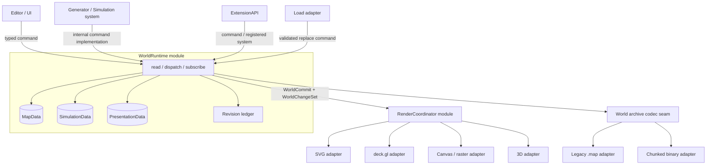
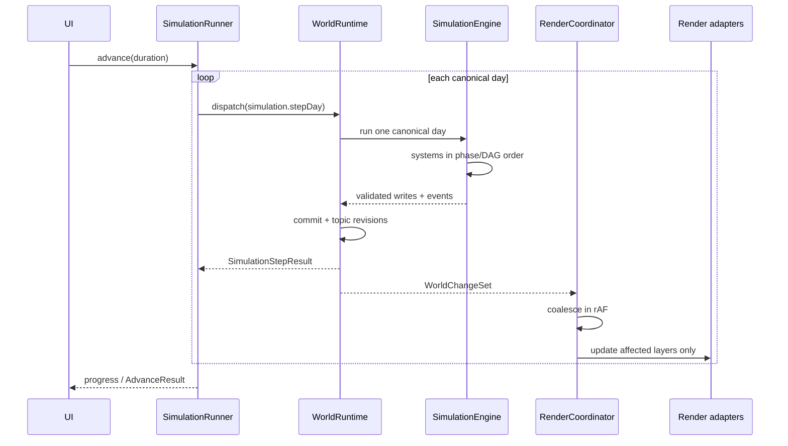

# 地図データ・シミュレーション・描画の統合設計

- **Status**: In progress（Phase 1、Phase 2 の position command／SVG・WebGL・viewMesh compatibility listener、Phase 3 の `PresentationData` command・legacy SVG import・WebGL style reader 移行、Phase 4 の `SimulationSystem` registry と legacy tick-hook compatibility、Phase 5 の `cells.assign`（state / province / culture / religion）、state remove / merge cascade、province / culture / religion deletion cascade、route create / remove / metadata / point edit、river metadata / geometry、lake / coastline feature metadata / vertex edit、extension command registration と Economy Goods / Markets Overview editor の writer 移行を実装済み。その他 extension writer、generate / load、simulation archive / slice は未移行）
- **Date**: 2026-07-17

**Related**:

| 文書 / 実装 | 関係 |
| :-- | :-- |
| `docs/webgl-renderer-migration-candidates.md` | 現行 SVG / deck.gl hybrid、cache、picking、export |
| `docs/debug/0717-test-suite-fixes-retrospective.md` | DOM、overlay、cache、テスト劣化から得た知見 |
| `docs/temp/plans/replace-svg.md` | SVG より適した内部表現の候補 |
| `docs/simulation/advance-time.md` | 現行 tick ordering と ExtensionAPI hook |
| `docs/plan/simulation-lab.md` | DOM 無し simulation core、snapshot、telemetry の将来像 |

---

## 0. 結論

SVG、WebGL、Canvas はいずれもデータ保存形式にしない。これらは同じ canonical data から必要時に作る描画結果とする。

採用する構造は次のとおり。

1. `WorldRuntime` module を唯一の書き込み interface にする。
2. canonical data を `MapData`、`SimulationData`、`PresentationData` に分ける。
3. 変更成功時に revision 付き `WorldChangeSet` を一度だけ発行する。
4. `RenderCoordinator` module が change set を購読し、SVG、WebGL、Canvas、3D adapter を更新する。
5. 新しい保存形式は versioned JSON + Typed Array binary chunks とし、SVG は含めない。
6. 現行の `pack` / `grid` は直ちに捨てない。最初は `WorldRuntime` の implementation として維持し、書き込み seam と revision を先に確立する。
7. CSR、normalized entity table、deck.gl binary attributes は、計測で効果がある領域から段階移行する。

ここでいう「統合」は、地図とシミュレーションを一つの巨大オブジェクトへ混ぜることではない。所有権を分離したまま、読み取り、変更、通知を一つの小さな interface に統一することを指す。

---

## 1. 現行実装の評価

`docs/temp/plans/replace-svg.md` の「SVG より Typed Array が内部表現に向く」という方向性は正しい。ただし、本リポジトリでは `pack.cells` / `grid.cells` の多くが既に Typed Array である。最大の問題は形式そのものより、変更の所有権と通知が存在しないことにある。

| 現状 | 問題 |
| :-- | :-- |
| Generator、Editor、Extension が `pack` / `grid` を直接変更 | 何が変わったかを Renderer が知れない |
| WebGL が `buildLayerSignatures()` で表示中データを走査して hash 化 | mutation 検出が描画時の `O(cells)` 処理になる |
| WebGL style が live SVG attributes を読む | SVG が描画結果と style source を兼ね、更新漏れが起きる |
| `advanceTime()` が simulation と Renderer 呼び出しを同時に行う | headless、WebGL、3D、テストが time engine に結合する |
| editor が非表示 SVG element を ID で再取得する | hybrid でも editor 用の shadow SVG を維持する必要がある |
| `.map` が SVG 全体と位置依存 slot 52 個を混載 | extension data、migration、DOM、描画が save/load に漏れる |
| load が decode 完了前に SVG DOM を置換 | 失敗時に現在の世界を原子的に保持できない |
| `SimulationContext` 以外にも module-local な生存中状態がある | 完全な simulation snapshot を保存できない |
| `pack.burgs[i].x/y` の直接変更が 3D cache に伝わらない | canonical write と derived cache invalidation の seam がない |

`WorldRuntime` を削除すると、validation、tick ordering、cache invalidation、保存整合性、通知が再び各 caller に現れる。この deletion test により、単なる pass-through ではなく、interface の小ささに対して高い leverage と locality を持つ deep module になる。

なお、調査時点の `src/context/viewContext.ts` は `defaultRenderMode = "svg"` であり、文書の「WebGL が既定」と一致していない。本設計は既定値に依存しないが、移行中の E2E は必ず render mode を明示する。

---

## 2. 目標と非目標

### 2.1 目標

- SVG / WebGL / Canvas / 3D / headless が同じ canonical state を読む。
- simulation は DOM、SVG、deck.gl、Zustand UI state を参照しない。
- 一つの domain 変更から、必要な描画 layer だけを invalidation する。
- map、simulation、extension state、RNG state を完全に round-trip する。
- legacy `.map` と SVG export を維持しながら段階移行できる。
- 100k cell 級でも zoom/pan や小さな edit が全データ走査を発生させない。
- renderer に関係なく同じ command 列が同じ world state を作る。

### 2.2 非目標

- SVG renderer を削除すること。
- 全データを Typed Array、ECS、GeoJSON、TopoJSON のいずれか一種類へ統一すること。
- SVG と WebGL の見た目を pixel 単位で完全一致させること。
- 初回実装から Worker、SharedArrayBuffer、部分 GPU upload をすべて導入すること。
- event sourcing を canonical state にすること。

---

## 3. Target architecture



既存の4層ルールとの対応は次のとおり。

| 既存層 | Target |
| :-- | :-- |
| State | `WorldRuntime` が `MapData` / `SimulationData` / `PresentationData` を所有 |
| Generator | command implementation と `SimulationSystem` が state を変更 |
| Renderer | `RenderCoordinator` と各 adapter。state は読み取り専用 |
| Editor | domain ID を含む command を dispatch。描画方法を知らない |

`ViewContext` は引き続き DOM / canvas handle、zoom、focus、viewport、`renderMode` を持つ。保存対象の style や layer visibility は持たない。

---

## 4. Canonical data の分割

### 4.1 `MapData`

地図の構造と、編集可能な現在の世界を保持する。低頻度変更だが immutable ではない。

```ts
interface MapData {
  readonly identity: {
    mapId: number;
    seed: string;
    graphWidth: number;
    graphHeight: number;
  };
  topology: MapTopology;
  physical: PhysicalMapFields;
  politics: PoliticalMapFields;
  settlements: SettlementDefinitions;
  networks: NetworkDefinitions;
  annotations: AnnotationData;
}
```

推奨する物理表現:

- 頂点座標: interleaved `Float64Array`。WebGL adapter で `Float32Array` へ downcast する。
- cell → vertex、cell → neighbor: `Uint32Array` の CSR（offsets + values）。100k cell を安全に扱う。
- 高度、biome ID、feature ID、state ID 等の dense column: 値域に応じた Typed Array。
- state、province、burg、river、route、feature 等の疎で可変長な record: stable ID を持つ domain-specific entity table。
- quadtree、triangulation、merged SVG path、GPU buffer: derived cache。保存しない。

`number[][]` をすべて即座に CSR へ変える必要はない。移行初期は現行 `pack` / `grid` を canonical implementation とし、CSR は derived cache から始める。

### 4.2 `SimulationData`

時間経過で高頻度に変わり、次の tick の結果を決める状態を保持する。

```ts
interface SimulationData {
  clock: SimulationClock;
  rng: SimulationRngState;
  cells: DynamicCellColumns;
  states: StateSimulationTable;
  burgs: BurgSimulationTable;
  military: MilitarySimulationTable;
  /** 登録済み extension が decode / migrate / validate 済みの runtime slice のみ。 */
  extensions: ReadonlyMap<string, ValidatedExtensionSlice>;
}
```

推奨する物理表現:

- population、capacity、age cohorts、danger 等の cell-indexed numeric data: Typed Array の structure-of-arrays。
- regiment、character、market、deal、queue、intelligence report 等: stable ID の typed entity table。
- Economy、Characters、Nobility、Shipbuilding 固有状態: `extension:<id>` namespace の versioned slice。
- rolling UI 集計: bounded ring buffer。
- 長期分析: optional telemetry / event log。canonical snapshot とは分離する。

人口や軍隊を `MapData` と `SimulationData` の両方へ複製しない。ある field の owner は一つだけとし、Renderer は必要に応じて両方を読む。例えば cell の国家所属は `MapData.politics`、人口 cohort は `SimulationData.cells`、軍隊位置は `SimulationData.military` が唯一の正となる。

`worldContext.options.year/month/day` と `SimulationContext` の時計のような mirror は、compatibility 期間後に廃止する。

### 4.3 `PresentationData`

描画される内容ではなく、描画規則を保持する plain data。

```ts
interface PresentationData {
  activeLayers: Readonly<Record<string, boolean>>;
  layerOrder: readonly string[];
  styles: Readonly<Record<string, LayerStyle>>;
  labels: Readonly<Record<string, LabelLayout>>;
  overlays: Readonly<Record<string, OverlayLayout>>;
}
```

含めるもの:

- fill、stroke、opacity、stroke width、dash、font、icon、halo。
- layer visibility と保存対象の順序。
- state label の baseline、手動位置、サイズ override。
- legend、scale bar、compass 等の保存対象 layout。

含めないもの:

- SVG element、D3 selection、deck.gl layer、Canvas、WebGL resource。
- hover、選択中 dialog、現在の viewport など session-only state。

SVG attributes は `PresentationData` の出力となる。WebGL が SVG を読む経路は最終的に削除する。

### 4.4 Extension slice

各 extension は次を登録する。

- `extensionId`
- `schemaVersion`
- default state
- `validate(unknown)`
- `migrate(fromVersion, unknown)`

runtime slice は JSON value と Typed Array からなる host-defined structured data に限定し、container への encode / decode、chunk path、checksum は `ChunkedWorldCodecAdapter` が所有する。extension が所有するのは schema、validation、migration であり、core archive 内の任意 path を書く codec hook は提供しない。extension 固有の独立した import / export 形式が必要なら、core archive とは別の adapter として登録する。

host の `save.ts` が Economy や Shipbuilding の field 名を知ってはならない。未インストール extension の chunk は validation 済み runtime slice に混ぜず、`WorldDocument.opaqueExtensionChunks` に次の envelope で保持する。

```ts
interface OpaqueExtensionChunk {
  readonly extensionId: string;
  readonly schemaVersion: number;
  readonly mediaType: string;
  readonly bytes: Uint8Array;
  readonly checksum: string;
  readonly coreReferences:
    | readonly {
        readonly kind: CoreEntityKind;
        readonly id: number;
        readonly onDelete: "restrict" | "orphan";
      }[]
    | "unknown";
}
```

この chunk は payload bytes を byte-for-byte で再保存する。host が理解できる `coreReferences` は payload 外の manifest で codec が検証する。opaque payload は cascade edit できないため、参照先削除時は `restrict` なら command を拒否し、`orphan` なら stable ID の tombstone を残して payload を変更しない。参照 manifest を持たない legacy chunk は `"unknown"` とし、その chunk を保持したまま core entity を削除 / merge する操作を拒否する。

load 後は `WorldRuntime` 内部の renderer 非公開 `OpaqueExtensionStore` が current world と同じ lifetime で保持し、`WorldSnapshotService` だけが `WorldDocument.opaqueExtensionChunks` へ取り出す。該当 extension が導入された時だけ、decode → migrate → validate を行い、成功後の command で runtime slice へ昇格して opaque entry を同じ transaction で削除する。再導入された extension は tombstone を受け取り、orphan reference を削除・再割当・domain 上の missing reference のいずれにするかを migration で決める。validation に失敗した opaque chunk は world state を変更しない。

extension の disable は simulation system と layer を停止する操作とし、slice の削除とは分ける。明示的な reset / uninstall のみが data を削除する。

### 4.5 Field ownership と参照整合性

`MapData` と `SimulationData` の境界は object 単位ではなく field 単位で固定する。代表例は次のとおり。

| Field 群 | 唯一の owner | Stable ID / foreign key | 削除時の規則 |
| :-- | :-- | :-- | :-- |
| cell / vertex / neighbor / feature topology | `MapData.topology` | cell ID、vertex ID、feature ID | topology full replace 時に全 cell column を同時検証 |
| height / temperature / precipitation / biome | `MapData.physical` | cell ID | cell 数と同長を維持 |
| cell の state / province / culture / religion 所属 | `MapData.politics` | cell ID → domain entity ID | entity 削除 command が再割当を同一 transaction で行う |
| state の ID / name / color / type / capital | `MapData.politics.states` | state ID、capital burg ID | state 削除 policy が province / burg / diplomacy 参照を処理 |
| state の treasury / mobilization / live strategy | `SimulationData.states` または owner extension slice | state ID | state 削除 change を購読して同一 transaction で cascade |
| burg の ID / name / cell / x / y / port 定義 | `MapData.settlements` | burg ID、cell ID、state ID | burg 削除 command が route / capital 参照を検証 |
| burg population / demographics / tick-driven values | `SimulationData.burgs` | burg ID | burg 削除と同じ transaction で削除 |
| regiment / fleet / live position / strength | `SimulationData.military` | unit ID、state ID、cell ID | owner state 削除 policy に従う |
| river / route / lake / marker / note | `MapData.networks` または `MapData.annotations` | 各 domain ID、cell ID | command ごとの明示 policy |
| goods / markets / deals / characters / build queues | `extension:<id>` slice | extension 内 stable ID と core entity ID | extension validator と registered cascade handler |
| style / layer visibility / label layout | `PresentationData` | layer ID、feature ID | feature 削除時に orphan override を除去 |

同じ意味の値を definition と live state の両方に mirror しない。`stateId` のような foreign key は重複ではなく参照であり、commit 時に存在性を検証する。物理分割の前に、現行 `grid` / `pack` / module-local state の全 field を「owner、`DataTopic`、stable ID、foreign key、delete / merge cascade」へ対応づけた機械可読 inventory を作り、未分類 field がある間は Phase 8 の移動を行わない。

---

## 5. `WorldRuntime` interface

外部 seam は三つの entry point に絞る。

```ts
type DataTopic =
  | "map.identity"
  | "map.topology"
  | "map.physical"
  | "map.politics"
  | "map.settlements"
  | "map.networks"
  | "map.annotations"
  | "simulation.clock"
  | "simulation.rng"
  | "simulation.cells"
  | "simulation.states"
  | "simulation.burgs"
  | "simulation.military"
  | "presentation.styles"
  | "presentation.layers"
  | "presentation.labels"
  | "presentation.overlays"
  | `extension.${string}`;

interface ChangedRange {
  readonly start: number;
  readonly endExclusive: number;
}

type TopicChange =
  | { readonly topic: DataTopic; readonly kind: "replace" }
  | {
      readonly topic: DataTopic;
      readonly kind: "ranges";
      readonly ranges: readonly ChangedRange[];
    }
  | {
      readonly topic: DataTopic;
      readonly kind: "entities";
      readonly entityIds: readonly number[];
    };

interface WorldChangeSet {
  readonly fromRevision: number;
  readonly toRevision: number;
  readonly fullReplace: boolean;
  readonly changes: readonly TopicChange[];
}

interface WorldReadView {
  readonly revision: number;
  readonly topicRevisions: Readonly<Record<string, number>>;
  readonly map: MapReadModel;
  readonly simulation: SimulationReadModel;
  readonly presentation: PresentationReadModel;
}

interface WorldCommandCatalog {
  "world.generate": { payload: GenerateRequest; result: { mapId: number } };
  "world.replace": { payload: ValidatedWorld; result: void };
  "marker.move": { payload: MoveMarkerRequest; result: void };
  "burg.move": { payload: MoveBurgRequest; result: void };
  "regiment.move": { payload: MoveRegimentRequest; result: void };
  "state.remove": { payload: RemoveStateRequest; result: void };
  "simulation.stepDay": { payload: undefined; result: SimulationStepResult };
  "presentation.patch": { payload: PresentationPatch; result: void };
  "extension.command": {
    payload: { extensionId: string; name: string; payload: unknown };
    result: unknown;
  };
}

type WorldCommandKind = keyof WorldCommandCatalog;

interface WorldCommand<K extends WorldCommandKind> {
  readonly type: K;
  readonly payload: WorldCommandCatalog[K]["payload"];
  readonly expectedRevision?: number;
}

interface WorldCommit<T> {
  readonly result: T;
  readonly changes: WorldChangeSet;
}

interface WorldRuntime {
  /** O(1)。返された参照は caller が変更してはならない。 */
  read(): WorldReadView;

  /** 全書き込みを FIFO で直列化する唯一の入口。 */
  dispatch<K extends WorldCommandKind>(
    command: WorldCommand<K>
  ): Promise<WorldCommit<WorldCommandCatalog[K]["result"]>>;

  /** commit 完了後にのみ呼ばれる。 */
  subscribe(listener: (commit: WorldCommit<unknown>) => void): () => void;
}

interface WorldSnapshotService {
  /** WorldRuntime と同じ FIFO queue に read barrier を置き、revision 固定 copy を返す。 */
  capture(request: CaptureRequest): Promise<WorldDocument>;
}
```

core command は operation ごとの typed catalog を使う。永続的な `world.edit` catch-all は設けず、`legacyMutation()` は runtime implementation 内の移行専用 helper に閉じる。dynamic extension の `unknown` payload は extension が登録した validator で narrowing し、その extension に許可された topic と slice だけを変更する。

`archive.capture` は write command ではない。`WorldSnapshotService` が同じ queue に read barrier を置いて immutable copy を作るが、revision と `WorldChangeSet` は発行しない。これにより三つの runtime entry point を保ったまま、save / Worker 転送に一貫した snapshot を渡せる。

`MapReadModel` / `SimulationReadModel` / `PresentationReadModel` は、canonical の mutable interface に浅い `Readonly<T>` を付けた型ではない。全到達値を immutable にする専用 interface とし、plain record は frozen value、entity table は `get(id): DeepReadonly<Entity>` と read-only iterator、dense column は `length` / `get(index)` / `copyRange()` だけを持つ facade とする。mutable object、`Map` / `Set`、raw `ArrayBuffer` を public API と dynamic ExtensionAPI へ返さない。

zero-copy が必要な host 内の高負荷 projection だけは package-private `ProjectionDataLease` で revision 固定 buffer を読む。この privileged interface は Renderer implementation 以外へ export せず、write method を持たせず、lint と development write guard で mutation を検出する。

これら read model は論理 interface であり、Phase 1 から物理分割を要求しない。初期 implementation は `WorldContext`、`SimulationContext`、`pack`、`grid` を backing store とする `LegacyMapDataView` / `LegacySimulationDataView` を返す。Phase 1 の trusted core compatibility view は compile-time guard に留まるが、dynamic extension には mutable backing reference を渡さない。Phase 8 で backing store を分割しても外部 interface は変えない。

### 5.1 Interface invariants

- `dispatch()` 以外から canonical data を変更しない。
- command は FIFO で直列化し、同期 re-entry を禁止する。
- 一つの `dispatch()` は 0 または1回だけ commit する。成功した非 no-op command は、一つの revision と change set を発行する。
- no-op は revision を増やさない。
- topic revision は、その topic が変わった時だけ単調増加する。
- canonical schema の全 field はちょうど一つの `DataTopic` に対応し、未分類 field と二重分類を build-time coverage check で拒否する。
- 全 cell column の長さは topology cell count と一致する。
- entity ID は安定し、削除後に同一 world 内で再利用しない。
- `renderMode` の変更は world revision を増やさない。
- Renderer と listener は commit 途中の状態を観測しない。
- SVG、WebGL buffer、derived cache は `WorldReadView` と archive に入れない。

target implementation は command ごとに `TransactionWriter` へ書き、validation 後の非 yield critical section で changed column / entity table の参照を一度に差し替える。async system は canonical array を直接変更せず、revision 固定 input から staged result を計算し、`expectedRevision` 付き command で commit する。これにより `read()` が返す revision view は、async Renderer が保持しても内容が変わらない。古い view の配列は参照がなくなれば GC できる。

Phase 1 の live `pack` / `grid` implementation だけは transitional exception とする。最初の mutation から commit までは同期処理に限定し、command と `SimulationSystem.run()` 内で `await` しない。非同期計算は mutation 前に完了させる。compatibility Renderer も必要な projection を同期的に取得し、view を次の commit まで保持しない。

`Readonly<TypedArray>` は TypeScript 上の契約にすぎず、実行時の mutation を防がない。公開型から mutating method を除く read-only column facade、module boundary lint、development build の write guard を併用し、canonical writer だけが raw buffer を取得できるようにする。保存、Worker 転送、debug snapshot は `WorldSnapshotService.capture()` を使う。

### 5.2 Error modes

| Error | 動作 |
| :-- | :-- |
| invalid command / validation failure | mutation 前に拒否。revision は変えない |
| expected revision conflict | command を拒否し、最新 revision を返す |
| invariant violation | target implementation では rollback。通知しない |
| extension ordering cycle | registration 時に拒否 |
| simulation system failure | 当該日を rollback。完了済みの日は保持 |
| load decode / migration failure | 現在の world を保持 |
| listener / Renderer failure | commit は維持。他 listener を継続し error sink へ送る |
| WebGL context failure | View 側が SVG adapter へ fallback。world は変更しない |

現行 in-place mutation を囲う compatibility command は、効率的な rollback がまだできない。例外時は runtime を faulted とし、部分状態で続行せず load / regenerate を要求する。新しい command implementation は validation-first、mutation journal、copy-on-write のいずれかで rollback を保証する。

---

## 6. SimulationEngine

`SimulationEngine` は Generator 層の deep module とし、target の `simulation.stepDay` command の implementation に置く。一回の command は canonical calendar の一日だけを進める。DOM や Renderer は import しない。

```ts
type SimulationPhase =
  | "clock"
  | "environment"
  | "population"
  | "economy"
  | "politics"
  | "military"
  | "finalize";

interface SimulationSystem {
  readonly id: string;
  readonly phase: SimulationPhase;
  readonly reads: readonly DataTopic[];
  readonly writes: readonly DataTopic[];
  readonly after?: readonly string[];
  readonly before?: readonly string[];
  readonly cadence: SimulationCadence;
  run(context: SimulationStepContext, writer: TransactionWriter): void;
}
```

system は宣言した topic を `TransactionWriter` へ同期的に書き、canonical data を直接変更しない。Worker や非同期 I/O が必要な計算は tick の外で revision 固定 input から行い、その結果を別 command として commit する。

### 6.1 Ordering

1. phase の固定順。
2. 同じ phase 内は `after` / `before` の DAG。
3. dependency がない system は ID の辞書順。
4. cycle、存在しない必須 dependency、宣言外 write は error。
5. system registration / removal は tick の途中で行わない。

移行期間は現行 ordering を保つ compatibility system を使う。

1. regiment action reset
2. clock / chronicle update
3. population loss clock
4. agriculture
5. demographics
6. manpower
7. 現行 tick hooks（登録順）
8. core military fallback または Nobility
9. commit
10. telemetry、UI、render notification

### 6.2 時間粒度

日を target architecture の canonical step とする。`SimulationRunner.advance(duration)` が期間を calendar-day sequence へ展開し、一日ごとに `simulation.stepDay` を dispatch する。UI の進捗、中断、`window.fmg.actions.advanceTime()` の target implementation はこの runner を共有する。

ただし、これは architecture migration と同時に現行挙動を変更してよいという意味ではない。現在は UI が `advanceTime(0, 0, 1)` を日数回呼ぶ一方、public action は期間全体を一回で渡すため、hook 回数、`tickCount`、RNG 消費、四半期処理が異なり得る。compatibility 期間は `simulation.runLegacyDaily` と `simulation.advanceLegacyBulk` の二経路を内部 command として保持し、双方の現行 semantics を characterization test で固定する。

各 system について現行 bulk callback と日次列の意味差を明示し、既存 extension を含む結果差を migration で解消した後にだけ public action を `SimulationRunner` へ切り替える。target の初期版には multi-day command を設けない。将来 profiling により必要になった場合も、interactive な progress / cancel を保つ日次 runner と、途中 commit を持たない明示的な headless batch command を別 interface とし、外部 caller の知らない所で semantics を切り替えない。

target の長期実行では一日ごとに一 command / 一 commit とする。中断時は完了済みの日だけが確定し、失敗した日を rollback する。`RenderCoordinator` は複数 commit を一つの `requestAnimationFrame` へ coalesce する。headless mode は Renderer subscriber を登録しないため、同じ engine を描画無しで実行できる。

### 6.3 RNG

- simulation RNG は UI や map generation の乱数列と分離する。
- system ID と tick / date から独立した deterministic stream を得る。
- 一つの extension が乱数を追加で消費しても別 system の結果を変えない。
- algorithm version、seed、必要な stream counter/state を `SimulationData` と archive に保存する。
- 失敗して rollback した step は RNG state も消費しない。

event log は telemetry、分析、説明可能性のために任意で出力する。population の全差分を event sourcing して現在値を再構築する方式は採らない。

---

## 7. 描画 seam

SVG と WebGL という二つの adapter が既に存在するため、Renderer seam は実在する。Canvas2D や 3D は同じ seam へ追加できる。

```ts
interface ViewSnapshot {
  readonly viewportWidth: number;
  readonly viewportHeight: number;
  readonly devicePixelRatio: number;
  readonly zoom: number;
  readonly viewX: number;
  readonly viewY: number;
  readonly scale: number;
}

interface RenderFrame {
  readonly world: WorldReadView;
  /** DOM、D3 selection、deck.gl instance を含まない structured-cloneable value。 */
  readonly view: ViewSnapshot;
  readonly changes: WorldChangeSet | null;
}

interface PickCandidate {
  readonly feature: FeatureRef;
  readonly layerId: string;
  readonly coordinate: readonly [number, number];
  readonly score: number;
}

interface MapRenderAdapter {
  readonly id: string;
  readonly capabilities: ReadonlySet<RenderCapability>;
  readonly assignedLayerIds: readonly string[];
  mount(surface: RenderSurface): void;
  apply(frame: RenderFrame): void | Promise<void>;
  pick(screenX: number, screenY: number, radius: number): readonly PickCandidate[];
  export?(request: RenderExportRequest): Promise<Blob>;
  dispose(): void;
}
```

`ViewContext` は host の view infrastructure として残るが、`RenderCoordinator` がそこから plain `ViewSnapshot` と adapter ごとの `RenderSurface` を作る。SVG root、D3 selection、canvas、deck.gl instance、GPU resource は adapter implementation 内に閉じ、`RenderFrame`、simulation、archive へ漏らさない。Worker 内 adapter は `OffscreenCanvas` 等をその realm で mount し、DOM handle を message に載せない。

### 7.1 `RenderCoordinator` の責務

- `WorldChangeSet` と layer dependency table から rebuild 対象を決める。
- 複数 commit と style update を rAF 単位でまとめる。
- layer order と adapter assignment を管理する。
- mode switch、mount、clear、finalize、WebGL fallback を管理する。
- SVG / WebGL / 3D の pick を共通 `FeatureRef` へ正規化する。
- export adapter を current render mode から独立して実行する。

一つの layer は同時に一つの adapter だけが所有する。`webglHybrid` の SVG overlay のような composition は、別 layer ID と明示した assignment に限る。同じ semantic layer を SVG と WebGL の双方が暗黙に描く状態は許可しない。

`webglHybrid` は次の composition とする。

- 大面積・高ノード layer: deck.gl adapter。
- state label の曲線 `textPath`、texture、relief、scale bar 等: SVG overlay adapter。
- overlay を残すことは問題ではない。SVG が canonical data や WebGL style source になることが問題である。

### 7.2 Universal scene graph は作らない

SVG は merged path が効率的で、WebGL は binary attributes と partial buffer update が効率的である。両者を一つの低水準 `RenderBatch` に強制すると、最小公倍数の shallow interface になる。

共有するものは次に限定する。

- canonical `WorldReadView`
- `PresentationData`
- semantic geometry helper
- layer dependency metadata
- `FeatureRef` / pick identity
- revision と change ranges

各 adapter は、同じ snapshot から自身に最適な projection を作る。実際に両 adapter が同じ計算を使う場合だけ、derived geometry cache を共有する。

extension-owned layer には、core 全体の万能 scene graph ではなく、小さな semantic projection interface を用意する。

```ts
interface ExtensionLayerProjectionSpec {
  readonly extensionId: string;
  readonly layerId: string;
  readonly dependencies: readonly DataTopic[];
  readonly order: { readonly before?: string; readonly after?: string };
  readonly primitives: readonly ("point" | "line" | "polygon" | "text")[];
  readonly requiredCapabilities: readonly RenderCapability[];
  readonly fallback: "svg" | "hidden" | "error";
  project(input: ExtensionProjectionInput): ExtensionFeatureCollection;
}
```

`ExtensionFeatureCollection` は geometry、semantic style、`FeatureRef` だけを持つ structured data とし、SVG element や deck.gl layer を持たない。SVG / WebGL adapter がそれぞれ最適な表現へ変換する。この interface は dynamic extension の一般的な point / line / polygon / text layer に限定し、core の大規模 cell layer は既存の specialized projection を使う。

### 7.3 Cache invalidation

現在の content hash を、topic revision の組み合わせへ置き換える。

例:

```text
states fill       <- map.topology + map.politics + presentation.styles
population layer  <- map.topology + simulation.cells + presentation.styles
military icons    <- simulation.military + presentation.styles + icon-cache revision
state labels      <- map.politics + map.topology + presentation.styles
```

粗い topic から開始し、profiling で必要な layer だけ cell range / entity ID を追加する。最初から全 mutation を細粒度にすると change interface 自体が shallow になる。

3D adapter も同じ change set を購読するため、burg position の変更は scene object rebuild、style だけの変更は terrain texture update、zoom は data rebuild 無し、と明示できる。

### 7.4 Picking と editor

- SVG event target や deck datum は `FeatureRef { kind, id, cellId }` へ変換する。
- editor は domain ID を含む `marker.move`、`burg.move`、`state.remove` 等の typed command を発行する。
- lake / ice / river / marker / regiment editor のための hidden SVG mirror は不要になる。
- 複数候補 chooser は SVG、WebGL、3D で同じ `PickCandidate[]` を使う。

### 7.5 Derived cache の memory policy

各 cache entry は owner、source topic revision、推定 byte 数、破棄条件、`dispose()` を registry に登録する。

- layer / quality profile ごとに current entry を原則一つだけ保持し、revision ごとの無制限 cache を作らない。
- topology の `Float64Array` → WebGL 用 `Float32Array` 変換は topology revision ごとに一度だけ行い再利用する。
- mode switch、full replace、extension disable、adapter finalize で GPU buffer と event handler を明示的に破棄する。
- `pack` / `grid`、CSR、deck.gl object data、binary attributes を恒久的に同時保持しない。CSR や binary representation の canonical 化は、旧 representation を削除できる phase で行う。
- cache budget 超過時は再構築可能で最も古い entry から破棄し、canonical state と opaque extension chunk は対象にしない。

---

## 8. 保存・読み込み・export

### 8.1 形式の選択

| 形式 | Canonical internal state としての判断 |
| :-- | :-- |
| SVG | 不採用。DOM / XML と描画都合が data model に漏れる |
| GeoJSON | interchange 向け。cell adjacency と高頻度 dense update に弱い |
| TopoJSON | 境界共有の export には有効。simulation state には不向き |
| FlatGeobuf | streaming GIS interchange に有効。ブラウザ内 mutation model には過剰 |
| Protocol Buffers 等 | 将来の network seam では候補。初期実装には schema/tooling cost が大きい |
| Custom Typed Array + versioned records | 採用。現在の graph と simulation の特性に最も合う |

TopoJSON / FlatGeobuf は import / export adapter として残す。canonical runtime にはしない。

### 8.2 新形式

JSZip を既に利用しているため、初期実装は ZIP container とする。仮称を `.fmg` とし、legacy `.map` と区別する。

```text
manifest.json
map/identity.json
map/topology.bin
map/physical.bin
map/entities.json
simulation/core.json
simulation/cells.bin
simulation/entities.json
presentation.json
extensions/economy/state.json
extensions/characters/state.json
extensions/nobility/state.json
extensions/shipbuilding/state.json
preview.svg                    # optional、authority ではない
```

`manifest.json` は最低限次を持つ。

- format / schema version
- app version
- endian と Typed Array chunk descriptor
- chunk checksum
- map ID / seed / created / updated
- extension ID、slice schema version、host-readable core reference manifest
- simulation RNG algorithm version

entity JSON は schema が安定し、計測で必要になったものだけ binary 化する。人間向けには別の debug JSON exporter を用意する。

`.fmg` を full-fidelity save / autosave の authority とする。legacy `.map` export は互換用途であり、表現できない新規 simulation field や opaque extension chunk がある場合は silent drop せず、loss report と確認を要求する。既存 slot に安全に写せる既知データだけを変換する。

### 8.3 Codec seam

```ts
interface RawArchive {
  readonly header: Uint8Array;
  readonly blob: Blob;
}

interface StagedWorld {
  readonly stage: "decoded";
  readonly document: UnvalidatedWorldDocument;
}

interface MigratedWorld {
  readonly stage: "migrated";
  readonly document: CurrentSchemaWorldDocument;
}

interface ValidatedWorld {
  readonly stage: "validated";
  readonly document: ValidatedWorldDocument;
}

interface WorldArchiveCodec {
  readonly id: string;
  canDecode(header: Uint8Array): boolean;
  decode(archive: RawArchive): Promise<StagedWorld>;
  encode(document: WorldDocument): Promise<Blob>;
}

interface WorldMigrationPipeline {
  migrate(staged: StagedWorld): Promise<MigratedWorld>;
  validate(migrated: MigratedWorld): Promise<ValidatedWorld>;
}
```

- `LegacyMapCodecAdapter`: 現行 SVG + positional slot を staging data へ変換する。
- `ChunkedWorldCodecAdapter`: 新 `.fmg` を読み書きする。

load ordering:

1. format detect
2. 全 chunk decode → `StagedWorld`
3. core / installed extension migration → `MigratedWorld`
4. invariant validation → `ValidatedWorld`
5. `ValidatedWorld` だけを受理する `world.replace` command で一度だけ commit
6. Renderer が full-replace change set を受けて描画

失敗時は現在の world と DOM を変更しない。legacy SVG にしかない style / visibility は、一度だけ `PresentationData` へ import する。

save は `WorldSnapshotService.capture()` が queue 上の一貫した `WorldDocument` を作り、codec が encode する。capture は読み取りなので commit、revision increment、Renderer 通知を起こさない。ZIP 構造、chunk path、checksum、unknown chunk の round-trip は `ChunkedWorldCodecAdapter` だけが管理する。

SVG export は offscreen SVG adapter が canonical state から生成する。save のために current `renderMode` を切り替えたり `withSvgSnapshot()` を呼んだりしない。

---

## 9. ExtensionAPI の target

`registerExtension(manifest)` は extension ID に束縛された `ExtensionScope` を返す。追加する interface:

- `scope.world.read()`
- `scope.world.dispatchOwn(command)`
- `scope.world.dispatchCore(allowlistedCommand)`
- `registerStateSlice(spec)`
- `registerSimulationSystem(system)`
- `registerMapLayerProjection(spec)`
- `registerCommand(spec)`

`registerCommand(spec)` は payload validator、宣言する read / write topic、handler を持つ。scope は own `extension.<id>` topic と明示的に許可された core command だけへ書け、`world.replace`、`world.generate`、他 extension slice を dispatch できない。宣言外 write は transaction を失敗させる。

`registerStateSlice(spec)` は schema / validation / migration に加え、validated slice から host-readable `CoreReference[]` を得る `collectCoreReferences()` を必須にする。host は slice transaction の commit 前と snapshot 時に reference manifest を検証し、extension が未導入になっても §4.4 の削除 policy を適用できるようにする。

core archive の codec contribution は公開しない。slice の schema / validator / migration は `registerStateSlice()` に集約し、保存 container の ownership は §8.3 の codec adapter に一元化する。

移行規則:

- `ExtensionAPI.worldContext` / `simulationContext` は read-only compatibility view とする。
- 既存 `registerTimeTickHook()` は compatibility `SimulationSystem` へ包む。
- legacy hook の変更範囲は安全側に倒し、全 dynamic topic を dirty とする。
- `requestWebglRender()` は移行中だけ残し、最終的に commit subscription で置き換える。
- `registerWebglLayers()` は renderer-specific な名前を外し、semantic layer projection registration へ一般化する。
- cross-extension mutation は他 extension の slice を直接変更せず、command、domain event、明示的な query interface を使う。

dynamic extension は引き続き host module を import せず、ExtensionAPI だけを使う。

登録される system / projection / command handler の関数は、それを登録した JavaScript realm 内でのみ実行する。関数や live `WorldReadView` を Worker message として転送しない。Worker implementation を有効にする場合は、structured-cloneable な command / snapshot / result だけを境界にし、worker-compatible と宣言した extension entry を Worker 内で再ロードする。対応しない有効 extension が一つでもあれば Worker mode を拒否して in-process adapter を使う。

---

## 10. 代表フロー

### 10.1 一日の simulation



### 10.2 burg の移動

```text
SVG / WebGL / 3D pick
  -> FeatureRef(kind="burg", id=12)
  -> burg.move command
  -> map.settlements revision update
  -> one WorldChangeSet
  -> SVG/WebGL burg layer update
  -> 3D scene-object update
```

Renderer 固有の element や cache を editor が知る必要はない。

---

## 11. 段階移行

### Phase 0 — 現在仕様を固定

- generation、load、tick ordering、state remove cascade、marker/burg/regiment move を characterization test 化。
- representative legacy `.map` fixture を固定。
- simulation の module-local state を inventory 化。
- 全関連 E2E で render mode を明示。
- 0717 retrospective に従い、DOM ID、共有配列、layer order、option default の既存 test を先に検索する。

### Phase 1 — `WorldRuntime` shell

- 現行 `WorldContext` / `SimulationContext` / `pack` / `grid` をそのまま implementation に使う。
- `read()` / `dispatch()` / `subscribe()` と coarse topic revision を追加。
- 同期的な一回の `advanceTime()` 呼び出しと、marker / burg / regiment move のような bounded edit だけを private `legacyMutation(topics, fn)` で囲う。
- compatibility command は最初の canonical mutation 後に `await` せず、一 call の終了時に一度だけ commit する。
- `pack` / `grid` root object identity は既存規則どおり維持する。
- 未移行 writer がある topic は content hash fallback を残す。

この phase では data layout を変更しない。seam の価値を先に検証する。現行 `generate()` は途中で await し、legacy load は decode 完了前から context と SVG DOM を変更するため、単に `legacyMutation()` で囲っても原子性や rollback は得られない。Phase 1 では両者を runtime atomicity の対象外と明記し、UI / subscriber を停止した既存 lifecycle の完了後に `fullReplace` adoption 通知だけを出す。load の原子性は Phase 6 の staging pipeline で初めて保証し、generation も staging world を構築できるようになった時点で `world.generate` command へ移す。この transitional exception が残る間は「全 canonical write が dispatch 経由」という target invariant を達成済みと扱わない。

### Phase 2 — 描画通知を commit へ統一

- `timeEngine.ts` と tick hook から Renderer import / 直接描画を削除。
- `RenderCoordinator` が commit を購読する。
- `scheduleWebglUpdate()`、3D update、React refresh token を compatibility listener へ集約。
- marker move、burg move、regiment move を最初の ID-based command とする。
- viewMesh の stale position 回帰 test を追加。

### Phase 3 — `PresentationData` を正にする

- SVG attributes、`worldContext.style`、layer Zustand state を `PresentationData` へ集約。
- style editor は `presentation.patch` command を発行。
- SVG と WebGL が同じ style data を読む。
- legacy `.map` load 時だけ SVG style を import。
- `webglStyleExtractors.ts` の live DOM 読み取りを段階削除。

### Phase 4 — Simulation system 化

- `registerTimeTickHook()` を phase / cadence / dependency 付き system へ移行。
- UI 日次経路と public action bulk 経路の現行 semantics を別々に固定。
- 各 system の現行 bulk / 日次 semantics の差を解消する versioned migration 後にだけ、両者を `SimulationRunner` の daily stepping へ統一。
- RNG stream と state を simulation archive 対象にする。
- population loss、forest depletion、shipbuilding queue、intelligence、strategic goals 等を versioned simulation / extension slice へ移す。
- DOM 無しの interface test を追加。

初回実装では legacy hook を `politics` phase の compatibility system として登録順に実行し、既存の public bulk call と UI 日次 call の hook 回数・tickCount・RNG 消費を変更しない。新規 system は `registerSimulationSystem()` で reads / writes、phase、cadence、dependency を明示する。system registry は DOM を参照せず、dependency cycle、存在しない dependency、tick 中の登録・解除を拒否する。canonical daily stepping、RNG archive、versioned slice への data 移動は、この互換性を characterization test で固定した後の後続作業とする。

### Phase 5 — Command migration

次の順で direct mutation を減らす。

1. marker / burg / regiment position
2. state / province / culture / religion cell assignment
3. state remove / merge と cascade
4. route / river / lake / coastline edit
5. extension editor と simulation writer

raw `pack` / `grid` write は allowlist + lint rule で段階的に禁止する。

実装済みの command は `cells.assign`、`state.remove`、`state.merge`、`entity.remove`、`route.create` / `route.remove` / `route.patch` / `route.replacePoints`、`river.patch` / `river.replaceGeometry`、`feature.patch` / `feature.vertexMove`、extension 登録 command (`extension.command`) である。`ExtensionAPI.registerExtensionCommand()` は payload を extension 側で検証して一つの `extension.<id>` commit を発行し、`dispatchExtensionCommand()` で実行する。Economy の Goods editor はセル配置・作成・設定変更・削除を、Markets Overview はテリトリー確定・市場追加/削除・色変更をこの経路へ移行済みである。Tools の Economy / Goods / Markets / Production 再生成は `economy.regenerate`、gunpowder era 切替時の再構成は `economy.refreshGunpowderEra` command を経由する。月次の生産・税収精算も `economy.production.settle` command として commit 外の microtask writer から移行済みである。互換 `registerTimeTickHook()` は label を `extension.<id>` topic として publish し、追加の core / extension write topic も宣言できる。Nobility tick は character、政治、settlement、軍事の topic を明示済みである。その他 extension editor と、tick 内の direct mutation 自体を slice command に置き換える作業は後続の移行単位として残す。

### Phase 6 — 新 archive

- `LegacyMapCodecAdapter` と `ChunkedWorldCodecAdapter` を追加。
- decode → migrate → validate → atomic replace を実装。
- new save / autosave を `.fmg` にする。
- legacy `.map` read / export は維持。
- unknown extension chunk round-trip を検証。
- `withSvgSnapshot()` を save path から削除。

### Phase 7 — Revision-driven projection

- 移行済み layer の `buildLayerSignatures()` hash を topic revision に置換。
- topology shared cache を CSR + flat coordinates にする。
- high-cost layer から deck.gl binary attributes を導入。
- population、position 等で効果がある場合だけ partial GPU update を追加。
- hidden SVG editor index を削除。

### Phase 8 — Physical model split / Worker

- `pack` 内で混在する map definition と simulation field を所有 domain ごとに分離。
- extension module augmentation を namespaced slice へ移す。
- profile で main-thread blocking が確認された場合に Worker adapter を追加。
- in-process と Worker の二 adapter が揃った時点でのみ Worker seam を正式化する。

---

## 12. Test strategy

interface を主な test surface とする。

### 12.1 State / simulation

- 同じ initial document + command sequence が render mode に関係なく同じ結果になる。
- compatibility 期間は UI の日次経路と public action の bulk 経路について、hook 回数、`tickCount`、RNG 消費を含む各々の現行結果を固定する。
- target への切替条件として、移行済み public action と UI が同じ日次 command 列から同じ state / RNG / event を作ることを検証する。
- 一つの dispatch が 0 または1 commit だけを発行し、listener が transaction 途中を観測しない。
- missing demographics column は silent zero scaling ではなく validation error になる。
- failed command / malformed load で revision と現在 state が変わらない。
- save/load 後に clock、tickCount、RNG、intelligence、strategic goals、queues、extension slices が一致する。
- 未インストール extension chunk が byte-for-byte で round-trip し、導入後は validation 成功時だけ runtime slice へ昇格する。
- opaque chunk の `restrict` / `orphan` / unknown-reference policy が core entity 削除時に適用され、ID が再利用されない。
- system ordering、cycle、cadence、declared reads/writes を検証する。

### 12.2 Renderer adapter

- 同じ `FeatureRef` が SVG / WebGL / 3D pick から得られる。
- change set が該当 layer だけを invalidation する。
- zoom / pan で data projection を再構築しない。
- burg move が 2D と 3D の両方へ反映される。
- style change が hidden SVG の有無に依存しない。

pixel checksum は smoke test に限定する。semantic data、layer ID、pick identity、alpha bounding area を優先し、headless software rendering の並列負荷で揺れる assertion を主判定にしない。

### 12.3 E2E discipline

- helper 経由で render mode を固定する。
- DOM click が必要な test は `elementFromPoint()` で label、dialog、overlay を確認する。
- DOM ID / class 変更前に `tests/e2e/` を横断検索する。
- layer order 変更時は順序完全一致 test を同じ変更で更新する。
- extension 条件付き layer を共有配列へ追加する場合、extension 有効化条件を fixture に含める。

### 12.4 Architecture checks

- Generator / SimulationSystem から Renderer import を禁止。
- `WorldRuntime` 外の canonical write を allowlist 方式で検出。
- canonical schema の全 field がちょうど一つの `DataTopic` と owner に対応することを generated coverage test で検証。
- public read model から mutable record、collection、raw buffer が到達できないことを contract test 化。
- WebGL adapter から live SVG style read を最終的に禁止。
- host codec から extension 固有 field 参照を禁止。
- `window.fmg` 以外の global 書き込みを禁止。

---

## 13. Performance criteria

- `read()` と revision comparison は `O(1)`。
- zoom / pan は view state update のみ。
- 小さな entity edit は全 cell hash を行わない。
- daily tick の描画は一日ごとに実行せず、rAF 単位で coalesce する。
- headless simulation は RenderCoordinator を登録せず実行できる。
- derived cache は topic revision で破棄し、canonical state と二重保存しない。
- 10k / 50k / 100k cell benchmark で initial projection、single-topic update、full replace を別々に測る。
- 同 benchmark で peak JS heap、snapshot / staging の一時 memory、GPU buffer byte 数、mode switch 後の解放を測る。
- `pack` / `grid` + CSR + object projection + binary attributes の最大同時保持量を budget と比較する。

具体的な partial update や Worker 化は、この基準を満たせない箇所を profile してから行う。

---

## 14. 採用しない案

### SVG を canonical data として残す

DOM parse、memory、hidden element、style/picking 依存が残るため不採用。SVG は表示と export の adapter output に限定する。

### TopoJSON / FlatGeobuf を runtime store にする

GIS interchange には優れるが、二重 mesh、cell adjacency、dense population update、stable domain entity、extension state を一つに扱えないため不採用。

### 全 entity を generic ECS にする

state、burg、route、market、character の domain invariant が generic query の外へ漏れ、interface が shallow になるため不採用。

### 全 Renderer 共通の万能 scene graph を作る

SVG と GPU の最適表現が異なる。共有すべき semantic data だけを共有し、projection は adapter ごとに持つ。

### Event sourcing を canonical state にする

population の日次全差分が巨大になり、replay は RNG と migration に強く依存する。current snapshot を正とし、event log は telemetry / audit 用に限定する。

### 最初から immutable copy-on-write store へ全面置換する

将来選択肢としては有効だが、現行の多数の in-place writer と同時移行すると risk と一時 memory が大きい。まず command / revision seam を作り、必要性を計測してから内部 implementation として導入する。

---

## 15. 推奨する最初の実装単位

最初の PR 群は data format を変更せず、次の三点だけを行う。

1. 既存 context を包む `WorldRuntime` shell と coarse `WorldChangeSet`。
2. 現行 `advanceTime()` の一呼び出しを同期 compatibility command にし、UI の日次反復と public bulk の意味は変えず、各呼び出しの終了時に一回だけ commit。
3. `RenderCoordinator` subscriber を追加し、tick 内の直接 Renderer 呼び出しを削除。

この最初の単位に generate / load の wrapping、daily semantics の変更、physical split は含めない。これにより、現在の `pack` / `grid` の leverage を失わず、simulation、SVG、WebGL、3D、headless、将来の save/load が共有できる本物の seam を先に得られる。PresentationData、binary archive、CSR、GPU partial update はすべてこの seam の後ろへ段階的に追加できる。
