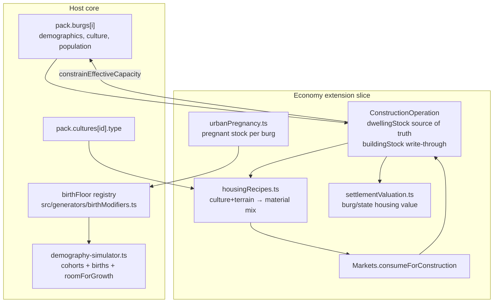
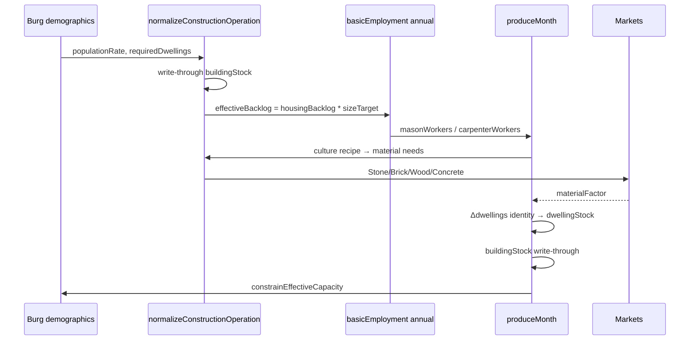

# Urban Housing / Settlement Housing System

| Field | Value |
| :--- | :--- |
| **Author** | Design draft (AI agent) |
| **Date** | 2026-08-02 |
| **Status** | Ready for implementation (rev. 4); **PR-H1 implemented 2026-08-02** |
| **Depends on** | [urban-construction-industry.md](./urban-construction-industry.md) Phase 1–3 (implemented 2026-07-31) |
| **Related** | [population-dynamics.md](../simulation/population-dynamics.md), [population-food-supply.md](../simulation/population-food-supply.md), [goods.md](../simulation/goods.md), [analytics/population.md](../analytics/population.md), city-generator v2 housing visuals |

---

## Overview

Medieval-ish burgs currently have (a) cohort population and logistic births, and (b) an aggregate `ConstructionOperation.buildingStock ∈ [0,1]` that drives mason/carpenter employment, Stone/Wood/Roman Concrete consumption, productivity, and `effectiveCapacity` caps — but **no explicit household or dwelling counts**, **no pregnancy pipeline**, **no per-culture housing materials beyond global `culturesSet === "highFantasy"`**, and **no housing-derived city valuation** for conquest/strategy.

> Product intent (JP): 都市に家を建てたい。人口から世帯・住戸を概算し、人口増に応じた必要家屋を出す。妊娠数が分かれば翌年の人口増の下限が分かる。文化で建材（木・石・煉瓦等）が決まり、交易量と建設雇用を生む。住宅ストックは都市価値→国家価値の根拠になり、戦争の「取る価値」計算を地に足の着いたものにする。

This design **extends** the existing economy-owned construction subsystem rather than replacing it. It introduces:

1. A **housing ledger** (`dwellingStock` count on `ConstructionOperation`) with households/required dwellings derived from urban population; **`buildingStock` is write-through** from that count (single source of truth).
2. A **lightweight pregnancy stock on urban burgs only** that yields a next-year birth lower bound without agent-based individuals.
3. **Culture + terrain housing recipes** that allocate material demand across Wood / Stone / Clay(→Brick) / Roman Concrete, extending (not ignoring) the quarry terrain gate.
4. A **valuation surface** (`getBurgSettlementValue` → state rollup) for later Nobility strategic AI, without implementing war AI in this workstream.

All housing simulation state stays in the **economy extension slice** (`simulation.extensions.economy`), keyed by `burgId`, consistent with `ConstructionOperation` and AGENTS.md context isolation.

---

## Background & Motivation

### Current state (verified in code)

| Area | Reality | Key files |
| :--- | :--- | :--- |
| Construction | `ConstructionOperation` per market-bearing burg: `buildingStock`, mason/carpenter workers, `hasQuarryAccess`; **no fort filter** | `constructionEmployment.ts`, `constructionEmploymentTypes.ts` |
| Target / backlog | `getTargetBuildingStock(adults) = 1 - exp(-adults/400)`; backlog → required workers | same |
| Materials | Stone + Roman Concrete (masons if quarry) and Wood (carpenters); market stock share 0.3/month | `produceMonth()` |
| Mason share | Terrain first (`hasQuarryAccess` → else 0 masons / all wood), then `culturesSet === "highFantasy"` bonus | `getMasonShare()` |
| Feedback | Productivity multiplier on production; `constrainEffectiveCapacity()` caps `effectiveCapacity` | quarterly + annual in `economy/index.tsx` |
| Births | Continuous: `births = femaleAdults * demographicBirthRate * deltaYears * roomForGrowth`; forts suppressed | `demography-simulator.ts` L173–196 |
| Pregnancy | **None** | — |
| Households | Analytics sketch only (`pop * populationRate / 4.5`); city-generator uses `pop / 5` for farmsteads | `docs/analytics/population.md`, city-generator v2 |
| Goods | Wood, Stone, Marble, Clay, Lime, Volcanic Ash, Roman Concrete, Ceramics (`recipes: [{ Clay: 1 }]`, construction tag, utilities demand). **No Brick good.** Goods doc notes culture→building materials as desired | `goods-generator.ts`, `docs/simulation/goods.md` |
| Valuation | Strategic planner: distance / historical ownership / fortification force ratio — **no housing value** | `strategic-planner.ts` |
| Ownership | Economy arrays in slice via `getSliceArray`/`setSliceArray`; host `Burg` not polluted | `economyContext.ts` L790–794 |
| Tick order | `advanceTime` runs `simulateDemographics` **before** `registerSimulationSystem` phases (`economy.tick` phase `"economy"`) | `timeEngine.ts`, `docs/simulation/advance-time.md` |

### Pain points

1. `buildingStock` is an opaque 0..1 saturation; UI and strategy cannot report “dwellings short by N houses.”
2. Material demand ignores burg culture (`burg.culture` → `pack.cultures[id].type`). Clay is unused by construction despite existing as a construction-tagged good (Ceramics uses Clay for utilities, not house-building).
3. Births are instantaneous continuous flow; players cannot inspect near-term natural growth lower bounds from pregnancies already “in flight.”
4. War/conquest “worth it” is pure military; a well-built capital and a shanty boomtown of equal population look identical economically.

### Relationship to urban-construction-industry.md

Phase 1–3 are **done** (quarries, construction ops, volcanic ash / Roman Concrete as Stone substitute — implementation overturned plan D4 EWMA). This document is the **housing / demography / culture / valuation layer on top of Phase 2**, not a rewrite. Unresolved items from §7.2 of that plan (true shipbuilding Wood priority via ExtensionAPI) remain orthogonal; housing increases Wood demand and makes that follow-up more important but does not implement priority switching here.

---

## Goals & Non-Goals

### Goals

1. Derive **households** and **required dwellings** from urban population using `worldContext.populationRate` (closed formula, K18).
2. Maintain a **built dwelling stock** advanced by construction labor + materials (not one-sim-per-house), with **`buildingStock` always write-through** from dwellings (K13).
3. Keep capacity/productivity reading `buildingStock` with unchanged external APIs (`getConstructionProductivityMultiplier`, `constrainEffectiveCapacity`).
4. Add a **pregnancy pipeline** for urban burgs; expose next-year birth lower bound; optional demography floor without double-counting.
5. Drive **material recipes from culture type + terrain**, producing trade/employment through markets.
6. Expose **burg and state housing valuation** for future strategic AI.
7. Scope v1 to **market burgs excluding forts** (K fort decision).
8. Place feature in the **economy extension**, reusing `ConstructionOperations` / `economyContext` / `registerSimulationSystem("economy.tick")`.

### Non-Goals

- Agent-based simulation of individual people or individual house polygons on the world map.
- Rural cell housing (farmsteads) in v1 — rural remains capacity/food-driven only. Pregnancy is urban-only.
- Coupling city-generator detail scenes to live `dwellingStock` (soft optional later).
- Full war AI rework or siege damage to housing (design hook only).
- Full manufacturing craft guilds for Brick (simple recipe good only).
- Changing host `Burg` type fields for housing (no host pollution).
- Replacing logistic births with pure pregnancy-driven births (pregnancy reports lower bounds and optionally floors continuous births).

---

## Proposed Design

### Architecture placement



**Layer rules (AGENTS.md):**

| Concern | Layer | Location |
| :--- | :--- | :--- |
| Housing stock mutation, recipes, valuation, pregnancy stock | Generator (economy) | `src/extensions/economy/generators/*` |
| Birth floor application with `deltaYears` | Generator (host) | `src/generators/birthModifiers.ts` + demography call site |
| Read-only display | Renderer / React UI | overview columns, Burg summaries |
| Enable/disable, registration | Editor / extension init | `economy/index.tsx` |

---

### Decision: dual stock — single source of truth (K13)

**`dwellingStock` is the only independently advanced housing quantity.**  
**`buildingStock` is a write-through saturation field** kept for API compatibility with existing capacity/productivity/employment call sites.

#### Hard invariant

After every mutation of `dwellingStock` **or** recomputation of `requiredDwellings` (population change):

```text
requiredDwellings = getRequiredDwellings(burg.population, worldContext.populationRate)
// Forts never hold ops (see Forts); requiredDwellings ≥ 1 for all ops that exist.

buildingStock = clamp01(dwellingStock / requiredDwellings)
```

| Rule | Spec |
| :--- | :--- |
| Who mutates `dwellingStock` | **Only** `ConstructionOperations.produceMonth()` for growth; `normalizeConstructionOperation` / `generate()` for seed/migration; tests may set it explicitly |
| Who mutates `buildingStock` | **Never independently.** No `buildingStock += growth`. Always reassign from the invariant after `dwellingStock` changes |
| Vacancy / overbuild | If population falls so `dwellingStock > requiredDwellings`: `buildingStock = 1`. **v1: no dwelling decay** (empty houses remain until a future ruin/conquest feature) |
| Call sites that read sat | Continue to use `operation.buildingStock` (always write-through) or pure `clamp01(dwellingStock / required)` — both equal after normalize |

```ts
export interface ConstructionOperation {
  i: number;
  burgId: number;
  marketId: number;
  masonWorkers: number;
  carpenterWorkers: number;
  /**
   * Write-through 0..1 saturation: always clamp01(dwellingStock / requiredDwellings).
   * Retained so getConstructionProductivityMultiplier / constrainEffectiveCapacity / UI stay stable.
   * MUST NOT be advanced by an independent += growth path.
   */
  buildingStock: number;
  hasQuarryAccess: boolean;
  active: boolean;
  /**
   * Built permanent dwellings (aggregate units). Source of truth for housing.
   * Required after normalize; archive-shaped ops use LegacyConstructionOperation
   * where this field is optional until normalizeConstructionOperation runs.
   */
  dwellingStock: number;
  /**
   * Optional civic/monument share 0..1. Deferred: v1 does not advance this;
   * omit or leave 0. Not part of buildingStock write-through until a later phase.
   */
  civicStock?: number;
}
```

**Derived (not stored):**

```text
people            = burg.population * populationRate   // worldContext.populationRate
households        = people / HOUSEHOLD_SIZE_URBAN      // 4.5
requiredDwellings = max(1, ceil(households))
housingSaturation = clamp01(dwellingStock / requiredDwellings)  // ≡ buildingStock after write-through
housingBacklog    = max(0, 1 - dwellingStock / requiredDwellings)
// equals max(0, 1 - buildingStock) **after** normalize/write-through only
// (before normalize, raw dwellingStock and buildingStock may diverge — never read backlog without normalize)
```

---

### Closed growth identity (K14)

Population-point labor math and absolute dwelling counts are linked by scaling **progress against `requiredDwellings`**, not by inventing “houses per worker” as a second free constant.

```text
// produceMonth — one economy production month
progressFactor = min(laborFactor, materialFactor)   // existing definitions
housingBacklog = max(0, 1 - dwellingStock / requiredDwellings)

// INTENTIONAL: growth uses full housingBacklog, NOT employment's effectiveBacklog (K16).
// Employment stays size-aware so hamlets do not monopolize the adult labor pool.
// Fill rate is intentionally full housing-gap so any fully staffed/supplied town closes
// ~25% of remaining dwelling gap per year toward sat=1, independent of sizeTarget.
Δdwellings = requiredDwellings
           * housingBacklog
           * BASE_ANNUAL_STOCK_GROWTH    // 0.25 (existing constant)
           * progressFactor
           / 12

dwellingStock' = min(requiredDwellings, dwellingStock + Δdwellings)   // v1 OVERBUILD_CAP = 1.0
buildingStock' = clamp01(dwellingStock' / requiredDwellings)
```

**Properties:**

- When `housingBacklog = 1` and full progress, annual Δsat ≈ **0.25** (close ~25% of the remaining gap). This is **faster than Phase 2** for small towns, where Phase 2 used `backlog ≈ sizeTarget − sat` so empty-hamlet annual Δsat was only ~`sizeTarget × 0.25` (e.g. ~0.024 at 40 adults). **Do not claim Phase 2 sat-trajectory parity for growth** — only employment demand is size-calibrated (K16).
- When `housingBacklog = 0`, `Δdwellings = 0`.
- Understaffing still slows fill: `progressFactor < 1` multiplies Δdwellings; small towns often have few workers (K16), so realized fill is softer than the full-gap formula alone suggests.
- `populationRate` enters only via `requiredDwellings`; material/worker rates stay on adult **points** + worker headcounts (existing).
- Bulk `advanceTime(1,0,0)` vs day-loop: construction advances only when `Production.produce()` / `produceMonth` runs (existing economy production cadence), not once per demography day — unchanged from Phase 2.

**Starter valuation material bundles** (same calibration story as construction intensity; used by valuation only):

| Constant | Starter | Rationale |
| :--- | ---: | :--- |
| `WOOD_PER_DWELLING` | 2.0 | ~0.2× annual carpenter wood-per-worker at 10 wood/worker·year → rough “worker-months” of timber per house |
| `STONE_PER_DWELLING` | 1.6 | ~0.2× `STONE_PER_MASON_WORKER_ANNUAL` (8) |
| `BRICK_PER_DWELLING` | 1.6 | Same mass scale as stone for mason-side masonry |
| `HOUSEHOLD_SIZE_URBAN` | 4.5 | analytics/population.md |
| `OVERBUILD_CAP` | 1.0 | v1 no intentional overbuild; migration clamp uses 1.2 only when **seeding** from legacy sat |

```text
unitCost(recipe) =
    (goodValue(Wood)  * recipe.wood  * WOOD_PER_DWELLING)
  + (goodValue(Stone) * recipe.stone * STONE_PER_DWELLING)
  + (goodValue(Brick) * recipe.brick * BRICK_PER_DWELLING)
// Expected order-of-magnitude ~5–20 for Generic with default good values
```

---

### Normalize-on-read migration (K15)

Archive ops may lack `dwellingStock`. `generate()` rebuilds **plain object literals** and only copies named fields — unknown fields are **not** passed through today. Therefore migration cannot rely on “defensive defaults” at arbitrary call sites alone.

**Single normalizer** — mandatory before any housing math:

```ts
/** Post-normalize op: dwellingStock is always a finite number. */
export type ConstructionOperation = { /* … */ dwellingStock: number; buildingStock: number; /* … */ };

/** Archive / pre-normalize shape: dwellingStock may be absent on old saves. */
export type LegacyConstructionOperation = Omit<ConstructionOperation, "dwellingStock"> & {
  dwellingStock?: number;
};

function normalizeConstructionOperation(
  op: ConstructionOperation | LegacyConstructionOperation,
  burg: { population?: number },
  populationRate: number
): ConstructionOperation {
  const required = getRequiredDwellings(burg.population ?? 0, populationRate);
  if (op.dwellingStock == null || Number.isNaN(op.dwellingStock)) {
    const sat = clamp01(op.buildingStock ?? 0);
    op.dwellingStock = clamp(sat * required, 0, required * 1.2);
  }
  op.dwellingStock = Math.max(0, op.dwellingStock);
  op.buildingStock = clamp01(op.dwellingStock / Math.max(required, 1));
  return op as ConstructionOperation;
}
```

On the interface used at rest after any normalize pass, `dwellingStock` is required. Callers that read archive arrays must type elements as `LegacyConstructionOperation[]` until normalized (or normalize immediately in the getter).

**Call sites (all of them):**

1. `ConstructionOperations.generate()` — after building each new literal, and **preserve** `previous?.dwellingStock` like workers/`buildingStock`.
2. `produceMonth()` — normalize each op at loop entry (load path without regenerate).
3. `getConstructionRequiredWorkers` / employment reconcile — normalize or require caller already normalized.
4. Valuation / overview readers — normalize or read via getter that normalizes.

**No archive schema version bump** if normalize-on-read is mandatory.

**Unit tests required:**

1. Archive-shaped op without `dwellingStock` → seed + sat sync.  
2. `generate()` preserves `dwellingStock` across regen.  
3. Clamp overshoot when sat * required would exceed 1.2× required at seed.  
4. produceMonth invariant: after month, `buildingStock === clamp01(dwellingStock / required)`.

**Pregnancy slice:** add `getUrbanPregnancy` / `setUrbanPregnancy` via `getSliceArray` / `setSliceArray` (same pattern as `constructionOperations`).

---

### Employment backlog formula (K16)

**Chosen formula (size-aware product — preserves Phase 2 scale):**

```text
housingBacklog   = max(0, 1 - dwellingStock / requiredDwellings)   // ∈ [0, 1]
sizeTarget       = getTargetBuildingStock(adults)                 // 1 - exp(-adults/400)
effectiveBacklog = housingBacklog * sizeTarget                    // ∈ [0, sizeTarget] ≤ 1

totalRequired = CONSTRUCTION_WORKERS_BASE
              + effectiveBacklog * adults * WORKERS_SHARE_PER_BACKLOG
// WORKERS_SHARE_PER_BACKLOG = 0.05 unchanged
// CONSTRUCTION_WORKERS_BASE = 1 unchanged
```

| Case | housingBacklog | sizeTarget (e.g.) | effectiveBacklog |
| :--- | ---: | ---: | ---: |
| Empty small town (40 adults) | 1.0 | ~0.095 | ~0.095 |
| Empty mid town (400 adults) | 1.0 | ~0.63 | ~0.63 |
| Empty huge | 1.0 | ~1.0 | ~1.0 |
| Fully housed any size | 0 | any | 0 |
| Half housed mid | 0.5 | 0.63 | ~0.315 |

**Why not pure dwelling-gap backlog (`min(1, gap/required)` alone) for employment?**  
That forces `effectiveBacklog = 1` for **every** empty market burg regardless of size — a silent global rebalance against Phase 2 mine/smelter competition under the shared adult pool and `MAX_ANNUAL_WORKER_CHANGE_SHARE = 0.25`. Product intent (“growth creates construction jobs”) is still met: empty large/frontier towns with high adults pull hard; tiny hamlets do not become max construction sinks.

**Growth vs employment (intentional split):**  
Δdwellings (K14) uses **full** `housingBacklog`; worker demand (K16) uses **size-aware** `effectiveBacklog`. Hamlets still *can* fill housing at full-gap rate when staffed and supplied, but they rarely claim enough adults to keep `progressFactor = 1`. Large empty towns both hire aggressively and fill at full gap.

**Calibration acceptance (PR-H1):** vitest fixtures for small/medium/large empty vs fully housed worker bands; assert empty-mid workers within a documented band (e.g. within ±20% of pre-housing Phase 2 empty-stock workers for same adults). Adjust only `WORKERS_SHARE_PER_BACKLOG` if bands fail — do not silently drop sizeTarget. Optionally assert empty fully-staffed monthly Δsat ≈ `housingBacklog * 0.25 / 12` (not `sizeTarget * 0.25 / 12`).

`getTargetBuildingStock` remains exported and used; it is **not** deleted.

---

### Forts (closed choice)

**Decision (A): no `ConstructionOperation` for `burg.group === "fort"`.**

| Concern | Behavior |
| :--- | :--- |
| `generate()` | Skip forts even if they have a market |
| Pregnancy | No record (already skip) |
| Valuation | `getBurgSettlementValue` → `null` |
| Rationale | Aligns with demography birth suppression; forts are garrisons not residential towns; avoids zero-`requiredDwellings` division special cases |

---

### Culture → building materials (K17)

#### Inputs

1. `burg.culture` → `pack.cultures[cultureId].type`
2. `hasQuarryAccess` (existing)
3. `highFantasy = useOptionsState.culturesSet === "highFantasy"`
4. `brickAvailable = Brick good exists && isGoodEnabled(Brick)`

#### Recipe table (preference shares before gates)

| Culture type | Wood | Stone | Brick |
| :--- | ---: | ---: | ---: |
| Highland | 0.25 | 0.60 | 0.15 |
| River | 0.30 | 0.20 | 0.50 |
| Lake | 0.30 | 0.20 | 0.50 |
| Naval | 0.55 | 0.25 | 0.20 |
| Hunting | 0.70 | 0.15 | 0.15 |
| Nomadic | 0.80 | 0.05 | 0.15 |
| Generic | 0.45 | 0.35 | 0.20 |

#### Terrain / availability gates (explicit extension of §7.1 decision 5)

**Phase 2 (live):** `!hasQuarryAccess` ⇒ `getMasonShare = 0` (all wood, no masons).

**This design extends that gate:**

| Material | Gate |
| :--- | :--- |
| **Stone** | Requires `hasQuarryAccess`. If false: `stone → 0`; **stone mass is redistributed proportionally across remaining enabled materials** (wood and brick if brick available; wood only if not). |
| **Brick** | Does **not** require quarry. River/Lake (and others with brick share) may employ **masons without quarry** when `brickAvailable`. If `!brickAvailable`: `brick → 0`; brick mass redistributed to remaining enabled (wood and stone if quarry; wood only if not). |
| **Wood** | Always available as residual. |

**Normative redistribute helper** (prose and pseudocode must match):

```ts
/** Move `mass` onto enabled channels proportional to their current shares; disabled stay 0. */
function redistributeToEnabled(
  mass: number,
  shares: { wood: number; stone: number; brick: number },
  enabled: { wood: boolean; stone: boolean; brick: boolean }
): { wood: number; stone: number; brick: number } {
  const w = enabled.wood ? shares.wood : 0;
  const s = enabled.stone ? shares.stone : 0;
  const b = enabled.brick ? shares.brick : 0;
  const sum = w + s + b;
  if (mass <= 0) return shares;
  if (sum <= 0) {
    // no enabled preference left — dump to wood if enabled, else first enabled flag
    if (enabled.wood) return { ...shares, wood: shares.wood + mass };
    if (enabled.brick) return { ...shares, brick: shares.brick + mass };
    if (enabled.stone) return { ...shares, stone: shares.stone + mass };
    return shares;
  }
  return {
    wood: shares.wood + (enabled.wood ? (mass * w) / sum : 0),
    stone: shares.stone + (enabled.stone ? (mass * s) / sum : 0),
    brick: shares.brick + (enabled.brick ? (mass * b) / sum : 0)
  };
}
```

Example: Highland base `{wood:0.25, stone:0.60, brick:0.15}`, no quarry, brick available → stone mass 0.60 split onto wood:brick = 0.25:0.15 → wood += 0.375, brick += 0.225 → before normalize `{0.625, 0, 0.375}` → after normalize same ratios. **Not** “dump all stone onto wood only.”

**Intentional product override:** decision 5 becomes *“terrain gates **stone** supply; brick/clay masonry may run without quarry; if neither stone nor brick, all carpenters / wood.”* Update unit tests that currently expect 0 masons when `!hasQuarryAccess` to distinguish brick-available vs not.

#### High Fantasy post-pass (closed algorithm)

```ts
export function getHousingRecipe(args: {
  cultureType: CultureType | undefined;
  hasQuarryAccess: boolean;
  highFantasy: boolean;
  brickAvailable: boolean;
}): HousingRecipe {
  let { wood, stone, brick } = BASE_TABLE[args.cultureType ?? "Generic"];

  if (!args.hasQuarryAccess) {
    const free = stone;
    stone = 0;
    ({ wood, stone, brick } = redistributeToEnabled(
      free,
      { wood, stone, brick },
      { wood: true, stone: false, brick: args.brickAvailable }
    ));
  }
  if (!args.brickAvailable) {
    const free = brick;
    brick = 0;
    ({ wood, stone, brick } = redistributeToEnabled(
      free,
      { wood, stone, brick },
      { wood: true, stone: args.hasQuarryAccess, brick: false }
    ));
  }
  // renormalize to simplex
  ({ wood, stone, brick } = normalize3(wood, stone, brick));

  if (args.highFantasy && args.hasQuarryAccess && stone + brick > 0) {
    // Move min(wood, HIGH_FANTASY_MASON_SHARE_BONUS) from wood → stone (0.2 points).
    // Brick share unchanged. Then clamp mason side (stone+brick) ≤ MAX_MASON_SHARE (0.8).
    const move = Math.min(wood, HIGH_FANTASY_MASON_SHARE_BONUS); // 0.2
    wood -= move;
    stone += move;
    const mason = stone + brick;
    if (mason > MAX_MASON_SHARE) {
      // push excess mason share back to wood, preferring cut from stone first
      const excess = mason - MAX_MASON_SHARE;
      const cutStone = Math.min(stone, excess);
      stone -= cutStone;
      wood += cutStone;
      const still = stone + brick - MAX_MASON_SHARE;
      if (still > 0) {
        brick -= still;
        wood += still;
      }
    }
    ({ wood, stone, brick } = normalize3(wood, stone, brick));
  }

  return { wood, stone, brick };
}

// Worker split
masonMaterialShare = stone + brick;      // after gates
carpenterMaterialShare = wood;
```

#### Brick good (closed choice vs Ceramics)

**Separate `Brick` good** (not Ceramics-as-construction):

| Field | Value |
| :--- | :--- |
| `name` | `"Brick"` |
| `tags` | `["construction"]` |
| `recipes` | `[{ Clay: 1, Wood: 0.1 }]` (firing fuel) |
| `demandCoverage` | `{ construction: 1 }` |
| `value` | `2` |
| `unit` | `"wain"` or `"load"` (match Clay scale) |
| `warEconomyType` | `"strategic"` (infrastructure) |
| `icon` | reuse clay-adjacent icon (e.g. `good-clay`) until art exists |
| Enablement | Always on (not gunpowder-era gated) |

**Why not Ceramics?** Ceramics already has `demandCoverage: { utilities: 1 }` and is a storage/household good path. Using it for house construction would conflate utility demand with building backlog and muddy craft employment attribution.

**Production:** existing recipe pipeline in `production-generator` manufactures any good with `recipes` when demand/coverage pulls it — Brick participates automatically. Clay stock competes with Ceramics; tests should assert Clay declines under brick-heavy River culture construction + manufacture.

**Extra Wood from brick firing:** `0.1` Wood per Brick unit is small vs carpenter `WOOD_PER_CARPENTER_WORKER_ANNUAL = 10`. Document as additional pressure on the same market Wood stock (indirect shipbuilding competition unchanged; no new priority switch).

#### Material demand in `produceMonth`

```text
required = getConstructionRequiredWorkers(...)  // uses effectiveBacklog above
recipe = getHousingRecipe(...)
masonShare = recipe.stone + recipe.brick

// Mason-side annual material “load” (existing scale)
masonLoad = required.mason * STONE_PER_MASON_WORKER_ANNUAL
// Split mason load between stone and brick by relative shares
stoneFrac = recipe.stone / max(recipe.stone + recipe.brick, ε)
brickFrac = recipe.brick / max(recipe.stone + recipe.brick, ε)
stoneNeedAnnual = masonLoad * stoneFrac
brickNeedAnnual = masonLoad * brickFrac
// Roman Concrete still substitutes **stone** portion first (efficiency 2), not brick
woodNeedAnnual  = required.carpenter * WOOD_PER_CARPENTER_WORKER_ANNUAL
// + brick firing wood is paid when Brick is manufactured, not double-charged here
```

---

### Pregnancy model (K7 / K18-site)

#### Storage

```ts
// simulation.extensions.economy.urbanPregnancy
export interface UrbanPregnancyRecord {
  burgId: number;
  /** Population points (same units as femaleAdults). */
  pregnant: number;
}
```

Single-bin pipeline with fixed gestation (no stored mean months — simpler):

```text
GESTATION_YEARS = 9/12
MAX_PREGNANT_FRACTION = 0.15
```

#### roomForGrowth parity with demography

```text
// Same as demography-simulator.ts L173–189 for burgs:
capacity = burg.demographics.capacity
effectiveCapacity = burg.demographics.effectiveCapacity ?? capacity
currentTotal = children + maleAdults + femaleAdults + elders  // population points
roomForGrowth = effectiveCapacity > 0
  ? max(-0.5, 1 - currentTotal / effectiveCapacity)
  : 0
// Conception only if roomForGrowth > 0 and burg.group !== "fort" and op/pregnancy applies
```

#### Observability path (PR-P1) — economy tick only

Economy `economy.tick` ages stock with `effectiveDeltaYears`:

```text
conceptions = femaleAdults * demographicBirthRate * effectiveDeltaYears * max(0, roomForGrowth)
conceptions = min(conceptions, max(0, MAX_PREGNANT_FRACTION * femaleAdults - pregnant))
pregnant += conceptions
due = pregnant * min(1, effectiveDeltaYears / GESTATION_YEARS)
pregnant -= due
// due is recorded for UI lower bound; demography not yet modified
expectedBirthsLowerBoundAnnual = pregnant / GESTATION_YEARS   // points/year
// UI people: * populationRate
```

**One-tick lag vs demography (documented, acceptable for observability):**  
`simulateDemographics` runs **before** `economy.tick` in `advanceTime`. Observability numbers update after demography in the same wall-clock advance; UI “expected births” reflects stock after economy’s update. Continuous births in demography still use the pre-pregnancy formula until PR-P2.

#### Birth floor path (PR-P2) — apply inside demography, not economy

Because demography precedes economy, **do not** apply floor from stock that economy would age later in the same `advanceTime` call.

**Chosen application site:** host registry callback invoked **from `simulateDemographics`** with `deltaYears`.

**Single ownership rule (no alternate branch):** when the birth floor provider is registered (PR-P2 active):

| Actor | Pregnancy responsibilities |
| :--- | :--- |
| **Provider (called from demography)** | **All** aging, conceptions, due completions; writes slice; returns `birthsFromPregnancy` |
| **Economy slice** | Storage only (records live here) |
| **`economy.tick`** | **UI / read-only** for pregnancy (lower-bound display). **Must not** age, conceive, or apply due on that stock |

When the provider is **not** registered (PR-P1 observability only): `economy.tick` owns aging/conception/due for display; demography ignores pregnancy.

**Closed PR-P2 contract:**

```ts
// src/generators/birthModifiers.ts (host; no import of economy modules)
export type BirthFloorProvider = (args: {
  burgId: number;
  femaleAdults: number;
  continuousBirths: number;
  roomForGrowth: number;
  deltaYears: number;
}) => number; // birthsFromPregnancy in population points

// demography burg branch (non-fort, roomForGrowth > 0):
continuousBirths = femaleAdults * baseGrowthRate * deltaYears * roomForGrowth
birthsFromPregnancy = birthFloorProvider?.({ ... }) ?? 0
births = max(continuousBirths, birthsFromPregnancy)
// NEVER sum continuous + pregnancy
children += births
```

Provider implementation (economy module, registered on init):

```text
// Age stock by deltaYears, compute due, apply conceptions with same room formula,
// write back to urbanPregnancy slice, return due as birthsFromPregnancy.
// Guard: economy.tick checks isBirthFloorProviderActive() and skips pregnancy mutation entirely.
```

**Determinism:** rate-based; no RNG.  
**Bulk vs day loop:** provider always receives the same `deltaYears` demography sees for that `advanceTime` call (1.0 vs ~1/365) — correct for both paths.  
**Economy must not import `demography-simulator`.** Registry lives in host `src/generators/`. This is a **new** pattern (food stress today is a direct host import of `agriculturalStress.ts`, not a registry).

---

### Trade & employment loop



**Unchanged:** market-burg ops (minus forts), annual slot order, monthly produce from `production-generator`, indirect Wood competition with shipbuilding.

---

### Valuation surface (PR-V)

```ts
export interface BurgSettlementValue {
  burgId: number;
  housingValue: number;
  infrastructureValue: number; // 0 in v1
  total: number;
}

/** null when economy disabled, no ConstructionOperation, or fort/non-market. */
export function getBurgSettlementValue(burgId: number): BurgSettlementValue | null;

export function getStateSettlementValue(stateId: number): number; // sum; 0 if none
```

```text
// Replacement cost at current recipe (v1 — not historical build mix)
housingValue = dwellingStock * unitCost(getHousingRecipe(...))
fortificationPremium = (burg.walls ? 0.15 : 0) + (burg.citadel ? 0.25 : 0)
total = housingValue * (1 + fortificationPremium)
infrastructureValue = 0
```

**Access path:**

- Built-in Nobility may `import` economy generator modules (same package graph as other built-in cross-imports, e.g. conquest disruption). Prefer importing `settlementValuation.ts` only.
- Dynamic ZIP extensions **must not** import host/economy modules; a future `extensionAPI` action can wrap the pure function if needed — out of scope.
- Economy disabled / no op → `null` / state sum `0`.

**Non-normative future planner blend (not implemented):**

```text
targetScore ∝ getBurgSettlementValue(b).total
              / (requiredAttackForce * (1 + distanceFactor))
// blend with historical ownership bonus already in strategic-planner
```

---

### Rural vs urban scope

| Scope | v1 |
| :--- | :--- |
| Market burgs, not forts | Yes |
| Forts | No op |
| Burgs without markets | No op (unchanged generate gate) |
| Rural cells | No housing, no pregnancy |

---

### Feature placement

| Option | Verdict |
| :--- | :--- |
| **Economy extension (chosen)** | Materials, markets, employment, slice, construction already here |
| New extension | Hard economy dependency |
| Core demography | Only birth-floor **application** via thin host registry; stock stays economy |

---

### City-generator relationship

| System | Purpose | Coupling |
| :--- | :--- | :--- |
| Economy `dwellingStock` | Sim materials/jobs/capacity/valuation | Source of truth map-scale |
| City-generator v2 | Detail scene layout | `pop/5` budget; **independent** |

Future optional one-way: pass `round(dwellingStock)` into city scene as display override only. Never write geometry back.

---

### Lifecycle

| Event | Behavior |
| :--- | :--- |
| `generate()` | Skip forts; market burgs only; preserve `previous?.dwellingStock`; normalize write-through |
| `produceMonth` / employment / valuation | `normalizeConstructionOperation` first |
| `clear()` / economy disable | Clear construction ops + pregnancy; unregister birth floor provider |
| `fmg:generate-post-core` / regenerate | Existing economy generate chain |
| `fmg:world-loaded` | Slice restore; **no generate required** — normalize on first read |
| Host-only (economy off) | No ledger, continuous births only |

---

## API / Interface Changes

```ts
// constructionEmploymentTypes.ts — additive
dwellingStock: number; // required on ConstructionOperation after normalize
civicStock?: number; // unused v1

/** Pre-normalize / archive element: dwellingStock may be missing. */
export type LegacyConstructionOperation = Omit<ConstructionOperation, "dwellingStock"> & {
  dwellingStock?: number;
};

// housingRecipes.ts
export type HousingMaterial = "wood" | "stone" | "brick";
export interface HousingRecipe { wood: number; stone: number; brick: number; }
export function getHousingRecipe(args: {
  cultureType: CultureType | undefined;
  hasQuarryAccess: boolean;
  highFantasy: boolean;
  brickAvailable: boolean;
}): HousingRecipe;

// constructionEmployment.ts
export function getHouseholds(populationPoints: number, populationRate: number): number;
export function getRequiredDwellings(populationPoints: number, populationRate: number): number;
export function normalizeConstructionOperation(
  op: ConstructionOperation | LegacyConstructionOperation,
  burg: { population?: number },
  populationRate: number
): ConstructionOperation;

export function getConstructionRequiredWorkers(
  operation: Pick<ConstructionOperation, "dwellingStock" | "buildingStock" | "hasQuarryAccess">,
  adults: number,
  requiredDwellings: number
): { mason: number; carpenter: number };
// uses effectiveBacklog = housingBacklog * getTargetBuildingStock(adults)

// urbanPregnancy.ts + economyContext getters/setters
// settlementValuation.ts
// birthModifiers.ts (host)
```

---

## Data Model Changes

| Location | Change |
| :--- | :--- |
| `ConstructionOperation` | +`dwellingStock` (required after normalize); optional `civicStock` |
| Economy slice | +`urbanPregnancy[]` |
| Goods | +`Brick` |
| Host `Burg` | **No new fields** |
| `buildingStock` | Write-through only (semantics documented) |

---

## Alternatives Considered

### A. Display-only housing counts

Derive households/required for UI; keep pure `buildingStock` sim.  
**Rejected:** cannot track true deficit under pop shocks for materials/valuation.

### B. Separate `HousingOperation[]` array

**Rejected:** dual lifecycle with construction employment.

### C. Agent-based houses

**Rejected:** performance and construction plan non-goals.

### D. Pregnancy on host `BurgDemographics`

**Rejected:** host pollution; economy disable messy.

### E. Materials only from biome

**Rejected** as sole driver; terrain gates stone, culture sets preference.

### F. Ephemeral dwellings: no stored `dwellingStock`

Keep `buildingStock` as sole sim state; display `built = buildingStock * requiredDwellings`; drive backlog from `1 - buildingStock` (same as housingBacklog if sat is sole state).

- **Pros:** No dual-write; trivial migration; meets most UI “how many houses?” questions.
- **Cons:** When population **drops**, required falls and “built” count shrinks with no demolition event (false destruction). When population **surges**, required jumps and the same sat implies more “instant” houses than materials ever paid for. Valuation and material accounting need a stock that **does not rescale with population** — only sat does. Independent `dwellingStock` survives pop shocks (vacancy when pop falls; gap when pop rises) without inventing houses.
- **Rejected** in favor of stored `dwellingStock` + write-through sat (K1/K13). Strengthens why K1 is not optional complexity.

---

## Security & Privacy

Offline sim: slice fields, normalize corrupt data, deterministic rates, built-in-only imports for valuation. No PII.

---

## Observability

| Signal | When |
| :--- | :--- |
| Dwellings / households / gap % | **Debug column in PR-H1** (not deferred to polish-only PR) |
| produceMonth sat identity | Unit tests every PR that touches growth |
| Archive normalize | Unit tests PR-H1 |
| Pregnancy LB | Burg summary PR-P1 |
| Valuation | PR-V + optional overview |
| Gates | `npx vitest run src/extensions/economy` (+ demography tests for PR-P2); `tsc --noEmit`; `npm run lint`; `npm run madge` after birthModifiers (ensure no economy→demography-simulator import cycle) |

---

## Risks

| Risk | Severity | Mitigation |
| :--- | :--- | :--- |
| Dual-stock drift | Critical | K13 write-through; forbid `buildingStock +=`; tests |
| Employment global rebalance | Major | K16 size-aware product backlog; fixture bands |
| Brick masons without quarry surprise | Major | K17 explicit decision-5 extension; update tests |
| Pregnancy double-birth / tick order | Major | Observability first; floor only via demography provider; never sum |
| Migration NaN after load | Critical | K15 normalize on produceMonth/generate/readers |
| Brick firing Wood + carpenter Wood | Medium | Small 0.1 recipe; document shipbuilding stock competition |
| Capital overvaluation for future AI | Low | Modest unitCost; non-normative blend sketch |
| City-generator confusion | Low | Explicit independence |

---

## Rollout Plan

1. Entire feature behind **economy extension enabled**.
2. Optional later kill switch `simUrbanHousing` only if calibration needs it — not required for v1.
3. Incremental PRs below; each green on project quality gates.
4. Rollback: revert PR stack; normalize treats missing fields; old clients ignore unknown JSON fields.

---

## Open Questions

**User confirmation 2026-08-02: proceed with all v1 defaults; no scope expansion before PR-H1.**

| # | Topic | v1 resolution |
| :--- | :--- | :--- |
| 1 | **Civic stock** | **Resolved for v1 — deferred.** Do not advance residual civic after housing sat ≈ 1. `civicStock` unused; `buildingStock` is pure housing saturation (K2). |
| 2 | Brick vs Ceramics | **Decided earlier:** separate Brick good (see K6 / culture materials). |
| 3 | Pregnancy observability vs floor | **Decided earlier:** phased PR-P1 then PR-P2 (K7 / K19). |
| 4 | Household size by culture | **Resolved for v1:** `HOUSEHOLD_SIZE_URBAN = 4.5` for **all** cultures (including Nomadic). No culture-specific household sizes. |
| 5 | Multi-family capitals | **Resolved for v1:** `k = 1` — `requiredDwellings = ceil(households)` (one household one dwelling). No capital multi-family factor. |
| 6 | Conquest damage to `dwellingStock` | **Resolved for v1 — hook only.** No sim damage/transfer of dwellings on capture in this workstream. |
| 7 | Shipbuilding Wood priority ExtensionAPI | **Resolved for v1 — follow-up after housing lands.** Indirect market stock competition only (unchanged Phase 2). |

No open product questions remain that block PR-H1.

---

## References

- `docs/plan/urban-construction-industry.md`
- `docs/simulation/population-dynamics.md`, `population-food-supply.md`, `advance-time.md`, `goods.md`
- `docs/analytics/population.md`
- `docs/plan/city-generator/v2/16-compact-village.md`
- `src/extensions/economy/generators/constructionEmployment.ts`
- `src/generators/demography-simulator.ts`
- `src/extensions/nobility/generators/strategic-planner.ts`

---

## Key Decisions

| # | Decision | Rationale |
| :--- | :--- | :--- |
| K1 | Store `dwellingStock` on `ConstructionOperation` | Survives pop shocks; one lifecycle with construction |
| K2 | v1 civic deferred; sat is pure housing | Minimal capacity/productivity churn |
| K3 | Employment uses **size-aware** backlog (see K16) | Product signal without maxing every empty hamlet |
| K4 | Economy slice only; no host Burg housing fields | AGENTS.md + construction precedent |
| K5 / **K17** | CultureType recipe + **stone-only quarry gate**; brick masons allowed without quarry | Extends §7.1 decision 5 explicitly; River/Lake brick flavor |
| K6 | Separate Brick good (Clay+0.1 Wood), not Ceramics | Utilities vs construction demand separation |
| K7 | Pregnancy economy-owned; observability then demography floor | Avoid double-birth; respect tick order |
| K8 | Market burgs only; **forts excluded from ops** | Birth suppression parity; avoid zero-required edge cases |
| K9 | Valuation pure API; no war AI change | Clean future surface |
| K10 | City-generator decoupled | Different household constants |
| K11 | Feature in economy extension | Materials/markets/employment |
| K12 | Deterministic rate-based pregnancy | Save/replay integrity |
| **K13** | **`buildingStock` write-through only:** `buildingStock = clamp01(dwellingStock / requiredDwellings)` after every dwelling/required change; **forbid** independent `buildingStock += growth`; only `produceMonth` grows `dwellingStock` | Prevents dual-stock drift (Issue 1) |
| **K14** | **Growth identity uses full `housingBacklog` (not K16 `effectiveBacklog`):** `Δdwellings = required * housingBacklog * 0.25 * progress / 12`; cap at `required`; write-through sat. Employment alone is size-aware. Fill rate intentionally closes ~25% of remaining gap/year when fully staffed — **not** Phase 2 sat-trajectory parity for hamlets. Valuation bundles as in table; people = `pop * populationRate / 4.5` | Closed formula; intentional growth/employment split |
| **K15** | **`normalizeConstructionOperation(op: ConstructionOperation \| LegacyConstructionOperation, …)`** on generate, produceMonth entry, employment, valuation; seed if `dwellingStock` missing; preserve `previous?.dwellingStock` in generate | Load path without regenerate; archive typing |
| **K16** | **Employment only:** `effectiveBacklog = housingBacklog * getTargetBuildingStock(adults)`. Does **not** enter Δdwellings (see K14) | Preserves Phase 2 worker scale; still tracks housing deficit |
| **K18** | Household/dwelling units **always** `populationPoints * populationRate / 4.5` (ceil for required); never pure point-space house counts | Matches analytics; single scale (Issue 16) |
| **K19** | PR-P2: **provider owns all** pregnancy aging/conception/due; `economy.tick` is read-only for pregnancy when provider registered; never sum continuous+pregnancy; one-tick lag OK for PR-P1 observability only | Tick order; no double-age branch |
| **K20** | High Fantasy: move `min(wood, 0.2)` wood→stone when quarry; clamp mason ≤ 0.8; brick unchanged. Gate redistribute is **proportional** to remaining enabled shares (`redistributeToEnabled`), not wood-only dump | HF + stone gate implementable |

---

## PR Plan

Each PR mergeable, green on `tsc` / lint / madge / economy vitest. Builds on Phase 1–3.

### PR-H1 — Ledger + growth identity + backlog + normalize *(merged former PR1+PR3)*

- **Title:** `feat(economy): dwelling stock ledger, write-through sat, size-aware housing backlog`
- **Files:** `constructionEmploymentTypes.ts`, `constructionEmployment.ts`, `constructionEmployment.test.ts`, `basicEmployment.ts` (call signature if needed), `economyContext.ts` if needed
- **Work:**
  - Add `dwellingStock`; implement K13–K16, K18
  - `normalizeConstructionOperation`; preserve dwelling on `generate()`; skip forts
  - `produceMonth` uses Δdwellings identity; **delete independent `buildingStock +=`**
  - Employment uses `effectiveBacklog = housingBacklog * sizeTarget`
  - **Debug/overview column or burg summary lines for dwellings/gap** (not polish-only)
- **Acceptance:**
  - Tests: archive op without dwellingStock; generate preserves dwelling; overshoot seed clamp; post-month sat identity; empty small/mid/large worker bands vs fully housed; fort skipped
  - `npx vitest run src/extensions/economy` green
- **Deps:** None
- **Note:** Do **not** ship user-facing “housing drives jobs” messaging until this PR lands complete — intermediate half-state is not a product milestone.

### PR-M — Culture recipes + Brick good *(former PR2)*

- **Title:** `feat(economy): culture housing recipes and Brick good`
- **Files:** `housingRecipes.ts` + tests; `goods-generator.ts`; `constructionEmployment.ts` consume path; update mason-share tests for brick-without-quarry
- **Work:** K17/K20 recipe + gates; Brick GOODS_DATA; stone-only quarry gate; HF post-pass; manufacture Clay pressure test
- **Acceptance:** Highland+quarry stone-heavy; no quarry + brickAvailable → masons > 0 for River; no quarry + !brick → all wood; HF moves wood→stone only with quarry; Clay stock declines under brick construction+production
- **Deps:** PR-H1

### PR-P1 — Pregnancy observability *(former PR4)*

- **Title:** `feat(economy): urban pregnancy pipeline (observability)`
- **Files:** `urbanPregnancy.ts` + tests; economyContext getters; economy.tick; burg summary LB
- **Work:** Conception/gestation stock; UI lower bound; **no demography change**; roomForGrowth parity; skip forts
- **Acceptance:** Steady-state pregnant ≤ 15% female adults; zero when no room; forts skipped
- **Deps:** None strictly (can parallel PR-M after PR-H1); tick only needs economy enabled

### PR-P2 — Birth floor *(former PR5)*

- **Title:** `feat(demography): birth floor provider for urban pregnancy`
- **Files:** `src/generators/birthModifiers.ts`; `demography-simulator.ts`; economy init/cleanup registration; demography + economy tests
- **Work:** K19; `births = max(continuous, due)`; economy disables duplicate aging when provider set; `madge` clean
- **Acceptance:** Near-term stock ⇒ births ≥ due under room; overpopulation still no births; no import cycle
- **Deps:** PR-P1

### PR-V — Settlement valuation *(former PR6)*

- **Title:** `feat(economy): burg and state housing valuation API`
- **Files:** `settlementValuation.ts` + tests; optional overview column
- **Work:** unitCost table; null when no op; state sum; replacement cost = current recipe
- **Acceptance:** value scales with dwellingStock; null for fort/disabled; state sum = Σ burgs
- **Deps:** PR-H1, PR-M (recipe costs)

### PR-UI — Docs & remaining UI polish *(former PR7)*

- **Title:** `docs+ui(economy): housing docs cross-links and overview polish`
- **Files:** docs pointers from urban-construction-industry.md; remaining columns/tooltips
- **Deps:** PR-H1–PR-V as available
- **Note:** Core debug dwellings column already in PR-H1

### Merge order

```text
PR-H1 ──┬──► PR-M ──► PR-V ──► PR-UI
        └──► PR-P1 ──► PR-P2 ─┘
```

PR-M and PR-P1 may run in parallel after PR-H1.

### Per-PR quality gate (project rules)

```text
npx tsc --noEmit
npm run lint
npm run madge
npx vitest run src/extensions/economy
# PR-P2 also: demography unit tests
```
